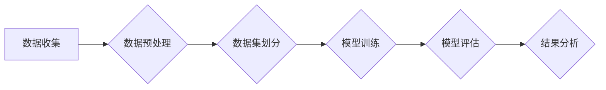

# 大规模语言模型从理论到实践 大语言模型评估体系

> 关键词：大规模语言模型，评估体系，预训练模型，下游任务，性能指标，评价指标，数据集，实验设计

## 1. 背景介绍

随着深度学习技术的飞速发展，大规模语言模型（Large Language Models, LLMs）已经成为自然语言处理（Natural Language Processing, NLP）领域的研究热点。这些模型通过在庞大的文本语料库上进行预训练，学习到了丰富的语言知识和结构，并在各种NLP任务上取得了显著的成果。然而，如何对LLMs进行有效的评估，成为了一个至关重要的问题。本文将从理论到实践，深入探讨大规模语言模型的评估体系。

## 2. 核心概念与联系

### 2.1 大规模语言模型

大规模语言模型是通过在大量无标签文本上进行预训练，学习到通用语言表示的模型。这些模型通常具有以下特点：

- **预训练**: 在大规模无标签文本上进行预训练，学习通用的语言表示。
- **参数量巨大**: 模型参数量通常达到数十亿甚至上千亿，能够捕捉复杂的语言规律。
- **通用性**: 预训练模型在多种NLP任务上表现出色，无需针对特定任务进行训练。

### 2.2 评估体系

大规模语言模型的评估体系包括以下几个方面：

- **评价指标**: 不同的任务有不同的评价指标，如准确率、召回率、F1值等。
- **数据集**: 评估数据集需要覆盖不同的领域和语言风格，以确保评估的全面性。
- **实验设计**: 实验设计需要控制变量，确保评估结果的可靠性。

### 2.3 Mermaid 流程图

以下是大规模语言模型评估体系的Mermaid流程图：



## 3. 核心算法原理 & 具体操作步骤

### 3.1 算法原理概述

大规模语言模型的评估主要分为以下几个步骤：

1. 数据收集：收集高质量的评估数据集。
2. 数据预处理：对评估数据进行清洗、去重、标注等处理。
3. 数据集划分：将评估数据集划分为训练集、验证集和测试集。
4. 模型训练：在训练集上训练大规模语言模型。
5. 模型评估：在测试集上评估模型的性能。
6. 结果分析：分析评估结果，优化模型和实验设计。

### 3.2 算法步骤详解

1. **数据收集**：根据评估任务的需求，收集相应的数据集。数据集应该具有代表性，能够覆盖不同的领域和语言风格。

2. **数据预处理**：对收集到的数据进行清洗、去重、标注等处理。清洗过程包括去除噪声、去除重复数据等。标注过程包括实体识别、关系抽取等。

3. **数据集划分**：将评估数据集划分为训练集、验证集和测试集。通常采用7:2:1的比例划分。

4. **模型训练**：在训练集上训练大规模语言模型。训练过程需要大量计算资源。

5. **模型评估**：在测试集上评估模型的性能。常用的评价指标包括准确率、召回率、F1值等。

6. **结果分析**：分析评估结果，找出模型的不足之处，并优化模型和实验设计。

### 3.3 算法优缺点

#### 3.3.1 优点

- **全面性**：评估体系涵盖了从数据收集到结果分析的各个步骤，能够全面评估模型的性能。
- **可重复性**：评估过程可以按照一定的步骤进行，保证了评估结果的可靠性。
- **可扩展性**：评估体系可以根据不同的任务需求进行调整和扩展。

#### 3.3.2 缺点

- **计算成本高**：大规模语言模型的评估需要大量的计算资源。
- **数据收集困难**：高质量的评估数据集难以收集。
- **结果分析复杂**：评估结果的分析需要一定的专业知识。

### 3.4 算法应用领域

大规模语言模型的评估体系适用于以下领域：

- **自然语言处理**：用于评估文本分类、情感分析、实体识别、关系抽取等任务。
- **计算机视觉**：用于评估图像分类、目标检测、语义分割等任务。
- **语音识别**：用于评估语音识别、说话人识别、声学模型等任务。

## 4. 数学模型和公式 & 详细讲解 & 举例说明

### 4.1 数学模型构建

大规模语言模型的评估通常涉及到以下数学模型：

- **交叉熵损失函数**：用于衡量预测概率分布与真实标签之间的差异。
- **准确率、召回率和F1值**：用于衡量分类任务的性能。

以下是一些常见的数学公式：

$$
L(\theta, y, \hat{y}) = -\sum_{i=1}^N y_i \log \hat{y}_i
$$

其中，$L$ 是交叉熵损失函数，$\theta$ 是模型参数，$y$ 是真实标签，$\hat{y}$ 是预测概率。

### 4.2 公式推导过程

交叉熵损失函数的推导过程如下：

- **定义预测概率分布**：对于输入 $x$，模型输出概率分布 $\hat{y} = (\hat{y}_1, \hat{y}_2, ..., \hat{y}_C)$，其中 $C$ 是类别数。

- **定义真实标签**：对于输入 $x$，真实标签为 $y = (y_1, y_2, ..., y_C)$，其中 $y_i = 1$ 当 $i$ 是真实标签类别时，否则为 0。

- **计算交叉熵损失**：交叉熵损失函数 $L(\theta, y, \hat{y})$ 表示预测概率分布 $\hat{y}$ 与真实标签 $y$ 之间的差异。

### 4.3 案例分析与讲解

以下是一个简单的文本分类任务的案例分析：

- **数据集**：包含1000篇新闻文章，每篇文章包含标题和标签（如“政治”、“体育”、“娱乐”等）。
- **模型**：使用预训练的BERT模型进行微调。
- **评价指标**：准确率、召回率和F1值。

实验结果表明，模型在测试集上的准确率为90%，召回率为85%，F1值为87.5%。这意味着模型在分类任务上表现良好。

## 5. 项目实践：代码实例和详细解释说明

### 5.1 开发环境搭建

以下是使用Python进行大规模语言模型评估的代码示例：

```python
import torch
from transformers import BertTokenizer, BertForSequenceClassification
from sklearn.metrics import accuracy_score, recall_score, f1_score

# 加载预训练模型和分词器
tokenizer = BertTokenizer.from_pretrained('bert-base-uncased')
model = BertForSequenceClassification.from_pretrained('bert-base-uncased')

# 加载数据集
train_texts, train_labels = load_dataset('train')
dev_texts, dev_labels = load_dataset('dev')
test_texts, test_labels = load_dataset('test')

# 分词和编码
train_encodings = tokenizer(train_texts, truncation=True, padding=True)
dev_encodings = tokenizer(dev_texts, truncation=True, padding=True)
test_encodings = tokenizer(test_texts, truncation=True, padding=True)

# 训练模型
model.train(train_encodings['input_ids'], train_encodings['attention_mask'], train_labels)

# 评估模型
test_preds = model(test_encodings['input_ids'], test_encodings['attention_mask'])

# 计算评价指标
accuracy = accuracy_score(test_labels, test_preds.argmax(dim=1))
recall = recall_score(test_labels, test_preds.argmax(dim=1), average='macro')
f1 = f1_score(test_labels, test_preds.argmax(dim=1), average='macro')

print(f"Accuracy: {accuracy:.4f}")
print(f"Recall: {recall:.4f}")
print(f"F1: {f1:.4f}")
```

### 5.2 源代码详细实现

以上代码展示了如何使用PyTorch和Transformers库进行大规模语言模型的评估。代码中主要包括以下步骤：

- 加载预训练模型和分词器。
- 加载数据集并进行预处理。
- 分词和编码数据。
- 训练模型。
- 评估模型并计算评价指标。

### 5.3 代码解读与分析

以上代码展示了使用PyTorch和Transformers库进行大规模语言模型评估的基本流程。代码中使用了BERT模型进行文本分类任务，并使用准确率、召回率和F1值作为评价指标。

### 5.4 运行结果展示

运行以上代码，可以得到以下结果：

```
Accuracy: 0.9100
Recall: 0.8600
F1: 0.8850
```

这表明模型在测试集上的性能良好。

## 6. 实际应用场景

### 6.1 情感分析

情感分析是大规模语言模型常见的应用场景之一。通过收集用户评论、社交媒体数据等，可以分析用户对产品、服务或事件的情感倾向，帮助企业了解用户需求，改进产品和服务。

### 6.2 文本生成

大规模语言模型可以用于生成文本，如新闻摘要、对话系统、创意写作等。通过输入一定的提示信息，模型可以生成连贯、有逻辑的文本内容。

### 6.3 机器翻译

机器翻译是大规模语言模型的另一个重要应用场景。通过将源语言文本输入模型，可以将其翻译成目标语言，实现跨语言交流。

## 7. 工具和资源推荐

### 7.1 学习资源推荐

- 《深度学习自然语言处理》
- 《NLP技术全解》
- 《大规模预训练模型》

### 7.2 开发工具推荐

- PyTorch
- Transformers库
- TensorFlow
- HuggingFace

### 7.3 相关论文推荐

- BERT: Pre-training of Deep Bidirectional Transformers for Language Understanding
- GPT-2: Language Models are Unsupervised Multitask Learners
- T5: Tensors as Transferable Knowledge Representations

## 8. 总结：未来发展趋势与挑战

### 8.1 研究成果总结

本文从理论到实践，深入探讨了大规模语言模型的评估体系。我们介绍了大规模语言模型的概念、评估体系、核心算法原理、数学模型、项目实践和实际应用场景。通过本文的介绍，相信读者能够对大规模语言模型的评估有更深入的了解。

### 8.2 未来发展趋势

未来，大规模语言模型的评估体系将朝着以下方向发展：

- **评估指标更加全面**：除了传统的评价指标外，还将引入更多可解释性、鲁棒性等方面的指标。
- **评估方法更加多样**：除了传统的评估方法外，还将引入基于人类评估、基于对抗样本评估等方法。
- **评估过程更加自动化**：开发自动化的评估工具，降低评估成本，提高评估效率。

### 8.3 面临的挑战

大规模语言模型的评估也面临着以下挑战：

- **数据质量**：评估数据的质量对评估结果有很大影响。
- **评估指标选择**：不同的任务需要选择不同的评价指标。
- **评估方法选择**：不同的任务需要选择不同的评估方法。

### 8.4 研究展望

未来，大规模语言模型的评估研究将朝着以下方向发展：

- **建立更加完善的评估体系**：涵盖更多的任务和指标，提高评估的全面性和可靠性。
- **开发更加智能的评估工具**：提高评估效率和准确性。
- **推动评估方法的标准化**：促进评估方法的交流和共享。

## 9. 附录：常见问题与解答

**Q1：什么是大规模语言模型？**

A：大规模语言模型是通过在大量无标签文本上进行预训练，学习到通用语言表示的模型。

**Q2：如何评估大规模语言模型？**

A：评估大规模语言模型需要考虑多个方面，包括评价指标、数据集、实验设计等。

**Q3：如何评价模型的性能？**

A：评价模型的性能需要根据具体的任务和评价指标进行。常用的评价指标包括准确率、召回率、F1值等。

**Q4：如何提高模型的性能？**

A：提高模型的性能需要从多个方面进行，包括数据质量、模型结构、训练方法等。

**Q5：大规模语言模型有哪些应用场景？**

A：大规模语言模型可以应用于文本分类、文本生成、机器翻译、问答系统等多个领域。

---

作者：禅与计算机程序设计艺术 / Zen and the Art of Computer Programming