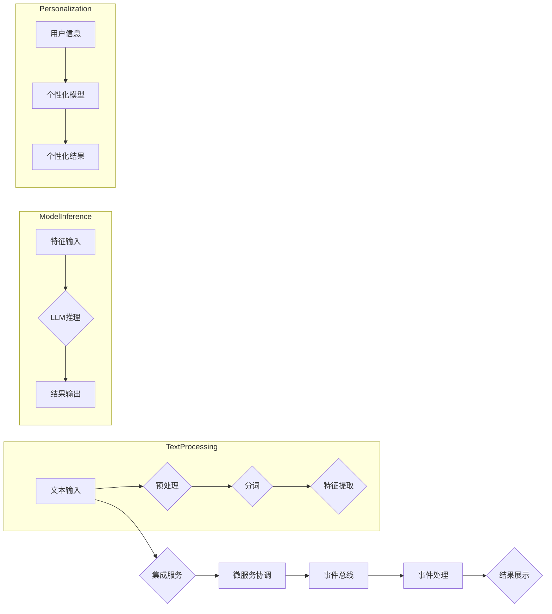

> 关键词：大语言模型，ReAct 框架，自然语言处理，对话系统，个性化推荐，迁移学习，模型集成，智能应用

# 大语言模型应用指南：ReAct 框架

在人工智能领域，大语言模型（Large Language Model, LLM）如BERT、GPT系列等取得了显著的进展，它们在自然语言处理（Natural Language Processing, NLP）领域展现了前所未有的能力。然而，将LLM应用于实际场景时，往往面临着模型复杂度高、部署困难、个性化不足等问题。本文将深入探讨ReAct框架，这是一种专门为LLM应用设计的框架，旨在解决上述挑战，并提供一个高效、可扩展的应用指南。

## 1. 背景介绍

随着深度学习技术的飞速发展，大语言模型在文本生成、机器翻译、情感分析等NLP任务上取得了突破性进展。然而，LLM的应用并非一帆风顺。以下是一些常见的挑战：

- **模型复杂性**：LLM通常包含数十亿甚至数千亿参数，导致模型训练和推理资源消耗巨大。
- **部署困难**：将LLM集成到现有系统中，需要考虑与现有架构的兼容性、服务化部署等问题。
- **个性化不足**：LLM通常针对通用语言进行训练，难以满足特定用户或场景的个性化需求。
- **迁移学习**：如何将预训练的LLM迁移到新的应用场景，是另一个关键问题。

ReAct框架应运而生，它旨在解决上述挑战，为LLM的应用提供一套完整的解决方案。

## 2. 核心概念与联系

### 2.1 ReAct框架概述

ReAct框架是一个基于微服务和事件驱动的框架，它通过以下核心概念实现LLM的灵活应用：

- **微服务架构**：将LLM应用分解为多个独立的服务，每个服务负责特定的功能，如文本处理、推理、个性化推荐等。
- **事件驱动**：服务之间通过事件进行通信，实现模块化的数据处理和功能调用。
- **模型集成**：支持多种LLM的集成，并提供统一接口，简化模型切换和部署。

### 2.2 Mermaid流程图

以下是一个简化的ReAct框架流程图：



### 2.3 关键概念联系

- **微服务架构**：将LLM应用拆分为多个微服务，实现模块化和可扩展性。
- **事件驱动**：微服务之间通过事件进行通信，实现灵活的数据处理和功能调用。
- **模型集成**：集成不同LLM，并通过统一接口提供服务，简化模型切换和部署。
- **个性化**：根据用户信息，使用个性化模型调整LLM的输出，提高用户体验。

## 3. 核心算法原理 & 具体操作步骤

### 3.1 算法原理概述

ReAct框架的核心算法原理如下：

1. **文本处理**：对输入文本进行预处理、分词和特征提取。
2. **LLM推理**：使用LLM对提取的特征进行推理，得到输出结果。
3. **个性化调整**：根据用户信息，对LLM的输出进行调整，实现个性化服务。
4. **微服务协调**：微服务之间通过事件进行通信，协同完成整个应用流程。

### 3.2 算法步骤详解

1. **文本处理**：首先对输入文本进行预处理，如去除特殊字符、标点符号等。然后进行分词，将文本分割成单词或短语。最后，提取文本特征，如词性标注、句法结构等。

2. **LLM推理**：将提取的特征输入LLM进行推理，得到输出结果。LLM可以是预训练的模型，也可以是经过微调的模型。

3. **个性化调整**：根据用户信息，使用个性化模型对LLM的输出进行调整。个性化模型可以是根据用户偏好训练的模型，也可以是利用用户历史数据构建的模型。

4. **微服务协调**：微服务之间通过事件进行通信，协同完成整个应用流程。例如，文本处理服务将预处理后的文本发送到LLM推理服务，LLM推理服务将推理结果发送到个性化服务，个性化服务将调整后的结果发送到结果展示服务。

### 3.3 算法优缺点

**优点**：

- **模块化**：微服务架构和事件驱动的设计，使得ReAct框架易于扩展和维护。
- **灵活性**：支持多种LLM的集成，并提供统一接口，简化模型切换和部署。
- **个性化**：根据用户信息，对LLM的输出进行调整，提高用户体验。

**缺点**：

- **复杂性**：微服务架构和事件驱动的设计，使得系统架构相对复杂。
- **性能开销**：微服务之间的通信和事件处理可能带来一定的性能开销。

### 3.4 算法应用领域

ReAct框架可以应用于以下领域：

- **对话系统**：如聊天机器人、智能客服等。
- **个性化推荐**：如新闻推荐、商品推荐等。
- **文本生成**：如生成文章、故事、诗歌等。
- **机器翻译**：如将文本从一种语言翻译成另一种语言。

## 4. 数学模型和公式 & 详细讲解 & 举例说明

### 4.1 数学模型构建

ReAct框架的数学模型可以概括如下：

$$
\text{Output} = f(\text{Input}, \text{Model}, \text{User Information})
$$

其中：

- Output为输出结果。
- Input为输入文本。
- Model为LLM模型。
- User Information为用户信息。

### 4.2 公式推导过程

公式推导过程如下：

1. **文本处理**：对输入文本进行预处理、分词和特征提取，得到特征向量。
2. **LLM推理**：将特征向量输入LLM，得到输出概率分布。
3. **个性化调整**：根据用户信息，对输出概率分布进行调整。
4. **结果输出**：根据调整后的概率分布，输出最终结果。

### 4.3 案例分析与讲解

以聊天机器人为例，ReAct框架的应用流程如下：

1. 用户输入文本消息。
2. 文本处理服务对消息进行预处理、分词和特征提取。
3. LLM推理服务使用预训练的LLM对特征向量进行推理，得到输出概率分布。
4. 个性化服务根据用户信息调整输出概率分布。
5. 结果展示服务将调整后的结果输出给用户。

## 5. 项目实践：代码实例和详细解释说明

### 5.1 开发环境搭建

1. 安装Python环境，版本建议为3.7以上。
2. 安装必要的库，如Flask、Keras、TensorFlow等。
3. 准备预训练的LLM模型，如BERT、GPT等。

### 5.2 源代码详细实现

以下是一个简单的ReAct框架示例：

```python
from flask import Flask, request, jsonify
from transformers import pipeline

app = Flask(__name__)

# 加载预训练的LLM模型
llm = pipeline('text-generation', model='gpt2')

@app.route('/predict', methods=['POST'])
def predict():
    data = request.get_json()
    input_text = data['text']
    user_info = data['user_info']
    
    # 文本处理
    processed_text = preprocess_text(input_text)
    
    # LLM推理
    output = llm(processed_text, max_length=50)
    
    # 个性化调整
    personalized_output = personalize_output(output, user_info)
    
    # 返回结果
    return jsonify({'result': personalized_output})

def preprocess_text(text):
    # 文本预处理、分词和特征提取
    # ...
    return processed_text

def personalize_output(output, user_info):
    # 个性化调整
    # ...
    return output

if __name__ == '__main__':
    app.run(debug=True)
```

### 5.3 代码解读与分析

- Flask：用于构建Web服务。
- transformers：用于加载预训练的LLM模型。
- pipeline：用于进行LLM推理。
- preprocess_text：用于文本预处理、分词和特征提取。
- personalize_output：用于个性化调整。

该示例展示了ReAct框架的基本结构和功能，开发者可以根据实际需求进行扩展和优化。

### 5.4 运行结果展示

运行上述代码后，可以通过以下API进行预测：

```
POST /predict
{
  "text": "Hello, how are you?",
  "user_info": {
    "age": 30,
    "interests": ["technology", "music"]
  }
}
```

返回结果将根据LLM的输出和用户信息进行调整，提供个性化的回复。

## 6. 实际应用场景

### 6.1 对话系统

ReAct框架可以应用于构建聊天机器人、智能客服等对话系统。通过集成LLM和个性化模型，聊天机器人可以更好地理解用户意图，提供更加个性化的服务。

### 6.2 个性化推荐

ReAct框架可以应用于构建新闻推荐、商品推荐等个性化推荐系统。通过分析用户行为和兴趣，推荐系统可以提供更加精准的推荐结果。

### 6.3 文本生成

ReAct框架可以应用于构建文本生成系统，如文章生成、故事生成等。通过集成LLM和个性化模型，文本生成系统可以生成更加符合用户需求的文本内容。

### 6.4 机器翻译

ReAct框架可以应用于构建机器翻译系统。通过集成LLM和个性化模型，机器翻译系统可以提供更加精准的翻译结果。

## 7. 工具和资源推荐

### 7.1 学习资源推荐

1. 《深度学习实战》
2. 《Python深度学习》
3. Hugging Face官网：https://huggingface.co/
4. TensorFlow官网：https://www.tensorflow.org/

### 7.2 开发工具推荐

1. Python
2. Flask
3. Keras
4. TensorFlow
5. PyTorch

### 7.3 相关论文推荐

1. "Attention is All You Need"
2. "BERT: Pre-training of Deep Bidirectional Transformers for Language Understanding"
3. "Language Models are Unsupervised Multitask Learners"
4. "Recurrent Neural Networks for Text Classification"
5. "Deep Learning for Natural Language Processing"

## 8. 总结：未来发展趋势与挑战

### 8.1 研究成果总结

ReAct框架为LLM的应用提供了一套完整的解决方案，包括微服务架构、事件驱动、模型集成和个性化等。该框架具有模块化、灵活性和可扩展性等优点，可以应用于多种实际场景。

### 8.2 未来发展趋势

1. **模型轻量化**：降低LLM的复杂度和资源消耗，使其更适合移动设备和边缘计算环境。
2. **多模态融合**：将LLM与其他模态（如图像、音频）融合，实现更加全面的信息理解和处理。
3. **可解释性**：提高LLM的可解释性，使其决策过程更加透明和可靠。
4. **安全性和隐私保护**：保障LLM的应用安全性和用户隐私。

### 8.3 面临的挑战

1. **计算资源消耗**：LLM的训练和推理需要大量的计算资源，如何降低资源消耗是一个重要挑战。
2. **数据隐私**：LLM在处理用户数据时，需要保证数据安全和隐私。
3. **可解释性和可靠性**：提高LLM的可解释性和可靠性，使其更加可靠和可信。

### 8.4 研究展望

ReAct框架为LLM的应用提供了一个新的思路，未来研究可以从以下几个方面展开：

1. **模型压缩和加速**：研究模型压缩和加速技术，降低LLM的资源消耗。
2. **知识增强**：将知识图谱、常识等知识引入LLM，提高其推理能力。
3. **可解释性和可靠性**：研究可解释性和可靠性技术，提高LLM的透明度和可信度。

通过不断的研究和探索，ReAct框架有望在未来发挥更大的作用，推动LLM在各个领域的应用发展。

## 9. 附录：常见问题与解答

**Q1：ReAct框架与现有NLP框架有何不同？**

A：ReAct框架与现有NLP框架的主要区别在于其基于微服务架构和事件驱动的设计，这使得ReAct框架更加灵活、可扩展。

**Q2：如何选择合适的LLM？**

A：选择合适的LLM需要根据具体的应用场景和数据特点进行考虑。例如，对于文本生成任务，可以选择GPT系列模型；对于机器翻译任务，可以选择BERT等基于Transformer的模型。

**Q3：ReAct框架是否支持个性化？**

A：是的，ReAct框架支持个性化。通过集成个性化模型，可以实现对LLM输出的个性化调整。

**Q4：ReAct框架如何保证数据安全和隐私？**

A：ReAct框架在数据处理和传输过程中，需要遵循相关数据安全和隐私保护规定，如数据加密、访问控制等。

**Q5：ReAct框架是否适用于所有NLP任务？**

A：ReAct框架适用于多种NLP任务，如文本生成、机器翻译、情感分析等。但对于特定领域的任务，可能需要根据具体情况进行定制化开发。