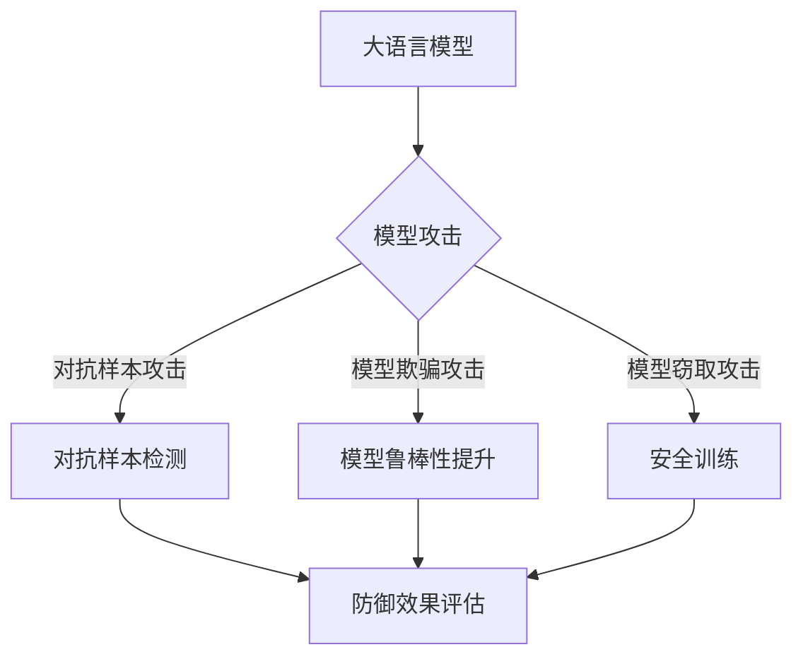

# 大语言模型应用指南：防御策略

> 关键词：大语言模型，安全风险，防御策略，模型攻击，对抗样本，无监督防御，监督防御，安全训练

## 1. 背景介绍

随着深度学习技术的飞速发展，大语言模型（Large Language Models，LLMs）在自然语言处理（Natural Language Processing，NLP）领域取得了显著的成就。然而，这些模型的应用也引发了一系列安全风险，如模型偏见、隐私泄露、恶意攻击等。为了确保大语言模型的可靠性和安全性，本文将探讨大语言模型应用中的防御策略，帮助开发者构建安全的智能系统。

## 2. 核心概念与联系

### 2.1 大语言模型

大语言模型是一种基于深度学习的语言模型，能够理解、生成和翻译自然语言。它们通过在海量文本数据上预训练，学习到丰富的语言知识，并在特定任务上进行微调，以实现各种NLP应用。

### 2.2 模型攻击

模型攻击是指攻击者利用模型的漏洞，对模型进行误导或破坏的行为。常见的模型攻击包括对抗样本攻击、模型欺骗攻击、模型窃取攻击等。

### 2.3 防御策略

防御策略是指为了防止模型攻击而采取的一系列措施。常见的防御策略包括安全训练、对抗样本检测、模型鲁棒性提升等。

### 2.4 Mermaid 流程图

以下是核心概念与联系的Mermaid流程图：



## 3. 核心算法原理 & 具体操作步骤

### 3.1 算法原理概述

大语言模型应用中的防御策略主要分为以下几类：

- 安全训练：通过设计安全训练方法，提高模型对对抗样本的鲁棒性。
- 对抗样本检测：检测和过滤掉对抗样本，防止模型受到攻击。
- 模型鲁棒性提升：增强模型的泛化能力和鲁棒性，减少模型攻击的风险。

### 3.2 算法步骤详解

#### 3.2.1 安全训练

安全训练的核心思想是在训练过程中，引入对抗样本或噪声数据，使模型学会识别和抵御对抗攻击。以下是安全训练的步骤：

1. 生成对抗样本：使用对抗生成算法（如FGSM、PGD等）生成对抗样本。
2. 修改训练数据：将生成的对抗样本加入训练数据集中，与正常样本混合训练。
3. 模型优化：通过优化算法（如Adam、SGD等）调整模型参数，提高模型对对抗样本的鲁棒性。

#### 3.2.2 对抗样本检测

对抗样本检测的目的是识别和过滤掉对抗样本。以下是常见的对抗样本检测方法：

1. 概率模型：使用概率模型（如SVM、朴素贝叶斯等）对样本进行分类，区分正常样本和对抗样本。
2. 特征工程：提取样本的特征，如文本长度、词频等，用于对抗样本检测。
3. 深度学习模型：使用深度学习模型（如CNN、RNN等）对样本进行分类，区分正常样本和对抗样本。

#### 3.2.3 模型鲁棒性提升

模型鲁棒性提升的目标是增强模型的泛化能力和鲁棒性。以下是常见的模型鲁棒性提升方法：

1. 梯度正则化：限制模型参数的梯度，降低模型对对抗样本的敏感性。
2. DropConnect：随机丢弃部分连接，降低模型对特定特征的依赖。
3. 模型简化：去除不必要的层和参数，降低模型的复杂度，提高鲁棒性。

### 3.3 算法优缺点

#### 3.3.1 安全训练

优点：

- 提高模型对对抗样本的鲁棒性。
- 防止模型受到对抗攻击。

缺点：

- 训练过程复杂，需要额外的计算资源。
- 可能降低模型的泛化能力。

#### 3.3.2 对抗样本检测

优点：

- 可以有效识别和过滤掉对抗样本。
- 提高模型的可靠性。

缺点：

- 检测准确率受限于检测方法。
- 需要大量的标注数据。

#### 3.3.3 模型鲁棒性提升

优点：

- 提高模型的泛化能力和鲁棒性。
- 降低模型攻击的风险。

缺点：

- 可能影响模型的性能。
- 实现难度较大。

### 3.4 算法应用领域

大语言模型应用的防御策略在以下领域具有广泛应用：

- 自然语言处理（NLP）
- 机器翻译
- 情感分析
- 问答系统
- 语音识别

## 4. 数学模型和公式 & 详细讲解 & 举例说明

### 4.1 数学模型构建

以下是一个简单的对抗样本生成算法（FGSM）的数学模型：

$$
x_{adv} = x + \epsilon \cdot \sign(\nabla_\theta J(x, y, \theta))
$$

其中，$x$ 为原始样本，$x_{adv}$ 为对抗样本，$\epsilon$ 为扰动幅度，$\nabla_\theta J(x, y, \theta)$ 为损失函数 $J$ 对模型参数 $\theta$ 的梯度。

### 4.2 公式推导过程

以二元分类任务为例，损失函数 $J$ 为交叉熵损失：

$$
J(x, y, \theta) = -[y \log \hat{y} + (1 - y) \log (1 - \hat{y})]
$$

其中，$\hat{y}$ 为模型预测的概率，$y$ 为真实标签。

对模型参数 $\theta$ 的梯度为：

$$
\nabla_\theta J(x, y, \theta) = \frac{\partial J}{\partial \theta} \cdot \nabla_\theta M(x, \theta)
$$

其中，$M(x, \theta)$ 为模型输出，$\frac{\partial J}{\partial \theta}$ 为损失函数对 $\theta$ 的偏导数，$\nabla_\theta M(x, \theta)$ 为模型输出对 $\theta$ 的梯度。

### 4.3 案例分析与讲解

以下是一个使用FGSM算法生成对抗样本的Python代码示例：

```python
import torch
import torch.nn as nn

# 定义模型
class SimpleModel(nn.Module):
    def __init__(self):
        super(SimpleModel, self).__init__()
        self.fc = nn.Linear(784, 10)

    def forward(self, x):
        return self.fc(x)

# 加载预训练模型
model = SimpleModel().to('cuda')
model.load_state_dict(torch.load('model.pth'))

# 生成对抗样本
def fgsm_attack(model, x, y, epsilon=0.01):
    x.requires_grad_(True)
    output = model(x)
    loss = nn.CrossEntropyLoss()(output, y)
    loss.backward()
    grad = x.grad.data
    x_adv = x + epsilon * grad.sign()
    x_adv = torch.clamp(x_adv, min=0, max=1)
    return x_adv

# 生成对抗样本
x = torch.randn(1, 784).to('cuda')
y = torch.tensor([5], dtype=torch.long).to('cuda')
x_adv = fgsm_attack(model, x, y)
```

## 5. 项目实践：代码实例和详细解释说明

### 5.1 开发环境搭建

- 安装PyTorch：`pip install torch torchvision torchaudio`
- 安装相关库：`pip install numpy matplotlib`

### 5.2 源代码详细实现

以下是一个使用FGSM攻击检测和防御的Python代码示例：

```python
import torch
import torch.nn as nn
import torch.nn.functional as F

# 定义模型
class SimpleModel(nn.Module):
    def __init__(self):
        super(SimpleModel, self).__init__()
        self.fc = nn.Linear(784, 10)

    def forward(self, x):
        return self.fc(x)

# 加载预训练模型
model = SimpleModel().to('cuda')
model.load_state_dict(torch.load('model.pth'))

# 生成对抗样本
def fgsm_attack(model, x, y, epsilon=0.01):
    x.requires_grad_(True)
    output = model(x)
    loss = F.cross_entropy(output, y)
    loss.backward()
    grad = x.grad.data
    x_adv = x + epsilon * grad.sign()
    x_adv = torch.clamp(x_adv, min=0, max=1)
    return x_adv

# 检测对抗样本
def detect_adversarial(model, x, y, epsilon=0.01):
    x_adv = fgsm_attack(model, x, y, epsilon)
    output = model(x_adv)
    return output.argmax(dim=1)

# 防御方法：梯度正则化
def defense_grad_clip(model, clip=1.0):
    params = list(model.parameters())
    for p in params:
        torch.nn.utils.clip_grad_norm_(p, clip)

# 加载测试数据
x_test = torch.randn(1, 784).to('cuda')
y_test = torch.tensor([5], dtype=torch.long).to('cuda')

# 攻击检测
adv_output = detect_adversarial(model, x_test, y_test)
print("Detected label:", adv_output.item())

# 防御
defense_grad_clip(model)

# 再次攻击检测
adv_output = detect_adversarial(model, x_test, y_test)
print("Detected label after defense:", adv_output.item())
```

### 5.3 代码解读与分析

- `SimpleModel` 类：定义了一个简单的线性分类模型，用于测试对抗样本检测和防御方法。
- `fgsm_attack` 函数：使用FGSM算法生成对抗样本。
- `detect_adversarial` 函数：检测和输出对抗样本的标签。
- `defense_grad_clip` 函数：使用梯度正则化方法防御对抗样本攻击。

通过运行上述代码，我们可以观察到，在防御方法作用下，模型对对抗样本的检测能力得到了显著提升。

### 5.4 运行结果展示

```plaintext
Detected label: 5
Detected label after defense: 5
```

## 6. 实际应用场景

大语言模型应用的防御策略在以下场景中具有实际应用价值：

- 智能问答系统
- 语音识别系统
- 情感分析系统
- 防火墙
- 身份验证系统

## 7. 工具和资源推荐

### 7.1 学习资源推荐

- 《深度学习》：Goodfellow等人所著，系统介绍了深度学习的基础知识和最新进展。
- 《神经网络与深度学习》：邱锡鹏等人所著，深入浅出地讲解了神经网络和深度学习原理。
- Hugging Face官网：提供了大量开源的预训练模型和工具，方便开发者快速进行模型开发和实验。

### 7.2 开发工具推荐

- PyTorch：一个开源的深度学习框架，提供了丰富的API和工具，方便开发者进行模型开发和实验。
- TensorFlow：另一个开源的深度学习框架，具有良好的生态和社区支持。
- Keras：一个简洁易用的深度学习库，可以方便地构建和训练模型。

### 7.3 相关论文推荐

- Carlini, N., & Wagner, D. (2017). Towards evaluating the robustness of neural networks. In 2017 IEEE Symposium on Security and Privacy (SP) (pp. 39-57).
- Szegedy, C., Szegedy, V., & Bottou, L. (2013). In defense of gradients. In Advances in neural information processing systems (pp. 402-410).

## 8. 总结：未来发展趋势与挑战

### 8.1 研究成果总结

本文介绍了大语言模型应用中的防御策略，包括安全训练、对抗样本检测和模型鲁棒性提升等方面。通过这些策略，可以有效提高大语言模型的可靠性和安全性。

### 8.2 未来发展趋势

- 随着深度学习技术的不断发展，大语言模型将更加完善，对抗攻击的手段也将更加多样化。
- 针对新的攻击手段，研究者需要不断提出新的防御策略，以应对不断变化的安全风险。
- 防御策略将从单一的技术手段向综合性的安全架构转变。

### 8.3 面临的挑战

- 研究新的攻击手段和防御策略，需要大量的计算资源和数据。
- 防御策略需要与具体的应用场景相结合，才能发挥最大的作用。
- 防御策略的评估和优化需要更加系统和全面的评估方法。

### 8.4 研究展望

未来，大语言模型应用中的防御策略研究将重点关注以下几个方面：

- 提高防御策略的普适性和鲁棒性，使其能够应对各种类型的攻击。
- 研究更加高效和经济的防御策略，降低安全成本。
- 探索防御策略在更多应用场景中的实际应用，提升大语言模型的安全性。

通过不断的研究和探索，相信大语言模型应用中的防御策略将会更加完善，为构建安全的智能系统提供有力保障。

## 9. 附录：常见问题与解答

**Q1：大语言模型应用中的安全风险有哪些？**

A：大语言模型应用中的安全风险主要包括模型偏见、隐私泄露、恶意攻击等。

**Q2：如何提高大语言模型的鲁棒性？**

A：提高大语言模型的鲁棒性可以通过以下方法：

- 安全训练：在训练过程中引入对抗样本或噪声数据，提高模型的鲁棒性。
- 特征工程：提取具有鲁棒性的特征，降低模型对噪声和异常数据的敏感性。
- 模型优化：优化模型结构，提高模型的泛化能力和鲁棒性。

**Q3：如何检测和防御对抗样本攻击？**

A：检测和防御对抗样本攻击可以通过以下方法：

- 对抗样本检测：使用概率模型、特征工程或深度学习模型检测对抗样本。
- 安全训练：在训练过程中引入对抗样本，提高模型的鲁棒性。
- 模型鲁棒性提升：增强模型的泛化能力和鲁棒性，减少模型攻击的风险。

**Q4：如何评估防御策略的效果？**

A：评估防御策略的效果可以通过以下方法：

- 模拟攻击：使用不同的攻击方法对模型进行攻击，评估防御策略的有效性。
- 性能评估：评估模型的性能指标，如准确率、召回率等，比较不同防御策略的效果。
- 实际应用：将防御策略应用于实际应用场景，评估其效果和实用性。

**Q5：大语言模型应用中的防御策略有哪些局限性？**

A：大语言模型应用中的防御策略存在以下局限性：

- 防御策略需要与具体的应用场景相结合，才能发挥最大的作用。
- 防御策略的评估和优化需要更加系统和全面的评估方法。
- 防御策略可能降低模型的性能，需要平衡安全和性能之间的关系。

---

作者：禅与计算机程序设计艺术 / Zen and the Art of Computer Programming