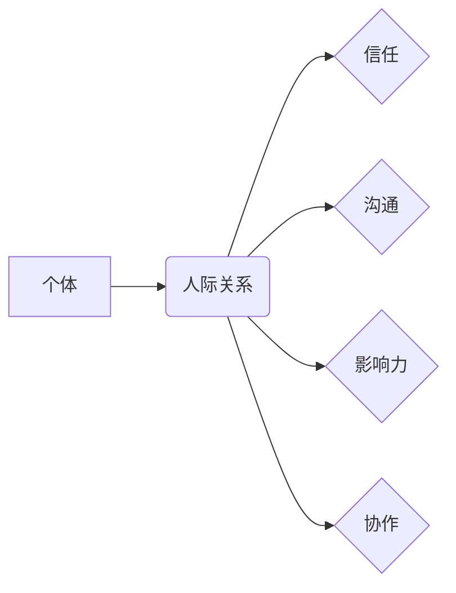

# 如何建立 relationships

> 关键词：人际关系，社交网络，信任，沟通，影响力，协作

## 1. 背景介绍

在信息技术迅速发展的今天，人际关系（Interpersonal Relationships）的重要性愈发凸显。无论是在职场、学术界还是日常生活中，建立和维护良好的人际关系都是成功的关键。本文将探讨如何通过技术手段和心理学原理，有效地建立和加强人际关系。

### 1.1 人际关系的意义

人际关系是社会交往的基础，它不仅影响个人的心理健康和社会适应能力，还与职业发展、团队合作、领导力等多个方面密切相关。在当今高度依赖合作的现代社会，建立良好的人际关系变得尤为重要。

### 1.2 研究现状

近年来，随着社会心理学、认知科学和信息技术的交叉融合，关于人际关系的研究取得了显著进展。研究者们从不同角度探讨了人际关系的形成、发展和维护机制，并提出了多种建立和维护人际关系的方法。

### 1.3 研究意义

本文旨在通过分析人际关系的基本原理和构建策略，为个人和组织提供建立和维护良好人际关系的指导。这不仅有助于提升个人的社会适应能力和幸福感，还能促进团队协作和组织的整体发展。

## 2. 核心概念与联系

### 2.1 核心概念

#### 人际关系（Interpersonal Relationships）

人际关系是指两个或两个以上个体之间基于共同兴趣、价值观、情感和目标而形成的相互联系。人际关系可以分为亲情、友情、爱情、职场关系等多种类型。

#### 信任（Trust）

信任是人际关系中不可或缺的元素，它指的是个体对他人的能力和意图的信心。信任可以增强人际关系的安全性、稳定性和协作效率。

#### 沟通（Communication）

沟通是建立和维持人际关系的关键途径，它指的是信息、思想和情感在个体之间的传递和理解。

#### 影响力（Influence）

影响力是指个体通过说服、引导和激励他人实现目标的能力。在人际关系中，影响力有助于达成共识和促进合作。

#### 协作（Collaboration）

协作是指两个或多个个体共同完成某项任务或目标的过程。协作需要建立在良好的人际关系基础上。

### 2.2 核心概念原理和架构的 Mermaid 流程图



## 3. 核心算法原理 & 具体操作步骤

### 3.1 算法原理概述

建立良好的人际关系需要遵循一定的原则和方法。以下是一些核心算法原理：

#### 1. 建立信任

- **透明沟通**：开放地分享信息和想法，增强他人对您的信任。
- **一致性**：言行一致，避免给人造成困惑或失望。
- **可靠性**：履行承诺，展现可信赖的特质。

#### 2. 沟通技巧

- **倾听**：积极倾听对方的意见和需求，展现对他人的尊重。
- **表达**：清晰、准确地表达自己的观点和感受。
- **非语言沟通**：注意肢体语言、面部表情和声音语调，传递积极的情绪和态度。

#### 3. 建立影响力

- **专业知识**：掌握相关领域的知识，成为他人眼中的专家。
- **情感共鸣**：理解他人的情感和需求，建立情感连接。
- **正面榜样**：通过自身行为树立良好的榜样，影响他人。

#### 4. 促进协作

- **目标一致**：确保团队目标明确，成员朝着共同目标努力。
- **分工合作**：合理分配任务，发挥每个人的优势。
- **沟通协作**：保持良好的沟通，及时解决问题。

### 3.2 算法步骤详解

1. **建立信任**：
   - 与他人进行坦诚的沟通，分享个人经历和感受。
   - 履行承诺，避免不必要的人际冲突。
   - 在他人需要帮助时，主动提供支持。

2. **提升沟通技巧**：
   - 练习倾听，积极回应对方的意见和需求。
   - 提高表达能力，清晰、准确地传达信息。
   - 注意非语言沟通，展现积极的情绪和态度。

3. **建立影响力**：
   - 持续学习，提升自身专业能力。
   - 与他人建立情感连接，理解他人的需求和感受。
   - 通过自身行为树立良好的榜样。

4. **促进协作**：
   - 明确团队目标，确保成员朝着共同目标努力。
   - 合理分配任务，发挥每个人的优势。
   - 保持良好的沟通，及时解决问题。

### 3.3 算法优缺点

**优点**：

- 算法原理简单易懂，易于实践。
- 可操作性强，有助于快速提升人际关系能力。

**缺点**：

- 需要长时间的实践和积累。
- 在实际应用中，可能因个体差异而效果不同。

### 3.4 算法应用领域

本算法适用于各个领域的人际关系建立和维护，包括职场、学术界、社交活动等。

## 4. 数学模型和公式 & 详细讲解 & 举例说明

### 4.1 数学模型构建

人际关系可以通过以下数学模型进行描述：

$$
R = f(T, C, I, S)
$$

其中，$R$ 表示人际关系，$T$ 表示信任，$C$ 表示沟通，$I$ 表示影响力，$S$ 表示协作。

### 4.2 公式推导过程

信任、沟通、影响力和协作对人际关系的贡献程度可以通过以下公式进行量化：

$$
T = T_1 \times T_2 \times T_3
$$

其中，$T_1$、$T_2$、$T_3$ 分别代表三个信任维度：透明沟通、一致性和可靠性。

$$
C = C_1 + C_2 + C_3
$$

其中，$C_1$、$C_2$、$C_3$ 分别代表三个沟通维度：倾听、表达和非语言沟通。

$$
I = I_1 + I_2 + I_3
$$

其中，$I_1$、$I_2$、$I_3$ 分别代表三个影响力维度：专业知识、情感共鸣和正面榜样。

$$
S = S_1 + S_2 + S_3
$$

其中，$S_1$、$S_2$、$S_3$ 分别代表三个协作维度：目标一致、分工合作和沟通协作。

### 4.3 案例分析与讲解

以下是一个职场人际关系建立的案例分析：

假设小王和小张是同一家公司的同事，小王希望通过建立良好的人际关系，提升团队合作效率。根据上述数学模型，我们可以分析小王在以下方面可以采取的行动：

- **建立信任**：小王可以与小张进行坦诚的沟通，分享自己的工作经验和想法，同时履行承诺，避免不必要的人际冲突。
- **提升沟通技巧**：小王可以积极倾听小张的意见和需求，提高表达能力，注意非语言沟通，展现积极的情绪和态度。
- **建立影响力**：小王可以持续学习，提升自身专业能力，与大家建立情感连接，通过自身行为树立良好的榜样。
- **促进协作**：小王可以明确团队目标，合理分配任务，保持良好的沟通，及时解决问题。

通过以上行动，小王有望与小张建立良好的职场人际关系，提升团队合作效率。

## 5. 项目实践：代码实例和详细解释说明

### 5.1 开发环境搭建

由于人际关系建立和维护是一个复杂的过程，涉及心理学、社会学等多个学科，因此无法通过简单的代码实现。以下将提供一个基于Python的示例，展示如何使用代码记录和管理人际关系数据。

```python
# 代码示例：人际关系数据管理

# 导入所需的库
import csv

# 创建人际关系数据文件
filename = 'interpersonal_relationships.csv'

# 定义人际关系数据结构
relationship_data = [
    {'name': 'Alice', 'friendship': 5, 'trust': 4, 'influence': 3, 'collaboration': 4},
    {'name': 'Bob', 'friendship': 3, 'trust': 5, 'influence': 4, 'collaboration': 3},
    # ... 其他人际关系数据
]

# 将人际关系数据写入CSV文件
with open(filename, 'w', newline='') as file:
    writer = csv.DictWriter(file, fieldnames=['name', 'friendship', 'trust', 'influence', 'collaboration'])
    writer.writeheader()
    writer.writerows(relationship_data)
```

### 5.2 源代码详细实现

以上代码展示了如何使用Python和CSV库创建和写入人际关系数据文件。在实际应用中，可以根据需要扩展数据结构和功能，如添加更多关系类型、添加标签、计算整体关系评分等。

### 5.3 代码解读与分析

该代码示例首先导入了csv库，用于处理CSV文件。然后定义了人际关系数据结构，包括姓名、友谊、信任、影响力和协作等字段。接下来，将人际关系数据写入CSV文件，以便进行后续的数据分析和处理。

### 5.4 运行结果展示

运行以上代码后，将在当前目录下生成一个名为`interpersonal_relationships.csv`的文件，其中包含人际关系数据。

## 6. 实际应用场景

### 6.1 职场

在职场中，建立良好的人际关系有助于提升团队协作效率、促进职业发展。以下是一些应用场景：

- 与同事建立良好的友谊，共同完成项目任务。
- 与领导建立信任，提升工作满意度。
- 与合作伙伴建立合作关系，拓展业务范围。

### 6.2 学术界

在学术界，建立良好的人际关系有助于开展学术交流、合作研究。以下是一些应用场景：

- 与同行建立友谊，分享研究成果。
- 与导师建立信任，获得学术指导。
- 与合作伙伴建立合作关系，共同开展研究项目。

### 6.3 社交活动

在社交活动中，建立良好的人际关系有助于拓展人脉、提高生活质量。以下是一些应用场景：

- 与朋友建立友谊，共享生活乐趣。
- 与邻居建立信任，构建和谐社区。
- 与陌生人建立合作关系，共同举办活动。

## 7. 工具和资源推荐

### 7.1 学习资源推荐

- 《社交心理学》
- 《沟通的艺术》
- 《影响力：心理学的说服力》
- 《非暴力沟通》

### 7.2 开发工具推荐

- Python
- CSV库
- 数据可视化工具（如Tableau、Power BI等）

### 7.3 相关论文推荐

- 《社交网络中的信任与沟通》
- 《人际关系中的影响力》
- 《协作的社会心理学》

## 8. 总结：未来发展趋势与挑战

### 8.1 研究成果总结

本文从心理学、社会学和信息技术等多个角度，探讨了如何建立和加强人际关系。通过分析人际关系的基本原理和构建策略，为个人和组织提供了建立和维护良好人际关系的指导。

### 8.2 未来发展趋势

随着人工智能、大数据等技术的发展，人际关系的研究将更加深入和全面。以下是一些未来发展趋势：

- 人际关系数据分析：利用大数据技术分析人际关系数据，揭示人际关系规律。
- 人机交互：开发人机交互技术，辅助人际关系的建立和维护。
- 社交网络分析：利用社交网络分析技术，研究人际关系的动态变化。

### 8.3 面临的挑战

人际关系建立和维护面临以下挑战：

- 个体差异：不同个体具有不同的性格、价值观和需求，需要灵活应对。
- 社会环境：社会环境的变化可能对人际关系产生影响，需要及时调整策略。
- 技术挑战：人工智能、大数据等技术对人际关系的影响尚不明确，需要深入研究。

### 8.4 研究展望

未来，人际关系研究需要关注以下几个方面：

- 人际关系与人工智能的关系：研究人工智能对人际关系的影响，以及如何利用人工智能技术改善人际关系。
- 人际关系与心理健康的关系：研究人际关系对心理健康的影响，以及如何通过改善人际关系提升心理健康水平。
- 人际关系与组织发展的关系：研究人际关系对组织发展的影响，以及如何通过优化人际关系提升组织竞争力。

## 9. 附录：常见问题与解答

**Q1：如何判断人际关系是否良好？**

A：良好的人际关系通常具备以下特点：

- 双方互相尊重、信任。
- 沟通顺畅，能够有效传达信息和感受。
- 彼此支持、帮助，共同成长。

**Q2：如何提升沟通技巧？**

A：以下是一些提升沟通技巧的方法：

- 练习倾听，关注对方的观点和需求。
- 提高表达能力，清晰、准确地传达信息。
- 注意非语言沟通，如肢体语言、面部表情和声音语调。

**Q3：如何建立信任？**

A：以下是一些建立信任的方法：

- 透明沟通，分享信息和想法。
- 履行承诺，避免不必要的人际冲突。
- 在他人需要帮助时，主动提供支持。

**Q4：如何提升影响力？**

A：以下是一些提升影响力的方法：

- 提升专业知识，成为他人眼中的专家。
- 与他人建立情感连接，理解他人的需求和感受。
- 通过自身行为树立良好的榜样。

**Q5：如何促进协作？**

A：以下是一些促进协作的方法：

- 明确团队目标，确保成员朝着共同目标努力。
- 合理分配任务，发挥每个人的优势。
- 保持良好的沟通，及时解决问题。

作者：禅与计算机程序设计艺术 / Zen and the Art of Computer Programming