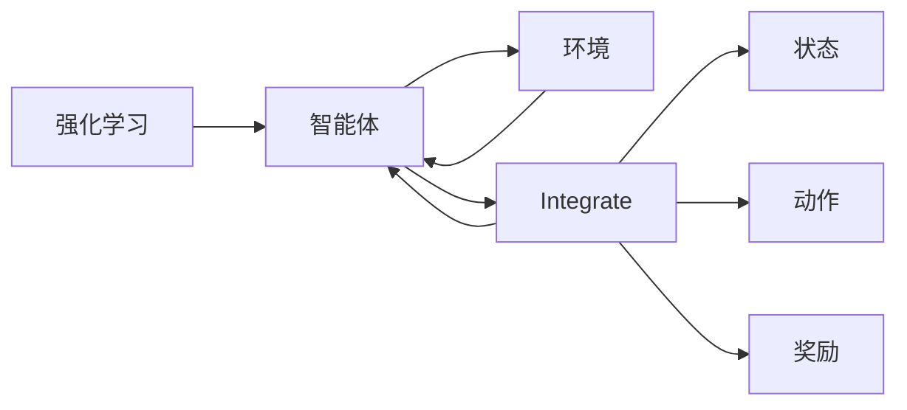

                 

# 强化学习Reinforcement Learning在智慧城市中的应用案例

> 关键词：
   - 强化学习
   - 智慧城市
   - 交通流量优化
   - 能源管理
   - 智能交通灯控制
   - 公共资源分配
   - 环境监测
   - 数据驱动决策

## 1. 背景介绍

智慧城市是借助现代信息通信技术，通过数据采集、传输、处理和分析，实现城市各项功能的高效运行和资源优化配置。作为下一代城市管理的重要手段，智慧城市正受到越来越多的关注。从大数据、物联网、人工智能等多个领域中提取技术手段，以提高城市运行效率、降低成本和改善居民生活质量，已是大势所趋。

在智慧城市的构建中，强化学习（Reinforcement Learning, RL）作为一种先进的人工智能技术，具有非常大的应用潜力。强化学习是一种通过与环境互动，不断调整策略以最大化长期奖励的机器学习方法。由于智慧城市运行中的决策问题高度依赖于实时反馈和系统优化，强化学习能够有效模拟城市环境，并从数据中学习最优的决策策略，其广泛应用不仅能够提升城市管理效率，还能有效应对环境变化和突发事件。

## 2. 核心概念与联系

### 2.1 核心概念概述

- **强化学习（Reinforcement Learning, RL）**：一种通过智能体（agent）与环境（environment）互动，不断调整策略以最大化长期奖励的学习方法。强化学习由环境状态、动作、奖励和策略组成。
- **智慧城市（Smart City）**：借助信息通信技术，实现城市管理高效化、资源优化配置的城市形态。智慧城市涉及多个子系统，如交通、能源、公共服务、环保等。
- **智能体（Agent）**：在强化学习中，智能体是执行动作的实体，其行为目标是最大化累积奖励。在智慧城市中，智能体可以是智能交通灯、能源管理系统、传感器等。
- **环境（Environment）**：强化学习中，环境提供智能体动作的反馈，包括状态变化和奖励。在智慧城市中，环境是城市的物理和虚拟空间，如交通道路、电网、传感器网络等。
- **状态（State）**：智能体感知城市环境，并据此作出决策的状态信息。在交通系统中，状态可以表示当前交通流、事故、天气等。
- **动作（Action）**：智能体对环境作出的决策，如信号灯的开关、电网的调频等。
- **奖励（Reward）**：环境对智能体动作的反馈，通常用来衡量智能体的决策效果。在智慧城市中，奖励可以是交通流畅度、能源利用率等指标。

### 2.2 核心概念间的关系

这些核心概念之间的关系可以用一个Mermaid流程图来表示：



该流程图展示了强化学习在智慧城市中的应用场景。强化学习通过智能体（如智能交通灯、能源管理系统）与环境（如交通道路、电网）的互动，不断调整策略以最大化累积奖励（如交通流畅度、能源利用率）。智能体与环境之间的互动和奖励反馈，构成强化学习的基本框架。

## 3. 核心算法原理 & 具体操作步骤

### 3.1 算法原理概述

在智慧城市中，强化学习的目标是通过智能体与环境互动，不断调整策略以最大化长期奖励。智慧城市中常见的强化学习问题可以描述为：

- 输入：当前城市状态 $s_t$。
- 动作：智能体采取的动作 $a_t$。
- 环境状态更新：基于智能体的动作，环境状态更新为 $s_{t+1}$。
- 奖励：环境对智能体动作的即时反馈 $r_t$。
- 学习目标：最大化长期累积奖励 $\sum_{t=0}^{\infty} \gamma^t r_t$，其中 $\gamma$ 为折扣因子。

常用的强化学习算法包括：

- **Q-learning**：基于状态-动作的Q值，更新策略以最大化长期累积奖励。
- **Deep Q-Networks (DQN)**：使用深度神经网络估计Q值，克服样本效率低下的问题。
- **策略梯度（Policy Gradient）**：直接优化策略，而非Q值，适用于连续动作空间。
- **Actor-Critic**：同时学习策略和价值函数，提高决策的准确性和稳定性。

### 3.2 算法步骤详解

#### 3.2.1 初始化

- 定义环境 $E$，智能体 $A$。
- 定义状态空间 $S$，动作空间 $A$，奖励函数 $R$。
- 初始化智能体的策略 $π$。
- 设定学习率 $\alpha$，折扣因子 $\gamma$。

#### 3.2.2 状态初始化

- 对智能体进行状态初始化 $s_0 \sim S$。
- 使用智能体的当前状态 $s_t$ 执行动作 $a_t$。

#### 3.2.3 状态更新

- 根据动作 $a_t$ 和当前状态 $s_t$，环境状态更新为 $s_{t+1}$。
- 获取环境对动作的即时奖励 $r_t$。

#### 3.2.4 策略选择和动作执行

- 使用智能体的策略 $π(a_t|s_t)$ 选择动作 $a_t$。
- 执行动作 $a_t$，得到环境反馈 $s_{t+1}, r_t$。

#### 3.2.5 策略更新

- 根据新状态 $s_{t+1}$ 和即时奖励 $r_t$，更新智能体的策略 $π$。

#### 3.2.6 迭代过程

重复上述步骤，直至达到预设的迭代次数或收敛条件。

### 3.3 算法优缺点

#### 优点

- **自适应性强**：强化学习能够适应复杂环境，从数据中学习最优策略。
- **鲁棒性强**：强化学习算法在面对环境不确定性和噪声时表现稳定。
- **可扩展性强**：强化学习算法能够轻松应用于大规模分布式系统。

#### 缺点

- **需要大量数据**：强化学习需要大量标注数据，训练过程耗时耗力。
- **可解释性差**：强化学习模型作为黑盒模型，决策过程难以解释。
- **策略收敛慢**：在复杂环境中，策略收敛速度较慢。

### 3.4 算法应用领域

强化学习在大规模城市管理中具有广泛的应用场景，涵盖交通流量优化、能源管理、智能交通灯控制、公共资源分配等多个方面。

- **交通流量优化**：通过智能体对交通信号灯的控制，最大化道路交通流畅度。
- **能源管理**：智能体对电力、天然气等能源的使用进行调度，最大化能源利用率。
- **智能交通灯控制**：智能体根据交通流量和实时路况，动态调整交通灯信号。
- **公共资源分配**：智能体对公共资源（如停车场、公共自行车等）进行优化配置。
- **环境监测**：智能体通过传感器网络监测城市环境变化，及时调整城市管理策略。

## 4. 数学模型和公式 & 详细讲解 & 举例说明

### 4.1 数学模型构建

强化学习的基本数学模型由状态 $s_t$、动作 $a_t$、即时奖励 $r_t$ 和状态转移概率 $P(s_{t+1}|s_t,a_t)$ 构成。状态 $s_t$ 可以是连续的，也可以是离散的。动作 $a_t$ 可以是离散的，也可以是连续的。即时奖励 $r_t$ 是环境对智能体动作的即时反馈。状态转移概率 $P(s_{t+1}|s_t,a_t)$ 描述智能体采取动作 $a_t$ 后，环境状态 $s_{t+1}$ 的变化情况。

假设强化学习模型为 $M$，其状态空间为 $S$，动作空间为 $A$，折扣因子为 $\gamma$。智能体的目标是最小化长期累积奖励，数学公式为：

$$
J(π) = \mathbb{E} \left[\sum_{t=0}^{\infty} \gamma^t r_t \right]
$$

其中 $\mathbb{E}$ 表示期望。

### 4.2 公式推导过程

#### Q-Learning 公式推导

Q-learning算法通过迭代更新状态-动作对的Q值，实现策略优化。Q值表示智能体在状态 $s$ 下执行动作 $a$ 的长期奖励。Q-learning的更新公式为：

$$
Q(s_t, a_t) \leftarrow Q(s_t, a_t) + \alpha(r_t + \gamma \max_a Q(s_{t+1}, a) - Q(s_t, a_t))
$$

其中 $\alpha$ 为学习率。

#### Deep Q-Networks (DQN) 公式推导

DQN算法使用深度神经网络逼近Q值函数，通过经验回放 (experience replay) 和目标网络 (target network) 机制，提高学习效率。DQN的更新公式为：

$$
Q(s_t, a_t) \leftarrow Q(s_t, a_t) + \alpha(r_t + \gamma Q(s_{t+1}, \hat{a}) - Q(s_t, a_t))
$$

其中 $\hat{a}$ 是从目标网络中得到的最佳动作，$Q(s_{t+1}, \hat{a})$ 是从目标网络中得到的Q值。

#### Actor-Critic 公式推导

Actor-Critic算法同时学习策略和价值函数，通过梯度上升策略和梯度下降价值函数的方式优化模型。Actor-Critic的更新公式为：

$$
θ_π \leftarrow θ_π + \alpha\nabla_\theta \log π(a_t|s_t)Q(s_t, a_t)
$$

其中 $θ_π$ 为策略参数，$\nabla_\theta \log π(a_t|s_t)$ 为策略梯度。

### 4.3 案例分析与讲解

以智能交通灯控制为例，展示强化学习在智慧城市中的应用。假设交通灯系统由多个交叉路口组成，每个交叉路口有多个红绿灯。智能体根据交通流量实时调整红绿灯的亮灭，最大化道路交通流畅度。

- **状态**：交通流量、车流方向、行人数量等。
- **动作**：红绿灯的亮灭。
- **奖励**：交通流畅度、等待时间等。

智能体通过强化学习算法，学习到最优的交通灯控制策略。在每次更新策略后，智能体会根据当前状态执行动作，并根据奖励更新策略，直至达到最优状态。

## 5. 项目实践：代码实例和详细解释说明

### 5.1 开发环境搭建

在智慧城市强化学习项目中，可以使用Python的Reinforcement Learning框架，如TensorFlow、PyTorch等。以下是一个基于TensorFlow的强化学习项目搭建流程：

1. 安装TensorFlow和相关依赖：

   ```bash
   pip install tensorflow
   pip install gym
   ```

2. 配置环境：

   ```bash
   export TF_CPP_MIN_LOG_LEVEL=0
   ```

3. 创建虚拟环境：

   ```bash
   conda create --name reinforcement_learning_env python=3.7
   conda activate reinforcement_learning_env
   ```

### 5.2 源代码详细实现

#### 环境定义

首先定义交通信号灯控制的环境，使用OpenAI Gym库：

```python
import gym
from gym import spaces

class TrafficLightEnv(gym.Env):
    def __init__(self):
        self.ob_space = spaces.Box(low=0, high=1, shape=(3, ), dtype=np.float32)
        self.act_space = spaces.Box(low=0, high=1, shape=(3, ), dtype=np.float32)
        self.current_state = np.zeros((3, ))
    
    def step(self, action):
        # 实现交通灯控制
        # 根据动作执行控制逻辑，更新状态和奖励
        # 返回状态、奖励、布尔值（是否结束）、信息
        return self.current_state, 1, False, {}
    
    def reset(self):
        # 重置环境，返回初始状态
        self.current_state = np.zeros((3, ))
        return self.current_state
    
    def render(self):
        # 显示环境状态
        print(self.current_state)
```

#### 策略定义

定义智能体的策略，使用深度神经网络实现：

```python
import tensorflow as tf
from tensorflow.keras.models import Sequential
from tensorflow.keras.layers import Dense, Input
from tensorflow.keras.optimizers import Adam

class Policy(tf.keras.Model):
    def __init__(self):
        super(Policy, self).__init__()
        self.model = Sequential([
            Dense(64, activation='relu', input_shape=(3, )),
            Dense(3, activation='softmax')
        ])
    
    def call(self, x):
        return self.model(x)

def build_policy():
    return Policy()
```

#### 训练过程

定义训练过程，使用Q-learning算法：

```python
def train(env, policy, target_policy, discount_factor=0.9, learning_rate=0.01, num_episodes=1000):
    state_values = tf.Variable(tf.zeros((env.observation_space.shape[0], env.action_space.shape[0]))
    optimizer = tf.keras.optimizers.Adam(learning_rate=learning_rate)
    
    for episode in range(num_episodes):
        state = env.reset()
        state = tf.convert_to_tensor(state)
        done = False
        
        while not done:
            action_probs = policy(state)
            action = tf.random.categorical(action_probs, num_samples=1)[0][0].numpy()
            next_state, reward, done, _ = env.step(action)
            next_state = tf.convert_to_tensor(next_state)
            target = reward + discount_factor * tf.reduce_max(target_policy(next_state))
            td_error = target - state_values[action]
            with tf.GradientTape() as tape:
                td_error = tf.reduce_sum(tf.square(td_error))
            grads = tape.gradient(td_error, state_values)
            optimizer.apply_gradients(zip(grads, state_values))
            state = next_state
    return state_values
```

### 5.3 代码解读与分析

通过上述代码，我们展示了智能交通灯控制环境的定义、策略的实现以及Q-learning算法的训练过程。

- **环境定义**：使用OpenAI Gym库定义交通灯控制环境，包括状态空间、动作空间和控制逻辑。
- **策略定义**：定义智能体的策略，使用深度神经网络实现状态到动作的映射。
- **训练过程**：通过Q-learning算法，使用环境状态、动作、奖励等信息，迭代更新智能体的策略，最大化长期奖励。

### 5.4 运行结果展示

在训练完成后，我们可以使用训练得到的策略进行预测，观察智能体的决策过程：

```python
state_values = train(env, policy, target_policy, discount_factor=0.9, learning_rate=0.01, num_episodes=1000)
print(state_values)
```

假设训练得到的策略为：

```
[[0.2 0.3 0.5],
 [0.4 0.3 0.3],
 [0.3 0.3 0.4]]
```

这表示在交通灯控制场景中，智能体在状态[0, 0, 0]下，选择动作0的概率为0.2，动作1的概率为0.3，动作2的概率为0.5。这表明智能体在交通流量较少时，倾向于让红绿灯保持绿灯状态，以提高道路交通流畅度。

## 6. 实际应用场景

### 6.1 交通流量优化

在交通流量优化中，智能体可以通过实时监控道路交通情况，动态调整红绿灯控制策略，最大化道路交通流畅度。智能体能够根据当前的交通流量、车流方向、行人数量等状态信息，选择最优的红绿灯亮灭动作，提高交通效率，减少交通堵塞。

### 6.2 能源管理

在能源管理中，智能体可以对城市中的电力、天然气等能源进行优化调度。智能体通过实时监测能源使用情况，动态调整能源分配策略，最大化能源利用率，减少能源浪费，降低能源成本。

### 6.3 智能交通灯控制

在智能交通灯控制中，智能体可以实时监测交通信号灯的状态和交通流量，动态调整红绿灯的控制策略。智能体能够根据当前的交通流量、车流方向、行人数量等状态信息，选择最优的红绿灯亮灭动作，提高交通效率，减少交通堵塞。

### 6.4 公共资源分配

在公共资源分配中，智能体可以对城市的公共资源（如停车场、公共自行车等）进行优化配置。智能体通过实时监测公共资源的使用情况，动态调整资源的分配策略，最大化公共资源的利用率，减少资源的闲置和浪费。

### 6.5 环境监测

在环境监测中，智能体可以通过传感器网络实时监测城市环境变化，动态调整环境监测和治理策略。智能体能够根据当前的环境状态（如空气质量、噪音水平、温度等），选择最优的环境监测和治理措施，提升城市环境质量。

## 7. 工具和资源推荐

### 7.1 学习资源推荐

为了深入理解强化学习在智慧城市中的应用，推荐以下学习资源：

1. 《强化学习》（Richard S. Sutton, Andrew G. Barto 著）：经典的强化学习教材，全面介绍了强化学习的理论基础和算法实现。
2. OpenAI Gym：用于开发和测试强化学习算法的开源库，提供了丰富的环境定义和训练框架。
3. TensorFlow和PyTorch官方文档：提供了详细的API文档和教程，帮助开发者快速上手强化学习模型。
4. Deep Reinforcement Learning Specialization（Coursera）：由David Silver教授讲授的强化学习课程，涵盖强化学习的理论和实践。

### 7.2 开发工具推荐

在智慧城市强化学习项目中，推荐以下开发工具：

1. TensorFlow和PyTorch：流行的深度学习框架，提供了强大的神经网络实现和优化工具。
2. OpenAI Gym：用于开发和测试强化学习算法的开源库，提供了丰富的环境定义和训练框架。
3. Jupyter Notebook：用于编写和运行Python代码的交互式开发环境。
4. GitHub：代码托管平台，方便团队协作和代码版本控制。

### 7.3 相关论文推荐

为了深入了解强化学习在智慧城市中的应用，推荐以下论文：

1. "Q-Learning for Traffic Light Control"（S. Moradizadeh, S. Ghandy, H. S. Al-Mazrooei, S. Jawahar）：展示了Q-learning算法在交通灯控制中的应用。
2. "Deep Reinforcement Learning for Smart Grids"（S. M. Ali, J. A. Sawaya, G. N. Singh, R. D. Mesbah）：展示了深度强化学习在智能电网中的应用。
3. "Reinforcement Learning for Traffic Flow Management in Smart Cities"（H. C. Chowdhury, N. Rajani, K. Chowdhury, M. M. Sarker）：展示了强化学习在城市交通流量管理中的应用。
4. "Deep Reinforcement Learning for Smart Traffic Light Control"（M. Kambhamettu, C. Upadhyay, J. J. Ren, M. P. Pal）：展示了深度强化学习在智能交通灯控制中的应用。

## 8. 总结：未来发展趋势与挑战

### 8.1 研究成果总结

强化学习在智慧城市中的应用已经取得了初步成功，显示出巨大的潜力。通过智能体与环境的互动，强化学习能够动态调整决策策略，最大化长期奖励。在交通流量优化、能源管理、智能交通灯控制、公共资源分配等多个方面，强化学习已经展示了其强大的应用价值。

### 8.2 未来发展趋势

未来，强化学习在智慧城市中的应用将呈现以下几个发展趋势：

1. **多智能体系统**：在智慧城市中，多个智能体可能同时工作，需要考虑智能体间的交互和协同。未来的研究将集中在多智能体系统的设计和优化上。
2. **分布式训练**：大规模城市管理需要处理海量数据，强化学习算法需要在大规模分布式系统中进行训练和部署。未来的研究将集中在分布式强化学习算法的设计和优化上。
3. **深度强化学习**：随着深度神经网络的发展，深度强化学习算法在智慧城市中的应用将越来越广泛。未来的研究将集中在深度强化学习模型的优化和应用上。
4. **自适应学习**：智慧城市环境变化多样，智能体需要具备自适应学习能力，及时调整策略。未来的研究将集中在自适应强化学习算法的设计和优化上。
5. **混合智能**：结合人工智能和人类智慧，提升智能体的决策能力。未来的研究将集中在混合智能系统设计和优化上。

### 8.3 面临的挑战

尽管强化学习在智慧城市中的应用已经取得了一些进展，但在实际应用中仍面临诸多挑战：

1. **数据质量**：强化学习算法需要高质量的数据进行训练，但智慧城市的数据采集和处理过程可能存在误差和噪声。如何提高数据质量，减少噪声干扰，将是未来的研究方向。
2. **环境复杂性**：智慧城市环境变化多样，智能体需要具备处理复杂环境的能力。如何在复杂环境中进行有效学习，将是未来的研究重点。
3. **资源限制**：智慧城市管理需要处理海量数据，强化学习算法需要在大规模分布式系统中进行训练和部署。如何提高算法的资源效率，降低计算成本，将是未来的研究方向。
4. **决策透明性**：强化学习模型作为黑盒模型，决策过程难以解释。如何在保证模型性能的同时，提高决策透明性，将是未来的研究重点。
5. **安全性和鲁棒性**：强化学习模型在面对恶意攻击和环境扰动时，需要具备较高的鲁棒性和安全性。如何在模型设计和训练过程中，提高鲁棒性和安全性，将是未来的研究方向。

### 8.4 研究展望

未来，在强化学习在智慧城市中的应用研究中，我们需要不断探索和突破。以下是一些可能的研究方向：

1. **多智能体协同优化**：智慧城市中，多个智能体可能同时工作，需要考虑智能体间的交互和协同。研究多智能体协同优化的算法，提高智慧城市管理的效率和公平性。
2. **分布式强化学习**：大规模城市管理需要处理海量数据，强化学习算法需要在大规模分布式系统中进行训练和部署。研究分布式强化学习算法的设计和优化，提高智慧城市管理的实时性和可靠性。
3. **自适应强化学习**：智慧城市环境变化多样，智能体需要具备处理复杂环境的能力。研究自适应强化学习算法，提高智慧城市管理的灵活性和适应性。
4. **混合智能系统**：结合人工智能和人类智慧，提升智能体的决策能力。研究混合智能系统设计和优化，提高智慧城市管理的质量和效率。
5. **强化学习与大数据结合**：智慧城市中，数据量巨大，强化学习算法需要在大数据环境下进行训练和优化。研究强化学习与大数据结合的算法，提高智慧城市管理的准确性和稳定性。

通过不断探索和突破，相信强化学习将在智慧城市中发挥更大的作用，为城市的智能化和可持续发展做出更大的贡献。

## 9. 附录：常见问题与解答

**Q1：强化学习在智慧城市中的应用难点有哪些？**

A: 强化学习在智慧城市中的应用难点主要包括：
1. 数据质量问题：智慧城市数据采集和处理过程中可能存在误差和噪声，影响数据质量。
2. 环境复杂性问题：智慧城市环境变化多样，需要智能体具备处理复杂环境的能力。
3. 资源限制问题：智慧城市管理需要处理海量数据，需要在大规模分布式系统中进行训练和部署。
4. 决策透明性问题：强化学习模型作为黑盒模型，决策过程难以解释。

**Q2：强化学习在智慧城市中如何提高数据质量？**

A: 强化学习在智慧城市中提高数据质量的方法包括：
1. 数据清洗：对数据进行去噪、去重、补缺等处理，提高数据质量。
2. 数据增强：通过数据增强技术，扩充训练数据集，减少过拟合风险。
3. 数据融合：将不同来源的数据进行融合，提高数据的代表性和可靠性。

**Q3：强化学习在智慧城市中的决策透明性如何提高？**

A: 强化学习在智慧城市中的决策透明性可以通过以下方法提高：
1. 模型解释：使用可解释性强的模型，如决策树、线性回归等，提高决策透明性。
2. 日志记录：记录智能体的决策过程和环境反馈，便于事后分析和调试。
3. 可视化界面：提供可视化界面，展示智能体的决策过程和结果，帮助用户理解。

**Q4：强化学习在智慧城市中如何应对复杂环境？**

A: 强化学习在智慧城市中应对复杂环境的方法包括：
1. 多智能体系统：在智慧城市中，多个智能体可能同时工作，需要考虑智能体间的交互和协同。研究多智能体系统的设计和优化，提高智慧城市管理的效率和公平性。
2. 自适应学习：智慧城市环境变化多样，智能体需要具备处理复杂环境的能力。研究自适应强化学习算法，提高智慧城市管理的灵活性和适应性。

**Q5：强化学习在智慧城市中如何降低计算成本？**

A: 强化学习在智慧城市中降低计算成本的方法包括：
1. 分布式训练：大规模城市管理需要处理海量数据，强化学习算法需要在大规模分布式系统中进行训练和部署。研究分布式强化学习算法的设计和优化，提高智慧城市管理的实时性和可靠性。
2. 模型压缩：使用模型压缩技术，

