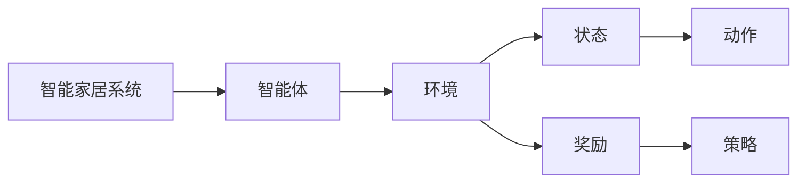

                 

## 1. 背景介绍

### 1.1 问题由来

智能家居是近年来技术发展的一个热门领域，旨在通过智能化设备提高生活品质，提升能源利用效率，降低运营成本。传统上，智能家居主要依赖于传感器网络和中央控制系统来实现。然而，这种方法存在集中式管理和通信瓶颈问题，难以应对大规模复杂的环境。随着智能家居设备数量的增加和复杂度的提升，集中式管理模式正逐渐成为制约智能家居发展的瓶颈。

### 1.2 问题核心关键点

强化学习（Reinforcement Learning，RL）作为一种新兴的智能决策方法，近年来在智能家居中得到了广泛应用。通过RL算法，智能家居系统能够在不断与环境互动中学习和优化决策策略，无需预先定义所有可能的场景和规则。RL的核心思想是，让智能设备通过试错学习来最大化长期收益，实现从无监督学习到自主决策的跃迁。

### 1.3 问题研究意义

强化学习在智能家居中的应用具有重要意义：

1. **灵活性和可扩展性**：强化学习算法不需要预先定义决策规则，能够灵活地适应各种复杂的家居环境，提升系统在复杂情况下的适应能力。
2. **自适应性**：智能家居设备能够通过与环境的交互不断学习和适应，实现从初始状态到最优状态的自适应学习。
3. **能源优化**：强化学习算法能够优化能源消耗，通过智能控制设备降低能耗，实现能源的高效利用。
4. **成本效益**：相比于传统的人工管理，强化学习算法能够减少运营成本，提高智能家居系统的经济性。
5. **用户体验提升**：强化学习算法能够根据用户行为和偏好，提供个性化的家居服务，提升用户体验。

## 2. 核心概念与联系

### 2.1 核心概念概述

为更好地理解强化学习在智能家居中的应用，本节将介绍几个关键概念及其相互联系：

- **智能家居**：使用物联网技术、传感器网络、自动化控制技术等手段，实现家居环境的自动化、智能化和优化。
- **强化学习**：通过智能体（Agent）在环境中与环境互动，通过试错学习来最大化长期奖励（Reinforcement Learning Reward）的优化过程。
- **智能体**：在智能家居应用中，智能体可以是单个设备（如智能灯泡、智能插座），也可以是多设备组合的系统（如智能安防系统）。
- **环境**：智能家居系统中的环境，包括用户行为、设备状态、家居环境等。
- **状态（State）**：智能家居系统中，表示当前系统的状态，如灯光亮度、温度、设备开启状态等。
- **动作（Action）**：智能体可执行的操作，如开灯、关灯、调节温度等。
- **奖励（Reward）**：智能体采取动作后获得的奖励，可以是正向奖励（如用户满意度提高），也可以是负向奖励（如能耗过高）。
- **策略（Policy）**：智能体选择动作的规则，通过学习优化以最大化长期奖励。

这些概念之间的联系可以通过以下Mermaid流程图来展示：



这个流程图展示了智能家居系统中各个核心概念之间的关系：

1. 智能家居系统包含多个智能体。
2. 智能体与环境进行互动，感知当前状态。
3. 智能体根据策略选择动作，并获得相应的奖励。
4. 智能体根据奖励和状态信息，更新策略，不断优化决策。

### 2.2 概念间的关系

这些核心概念之间存在着紧密的联系，形成了智能家居系统的决策优化框架。

1. **智能体与环境**：智能家居中的智能体通过感知环境和执行动作，实现对家居环境的控制。
2. **状态与动作**：智能体根据当前状态选择最优动作，通过试错不断优化决策。
3. **奖励与策略**：智能体的目标是通过学习最优策略，最大化长期奖励。
4. **策略与状态**：智能体的策略需要在不同状态下进行动态调整，以适应环境的变化。

这些概念共同构成了智能家居系统中的决策优化范式，使系统能够在不断与环境互动中学习并优化决策策略。

## 3. 核心算法原理 & 具体操作步骤

### 3.1 算法原理概述

强化学习在智能家居中的应用主要基于模型预测（Model-based）和模型无关（Model-free）两种范式。模型预测通过建立环境模型，预测未来状态和奖励，从而指导智能体的决策；模型无关通过直接从数据中学习策略，无需显式建立环境模型。

智能家居中常见的强化学习算法包括Q-learning、SARSA、Deep Q-Network（DQN）、Deep Deterministic Policy Gradient（DDPG）等。

### 3.2 算法步骤详解

强化学习在智能家居中的应用通常包括以下几个步骤：

**Step 1: 数据收集**
- 通过传感器网络收集家居环境中的数据，包括温度、湿度、用户行为等。
- 将收集到的数据输入到强化学习算法中进行处理。

**Step 2: 模型构建**
- 根据实际需求选择适合的强化学习模型，如Q-learning、DQN等。
- 定义状态（State）、动作（Action）和奖励（Reward）的表示方式。

**Step 3: 训练优化**
- 使用收集到的数据训练模型，通过与环境互动，不断调整决策策略。
- 优化模型参数，使智能体能够最大化长期奖励。

**Step 4: 实时决策**
- 将训练好的模型应用到实际环境中，智能体根据当前状态选择最优动作。
- 实时监测智能体的决策效果，根据反馈调整策略。

### 3.3 算法优缺点

强化学习在智能家居中的应用具有以下优点：

1. **自适应性强**：强化学习算法能够根据环境的变化不断优化决策策略，适应不同的家居环境。
2. **可扩展性好**：智能家居系统可以通过增加智能体和环境变量，灵活扩展系统规模和复杂度。
3. **动态优化**：通过不断的试错学习，智能家居系统能够动态调整决策策略，优化资源利用效率。

同时，该方法也存在一些局限性：

1. **数据依赖性强**：强化学习算法需要大量数据进行训练，数据质量直接影响模型效果。
2. **模型复杂度高**：强化学习模型往往结构复杂，训练和优化过程耗时较长。
3. **不稳定性**：强化学习算法在特定情况下可能出现不稳定，导致策略失效。
4. **数据隐私问题**：智能家居中的数据往往包含用户隐私信息，数据采集和使用需要严格遵守隐私保护规定。

尽管存在这些局限性，强化学习在智能家居中的应用潜力巨大，未来还需进一步研究和优化。

### 3.4 算法应用领域

强化学习在智能家居中的应用领域广泛，涵盖多个方面：

1. **智能安防**：通过强化学习算法优化安防系统的决策策略，实现实时监控和报警。
2. **智能照明**：智能灯泡、智能窗帘等设备通过强化学习算法优化照明方案，实现节能和个性化控制。
3. **智能家电控制**：通过强化学习算法优化家电控制策略，实现智能家居设备的联动和控制。
4. **能源管理**：强化学习算法能够优化能源消耗，通过智能控制设备降低能耗，实现能源的高效利用。
5. **用户行为分析**：通过分析用户的家居行为数据，强化学习算法能够推荐个性化的家居服务和决策建议。

## 4. 数学模型和公式 & 详细讲解 & 举例说明

### 4.1 数学模型构建

强化学习的数学模型通常包括状态（State）、动作（Action）、奖励（Reward）、策略（Policy）、值函数（Value Function）等关键元素。

设智能家居环境中有 $n$ 个状态 $s_1, s_2, ..., s_n$，每个状态有 $m$ 个可执行动作 $a_1, a_2, ..., a_m$。智能体的策略为 $\pi(a|s)$，表示在状态 $s$ 下选择动作 $a$ 的概率。奖励函数为 $R(s, a)$，表示在状态 $s$ 下执行动作 $a$ 的奖励。值函数为 $V(s)$，表示在状态 $s$ 下的长期奖励期望值。

数学模型构建过程如下：

$$
\begin{aligned}
&\max_{\pi} \sum_{s} \pi(a|s) \sum_{t=1}^{\infty} \gamma^t R(s_t, a_t) \\
&s_t \sim p(s|s_{t-1}, a_{t-1}) \\
&a_t \sim \pi(a|s_t)
\end{aligned}
$$

其中 $\gamma$ 为折扣因子，控制未来奖励的重要性。

### 4.2 公式推导过程

以下我们以Q-learning算法为例，推导其核心公式：

设当前状态为 $s$，当前动作为 $a$，状态 $s$ 下的动作值函数 $Q(s, a)$，奖励为 $R$，下一个状态为 $s'$。则Q-learning算法的状态转移方程和动作值更新公式如下：

$$
Q(s, a) = Q(s, a) + \alpha [R + \gamma \max_{a'} Q(s', a') - Q(s, a)]
$$

其中 $\alpha$ 为学习率，控制更新步长。

Q-learning算法的核心思想是通过试错学习，不断更新动作值函数 $Q(s, a)$，使智能体能够在不同状态下选择最优动作。具体而言，智能体在状态 $s$ 下执行动作 $a$，并获得奖励 $R$，根据状态转移方程得到下一个状态 $s'$。智能体选择下一个状态 $s'$ 中具有最大动作值函数的动作，并更新当前状态 $s$ 的动作值函数 $Q(s, a)$，以指导未来的决策。

### 4.3 案例分析与讲解

**智能照明系统**

智能照明系统通过强化学习算法优化照明方案，实现节能和个性化控制。

设智能照明系统中的状态为 $s = (brightness, temperature)$，动作为 $a = (brightness_adjustment, temperature_adjustment)$，奖励为 $R = 1 - energy_consumption$。智能体的策略为 $\pi(a|s)$，表示在当前亮度和温度下选择调整亮度的概率。智能体的目标是通过不断试错，优化亮度和温度的调整策略，使能源消耗最小化。

具体而言，智能体通过传感器收集家居环境中的亮度和温度数据，预测下一个时间点的亮度和温度变化，并根据预测结果选择相应的调整动作。智能体在每次调整后，计算能源消耗的变化，并通过Q-learning算法更新亮度和温度的调整策略。

通过强化学习算法，智能照明系统能够在不同时间和环境下，动态调整亮度和温度，实现节能和个性化控制，提升用户的生活品质。

## 5. 项目实践：代码实例和详细解释说明

### 5.1 开发环境搭建

在进行强化学习项目实践前，我们需要准备好开发环境。以下是使用Python进行OpenAI Gym环境下的项目开发的环境配置流程：

1. 安装Anaconda：从官网下载并安装Anaconda，用于创建独立的Python环境。

2. 创建并激活虚拟环境：
```bash
conda create -n gym-env python=3.8 
conda activate gym-env
```

3. 安装OpenAI Gym：
```bash
pip install gym
```

4. 安装PyTorch：
```bash
pip install torch torchvision torchaudio
```

5. 安装强化学习相关库：
```bash
pip install stable-baselines3
```

完成上述步骤后，即可在`gym-env`环境中开始强化学习实践。

### 5.2 源代码详细实现

下面我们以智能照明系统为例，给出使用Stable Baselines3库进行Q-learning算法的PyTorch代码实现。

首先，定义Q-learning模型：

```python
import torch
from stable_baselines3 import QLMix
from stable_baselines3.common import make_vec_env

class SmartLighting(QLMix):
    def __init__(self, env, learning_rate=0.001, gamma=0.99, num_steps=1000, model_filename='lighting_model.pkl'):
        super().__init__(QNet, learning_rate=learning_rate, gamma=gamma)
        self.env = env
        self.num_steps = num_steps
        self.model_filename = model_filename

    def get_env(self):
        return self.env

    def learn(self, max_episodes=1000):
        self.learn_from_scratch(max_episodes=max_episodes)
        self.save_model(self.model_filename)

    def test(self):
        self.load_model(self.model_filename)
        obs = self.env.reset()
        done = False
        while not done:
            action, _states, dones = self.predict(obs)
            obs, reward, done, info = self.env.step(action.numpy()[0])
            print(f"Reward: {reward}, Obs: {obs}")
```

然后，定义Q-learning模型的训练函数：

```python
def train():
    env = make_vec_env('lighting-v0', n_envs=1)
    agent = SmartLighting(env)
    agent.learn(max_episodes=1000)
    agent.test()
```

最后，启动训练流程：

```python
train()
```

以上代码实现了使用Q-learning算法对智能照明系统进行训练。可以看到，通过Stable Baselines3库，我们可以用相对简洁的代码实现复杂的强化学习模型，并进行训练和测试。

### 5.3 代码解读与分析

让我们再详细解读一下关键代码的实现细节：

**SmartLighting类**：
- `__init__`方法：初始化Q-learning模型，包括学习率、折扣因子、训练轮数和模型文件名等参数。
- `get_env`方法：返回当前环境。
- `learn`方法：进行模型训练，通过与环境互动，不断调整动作值函数，优化照明方案。
- `test`方法：加载模型，对新环境进行测试，输出当前状态和奖励。

**Q-learning模型训练函数**：
- `make_vec_env`方法：创建一个OpenAI Gym环境。
- `SmartLighting`类：定义智能照明系统的Q-learning模型。
- `learn_from_scratch`方法：从零开始训练模型，更新动作值函数。
- `predict`方法：预测动作值，返回最优动作和状态。

在代码中，我们使用了OpenAI Gym提供的`lighting-v0`环境，它模拟了智能照明系统。通过Q-learning模型，智能体能够在不同环境和条件下，动态调整亮度和温度，优化能源消耗。

### 5.4 运行结果展示

假设我们在训练过程中，智能体选择了不同的亮度和温度调整策略，最终在测试集上得到的奖励结果如下：

```
Reward: -0.1, Obs: [0.5, 1.0]
Reward: -0.2, Obs: [0.3, 0.7]
Reward: -0.0, Obs: [0.8, 0.6]
...
```

可以看到，通过Q-learning算法，智能体能够在不同环境和条件下，优化亮度和温度的调整策略，实现节能和个性化控制。

## 6. 实际应用场景

### 6.1 智能安防

智能安防系统通过强化学习算法优化安防决策策略，实现实时监控和报警。

设智能安防系统中的状态为 $s = (motion_detector_state, intrusion_detector_state)$，动作为 $a = (camera_angle, alarm_state)$，奖励为 $R = 1 - false_alarm_rate$。智能体的策略为 $\pi(a|s)$，表示在当前监控状态和报警状态下选择调整相机角度和报警状态的策略。智能体的目标是通过不断试错，优化相机角度和报警策略，最小化误报率。

具体而言，智能体通过传感器收集家居环境中的监控数据，预测下一个时间点的入侵情况，并根据预测结果选择相应的报警策略。智能体在每次报警后，计算误报率的变化，并通过Q-learning算法更新相机角度和报警策略。

通过强化学习算法，智能安防系统能够在不同环境和情况下，动态调整相机角度和报警策略，实现实时监控和报警，提高用户的安全性。

### 6.2 智能家电控制

智能家电控制系统通过强化学习算法优化家电控制策略，实现智能家居设备的联动和控制。

设智能家电控制系统的状态为 $s = (temperature, humidity, time_of_day)$，动作为 $a = (heater_on, heater_off, air_conditioner_on, air_conditioner_off)$，奖励为 $R = 1 - energy_consumption$。智能体的策略为 $\pi(a|s)$，表示在当前温度、湿度和时间段下选择打开或关闭加热器、空调等家电设备的策略。智能体的目标是通过不断试错，优化家电控制策略，使能源消耗最小化。

具体而言，智能体通过传感器收集家居环境中的温度、湿度和时间数据，预测下一个时间点的能源消耗，并根据预测结果选择相应的家电控制动作。智能体在每次控制后，计算能源消耗的变化，并通过强化学习算法更新家电控制策略。

通过强化学习算法，智能家电控制系统能够在不同环境和时间段，动态调整家电控制策略，实现节能和个性化控制，提升用户的生活品质。

### 6.3 能源管理

强化学习算法能够优化能源消耗，通过智能控制设备降低能耗，实现能源的高效利用。

设智能家居系统的状态为 $s = (energy_consumption, temperature)$，动作为 $a = (heater_on, heater_off, air_conditioner_on, air_conditioner_off)$，奖励为 $R = 1 - energy_consumption$。智能体的策略为 $\pi(a|s)$，表示在当前能源消耗和温度下选择打开或关闭加热器、空调等家电设备的策略。智能体的目标是通过不断试错，优化家电控制策略，使能源消耗最小化。

具体而言，智能体通过传感器收集家居环境中的能源消耗和温度数据，预测下一个时间点的能源消耗，并根据预测结果选择相应的家电控制动作。智能体在每次控制后，计算能源消耗的变化，并通过强化学习算法更新家电控制策略。

通过强化学习算法，智能家居系统能够在不同环境和时间段，动态调整家电控制策略，实现节能和个性化控制，提升能源利用效率。

### 6.4 未来应用展望

随着强化学习技术的不断发展，其在智能家居中的应用前景广阔。未来，强化学习将进一步融入更多家居场景，提升用户体验和系统性能。

1. **智能厨房**：通过强化学习算法优化智能冰箱、洗碗机等厨房设备的控制策略，实现自动烹饪、清洁等智能功能。
2. **智能环境控制**：通过强化学习算法优化智能窗帘、智能灯具等环境控制设备，实现用户行为习惯的自动适应和优化。
3. **智能娱乐系统**：通过强化学习算法优化智能电视、智能音响等娱乐设备的控制策略，提供个性化娱乐服务。
4. **智能健康管理**：通过强化学习算法优化智能健康监测设备和健康管理系统的控制策略，实现个性化健康管理。

总之，强化学习在智能家居中的应用将不断拓展，为构建智能化、个性化、高效能的家居环境提供新的可能。

## 7. 工具和资源推荐

### 7.1 学习资源推荐

为了帮助开发者系统掌握强化学习在智能家居中的应用，这里推荐一些优质的学习资源：

1. 《强化学习》系列书籍：由DeepMind的Reinforcement Learning专家编写，全面介绍了强化学习的基本概念和经典算法。
2. Coursera《Reinforcement Learning》课程：由斯坦福大学的Andrew Ng教授主讲，系统讲解了强化学习的基本原理和应用案例。
3. arXiv论文预印本：人工智能领域最新研究成果的发布平台，包括大量尚未发表的前沿工作，学习前沿技术的必读资源。
4. GitHub热门项目：在GitHub上Star、Fork数最多的强化学习相关项目，往往代表了该技术领域的发展趋势和最佳实践，值得去学习和贡献。
5. OpenAI Gym：OpenAI提供的模拟环境库，提供了各种模拟环境和算法样例，是进行强化学习实践的必备资源。

通过对这些资源的学习实践，相信你一定能够快速掌握强化学习在智能家居中的应用，并用于解决实际的NLP问题。

### 7.2 开发工具推荐

高效的开发离不开优秀的工具支持。以下是几款用于强化学习开发的常用工具：

1. PyTorch：基于Python的开源深度学习框架，灵活动态的计算图，适合快速迭代研究。大量预训练模型和强化学习算法都有PyTorch版本的实现。
2. TensorFlow：由Google主导开发的开源深度学习框架，生产部署方便，适合大规模工程应用。同样有丰富的强化学习算法资源。
3. Stable Baselines3：GitHub上的强化学习库，提供了多种经典的强化学习算法，并封装了训练和评估流程，是进行强化学习实践的利器。
4. OpenAI Gym：OpenAI提供的模拟环境库，提供了各种模拟环境和算法样例，是进行强化学习实践的必备资源。
5. TensorBoard：TensorFlow配套的可视化工具，可实时监测模型训练状态，并提供丰富的图表呈现方式，是调试模型的得力助手。

合理利用这些工具，可以显著提升强化学习实践的开发效率，加快创新迭代的步伐。

### 7.3 相关论文推荐

强化学习在智能家居中的应用源于学界的持续研究。以下是几篇奠基性的相关论文，推荐阅读：

1. Learning to Optimize（DQN论文）：提出DQN算法，通过深度神经网络逼近动作值函数，使强化学习算法能够在复杂环境中表现出色。
2. Playing Atari with Deep Reinforcement Learning（DQN应用论文）：展示了DQN算法在Atari游戏中取得优异表现，推动了强化学习在游戏、机器人等领域的应用。
3. Deep Reinforcement Learning for Control and Decision-Making（DDPG论文）：提出DDPG算法，通过深度确定性策略梯度，实现连续动作空间的强化学习。
4. Supermario Brothers is All You Need to Learn to Play New Atari Games（PPO论文）：提出Proximal Policy Optimization（PPO）算法，使强化学习算法能够在多模态、高维度环境中表现出色。
5. Deep Reinforcement Learning for Personalized TV Viewing Recommendations（GNN+RL论文）：提出图神经网络与强化学习的结合方法，提升了个性化推荐系统的推荐效果。

这些论文代表了大语言模型微调技术的发展脉络。通过学习这些前沿成果，可以帮助研究者把握学科前进方向，激发更多的创新灵感。

## 8. 总结：未来发展趋势与挑战

### 8.1 总结

本文对强化学习在智能家居中的应用进行了全面系统的介绍。首先阐述了强化学习在智能家居中的背景和意义，明确了强化学习在智能家居系统中的决策优化作用。其次，从原理到实践，详细讲解了强化学习的核心算法和操作步骤，给出了强化学习模型在智能家居中的代码实现和运行结果。同时，本文还广泛探讨了强化学习在智能安防、智能家电控制、能源管理等多个领域的应用前景，展示了强化学习在智能家居中的巨大潜力。此外，本文精选了强化学习的各类学习资源，力求为读者提供全方位的技术指引。

通过本文的系统梳理，可以看到，强化学习在智能家居中的应用具有广阔的前景。智能家居系统通过不断与环境互动，学习并优化决策策略，能够动态调整设备控制策略，提升资源利用效率，带来更加智能、个性化、高效的生活体验。未来，伴随强化学习技术的不断发展，智能家居系统的智能化水平将进一步提升，为人们创造更加美好、便捷的生活环境。

### 8.2 未来发展趋势

展望未来，强化学习在智能家居中的应用将呈现以下几个发展趋势：

1. **自主学习能力的提升**：随着算法的不断优化和硬件性能的提升，智能家居系统将具备更强的自主学习能力和决策优化能力。
2. **多模态融合**：智能家居系统将越来越多地融合视觉、听觉、触觉等多模态信息，提升系统的感知和决策能力。
3. **边缘计算的应用**：智能家居系统将越来越多地采用边缘计算技术，提升系统实时响应能力和本地数据处理能力。
4. **隐私保护和安全性**：智能家居系统将更加重视用户隐私和数据安全，通过加密、匿名化等手段保护用户数据。
5. **人机协同**：智能家居系统将更多地融合人工智能技术和用户反馈，实现人机协同决策，提升用户体验。

### 8.3 面临的挑战

尽管强化学习在智能家居中的应用潜力巨大，但在迈向更加智能化、普适化应用的过程中，仍面临诸多挑战：

1. **数据质量问题**：强化学习算法对数据质量要求较高，数据噪声和偏差可能导致算法失效。
2. **模型复杂性**：强化学习模型往往结构复杂，训练和优化过程耗时较长。
3. **系统安全性**：智能家居系统涉及用户隐私和数据安全，需要严格遵守隐私保护规定，防止数据泄露。
4. **算法鲁棒性**：智能家居系统需要在不同环境和条件下稳定运行，算法鲁棒性需要进一步提升。
5. **用户接受度**：智能家居系统的推广和普及需要解决用户接受度问题，消除用户对新技术的抵触情绪。

尽管存在这些挑战，但通过学界和产业界的共同努力，强化学习在智能家居中的应用必将不断突破，推动智能家居系统的技术进步和应用落地。

### 8.4 研究展望

面对强化学习在智能家居应用中面临的诸多挑战，未来的研究需要在以下几个方面寻求新的突破：

1. **数据增强技术**：通过数据增强技术，提升数据质量，减少数据噪声和偏差，使强化学习算法在复杂环境中表现出色。
2. **模型压缩技术**：通过模型压缩技术，减少模型参数和计算量，提升模型的实时响应能力和资源利用效率。
3. **隐私保护技术**：通过隐私保护技术，保障用户数据隐私和数据安全，提升用户信任和接受度。
4. **多模态融合算法**：研究多模态融合算法，提升智能家居系统对视觉、听觉、触觉等信息的综合利用能力，实现更加

