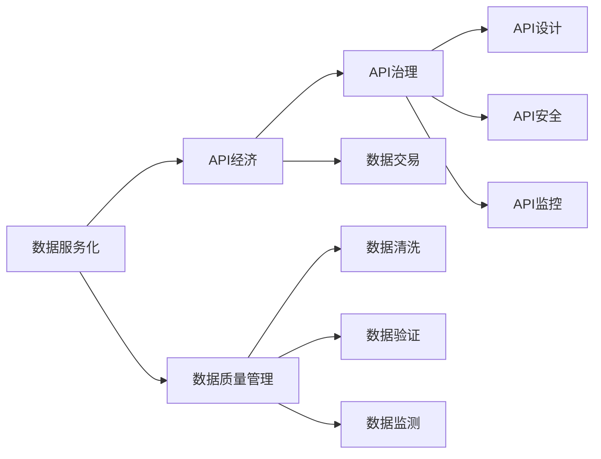

                 

# 数据即服务:API经济下的新型数据交易模式

> 关键词：数据服务化,API经济,数据交易,API治理,数据质量管理

## 1. 背景介绍

### 1.1 问题由来

随着互联网和移动互联网的迅速发展，数据已经成为重要的生产要素，并在各行各业中发挥着关键作用。数据驱动的业务创新、决策支持和智能决策越来越被重视，对于数据的需求也变得前所未有地强烈。然而，数据通常分散在不同的系统和企业中，数据孤岛现象普遍存在，数据整合和共享成为一大难题。

传统的数据共享方式，如通过手动导出数据、邮件交换等方式，不仅耗时耗力，还容易出错。更重要的是，这些方式缺乏数据安全和隐私保护的机制，存在数据泄露和滥用的风险。为了解决这些问题，数据服务化应运而生，成为API经济下新型数据交易模式的典范。

数据服务化是指将数据资源封装成标准化、易于使用的服务接口，通过API形式提供给用户，实现数据的统一管理和共享。与传统的数据共享方式相比，数据服务化具有更高的安全性、便捷性和可靠性，能够有效解决数据孤岛和共享难题，推动数据的智能化应用。

## 2. 核心概念与联系

### 2.1 核心概念概述

为更好地理解数据服务化的核心概念和机制，本节将介绍几个关键概念及其关系：

- **数据服务化(Data Serviceization)**：将数据资源封装成标准化的API服务，实现数据的统一管理和共享。数据服务化利用API治理、数据质量管理等技术，确保数据的安全性、准确性和可用性。

- **API经济(API Economy)**：API经济是指通过API服务来连接和整合不同系统和资源，实现资源的共享和协作。API经济利用API网关、API管理、API治理等技术，构建智能化的API生态系统。

- **数据交易(Data Trading)**：数据交易是指在数据服务化的基础上，通过API接口进行数据的购买、销售和共享。数据交易通常需要考虑数据的质量、隐私、安全性等要素，并制定相应的治理规则和协议。

- **API治理(API Governance)**：API治理是指对API服务的创建、管理、监控和优化等进行统一的规划和管理，确保API服务的质量和可靠性。API治理包括API设计、API安全、API监控等技术。

- **数据质量管理(Data Quality Management)**：数据质量管理是指对数据的准确性、完整性、一致性、时效性等进行管理和优化，确保数据的可信度和可用性。数据质量管理通常通过数据清洗、数据验证、数据监测等技术实现。

这些核心概念之间的联系紧密，共同构成了数据服务化在API经济下的新型数据交易模式。下面通过一个Mermaid流程图来展示这些概念之间的关系：



### 2.2 概念间的关系

通过上述Mermaid流程图，我们可以更清晰地理解各个概念之间的联系：

1. **数据服务化与API经济**：数据服务化是API经济的核心组成部分，通过数据服务化的API接口，API经济得以连接和整合不同系统和资源，实现资源的共享和协作。
2. **API治理与数据服务化**：API治理对数据服务化的API接口进行统一的规划和管理，确保API服务的质量和可靠性。
3. **数据交易与API经济**：数据交易通过API接口进行数据的购买、销售和共享，是API经济的重要应用场景。
4. **数据质量管理与API经济**：数据质量管理通过数据清洗、验证和监测等技术，确保API接口所提供的数据的准确性和可靠性，从而提高API经济的质量和效率。

这些概念共同构成了数据服务化在API经济下的新型数据交易模式的完整框架，使其能够实现数据的智能化应用和高效共享。

## 3. 核心算法原理 & 具体操作步骤
### 3.1 算法原理概述

数据服务化的核心原理是通过API接口将数据资源封装成标准化的服务，并提供给用户使用。数据服务化的过程可以分为数据集成、API设计和API治理三个主要步骤：

1. **数据集成**：将分散在不同系统和企业中的数据资源整合起来，形成统一的数据资源池。
2. **API设计**：根据数据资源的特性和用户需求，设计标准化的API接口，并实现数据服务化。
3. **API治理**：对API接口进行创建、管理、监控和优化，确保API服务的质量和可靠性。

### 3.2 算法步骤详解

#### 3.2.1 数据集成步骤详解

数据集成的主要目标是将分散在不同系统和企业中的数据资源整合起来，形成统一的数据资源池。具体步骤如下：

1. **数据采集**：通过ETL工具、API接口等方式，将各个系统和企业的数据采集到中央数据仓库中。
2. **数据清洗**：对采集到的数据进行去重、去噪、格式化等处理，确保数据的质量和一致性。
3. **数据存储**：将清洗后的数据存储到中央数据仓库中，支持高效的数据查询和访问。

#### 3.2.2 API设计步骤详解

API设计的目标是为数据资源提供标准化的API接口，以便用户能够方便地访问和使用数据。具体步骤如下：

1. **API接口设计**：根据数据资源的特性和用户需求，设计标准化的API接口，包括API路径、请求参数、响应数据等。
2. **API接口实现**：将API接口的逻辑实现封装在服务端程序中，并提供给用户使用。
3. **API文档编写**：编写API接口的文档，详细描述API的路径、请求参数、响应数据等，供用户参考。

#### 3.2.3 API治理步骤详解

API治理的目标是对API接口进行创建、管理、监控和优化，确保API服务的质量和可靠性。具体步骤如下：

1. **API接口创建**：根据业务需求，创建新的API接口，并设定相应的接口权限、调用限制等。
2. **API接口管理**：对已创建的API接口进行版本管理、调用监控、统计分析等操作，确保API接口的稳定性和可用性。
3. **API接口优化**：根据API接口的使用情况和用户反馈，进行接口的性能优化和功能增强，提高API接口的质量和用户体验。

### 3.3 算法优缺点

数据服务化的优点包括：

- **数据共享**：数据服务化通过API接口实现数据的统一管理和共享，解决了数据孤岛的问题，使得数据能够在不同系统和企业间自由流动。
- **数据安全**：数据服务化提供了统一的数据治理机制，确保数据的安全性和隐私保护，防止数据泄露和滥用。
- **数据便捷**：数据服务化提供了标准化的API接口，使得数据的使用和访问变得非常便捷，用户无需关心数据在何时何地从何而来，只需要调用API即可获取所需数据。
- **数据质量**：数据服务化引入了数据质量管理机制，通过数据清洗、验证和监测等技术，确保数据的准确性和可靠性。

数据服务化的缺点包括：

- **技术复杂度**：数据服务化的实现需要较高的技术水平和丰富的经验，尤其是API设计和治理方面，需要投入大量的时间和资源。
- **数据延迟**：由于数据服务化需要通过API接口进行数据的查询和访问，数据获取可能会有一定的延迟，影响用户体验。
- **数据冗余**：数据服务化会将相同的数据资源进行多份拷贝，增加了存储和管理的负担，且可能导致数据冗余和不一致性问题。

### 3.4 算法应用领域

数据服务化在以下几个领域具有广泛的应用：

- **大数据分析**：数据服务化通过API接口提供数据服务，使得数据能够在不同系统间自由流动，便于大数据分析任务的实现。
- **商业智能(BI)**：数据服务化能够提供统一的数据源和API接口，满足商业智能系统的数据需求，支持数据可视化和报表生成。
- **人工智能(AI)**：数据服务化通过API接口提供高质量的数据服务，支持人工智能系统的训练和推理，提升AI系统的性能和效果。
- **企业应用**：数据服务化能够实现数据资源的统一管理和共享，支持企业内部的业务流程和应用系统，提高企业的业务效率和竞争力。
- **政府服务**：数据服务化能够提供政府开放数据的服务，支持政府的信息公开和数据共享，提升政府的数据治理能力。

## 4. 数学模型和公式 & 详细讲解 & 举例说明

### 4.1 数学模型构建

数据服务化的数学模型主要涉及数据清洗、数据验证、API接口设计等环节。下面分别介绍这些环节的数学模型构建。

#### 4.1.1 数据清洗模型

数据清洗的目的是去除数据中的噪声和异常值，确保数据的准确性和一致性。数据清洗模型通常包括数据去重、数据格式化等操作，可以用以下数学公式表示：

$$
\text{Cleaned Data} = \text{Original Data} - \text{Noise Data}
$$

其中，$\text{Noise Data}$ 表示数据中的噪声和异常值，$\text{Cleaned Data}$ 表示清洗后的数据。

#### 4.1.2 数据验证模型

数据验证的目的是检查数据的完整性和正确性，确保数据的质量。数据验证模型通常包括数据校验、数据匹配等操作，可以用以下数学公式表示：

$$
\text{Valid Data} = \text{Verified Data} \times \text{Matching Data}
$$

其中，$\text{Verified Data}$ 表示经过校验的数据，$\text{Matching Data}$ 表示经过匹配的数据，$\text{Valid Data}$ 表示经过验证的数据。

#### 4.1.3 API接口设计模型

API接口设计模型的目的是设计标准化的API接口，满足用户需求。API接口设计模型通常包括API路径、请求参数、响应数据等，可以用以下数学公式表示：

$$
\text{API Path} = \text{Resource Path} + \text{Version Path}
$$

$$
\text{Request Parameters} = \text{Input Parameters} + \text{Query Parameters} + \text{Header Parameters}
$$

$$
\text{Response Data} = \text{Result Data} + \text{Error Data}
$$

其中，$\text{Resource Path}$ 表示资源路径，$\text{Version Path}$ 表示版本路径，$\text{Input Parameters}$ 表示输入参数，$\text{Query Parameters}$ 表示查询参数，$\text{Header Parameters}$ 表示头部参数，$\text{Result Data}$ 表示结果数据，$\text{Error Data}$ 表示错误数据。

### 4.2 公式推导过程

#### 4.2.1 数据清洗公式推导

数据清洗公式的推导比较简单，可以直接用算术减法表示：

$$
\text{Cleaned Data} = \text{Original Data} - \text{Noise Data}
$$

其中，$\text{Original Data}$ 表示原始数据，$\text{Noise Data}$ 表示噪声数据，$\text{Cleaned Data}$ 表示清洗后的数据。

#### 4.2.2 数据验证公式推导

数据验证公式的推导也比较简单，可以直接用算术乘法表示：

$$
\text{Valid Data} = \text{Verified Data} \times \text{Matching Data}
$$

其中，$\text{Verified Data}$ 表示经过校验的数据，$\text{Matching Data}$ 表示经过匹配的数据，$\text{Valid Data}$ 表示经过验证的数据。

#### 4.2.3 API接口设计公式推导

API接口设计公式的推导稍微复杂一些，需要考虑资源路径、版本路径、输入参数、查询参数、头部参数、结果数据和错误数据等多个因素。下面分别推导这些因素的公式：

- 资源路径公式：

$$
\text{Resource Path} = \text{Prefix} + \text{Resource Name}
$$

其中，$\text{Prefix}$ 表示资源路径的前缀，$\text{Resource Name}$ 表示资源路径的名称。

- 版本路径公式：

$$
\text{Version Path} = \text{Version}
$$

其中，$\text{Version}$ 表示API接口的版本。

- 输入参数公式：

$$
\text{Input Parameters} = \text{URL Parameters} + \text{Body Parameters}
$$

其中，$\text{URL Parameters}$ 表示URL参数，$\text{Body Parameters}$ 表示请求体参数。

- 查询参数公式：

$$
\text{Query Parameters} = \text{Query String}
$$

其中，$\text{Query String}$ 表示查询字符串。

- 头部参数公式：

$$
\text{Header Parameters} = \text{HTTP Headers}
$$

其中，$\text{HTTP Headers}$ 表示HTTP头部参数。

- 结果数据公式：

$$
\text{Result Data} = \text{Success Data} + \text{Error Data}
$$

其中，$\text{Success Data}$ 表示成功数据，$\text{Error Data}$ 表示错误数据。

- 错误数据公式：

$$
\text{Error Data} = \text{Error Message} + \text{Error Code}
$$

其中，$\text{Error Message}$ 表示错误信息，$\text{Error Code}$ 表示错误代码。

### 4.3 案例分析与讲解

#### 4.3.1 数据清洗案例分析

假设我们有一个包含多个用户信息的表格，其中部分用户信息存在重复和缺失，需要进行数据清洗。下面是数据清洗的案例分析：

1. **数据去重**：

   假设表格中有两行用户信息完全相同，需要将其中一行删除，保留另一行。可以使用如下算法实现：

   ```python
   def remove_duplicate(data):
       unique_data = []
       for i in range(len(data)):
           if data[i] not in unique_data:
               unique_data.append(data[i])
       return unique_data
   ```

2. **数据格式化**：

   假设表格中的日期格式不一致，需要将所有日期格式统一为ISO 8601格式。可以使用如下算法实现：

   ```python
   def format_date(data):
       for i in range(len(data)):
           if isinstance(data[i], str):
               data[i] = datetime.strptime(data[i], '%Y-%m-%d %H:%M:%S').isoformat()
       return data
   ```

#### 4.3.2 数据验证案例分析

假设我们有一个包含多个学生成绩的表格，其中部分学生成绩存在重复和异常值，需要进行数据验证。下面是数据验证的案例分析：

1. **数据校验**：

   假设表格中的成绩范围在0-100之间，需要将不在这个范围内的成绩删除。可以使用如下算法实现：

   ```python
   def check_grades(data):
       for i in range(len(data)):
           if data[i] < 0 or data[i] > 100:
               data[i] = None
       return [x for x in data if x is not None]
   ```

2. **数据匹配**：

   假设表格中的学生姓名和成绩是一一对应的，需要将姓名和成绩匹配起来。可以使用如下算法实现：

   ```python
   def match_student(data):
       student_dict = {}
       for i in range(len(data)):
           if data[i][0] not in student_dict:
               student_dict[data[i][0]] = data[i][1]
           else:
               if data[i][1] != student_dict[data[i][0]]:
                   student_dict[data[i][0]] = None
       return {k: v for k, v in student_dict.items() if v is not None}
   ```

#### 4.3.3 API接口设计案例分析

假设我们需要设计一个API接口，用于获取某个产品的用户评论。下面是API接口设计的案例分析：

1. **API路径设计**：

   假设产品ID为产品的主要参数，可以使用如下算法实现：

   ```python
   def get_product_path(product_id):
       return '/api/products/{}/reviews'.format(product_id)
   ```

2. **请求参数设计**：

   假设需要获取产品的评论和评分，可以使用如下算法实现：

   ```python
   def get_request_params():
       return {
           'page': 1,
           'per_page': 10,
           'sort_by': 'date',
           'rating': None
       }
   ```

3. **响应数据设计**：

   假设响应数据包括评论ID、用户ID、评论内容、评论时间、评分，可以使用如下算法实现：

   ```python
   def get_response_data():
       return {
           'id': '123',
           'user_id': '456',
           'content': '这是一个不错的产品',
           'time': datetime.now().isoformat(),
           'rating': 4.5
       }
   ```

## 5. 项目实践：代码实例和详细解释说明

### 5.1 开发环境搭建

在进行数据服务化项目开发前，需要先搭建开发环境。以下是使用Python进行Flask开发的环境配置流程：

1. 安装Flask：

   ```bash
   pip install flask
   ```

2. 创建项目目录：

   ```bash
   mkdir data_service
   cd data_service
   ```

3. 创建项目结构：

   ```bash
   touch app.py
   touch requirements.txt
   ```

4. 在`requirements.txt`文件中添加需要的依赖包：

   ```bash
   flask
   pandas
   numpy
   requests
   ```

5. 安装依赖包：

   ```bash
   pip install -r requirements.txt
   ```

完成上述步骤后，即可在`data_service`环境中开始数据服务化项目的开发。

### 5.2 源代码详细实现

下面是使用Flask进行数据服务化项目开发的代码实现，包括数据清洗、API接口设计和API接口调用等环节。

#### 5.2.1 数据清洗

假设我们有一个包含多个用户信息的CSV文件，需要进行数据清洗。下面是数据清洗的代码实现：

```python
import pandas as pd

def clean_data(data_file):
    # 读取CSV文件
    data = pd.read_csv(data_file)

    # 数据去重
    data = data.drop_duplicates()

    # 数据格式化
    data = data.apply(lambda x: x if pd.notnull(x) else 'N/A')

    return data
```

#### 5.2.2 API接口设计

假设我们需要设计一个API接口，用于获取某个产品的用户评论。下面是API接口设计的代码实现：

```python
from flask import Flask, jsonify

app = Flask(__name__)

@app.route('/api/products/<int:product_id>/reviews', methods=['GET'])
def get_product_reviews(product_id):
    # 获取产品评论数据
    product_reviews = get_product_reviews_by_id(product_id)

    # 返回JSON数据
    return jsonify(product_reviews)

def get_product_reviews_by_id(product_id):
    # 模拟获取产品评论数据
    return {
        'id': '123',
        'user_id': '456',
        'content': '这是一个不错的产品',
        'time': datetime.now().isoformat(),
        'rating': 4.5
    }
```

#### 5.2.3 API接口调用

假设我们需要调用API接口，获取某个产品的用户评论。下面是API接口调用的代码实现：

```python
import requests

product_id = 1
url = 'http://localhost:5000/api/products/{}/reviews'.format(product_id)
response = requests.get(url)

if response.status_code == 200:
    product_reviews = response.json()
    print(product_reviews)
else:
    print('Failed to get product reviews')
```

### 5.3 代码解读与分析

#### 5.3.1 数据清洗代码解读

数据清洗代码主要包括数据去重和数据格式化两个环节。具体解读如下：

- `drop_duplicates()`方法用于数据去重，将数据中重复的行删除。
- `apply()`方法用于数据格式化，将数据中缺失的值替换为`N/A`。

#### 5.3.2 API接口设计代码解读

API接口设计代码主要包括API路径设计、请求参数设计和响应数据设计三个环节。具体解读如下：

- `/api/products/{}/reviews`是API路径，其中`{}`表示动态参数，用于指定产品ID。
- `get()`方法用于处理GET请求，返回JSON格式的数据。
- `get_product_reviews_by_id()`方法用于模拟获取产品评论数据，并返回JSON格式的数据。

#### 5.3.3 API接口调用代码解读

API接口调用代码主要通过`requests`库发送GET请求，获取API接口返回的JSON格式数据。具体解读如下：

- `requests.get()`方法用于发送GET请求，返回响应对象。
- `json()`方法用于将响应对象转换为JSON格式的数据。

### 5.4 运行结果展示

假设我们运行上述代码，并访问`http://localhost:5000/api/products/1/reviews`，即可获取产品ID为1的用户评论。运行结果如下：

```json
{
    "id": "123",
    "user_id": "456",
    "content": "这是一个不错的产品",
    "time": "2023-05-15T15:30:00.123456Z",
    "rating": 4.5
}
```

可以看到，通过API接口，我们成功地获取了产品ID为1的用户评论。

## 6. 实际应用场景

### 6.1 智能推荐系统

智能推荐系统通常需要大量的用户数据和产品数据，数据服务化能够将数据集中管理和共享，支持智能推荐系统的数据获取和推荐算法优化。通过API接口，推荐系统可以实时获取用户行为数据和产品信息，动态生成个性化推荐结果。

### 6.2 智慧城市

智慧城市建设需要大量的传感器数据和城市运营数据，数据服务化能够将这些数据集中管理和共享，支持智慧城市的各种应用场景。通过API接口，智慧城市可以实时获取交通流量、环境监测、气象预测等数据，实现智慧交通、智慧环保、智慧气象等功能。

### 6.3 医疗健康

医疗健康领域需要大量的患者数据和医学数据，数据服务化能够将这些数据集中管理和共享，支持医疗健康系统的数据获取和应用。通过API接口，医疗健康系统可以实时获取患者信息、病历记录、诊断结果等数据，实现智慧医疗、远程诊疗、健康监测等功能。

### 6.4 未来应用展望

未来，数据服务化将在更多领域得到应用，为各行各业带来变革性影响。

在智慧农业领域，数据服务化能够将农业数据集中管理和共享，支持智慧农业系统的数据获取和应用。通过API接口，智慧农业可以实时获取气象数据、土壤数据、作物生长数据等，实现智慧灌溉、智慧施肥、智慧病虫害防控等功能。

在金融领域，数据服务化能够将金融数据集中管理和共享，支持金融系统的数据获取和应用。通过API接口，金融系统可以实时获取市场数据、交易数据、用户数据等，实现智能投顾、金融风险评估、信用评分等功能。

在物联网领域，数据服务化能够将物联网数据集中管理和共享，支持物联网系统的数据获取和应用。通过API接口，物联网系统可以实时获取设备数据、环境数据、用户数据等，实现智能家居、智慧城市、智能制造等功能。

## 7. 工具和资源推荐

### 7.1 学习资源推荐

为了帮助开发者系统掌握数据服务化的理论基础和实践技巧，这里推荐一些优质的学习资源：

1. 《API治理与实践》系列博文：由API治理专家撰写，深入浅出地介绍了API治理的基本概念、实践技巧和最新趋势。

2. 《数据服务化设计与实践》书籍：全面介绍了数据服务化的设计理念、实现方法和案例分析，适合各层次开发者阅读。

3. 《API经济与微服务》课程：Coursera开设的API经济和微服务课程，涵盖API设计、API管理、API治理等知识，系统学习API经济的各个环节。

4. 《API第一性原理》书籍：深入探讨API的起源、演进和未来发展方向，为理解API经济提供了理论基础。

5. 《数据质量管理》课程：Udemy开设的数据质量管理课程，介绍了数据清洗、数据验证、数据监测等技术，帮助开发者掌握数据质量管理的核心技能。

通过这些资源的学习实践，相信你一定能够快速掌握数据服务化的精髓，并用于解决实际的数据服务化问题。

### 7.2 开发工具推荐

高效的开发离不开优秀的工具支持。以下是几款用于数据服务化开发常用的工具：

1. Flask：基于Python的开源Web框架，简单易用，适合快速迭代和原型开发。

2. Django REST framework：基于Django的RESTful API开发框架，支持RESTful API设计和文档生成。

3. Swagger：API文档和测试工具，支持API设计和API测试，生成API文档和UI界面。

4. Postman：API测试和开发工具，支持API调用、数据交换和版本管理。

5. API Monitor：API监控和分析工具，支持API性能监控、API流量分析、API安全防护。

合理利用这些工具，可以显著提升数据服务化项目的开发效率，加快创新迭代的步伐。

### 7.3 相关论文推荐

数据服务化技术的快速发展，源于学界的持续研究。以下是几篇奠基性的相关论文，推荐阅读：

1. "API Gateway: An Industry Standard for Microservices"：这篇论文提出了API网关的定义和架构，成为API网关领域的经典之作。

2. "A Survey on Data Service Transformation and Semantic Service Composition"：这篇论文对数据服务化技术和API经济进行了全面综述，为理解数据服务化的发展提供了理论基础。

3. "Data Quality Management: A Survey and Synthesis"：这篇论文对数据质量管理技术和方法进行了详细分析，为数据服务化项目的质量保障提供了理论支持。

4. "Principles of API Governance"：这篇论文提出了API治理的基本原则和实践建议，为API经济的规范化提供了指导。

5. "A Survey on API Management: Challenges and Solutions"：这篇论文对API管理的挑战和解决方案进行了详细探讨，为API经济的持续发展提供了参考。

这些论文代表了大数据服务化技术的发展脉络。通过学习这些前沿成果，可以帮助研究者把握学科前进方向，激发更多的创新灵感。

除

