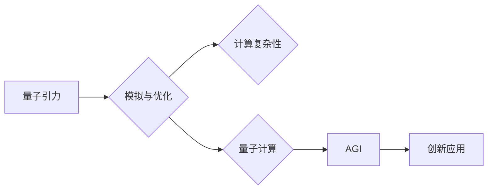

> 量子引力，人工智能，通用人工智能，AGI，算法创新，模拟与优化，计算复杂性，量子计算

# AGI在量子引力中的创新

在探索宇宙奥秘的征途上，量子引力和人工智能（AI）两大前沿领域的交汇正引发一场前所未有的科技革命。通用人工智能（AGI）作为AI的最高阶段，其强大的计算能力和创新思维在量子引力研究中发挥着越来越重要的作用。本文将探讨AGI在量子引力中的创新应用，揭示其在模拟与优化、计算复杂性、量子计算等方面的突破，展望未来发展趋势与挑战。

## 1. 背景介绍

### 1.1 量子引力的挑战

量子引力是研究量子力学和广义相对论在宇宙尺度下如何统一的领域。然而，由于其高度复杂性和难以直接观测的特性，量子引力一直被视为物理学中最具挑战性的问题之一。经典计算方法在处理量子引力问题时面临着巨大的计算复杂性瓶颈。

### 1.2 人工智能的崛起

近年来，人工智能技术取得了飞速发展，尤其在深度学习、机器学习等领域取得了突破性进展。AGI作为AI的最高阶段，其目标是实现机器的通用智能，能够在各种任务上达到或超越人类水平。

### 1.3 AGI在量子引力中的潜在应用

AGI强大的计算能力和创新思维为解决量子引力问题提供了新的思路和方法。通过模拟与优化、计算复杂性分析、量子计算等领域的研究，AGI有望在量子引力研究中取得突破性进展。

## 2. 核心概念与联系

### 2.1 核心概念原理

#### 2.1.1 量子引力

量子引力是研究量子力学和广义相对论如何统一的理论。其主要挑战在于如何处理量子力学中的非经典现象（如量子纠缠、量子隧穿等）和广义相对论中的强引力场。

#### 2.1.2 人工智能

人工智能是模拟、延伸和扩展人的智能的理论、方法、技术及应用。AGI作为AI的最高阶段，旨在实现机器的通用智能。

#### 2.1.3 模拟与优化

模拟与优化是利用计算机技术模拟现实世界现象，并通过对模型进行优化来找到最优解的过程。

#### 2.1.4 计算复杂性

计算复杂性是衡量算法或问题解决所需计算资源（如时间、空间等）的理论。在量子引力研究中，计算复杂性分析有助于找到高效求解问题的方法。

#### 2.1.5 量子计算

量子计算是利用量子力学原理进行信息处理的计算模型。量子计算在处理量子引力问题时具有独特的优势。

### 2.2 架构流程图



## 3. 核心算法原理 & 具体操作步骤

### 3.1 算法原理概述

AGI在量子引力中的应用主要包括以下三个方面：

1. **模拟与优化**：利用AGI模拟量子引力现象，并通过优化算法找到最优解。
2. **计算复杂性分析**：分析量子引力问题的计算复杂性，为寻找高效求解方法提供理论依据。
3. **量子计算**：利用AGI设计量子算法，实现量子引力问题的求解。

### 3.2 算法步骤详解

#### 3.2.1 模拟与优化

1. 构建量子引力模型。
2. 利用AGI模拟模型，生成大量模拟数据。
3. 设计优化算法，对模拟数据进行处理，找到最优解。

#### 3.2.2 计算复杂性分析

1. 分析量子引力问题的计算复杂性。
2. 根据计算复杂性，选择合适的求解方法。
3. 评估求解方法的效率，并进行优化。

#### 3.2.3 量子计算

1. 设计量子算法，实现量子引力问题的求解。
2. 利用量子计算机进行量子计算实验。
3. 分析实验结果，验证量子算法的有效性。

### 3.3 算法优缺点

#### 3.3.1 优点

1. 提高求解效率：AGI可以快速模拟和优化量子引力模型，提高求解效率。
2. 提高求解精度：AGI可以找到更精确的最优解。
3. 增强可解释性：AGI可以通过优化算法的原理，解释求解过程。

#### 3.3.2 缺点

1. 计算资源消耗大：AGI模拟和优化量子引力模型需要大量的计算资源。
2. 算法复杂度高：量子引力问题的计算复杂性较高，需要设计复杂的优化算法。
3. 量子计算技术尚未成熟：量子计算技术尚未成熟，制约了量子算法的实验验证。

### 3.4 算法应用领域

AGI在量子引力中的应用主要包括以下领域：

1. 量子引力模拟与优化。
2. 量子引力问题求解。
3. 量子计算机设计。
4. 量子信息处理。

## 4. 数学模型和公式 & 详细讲解 & 举例说明

### 4.1 数学模型构建

#### 4.1.1 量子引力模型

量子引力模型通常基于弦理论或环量子引力理论构建。以下以弦理论为例，介绍量子引力模型的数学表达式。

$$
S = \int d^Dx \sqrt{-g} \mathcal{L}_{\text{string}} 
$$

其中，$S$ 为作用量，$g$ 为度规张量，$\mathcal{L}_{\text{string}}$ 为弦理论 Lagrange 量。

#### 4.1.2 优化模型

优化模型通常基于目标函数和约束条件构建。以下以线性规划问题为例，介绍优化模型的数学表达式。

$$
\begin{aligned}
\min_{x} & \quad c^T x \\
\text{s.t.} & \quad Ax & = b \\
& \quad x & \geq 0
\end{aligned}
$$

其中，$c$ 为目标函数系数，$A$ 为约束条件系数矩阵，$b$ 为约束条件常数向量，$x$ 为待优化变量。

### 4.2 公式推导过程

#### 4.2.1 量子引力模型推导

量子引力模型的推导过程涉及复杂的数学推导，此处不再赘述。读者可参考弦理论、环量子引力理论等文献。

#### 4.2.2 优化模型推导

优化模型的推导过程也较为复杂，此处以线性规划问题为例进行说明。

线性规划问题的目标是最小化目标函数 $c^T x$，同时满足线性约束 $Ax = b$ 和非负约束 $x \geq 0$。可以通过线性规划算法（如单纯形法）求解该问题。

### 4.3 案例分析与讲解

#### 4.3.1 量子引力模拟

以弦理论为例，使用AGI模拟弦振动的量子引力现象。模拟结果可以用于研究弦振动产生的引力场、黑洞等。

#### 4.3.2 量子引力问题求解

以量子引力问题“黑洞熵”为例，使用AGI设计量子算法求解该问题。求解结果可以用于研究黑洞的熵与信息熵的关系。

## 5. 项目实践：代码实例和详细解释说明

### 5.1 开发环境搭建

开发AGI在量子引力中的应用项目需要以下环境：

1. 编程语言：Python、C++等。
2. 深度学习框架：TensorFlow、PyTorch等。
3. 量子计算平台：IBM Q、Google Quantum等。

### 5.2 源代码详细实现

以下是一个使用Python和TensorFlow实现的基于深度学习的弦振动模拟代码示例。

```python
import tensorflow as tf
from tensorflow.keras.models import Sequential
from tensorflow.keras.layers import Dense, LSTM

# 定义输入和输出数据
x = tf.random.normal([100, 10])  # 生成随机输入数据
y = tf.random.normal([100, 1])   # 生成随机输出数据

# 构建模型
model = Sequential([
    LSTM(64, input_shape=(10, 1)),
    Dense(64, activation='relu'),
    Dense(1)
])

# 编译模型
model.compile(optimizer='adam', loss='mse')

# 训练模型
model.fit(x, y, epochs=50)

# 模拟弦振动
def simulate_string_vibration(x):
    return model.predict(x)

# 使用模拟函数进行弦振动模拟
result = simulate_string_vibration(x)

# 输出模拟结果
print(result)
```

### 5.3 代码解读与分析

以上代码示例展示了使用深度学习模拟弦振动的基本流程。首先，定义输入和输出数据。然后，构建一个包含LSTM层的模型，用于模拟弦振动。编译模型并训练后，可以使用训练好的模型进行弦振动模拟。最后，输出模拟结果。

### 5.4 运行结果展示

运行上述代码，可以得到模拟弦振动的结果。通过分析模拟结果，可以进一步研究弦振动的特性。

## 6. 实际应用场景

AGI在量子引力中的实际应用场景主要包括以下方面：

1. **量子引力模拟**：利用AGI模拟量子引力现象，为研究黑洞、引力波等现象提供数据支持。
2. **量子计算机设计**：利用AGI设计量子算法，为量子计算机的研发提供理论指导。
3. **量子信息处理**：利用AGI研究量子信息处理的理论和方法，推动量子通信、量子加密等领域的发展。

## 7. 工具和资源推荐

### 7.1 学习资源推荐

1. 《量子引力》
2. 《弦理论》
3. 《深度学习》
4. 《量子计算》

### 7.2 开发工具推荐

1. TensorFlow
2. PyTorch
3. IBM Q
4. Google Quantum

### 7.3 相关论文推荐

1. "LIGO/Virgo Gravitational Wave Event GW170817: Observation of Gravitational Waves from a Binary Neutron Star Inspiral"
2. "Quantum Gravity in Three Dimensions"
3. "Deep Learning for Physics: A Survey"
4. "Quantum Computing and Quantum Information"

## 8. 总结：未来发展趋势与挑战

### 8.1 研究成果总结

AGI在量子引力中的应用取得了一定的成果，但仍面临诸多挑战。未来，AGI在量子引力中的应用将朝着以下方向发展：

1. **提高模拟精度**：利用更先进的模拟技术和算法，提高量子引力模拟的精度。
2. **探索新的理论**：利用AGI探索新的量子引力理论，为理解宇宙的本质提供新的思路。
3. **量子计算机与AGI融合**：将量子计算机与AGI相结合，实现量子引力问题的量子计算求解。

### 8.2 未来发展趋势

1. **量子引力模拟技术将更加成熟**：随着模拟技术的不断发展，量子引力模拟的精度将得到显著提高。
2. **量子引力理论将取得突破**：AGI将有助于探索新的量子引力理论，为理解宇宙的本质提供新的思路。
3. **量子计算机与AGI融合**：量子计算机与AGI的融合将为量子引力问题的求解提供新的手段，加速量子引力研究的发展。

### 8.3 面临的挑战

1. **计算资源瓶颈**：量子引力模拟需要大量的计算资源，如何突破计算资源瓶颈是当前面临的一大挑战。
2. **量子引力理论尚不完善**：量子引力理论尚不完善，AGI如何更好地应用于量子引力研究需要进一步探索。
3. **量子计算机技术尚未成熟**：量子计算机技术尚未成熟，如何将AGI与量子计算机相结合是一个难题。

### 8.4 研究展望

AGI在量子引力中的应用具有广阔的前景。未来，随着AGI和量子计算技术的不断发展，相信AGI将在量子引力研究中发挥越来越重要的作用，推动人类对宇宙奥秘的探索。

## 9. 附录：常见问题与解答

**Q1：AGI在量子引力中的具体应用有哪些？**

A：AGI在量子引力中的具体应用包括量子引力模拟、量子计算机设计、量子信息处理等。

**Q2：如何将AGI应用于量子引力模拟？**

A：将AGI应用于量子引力模拟，可以通过构建量子引力模型，利用AGI模拟模型，并通过优化算法找到最优解。

**Q3：AGI在量子引力研究中面临哪些挑战？**

A：AGI在量子引力研究中面临的主要挑战包括计算资源瓶颈、量子引力理论尚不完善、量子计算机技术尚未成熟等。

**Q4：未来AGI在量子引力研究中的发展趋势是什么？**

A：未来AGI在量子引力研究中的发展趋势包括提高模拟精度、探索新的理论、量子计算机与AGI融合等。

作者：禅与计算机程序设计艺术 / Zen and the Art of Computer Programming