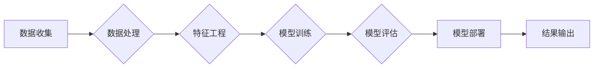

# AI 原理与代码实例讲解

> 关键词：人工智能，机器学习，深度学习，神经网络，Python，TensorFlow，Keras，案例研究

## 1. 背景介绍

人工智能（AI）的发展已经走过了漫长的道路，从早期的符号主义到连接主义，再到如今的深度学习时代，人工智能技术在各个领域都取得了显著的进展。本文将深入探讨AI的核心原理，并通过实际代码实例讲解如何使用Python和TensorFlow框架构建智能系统。

### 1.1 人工智能的由来

人工智能的概念最早可以追溯到20世纪50年代，当时的计算机科学家们希望能够创造出能够模仿人类智能的机器。早期的人工智能研究主要集中在符号主义和连接主义两种范式上。

- **符号主义**：认为智能是符号操作的过程，强调逻辑推理和知识表示。
- **连接主义**：认为智能是神经网络中的信号传递过程，强调学习和自适应。

随着计算能力的提升和大数据的涌现，深度学习成为了人工智能领域的主流技术。

### 1.2 深度学习的兴起

深度学习是一种利用深层神经网络进行数据驱动学习的机器学习技术。它通过模拟人脑的神经元连接结构，使得模型能够自动从数据中学习复杂的特征和模式。

### 1.3 本文结构

本文将分为以下几个部分：

- 核心概念与联系
- 核心算法原理与具体操作步骤
- 数学模型和公式讲解
- 项目实践：代码实例和详细解释
- 实际应用场景
- 工具和资源推荐
- 总结：未来发展趋势与挑战

## 2. 核心概念与联系

### 2.1 核心概念

以下是一些人工智能领域的核心概念及其相互关系：

```mermaid
graph LR
A[符号主义] --> B{连接主义}
A --> C[知识表示]
B --> D[深度学习}
B --> E[神经网络]
C --> F[专家系统]
D --> G[卷积神经网络(CNN)]
D --> H[递归神经网络(RNN)]
D --> I[长短期记忆网络(LSTM)]
D --> J[生成对抗网络(GAN)]
F --> K[推理]
F --> L[知识获取]
```

### 2.2 架构流程图

以下是人工智能系统的一个简化架构流程图：



## 3. 核心算法原理与具体操作步骤

### 3.1 算法原理概述

深度学习算法的核心是神经网络。神经网络由多个层组成，包括输入层、隐藏层和输出层。每个层由多个神经元组成，神经元之间通过权重连接。

### 3.2 算法步骤详解

以下是使用神经网络进行分类任务的步骤：

1. **数据准备**：收集和清洗数据，将其分为训练集、验证集和测试集。
2. **模型构建**：使用TensorFlow或Keras等框架构建神经网络模型。
3. **模型训练**：使用训练集数据训练模型，调整模型参数。
4. **模型评估**：使用验证集数据评估模型性能，调整模型结构或参数。
5. **模型测试**：使用测试集数据测试模型性能，确保模型泛化能力。

### 3.3 算法优缺点

**优点**：

- **强大的非线性建模能力**：能够学习复杂的数据关系。
- **自动特征提取**：无需人工特征工程，能够自动提取特征。
- **泛化能力强**：在大量数据上训练的模型能够在新的数据上表现良好。

**缺点**：

- **需要大量数据和计算资源**：训练深度学习模型需要大量数据和计算资源。
- **参数调整复杂**：需要花费大量时间调整模型参数。
- **可解释性差**：神经网络模型通常难以解释其决策过程。

### 3.4 算法应用领域

深度学习在以下领域有广泛的应用：

- **计算机视觉**：图像识别、物体检测、图像分割等。
- **自然语言处理**：文本分类、机器翻译、情感分析等。
- **语音识别**：语音转文字、语音合成等。
- **推荐系统**：个性化推荐、广告投放等。

## 4. 数学模型和公式 & 详细讲解 & 举例说明

### 4.1 数学模型构建

神经网络中的基本数学模型是神经元。一个神经元可以表示为：

$$
y_i = f(W_i \cdot x + b)
$$

其中 $y_i$ 是输出，$x$ 是输入，$W_i$ 是权重，$b$ 是偏置，$f$ 是激活函数。

### 4.2 公式推导过程

以下是神经网络中反向传播算法的推导过程：

1. **计算梯度**：

$$
\frac{\partial J}{\partial W_{ij}} = \frac{\partial J}{\partial y_i} \frac{\partial y_i}{\partial z_i} \frac{\partial z_i}{\partial W_{ij}}
$$

其中 $J$ 是损失函数，$z_i$ 是神经元 $i$ 的激活值。

2. **更新权重**：

$$
W_{ij} := W_{ij} - \eta \frac{\partial J}{\partial W_{ij}}
$$

其中 $\eta$ 是学习率。

### 4.3 案例分析与讲解

以下是一个简单的神经网络示例，它用于二分类任务：

```python
import tensorflow as tf
from tensorflow.keras.models import Sequential
from tensorflow.keras.layers import Dense

# 构建模型
model = Sequential()
model.add(Dense(10, activation='relu', input_shape=(2,)))
model.add(Dense(1, activation='sigmoid'))

# 编译模型
model.compile(optimizer='adam', loss='binary_crossentropy', metrics=['accuracy'])

# 训练模型
x_train = [[0, 0], [0, 1], [1, 0], [1, 1]]
y_train = [0, 1, 0, 1]
model.fit(x_train, y_train, epochs=10)

# 预测
x_test = [[0, 0], [1, 1]]
predictions = model.predict(x_test)
print(predictions)
```

## 5. 项目实践：代码实例和详细解释说明

### 5.1 开发环境搭建

为了运行下面的代码，需要安装以下软件：

- Python 3.7+
- TensorFlow 2.x
- Jupyter Notebook

### 5.2 源代码详细实现

以下是一个简单的图像分类项目的代码示例：

```python
import tensorflow as tf
from tensorflow.keras.applications import VGG16
from tensorflow.keras.layers import Flatten, Dense
from tensorflow.keras.models import Model

# 加载预训练的VGG16模型
base_model = VGG16(weights='imagenet', include_top=False)

# 添加全连接层
x = Flatten()(base_model.output)
predictions = Dense(10, activation='softmax')(x)

# 创建新的模型
model = Model(inputs=base_model.input, outputs=predictions)

# 编译模型
model.compile(optimizer='adam', loss='categorical_crossentropy', metrics=['accuracy'])

# 加载数据集
(x_train, y_train), (x_test, y_test) = tf.keras.datasets.cifar10.load_data()

# 预处理数据
x_train = x_train.astype('float32') / 255
x_test = x_test.astype('float32') / 255
y_train = tf.keras.utils.to_categorical(y_train, 10)
y_test = tf.keras.utils.to_categorical(y_test, 10)

# 训练模型
model.fit(x_train, y_train, epochs=10, batch_size=64)

# 测试模型
test_loss, test_acc = model.evaluate(x_test, y_test)
print('Test accuracy:', test_acc)
```

### 5.3 代码解读与分析

- 使用VGG16预训练模型作为基础模型，提取特征。
- 添加全连接层，将特征转换为类别预测。
- 使用Adam优化器和交叉熵损失函数进行训练。
- 加载CIFAR-10数据集进行训练和测试。
- 输出测试集的准确率。

## 6. 实际应用场景

深度学习在许多实际应用场景中取得了显著成果，以下是一些例子：

- **医疗影像分析**：使用深度学习模型进行疾病诊断，如乳腺癌、视网膜病变等。
- **自动驾驶**：使用深度学习模型进行图像识别、目标检测等任务。
- **金融风控**：使用深度学习模型进行信用评分、欺诈检测等。
- **自然语言处理**：使用深度学习模型进行机器翻译、语音识别等。

## 7. 工具和资源推荐

### 7.1 学习资源推荐

- **书籍**：
  - 《深度学习》（Goodfellow, Bengio, Courville）
  - 《Python深度学习》（François Chollet）
- **在线课程**：
  - Coursera的《机器学习》课程（Andrew Ng）
  - fast.ai的《深度学习》课程（Jeremy Howard）
- **社区**：
  - TensorFlow官方文档
  - Keras官方文档
  - GitHub上的深度学习项目

### 7.2 开发工具推荐

- **编程语言**：Python
- **框架**：TensorFlow, Keras
- **库**：NumPy, Pandas, Scikit-learn
- **数据集**：
  - TensorFlow Datasets
  - Keras Datasets

### 7.3 相关论文推荐

- **卷积神经网络**：
  - "A Guide to Convolutional Neural Networks"（A. Krizhevsky, I. Sutskever, G. E. Hinton）
  - "Convolutional Networks for Visual Recognition"（A. Krizhevsky, I. Sutskever, G. E. Hinton）
- **递归神经网络**：
  - "Recurrent Neural Networks"（Y. Bengio, P. Simard, P. Frasconi）
  - "LSTM: A Long Short-Term Memory"（Hochreiter, Schmidhuber）
- **生成对抗网络**：
  - "Generative Adversarial Nets"（I. Goodfellow, J. Pouget-Abadie, M. Arjovsky, et al.）

## 8. 总结：未来发展趋势与挑战

### 8.1 研究成果总结

深度学习技术的发展为人工智能领域带来了巨大的进步。通过构建复杂的神经网络，深度学习模型能够自动从数据中学习复杂的特征和模式，并在许多领域取得了显著的成果。

### 8.2 未来发展趋势

- **模型压缩**：为了降低模型的计算复杂度和存储需求，模型压缩技术将成为研究热点。
- **可解释性**：为了提高模型的可靠性和可信度，可解释性研究将成为重要方向。
- **多模态学习**：将深度学习应用于多个模态的数据，如文本、图像和视频，将成为新的研究趋势。

### 8.3 面临的挑战

- **数据隐私**：随着数据量的增加，数据隐私保护将成为一个重要问题。
- **计算资源**：深度学习模型的训练需要大量的计算资源，如何高效利用计算资源是一个挑战。
- **可解释性**：深度学习模型的决策过程难以解释，如何提高模型的可解释性是一个挑战。

### 8.4 研究展望

未来，深度学习将继续在人工智能领域发挥重要作用。通过不断的研究和创新，深度学习将为人类社会带来更多的便利和进步。

## 9. 附录：常见问题与解答

**Q1：什么是神经网络？**

A：神经网络是一种模拟人脑神经元连接结构的计算模型，它由多个层组成，包括输入层、隐藏层和输出层。每个层由多个神经元组成，神经元之间通过权重连接。

**Q2：什么是深度学习？**

A：深度学习是一种利用深层神经网络进行数据驱动学习的机器学习技术。它通过模拟人脑的神经元连接结构，使得模型能够自动从数据中学习复杂的特征和模式。

**Q3：深度学习有哪些应用？**

A：深度学习在许多领域都有应用，包括计算机视觉、自然语言处理、语音识别、推荐系统等。

**Q4：如何学习深度学习？**

A：可以通过阅读相关书籍、在线课程和参加社区活动来学习深度学习。TensorFlow和Keras等框架也提供了丰富的文档和示例代码，可以帮助你快速入门。

**Q5：深度学习的未来发展趋势是什么？**

A：深度学习的未来发展趋势包括模型压缩、可解释性、多模态学习等。

作者：禅与计算机程序设计艺术 / Zen and the Art of Computer Programming