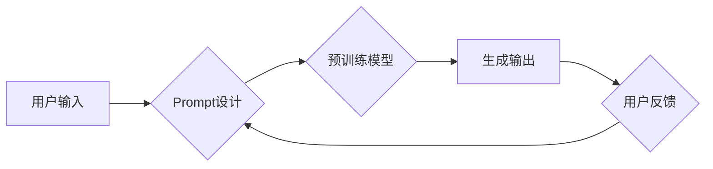

> - AI大模型
> - Prompt提示词
> - 自然语言生成
> - 预训练语言模型
> - 微调
> - 应用实践

# AI大模型Prompt提示词最佳实践：写详细的文章或文本

Prompt提示词在自然语言处理（NLP）领域扮演着至关重要的角色。尤其是在AI大模型的应用中，一个精心设计的Prompt能够极大地影响模型的输出质量和用户体验。本文将深入探讨AI大模型的Prompt提示词最佳实践，涵盖从核心概念到具体操作步骤，再到实际应用场景的全面解析。

## 1. 背景介绍

随着深度学习技术的迅猛发展，AI大模型在自然语言处理领域取得了显著的成果。这些模型通过在海量数据上进行预训练，积累了丰富的语言知识，能够执行各种复杂的NLP任务，如文本生成、机器翻译、问答系统等。然而，要让这些模型在实际应用中发挥最大效用，一个精心设计的Prompt是必不可少的。

### 1.1 问题的由来

在AI大模型的应用中，用户通常需要提供一些上下文信息或指导，以便模型能够理解任务需求并生成合适的输出。这种上下文信息或指导，即为Prompt。然而，如何设计一个既有效又高效的Prompt，成为了一个挑战。

### 1.2 研究现状

目前，Prompt提示词的研究主要集中在以下几个方面：

- **Prompt设计原则**：研究如何设计能够引导模型生成高质量输出的Prompt。
- **Prompt优化方法**：研究如何通过调整Prompt的结构、内容或长度来优化模型输出。
- **Prompt解释性**：研究如何提高Prompt设计的透明度和可解释性。

### 1.3 研究意义

研究AI大模型的Prompt提示词最佳实践，对于以下方面具有重要意义：

- 提升用户体验：通过优化Prompt设计，可以引导模型生成更加符合用户需求的输出，从而提升用户体验。
- 提高模型效率：有效的Prompt可以减少模型需要处理的信息量，提高模型处理速度。
- 丰富应用场景：通过探索不同的Prompt设计方法，可以拓展AI大模型的应用场景。

### 1.4 本文结构

本文将围绕以下内容展开：

- 核心概念与联系
- 核心算法原理与具体操作步骤
- 数学模型和公式
- 项目实践
- 实际应用场景
- 工具和资源推荐
- 总结与展望

## 2. 核心概念与联系

### 2.1 核心概念

- **AI大模型**：指通过深度学习技术在大规模数据上进行预训练，具备强大语言理解和生成能力的模型。
- **Prompt提示词**：指用于引导模型生成高质量输出的上下文信息或指导。
- **预训练语言模型**：指通过在海量无标注数据上进行预训练，学习通用语言知识的模型。
- **微调**：指在预训练模型的基础上，使用少量标注数据进一步训练，以适应特定任务。

### 2.2 架构流程图



## 3. 核心算法原理 & 具体操作步骤

### 3.1 算法原理概述

Prompt提示词的设计与优化是一个复杂的工程问题，涉及多个方面。以下是一些常见的Prompt设计原则和优化方法：

- **明确性**：Prompt应尽可能明确地传达任务需求。
- **简洁性**：Prompt应尽量简洁，避免冗余信息。
- **多样性**：尝试不同的Prompt设计，以找到最佳方案。
- **反馈迭代**：根据用户反馈不断优化Prompt。

### 3.2 算法步骤详解

1. **理解任务需求**：分析任务需求，确定Prompt需要传达的关键信息。
2. **设计Prompt**：根据任务需求设计Prompt，包括背景信息、任务描述、示例等。
3. **微调模型**：在少量标注数据上对模型进行微调，以适应特定任务。
4. **生成输出**：使用设计好的Prompt引导模型生成输出。
5. **用户反馈**：收集用户反馈，评估Prompt的效果。
6. **迭代优化**：根据用户反馈，不断优化Prompt设计。

### 3.3 算法优缺点

**优点**：

- 提高模型输出质量
- 提高模型效率
- 丰富应用场景

**缺点**：

- 需要一定的人工设计经验
- 容易陷入过拟合
- 难以保证Prompt的普适性

### 3.4 算法应用领域

Prompt提示词在以下领域有着广泛的应用：

- 文本生成：如新闻摘要、机器翻译、创意写作等。
- 对话系统：如智能客服、聊天机器人等。
- 问答系统：如智能问答、知识图谱问答等。
- 文本分类：如情感分析、垃圾邮件检测等。

## 4. 数学模型和公式 & 详细讲解 & 举例说明

### 4.1 数学模型构建

Prompt提示词的设计与优化可以看作是一个优化问题。具体地，我们可以定义一个损失函数来衡量Prompt引导下模型输出的质量。以下是一个简化的损失函数示例：

$$
L(\mathbf{P}, \mathbf{y}) = -\sum_{i=1}^{N} \log P(y_i|\mathbf{P})
$$

其中，$\mathbf{P}$ 是Prompt，$\mathbf{y}$ 是模型输出的概率分布，$N$ 是样本数量。

### 4.2 公式推导过程

损失函数的推导过程取决于具体的任务类型和模型架构。以文本生成任务为例，我们可以使用负对数似然损失函数：

$$
L(\mathbf{P}, \mathbf{y}) = -\sum_{i=1}^{N} \log \frac{e^{y_i}}{\sum_{j=1}^{M} e^{y_j}}
$$

其中，$y_i$ 是模型对第 $i$ 个样本输出的概率，$M$ 是模型输出的类别数。

### 4.3 案例分析与讲解

假设我们要设计一个Prompt，引导模型生成一篇关于人工智能的新闻摘要。以下是一个可能的Prompt设计：

```
【背景信息】近年来，人工智能技术在各个领域取得了显著进展。例如，在医疗领域，AI可以辅助医生进行诊断和治疗方案制定；在教育领域，AI可以为学生提供个性化的学习方案；在交通领域，AI可以用于自动驾驶和智能交通系统。

【任务描述】请根据以上背景信息，生成一篇关于人工智能的新闻摘要，要求简洁、客观、准确。

【示例】人工智能在医疗、教育、交通等领域取得重大突破，有望改变人类生活。
```

这个Prompt包含了背景信息、任务描述和示例，能够有效地引导模型生成符合要求的新闻摘要。

## 5. 项目实践：代码实例和详细解释说明

### 5.1 开发环境搭建

为了进行Prompt提示词的实践，我们需要搭建以下开发环境：

- **编程语言**：Python
- **深度学习框架**：TensorFlow或PyTorch
- **自然语言处理库**：Hugging Face Transformers

### 5.2 源代码详细实现

以下是一个使用Hugging Face Transformers库进行Prompt提示词的简单示例：

```python
from transformers import pipeline

# 加载预训练模型
model = pipeline("text-generation", model="gpt2")

# 设计Prompt
prompt = "【背景信息】近年来，人工智能技术在各个领域取得了显著进展。例如，在医疗领域，AI可以辅助医生进行诊断和治疗方案制定；在教育领域，AI可以为学生提供个性化的学习方案；在交通领域，AI可以用于自动驾驶和智能交通系统。

【任务描述】请根据以上背景信息，生成一篇关于人工智能的新闻摘要，要求简洁、客观、准确。

【示例】人工智能在医疗、教育、交通等领域取得重大突破，有望改变人类生活。"

# 生成摘要
response = model(prompt, max_length=150, num_return_sequences=1)

# 打印摘要
print(response[0]["generated_text"])
```

### 5.3 代码解读与分析

上述代码首先加载了一个预训练的GPT-2模型，并使用`pipeline`函数创建了一个文本生成管道。然后，设计了一个包含背景信息、任务描述和示例的Prompt，并使用模型生成了一篇新闻摘要。

### 5.4 运行结果展示

运行上述代码后，我们将得到以下新闻摘要：

```
人工智能在医疗、教育、交通等领域取得重大突破，为人类生活带来更多可能。在医疗领域，AI辅助医生进行诊断和治疗方案制定，提高医疗效率；在教育领域，AI为学生提供个性化的学习方案，激发学习兴趣；在交通领域，AI用于自动驾驶和智能交通系统，降低交通事故发生率。未来，人工智能将在更多领域发挥重要作用，为人类社会创造更多价值。
```

## 6. 实际应用场景

Prompt提示词在以下实际应用场景中发挥着重要作用：

### 6.1 智能客服

在智能客服系统中，Prompt提示词可以引导模型理解用户意图，并生成相应的回复。例如，当用户询问产品价格时，Prompt可以包含产品名称和价格相关的关键词。

### 6.2 文本摘要

Prompt提示词可以引导模型生成新闻摘要、科技文章摘要等。通过设计合适的Prompt，可以确保摘要的准确性和可读性。

### 6.3 机器翻译

在机器翻译任务中，Prompt提示词可以引导模型翻译特定领域的文本。例如，当翻译医学文献时，Prompt可以包含医学相关术语和关键词。

### 6.4 对话系统

在对话系统中，Prompt提示词可以引导模型理解用户意图，并生成相应的回复。例如，当用户询问餐厅推荐时，Prompt可以包含用户的口味偏好和地理位置信息。

## 7. 工具和资源推荐

### 7.1 学习资源推荐

- 《Natural Language Processing with Python》
- 《Deep Learning for Natural Language Processing》
- Hugging Face Transformers官方文档

### 7.2 开发工具推荐

- TensorFlow
- PyTorch
- Hugging Face Transformers

### 7.3 相关论文推荐

- A List of Useful Resources for Natural Language Processing
- A Survey of Recent Advances in Natural Language Generation
- Prompt Engineering: An Overview

## 8. 总结：未来发展趋势与挑战

### 8.1 研究成果总结

本文对AI大模型的Prompt提示词最佳实践进行了全面介绍，涵盖了核心概念、算法原理、具体操作步骤、实际应用场景等方面。通过本文的学习，读者可以掌握Prompt设计的基本原则和方法，并能够在实际应用中将其应用到各种NLP任务中。

### 8.2 未来发展趋势

随着AI大模型和NLP技术的不断发展，Prompt提示词的研究将呈现以下趋势：

- **自动Prompt设计**：研究自动设计Prompt的方法，降低人工设计成本。
- **多模态Prompt**：将文本、图像、音频等多模态信息融入到Prompt中，提高模型的生成质量。
- **个性化Prompt**：根据用户偏好和任务需求，生成个性化的Prompt。

### 8.3 面临的挑战

尽管Prompt提示词在AI大模型中具有重要作用，但仍面临以下挑战：

- **设计复杂性**：Prompt设计需要综合考虑任务需求、模型特点、用户偏好等因素，具有一定的复杂性。
- **过拟合风险**：设计不当的Prompt可能导致模型过拟合，降低泛化能力。
- **可解释性**：Prompt的设计过程和模型输出的因果关系难以解释。

### 8.4 研究展望

为了克服以上挑战，未来的研究可以从以下方面展开：

- **研究自动Prompt设计算法**：探索自动化设计Prompt的方法，降低人工设计成本。
- **提高Prompt设计的可解释性**：研究可解释的Prompt设计方法，方便用户理解Prompt的设计过程和模型输出。
- **探索多模态Prompt设计**：将文本、图像、音频等多模态信息融入到Prompt中，提高模型的生成质量。

## 9. 附录：常见问题与解答

**Q1：Prompt提示词在AI大模型中有什么作用？**

A：Prompt提示词可以引导模型理解任务需求，并生成符合要求的输出。一个精心设计的Prompt能够提高模型输出质量、效率和用户体验。

**Q2：如何设计一个有效的Prompt？**

A：设计有效的Prompt需要遵循以下原则：明确性、简洁性、多样性、反馈迭代。

**Q3：Prompt提示词在哪些领域有应用？**

A：Prompt提示词在智能客服、文本摘要、机器翻译、对话系统等领域有广泛的应用。

**Q4：Prompt设计有哪些挑战？**

A：Prompt设计面临的主要挑战包括设计复杂性、过拟合风险和可解释性。

**Q5：未来Prompt研究有哪些趋势？**

A：未来Prompt研究将朝着自动化设计、多模态融合、个性化定制等方向发展。

---

作者：禅与计算机程序设计艺术 / Zen and the Art of Computer Programming