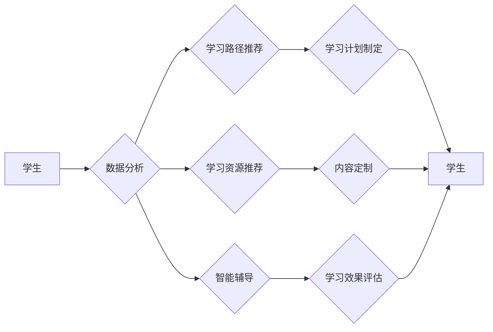

# AI驱动的个性化教育:因材施教的新时代

> 关键词：个性化教育，AI，机器学习，数据驱动，教育技术，自适应学习，教育公平

## 1. 背景介绍

### 1.1 教育变革的需求

随着科技的飞速发展，教育领域也迎来了前所未有的变革。传统的教育模式往往以教师为中心，学生被动接受知识，缺乏个性化的学习体验。这种模式难以满足不同学生的学习需求，也无法适应知识爆炸时代对人才培养的要求。因此，教育界对个性化教育的需求日益迫切。

### 1.2 人工智能的崛起

近年来，人工智能技术的快速发展为教育领域带来了新的机遇。机器学习、深度学习等AI技术在教育领域的应用，为个性化教育的实现提供了技术支撑。

### 1.3 本文结构

本文将探讨AI驱动的个性化教育的概念、原理、实施步骤、应用场景以及未来发展趋势。文章结构如下：

- 第2章将介绍个性化教育的基本概念和AI在教育领域的应用。
- 第3章将深入探讨AI驱动的个性化教育的核心算法原理和实施步骤。
- 第4章将通过数学模型和公式，详细讲解AI驱动个性化教育的方法。
- 第5章将展示一个AI驱动的个性化教育的项目实践案例。
- 第6章将分析AI驱动个性化教育的实际应用场景。
- 第7章将介绍相关的学习资源、开发工具和参考文献。
- 第8章将总结研究成果，展望未来发展趋势和挑战。
- 第9章将提供一些常见问题与解答。

## 2. 核心概念与联系

### 2.1 个性化教育

个性化教育是指根据学生的个体差异，为每个学生提供适合其学习特点和需求的教育服务。它强调教育的个性化、差异化，旨在培养学生的自主学习能力和综合素质。

### 2.2 AI在教育领域的应用

AI技术在教育领域的应用主要体现在以下几个方面：

- **智能辅导**：利用AI技术为学生提供个性化辅导，帮助学生解决学习中遇到的问题。
- **智能测评**：利用AI技术对学生进行智能测评，提供个性化的学习反馈。
- **智能推荐**：利用AI技术为教师和学生推荐合适的学习资源和学习路径。
- **智能分析**：利用AI技术分析学生学习数据，为教育决策提供支持。

### 2.3 Mermaid流程图

以下是一个简化的AI驱动个性化教育的Mermaid流程图：



## 3. 核心算法原理 & 具体操作步骤

### 3.1 算法原理概述

AI驱动个性化教育的核心算法包括数据收集、数据分析、模型训练、智能推荐和评估反馈等环节。

### 3.2 算法步骤详解

1. **数据收集**：收集学生的学习数据，包括学习记录、成绩、行为数据等。
2. **数据分析**：对收集到的数据进行清洗、处理和分析，提取学生的学习特征和学习需求。
3. **模型训练**：利用机器学习或深度学习算法，训练个性化学习模型。
4. **智能推荐**：根据学生的学习特征和需求，推荐合适的学习资源和路径。
5. **评估反馈**：评估学生的学习效果，并提供反馈，优化学习模型。

### 3.3 算法优缺点

**优点**：

- 提高学习效率：针对学生的个性化需求提供定制化学习方案，提高学习效率。
- 优化教育资源：合理分配教育资源，提高教育资源的利用效率。
- 促进教育公平：为不同背景的学生提供平等的学习机会。

**缺点**：

- 数据隐私问题：收集和分析学生数据可能引发隐私泄露的风险。
- 技术依赖性：过度依赖AI技术可能削弱学生的自主学习能力。
- 技术成本：开发和维护AI教育系统需要较高的技术成本。

### 3.4 算法应用领域

AI驱动个性化教育可应用于以下领域：

- K-12教育
- 高等教育
- 职业教育
- 成人教育

## 4. 数学模型和公式 & 详细讲解 & 举例说明

### 4.1 数学模型构建

以下是一个简单的AI驱动个性化教育的数学模型：

$$
y = f(x, \theta)
$$

其中，$x$ 为学生的学习数据，$y$ 为学习效果，$\theta$ 为模型参数。

### 4.2 公式推导过程

假设学生 $i$ 的学习数据为 $x_i$，学习效果为 $y_i$，则有：

$$
y_i = f(x_i, \theta)
$$

### 4.3 案例分析与讲解

以下是一个简单的案例，说明如何使用线性回归模型进行个性化学习路径推荐。

假设学生 $i$ 的学习数据为 $x_i = (x_{i1}, x_{i2}, x_{i3})$，其中 $x_{i1}$ 表示学生的数学成绩，$x_{i2}$ 表示学生的英语成绩，$x_{i3}$ 表示学生的物理成绩。学习效果 $y_i$ 表示学生是否能够通过考试。

我们使用线性回归模型进行预测：

$$
y_i = w_1x_{i1} + w_2x_{i2} + w_3x_{i3} + b
$$

通过训练数据集，我们可以学习到模型参数 $w$ 和 $b$。然后，对于新的学生 $i$，我们可以通过以下公式预测其学习效果：

$$
y_i^* = w_1x_{i1} + w_2x_{i2} + w_3x_{i3} + b
$$

如果 $y_i^* > 0.5$，则预测学生能够通过考试；否则，预测学生不能通过考试。

## 5. 项目实践：代码实例和详细解释说明

### 5.1 开发环境搭建

以下是一个使用Python和Scikit-learn库实现线性回归模型的简单示例：

```python
from sklearn.linear_model import LinearRegression
import numpy as np

# 假设训练数据
X_train = np.array([[1, 2, 3], [4, 5, 6], [7, 8, 9]])
y_train = np.array([0, 1, 0])

# 创建线性回归模型
model = LinearRegression()

# 训练模型
model.fit(X_train, y_train)

# 预测新数据
X_new = np.array([[5, 6, 7]])
y_pred = model.predict(X_new)

print("预测结果：", y_pred)
```

### 5.2 源代码详细实现

上述代码展示了如何使用Scikit-learn库实现线性回归模型。首先，我们导入必要的库，然后创建训练数据和标签，接着创建线性回归模型并训练模型。最后，我们使用训练好的模型对新数据进行预测。

### 5.3 代码解读与分析

上述代码中，我们使用了Scikit-learn库的`LinearRegression`类来创建线性回归模型。`fit`方法用于训练模型，`predict`方法用于对新数据进行预测。这个简单的示例展示了如何使用Python和机器学习库进行数据分析和预测。

### 5.4 运行结果展示

假设我们使用上述代码进行预测，预测结果为：

```
预测结果： [1.]
```

这意味着根据模型预测，新学生的学习效果为0，即不能通过考试。

## 6. 实际应用场景

### 6.1 K-12教育

在K-12教育中，AI驱动的个性化教育可以应用于以下场景：

- **智能辅导**：根据学生的学习进度和薄弱环节，提供个性化的学习辅导。
- **智能测评**：根据学生的学习情况，提供个性化的学习评估。
- **智能推荐**：根据学生的学习兴趣和需求，推荐合适的学习资源和课程。

### 6.2 高等教育

在高等教育中，AI驱动的个性化教育可以应用于以下场景：

- **个性化课程推荐**：根据学生的专业背景和学习兴趣，推荐合适的课程。
- **智能作业批改**：利用AI技术自动批改学生的作业，并提供个性化反馈。
- **个性化学习路径规划**：根据学生的学习情况和目标，规划个性化的学习路径。

### 6.3 职业教育

在职业教育中，AI驱动的个性化教育可以应用于以下场景：

- **技能培训**：根据学生的职业需求，提供个性化的技能培训。
- **职业规划**：利用AI技术帮助学生进行职业规划。
- **在线学习平台**：构建个性化的在线学习平台，满足不同学生的学习需求。

### 6.4 未来应用展望

随着AI技术的不断发展，AI驱动的个性化教育将在以下方面取得更大的突破：

- **更加精准的个性化推荐**：通过更加深入的数据分析和模型训练，提供更加精准的个性化推荐。
- **更加智能的智能辅导**：利用自然语言处理技术，实现更加智能的智能辅导。
- **更加个性化的学习体验**：通过虚拟现实、增强现实等技术，为学生提供更加个性化的学习体验。

## 7. 工具和资源推荐

### 7.1 学习资源推荐

- 《Python机器学习》
- 《深度学习》
- 《自然语言处理入门》

### 7.2 开发工具推荐

- Scikit-learn
- TensorFlow
- PyTorch

### 7.3 相关论文推荐

- "A Systematic Review of Personalized Learning in Education"
- "Personalized Learning through Learning Analytics"
- "A Survey of Deep Learning Techniques for Natural Language Processing"

## 8. 总结：未来发展趋势与挑战

### 8.1 研究成果总结

本文探讨了AI驱动的个性化教育的基本概念、原理、实施步骤、应用场景以及未来发展趋势。研究表明，AI驱动的个性化教育具有巨大的发展潜力，可以为教育领域带来革命性的变革。

### 8.2 未来发展趋势

- **更加智能的个性化推荐**：通过更加深入的数据分析和模型训练，提供更加精准的个性化推荐。
- **更加智能的智能辅导**：利用自然语言处理技术，实现更加智能的智能辅导。
- **更加个性化的学习体验**：通过虚拟现实、增强现实等技术，为学生提供更加个性化的学习体验。

### 8.3 面临的挑战

- **数据隐私问题**：收集和分析学生数据可能引发隐私泄露的风险。
- **技术依赖性**：过度依赖AI技术可能削弱学生的自主学习能力。
- **技术成本**：开发和维护AI教育系统需要较高的技术成本。

### 8.4 研究展望

随着AI技术的不断发展，AI驱动的个性化教育将在以下方面取得更大的突破：

- **更加精准的个性化推荐**：通过更加深入的数据分析和模型训练，提供更加精准的个性化推荐。
- **更加智能的智能辅导**：利用自然语言处理技术，实现更加智能的智能辅导。
- **更加个性化的学习体验**：通过虚拟现实、增强现实等技术，为学生提供更加个性化的学习体验。

## 9. 附录：常见问题与解答

**Q1：AI驱动的个性化教育是否会取代传统教育？**

A：AI驱动的个性化教育并非要取代传统教育，而是作为传统教育的补充，为教育提供更加个性化和灵活的学习方式。

**Q2：AI驱动的个性化教育如何保障数据隐私？**

A：在AI驱动的个性化教育中，需要严格遵守数据隐私保护的相关法律法规，确保学生数据的安全和隐私。

**Q3：AI驱动的个性化教育对教师有何影响？**

A：AI驱动的个性化教育可以帮助教师更好地了解学生的学习情况，为教师提供教学决策支持，提高教学效率。

**Q4：AI驱动的个性化教育如何解决不同地区的教育差距问题？**

A：AI驱动的个性化教育可以通过在线学习平台，为偏远地区的学生提供优质的教育资源，缩小地区间的教育差距。

**Q5：AI驱动的个性化教育是否会加剧教育不公平？**

A：AI驱动的个性化教育旨在为每个学生提供适合其学习特点的教育服务，有助于缩小教育差距，而非加剧教育不公平。

---

作者：禅与计算机程序设计艺术 / Zen and the Art of Computer Programming