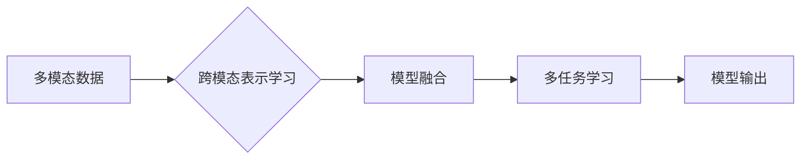

> 多模态大模型, 混合模型, 多任务学习, 预训练, 微调, 跨模态学习, 模型融合, NLP, 计算机视觉

# 多模态大模型：技术原理与实战 多模态大模型高效的训练方法

多模态大模型是近年来人工智能领域的一个重要研究方向，它旨在整合来自不同模态（如图像、文本、声音等）的信息，以实现对复杂场景的更全面理解。本文将深入探讨多模态大模型的技术原理、高效训练方法，并结合实际应用场景进行实战讲解。

## 1. 背景介绍

随着计算机视觉、自然语言处理（NLP）和语音识别等领域的快速发展，多模态学习逐渐成为了一个热门的研究方向。多模态大模型的出现，正是为了解决单一模态信息在理解和推理上的局限性，通过融合不同模态的信息，提高模型对复杂世界的理解和预测能力。

### 1.1 问题的由来

传统的单一模态模型在处理多模态问题时往往存在以下问题：

- 信息丢失：单一模态模型只能处理特定类型的信息，容易丢失其他模态中的重要信息。
- 模态对齐困难：不同模态的数据在表示和语义上存在差异，难以进行有效对齐。
- 模型复杂度增加：为了处理多模态信息，模型复杂度会显著增加，导致计算和存储成本上升。

### 1.2 研究现状

多模态大模型的研究主要集中在以下几个方面：

- 跨模态表示学习：学习不同模态之间的一致性和差异性，建立统一的多模态特征表示。
- 模型融合策略：设计不同的模型融合方法，将不同模态的信息有效地整合到同一模型中。
- 多任务学习：同时学习多个相关的任务，提高模型的泛化能力和鲁棒性。

### 1.3 研究意义

多模态大模型的研究具有以下意义：

- 提高信息处理能力：通过融合多模态信息，模型可以更全面地理解复杂场景，提高信息处理能力。
- 降低模型复杂度：多模态大模型可以共享底层特征表示，降低模型的复杂度。
- 拓展应用领域：多模态大模型可以应用于更多需要跨模态信息处理的场景，如人机交互、自动驾驶等。

## 2. 核心概念与联系

### 2.1 核心概念原理

多模态大模型的核心概念包括：

- **多模态数据**：指来自不同模态的数据，如文本、图像、声音等。
- **跨模态表示学习**：指学习不同模态之间的一致性和差异性，建立统一的多模态特征表示。
- **模型融合**：指将不同模态的信息有效地整合到同一模型中。
- **多任务学习**：指同时学习多个相关的任务，提高模型的泛化能力和鲁棒性。

### 2.2 架构的 Mermaid 流程图



## 3. 核心算法原理 & 具体操作步骤

### 3.1 算法原理概述

多模态大模型的算法原理主要包括以下几个方面：

- 预训练：在大量无标签的多模态数据上进行预训练，学习到通用的多模态特征表示。
- 微调：在特定任务上有标签的数据上进行微调，进一步优化模型参数。
- 模型融合：设计不同的模型融合方法，将不同模态的信息有效地整合到同一模型中。

### 3.2 算法步骤详解

1. **数据预处理**：对多模态数据进行清洗、标注和转换，确保数据质量。
2. **预训练**：在无标签的多模态数据上进行预训练，学习通用的多模态特征表示。
3. **微调**：在特定任务上有标签的数据上进行微调，进一步优化模型参数。
4. **模型融合**：设计不同的模型融合方法，将不同模态的信息有效地整合到同一模型中。
5. **模型评估**：在测试集上评估模型的性能，并进行分析和优化。

### 3.3 算法优缺点

**优点**：

- **提高信息处理能力**：通过融合多模态信息，模型可以更全面地理解复杂场景。
- **降低模型复杂度**：多模态大模型可以共享底层特征表示，降低模型的复杂度。
- **拓展应用领域**：多模态大模型可以应用于更多需要跨模态信息处理的场景。

**缺点**：

- **数据依赖**：多模态大模型对数据质量要求较高，需要大量高质量的多模态数据。
- **模型复杂度高**：多模态大模型通常较为复杂，训练和推理成本较高。
- **模型可解释性差**：多模态大模型的决策过程通常较为复杂，难以进行解释。

### 3.4 算法应用领域

多模态大模型的应用领域非常广泛，包括：

- **人机交互**：如聊天机器人、语音助手等。
- **医疗诊断**：如医学影像分析、电子病历分析等。
- **自动驾驶**：如车辆识别、场景理解等。
- **视频分析**：如视频分类、目标跟踪等。

## 4. 数学模型和公式 & 详细讲解 & 举例说明

### 4.1 数学模型构建

多模态大模型的数学模型通常包括以下几个部分：

- **特征提取器**：用于提取不同模态的特征表示。
- **特征融合器**：用于融合不同模态的特征表示。
- **任务层**：用于进行特定任务的预测。

### 4.2 公式推导过程

假设我们有两个模态的数据，分别为图像和文本。我们可以使用以下公式来表示多模态大模型的数学模型：

$$
\mathbf{h} = \phi(\mathbf{x}_\text{image}, \mathbf{x}_\text{text})
$$

其中，$\mathbf{h}$ 表示融合后的特征表示，$\mathbf{x}_\text{image}$ 和 $\mathbf{x}_\text{text}$ 分别表示图像和文本数据，$\phi$ 表示特征融合器。

### 4.3 案例分析与讲解

以下是一个简单的多模态情感分析任务的例子：

- **输入**：一张人脸图像和对应的文字评论。
- **任务**：判断评论的情感是正面、中性还是负面。

我们可以使用以下公式来表示这个任务的数学模型：

$$
\text{label} = \text{softmax}(\mathbf{W} \cdot \mathbf{h} + \mathbf{b})
$$

其中，$\text{label}$ 表示评论的情感标签，$\mathbf{W}$ 和 $\mathbf{b}$ 分别表示权重和偏置。

## 5. 项目实践：代码实例和详细解释说明

### 5.1 开发环境搭建

为了进行多模态大模型的实践，我们需要搭建以下开发环境：

- 操作系统：Linux或Windows
- 编程语言：Python
- 深度学习框架：TensorFlow或PyTorch
- 依赖库：NumPy、Pandas、Scikit-learn等

### 5.2 源代码详细实现

以下是一个使用TensorFlow和Keras实现的多模态情感分析任务的代码示例：

```python
import tensorflow as tf
from tensorflow.keras.models import Model
from tensorflow.keras.layers import Input, Dense, Concatenate

# 构建图像特征提取器
image_input = Input(shape=(224, 224, 3))
image_feature = tf.keras.applications.VGG16(include_top=False, weights='imagenet')(image_input)

# 构建文本特征提取器
text_input = Input(shape=(None,))
text_feature = tf.keras.layers.Embedding(input_dim=10000, output_dim=512)(text_input)
text_feature = tf.keras.layers.LSTM(128)(text_feature)

# 融合图像和文本特征
merged_feature = Concatenate()([image_feature, text_feature])

# 构建任务层
label_output = Dense(3, activation='softmax')(merged_feature)

# 构建模型
model = Model(inputs=[image_input, text_input], outputs=label_output)

# 编译模型
model.compile(optimizer='adam', loss='categorical_crossentropy', metrics=['accuracy'])

# 训练模型
model.fit([image_data, text_data], labels, epochs=10, batch_size=32)

# 预测
predictions = model.predict([image_data, text_data])
```

### 5.3 代码解读与分析

以上代码首先导入了TensorFlow和Keras库，并定义了图像输入和文本输入。然后，使用VGG16模型提取图像特征，使用LSTM层提取文本特征。接下来，使用Concatenate层将图像和文本特征进行融合，并构建任务层进行情感分类。最后，编译模型、训练模型，并进行预测。

### 5.4 运行结果展示

运行上述代码后，模型将在训练集上进行训练，并在测试集上进行预测。我们可以使用准确率、召回率等指标来评估模型的性能。

## 6. 实际应用场景

多模态大模型在以下实际应用场景中具有广泛的应用：

- **人机交互**：如聊天机器人、语音助手等，可以同时理解用户的语音和文字输入。
- **医疗诊断**：如医学影像分析、电子病历分析等，可以同时分析影像和文本信息。
- **自动驾驶**：如车辆识别、场景理解等，可以同时处理视觉和传感器数据。
- **视频分析**：如视频分类、目标跟踪等，可以同时分析视频和音频信息。

## 7. 工具和资源推荐

### 7.1 学习资源推荐

- 《深度学习》—— Ian Goodfellow、Yoshua Bengio和Aaron Courville合著，详细介绍了深度学习的原理和应用。
- 《计算机视觉：算法与应用》—— Richard Szeliski合著，全面介绍了计算机视觉领域的知识。
- 《自然语言处理综论》—— Christopher D. Manning和Hans P. van der Wallen合著，深入浅出地介绍了自然语言处理的基本原理和方法。

### 7.2 开发工具推荐

- TensorFlow：一个开源的端到端机器学习平台，支持多种深度学习模型。
- PyTorch：一个开源的深度学习框架，以其动态计算图和灵活的接口著称。
- Keras：一个Python深度学习库，可以方便地构建和训练神经网络模型。

### 7.3 相关论文推荐

- "Deep Learning for Natural Language Understanding" —— Richard Socher等，介绍了自然语言处理领域的深度学习技术。
- "Deep Learning for Computer Vision" —— Kevin Murphy，介绍了计算机视觉领域的深度学习技术。
- "Multi-modal Learning" —— Ming-Hsuan Yang，介绍了多模态学习的理论和应用。

## 8. 总结：未来发展趋势与挑战

### 8.1 研究成果总结

多模态大模型的研究取得了显著的成果，为跨模态信息处理提供了新的思路和方法。然而，多模态大模型仍然面临着许多挑战，需要进一步的研究和探索。

### 8.2 未来发展趋势

- **更高效的多模态特征提取**：研究更高效的多模态特征提取方法，以降低模型的复杂度和计算成本。
- **更鲁棒的多模态表示学习**：研究更鲁棒的多模态表示学习方法，以提高模型的泛化能力和鲁棒性。
- **更灵活的多模态模型融合**：研究更灵活的多模态模型融合方法，以适应不同的应用场景。

### 8.3 面临的挑战

- **数据不平衡**：不同模态的数据在数量和质量上可能存在差异，需要设计有效的数据增强和采样方法。
- **模型可解释性**：多模态大模型的决策过程通常较为复杂，需要提高模型的可解释性。
- **模型效率**：多模态大模型的计算和存储成本较高，需要提高模型的效率。

### 8.4 研究展望

多模态大模型的研究将不断推动人工智能技术的发展，为构建更智能、更通用的智能系统提供新的思路和方法。

## 9. 附录：常见问题与解答

**Q1：多模态大模型与单一模态模型相比有哪些优势？**

A：多模态大模型可以融合来自不同模态的信息，提高模型对复杂世界的理解和预测能力，从而在许多任务上取得优于单一模态模型的效果。

**Q2：多模态大模型的训练成本高吗？**

A：多模态大模型的训练成本较高，需要大量的计算资源和存储空间。但通过优化训练方法和技术，可以降低训练成本。

**Q3：多模态大模型如何处理不同模态之间的不一致性？**

A：多模态大模型通常通过跨模态表示学习来处理不同模态之间的不一致性，学习不同模态之间的一致性和差异性，建立统一的多模态特征表示。

**Q4：多模态大模型的应用前景如何？**

A：多模态大模型的应用前景非常广阔，可以应用于人机交互、医疗诊断、自动驾驶、视频分析等多个领域。

---

作者：禅与计算机程序设计艺术 / Zen and the Art of Computer Programming