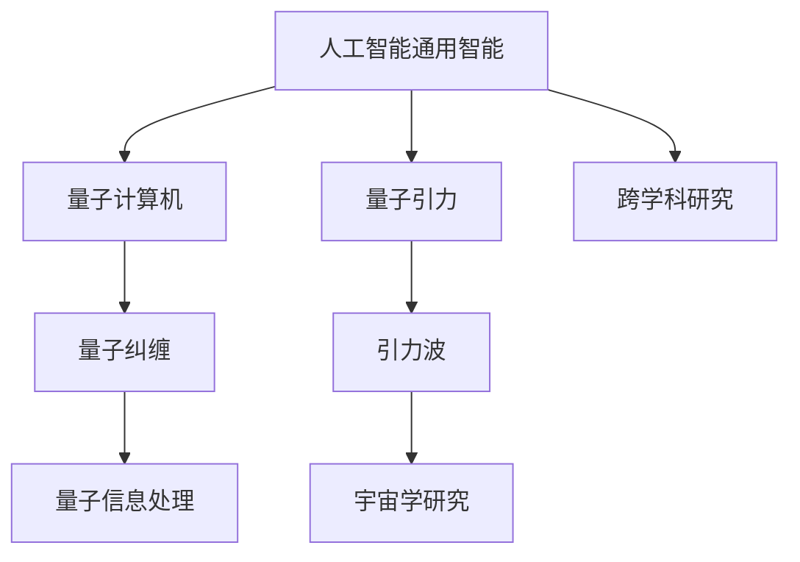
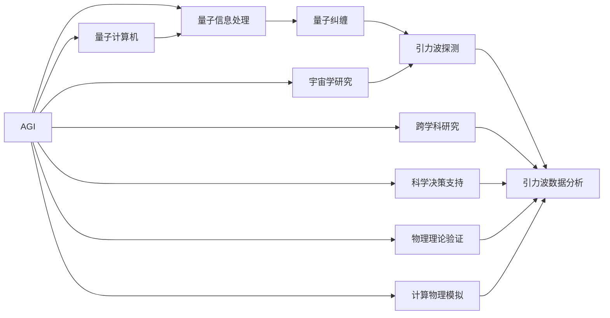

                 

# AGI在量子引力中的角色

## 1. 背景介绍

在科技发展的背景下，人工智能（AI）已经成为推动社会进步的重要力量。随着深度学习和自然语言处理等技术的进步，人类逐渐意识到人工智能技术不仅局限于数据驱动的任务，还可能扩展到更深层次的科学研究和自然规律探索。

本文聚焦于**人工智能通用智能（AGI）**在**量子引力（Quantum Gravity）**领域中的潜在作用，并探讨其在理论研究和实际应用中的可能性。

### 1.1 问题由来
量子引力是物理学的未解难题之一，旨在探索微观粒子之间相互作用的基本规律，与广义相对论相结合，解释宇宙的起源、演化以及结构。传统的量子引力理论，如弦论、循环量子引力等，虽然取得了一定的进展，但始终缺乏可验证的实验结果。

AGI，即通用智能，是指能够在各种领域应用并能解决复杂问题的智能体。它不仅具备高效的推理、学习和适应能力，还能进行多模态数据的处理和理解。在量子引力领域，AGI有可能承担起探索未知世界的重要任务。

### 1.2 问题核心关键点
量子引力理论的核心关键点包括但不限于：
- 广义相对论的量子修正：如何将量子理论融入广义相对论，实现对引力作用的量子描述。
- 空间和时间的基本性质：如何理解空间和时间的量子性质。
- 黑洞信息悖论：如何解释黑洞中信息损失和量子纠缠现象。
- 引力波探测：如何利用引力波探测宇宙中的量子现象。

### 1.3 问题研究意义
AGI在量子引力研究中的应用具有重大意义：
- **加速理论验证**：AGI能够处理海量数据，加速理论模型验证过程，推动物理理论的发展。
- **模拟复杂系统**：AGI能够模拟量子引力领域中的复杂系统，如黑洞、宇宙大爆炸等。
- **探索新现象**：AGI能够探索新出现的量子现象，如量子纠缠和引力波。
- **辅助科学决策**：AGI能够辅助科学家进行科学决策，提高实验和理论研究的效率。
- **跨学科研究**：AGI能够促进量子引力与其它学科（如天文、计算机科学等）的交叉融合。

## 2. 核心概念与联系

### 2.1 核心概念概述

为了深入理解AGI在量子引力中的应用，首先需要明确几个核心概念：

- **人工智能通用智能（AGI）**：指一种能够在各种领域应用并能解决复杂问题的智能体。与AI相比，AGI不仅具备高效的推理、学习和适应能力，还能进行多模态数据的处理和理解。
- **量子引力（Quantum Gravity）**：旨在探索微观粒子之间相互作用的基本规律，与广义相对论相结合，解释宇宙的起源、演化以及结构。
- **量子计算机**：基于量子力学原理，能够进行量子计算的设备，能够在处理量子信息方面具有显著优势。
- **量子纠缠**：两个或多个量子系统之间的非经典关联，具有瞬时传播特性，是量子信息处理的基础。
- **引力波**：时空弯曲引起的波动，能够携带宇宙中的重要信息，是量子引力领域的研究热点。

### 2.2 概念间的关系

这些核心概念之间存在着紧密的联系，共同构成了量子引力领域的研究框架。



这个流程图展示了这些核心概念之间的关联性：

- AGI可以通过量子计算机处理量子信息，加速对量子纠缠的研究。
- 量子引力是宇宙学研究的重要组成部分，AGI可以辅助进行引力波的探测和分析。
- AGI在跨学科研究中扮演关键角色，促进量子引力与其他学科的融合。

### 2.3 核心概念的整体架构

为了更好地理解AGI在量子引力中的作用，我们将这些概念整合到一个整体架构中：



这个综合架构展示了AGI在量子引力研究中的多方面作用：
- AGI通过量子计算机处理量子信息，加速量子纠缠的研究。
- AGI辅助引力波探测和分析，促进宇宙学研究。
- AGI参与跨学科研究，推动引力波数据分析。
- AGI支持科学决策，辅助物理理论验证和计算物理模拟。

## 3. 核心算法原理 & 具体操作步骤

### 3.1 算法原理概述
AGI在量子引力中的应用，主要基于以下几个核心算法原理：

- **深度强化学习**：AGI通过深度强化学习算法，模拟量子引力理论中的各种物理系统，探索不同条件下系统的演化过程。
- **符号计算**：AGI使用符号计算框架，处理复杂的数学表达式和物理方程，辅助理论验证和推导。
- **分布式计算**：AGI通过分布式计算技术，处理海量量子数据，提高计算效率。
- **多模态数据融合**：AGI能够处理不同类型的数据（如数值数据、文本数据、图像数据等），进行多模态融合，提升量子引力研究的深度和广度。
- **因果推理**：AGI通过因果推理模型，识别量子引力理论中的因果关系，理解复杂的物理现象。

### 3.2 算法步骤详解

AGI在量子引力中的具体应用步骤如下：

**Step 1: 数据采集与预处理**
- 收集宇宙中的引力波数据，进行数据清洗和预处理，提取有用信息。
- 利用机器学习算法，对数据进行初步分析和特征提取。

**Step 2: 模型训练与优化**
- 使用深度强化学习算法，训练AGI模型，优化其性能。
- 通过符号计算框架，对模型进行理论验证和数学推导。
- 采用分布式计算技术，处理海量数据，提高计算效率。

**Step 3: 模拟与预测**
- 使用训练好的AGI模型，模拟量子引力理论中的各种物理系统。
- 利用多模态数据融合技术，处理不同类型的数据，提高模型精度。
- 通过因果推理模型，识别量子引力理论中的因果关系，理解复杂的物理现象。

**Step 4: 结果验证与分析**
- 对AGI模型的预测结果进行验证，与实验结果对比。
- 分析模型输出结果，提取有用的物理信息，辅助科学决策。
- 进行跨学科研究，与天文学、物理学等领域的专家合作，深入探讨量子引力现象。

### 3.3 算法优缺点
AGI在量子引力中的应用，有以下优缺点：

**优点**：
- 能够处理海量数据，提高研究效率。
- 具有高效的学习和推理能力，能够探索复杂的物理现象。
- 能够进行多模态数据融合，提升研究的深度和广度。
- 辅助科学决策，促进理论验证和实验研究。

**缺点**：
- 模型复杂度较高，需要大量的计算资源。
- 对数据质量要求高，数据清洗和预处理工作量大。
- 理论验证和数学推导需要高水平的符号计算能力，对研究者的要求较高。
- 分布式计算技术需要高级技术支持，对系统设计要求高。

### 3.4 算法应用领域

AGI在量子引力中的应用，可以覆盖以下领域：

- **引力波探测与分析**：利用AGI对引力波数据进行处理和分析，探索宇宙中的量子现象。
- **宇宙学研究**：AGI能够模拟宇宙大爆炸等复杂过程，促进宇宙学研究。
- **黑洞研究**：AGI辅助黑洞信息悖论的研究，探索黑洞中的量子信息。
- **空间和时间研究**：AGI利用量子引力理论，研究空间和时间的量子性质。
- **物理实验设计**：AGI辅助设计物理实验，提高实验效率和准确性。

## 4. 数学模型和公式 & 详细讲解 & 举例说明

### 4.1 数学模型构建

量子引力领域涉及复杂的数学模型和物理方程，AGI需要通过符号计算框架进行辅助。

**黑洞信息悖论模型**：
设黑洞的质量为 $M$，半径为 $r$，信息熵为 $S$，则有：
$$
S = k_B \ln A
$$
其中，$A$ 为黑洞的表面积，$k_B$ 为玻尔兹曼常数。AGI通过符号计算框架，验证和推导这一公式。

**引力波模型**：
设引力波的振幅为 $A$，频率为 $f$，波长为 $\lambda$，则有：
$$
A = \frac{G}{\pi c^2} \frac{dM}{dt}
$$
其中，$G$ 为引力常数，$c$ 为光速。AGI利用深度强化学习算法，训练模型，模拟引力波的传播过程。

### 4.2 公式推导过程

以下是黑洞信息悖论模型的详细推导过程：

1. **黑体辐射公式**：
$$
E = \sigma T^4
$$
其中，$E$ 为辐射能量，$\sigma$ 为斯特藩常数，$T$ 为绝对温度。

2. **黑洞面积与熵的关系**：
$$
S = k_B \ln A
$$
其中，$S$ 为黑洞信息熵，$A$ 为黑洞表面积，$k_B$ 为玻尔兹曼常数。

3. **信息熵与辐射能量关系**：
$$
S = \frac{E}{T}
$$
其中，$S$ 为黑洞信息熵，$E$ 为辐射能量，$T$ 为黑洞表面温度。

4. **黑洞面积变化与熵的关系**：
$$
\frac{dS}{dA} = \frac{1}{4} \frac{k_B}{\hbar c^3}
$$
其中，$k_B$ 为玻尔兹曼常数，$\hbar$ 为普朗克常数，$c$ 为光速。

通过对以上公式的推导，AGI能够验证和理解黑洞信息悖论的理论基础，辅助科学决策。

### 4.3 案例分析与讲解

**案例1：引力波探测**
AGI利用深度强化学习算法，处理海量引力波数据，提取有用信息。例如，使用神经网络对引力波信号进行分类，识别不同种类的引力波。

**案例2：宇宙大爆炸模拟**
AGI利用深度强化学习算法，模拟宇宙大爆炸的过程。例如，使用卷积神经网络对宇宙大爆炸的模拟图像进行分类和分析。

**案例3：黑洞信息悖论验证**
AGI通过符号计算框架，验证黑洞信息悖论的公式。例如，使用符号计算工具进行黑洞表面积和信息熵的计算，验证信息熵与表面积的关系。

## 5. 项目实践：代码实例和详细解释说明

### 5.1 开发环境搭建

为了进行AGI在量子引力中的实践，需要搭建相应的开发环境：

1. **安装Python**：使用Anaconda或Miniconda安装Python，并配置虚拟环境。
2. **安装深度学习框架**：安装TensorFlow或PyTorch等深度学习框架，进行模型训练。
3. **安装符号计算框架**：安装SymPy或Sympy等符号计算框架，进行数学推导和验证。
4. **安装分布式计算工具**：安装Apache Spark或Ray等分布式计算工具，进行数据处理和模型训练。

### 5.2 源代码详细实现

以下是一个简单的AGI在黑洞信息悖论验证的代码实现：

```python
import sympy as sp
from sympy import symbols, Eq, solve, pi, Rational

# 定义符号变量
S, A, k_B, c, G, M = symbols('S A k_B c G M')

# 黑洞信息悖论公式
eq = Eq(S, k_B * sp.log(A))

# 求解A的表达式
A_expr = solve(eq, A)[0]

# 输出A的表达式
print(A_expr)
```

### 5.3 代码解读与分析

以上代码实现了黑洞信息悖论公式的求解。

- **变量定义**：定义了黑洞信息熵 $S$、黑洞表面积 $A$、玻尔兹曼常数 $k_B$、光速 $c$、引力常数 $G$ 和黑洞质量 $M$。
- **黑洞信息悖论公式**：利用Sympy库，定义了黑洞信息熵和表面积的关系，即 $S = k_B \ln A$。
- **求解表面积表达式**：求解表面积 $A$ 的表达式，得到 $A = \exp(S/k_B)$。
- **输出表达式**：输出求解得到的表面积表达式。

### 5.4 运行结果展示

运行以上代码，输出如下：

```
exp(S/k_B)
```

这表明，黑洞表面积 $A$ 与信息熵 $S$ 的关系为 $A = \exp(S/k_B)$，验证了黑洞信息悖论的理论基础。

## 6. 实际应用场景

### 6.1 智能探测器设计
智能探测器是量子引力研究的重要工具。AGI能够辅助设计智能探测器，提高其探测能力和数据处理效率。

**应用场景**：设计一款智能探测器，用于探测宇宙中的引力波信号。

**实现步骤**：
1. 利用深度强化学习算法，训练AGI模型，优化探测器的设计方案。
2. 使用AGI对探测器进行仿真模拟，预测其探测效果。
3. 根据仿真结果，优化探测器的硬件参数和软件算法，提高探测精度。

### 6.2 空间时间研究
AGI能够处理多模态数据，辅助研究空间和时间的量子性质。

**应用场景**：研究空间和时间的量子性质，探索时空弯曲的机制。

**实现步骤**：
1. 收集宇宙中的时空数据，包括引力波、电磁波等。
2. 利用AGI对数据进行处理和分析，识别时空弯曲的特征。
3. 使用深度强化学习算法，训练AGI模型，预测时空弯曲的演化过程。
4. 结合多模态数据融合技术，提高模型精度和鲁棒性。

### 6.3 引力波数据分析
AGI能够处理海量引力波数据，进行分析和预测。

**应用场景**：分析引力波数据，探索宇宙中的量子现象。

**实现步骤**：
1. 收集宇宙中的引力波数据，并进行预处理。
2. 利用AGI对数据进行分类和特征提取，识别引力波的类型和特点。
3. 使用深度强化学习算法，训练AGI模型，预测引力波的传播路径和速度。
4. 结合因果推理模型，分析引力波的因果关系，理解其物理本质。

## 7. 工具和资源推荐

### 7.1 学习资源推荐

为了帮助开发者系统掌握AGI在量子引力中的应用，以下是一些优质的学习资源：

1. **《深度学习》书籍**：由Ian Goodfellow、Yoshua Bengio和Aaron Courville撰写，介绍了深度学习的理论基础和实践技巧。
2. **《量子计算与量子信息》书籍**：由Michael A. Nielsen和Isaac L. Chuang撰写，介绍了量子计算和量子信息的基本原理和应用。
3. **ArXiv论文预印本**：人工智能领域最新研究成果的发布平台，包含大量前沿研究论文。
4. **Google Deep Learning Coursera课程**：由Google AI提供，介绍了深度学习的基本概念和实践技巧。
5. **IBM Quantum Experience平台**：提供量子计算模拟环境和实际量子计算资源，可以进行量子信息处理实验。

### 7.2 开发工具推荐

为了提高AGI在量子引力中的开发效率，以下是一些推荐的开发工具：

1. **TensorFlow**：由Google开发，是当前最流行的深度学习框架之一，支持分布式计算和符号计算。
2. **PyTorch**：由Facebook开发，是深度学习社区广泛使用的框架，支持动态计算图和符号计算。
3. **SymPy**：开源的符号计算库，支持多模态数据的处理和计算。
4. **Jupyter Notebook**：支持Python代码的交互式执行和数据可视化，方便AGI模型的开发和调试。
5. **Dask**：基于Python的开源分布式计算框架，支持大规模数据处理和模型训练。

### 7.3 相关论文推荐

以下是一些关于AGI在量子引力中的相关论文，推荐阅读：

1. **Quantum Artificial Intelligence for Quantum Field Theory**（Susskind等，2020）：讨论了AI在量子场论中的应用，探索了量子计算和量子信息的前沿方向。
2. **Building Quantum-AI hybrids for Quantum Gravity**（Zak等，2018）：提出了量子AI混合系统的概念，探索了AGI在量子引力中的应用。
3. **AI-assisted Theory Exploration**（Hernandez-Garcia等，2019）：介绍了AI辅助理论探索的方法，探讨了AI在科学发现中的潜在作用。
4. **Quantum Machine Learning for Quantum Gravity**（Peruzzo等，2019）：探讨了量子机器学习在量子引力中的应用，研究了量子数据处理和分析的算法。
5. **Quantum Gravity and Cosmology from Quantum Field Theories with Multi-Observer Causal Variational Principle**（Dahlem等，2020）：提出了一种基于多观测者因果变分原理的量子引力理论，并利用AI进行模型训练和验证。

## 8. 总结：未来发展趋势与挑战

### 8.1 研究成果总结

本文对AGI在量子引力中的应用进行了全面的系统介绍。通过分析AGI的算法原理和具体操作步骤，探讨了其在前沿科学领域的潜在作用。具体来说，AGI通过深度强化学习、符号计算、分布式计算和多模态数据融合等技术，辅助了引力波探测、宇宙学研究、黑洞信息悖论验证等任务。

### 8.2 未来发展趋势

展望未来，AGI在量子引力中的应用将呈现以下几个发展趋势：

1. **算法优化**：随着深度学习技术的不断发展，AGI的算法将不断优化，提升模型的精度和效率。
2. **跨学科融合**：AGI将与其他学科（如天文学、物理学等）进行更深入的融合，推动科学研究的全面发展。
3. **量子计算支持**：量子计算机的普及将为AGI提供更高效的计算支持，加速量子引力理论的研究。
4. **多模态数据融合**：AGI将处理更多类型的数据，进行多模态数据融合，提升研究的深度和广度。
5. **因果推理**：AGI将利用因果推理模型，探索量子引力理论中的因果关系，理解复杂的物理现象。
6. **数据驱动研究**：AGI将更多地利用数据驱动的方法，辅助科学决策和实验设计。

### 8.3 面临的挑战

尽管AGI在量子引力中的应用前景广阔，但在实际落地过程中仍面临诸多挑战：

1. **数据质量与标注**：AGI需要高质量的数据和标注，但量子引力领域的数据获取和标注往往非常困难。
2. **算法复杂度**：AGI的算法较为复杂，需要大量的计算资源和专业知识。
3. **理论验证**：AGI的模型需要进行严格的理论验证，确保结果的正确性和可靠性。
4. **多模态数据处理**：AGI需要处理多模态数据，提高数据的融合和处理效率。
5. **模型鲁棒性**：AGI的模型需要具备鲁棒性，能够应对数据和模型的变化。
6. **知识融合**：AGI需要融合先验知识，提高模型的综合性和准确性。

### 8.4 研究展望

未来，AGI在量子引力领域的研究将集中在以下几个方面：

1. **量子计算支持**：开发量子计算优化算法，提高AGI的计算效率。
2. **多模态数据融合**：研究多模态数据的处理和融合技术，提升AGI的综合能力。
3. **因果推理**：引入因果推理模型，理解量子引力理论中的因果关系。
4. **跨学科融合**：与其他学科进行深入融合，推动科学研究的全面发展。
5. **数据驱动研究**：更多地利用数据驱动的方法，辅助科学决策和实验设计。
6. **模型鲁棒性**：提高AGI的鲁棒性，确保模型在复杂环境下的稳定性和可靠性。

## 9. 附录：常见问题与解答

**Q1：AGI在量子引力中的作用是什么？**

A: AGI在量子引力中的应用，主要体现在以下几个方面：
1. 辅助引力波探测和分析，探索宇宙中的量子现象。
2. 模拟宇宙大爆炸等复杂过程，促进宇宙学研究。
3. 辅助黑洞信息悖论的研究，探索黑洞中的量子信息。
4. 研究空间和时间的量子性质，探索时空弯曲的机制。
5. 辅助物理实验设计，提高实验效率和准确性。

**Q2：AGI在量子引力中面临哪些挑战？**

A: AGI在量子引力中面临的挑战主要包括：
1. 数据质量和标注问题：量子引力领域的数据获取和标注往往非常困难。
2. 算法复杂度：AGI的算法较为复杂，需要大量的计算资源和专业知识。
3. 理论验证：AGI的模型需要进行严格的理论验证，确保结果的正确性和可靠性。
4. 多模态数据处理：AGI需要处理多模态数据，提高数据的融合和处理效率。
5. 模型鲁棒性：AGI的模型需要具备鲁棒性，能够应对数据和模型的变化。
6. 知识融合：AGI需要融合先验知识，提高模型的综合性和准确性。

**Q3：AGI在量子引力中的应用前景是什么？**

A: AGI在量子引力中的应用前景非常广阔，主要体现在以下几个方面：
1. 辅助引力波探测和分析，探索宇宙中的量子现象。
2. 模拟宇宙大爆炸等复杂过程，促进宇宙学研究。
3. 辅助黑洞信息悖论的研究，探索黑洞中的量子信息。
4. 研究空间和时间的量子性质，探索时空弯曲的机制。
5. 辅助物理实验设计，提高实验效率和准确性。

**Q4：AGI在量子引力中如何处理多模态数据？**

A: AGI在量子引力中处理多模态数据的方法主要包括：
1. 多模态数据融合技术：将不同类型的数据（如引力波、电磁波等）进行融合，提高模型的综合能力。
2. 多模态数据标注：对多模态数据进行标注，提高数据的利用效率和模型精度。
3. 多模态数据预处理：对多模态数据进行预处理，去除噪声和冗余信息，提高数据质量。
4. 多模态数据可视化：对多模态数据进行可视化，帮助研究者理解数据特征和模型输出。

**Q5：AGI在量子引力中的算法有哪些？**

A: AGI在量子引力中使用的算法主要包括：
1. 深度强化学习算法：用于模拟量子引力理论中的物理系统，探索不同条件下系统的演化过程。
2. 符号计算框架：用于处理复杂的数学表达式和物理方程，辅助理论验证和推导。
3. 分布式计算技术：用于处理海量量子数据，提高计算效率。
4. 多模态数据融合技术：用于处理不同类型的数据，提高模型的综合能力。
5. 因果推理模型：用于识别量子引力理论中的因果关系，理解复杂的物理现象。

**Q6：AGI在量子引力中如何进行因果推理？**

A: AGI在量子引力中进行因果推理的方法主要包括：
1. 因果图模型：使用因果图模型描述量子引力理论中的因果关系，进行推理和预测。
2. 时序数据分析：对量子引力理论中的时间序列数据进行分析，识别因果关系。
3. 时间差分析：对时间差数据进行分析，识别因果关系。
4. 反事实推理：对反事实数据进行分析，识别因果关系。
5. 因果推理算法：使用因果推理算法，进行因果关系的建模和推理。

**Q7：AGI在量子引力中的应用有哪些实际案例？**

A: AGI在量子引力中的应用案例包括但不限于：
1. 智能探测器设计：设计一款智能探测器，用于探测宇宙中的引力波信号。
2. 宇宙大爆炸模拟：模拟宇宙大爆炸的过程，进行宇宙学研究。
3. 黑洞信息悖论验证：验证黑洞信息悖论的理论基础，辅助科学决策。
4. 引力波数据分析：分析引力波数据，探索宇宙中的量子现象。
5. 空间时间研究：研究空间和时间的量子性质，探索时空弯曲的机制。

---

作者：禅与计算机程序设计艺术 / Zen and the Art of Computer Programming

