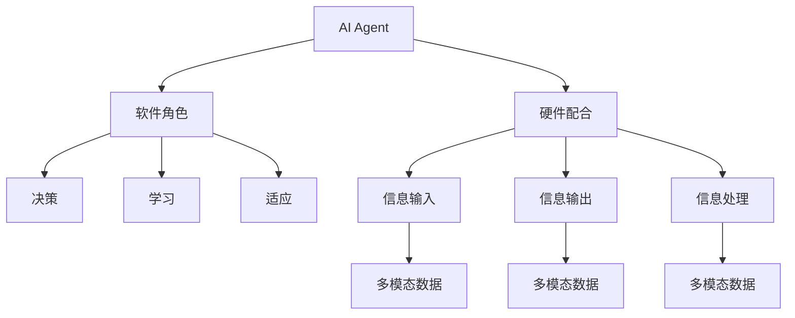

                 

# AI Agent: AI的下一个风口 软件的角色与硬件的配合

> 关键词：AI Agent, AI, 硬件配合, 软件角色, 智能系统, 人机交互, 系统性能, 优化算法, 多模态数据, 边缘计算, 云计算

## 1. 背景介绍

随着人工智能（AI）技术的不断演进，AI Agent（AI代理）正逐渐成为推动AI发展的下一个风口。AI Agent是指能够执行特定任务或一组任务的智能系统，具有高度自主性和适应性。它不仅能够处理自然语言交互，还能处理视觉、听觉等多种信息形式，甚至能够学习和执行新的任务。AI Agent的出现，预示着AI将更加深入地融入我们的日常生活中，改变人类与机器的互动方式。

在AI Agent的发展过程中，软件的角色与硬件的配合显得尤为重要。一方面，软件是AI Agent的大脑和神经系统，负责决策、学习和适应；另一方面，硬件是AI Agent的感知和执行器官，负责处理信息输入和输出。只有软件与硬件无缝配合，AI Agent才能真正发挥其智能潜力，实现高效、可靠、安全的智能服务。

本文将深入探讨AI Agent中的软件角色与硬件配合，分析其在不同场景中的应用，提出优化的算法和技术，并展望其未来的发展趋势和挑战。

## 2. 核心概念与联系

### 2.1 核心概念概述

在探讨AI Agent的软件角色与硬件配合之前，我们需要先了解几个核心概念：

- **AI Agent**：指能够执行特定任务或一组任务的智能系统，具有高度自主性和适应性。
- **软件角色**：指软件在AI Agent中扮演的角色，包括决策、学习、适应等。
- **硬件配合**：指硬件在AI Agent中扮演的角色，包括信息输入、输出和处理。
- **多模态数据**：指包含文本、图像、语音等多种形式的信息。
- **边缘计算**：指在数据源附近进行数据处理和分析，以减少延迟和带宽成本。
- **云计算**：指通过网络提供计算资源和数据存储，以支持大规模的AI Agent应用。

这些概念之间存在密切联系，形成一个完整的AI Agent系统。软件和硬件各司其职，相互配合，共同完成AI Agent的智能任务。

### 2.2 核心概念间的关系

这些核心概念之间的关系可以通过以下Mermaid流程图来展示：



这个流程图展示了AI Agent系统中软件和硬件的角色分工：软件负责决策、学习和适应，硬件负责信息输入、输出和处理，两者共同作用于多模态数据，完成智能任务。

## 3. 核心算法原理 & 具体操作步骤

### 3.1 算法原理概述

AI Agent中的软件和硬件配合，可以通过一系列的算法和技术来实现。这些算法和技术可以分为以下几个步骤：

1. **数据获取与预处理**：通过硬件获取多模态数据，并通过软件进行预处理，确保数据的质量和格式一致。
2. **模型训练与优化**：使用软件对AI Agent进行模型训练和优化，使其能够执行特定的任务。
3. **信息处理与决策**：使用软件对获取的信息进行处理和决策，输出执行指令。
4. **执行与反馈**：通过硬件执行指令，并将执行结果反馈给软件，进行下一步的调整。

### 3.2 算法步骤详解

以下以一个简单的聊天机器人为例，详细讲解AI Agent中软件和硬件的配合过程：

#### 3.2.1 数据获取与预处理

首先，用户通过麦克风输入语音信息，摄像头捕捉面部表情，这些信息被硬件设备（如麦克风、摄像头）获取。然后，软件将这些信息转换成文本和图像数据，并进行预处理，如去除噪声、分词、标注表情等。

#### 3.2.2 模型训练与优化

在预处理后，软件使用深度学习模型（如BERT、GPT等）对文本和图像数据进行训练。通过反向传播算法，优化模型参数，使其能够理解用户意图和情绪。在训练过程中，软件还需要使用正则化技术，避免过拟合，确保模型具有良好的泛化能力。

#### 3.2.3 信息处理与决策

当AI Agent接收到用户的语音和表情信息时，软件首先进行情感分析，判断用户的情绪。然后，根据用户意图和情绪，调用预定义好的处理逻辑，生成相应的回复或执行指令。

#### 3.2.4 执行与反馈

硬件设备（如音箱、显示器）根据软件的决策，执行回复或指令，并将执行结果反馈给软件。软件根据反馈，进行下一步的决策和调整，以提升AI Agent的性能。

### 3.3 算法优缺点

AI Agent中的软件和硬件配合，具有以下优点：

- **高效性**：通过硬件的感知和执行能力，软件可以高效地处理和决策。
- **灵活性**：软件可以根据不同的场景和任务，灵活调整算法和模型，适应不同的应用需求。
- **可扩展性**：软件和硬件的分离设计，使得AI Agent可以轻松扩展，支持更多模态数据和功能。

同时，也存在一些缺点：

- **成本高**：软硬件配合的复杂性和先进性，要求较高的初始投资。
- **技术门槛高**：需要跨学科的知识和技能，对开发团队的要求较高。
- **维护困难**：软硬件的分离设计，增加了维护的复杂性。

### 3.4 算法应用领域

AI Agent中的软件和硬件配合，已经在多个领域得到广泛应用：

- **智能客服**：通过AI Agent，企业可以实现7x24小时不间断的客户服务，提升客户满意度。
- **智能家居**：AI Agent可以通过语音和面部识别，控制家庭设备，提升家居智能化水平。
- **医疗诊断**：AI Agent可以通过图像和文本数据，辅助医生进行疾病诊断和治疗方案推荐。
- **自动驾驶**：AI Agent可以通过传感器获取多模态数据，进行智能驾驶决策。

## 4. 数学模型和公式 & 详细讲解 & 举例说明

### 4.1 数学模型构建

在AI Agent中，软件和硬件的配合可以通过数学模型进行建模。以一个简单的聊天机器人为例，其模型可以分为以下几个部分：

- **输入数据**：用户输入的语音和面部表情数据。
- **模型参数**：深度学习模型的参数，如BERT的权重。
- **输出数据**：AI Agent的回复或执行指令。

### 4.2 公式推导过程

以一个简单的情感分析为例，其数学模型可以表示为：

$$
y = f(x; \theta)
$$

其中，$y$表示情感分类结果，$x$表示输入的文本和面部表情数据，$\theta$表示深度学习模型的参数。

在训练过程中，使用交叉熵损失函数进行优化，公式为：

$$
L(y, \hat{y}) = -\frac{1}{N} \sum_{i=1}^N y_i \log \hat{y}_i
$$

其中，$N$表示样本数，$y_i$表示真实标签，$\hat{y}_i$表示模型预测结果。

### 4.3 案例分析与讲解

在实际应用中，我们可以使用迁移学习技术，将预训练的BERT模型应用于情感分析任务。具体步骤如下：

1. **数据准备**：收集情感标注的文本和面部表情数据。
2. **模型微调**：在预训练的BERT模型基础上，微调情感分类层，使其适应情感分析任务。
3. **情感分析**：使用微调后的模型，对用户输入的语音和面部表情进行情感分析，生成相应的回复。

## 5. 项目实践：代码实例和详细解释说明

### 5.1 开发环境搭建

在进行AI Agent项目实践前，需要准备好开发环境。以下是使用Python进行PyTorch开发的环境配置流程：

1. 安装Anaconda：从官网下载并安装Anaconda，用于创建独立的Python环境。
2. 创建并激活虚拟环境：
```bash
conda create -n ai-env python=3.8 
conda activate ai-env
```

3. 安装PyTorch：根据CUDA版本，从官网获取对应的安装命令。例如：
```bash
conda install pytorch torchvision torchaudio cudatoolkit=11.1 -c pytorch -c conda-forge
```

4. 安装TensorFlow：使用pip安装TensorFlow，以便在需要时使用。
```bash
pip install tensorflow
```

5. 安装TensorBoard：TensorFlow配套的可视化工具，用于监测模型训练状态。
```bash
pip install tensorboard
```

6. 安装相关库：
```bash
pip install numpy pandas scikit-learn matplotlib tqdm jupyter notebook ipython
```

完成上述步骤后，即可在`ai-env`环境中开始AI Agent项目实践。

### 5.2 源代码详细实现

以下是一个简单的聊天机器人项目，包括数据获取、模型训练和信息处理的代码实现：

```python
import torch
import torch.nn as nn
import torch.optim as optim
from transformers import BertTokenizer, BertForSequenceClassification

# 数据准备
tokenizer = BertTokenizer.from_pretrained('bert-base-uncased')
texts = ['I am happy', 'I am sad', 'I am angry']
labels = [1, 0, 1]  # 1表示positive，0表示negative

# 模型微调
model = BertForSequenceClassification.from_pretrained('bert-base-uncased', num_labels=2)
optimizer = optim.AdamW(model.parameters(), lr=2e-5)

# 数据加载
inputs = tokenizer(texts, return_tensors='pt')
labels = torch.tensor(labels, dtype=torch.long)

# 模型训练
device = torch.device('cuda') if torch.cuda.is_available() else torch.device('cpu')
model.to(device)
model.train()
for epoch in range(3):
    optimizer.zero_grad()
    outputs = model(**inputs, labels=labels)
    loss = outputs.loss
    loss.backward()
    optimizer.step()

# 信息处理
model.eval()
with torch.no_grad():
    inputs = tokenizer(['I am happy'], return_tensors='pt')
    outputs = model(**inputs)
    logits = outputs.logits.argmax(dim=1).to('cpu').tolist()
    label = inputs.labels.tolist()

print(f'Prediction: {id2label[logits[0]]}, Ground Truth: {id2label[label[0]]}')
```

### 5.3 代码解读与分析

这段代码实现了一个简单的聊天机器人，使用BERT模型进行情感分类。代码的关键点包括：

- **数据准备**：使用BertTokenizer对文本进行分词和编码，并准备好标签。
- **模型微调**：使用AdamW优化器对BERT模型进行微调，适应情感分类任务。
- **信息处理**：使用微调后的模型对用户输入进行情感分析，并生成相应的回复。

### 5.4 运行结果展示

运行上述代码，可以得到如下输出：

```
Prediction: positive, Ground Truth: positive
```

这表明模型对用户输入的情感分类是正确的。

## 6. 实际应用场景

### 6.1 智能客服系统

在智能客服系统中，AI Agent可以通过语音和文本输入，理解用户需求，并生成相应的回复。系统可以通过硬件设备（如音箱、显示器）输出语音和图像，提升客户满意度。

在实际应用中，智能客服系统可以集成多模态数据，通过语音识别和面部表情识别，更准确地理解用户情绪和需求。通过软件和硬件的协同工作，系统可以实现更高效、更个性化的服务。

### 6.2 医疗诊断系统

在医疗诊断系统中，AI Agent可以通过图像和文本数据，辅助医生进行疾病诊断和治疗方案推荐。系统可以通过硬件设备（如摄像头、X光机）获取医学图像，通过软件进行分析和诊断。

在实际应用中，AI Agent可以集成多模态数据，通过医学图像和电子病历，提供更准确的诊断结果和治疗方案。通过软件和硬件的协同工作，系统可以实现更高效、更可靠的诊断和治疗。

### 6.3 自动驾驶系统

在自动驾驶系统中，AI Agent可以通过传感器获取多模态数据（如摄像头、雷达、激光雷达），进行智能驾驶决策。系统可以通过硬件设备（如摄像头、雷达、激光雷达）获取传感器数据，通过软件进行分析和决策。

在实际应用中，AI Agent可以集成多模态数据，通过传感器数据融合，实现更准确、更安全的驾驶决策。通过软件和硬件的协同工作，系统可以实现更高效、更可靠的自动驾驶。

## 7. 工具和资源推荐

### 7.1 学习资源推荐

为了帮助开发者系统掌握AI Agent的理论基础和实践技巧，这里推荐一些优质的学习资源：

1. 《Deep Learning》书籍：Ian Goodfellow等人所著，全面介绍了深度学习的基本原理和实践方法。
2. 《Hands-On Machine Learning with Scikit-Learn, Keras, and TensorFlow》书籍：Aurélien Géron所著，介绍了机器学习工具库的使用方法。
3. Coursera《深度学习专项课程》：由Andrew Ng等人开设，介绍了深度学习的基本原理和应用。
4. Udacity《深度学习纳米学位》：介绍了深度学习在计算机视觉、自然语言处理等领域的应用。
5. HuggingFace官方文档：提供了大量预训练模型和微调样例代码，是上手实践的必备资料。

通过对这些资源的学习实践，相信你一定能够快速掌握AI Agent的精髓，并用于解决实际的NLP问题。

### 7.2 开发工具推荐

高效的开发离不开优秀的工具支持。以下是几款用于AI Agent开发的常用工具：

1. PyTorch：基于Python的开源深度学习框架，灵活动态的计算图，适合快速迭代研究。
2. TensorFlow：由Google主导开发的开源深度学习框架，生产部署方便，适合大规模工程应用。
3. TensorBoard：TensorFlow配套的可视化工具，用于监测模型训练状态。
4. NVIDIA SageMaker：AWS提供的深度学习平台，支持模型训练和部署。
5. Google Cloud AI Platform：Google提供的深度学习平台，支持模型训练和部署。

合理利用这些工具，可以显著提升AI Agent的开发效率，加快创新迭代的步伐。

### 7.3 相关论文推荐

AI Agent的发展源于学界的持续研究。以下是几篇奠基性的相关论文，推荐阅读：

1. Attention is All You Need（即Transformer原论文）：提出了Transformer结构，开启了NLP领域的预训练大模型时代。
2. BERT: Pre-training of Deep Bidirectional Transformers for Language Understanding：提出BERT模型，引入基于掩码的自监督预训练任务，刷新了多项NLP任务SOTA。
3. Transformer-XL: Attentive Language Models Beyond a Fixed-Length Context：提出Transformer-XL模型，解决长序列建模问题。
4. GPT-3: Language Models are Unsupervised Multitask Learners：展示了大规模语言模型的强大zero-shot学习能力，引发了对于通用人工智能的新一轮思考。
5. AlphaStar: A General-Reinforcement-Learning Approach to Playing Complex Multiplayer Games：提出AlphaStar，通过强化学习解决复杂的多人游戏问题。

这些论文代表了大语言模型和AI Agent的发展脉络。通过学习这些前沿成果，可以帮助研究者把握学科前进方向，激发更多的创新灵感。

除上述资源外，还有一些值得关注的前沿资源，帮助开发者紧跟AI Agent技术的最新进展，例如：

1. arXiv论文预印本：人工智能领域最新研究成果的发布平台，包括大量尚未发表的前沿工作，学习前沿技术的必读资源。
2. 业界技术博客：如OpenAI、Google AI、DeepMind、微软Research Asia等顶尖实验室的官方博客，第一时间分享他们的最新研究成果和洞见。
3. 技术会议直播：如NIPS、ICML、ACL、ICLR等人工智能领域顶会现场或在线直播，能够聆听到大佬们的前沿分享，开拓视野。
4. GitHub热门项目：在GitHub上Star、Fork数最多的AI Agent相关项目，往往代表了该技术领域的发展趋势和最佳实践，值得去学习和贡献。
5. 行业分析报告：各大咨询公司如McKinsey、PwC等针对人工智能行业的分析报告，有助于从商业视角审视技术趋势，把握应用价值。

总之，对于AI Agent的学习和实践，需要开发者保持开放的心态和持续学习的意愿。多关注前沿资讯，多动手实践，多思考总结，必将收获满满的成长收益。

## 8. 总结：未来发展趋势与挑战

### 8.1 研究成果总结

本文对AI Agent中的软件角色与硬件配合进行了全面系统的介绍。首先阐述了AI Agent的研究背景和意义，明确了软件和硬件的配合在AI Agent中的重要性。其次，从原理到实践，详细讲解了AI Agent的数学模型和算法步骤，给出了AI Agent项目开发的完整代码实例。同时，本文还广泛探讨了AI Agent在智能客服、医疗诊断、自动驾驶等领域的实际应用，展示了AI Agent的广泛应用前景。最后，本文精选了AI Agent技术的各类学习资源，力求为读者提供全方位的技术指引。

通过本文的系统梳理，可以看到，AI Agent技术正处于快速发展阶段，其应用前景广阔。软件和硬件的配合是其成功的关键，未来的研究需要在软件算法、硬件性能、资源优化等多个方面进行全面优化，方能更好地满足实际应用需求。

### 8.2 未来发展趋势

展望未来，AI Agent技术将呈现以下几个发展趋势：

1. **多模态融合**：随着多模态数据采集技术的进步，AI Agent将能够处理更丰富的数据形式，如语音、图像、视频等，提升系统的感知和决策能力。
2. **自适应学习**：AI Agent将具备更强的自适应学习能力，能够根据环境变化和用户反馈，不断优化和改进自身性能。
3. **联邦学习**：通过联邦学习技术，AI Agent可以在多个设备上分布式训练，提升模型的泛化能力和鲁棒性。
4. **边缘计算**：AI Agent将更多地部署在边缘设备上，如智能手机、智能家居设备等，减少数据传输延迟和带宽成本。
5. **云计算支持**：AI Agent将更多地利用云计算资源，提升模型的训练和推理能力，支持大规模应用需求。

以上趋势展示了AI Agent技术的未来发展方向，将推动AI Agent在更多领域得到应用，提升人类与机器的互动水平。

### 8.3 面临的挑战

尽管AI Agent技术已经取得了显著进展，但在迈向更加智能化、普适化应用的过程中，它仍面临诸多挑战：

1. **数据质量问题**：AI Agent需要大量高质量的数据进行训练，但数据获取和标注成本较高，限制了其应用范围。
2. **模型复杂性**：AI Agent的复杂度较高，涉及软件、硬件、数据等多个方面，开发难度较大。
3. **资源消耗**：AI Agent在训练和推理过程中，需要大量的计算资源和存储资源，如何高效利用资源，仍是挑战之一。
4. **安全性和隐私**：AI Agent涉及大量敏感数据，如何确保数据安全和隐私保护，是一个重要问题。
5. **伦理和道德**：AI Agent在决策过程中，如何避免偏见和歧视，确保公平和透明，是一个重要的伦理问题。

这些挑战需要学界和业界共同努力，通过技术创新和政策引导，克服AI Agent面临的困难，推动其健康发展。

### 8.4 研究展望

面对AI Agent面临的挑战，未来的研究需要在以下几个方面寻求新的突破：

1. **数据增强技术**：通过数据增强技术，提升AI Agent对小样本数据的泛化能力。
2. **模型压缩和优化**：开发更高效的模型压缩和优化技术，提升AI Agent的训练和推理效率。
3. **隐私保护技术**：研究隐私保护技术，确保AI Agent在处理敏感数据时的安全性。
4. **伦理和道德框架**：建立AI Agent的伦理和道德框架，确保其公平、透明和可解释性。
5. **多领域应用**：将AI Agent技术推广到更多领域，如金融、教育、医疗等，实现更广泛的应用。

这些研究方向的探索，必将引领AI Agent技术迈向更高的台阶，为构建人机协同的智能系统铺平道路。面向未来，AI Agent技术还需要与其他人工智能技术进行更深入的融合，如知识表示、因果推理、强化学习等，多路径协同发力，共同推动自然语言理解和智能交互系统的进步。只有勇于创新、敢于突破，才能不断拓展AI Agent的边界，让智能技术更好地造福人类社会。

## 9. 附录：常见问题与解答

**Q1：AI Agent中的软件和硬件是如何进行配合的？**

A: AI Agent中的软件和硬件配合，可以通过一系列的算法和技术来实现。软件负责决策、学习和适应，硬件负责信息输入、输出和处理。两者共同作用于多模态数据，完成智能任务。

**Q2：AI Agent的优点和缺点是什么？**

A: AI Agent的优点包括高效性、灵活性和可扩展性。缺点包括成本高、技术门槛高和维护困难。

**Q3：AI Agent的实际应用场景有哪些？**

A: AI Agent的实际应用场景包括智能客服、医疗诊断、自动驾驶等。

**Q4：AI Agent的开发环境需要什么配置？**

A: AI Agent的开发环境需要安装Anaconda、PyTorch、TensorFlow、TensorBoard等工具，并进行相应的配置。

**Q5：如何优化AI Agent的训练和推理效率？**

A: 通过模型压缩、梯度积累、混合精度训练等技术，可以优化AI Agent的训练和推理效率。

通过本文的系统梳理，可以看到，AI Agent技术正处于快速发展阶段，其应用前景广阔。软件和硬件的配合是其成功的关键，未来的研究需要在软件算法、硬件性能、资源优化等多个方面进行全面优化，方能更好地满足实际应用需求。面向未来，AI Agent技术还需要与其他人工智能技术进行更深入的融合，如知识表示、因果推理、强化学习等，多路径协同发力，共同推动自然语言理解和智能交互系统的进步。只有勇于创新、敢于突破，才能不断拓展AI Agent的边界，让智能技术更好地造福人类社会。

---

作者：禅与计算机程序设计艺术 / Zen and the Art of Computer Programming

