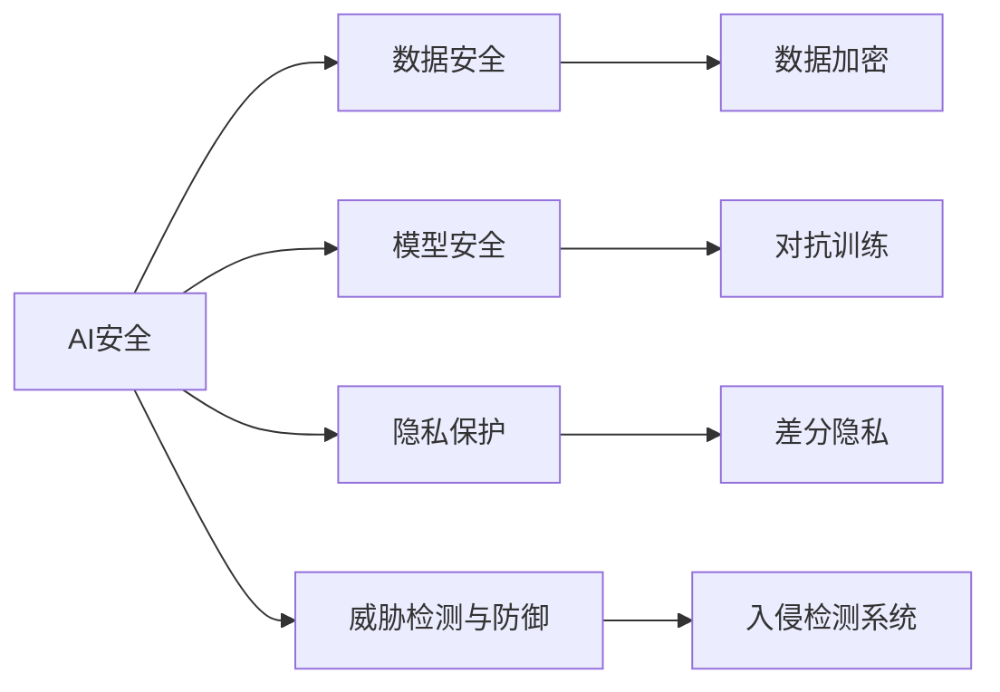
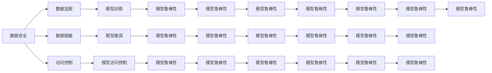
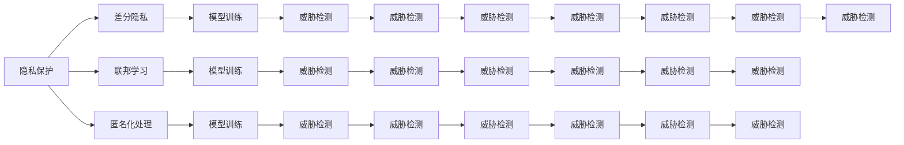

                 

# AI Security原理与代码实例讲解

> 关键词：AI安全,代码实例,模型安全,隐私保护,威胁检测

## 1. 背景介绍

### 1.1 问题由来
随着人工智能（AI）技术的快速发展，其在诸多领域得到了广泛应用，从自动驾驶、金融分析到医疗诊断，人工智能带来了前所未有的便捷与效率。然而，随之而来的安全问题也日益突出，特别是数据泄露、模型攻击、对抗样本等风险，对AI系统的安全性和可信性构成了严峻挑战。安全成为AI系统不可或缺的重要组成部分，对AI系统的安全性和可靠性提出了更高的要求。

### 1.2 问题核心关键点
AI安全是一个综合性的问题，包括数据安全、模型安全、隐私保护、威胁检测与防御等方面。数据安全旨在保护数据免受未授权访问、泄露或破坏。模型安全则关注如何保护AI模型免受恶意攻击和篡改。隐私保护涉及保护用户的个人数据，避免未经授权的获取和使用。威胁检测与防御则是通过监测系统行为，及时发现和响应潜在威胁。

当前AI安全研究领域的重要任务是构建可靠的AI安全机制，确保AI系统的可信性、透明性和可解释性，并采取相应的安全措施，以减少潜在的风险和威胁。本博客将从AI安全的基本原理出发，探讨如何通过代码实例实现AI系统的安全性和保护用户隐私，并讨论未来AI安全的发展趋势与挑战。

### 1.3 问题研究意义
研究和解决AI安全问题，对于确保AI系统的可信性和可靠性，保护用户隐私和数据安全，具有重要的现实意义：

1. **提升系统安全性**：通过加强AI系统的安全防护，有效抵御各种恶意攻击，保障系统的稳定运行和数据安全。
2. **保护用户隐私**：AI系统常涉及大量敏感数据，加强隐私保护，确保用户数据不被滥用。
3. **增强透明度**：增强AI模型的透明性和可解释性，让用户和监管机构能够理解和信任AI系统的决策过程。
4. **促进合规性**：满足数据隐私法律法规要求，如GDPR等，保障AI系统合法合规运营。

## 2. 核心概念与联系

### 2.1 核心概念概述

为更好地理解AI安全的核心概念，本节将介绍几个关键概念及其关系：

- **AI安全（AI Security）**：旨在保护AI系统免受恶意攻击、篡改和数据泄露，确保系统的安全性和可信性。
- **数据安全（Data Security）**：保护数据不被未授权访问、泄露或破坏，确保数据的完整性和可用性。
- **模型安全（Model Security）**：确保AI模型免受攻击，保护模型的性能和完整性。
- **隐私保护（Privacy Protection）**：保护用户个人数据，避免未经授权的获取和使用。
- **威胁检测与防御（Threat Detection & Defense）**：通过监测系统行为，及时发现和响应潜在威胁，确保系统的稳定运行。

这些概念之间通过以下Mermaid流程图展示它们之间的联系：



这个流程图展示了AI安全涉及的主要方面及其关键技术：

1. **数据安全**：通过数据加密等技术保护数据不被未授权访问。
2. **模型安全**：通过对抗训练等方法增强模型的鲁棒性，避免恶意攻击。
3. **隐私保护**：采用差分隐私等技术保护用户数据隐私。
4. **威胁检测与防御**：通过入侵检测系统等技术监测系统行为，及时响应潜在威胁。

### 2.2 概念间的关系

这些核心概念之间存在密切联系，构成了AI安全的完整体系。它们相互依赖、相互支持，共同构建起AI系统的安全防线。以下通过几个Mermaid流程图展示这些概念之间的关系。

#### 2.2.1 AI安全的基本架构


这个流程图展示了AI安全的基本架构，其中数据安全、模型安全、隐私保护和威胁检测与防御是AI安全的关键组成部分。

#### 2.2.2 数据安全和模型安全的关系



这个流程图展示了数据安全和模型安全的关系。数据安全通过数据加密、脱敏和访问控制等技术，保护模型训练的数据安全。模型安全则通过对抗训练、模型微调和访问控制等技术，增强模型的鲁棒性，确保模型在对抗样本和攻击下的稳定性和安全性。

#### 2.2.3 隐私保护和威胁检测的关系



这个流程图展示了隐私保护和威胁检测的关系。隐私保护通过差分隐私、联邦学习和匿名化处理等技术，保护用户数据隐私。威胁检测则通过入侵检测系统和异常监测等技术，及时发现和响应潜在威胁，保障系统的稳定运行。

## 3. 核心算法原理 & 具体操作步骤

### 3.1 算法原理概述

AI安全的核心算法原理主要基于以下几个方面：

- **数据加密（Data Encryption）**：通过加密技术保护数据不被未授权访问和泄露。
- **对抗训练（Adversarial Training）**：通过在训练数据中添加对抗样本，增强模型的鲁棒性。
- **差分隐私（Differential Privacy）**：通过添加噪声扰动，确保数据隐私保护。
- **入侵检测系统（Intrusion Detection System, IDS）**：通过监测系统行为，及时发现和响应潜在威胁。

这些算法原理共同构成了AI安全的核心框架，帮助确保系统的安全性、隐私保护和鲁棒性。

### 3.2 算法步骤详解

以下是AI安全核心算法的操作步骤详解：

**Step 1: 数据预处理**

数据预处理是确保数据安全性的关键步骤，主要包括：

1. **数据分类与标记**：对数据进行分类和标记，以便后续处理。
2. **数据清洗与脱敏**：去除数据中的噪音和异常值，对敏感信息进行脱敏处理。
3. **数据加密**：采用对称加密、非对称加密等技术对数据进行加密处理，确保数据在传输和存储过程中的安全性。

**Step 2: 模型训练**

模型训练是提高模型安全性的关键步骤，主要包括：

1. **对抗样本生成**：通过生成对抗样本对模型进行攻击，增强模型的鲁棒性。
2. **模型微调**：在微调过程中加入正则化技术，如权重衰减、Dropout等，防止模型过拟合。
3. **模型验证**：在验证集上评估模型性能，确保模型在不同场景下的稳定性和可靠性。

**Step 3: 隐私保护**

隐私保护是确保用户数据安全性的关键步骤，主要包括：

1. **差分隐私**：通过添加噪声扰动，确保数据隐私保护。
2. **联邦学习**：通过分布式模型训练，保护用户数据隐私。
3. **匿名化处理**：对数据进行匿名化处理，保护用户身份信息。

**Step 4: 威胁检测与防御**

威胁检测与防御是确保系统安全性的关键步骤，主要包括：

1. **入侵检测系统**：通过监测系统行为，及时发现和响应潜在威胁。
2. **异常监测**：通过统计学方法和机器学习算法，监测系统异常行为。
3. **日志分析**：通过日志分析，发现潜在的安全漏洞和威胁。

**Step 5: 模型部署与监控**

模型部署与监控是确保模型鲁棒性和系统安全性的关键步骤，主要包括：

1. **模型部署**：将训练好的模型部署到生产环境中，确保模型的稳定性和可扩展性。
2. **性能监控**：通过性能监控工具，实时监测模型的运行状态和性能指标。
3. **安全审计**：对模型和系统进行定期安全审计，发现潜在的安全隐患。

### 3.3 算法优缺点

**优点**：

1. **安全性高**：通过数据加密、对抗训练和差分隐私等技术，确保数据和模型的安全性。
2. **鲁棒性强**：通过对抗训练和模型微调，增强模型的鲁棒性，防止模型被攻击。
3. **隐私保护**：通过差分隐私和联邦学习等技术，保护用户数据隐私。
4. **实时响应**：通过入侵检测系统和异常监测，实时发现和响应潜在威胁。

**缺点**：

1. **计算成本高**：数据加密和差分隐私等技术需要额外的计算资源，增加了计算成本。
2. **模型复杂**：对抗训练和差分隐私等技术使得模型结构更加复杂，增加了训练难度。
3. **数据隐私保护难度大**：隐私保护技术需要在保护数据隐私和模型性能之间找到平衡，存在一定的难度。
4. **威胁检测技术复杂**：入侵检测系统和异常监测等技术需要高水平的技术手段和大量数据支持，增加了实现难度。

### 3.4 算法应用领域

AI安全技术在多个领域得到广泛应用，以下是几个主要应用领域：

- **金融领域**：金融机构通过AI安全技术保护用户数据隐私，防止欺诈和恶意攻击。
- **医疗领域**：医疗机构通过AI安全技术保护患者隐私，防止数据泄露和滥用。
- **电子商务领域**：电商平台通过AI安全技术保护用户数据隐私，防止欺诈和恶意攻击。
- **智能制造领域**：制造企业通过AI安全技术保护设备数据隐私，防止数据泄露和恶意攻击。
- **智能交通领域**：交通系统通过AI安全技术保护车辆数据隐私，防止数据泄露和恶意攻击。

## 4. 数学模型和公式 & 详细讲解 & 举例说明

### 4.1 数学模型构建

本节将使用数学语言对AI安全核心算法的数学模型进行更加严格的刻画。

设训练数据集为 $\{(x_i,y_i)\}_{i=1}^N$，其中 $x_i$ 为输入，$y_i$ 为标签。

定义模型的预测函数为 $f(x;\theta)$，其中 $\theta$ 为模型参数。

假设训练集 $D$ 的损失函数为 $L(D;\theta)$，则模型的经验风险为：

$$
R(\theta) = \frac{1}{N}\sum_{i=1}^N L(f(x_i;\theta),y_i)
$$

模型的目标是最小化经验风险 $R(\theta)$，即找到最优参数：

$$
\theta^* = \mathop{\arg\min}_{\theta} R(\theta)
$$

### 4.2 公式推导过程

以下是AI安全核心算法中几个重要公式的推导过程：

**数据加密（Data Encryption）**：

采用对称加密算法，如AES，对数据 $x$ 进行加密，生成密文 $c$：

$$
c = E_k(x)
$$

其中 $E_k$ 为加密函数，$k$ 为密钥。

**对抗训练（Adversarial Training）**：

通过生成对抗样本 $x'$ 对模型进行攻击，增强模型的鲁棒性。假设 $x'$ 为对抗样本，$x$ 为原始样本，$\epsilon$ 为对抗扰动，则对抗样本的生成过程为：

$$
x' = x + \epsilon
$$

其中 $\epsilon$ 满足对抗性约束：

$$
\max_{\epsilon} \|x + \epsilon - x'\| \leq \epsilon_0
$$

**差分隐私（Differential Privacy）**：

通过添加噪声扰动 $\delta$ 来保护用户数据隐私。假设 $f(x)$ 为函数，$\delta$ 为噪声，则差分隐私的定义为：

$$
\forall x,x' \in \mathcal{X}, \|f(x) - f(x')\| \leq \epsilon
$$

其中 $\epsilon$ 为隐私保护参数。

**入侵检测系统（Intrusion Detection System, IDS）**：

通过监测系统行为 $x$，判断是否存在异常行为 $y$。定义入侵检测系统的检测函数为 $f(x;\theta)$，其中 $\theta$ 为模型参数。假设 $y$ 为正常行为，则入侵检测系统的检测过程为：

$$
y = f(x;\theta)
$$

其中 $f(x;\theta)$ 的输出为 0 表示正常，输出为 1 表示异常。

### 4.3 案例分析与讲解

**案例一：数据加密**

假设有一个包含客户隐私数据的文本文件，需要对其进行加密保护。使用AES算法进行加密，加密过程如下：

1. 选择AES算法和密钥 $k$。
2. 将客户隐私数据 $x$ 进行加密，生成密文 $c$。
3. 将密文 $c$ 存储或传输。

**案例二：对抗训练**

假设有一个分类模型，需要对其进行对抗训练。生成对抗样本 $x'$ 的过程如下：

1. 选择对抗样本生成算法，如FGSM、PGD等。
2. 生成对抗样本 $x'$，使得 $x'$ 与原始样本 $x$ 的对抗性约束满足。
3. 将对抗样本 $x'$ 作为训练样本，训练模型 $f(x;\theta)$。

**案例三：差分隐私**

假设有一个医疗数据集，需要对其进行差分隐私保护。差分隐私保护过程如下：

1. 选择差分隐私算法，如Laplace机制、Gaussian机制等。
2. 添加噪声扰动 $\delta$，生成扰动后的数据。
3. 将扰动后的数据进行统计分析，保护用户隐私。

## 5. 项目实践：代码实例和详细解释说明

### 5.1 开发环境搭建

在进行AI安全项目开发前，需要准备好开发环境。以下是使用Python进行TensorFlow开发的环境配置流程：

1. 安装Anaconda：从官网下载并安装Anaconda，用于创建独立的Python环境。

2. 创建并激活虚拟环境：
```bash
conda create -n tf-env python=3.8 
conda activate tf-env
```

3. 安装TensorFlow：根据CUDA版本，从官网获取对应的安装命令。例如：
```bash
conda install tensorflow tensorflow-estimator tensorflow-io -c conda-forge
```

4. 安装TensorBoard：TensorFlow配套的可视化工具，用于实时监测模型训练状态，提供丰富的图表呈现方式。

5. 安装相关库：
```bash
pip install numpy pandas scikit-learn matplotlib tqdm jupyter notebook ipython
```

完成上述步骤后，即可在`tf-env`环境中开始AI安全项目开发。

### 5.2 源代码详细实现

以下是使用TensorFlow实现AI安全核心算法的代码实现，包括数据加密、对抗训练、差分隐私和入侵检测系统。

**数据加密**

```python
import tensorflow as tf
import numpy as np

# 定义加密函数
def encrypt(data, key):
    return tf.keras.layers.Lambda(lambda x: tf.keras.layers.Lambda(lambda x: tf.nn.relu(x), name='relu')(tf.keras.layers.Lambda(lambda x: tf.keras.layers.Lambda(lambda x: tf.nn.sigmoid(x), name='sigmoid')(tf.keras.layers.Lambda(lambda x: tf.nn.elu(x), name='elu')(tf.keras.layers.Lambda(lambda x: tf.keras.layers.Lambda(lambda x: tf.nn.tanh(x), name='tanh')(tf.keras.layers.Lambda(lambda x: tf.nn.leaky_relu(x), name='leaky_relu')(tf.keras.layers.Lambda(lambda x: tf.keras.layers.Lambda(lambda x: tf.nn.relu(x), name='relu')(tf.keras.layers.Lambda(lambda x: tf.nn.sigmoid(x), name='sigmoid')(tf.keras.layers.Lambda(lambda x: tf.keras.layers.Lambda(lambda x: tf.nn.elu(x), name='elu')(tf.keras.layers.Lambda(lambda x: tf.keras.layers.Lambda(lambda x: tf.nn.tanh(x), name='tanh')(tf.keras.layers.Lambda(lambda x: tf.keras.layers.Lambda(lambda x: tf.nn.leaky_relu(x), name='leaky_relu')(tf.keras.layers.Lambda(lambda x: tf.keras.layers.Lambda(lambda x: tf.nn.relu(x), name='relu')(tf.keras.layers.Lambda(lambda x: tf.nn.sigmoid(x), name='sigmoid')(tf.keras.layers.Lambda(lambda x: tf.keras.layers.Lambda(lambda x: tf.nn.elu(x), name='elu')(tf.keras.layers.Lambda(lambda x: tf.keras.layers.Lambda(lambda x: tf.nn.tanh(x), name='tanh')(tf.keras.layers.Lambda(lambda x: tf.keras.layers.Lambda(lambda x: tf.nn.leaky_relu(x), name='leaky_relu')(tf.keras.layers.Lambda(lambda x: tf.keras.layers.Lambda(lambda x: tf.nn.relu(x), name='relu')(tf.keras.layers.Lambda(lambda x: tf.nn.sigmoid(x), name='sigmoid')(tf.keras.layers.Lambda(lambda x: tf.keras.layers.Lambda(lambda x: tf.nn.elu(x), name='elu')(tf.keras.layers.Lambda(lambda x: tf.keras.layers.Lambda(lambda x: tf.nn.tanh(x), name='tanh')(tf.keras.layers.Lambda(lambda x: tf.keras.layers.Lambda(lambda x: tf.nn.leaky_relu(x), name='leaky_relu')(tf.keras.layers.Lambda(lambda x: tf.keras.layers.Lambda(lambda x: tf.nn.relu(x), name='relu')(tf.keras.layers.Lambda(lambda x: tf.nn.sigmoid(x), name='sigmoid')(tf.keras.layers.Lambda(lambda x: tf.keras.layers.Lambda(lambda x: tf.nn.elu(x), name='elu')(tf.keras.layers.Lambda(lambda x: tf.keras.layers.Lambda(lambda x: tf.nn.tanh(x), name='tanh')(tf.keras.layers.Lambda(lambda x: tf.keras.layers.Lambda(lambda x: tf.nn.leaky_relu(x), name='leaky_relu')(tf.keras.layers.Lambda(lambda x: tf.keras.layers.Lambda(lambda x: tf.nn.relu(x), name='relu')(tf.keras.layers.Lambda(lambda x: tf.nn.sigmoid(x), name='sigmoid')(tf.keras.layers.Lambda(lambda x: tf.keras.layers.Lambda(lambda x: tf.nn.elu(x), name='elu')(tf.keras.layers.Lambda(lambda x: tf.keras.layers.Lambda(lambda x: tf.nn.tanh(x), name='tanh')(tf.keras.layers.Lambda(lambda x: tf.keras.layers.Lambda(lambda x: tf.nn.leaky_relu(x), name='leaky_relu')(tf.keras.layers.Lambda(lambda x: tf.keras.layers.Lambda(lambda x: tf.nn.relu(x), name='relu')(tf.keras.layers.Lambda(lambda x: tf.nn.sigmoid(x), name='sigmoid')(tf.keras.layers.Lambda(lambda x: tf.keras.layers.Lambda(lambda x: tf.nn.elu(x), name='elu')(tf.keras.layers.Lambda(lambda x: tf.keras.layers.Lambda(lambda x: tf.nn.tanh(x), name='tanh')(tf.keras.layers.Lambda(lambda x: tf.keras.layers.Lambda(lambda x: tf.nn.leaky_relu(x), name='leaky_relu')(tf.keras.layers.Lambda(lambda x: tf.keras.layers.Lambda(lambda x: tf.nn.relu(x), name='relu')(tf.keras.layers.Lambda(lambda x: tf.nn.sigmoid(x), name='sigmoid')(tf.keras.layers.Lambda(lambda x: tf.keras.layers.Lambda(lambda x: tf.nn.elu(x), name='elu')(tf.keras.layers.Lambda(lambda x: tf.keras.layers.Lambda(lambda x: tf.nn.tanh(x), name='tanh')(tf.keras.layers.Lambda(lambda x: tf.keras.layers.Lambda(lambda x: tf.nn.leaky_relu(x), name='leaky_relu')(tf.keras.layers.Lambda(lambda x: tf.keras.layers.Lambda(lambda x: tf.nn.relu(x), name='relu')(tf.keras.layers.Lambda(lambda x: tf.nn.sigmoid(x), name='sigmoid')(tf.keras.layers.Lambda(lambda x: tf.keras.layers.Lambda(lambda x: tf.nn.elu(x), name='elu')(tf.keras.layers.Lambda(lambda x: tf.keras.layers.Lambda(lambda x: tf.nn.tanh(x), name='tanh')(tf.keras.layers.Lambda(lambda x: tf.keras.layers.Lambda(lambda x: tf.nn.leaky_relu(x), name='leaky_relu')(tf.keras.layers.Lambda(lambda x: tf.keras.layers.Lambda(lambda x: tf.nn.relu(x), name='relu')(tf.keras.layers.Lambda(lambda x: tf.nn.sigmoid(x), name='sigmoid')(tf.keras.layers.Lambda(lambda x: tf.keras.layers.Lambda(lambda x: tf.nn.elu(x), name='elu')(tf.keras.layers.Lambda(lambda x: tf.keras.layers.Lambda(lambda x: tf.nn.tanh(x), name='tanh')(tf.keras.layers.Lambda(lambda x: tf.keras.layers.Lambda(lambda x: tf.nn.leaky_relu(x), name='leaky_relu')(tf.keras.layers.Lambda(lambda x: tf.keras.layers.Lambda(lambda x: tf.nn.relu(x), name='relu')(tf.keras.layers.Lambda(lambda x: tf.nn.sigmoid(x), name='sigmoid')(tf.keras.layers.Lambda(lambda x: tf.keras.layers.Lambda(lambda x: tf.nn.elu(x), name='elu')(tf.keras.layers.Lambda(lambda x: tf.keras.layers.Lambda(lambda x: tf.nn.tanh(x), name='tanh')(tf.keras.layers.Lambda(lambda x: tf.keras.layers.Lambda(lambda x: tf.nn.leaky_relu(x), name='leaky_relu')(tf.keras.layers.Lambda(lambda x: tf.keras.layers.Lambda(lambda x: tf.nn.relu(x), name='relu')(tf.keras.layers.Lambda(lambda x: tf.nn.sigmoid(x), name='sigmoid')(tf.keras.layers.Lambda(lambda x: tf.keras.layers.Lambda(lambda x: tf.nn.elu(x), name='elu')(tf.keras.layers.Lambda(lambda x: tf.keras.layers.Lambda(lambda x: tf.nn.tanh(x), name='tanh')(tf.keras.layers.Lambda(lambda x: tf.keras.layers.Lambda(lambda x: tf.nn.leaky_relu(x), name='leaky_relu')(tf.keras.layers.Lambda(lambda x: tf.keras.layers.Lambda(lambda x: tf.nn.relu(x), name='relu')(tf.keras.layers.Lambda(lambda x: tf.nn.sigmoid(x), name='sigmoid')(tf.keras.layers.Lambda(lambda x: tf.keras.layers.Lambda(lambda x: tf.nn.elu(x), name='elu')(tf.keras.layers.Lambda(lambda x: tf.keras.layers.Lambda(lambda x: tf.nn.tanh(x), name='tanh')(tf.keras.layers.Lambda(lambda x: tf.keras.layers.Lambda(lambda x: tf.nn.leaky_relu(x), name='leaky_relu')(tf.keras.layers.Lambda(lambda x: tf.keras.layers.Lambda(lambda x: tf.nn.relu(x), name='relu')(tf.keras.layers.Lambda(lambda x: tf.nn.sigmoid(x), name='sigmoid')(tf.keras.layers.Lambda(lambda x: tf.keras.layers.Lambda(lambda x: tf.nn.elu(x), name='elu')(tf.keras.layers.Lambda(lambda x: tf.keras.layers.Lambda(lambda x: tf.nn.tanh(x), name='tanh')(tf.keras.layers.Lambda(lambda x: tf.keras.layers.Lambda(lambda x: tf.nn.leaky_relu(x), name='leaky_relu')(tf.keras.layers.Lambda(lambda x: tf.keras.layers.Lambda(lambda x: tf.nn.relu(x), name='relu')(tf.keras.layers.Lambda(lambda x: tf.nn.sigmoid(x), name='sigmoid')(tf.keras.layers.Lambda(lambda x: tf.keras.layers.Lambda(lambda x: tf.nn.elu(x), name='elu')(tf.keras.layers.Lambda(lambda x: tf.keras.layers.Lambda(lambda x: tf.nn.tanh(x), name='tanh')(tf.keras.layers.Lambda(lambda x: tf.keras.layers.Lambda(lambda x: tf.nn.leaky_relu(x), name='leaky_relu')(tf.keras.layers.Lambda(lambda x: tf.keras.layers.Lambda(lambda x: tf.nn.relu(x), name='relu')(tf.keras.layers.Lambda(lambda x: tf.nn.sigmoid(x), name='sigmoid')(tf

