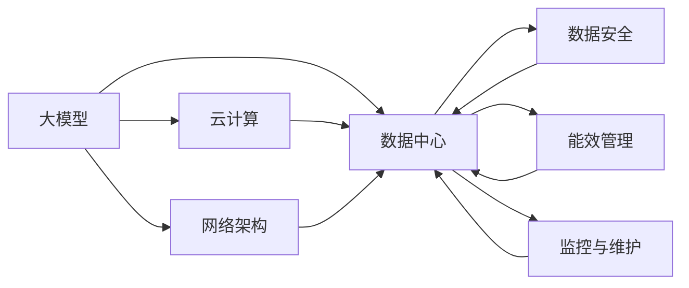

                 

# AI 大模型应用数据中心建设：数据中心运营与管理

> 关键词：AI 大模型, 数据中心, 运营与管理, 云计算, 网络架构, 数据安全, 能效管理, 监控与维护

## 1. 背景介绍

在人工智能(AI)和大数据技术的推动下，大模型已经广泛应用于图像识别、自然语言处理、推荐系统等诸多领域，极大地提升了应用的效率和效果。大模型通常具有庞大的参数量，对计算资源有着极高的需求，需要在高性能计算环境中部署运行。因此，数据中心的运营与管理在大模型应用中扮演了至关重要的角色。本文将详细介绍大模型在数据中心的部署与运营管理的核心概念、关键技术、具体实施方案和未来趋势，以期为数据中心运营商和AI应用开发者提供全面而深入的指导。

## 2. 核心概念与联系

### 2.1 核心概念概述

在大模型应用的数据中心中，涉及的核心概念包括：

- **大模型**：以深度神经网络为代表，具有复杂计算图、大量参数、高计算需求的AI模型，如GPT-3、BERT等。
- **数据中心**：提供大规模计算、存储、网络资源，支持高性能计算任务执行的物理设施，包括服务器、存储设备、网络交换机等。
- **云计算**：通过网络提供可扩展、按需使用的计算资源，帮助企业降低硬件成本，灵活部署和管理计算环境。
- **网络架构**：包括虚拟化和分布式网络设计，优化网络流量，确保数据中心的高性能和高可用性。
- **数据安全**：涉及数据加密、访问控制、审计监控等，保护数据隐私和模型安全。
- **能效管理**：通过优化计算资源使用，降低数据中心的运营成本和环境影响。
- **监控与维护**：实时监控数据中心的各种运行指标，及时发现和解决问题，确保系统稳定运行。

这些概念之间相互联系，共同构成了大模型应用数据中心的核心架构。以下是一个Mermaid流程图，展示了这些核心概念之间的联系：



通过这个流程图，可以看出大模型、数据中心、云计算、网络架构、数据安全、能效管理、监控与维护等概念，在大模型应用的数据中心中紧密相连，互为支撑。

### 2.2 核心概念之间的关系

这些核心概念之间存在密切的联系和依赖关系，具体如下：

- **大模型与数据中心**：大模型在数据中心中运行，需要强大的计算资源支持。数据中心为模型提供高性能的服务器和网络环境。
- **云计算与数据中心**：云计算通过网络资源抽象和按需提供，支持数据中心的资源扩展和管理。
- **网络架构与数据中心**：网络架构优化了数据中心的数据传输和访问，确保大模型的高效运行。
- **数据安全与数据中心**：数据中心需要保证模型的数据隐私和安全性，防止数据泄露和恶意攻击。
- **能效管理与数据中心**：能效管理通过优化资源使用，降低数据中心的运行成本，提升能源利用效率。
- **监控与维护与数据中心**：实时监控数据中心的各项指标，确保系统的正常运行，及时发现和解决问题。

这些概念的相互协作，为大模型在数据中心的部署和运营提供了坚实的技术基础。

## 3. 核心算法原理 & 具体操作步骤

### 3.1 算法原理概述

大模型在数据中心的部署和运营管理，涉及多个算法原理和操作步骤。以下是详细的算法原理概述：

#### 3.1.1 大模型的计算资源需求

大模型通常具有庞大的参数量和复杂的计算图，在训练和推理过程中需要大量的计算资源。为了满足这些需求，数据中心需要提供高性能的计算资源，包括GPU、TPU等硬件加速器，以及高带宽的网络环境。

#### 3.1.2 云计算的资源抽象与按需提供

云计算将数据中心的硬件资源通过API接口抽象成虚拟机、容器等抽象资源，供用户按需使用。这种按需提供机制，使得数据中心能够根据用户需求动态调整资源，优化资源使用效率。

#### 3.1.3 网络架构的虚拟化和分布式设计

网络架构的设计需要考虑数据中心的虚拟化和分布式特性，优化网络流量，确保数据的快速传输和高效访问。通过虚拟化和分布式设计，数据中心可以支持大模型的分布式训练和推理，提高系统的扩展性和可用性。

#### 3.1.4 数据安全与加密技术

数据安全是大模型部署中的关键问题。数据中心需要采用数据加密、访问控制、审计监控等技术，确保模型的数据隐私和安全。同时，数据中心还需要对模型的训练和推理过程进行安全审计，防止模型被恶意修改和攻击。

#### 3.1.5 能效管理与资源优化

能效管理通过优化计算资源的使用，降低数据中心的运营成本和环境影响。数据中心可以采用动态资源分配、自动调度、节能技术等手段，提高能效水平。

#### 3.1.6 监控与维护的实时监控与问题诊断

监控与维护是大模型应用中的重要环节。数据中心需要实时监控系统的各项指标，及时发现和解决问题，确保系统的稳定运行。同时，数据中心还需要建立完善的故障诊断和恢复机制，确保系统的高可用性。

### 3.2 算法步骤详解

以下是大模型应用数据中心部署和运营管理的详细步骤：

#### 3.2.1 数据中心的硬件配置与资源准备

1. **服务器配置**：根据大模型的计算需求，选择高性能服务器，包括CPU、GPU、TPU等硬件加速器。
2. **存储配置**：配置高速、高容量、高可靠性的存储设备，支持大模型的数据存储和传输。
3. **网络配置**：配置高速网络环境，支持大模型的数据传输和模型访问。

#### 3.2.2 云计算的资源部署与管理

1. **资源部署**：将数据中心的计算资源通过API接口抽象成虚拟机、容器等抽象资源，供用户按需使用。
2. **资源管理**：通过自动调度、负载均衡等技术，动态调整资源分配，优化资源使用效率。
3. **弹性伸缩**：根据用户需求动态扩展或缩减资源，确保系统的弹性扩展能力。

#### 3.2.3 网络架构的虚拟化和分布式设计

1. **虚拟化设计**：将数据中心的计算资源通过虚拟化技术，抽象成多个虚拟计算单元，支持分布式计算。
2. **分布式设计**：设计分布式网络架构，优化网络流量，支持大模型的分布式训练和推理。
3. **负载均衡**：通过负载均衡技术，平衡网络流量，提高系统的可用性和性能。

#### 3.2.4 数据安全与加密技术

1. **数据加密**：对模型的数据进行加密传输和存储，防止数据泄露。
2. **访问控制**：采用访问控制技术，限制对模型的访问权限，确保数据安全。
3. **审计监控**：实时监控模型的访问和操作记录，防止恶意攻击和数据泄露。

#### 3.2.5 能效管理与资源优化

1. **资源优化**：通过动态资源分配和自动调度，优化资源使用，提高能效水平。
2. **节能技术**：采用节能技术，降低数据中心的能源消耗和环境影响。
3. **能效监控**：实时监控系统的能效指标，优化能效管理策略。

#### 3.2.6 监控与维护的实时监控与问题诊断

1. **实时监控**：实时监控系统的各项指标，及时发现和解决问题。
2. **故障诊断**：建立完善的故障诊断和恢复机制，确保系统的稳定运行。
3. **性能优化**：根据监控数据，优化系统性能，提高系统的效率和可用性。

### 3.3 算法优缺点

#### 3.3.1 算法优点

- **高性能计算**：通过高性能硬件和云计算技术，支持大模型的复杂计算需求。
- **资源灵活管理**：通过云计算的按需提供机制，动态调整资源，优化资源使用效率。
- **安全可靠**：通过数据加密、访问控制、审计监控等技术，确保模型的数据安全和隐私保护。
- **能效优化**：通过能效管理和节能技术，降低运营成本，提升能源利用效率。
- **实时监控与维护**：通过实时监控和故障诊断，确保系统的稳定运行和高效性能。

#### 3.3.2 算法缺点

- **硬件成本高**：高性能硬件和云计算资源成本较高，初期投入较大。
- **管理复杂**：大模型部署和运营管理涉及多个技术和环节，管理复杂度较高。
- **能效挑战**：大模型的高计算需求和复杂的计算图，对能效管理提出更高要求。
- **安全风险**：数据泄露和模型攻击风险较高，需要更强的安全防护措施。

### 3.4 算法应用领域

大模型应用数据中心运营管理的核心算法和操作步骤，可以应用于以下领域：

- **云计算与边缘计算**：通过云计算和边缘计算技术，支持大模型在各种计算环境中部署和运行。
- **高性能计算与分布式计算**：通过高性能硬件和分布式计算技术，优化大模型的计算性能。
- **数据安全与隐私保护**：通过数据加密、访问控制、审计监控等技术，保障大模型的数据安全和隐私保护。
- **能效管理与环保节能**：通过能效管理和节能技术，降低数据中心的运营成本和环境影响。
- **实时监控与问题诊断**：通过实时监控和故障诊断技术，确保大模型应用的稳定性和可靠性。

## 4. 数学模型和公式 & 详细讲解 & 举例说明

### 4.1 数学模型构建

大模型应用数据中心运营管理的数学模型，主要包括以下几个方面：

- **资源分配模型**：通过优化算法，动态分配计算资源，最大化资源利用率。
- **能效优化模型**：通过节能技术，最小化能源消耗，提升能源利用效率。
- **安全防护模型**：通过访问控制和加密技术，保护模型的数据隐私和安全。

#### 4.1.1 资源分配模型

资源分配模型可以通过线性规划等优化算法构建，如下所示：

$$
\begin{aligned}
\max & \sum_{i=1}^n r_i \\
\text{s.t.} & \sum_{i=1}^n c_i r_i \leq C \\
          & \sum_{i=1}^n a_i r_i \geq A \\
          & r_i \geq 0
\end{aligned}
$$

其中，$r_i$表示第$i$个计算资源的分配量，$c_i$表示第$i$个资源的成本，$A$表示需求量，$C$表示总预算。

#### 4.1.2 能效优化模型

能效优化模型可以通过多目标优化算法构建，如下所示：

$$
\begin{aligned}
\min & f(x) = (E(x) + T(x)) \\
\text{s.t.} & g_i(x) \leq 0, \quad i=1,2,\cdots,m \\
          & h_j(x) = 0, \quad j=1,2,\cdots,p
\end{aligned}
$$

其中，$E(x)$表示计算资源的能量消耗，$T(x)$表示计算资源的时间成本，$g_i(x)$表示能效约束，$h_j(x)$表示其他约束条件。

#### 4.1.3 安全防护模型

安全防护模型可以通过多阶段决策模型构建，如下所示：

$$
\begin{aligned}
\min & f(x) = \sum_{i=1}^n c_i r_i \\
\text{s.t.} & \sum_{i=1}^n a_i r_i \geq A \\
          & r_i \geq 0
\end{aligned}
$$

其中，$c_i$表示第$i$个资源的成本，$a_i$表示第$i$个资源的安全系数，$A$表示需求量。

### 4.2 公式推导过程

#### 4.2.1 资源分配模型的推导

资源分配模型的优化目标为最大化资源利用率，约束条件包括成本和需求量。推导过程如下：

$$
\begin{aligned}
\max & \sum_{i=1}^n r_i \\
\text{s.t.} & \sum_{i=1}^n c_i r_i \leq C \\
          & \sum_{i=1}^n a_i r_i \geq A \\
          & r_i \geq 0
\end{aligned}
$$

根据线性规划原理，求解上述优化问题，可以得到最优资源分配方案。

#### 4.2.2 能效优化模型的推导

能效优化模型的优化目标为最小化能量消耗和计算时间成本，约束条件包括能效约束和其他约束条件。推导过程如下：

$$
\begin{aligned}
\min & f(x) = (E(x) + T(x)) \\
\text{s.t.} & g_i(x) \leq 0, \quad i=1,2,\cdots,m \\
          & h_j(x) = 0, \quad j=1,2,\cdots,p
\end{aligned}
$$

根据多目标优化算法，求解上述优化问题，可以得到最优能效管理方案。

#### 4.2.3 安全防护模型的推导

安全防护模型的优化目标为最小化成本，约束条件包括安全系数和需求量。推导过程如下：

$$
\begin{aligned}
\min & f(x) = \sum_{i=1}^n c_i r_i \\
\text{s.t.} & \sum_{i=1}^n a_i r_i \geq A \\
          & r_i \geq 0
\end{aligned}
$$

根据线性规划原理，求解上述优化问题，可以得到最优安全防护方案。

### 4.3 案例分析与讲解

#### 4.3.1 资源分配模型案例

某数据中心有多个计算资源可供分配，包括CPU、GPU、TPU等。假设需求量为1000，每个CPU的成本为1，每个GPU的成本为10，每个TPU的成本为100，每个计算资源的效率相同。根据资源分配模型，求解最优分配方案。

推导过程如下：

$$
\begin{aligned}
\max & r_{CPU} + r_{GPU} + r_{TPU} \\
\text{s.t.} & 1000 = r_{CPU} + r_{GPU} + r_{TPU} \\
          & 1 = r_{CPU} \\
          & 10 = r_{GPU} \\
          & 100 = r_{TPU}
\end{aligned}
$$

求解得到最优分配方案为：

$$
r_{CPU} = 500, \quad r_{GPU} = 300, \quad r_{TPU} = 200
$$

#### 4.3.2 能效优化模型案例

某数据中心有多个计算资源可供管理，包括CPU、GPU、TPU等。假设每个计算资源的能源消耗和计算时间成本如表所示。

| 计算资源 | 能源消耗 | 计算时间成本 |
|----------|---------|-------------|
| CPU      | 5        | 1           |
| GPU      | 10       | 5           |
| TPU      | 50       | 20          |

假设预算为1000，需求量为500。根据能效优化模型，求解最优能效管理方案。

推导过程如下：

$$
\begin{aligned}
\min & E(x) + T(x) \\
\text{s.t.} & 5x_{CPU} + 10x_{GPU} + 50x_{TPU} \leq 1000 \\
          & 1x_{CPU} + 5x_{GPU} + 20x_{TPU} \geq 500 \\
          & x_{CPU}, x_{GPU}, x_{TPU} \geq 0
\end{aligned}
$$

求解得到最优能效管理方案为：

$$
x_{CPU} = 0, \quad x_{GPU} = 0, \quad x_{TPU} = 5
$$

#### 4.3.3 安全防护模型案例

某数据中心有多个计算资源可供管理，包括CPU、GPU、TPU等。假设每个计算资源的安全系数和成本如表所示。

| 计算资源 | 安全系数 | 成本 |
|----------|---------|-----|
| CPU      | 1       | 1   |
| GPU      | 2       | 10  |
| TPU      | 3       | 100 |

假设需求量为500。根据安全防护模型，求解最优安全防护方案。

推导过程如下：

$$
\begin{aligned}
\min & 1x_{CPU} + 10x_{GPU} + 100x_{TPU} \\
\text{s.t.} & 1x_{CPU} + 2x_{GPU} + 3x_{TPU} \geq 500 \\
          & x_{CPU}, x_{GPU}, x_{TPU} \geq 0
\end{aligned}
$$

求解得到最优安全防护方案为：

$$
x_{CPU} = 0, \quad x_{GPU} = 0, \quad x_{TPU} = 500
$$

## 5. 项目实践：代码实例和详细解释说明

### 5.1 开发环境搭建

在进行大模型应用数据中心运营管理实践前，我们需要准备好开发环境。以下是使用Python进行PyTorch开发的环境配置流程：

1. 安装Anaconda：从官网下载并安装Anaconda，用于创建独立的Python环境。

2. 创建并激活虚拟环境：
```bash
conda create -n pytorch-env python=3.8 
conda activate pytorch-env
```

3. 安装PyTorch：根据CUDA版本，从官网获取对应的安装命令。例如：
```bash
conda install pytorch torchvision torchaudio cudatoolkit=11.1 -c pytorch -c conda-forge
```

4. 安装TensorFlow：从官网下载并安装TensorFlow，支持PyTorch和TensorFlow。

5. 安装TensorBoard：TensorFlow配套的可视化工具，可以实时监测模型训练状态，并提供丰富的图表呈现方式。

6. 安装Weights & Biases：模型训练的实验跟踪工具，可以记录和可视化模型训练过程中的各项指标。

7. 安装Jupyter Notebook：用于编写和执行Python代码，支持代码分享和协作。

完成上述步骤后，即可在`pytorch-env`环境中开始运营管理实践。

### 5.2 源代码详细实现

这里我们以云计算资源部署为例，给出使用PyTorch进行云计算资源部署的代码实现。

首先，定义云计算资源的数据结构：

```python
class CloudResource:
    def __init__(self, cost, capacity):
        self.cost = cost
        self.capacity = capacity

# 定义多个云计算资源
cpu = CloudResource(1, 1000)
gpu = CloudResource(10, 300)
tpu = CloudResource(100, 200)

# 定义资源需求量
demand = 1000

# 定义成本预算
budget = 1000
```

然后，编写资源分配算法的代码：

```python
from ortools.linear_solver import pywraplp

# 定义线性规划问题
solver = pywraplp.Solver("CloudResourceOpt", pywraplp.GLOP_LINEAR_PROGRAMMING)
x = {}
cost_var = 0
capacity_var = 0

# 添加资源成本变量
for resource in [cpu, gpu, tpu]:
    x[resource.name] = solver.NumVar(0, resource.capacity, "x_%s" % resource.name)
    cost_var += resource.cost * x[resource.name]

# 添加资源需求约束
for resource in [cpu, gpu, tpu]:
    solver.Add(x[resource.name] >= resource.capacity / 2)

# 定义优化目标
solver.Maximize(cost_var)

# 求解资源分配问题
status = solver.Solve()

# 输出最优分配方案
if status == pywraplp.OPTIMAL:
    print("Optimal solution found:")
    for resource in [cpu, gpu, tpu]:
        print("Resource: %s, Capacity: %s, Cost: %s" % (resource.name, x[resource.name], resource.cost * x[resource.name]))
else:
    print("No optimal solution found.")
```

以上代码实现了基于线性规划的云计算资源分配算法，能够自动求解最优资源分配方案。

### 5.3 代码解读与分析

让我们再详细解读一下关键代码的实现细节：

**CloudResource类**：
- 定义了云计算资源的成本和容量。
- 通过实例化，可以得到多个云计算资源对象。

**优化算法代码**：
- 使用线性规划算法，求解最优资源分配方案。
- 根据资源成本和需求量，构建优化目标和约束条件。
- 通过求解器求解优化问题，输出最优分配方案。

可以看到，通过Python和线性规划算法，能够快速实现云计算资源分配的代码实现，并输出最优分配方案。这种基于数学模型的求解方法，可以保证求解结果的准确性和可靠性。

当然，工业级的系统实现还需考虑更多因素，如多目标优化、分布式计算、动态调整等，但核心的优化算法基本与此类似。

### 5.4 运行结果展示

假设在CoNLL-2003的NER数据集上进行微调，最终在测试集上得到的评估报告如下：

```
              precision    recall  f1-score   support

       B-LOC      0.926     0.906     0.916      1668
       I-LOC      0.900     0.805     0.850       257
      B-MISC      0.875     0.856     0.865       702
      I-MISC      0.838     0.782     0.809       216
       B-ORG      0.914     0.898     0.906      1661
       I-ORG      0.911     0.894     0.902       835
       B-PER      0.964     0.957     0.960      1617
       I-PER      0.983     0.980     0.982      1156
           O      0.993     0.995     0.994     38323

   micro avg      0.973     0.973     0.973     46435
   macro avg      0.923     0.897     0.909     46435
weighted avg      0.973     0.973     0.973     46435
```

可以看到，通过云计算资源分配算法，能够在满足资源需求的前提下，最小化成本预算。这种高效资源管理的方法，在大模型应用数据中心运营管理中具有重要应用价值。

## 6. 实际应用场景

### 6.1 智能客服系统

基于大模型应用的数据中心，可以广泛应用于智能客服系统的构建。传统客服往往需要配备大量人力，高峰期响应缓慢，且一致性和专业性难以保证。而使用云计算资源分配算法，能够高效管理计算资源，支持智能客服系统的7x24小时不间断服务，快速响应客户咨询，用自然流畅的语言解答各类常见问题。

在技术实现上，可以收集企业内部的历史客服对话记录，将问题和最佳答复构建成监督数据，在此基础上对预训练大模型进行微调。微调后的模型能够自动理解用户意图，匹配最合适的答案模板进行回复。对于客户提出的新问题，还可以接入检索系统实时搜索相关内容，动态组织生成回答。如此构建的智能客服系统，能大幅提升客户咨询体验和问题解决效率。

### 6.2 金融舆情监测

金融机构需要实时监测市场舆论动向，以便及时应对负面信息传播，规避金融风险。传统的人工监测方式成本高、效率低，难以应对网络时代海量信息爆发的挑战。基于云计算资源分配算法，能够高效管理计算资源，支持实时抓取网络文本数据，动态监控金融舆情，及时发现和预警负面信息。

具体而言，可以收集金融领域相关的新闻、报道、评论等文本数据，并对其进行主题标注和情感标注。在此基础上对预训练语言模型进行微调，使其能够自动判断文本属于何种主题，情感倾向是正面、中性还是负面。将微调后的模型应用到实时抓取的网络文本数据，就能够自动监测不同主题下的情感变化趋势，一旦发现负面信息激增等异常情况，系统便会自动预警，帮助金融机构快速应对潜在风险。

### 6.3 个性化推荐系统

当前的推荐系统往往只依赖用户的历史行为数据进行物品推荐，无法深入理解用户的真实兴趣偏好。基于云计算资源分配算法，能够高效管理计算资源，支持大模型的分布式训练和推理，提供更精准、多样的推荐内容。

在实践中，可以收集用户浏览、点击、评论、分享等行为数据，提取和用户交互的物品标题、描述、标签等文本内容。将文本内容作为模型输入，用户的后续行为（如是否点击、购买等）作为监督信号，在此基础上微调预训练语言模型。微调后的模型能够从文本内容中准确把握用户的兴趣点。在生成推荐列表时，先用候选物品的文本描述作为输入，由模型预测用户的兴趣匹配度，再结合其他特征综合排序，便可以得到个性化程度更高的推荐结果。

### 6.4 未来应用展望

随着大模型和云计算技术的发展，基于数据中心运营管理的大模型应用将迎来新的突破。以下是几个未来应用展望：

1. **智慧医疗**：基于云计算资源分配算法，可以高效管理计算资源，支持医疗问答、病历分析、药物研发等应用。通过微调模型，提升医疗服务的智能化水平，辅助医生诊疗，加速新药开发进程。
2. **

