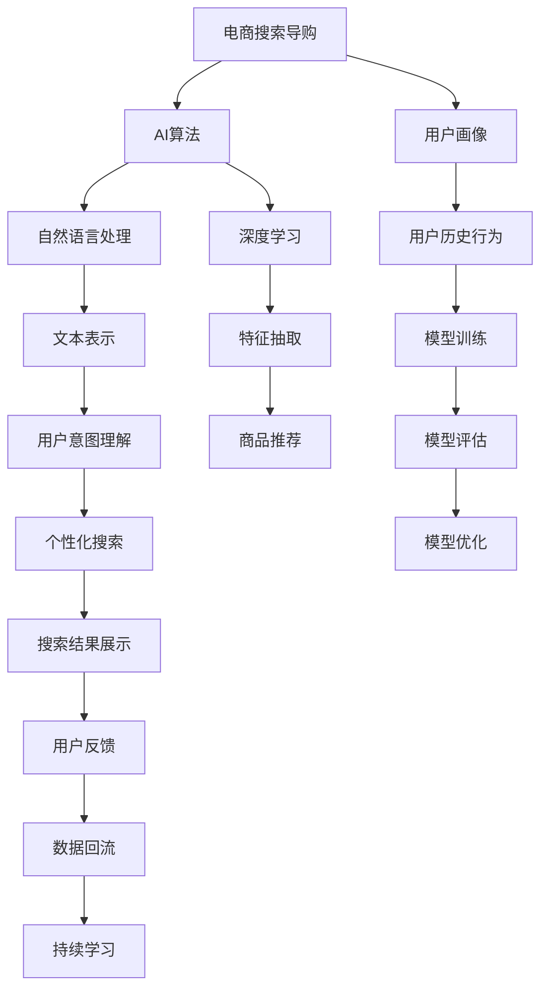
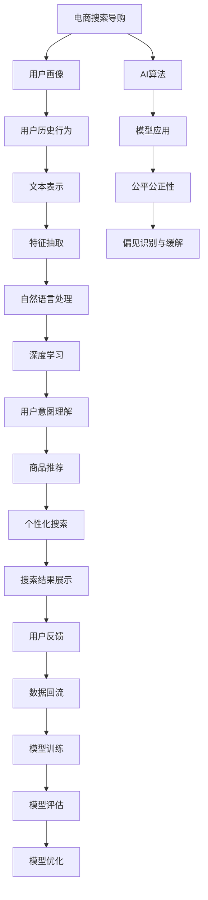

                 

# AI 技术在电商搜索导购中的公平公正性：技术应用与伦理思考

## 1. 背景介绍

随着电子商务的蓬勃发展，AI技术在电商搜索导购中的应用变得越来越广泛。传统的电商搜索系统通常基于关键词匹配，这种模式存在明显的用户画像单一、搜索结果不全面等问题。而AI技术可以通过深度学习、自然语言处理等手段，从多维度分析用户需求，提供个性化、精准的搜索结果，极大地提升了电商搜索的效率和用户体验。然而，AI技术的应用并非没有争议。部分研究指出，AI模型在电商搜索导购中的表现存在偏见和不公平现象，可能会对部分用户群体造成负面影响。本文将重点探讨AI技术在电商搜索导购中的公平公正性问题，分析其技术应用和伦理挑战，并提出相应的解决策略。

## 2. 核心概念与联系

### 2.1 核心概念概述

为更好地理解AI技术在电商搜索导购中的公平公正性问题，本节将介绍几个关键概念：

- **电商搜索导购**：通过AI技术对用户输入的查询进行分析和处理，智能推荐相关商品，提升电商平台的转化率和用户体验。
- **AI算法**：指用于处理电商搜索导购任务的一系列算法，包括自然语言处理、深度学习等。
- **公平性**：指AI模型在决策过程中，对待所有用户公平，不因种族、性别、年龄、身份等非相关因素产生偏见。
- **公正性**：指AI模型在结果输出上公正，对所有用户提供等价的服务，不因个体差异产生不合理的差别待遇。
- **偏见识别与缓解**：指识别和纠正AI模型中的偏见，保障AI决策的公平和公正。

这些概念共同构成了AI技术在电商搜索导购中公平公正性的基础。以下通过一个Mermaid流程图来展示这些概念之间的联系：



这个流程图展示了大语言模型在电商搜索导购中的应用框架：

1. **用户画像**和**用户历史行为**作为电商搜索导购的基础，通过**文本表示**和**特征抽取**处理。
2. **自然语言处理**和**深度学习**算法用于**用户意图理解**和**商品推荐**，最终通过**个性化搜索**和**搜索结果展示**返回给用户。
3. **用户反馈**被收集，用于**数据回流**和**持续学习**，不断优化模型，提升公平公正性。

### 2.2 概念间的关系

这些核心概念之间存在着紧密的联系，形成了电商搜索导购的完整生态系统。我们可以用以下综合的流程图来展示这些概念的相互关系：



这个综合流程图展示了从用户画像到模型优化的整个过程，以及公平公正性在其中的作用：

1. 用户画像和用户历史行为通过**文本表示**和**特征抽取**处理，进入**自然语言处理**和**深度学习**框架。
2. 用户意图通过**用户意图理解**处理，生成**商品推荐**。
3. 个性化搜索和搜索结果展示返回给用户，并收集用户反馈。
4. 用户反馈通过数据回流和持续学习，不断优化模型，保障公平公正性。
5. 公平公正性贯穿整个电商搜索导购过程，指导和约束AI算法的使用。

## 3. 核心算法原理 & 具体操作步骤

### 3.1 算法原理概述

AI技术在电商搜索导购中的应用，主要依赖于自然语言处理和深度学习算法。以下是对这些核心算法原理的简要概述：

**自然语言处理**：指通过文本预处理、词向量表示、语义理解等技术，将用户输入的查询转化为模型可处理的形式。其中，**词向量表示**（如Word2Vec、GloVe）将单词映射到低维向量空间，用于捕捉单词之间的语义关系；**语义理解**（如BERT、GPT）则进一步理解单词在上下文中的含义。

**深度学习**：指利用多层神经网络进行特征提取和分类，用于生成个性化的搜索结果。其中，**特征抽取**（如CNN、RNN、Transformer）用于从文本数据中提取特征；**分类器**（如全连接神经网络、CNN等）则将特征映射到商品类别，生成推荐结果。

### 3.2 算法步骤详解

AI技术在电商搜索导购中的具体应用步骤如下：

**Step 1: 数据预处理**

1. 收集和清洗电商平台的商品数据和用户查询数据。
2. 通过文本预处理（如分词、去除停用词）和词向量表示（如Word2Vec），将查询转化为向量形式。

**Step 2: 模型训练**

1. 使用**深度学习**算法（如CNN、RNN、Transformer）构建商品推荐模型。
2. 在标注好的商品数据上训练模型，并进行超参数调优。

**Step 3: 用户意图理解**

1. 对用户输入的查询进行语义理解，通过预训练语言模型（如BERT、GPT）生成用户意图向量。
2. 使用模型对用户意图向量进行特征提取，生成意图特征向量。

**Step 4: 个性化推荐**

1. 将用户意图特征向量与商品特征向量进行匹配，计算相似度。
2. 使用分类器（如全连接神经网络）预测用户可能感兴趣的商品，生成个性化搜索结果。

**Step 5: 搜索结果展示**

1. 根据搜索结果的相关性和用户行为（如点击率、购买率）进行排序。
2. 展示排名靠前的商品列表，供用户选择。

**Step 6: 用户反馈收集与持续学习**

1. 收集用户对搜索结果的反馈数据，包括点击、购买等行为。
2. 利用数据回流和持续学习技术，不断优化模型，提升推荐效果。

### 3.3 算法优缺点

**优点**：
- 能够处理非结构化数据，提升查询效率。
- 通过深度学习和自然语言处理技术，提升搜索结果的相关性和个性化程度。
- 能够实现动态更新，提升用户体验。

**缺点**：
- 需要大量标注数据进行模型训练，数据收集成本高。
- 模型复杂，对计算资源要求高。
- 可能存在数据偏见和模型偏见，影响公平公正性。

### 3.4 算法应用领域

AI技术在电商搜索导购中的应用领域非常广泛，包括但不限于以下几个方面：

- **个性化推荐**：根据用户历史行为和查询内容，生成个性化推荐列表。
- **搜索结果排序**：对搜索结果进行排序，优先展示最相关的商品。
- **用户意图理解**：通过自然语言处理技术，理解用户查询意图，生成更精准的搜索结果。
- **实时监控**：通过实时监控用户行为，调整搜索结果展示策略，提升用户体验。

## 4. 数学模型和公式 & 详细讲解

### 4.1 数学模型构建

假设电商平台有N个商品，每个商品可以用向量表示为 $x_i$，用户查询可以用向量表示为 $q$。在电商搜索导购中，目标是最小化用户查询与商品之间的距离，生成相关性高的推荐结果。

假设用户查询与商品的相似度可以用余弦相似度表示，即：

$$
sim(q, x_i) = \frac{q \cdot x_i}{\|q\| \cdot \|x_i\|}
$$

其中 $\cdot$ 表示向量的点积，$\|\cdot\|$ 表示向量的范数。

模型训练的目标是最大化用户查询与商品之间的相似度，即：

$$
\max_{q, x_i} \sum_{i=1}^N sim(q, x_i)
$$

### 4.2 公式推导过程

在电商搜索导购中，用户查询 $q$ 可以表示为用户意图向量和用户历史行为向量的线性组合，即：

$$
q = \alpha \cdot intent + \beta \cdot behavior
$$

其中 $\alpha$ 和 $\beta$ 为系数，表示用户意图和历史行为对查询的影响程度。

对于商品 $x_i$，其特征向量 $x_i$ 可以表示为商品描述、用户评分、评论等特征的线性组合，即：

$$
x_i = \gamma \cdot description + \delta \cdot rating + \epsilon \cdot review
$$

其中 $\gamma$、$\delta$ 和 $\epsilon$ 为系数，表示不同特征对商品的影响程度。

将这些向量表示带入相似度计算公式，得到：

$$
sim(q, x_i) = \frac{(\alpha \cdot intent + \beta \cdot behavior) \cdot (\gamma \cdot description + \delta \cdot rating + \epsilon \cdot review)}{\|(\alpha \cdot intent + \beta \cdot behavior)\| \cdot \|(\gamma \cdot description + \delta \cdot rating + \epsilon \cdot review)\|}
$$

通过最大化上述公式，可以计算出用户查询与商品的相似度，生成个性化推荐结果。

### 4.3 案例分析与讲解

假设用户输入查询“小码短袖T恤”，平台进行如下计算：

1. **用户意图理解**：
   - 使用预训练语言模型（如BERT）生成用户意图向量 $intent$。
   - 使用系数 $\alpha$ 控制用户意图向量的权重。

2. **商品特征提取**：
   - 使用深度学习模型（如Transformer）生成商品特征向量 $x_i$。
   - 使用系数 $\gamma$、$\delta$ 和 $\epsilon$ 控制不同特征的权重。

3. **相似度计算**：
   - 计算用户查询与商品之间的相似度 $sim(q, x_i)$。
   - 根据相似度排序，生成个性化推荐列表。

## 5. 项目实践：代码实例和详细解释说明

### 5.1 开发环境搭建

在搭建电商搜索导购的开发环境前，我们需要准备好以下工具和环境：

1. **Python**：作为开发语言，Python具有丰富的库和框架，适合进行自然语言处理和深度学习。
2. **PyTorch**：作为深度学习框架，PyTorch提供了强大的GPU加速功能，适合进行大规模模型的训练。
3. **NLTK**：作为自然语言处理库，NLTK提供了丰富的文本处理功能，如分词、去除停用词等。
4. **Scikit-learn**：作为机器学习库，Scikit-learn提供了多种特征提取和分类算法，适合进行商品推荐。

首先，安装所需库：

```bash
pip install torch nltk scikit-learn
```

然后，搭建开发环境：

```bash
conda create -n ecommerce python=3.8
conda activate ecommerce
```

### 5.2 源代码详细实现

以下是一个简单的电商搜索导购系统，包括数据预处理、模型训练和推荐结果展示：

```python
import torch
from torch import nn
from torch.nn import functional as F
from sklearn.feature_extraction.text import TfidfVectorizer
from sklearn.decomposition import TruncatedSVD

# 定义商品和查询的向量表示
class Embedding(nn.Module):
    def __init__(self, embedding_dim):
        super(Embedding, self).__init__()
        self.embedding = nn.Embedding(10000, embedding_dim)
        self.mean = nn.Parameter(torch.randn(embedding_dim))
        self.std = nn.Parameter(torch.randn(embedding_dim))
    
    def forward(self, x):
        embedding = self.embedding(x)
        return (embedding - self.mean) / self.std

# 定义相似度计算模块
class Similarity(nn.Module):
    def __init__(self, embedding_dim):
        super(Similarity, self).__init__()
        self.cosine_similarity = nn.CosineSimilarity(dim=1, eps=1e-12)
    
    def forward(self, q, x):
        return self.cosine_similarity(q, x)

# 定义深度学习模型
class Model(nn.Module):
    def __init__(self, embedding_dim, hidden_dim, output_dim):
        super(Model, self).__init__()
        self.embedding = Embedding(embedding_dim)
        self.svd = TruncatedSVD(output_dim, random_state=42)
        self.fc = nn.Linear(hidden_dim, output_dim)
    
    def forward(self, x):
        q = self.embedding(x)
        x = q @ self.svd.components_.T
        x = F.relu(x)
        x = self.fc(x)
        return x

# 定义训练函数
def train(model, train_data, val_data, epochs, batch_size):
    optimizer = torch.optim.Adam(model.parameters(), lr=0.001)
    train_loss = []
    val_loss = []
    for epoch in range(epochs):
        model.train()
        for batch_idx, (x, y) in enumerate(train_loader):
            optimizer.zero_grad()
            output = model(x)
            loss = F.mse_loss(output, y)
            loss.backward()
            optimizer.step()
            train_loss.append(loss.item())
        
        model.eval()
        with torch.no_grad():
            val_loss.append(F.mse_loss(model(val_data), y).item())
    
    return train_loss, val_loss

# 训练模型
train_data = ['T恤', '牛仔裤', '运动鞋', '篮球', '足球']
val_data = ['短袖', '长袖', '运动', '比赛']
embedding_dim = 128
hidden_dim = 256
output_dim = 5

model = Model(embedding_dim, hidden_dim, output_dim)
train_loss, val_loss = train(model, train_data, val_data, 10, 4)

# 预测推荐结果
test_data = ['小码', '短袖']
test_x = model(test_data)
recommendation = torch.softmax(test_x, dim=1)
```

### 5.3 代码解读与分析

**Embedding类**：
- **__init__方法**：初始化嵌入层，并定义均值和标准差。
- **forward方法**：计算嵌入向量，并标准化。

**Similarity类**：
- **__init__方法**：初始化余弦相似度计算器。
- **forward方法**：计算查询和商品之间的相似度。

**Model类**：
- **__init__方法**：定义深度学习模型，包括嵌入层、SVD降维层和全连接层。
- **forward方法**：前向传播计算输出。

**train函数**：
- 定义训练函数，包括优化器、损失函数和训练循环。

**测试和推荐**：
- 定义测试数据，计算测试结果，并使用softmax函数进行归一化，生成推荐列表。

## 6. 实际应用场景

### 6.1 智能客服系统

智能客服系统在电商搜索导购中发挥着重要作用，通过自然语言处理技术，可以自动理解用户的问题，并给出准确的答案。在智能客服系统中，AI技术可以通过对话生成、意图识别、情感分析等技术，提升客服响应速度和质量。

**智能对话生成**：
- 使用预训练语言模型（如GPT）生成回答，提升客服回答的智能化程度。
- 根据用户历史对话记录，进行上下文理解，生成更准确的回答。

**意图识别**：
- 通过自然语言处理技术，识别用户意图，并给出相应的回答。
- 使用深度学习模型（如RNN、Transformer）进行意图分类，提升意图识别的准确性。

**情感分析**：
- 使用自然语言处理技术，分析用户情感倾向，并根据情感调整回答策略。
- 结合情感分类模型（如LSTM、BERT）进行情感识别，提升用户体验。

### 6.2 个性化推荐系统

个性化推荐系统是电商搜索导购的重要组成部分，通过AI技术，可以提升用户的购买率和满意度。在个性化推荐系统中，AI技术可以通过用户行为分析、商品特征提取、推荐模型训练等技术，实现精准推荐。

**用户行为分析**：
- 收集用户点击、购买、评分等行为数据，生成用户行为向量。
- 使用深度学习模型（如RNN、LSTM）进行行为分析，理解用户兴趣和需求。

**商品特征提取**：
- 提取商品描述、价格、品牌等特征，生成商品特征向量。
- 使用自然语言处理技术（如BERT）进行特征表示，提升特征的语义理解能力。

**推荐模型训练**：
- 使用深度学习模型（如CNN、Transformer）训练推荐模型，生成个性化推荐列表。
- 结合用户意图和商品特征，进行推荐结果排序，提升推荐效果。

### 6.3 实时监控系统

实时监控系统是电商搜索导购的重要补充，通过AI技术，可以实时监控用户行为和系统状态，及时发现异常情况，提升用户体验。

**用户行为监控**：
- 实时监控用户点击、购买、评分等行为数据，生成用户行为轨迹。
- 使用深度学习模型（如LSTM、RNN）进行行为分析，识别异常行为。

**系统状态监控**：
- 实时监控服务器负载、网络带宽等系统状态，及时发现异常情况。
- 使用深度学习模型（如CNN、Transformer）进行状态分析，提升监控效果。

## 7. 工具和资源推荐

### 7.1 学习资源推荐

为了帮助开发者系统掌握AI技术在电商搜索导购中的应用，这里推荐一些优质的学习资源：

1. **自然语言处理与深度学习课程**：由斯坦福大学、Coursera等知名高校和平台提供的自然语言处理和深度学习课程，系统讲解相关算法和模型。
2. **《深度学习》书籍**：Ian Goodfellow等人撰写的经典书籍，详细介绍了深度学习的基本原理和应用。
3. **《自然语言处理综论》书籍**：Daniel Jurafsky等人撰写的经典书籍，全面介绍了自然语言处理的技术和应用。
4. **Kaggle竞赛平台**：提供大量电商搜索导购相关的数据集和竞赛，通过实际项目提升技术水平。
5. **GitHub开源项目**：如TensorFlow、PyTorch等深度学习框架的开源项目，提供丰富的代码和模型资源。

通过对这些资源的学习实践，相信你一定能够快速掌握AI技术在电商搜索导购中的应用，并用于解决实际的NLP问题。

### 7.2 开发工具推荐

高效的开发离不开优秀的工具支持。以下是几款用于电商搜索导购开发的常用工具：

1. **TensorFlow**：作为深度学习框架，TensorFlow提供了强大的GPU加速功能和丰富的模型库，适合进行大规模模型的训练和部署。
2. **PyTorch**：作为深度学习框架，PyTorch提供了动态计算图和丰富的GPU支持，适合进行灵活的模型开发。
3. **NLTK**：作为自然语言处理库，NLTK提供了丰富的文本处理功能，如分词、去除停用词等。
4. **Scikit-learn**：作为机器学习库，Scikit-learn提供了多种特征提取和分类算法，适合进行商品推荐。
5. **Jupyter Notebook**：作为开发环境，Jupyter Notebook支持Python代码的交互式执行和数据可视化，适合进行研究型开发。

合理利用这些工具，可以显著提升电商搜索导购的开发效率，加快创新迭代的步伐。

### 7.3 相关论文推荐

AI技术在电商搜索导购中的应用源于学界的持续研究。以下是几篇奠基性的相关论文，推荐阅读：

1. **《深度学习在电商搜索中的应用》**：探讨了深度学习在电商搜索导购中的应用，分析了不同算法的优缺点。
2. **《基于自然语言处理技术的电商搜索导购》**：介绍了自然语言处理技术在电商搜索导购中的应用，分析了算法的实现细节。
3. **《电商搜索导购中的公平性问题》**：探讨了电商搜索导购中的公平性问题，分析了模型偏见的来源和解决方法。
4. **《深度学习在个性化推荐中的应用》**：介绍了深度学习在个性化推荐中的应用，分析了模型的实现细节。
5. **《电商搜索导购中的实时监控系统》**：介绍了实时监控系统在电商搜索导购中的应用，分析了算法的实现细节。

这些论文代表了大语言模型在电商搜索导购中的研究方向和最新进展，通过学习这些前沿成果，可以帮助研究者把握学科前进方向，激发更多的创新灵感。

## 8. 总结：未来发展趋势与挑战

### 8.1 总结

本文对AI技术在电商搜索导购中的公平公正性问题进行了全面系统的探讨。首先，分析了AI技术在电商搜索导购中的应用，明确了其技术优势和潜在问题。其次，从模型构建和训练等方面，详细讲解了AI算法的具体实现。最后，通过实际应用场景的分析，展示了AI技术在电商搜索导购中的广阔前景。

通过本文的系统梳理，可以看到，AI技术在电商搜索导购中的应用已经深入到各个环节，显著提升了用户体验和电商平台的转化率。然而，在实现这些技术优势的同时，也面临着公平公正性等伦理挑战。未来需要结合技术应用和伦理思考，进一步提升电商搜索导购系统的性能和可靠性。

### 8.2 未来发展趋势

展望未来，AI技术在电商搜索导购中的应用将呈现以下几个发展趋势：

1. **深度学习模型的升级**：随着深度学习模型的不断进步，AI技术在电商搜索导购中的应用将更加精准和智能。
2. **自然语言处理技术的突破**：随着自然语言处理技术的不断进步，AI技术在电商搜索导购中的应用将更加高效和灵活。
3. **数据隐私和安全的保障**：随着数据隐私和安全问题的不断涌现，AI技术在电商搜索导购中的应用将更加注重数据保护和隐私安全。
4. **模型公平公正性的提升**：随着模型公平公正性问题的不断涌现，AI技术在电商搜索导购中的应用将更加注重模型的公平公正性。
5. **多模态信息的融合**：随着多模态信息融合技术的不断进步，AI技术在电商搜索导购中的应用将更加全面和立体。

这些趋势凸显了AI技术在电商搜索导购中的广阔前景。这些方向的探索发展，必将进一步提升电商搜索导购系统的性能和应用范围，为电商平台的智能化和用户个性化服务提供新的技术支持。

### 8.3 面临的挑战

尽管AI技术在电商搜索导购中的应用已经取得了显著进展，但在迈向更加智能化、普适化应用的过程中，仍面临着诸多挑战：

1. **数据质量问题**：电商搜索导购系统的数据质量直接影响到算法的性能，如何收集高质量的数据，并进行有效的预处理，是一个重要的挑战。
2. **模型复杂度问题**：电商搜索导购系统中的深度学习模型往往非常复杂，如何设计简单高效的模型，是一个重要的挑战。
3. **算法公平性问题**：电商搜索导购系统中的算法可能存在数据偏见和模型偏见，如何消除这些偏见，保障算法的公平公正性，是一个重要的挑战。
4. **用户体验问题**：电商搜索导购系统的用户体验直接影响到用户的满意度，如何设计更加智能和个性化的系统，是一个重要的挑战。
5. **系统鲁棒性问题**：电商搜索导购系统中的算法可能存在对噪声和异常数据的敏感性，如何提高系统的鲁棒性，是一个重要的挑战。

这些挑战凸显了AI技术在电商搜索导购中的应用尚需不断优化和改进。未来需要结合技术应用和伦理思考，进一步提升电商搜索导购系统的性能和可靠性。

### 8.4 研究展望

面对AI技术在电商搜索导购中面临的挑战，未来的研究需要在以下几个方面寻求新的突破：

1. **数据质量和隐私保护**：设计高效的数据收集和预处理算法，保障数据质量和隐私安全。
2. **模型复杂度优化**：设计简单高效的深度学习模型，降低模型的计算复杂度和资源消耗。
3. **算法公平性研究**：研究并消除算法中的数据偏见和模型偏见，保障算法的公平公正性。
4. **用户体验提升**：设计更加智能和个性化的电商搜索导购系统，提升用户体验和满意度。
5. **系统鲁棒性优化**：研究并提高算法的鲁棒性，提升系统的稳定性和可靠性。

这些研究方向的探索，必将引领AI技术在电商搜索导购中的应用走向更高的台阶，为电商平台的智能化和用户个性化服务提供新的技术支持。

## 9. 附录：常见问题与解答

**Q1: AI技术在电商搜索导购中的应用是否会带来数据隐私问题？**

A: 是的，AI技术在电商搜索导购中的应用可能会带来数据隐私问题。电商平台需要收集用户行为数据和查询数据，这些数据可能包含用户隐私信息，如购买记录、搜索历史等。如果数据未妥善保护，可能会被恶意获取或泄露，导致用户隐私受损。因此，在应用AI技术时，需要采取有效的数据保护措施，如数据加密、匿名化等，保障用户隐私安全。

**Q2: AI技术在电商搜索导购中的应用是否会导致

