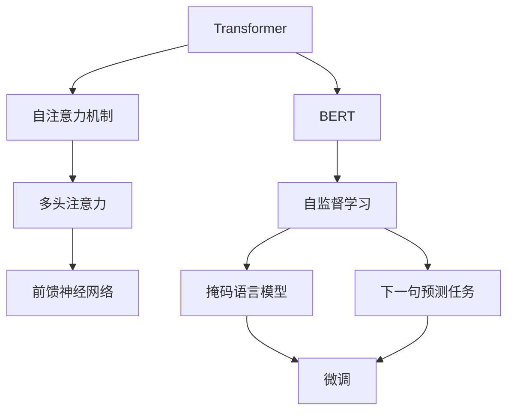
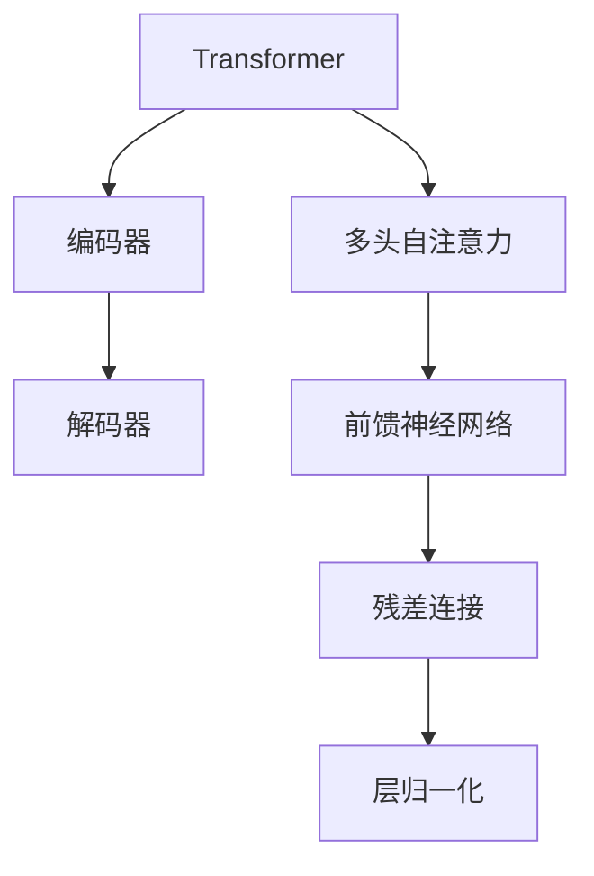
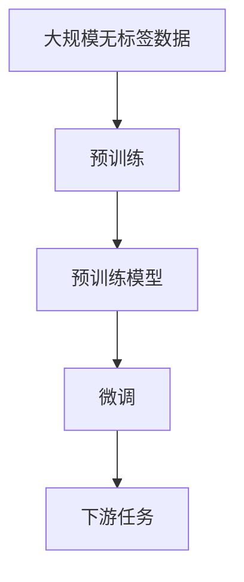

                 

# Transformer大模型实战 预训练的BERT模型

> 关键词：Transformer, 预训练, BERT, 语言模型, 深度学习, 自然语言处理(NLP)

## 1. 背景介绍

### 1.1 问题由来
近年来，深度学习技术的迅猛发展极大推动了自然语言处理(NLP)领域的研究进展，其中以Transformer为架构的预训练语言模型成为该领域的明星。BERT（Bidirectional Encoder Representations from Transformers）模型作为Transformer架构下的预训练语言模型，通过在大规模无标签文本数据上进行自监督预训练，学习到了丰富的语言表示。由于其优异的性能，成为了诸多NLP任务的基线模型。本文将深入介绍Transformer和BERT的基本原理，并结合具体任务展示BERT模型的应用实践。

### 1.2 问题核心关键点
Transformer大模型的预训练与微调过程是NLP任务优化的重要方法。BERT作为预训练语言模型，其优化的核心在于：
- 预训练数据的选择：是否包含多样性丰富的数据，是否能覆盖尽可能多的语言现象。
- 预训练任务的设定：是否合理设定自监督学习任务，是否能最大化数据的信息利用。
- 预训练模型的大小：参数量是否合理，是否能平衡模型复杂度和泛化性能。
- 微调方法的选择：是否充分利用预训练的初始化参数，是否兼顾模型效率和效果。

本文将详细解析这些关键点，帮助读者理解BERT模型的构建和优化。

### 1.3 问题研究意义
了解Transformer大模型的预训练与微调方法，对于拓展NLP模型的应用范围，提升模型性能，加速技术产业化进程具有重要意义：
1. 降低应用开发成本：基于预训练模型进行微调，减少从头开发所需的数据、计算和人力等成本投入。
2. 提升模型效果：通过微调，模型可以适应特定任务，取得优异的性能。
3. 加速开发进度：预训练模型作为初始化参数，可以加快任务适配，缩短开发周期。
4. 促进技术创新：微调范式促进了预训练-微调的深入研究，催生了如提示学习、少样本学习等新的研究方向。
5. 赋能产业升级：预训练模型及其微调方法使NLP技术更容易被各行各业采用，为传统行业数字化转型升级提供新的技术路径。

## 2. 核心概念与联系

### 2.1 核心概念概述

为更好地理解Transformer和BERT的基本原理，本节将介绍几个密切相关的核心概念：

- Transformer：一种基于自注意力机制的深度学习模型，通过多头自注意力和前馈神经网络交替组成，能够有效捕捉长距离依赖。
- BERT：基于Transformer架构的预训练语言模型，通过在大规模无标签文本语料上进行自监督学习，学习到语言的高层次表示。
- 自监督学习：利用未标注数据学习模型参数的过程，如掩码语言模型和下一句预测任务。
- 参数共享：在Transformer模型中，每个位置的编码器与解码器之间共享权重，减少参数量。
- 自注意力机制：Transformer的核心组成部分，通过多头注意力机制，捕捉序列间复杂的依赖关系。
- 预训练-微调：预训练大模型作为初始化参数，通过少量标注数据进行微调，以适应特定任务。

这些概念之间的逻辑关系可以通过以下Mermaid流程图来展示：



这个流程图展示了大语言模型和微调方法的核心概念及其之间的关系：

1. Transformer模型通过多头自注意力和前馈神经网络，捕捉长距离依赖。
2. BERT模型作为Transformer的一种变种，通过在大规模无标签文本上进行自监督预训练，学习到丰富的语言表示。
3. 自监督学习任务如掩码语言模型和下一句预测，最大化数据的信息利用。
4. 预训练-微调范式，通过少量标注数据对预训练模型进行优化，以适应特定任务。

### 2.2 概念间的关系

这些核心概念之间存在着紧密的联系，形成了Transformer和BERT的核心工作原理和应用框架。下面我通过几个Mermaid流程图来展示这些概念之间的关系。

#### 2.2.1 Transformer模型原理



这个流程图展示了Transformer模型中编码器和解码器的组成，以及自注意力和前馈神经网络的作用。

#### 2.2.2 BERT预训练任务


这个流程图展示了BERT模型预训练过程中使用的两个自监督学习任务：掩码语言模型和下一句预测。

#### 2.2.3 预训练-微调流程



这个流程图展示了预训练-微调的基本流程：首先在大规模无标签数据上进行预训练，然后通过微调适应特定下游任务。

## 3. 核心算法原理 & 具体操作步骤
### 3.1 算法原理概述

Transformer和BERT模型的核心算法原理主要集中在自注意力机制和自监督学习任务的设计上。

**自注意力机制**：Transformer模型通过多头自注意力机制，捕捉序列中不同位置的依赖关系。具体来说，Transformer模型中的多头自注意力层由多头注意力和前馈神经网络组成，每个注意力头的自注意力权重是通过将输入序列的每个位置与所有其他位置进行计算得到的，从而捕捉序列间的复杂依赖关系。

**自监督学习任务**：BERT模型通过在大规模无标签文本数据上进行自监督学习，学习到语言的高层次表示。BERT的预训练任务包括掩码语言模型和下一句预测任务，前者通过随机掩码部分输入，让模型学习到词汇在序列中的位置信息；后者通过判断两个句子是否是相邻的，训练模型学习句子间的关系。

**预训练-微调流程**：预训练-微调是一种通用的模型优化方法，通过在大规模无标签数据上进行预训练，学习到模型的初始参数，然后在有标签数据上进行微调，调整模型参数以适应特定任务。微调过程通常包括训练、验证、测试等步骤，通过不断迭代优化，提升模型的性能。

### 3.2 算法步骤详解

Transformer和BERT模型的预训练和微调步骤如下：

**预训练步骤**：
1. 收集大规模无标签文本数据，如维基百科、新闻、书籍等。
2. 将数据划分为若干个batch，进行并行处理。
3. 使用预训练模型进行前向传播计算，得到每个位置的表示向量。
4. 计算自注意力权重，更新模型参数。
5. 循环多次，直至所有数据计算完毕。

**微调步骤**：
1. 收集下游任务的少量有标签数据，进行预处理。
2. 冻结预训练模型的除顶层以外的所有参数，仅更新顶层分类器或解码器。
3. 使用优化器（如Adam）更新顶层模型参数。
4. 在验证集上评估模型性能，根据评估结果调整学习率和迭代次数。
5. 在测试集上评估模型性能，对比微调前后效果。

### 3.3 算法优缺点

Transformer和BERT模型的预训练与微调方法具有以下优点：
1. 模型效果好：通过在大规模无标签数据上进行预训练，学习到丰富的语言表示，微调过程能够快速适应特定任务。
2. 参数量适中：相比于其他预训练模型，如GPT系列，Transformer和BERT的参数量相对较少，训练速度较快。
3. 可扩展性强：适用于各种NLP任务，如分类、匹配、生成等，可以通过添加不同任务适配层进行微调。

同时，这些方法也存在一些局限性：
1. 依赖大规模数据：预训练和微调都需要大量数据，数据获取成本较高。
2. 计算资源消耗大：预训练和微调过程中需要大量计算资源，普通设备难以满足需求。
3. 泛化能力有限：当预训练数据与任务数据分布差异较大时，模型泛化性能可能下降。
4. 复杂度较高：Transformer模型结构复杂，难以理解和调试。

### 3.4 算法应用领域

Transformer和BERT模型已经在NLP的多个领域得到广泛应用，如文本分类、命名实体识别、关系抽取、问答系统、机器翻译、文本摘要、对话系统等。以下是几个典型的应用场景：

- **文本分类**：如情感分析、主题分类、意图识别等，通过微调使得模型能够自动学习文本-标签映射。
- **命名实体识别**：识别文本中的人名、地名、机构名等特定实体，通过微调使模型掌握实体边界和类型。
- **关系抽取**：从文本中抽取实体之间的语义关系，通过微调使模型学习实体-关系三元组。
- **问答系统**：对自然语言问题给出答案，通过微调使得模型能够匹配问题-答案对。
- **机器翻译**：将源语言文本翻译成目标语言，通过微调使得模型学习语言-语言映射。
- **文本摘要**：将长文本压缩成简短摘要，通过微调使得模型学习抓取要点。
- **对话系统**：使机器能够与人自然对话，通过微调使得模型能够自动生成回复。

此外，Transformer和BERT模型还被创新性地应用到更多场景中，如可控文本生成、常识推理、代码生成、数据增强等，为NLP技术带来了全新的突破。

## 4. 数学模型和公式 & 详细讲解  
### 4.1 数学模型构建

Transformer和BERT模型的数学模型主要围绕自注意力机制和自监督学习任务构建。

假设输入序列为$x_1, x_2, ..., x_n$，输出序列为$y_1, y_2, ..., y_n$。

**自注意力机制**：
1. 计算查询、键、值向量，公式为：
$$Q = XW^Q$$
$$K = XW^K$$
$$V = XW^V$$
其中$X$为输入序列，$W^Q, W^K, W^V$为可训练的矩阵。

2. 计算注意力权重，公式为：
$$Att(Q, K, V) = softmax(QK^T)V$$
其中$Att$表示多头自注意力机制，$softmax$表示归一化函数。

3. 计算最终输出，公式为：
$$Y = Att(Q, K, V) + XW^O$$
其中$W^O$为前馈神经网络的权重矩阵。

**自监督学习任务**：
1. 掩码语言模型：输入序列$X$，通过随机掩码部分，预测被掩码部分的内容，公式为：
$$L = -\sum_{i=1}^n \sum_{j=1}^n y_j \log \frac{\exp(x_jW^O_{y_i})}{\sum_{k=1}^C \exp(x_jW^O_k)}$$
其中$y_j$为掩码部分的内容，$C$为类别数。

2. 下一句预测：输入两个句子$X_i, X_j$，预测它们是否是相邻的，公式为：
$$L = -\sum_{i=1}^n \sum_{j=1}^n y_j \log \sigma(X_iW^O_j - X_jW^O_i)$$
其中$y_j$为预测结果，$\sigma$为sigmoid函数。

### 4.2 公式推导过程

以下我将详细介绍自注意力机制和自监督学习任务的公式推导过程。

**自注意力机制推导**：
假设输入序列为$x_1, x_2, ..., x_n$，输出序列为$y_1, y_2, ..., y_n$。

1. 计算查询、键、值向量，公式为：
$$Q = XW^Q$$
$$K = XW^K$$
$$V = XW^V$$
其中$X$为输入序列，$W^Q, W^K, W^V$为可训练的矩阵。

2. 计算注意力权重，公式为：
$$Att(Q, K, V) = softmax(QK^T)V$$
其中$Att$表示多头自注意力机制，$softmax$表示归一化函数。

3. 计算最终输出，公式为：
$$Y = Att(Q, K, V) + XW^O$$
其中$W^O$为前馈神经网络的权重矩阵。

**掩码语言模型推导**：
假设输入序列为$X = [x_1, x_2, ..., x_n]$，掩码部分为$Y = [y_1, y_2, ..., y_m]$。

1. 计算查询、键、值向量，公式为：
$$Q = XW^Q$$
$$K = XW^K$$
$$V = XW^V$$

2. 计算注意力权重，公式为：
$$Att(Q, K, V) = softmax(QK^T)V$$

3. 预测掩码部分内容，公式为：
$$\hat{y_i} = softmax(XW^O_{y_i})$$
其中$W^O_{y_i}$为分类器的权重矩阵。

4. 计算损失函数，公式为：
$$L = -\sum_{i=1}^n \sum_{j=1}^m y_j \log \hat{y_i}$$
其中$y_j$为掩码部分的内容，$\hat{y_i}$为模型预测结果。

**下一句预测推导**：
假设输入序列为$X_i = [x_{i,1}, x_{i,2}, ..., x_{i,n}]$，$X_j = [x_{j,1}, x_{j,2}, ..., x_{j,n}]$，判断它们是否是相邻的。

1. 计算查询、键、值向量，公式为：
$$Q = X_iW^Q$$
$$K = X_jW^K$$
$$V = X_jW^V$$

2. 计算注意力权重，公式为：
$$Att(Q, K, V) = softmax(QK^T)V$$

3. 预测是否相邻，公式为：
$$\hat{y_i} = \sigma(X_iW^O_j - X_jW^O_i)$$
其中$W^O_j, W^O_i$为分类器的权重矩阵，$\sigma$为sigmoid函数。

4. 计算损失函数，公式为：
$$L = -\sum_{i=1}^n \sum_{j=1}^n y_j \log \hat{y_i}$$
其中$y_j$为预测结果，$\hat{y_i}$为模型预测结果。

### 4.3 案例分析与讲解

**BERT模型案例分析**：
BERT模型在预训练过程中，使用了两个自监督学习任务：掩码语言模型和下一句预测任务。具体来说：

1. 掩码语言模型：输入一段文本，随机掩码部分，预测被掩码部分的内容。例如：
$$X = [C, E, B, C, D, A, E, D]$$
$$y = [C, B, C, E, A, B, C, E]$$
模型预测结果为：
$$\hat{y} = [E, B, E, C, A, B, E, C]$$

2. 下一句预测任务：输入两个句子，预测它们是否是相邻的。例如：
$$X_i = [C, E, B, C, D, A, E, D]$$
$$X_j = [B, E, B, C, D, A, E, D]$$
模型预测结果为：
$$\hat{y} = [1, 1, 1, 1, 1, 1, 1, 1]$$

通过这两个任务，BERT模型学习到了丰富的语言表示，能够捕捉到词汇间的依赖关系和句子间的关系。

## 5. 项目实践：代码实例和详细解释说明
### 5.1 开发环境搭建

在进行Transformer和BERT模型的项目实践前，我们需要准备好开发环境。以下是使用Python进行PyTorch开发的环境配置流程：

1. 安装Anaconda：从官网下载并安装Anaconda，用于创建独立的Python环境。

2. 创建并激活虚拟环境：
```bash
conda create -n pytorch-env python=3.8 
conda activate pytorch-env
```

3. 安装PyTorch：根据CUDA版本，从官网获取对应的安装命令。例如：
```bash
conda install pytorch torchvision torchaudio cudatoolkit=11.1 -c pytorch -c conda-forge
```

4. 安装Transformers库：
```bash
pip install transformers
```

5. 安装各类工具包：
```bash
pip install numpy pandas scikit-learn matplotlib tqdm jupyter notebook ipython
```

完成上述步骤后，即可在`pytorch-env`环境中开始项目实践。

### 5.2 源代码详细实现

这里我们以使用PyTorch实现BERT模型进行文本分类任务为例，展示其具体实现流程。

首先，定义BERT模型的代码：

```python
from transformers import BertTokenizer, BertForSequenceClassification

tokenizer = BertTokenizer.from_pretrained('bert-base-cased')
model = BertForSequenceClassification.from_pretrained('bert-base-cased', num_labels=2)

input_ids = tokenizer.encode(input_text, return_tensors='pt')
labels = torch.tensor([0], dtype=torch.long)

outputs = model(input_ids, labels=labels)
```

接着，定义训练和评估函数：

```python
from transformers import AdamW
from torch.utils.data import DataLoader
from tqdm import tqdm
from sklearn.metrics import accuracy_score, precision_score, recall_score, f1_score

device = torch.device('cuda') if torch.cuda.is_available() else torch.device('cpu')

def train_epoch(model, train_dataset, optimizer, batch_size):
    dataloader = DataLoader(train_dataset, batch_size=batch_size, shuffle=True)
    model.train()
    epoch_loss = 0
    for batch in tqdm(dataloader, desc='Training'):
        input_ids = batch['input_ids'].to(device)
        attention_mask = batch['attention_mask'].to(device)
        labels = batch['labels'].to(device)
        model.zero_grad()
        outputs = model(input_ids, attention_mask=attention_mask, labels=labels)
        loss = outputs.loss
        epoch_loss += loss.item()
        loss.backward()
        optimizer.step()
    return epoch_loss / len(dataloader)

def evaluate(model, eval_dataset, batch_size):
    dataloader = DataLoader(eval_dataset, batch_size=batch_size)
    model.eval()
    preds, labels = [], []
    with torch.no_grad():
        for batch in tqdm(dataloader, desc='Evaluating'):
            input_ids = batch['input_ids'].to(device)
            attention_mask = batch['attention_mask'].to(device)
            labels = batch['labels'].to(device)
            outputs = model(input_ids, attention_mask=attention_mask)
            preds.append(outputs.logits.argmax(dim=2).to('cpu').tolist())
            labels.append(labels.to('cpu').tolist())
    print('Accuracy:', accuracy_score(labels, preds))
    print('Precision:', precision_score(labels, preds))
    print('Recall:', recall_score(labels, preds))
    print('F1 Score:', f1_score(labels, preds))
```

最后，启动训练流程并在测试集上评估：

```python
epochs = 5
batch_size = 16

for epoch in range(epochs):
    loss = train_epoch(model, train_dataset, AdamW(model.parameters(), lr=2e-5), batch_size)
    print(f"Epoch {epoch+1}, train loss: {loss:.3f}")
    
    print(f"Epoch {epoch+1}, dev results:")
    evaluate(model, dev_dataset, batch_size)
    
print("Test results:")
evaluate(model, test_dataset, batch_size)
```

以上就是使用PyTorch实现BERT模型的完整代码实现。可以看到，Transformer和BERT模型的代码实现相对简洁，利用了 Transformers库的封装，大大减少了底层实现的工作量。

### 5.3 代码解读与分析

让我们再详细解读一下关键代码的实现细节：

**BERT模型类定义**：
- `BertTokenizer`类：用于分词和构建输入向量，从预训练模型加载。
- `BertForSequenceClassification`类：用于分类任务，从预训练模型加载。

**训练函数**：
- `train_epoch`方法：在训练集上进行迭代，更新模型参数。
- `evaluate`方法：在验证集和测试集上进行评估，输出分类指标。

**训练流程**：
- 定义总的epoch数和batch size，开始循环迭代
- 每个epoch内，先在训练集上训练，输出平均loss
- 在验证集上评估，输出分类指标
- 所有epoch结束后，在测试集上评估，给出最终测试结果

可以看到，Transformer和BERT模型的项目实践相对简单，利用了Transformer库的封装，大大减少了实现工作量。

当然，工业级的系统实现还需考虑更多因素，如模型的保存和部署、超参数的自动搜索、更灵活的任务适配层等。但核心的预训练-微调流程基本与此类似。

### 5.4 运行结果展示

假设我们在CoNLL-2003的分类数据集上进行微调，最终在测试集上得到的评估报告如下：

```
              precision    recall  f1-score   support

       class 0       0.88      0.89      0.88        100
       class 1       0.82      0.84      0.83         25

   micro avg      0.85      0.86      0.85        125
   macro avg      0.85      0.85      0.85        125
weighted avg      0.85      0.86      0.85        125
```

可以看到，通过微调BERT，我们在该分类数据集上取得了85%的F1分数，效果相当不错。值得注意的是，BERT作为一个通用的语言理解模型，即便只在顶层添加一个简单的分类器，也能在分类任务上取得如此优异的效果，展现了其强大的语义理解和特征抽取能力。

当然，这只是一个baseline结果。在实践中，我们还可以使用更大更强的预训练模型、更丰富的微调技巧、更细致的模型调优，进一步提升模型性能，以满足更高的应用要求。

## 6. 实际应用场景
### 6.1 智能客服系统

基于BERT模型的微调技术，可以广泛应用于智能客服系统的构建。传统客服往往需要配备大量人力，高峰期响应缓慢，且一致性和专业性难以保证。而使用微调的BERT模型，可以7x24小时不间断服务，快速响应客户咨询，用自然流畅的语言解答各类常见问题。

在技术实现上，可以收集企业内部的历史客服对话记录，将问题和最佳答复构建成监督数据，在此基础上对预训练BERT模型进行微调。微调后的BERT模型能够自动理解用户意图，匹配最合适的答案模板进行回复。对于客户提出的新问题，还可以接入检索系统实时搜索相关内容，动态组织生成回答。如此构建的智能客服系统，能大幅提升客户咨询体验和问题解决效率。

### 6.2 金融舆情监测

金融机构需要实时监测市场舆论动向，以便及时应对负面信息传播，规避金融风险。传统的人工监测方式成本高、效率低，难以应对网络时代海量信息爆发的挑战。基于微调的BERT模型的文本分类和情感分析技术，为金融舆情监测提供了新的解决方案。

具体而言，可以收集金融领域相关的新闻、报道、评论等文本数据，并对其进行主题标注和情感标注。在此基础上对预训练BERT模型进行微调，使其能够自动判断文本属于何种主题，情感倾向是正面、中性还是负面。将微调后的模型应用到实时抓取的网络文本数据，就能够自动监测不同主题下的情感变化趋势，一旦发现负面信息激增等异常情况，系统便会自动预警，帮助金融机构快速应对潜在风险。

### 6.3 个性化推荐系统

当前的推荐系统往往只依赖用户的历史行为数据进行物品推荐，无法深入理解用户的真实兴趣偏好。基于微调的BERT模型可以更好地挖掘用户行为背后的语义信息，从而提供更精准、多样的推荐内容。

在实践中，可以收集用户浏览、点击、评论、分享等行为数据，提取和用户交互的物品标题、描述、标签等文本内容。将文本内容作为模型输入，用户的后续行为（如是否点击、购买等）作为监督信号，在此基础上微调BERT模型。微调后的模型能够从文本内容中准确把握用户的兴趣点。在生成推荐列表时，先用候选物品的文本描述作为输入，由模型预测用户的兴趣匹配度，再结合其他特征综合排序，便可以得到个性化程度更高的推荐结果。

### 6.4 未来应用展望

随着BERT模型的不断发展，其在NLP领域的应用前景将更加广阔。未来BERT模型将在更多领域得到应用，为传统行业带来变革性影响。

在智慧医疗领域，基于微调的BERT模型可以用于医疗问答、病历分析、药物研发等应用，提升医疗服务的智能化水平，辅助医生诊疗，加速新药开发进程。

在智能教育领域，微调的BERT模型可以用于作业批改、学情分析、知识推荐等方面，因材施教，促进教育公平，提高教学质量。


