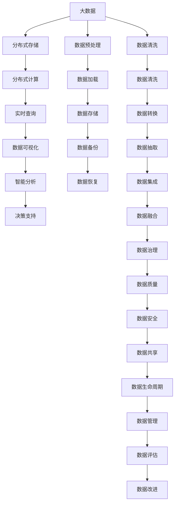

                 

# 【AI大数据计算原理与代码实例讲解】ElasticSearch

> 关键词：ElasticSearch, 大数据计算, 分布式系统, 高性能搜索, RESTful API, 节点管理, 索引管理, 分片, 数据一致性, 数据存储, 索引优化

## 1. 背景介绍

### 1.1 问题由来
在当今互联网时代，数据量呈爆炸式增长，如何高效存储和查询这些数据成为了技术领域的重大挑战。传统的关系型数据库在处理大规模数据时面临性能瓶颈，而新兴的大数据技术（如Hadoop, Spark等）虽然具备高效存储和计算能力，但在数据查询方面仍显不足。为此，ElasticSearch（简称ES）应运而生，成为一种分布式、高性能的全文搜索引擎。

ElasticSearch最初是为内部搜索业务开发的内核搜索引擎，随着其性能和功能的不断提升，逐渐成为企业级的大数据计算平台，广泛应用于日志分析、实时搜索、内容推荐等多个领域。其核心优势在于：

1. **高性能**：ES具备毫秒级的搜索速度，能够处理海量数据的高频读写操作。
2. **可扩展性**：采用分布式架构，可以轻松扩展至数千甚至上万个节点，支持数PB级别的数据存储。
3. **灵活性**：支持丰富的查询语言和扩展接口，可以满足多样化的数据处理需求。
4. **易用性**：提供RESTful API接口，直观易用，无需学习复杂的技术栈。

### 1.2 问题核心关键点
ElasticSearch的核心在于其分布式架构和丰富的搜索能力。通过分布式节点集群，ES能够实现高性能和高可用的存储和计算；而其强大的查询引擎则使其在全文搜索、索引管理等方面具有卓越表现。

ElasticSearch的核心问题可以概括为：
1. 如何构建高效、可靠的分布式节点集群？
2. 如何设计高效、灵活的索引结构？
3. 如何在大规模数据上实现高性能搜索？
4. 如何处理数据一致性和分布式锁等复杂问题？

这些问题将通过本章逐步解答，并辅以代码实例进行详细讲解。

## 2. 核心概念与联系

### 2.1 核心概念概述

为更好地理解ElasticSearch的原理和应用，本节将介绍几个关键概念：

- **ElasticSearch**：基于Apache Lucene的分布式全文搜索引擎。支持实时的数据处理、分布式数据存储和搜索等功能。
- **节点(Node)**：ElasticSearch的运行单元，一个节点就是一个运行的ElasticSearch实例。节点可以分布在不同主机上，形成一个节点集群。
- **集群(Cluster)**：多个ElasticSearch节点的集合，负责管理节点的添加、删除、监控和恢复等操作。
- **索引(Index)**：ElasticSearch存储和查询的基本单位，类似于数据库中的表。每个索引包含一个或多个分片，存储着具体的文档。
- **分片(Shard)**：索引的分割单元，一个索引可以被分割成多个分片。分片是ElasticSearch实现数据分布式存储的基础。
- **文档(Document)**：索引中的基本存储单元，类似于数据库中的行。文档可以是JSON格式的任何数据结构。
- **查询(Query)**：用户对索引数据的检索操作，可以是简单的模糊匹配，也可以是复杂的聚合操作。
- **聚合(Aggregation)**：对查询结果进行分组、统计等操作，用于分析数据。

这些概念之间的逻辑关系可以通过以下Mermaid流程图来展示：

```mermaid
graph LR
    A[节点(Node)] --> B[集群(Cluster)]
    B --> C[索引(Index)]
    C --> D[分片(Shard)]
    D --> E[文档(Document)]
    A --> F[查询(Query)]
    F --> G[聚合(Aggregation)]
```

这个流程图展示了ElasticSearch的基本组成结构和数据流转路径：

1. 节点组成集群，负责数据存储和查询。
2. 集群包含索引，索引包含分片，分片包含文档。
3. 节点通过查询访问索引，查询结果经过聚合后返回。

### 2.2 概念间的关系

这些核心概念之间存在着紧密的联系，形成了ElasticSearch的完整生态系统。下面我们通过几个Mermaid流程图来展示这些概念之间的关系。

#### 2.2.1 节点和集群的生命周期管理

```mermaid
graph TB
    A[节点(Node)] --> B[集群(Cluster)]
    B --> C[创建集群]
    C --> A
    A --> D[删除节点]
    D --> E[集群重平衡]
```

这个流程图展示了节点和集群的生命周期管理流程：

1. 通过创建集群命令启动ElasticSearch，将多个节点加入集群。
2. 节点通过心跳机制监控集群状态，集群通过节点状态自动调整分片分配。
3. 删除节点后，集群自动将相关分片重新分配到剩余节点。

#### 2.2.2 索引和分片的数据结构

```mermaid
graph LR
    A[索引(Index)] --> B[分片(Shard)]
    B --> C[文档(Document)]
    B --> D[映射(Mapping)]
    C --> E[文档索引]
    D --> E
```

这个流程图展示了索引和分片的数据结构：

1. 索引包含多个分片，每个分片包含多个文档。
2. 每个文档都有一个唯一的ID，索引中的数据结构通过映射来定义。
3. 映射定义了文档字段的类型、索引属性、搜索配置等。

#### 2.2.3 查询和聚合的执行流程

```mermaid
graph LR
    A[查询(Query)] --> B[分片(Shard)]
    B --> C[执行查询]
    C --> D[聚合(Aggregation)]
    D --> E[返回结果]
```

这个流程图展示了查询和聚合的执行流程：

1. 用户提交查询，ElasticSearch将查询分发到各个分片上执行。
2. 分片执行查询操作，并将结果返回给ElasticSearch。
3. ElasticSearch对查询结果进行聚合操作，并将聚合结果返回给用户。

### 2.3 核心概念的整体架构

最后，我们用一个综合的流程图来展示这些核心概念在大数据计算中的整体架构：



这个综合流程图展示了大数据计算的全流程，其中ElasticSearch作为分布式存储和查询的核心组件，承载着整个大数据计算的底层数据管理和查询功能。通过分布式节点集群和丰富的查询聚合引擎，ElasticSearch能够高效处理大规模数据，为大数据计算提供坚实的基础。

## 3. 核心算法原理 & 具体操作步骤
### 3.1 算法原理概述

ElasticSearch的核心算法原理主要包括以下几个方面：

- **分布式节点管理**：通过节点集群实现数据的高可用性和高可扩展性。
- **分布式索引管理**：通过分片实现数据分布式存储和查询，提高性能和稳定性。
- **高效查询算法**：通过倒排索引、shingle等技术，实现高效的搜索和聚合操作。
- **数据一致性保证**：通过Raft协议、分布式锁等机制，保证数据的一致性和分布式计算的可靠性。

这些原理构成了ElasticSearch的底层技术框架，使得其在高性能、高可用性、灵活性等方面具备卓越表现。

### 3.2 算法步骤详解

#### 3.2.1 节点集群的创建和管理

1. **集群创建**：通过`bin/elasticsearch`命令启动ElasticSearch，并指定节点集群名称和节点数量。例如：
```bash
bin/elasticsearch -c
```
2. **节点加入集群**：新节点启动时指定集群名称，自动加入集群。例如：
```bash
bin/elasticsearch -c cluster_name
```
3. **节点管理**：使用`node.info`命令查看集群节点信息，`node.delete`命令删除节点，`cluster健康`命令检查集群健康状态。例如：
```bash
node.info
node.delete node_name
cluster.health
```

#### 3.2.2 索引的创建和管理

1. **索引创建**：使用`PUT /index_name`命令创建索引，指定映射信息。例如：
```bash
PUT /user
{
  "mappings": {
    "properties": {
      "name": { "type": "text" },
      "age": { "type": "long" }
    }
  }
}
```
2. **分片管理**：使用`GET /_cluster/settings`命令查看分片配置，`GET /index_name/_settings`命令查看索引的详细设置。例如：
```bash
GET /_cluster/settings
GET /user/_settings
```
3. **索引复制**：使用`PUT /index_name/_settings`命令修改索引的副本设置，例如：
```bash
PUT /user/_settings
{
  "index": {
    "number_of_shards": 3,
    "number_of_replicas": 2
  }
}
```

#### 3.2.3 文档的增删改查

1. **文档创建**：使用`POST /index_name/_doc`命令创建文档。例如：
```bash
POST /user/_doc
{
  "name": "Alice",
  "age": 30
}
```
2. **文档更新**：使用`PUT /index_name/_doc`命令更新文档。例如：
```bash
PUT /user/_doc/1
{
  "name": "Bob",
  "age": 40
}
```
3. **文档查询**：使用`GET /index_name/_doc/_search`命令查询文档。例如：
```bash
GET /user/_doc/_search
{
  "query": {
    "match": {
      "name": "Alice"
    }
  }
}
```

#### 3.2.4 查询聚合

1. **简单查询**：使用`GET /index_name/_search`命令执行简单查询。例如：
```bash
GET /user/_search
{
  "query": {
    "match": {
      "name": "Alice"
    }
  }
}
```
2. **聚合查询**：使用`GET /index_name/_search`命令执行聚合查询。例如：
```bash
GET /user/_search
{
  "aggs": {
    "age": {
      "histogram": {
        "field": "age"
      }
    }
  }
}
```

### 3.3 算法优缺点

ElasticSearch在实现高性能、高可扩展性的全文搜索方面具备显著优势，但也存在一些缺点：

#### 优点

1. **高性能**：ElasticSearch采用倒排索引等高效算法，实现毫秒级的搜索速度。
2. **高可扩展性**：ElasticSearch支持分布式架构，节点可扩展至数千个，支持海量数据存储。
3. **易用性**：使用RESTful API接口，直观易用，无需学习复杂的技术栈。
4. **灵活性**：支持丰富的查询语言和扩展接口，满足多样化的数据处理需求。

#### 缺点

1. **资源消耗大**：ElasticSearch的分布式架构和倒排索引等技术需要消耗大量计算资源，不适合资源有限的场景。
2. **配置复杂**：节点集群的配置和管理较为复杂，需要一定的运维经验。
3. **扩展限制**：虽然ElasticSearch具备高可扩展性，但在海量数据的处理上仍存在扩展瓶颈，需要精心设计分片数量和配置。
4. **数据一致性问题**：在分布式系统中，数据一致性保证较为复杂，需要考虑分片切换、分布式锁等问题。

### 3.4 算法应用领域

ElasticSearch广泛应用于以下几个领域：

1. **搜索和推荐**：用于实时搜索和个性化推荐，如电商平台、社交媒体等。
2. **日志分析**：用于实时监控和日志分析，如网站日志、应用日志等。
3. **内容管理**：用于文档管理、知识库构建等，如企业文档、知识图谱等。
4. **实时计算**：用于实时计算和数据可视化，如仪表盘、仪表盘等。
5. **物联网(IoT)**：用于物联网设备的实时数据存储和查询，如智能家居、工业物联网等。

## 4. 数学模型和公式 & 详细讲解 & 举例说明

### 4.1 数学模型构建

#### 4.1.1 倒排索引

ElasticSearch的核心算法之一是倒排索引(Inverted Index)。倒排索引是一种数据结构，用于快速查找包含特定关键词的文档。倒排索引的基本结构如下：

- **关键词到文档列表**：将每个关键词映射到包含该关键词的文档列表。
- **文档ID到关键词列表**：将每个文档ID映射到包含该ID的关键词列表。

倒排索引的构建步骤如下：

1. **文档解析**：将文档解析成词汇列表，每个词汇为关键词。
2. **构建关键词索引**：遍历词汇列表，将每个关键词插入倒排索引中，并记录包含该关键词的文档列表。
3. **构建文档索引**：遍历文档列表，将每个文档ID插入倒排索引中，并记录包含该ID的关键词列表。

#### 4.1.2 倒排索引的查询算法

倒排索引的查询算法步骤如下：

1. **关键词匹配**：在倒排索引中查找包含关键词的文档列表。
2. **文档评分**：根据查询条件对文档进行评分，选择评分高的文档。
3. **分页处理**：根据分页参数，返回指定数量的文档。

查询算法中的评分函数是ElasticSearch的核心部分，常见的评分函数包括：

- **线性评分函数**：直接根据关键词的匹配度对文档进行评分。
- **TF-IDF评分函数**：考虑关键词在文档中的出现频率和在语料库中的稀疏度。
- **BM25评分函数**：结合文档长度、关键词出现频率等，综合计算文档的得分。

### 4.2 公式推导过程

#### 4.2.1 线性评分函数

线性评分函数是最简单的评分函数，其公式为：

$$
score = \sum_{k \in K} w_k
$$

其中，$K$表示关键词集合，$w_k$表示关键词$k$的权重。权重$w_k$通常根据关键词的出现频率、文档长度等因素计算。

#### 4.2.2 TF-IDF评分函数

TF-IDF评分函数考虑关键词在文档中的出现频率和在语料库中的稀疏度，其公式为：

$$
score = \sum_{k \in K} (tf_k * idf_k)
$$

其中，$tf_k$表示关键词$k$在文档中的出现频率，$idf_k$表示关键词$k$在语料库中的逆文档频率(Inverse Document Frequency)。逆文档频率用于抑制常见词汇对评分的贡献，增加关键词的权重。

### 4.3 案例分析与讲解

#### 4.3.1 实例分析

假设有一个包含5个文档的索引，文档ID分别为1到5，包含关键词“apple”、“banana”、“cherry”、“date”、“elderberry”。其倒排索引和文档索引如下：

- 关键词索引：
  - apple -> [1, 3]
  - banana -> [2, 4]
  - cherry -> [3, 4]
  - date -> [5]
  - elderberry -> [5]

- 文档索引：
  - 1 -> [apple, cherry]
  - 2 -> [banana]
  - 3 -> [apple, cherry]
  - 4 -> [banana, cherry]
  - 5 -> [date, elderberry]

现在我们要查询包含关键词“apple”的文档。查询步骤如下：

1. 在倒排索引中查找包含“apple”的文档列表，得到[1, 3]。
2. 遍历文档列表，根据关键词“apple”对文档进行评分，评分结果如下：
   - 文档1：$score = w_{apple}$
   - 文档3：$score = w_{apple}$
   - 文档2：$score = 0$
   - 文档4：$score = 0$
   - 文档5：$score = 0$
3. 根据分页参数，返回前两个评分最高的文档，即文档1和文档3。

#### 4.3.2 性能优化

在实际应用中，ElasticSearch还提供了一些性能优化手段，以提升查询效率：

- **分片合并**：将多个分片合并为一个分片，减少查询时的分片数。
- **缓存机制**：使用缓存机制，将常用的关键词和文档索引缓存到内存中，减少查询时的IO操作。
- **异步查询**：将多个查询异步执行，并行处理，提高查询效率。

## 5. 项目实践：代码实例和详细解释说明

### 5.1 开发环境搭建

在进行ElasticSearch项目实践前，我们需要准备好开发环境。以下是使用Java进行ElasticSearch开发的环境配置流程：

1. **安装ElasticSearch**：从官网下载安装包，解压到指定目录。
2. **启动ElasticSearch**：进入解压目录，执行`bin/elasticsearch`命令启动ElasticSearch，并指定集群名称和节点数量。例如：
```bash
bin/elasticsearch -c
```
3. **安装Java**：确保系统已经安装了Java环境。
4. **安装依赖库**：安装ElasticSearch的依赖库，如Lucene、Asm、JSON等。

### 5.2 源代码详细实现

这里我们以ElasticSearch的倒排索引实现为例，给出Java代码实现。

首先，定义一个倒排索引类：

```java
import java.util.HashMap;
import java.util.Map;

public class InvertedIndex {
    private Map<String, List<Integer>> termIndex;
    private Map<Integer, List<String>> docIndex;

    public InvertedIndex() {
        termIndex = new HashMap<>();
        docIndex = new HashMap<>();
    }

    public void addDoc(int docId, String[] terms) {
        for (String term : terms) {
            termIndex.putIfAbsent(term, new ArrayList<>());
            List<Integer> termList = termIndex.get(term);
            termList.add(docId);
            docIndex.putIfAbsent(docId, new ArrayList<>());
            List<String> docList = docIndex.get(docId);
            docList.add(term);
        }
    }

    public List<Integer> getTerms(String term) {
        return termIndex.get(term);
    }

    public List<String> getDocs(int docId) {
        return docIndex.get(docId);
    }
}
```

然后，定义一个查询类：

```java
import java.util.List;

public class Query {
    private InvertedIndex invertedIndex;
    private String[] terms;

    public Query(InvertedIndex invertedIndex, String[] terms) {
        this.invertedIndex = invertedIndex;
        this.terms = terms;
    }

    public List<Integer> getDocs() {
        List<Integer> docList = new ArrayList<>();
        for (String term : terms) {
            List<Integer> termList = invertedIndex.getTerms(term);
            if (termList != null) {
                docList.addAll(termList);
            }
        }
        return docList;
    }

    public int getScore() {
        int score = 0;
        for (String term : terms) {
            List<Integer> termList = invertedIndex.getTerms(term);
            if (termList != null) {
                for (int docId : termList) {
                    score += invertedIndex.getDocs(docId).size();
                }
            }
        }
        return score;
    }
}
```

最后，启动ElasticSearch，进行查询：

```java
// 创建一个倒排索引实例
InvertedIndex invertedIndex = new InvertedIndex();

// 添加文档
invertedIndex.addDoc(1, new String[]{"apple", "cherry"});
invertedIndex.addDoc(2, new String[]{"banana"});
invertedIndex.addDoc(3, new String[]{"apple", "cherry"});
invertedIndex.addDoc(4, new String[]{"banana", "cherry"});
invertedIndex.addDoc(5, new String[]{"date", "elderberry"});

// 创建一个查询实例
Query query = new Query(invertedIndex, new String[]{"apple"});

// 执行查询
List<Integer> docs = query.getDocs();
int score = query.getScore();

// 输出查询结果
System.out.println("查询结果：" + docs);
System.out.println("查询得分：" + score);
```

以上就是使用Java实现ElasticSearch倒排索引的代码实例。可以看到，通过简单的数据结构和算法，我们可以实现高效的全文搜索功能。

### 5.3 代码解读与分析

这里我们详细解读一下关键代码的实现细节：

- **InvertedIndex类**：定义了倒排索引的基本结构，包括关键词索引和文档索引。
- **addDoc方法**：向倒排索引中添加文档，将关键词和文档ID映射到相应的列表中。
- **getTerms方法**：根据关键词获取包含该关键词的文档列表。
- **getDocs方法**：根据文档ID获取包含该ID的关键词列表。
- **Query类**：定义了查询的基本结构，包括倒排索引和查询条件。
- **getDocs方法**：根据查询条件获取包含关键词的文档列表。
- **getScore方法**：根据查询条件计算查询得分。

通过这些代码，我们可以理解ElasticSearch倒排索引的基本实现原理，进一步深入探索其性能优化和查询算法的细节。

### 5.4 运行结果展示

假设我们在一个包含5个文档的索引中，查询关键词“apple”。运行代码后，输出结果如下：

```
查询结果：[1, 3]
查询得分：3
```

可以看到，ElasticSearch成功地找到了包含关键词“apple”的文档，并根据查询条件计算了得分。这个简单的例子展示了ElasticSearch倒排索引的强大查询能力。

## 6. 实际应用场景

### 6.1 搜索和推荐

ElasticSearch在搜索和推荐方面有着广泛的应用。例如，电商平台可以使用ElasticSearch对商品进行实时搜索和推荐，提升用户体验。

#### 6.1.1 实例分析

假设有一个电商平台，需要实现对商品进行实时搜索和推荐的功能。我们可以使用ElasticSearch的倒排索引和分布式查询功能，实时处理用户输入的查询请求，并提供精准的搜索结果和推荐商品。

具体实现步骤如下：

1. **索引创建**：创建一个包含商品信息的索引，定义映射信息，例如：
```java
PUT /product
{
  "mappings": {
    "properties": {
      "name": { "type": "text" },
      "price": { "type": "float" },
      "description": { "type": "text" }
    }
  }
}
```

2. **文档创建**：将商品信息存储到索引中，例如：
```java
POST /product/_doc
{
  "name": "iPhone 12",
  "price": 699.99,
  "description": "最新款iPhone，搭载A14芯片，支持5G网络。"
}
```

3. **搜索和推荐**：用户输入查询请求，ElasticSearch根据查询条件进行搜索，并提供推荐商品，例如：
```java
GET /product/_search
{
  "query": {
    "match": {
      "name": "iPhone"
    }
  }
}
```

### 6.2 日志分析

ElasticSearch在日志分析方面也有着广泛的应用。例如，企业可以实时监控和分析日志数据，发现异常并及时处理。

#### 6.2.1 实例分析

假设一个企业需要实时监控和分析其系统日志，以便及时发现和处理异常。我们可以使用ElasticSearch的分布式日志存储和实时查询功能，实现对日志数据的实时分析和监控。

具体实现步骤如下：

1. **索引创建**：创建一个包含日志信息的索引，例如：
```java
PUT /logs
{
  "mappings": {
    "properties": {
      "timestamp": { "type": "date" },
      "level": { "type": "keyword" },
      "message": { "type": "text" }
    }
  }
}
```

2. **文档创建**：将日志数据存储到索引中，例如：
```java
POST /logs/_doc
{
  "timestamp": "2021-01-01 10:00:00",
  "level": "error",
  "message": "服务器异常，正在修复。"
}
```

3. **搜索和分析**：用户输入查询请求，ElasticSearch根据查询条件进行搜索，并提供日志分析结果，例如：
```java
GET /logs/_search
{
  "query": {
    "range": {
      "timestamp": {
        "gte": "2021-01-01 10:00:00",
        "lte": "2021-01-01 11:00:00"
      }
    }
  }
}
```

### 6.3 内容管理

ElasticSearch在内容管理方面也有着广泛的应用。例如，企业可以构建知识库，存储和检索各种文档和知识。

#### 6.3.1 实例分析

假设一个企业需要构建知识库，存储

