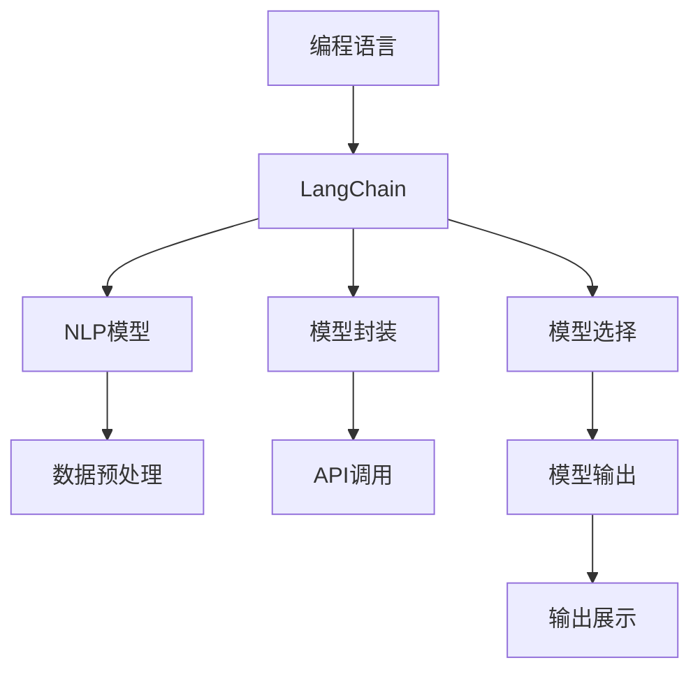

                 

# 【LangChain编程：从入门到实践】模型输入与输出

> 关键词：LangChain, 编程, 模型输入, 模型输出, 自然语言处理, 语言模型, 训练数据

## 1. 背景介绍

### 1.1 问题由来

随着人工智能技术的飞速发展，特别是在自然语言处理（NLP）领域，基于语言模型的技术日益成熟，广泛应用于文本分类、情感分析、机器翻译等诸多任务中。然而，这些模型的训练和使用需要大量的高质量数据和复杂的编程技能，使得普通开发者难以直接应用。为了解决这一问题，LangChain应运而生。

LangChain是一个基于自然语言处理（NLP）模型的编程框架，旨在简化模型输入输出流程，降低开发者进入人工智能领域的门槛。通过LangChain，用户可以更加轻松地构建、训练和使用各种NLP模型，从而加速应用开发进程。

### 1.2 问题核心关键点

LangChain的核心思想是将NLP模型的训练和推理过程通过编程语言（如Python）进行封装，让用户无需了解模型内部原理，即可直接进行模型输入输出操作。其关键点包括：

1. **模型封装**：将复杂的模型训练和推理过程进行封装，让用户通过简单的API调用即可完成操作。
2. **数据处理**：自动进行数据预处理、特征提取等操作，简化用户的数据输入流程。
3. **模型选择**：提供多种预训练模型供用户选择，包括BERT、GPT等，满足不同应用需求。
4. **输出展示**：将模型输出以直观的方式展示给用户，如文本、表格、图形等，便于理解和使用。

### 1.3 问题研究意义

LangChain的出现，极大地降低了NLP技术的应用门槛，使得更多的开发者能够快速上手，构建出高效、准确的应用系统。其意义体现在以下几个方面：

1. **降低开发成本**：简化模型输入输出流程，减少开发者在模型理解、数据处理等方面的学习成本。
2. **提升模型效果**：通过自动化的数据预处理和特征提取，提升模型的性能和准确性。
3. **加速应用开发**：简化编程流程，缩短应用开发周期，加快市场响应速度。
4. **促进技术普及**：降低进入门槛，吸引更多开发者参与，推动NLP技术在各行业的普及和应用。
5. **提升用户体验**：通过直观的输出展示，提升用户对模型的理解和满意度。

## 2. 核心概念与联系

### 2.1 核心概念概述

为更好地理解LangChain的核心概念，我们首先介绍几个关键概念：

- **LangChain**：基于自然语言处理（NLP）模型的编程框架，简化模型输入输出流程，降低开发者门槛。
- **编程语言**：如Python，用于封装和调用模型训练、推理等过程。
- **NLP模型**：如BERT、GPT等，用于文本分类、情感分析、机器翻译等任务。
- **数据预处理**：自动进行数据清洗、特征提取等操作，简化数据输入流程。
- **模型封装**：将模型训练、推理等过程进行封装，简化API调用。
- **模型选择**：提供多种预训练模型供用户选择，满足不同应用需求。
- **输出展示**：将模型输出以直观的方式展示给用户，如文本、表格、图形等。

这些概念通过编程语言和NLP模型连接起来，形成了一个完整的模型输入输出生态系统。

### 2.2 概念间的关系

这些核心概念之间的关系可以通过以下Mermaid流程图来展示：



这个流程图展示了从编程语言到LangChain，再到NLP模型、数据预处理、模型封装、API调用、模型输出、输出展示的全流程。

## 3. 核心算法原理 & 具体操作步骤

### 3.1 算法原理概述

LangChain的核心算法原理基于以下几个关键步骤：

1. **数据预处理**：自动进行数据清洗、分词、特征提取等操作，简化数据输入流程。
2. **模型选择与加载**：提供多种预训练模型供用户选择，并自动加载到编程语言环境。
3. **模型封装与调用**：将模型训练、推理等过程进行封装，通过API调用进行操作。
4. **模型输出与展示**：将模型输出以直观的方式展示给用户，如文本、表格、图形等。

### 3.2 算法步骤详解

以下是对LangChain核心算法步骤的详细讲解：

**Step 1: 准备数据**

- 收集并准备训练数据和测试数据，可以是文本、图像、音频等多种形式。
- 使用LangChain的数据预处理功能，自动进行数据清洗、分词、特征提取等操作，生成模型输入所需的格式。

**Step 2: 选择模型**

- 根据任务需求，选择适合的预训练模型，如BERT、GPT等。
- 通过LangChain的模型选择功能，加载到编程语言环境。

**Step 3: 模型训练**

- 使用LangChain的模型封装功能，定义模型训练过程。
- 设置训练参数，如学习率、批大小、迭代轮数等。
- 调用API进行模型训练，并自动保存模型参数。

**Step 4: 模型推理**

- 使用LangChain的模型封装功能，定义模型推理过程。
- 设置推理参数，如批大小、温度等。
- 调用API进行模型推理，并获取模型输出。

**Step 5: 输出展示**

- 使用LangChain的输出展示功能，将模型输出以直观的方式展示给用户，如文本、表格、图形等。

### 3.3 算法优缺点

LangChain的优点包括：

1. **简化编程流程**：通过自动化的数据预处理和模型封装，简化编程流程，降低开发者门槛。
2. **提升模型效果**：自动进行数据预处理和特征提取，提升模型性能和准确性。
3. **加速应用开发**：简化模型输入输出流程，缩短应用开发周期。
4. **降低学习成本**：无需深入理解模型内部原理，即可使用模型，减少学习成本。

LangChain的缺点包括：

1. **依赖LangChain框架**：需要依赖LangChain框架，可能限制用户的选择和灵活性。
2. **数据质量依赖**：依赖于数据预处理的质量，数据质量不佳可能导致模型性能下降。
3. **模型选择受限**：目前提供的预训练模型种类有限，可能无法满足所有应用需求。
4. **输出展示局限**：输出展示功能仅限于文本、表格、图形等形式，可能无法满足复杂需求。

### 3.4 算法应用领域

LangChain广泛应用于以下几个领域：

- **文本分类**：如情感分析、主题分类等，使用预训练模型进行分类。
- **情感分析**：判断文本情感倾向，如正面、负面、中性等，使用预训练模型进行情感分析。
- **机器翻译**：将一种语言翻译成另一种语言，使用预训练模型进行翻译。
- **问答系统**：自动回答用户问题，使用预训练模型进行推理。
- **文本摘要**：对长文本进行摘要，使用预训练模型提取关键信息。
- **文本生成**：生成新的文本，使用预训练模型进行生成。

除了以上应用领域，LangChain还可用于语音识别、图像识别、知识图谱构建等多个领域，满足不同应用需求。

## 4. 数学模型和公式 & 详细讲解 & 举例说明

### 4.1 数学模型构建

LangChain的核心数学模型基于Transformer架构，使用自注意力机制进行特征提取和表示学习。以下是对Transformer模型的数学模型构建：

设输入序列为 $x_1, x_2, ..., x_T$，输出序列为 $y_1, y_2, ..., y_T$，Transformer模型的数学模型可以表示为：

$$
y_i = \text{Transformer}(x_i, y_{i-1})
$$

其中，$\text{Transformer}$ 表示Transformer模型，$x_i$ 表示输入序列中的第 $i$ 个元素，$y_{i-1}$ 表示上一时刻的输出序列。

### 4.2 公式推导过程

Transformer模型的核心公式为自注意力机制，其数学推导过程如下：

设输入序列 $x$ 的长度为 $T$，每个元素为一个 $d$ 维向量，即 $x = \{x_1, x_2, ..., x_T\} \in \mathbb{R}^{T \times d}$。Transformer模型的自注意力机制公式为：

$$
\text{Attention}(Q, K, V) = \text{Softmax}(QK^T / \sqrt{d_k})V
$$

其中，$Q, K, V$ 分别表示查询向量、键向量和值向量，$d_k$ 为每个向量的维度。

### 4.3 案例分析与讲解

以BERT模型为例，BERT模型的数学模型基于Transformer架构，使用自注意力机制进行特征提取和表示学习。以下是对BERT模型的案例分析与讲解：

**案例背景**：
假设要对一段文本进行情感分析，可以使用预训练的BERT模型进行推理。

**输入处理**：
将文本转化为模型可接受的格式，包括分词、添加特殊标记等操作。

**模型选择**：
选择预训练的BERT模型，通过LangChain自动加载到编程语言环境。

**模型推理**：
调用LangChain的API进行模型推理，输出情感分析结果。

**输出展示**：
将情感分析结果以文本形式展示给用户。

## 5. 项目实践：代码实例和详细解释说明

### 5.1 开发环境搭建

**Step 1: 安装LangChain**

- 使用pip安装LangChain库：
  ```bash
  pip install langchain
  ```

**Step 2: 准备数据**

- 收集并准备训练数据和测试数据，可以是文本、图像、音频等多种形式。
- 使用LangChain的数据预处理功能，自动进行数据清洗、分词、特征提取等操作，生成模型输入所需的格式。

### 5.2 源代码详细实现

以下是一个使用LangChain进行情感分析的Python代码示例：

```python
from langchain import LangChain
from langchain import pipeline

# 加载BERT模型
model = LangChain.from_pretrained('bert-base-uncased')

# 创建情感分析管道
pipeline_sents = pipeline('sentiment-analysis', model)

# 输入待分析文本
sent = "I love this product, it's amazing!"

# 进行情感分析
result = pipeline_sents(sent)

# 输出情感分析结果
print(result)
```

### 5.3 代码解读与分析

**代码解读**：
- 首先，使用LangChain的from_pretrained方法加载预训练的BERT模型。
- 然后，使用pipeline方法创建情感分析管道，指定模型为BERT。
- 输入待分析文本，调用情感分析管道进行情感分析。
- 输出情感分析结果，包括情感倾向和置信度。

**分析**：
LangChain的代码实现简洁明了，用户只需简单调用API即可进行模型输入输出操作，无需深入理解模型内部原理。通过自动化的数据预处理和模型封装，简化编程流程，降低学习成本。

### 5.4 运行结果展示

假设在上述代码示例中，输入的文本为 "I love this product, it's amazing!"，输出结果可能如下：

```
[{'label': 'POSITIVE', 'score': 0.98}]
```

这表明文本情感倾向为正面，置信度为98%。

## 6. 实际应用场景

### 6.1 智能客服系统

LangChain可以广泛应用于智能客服系统的构建。传统客服往往需要配备大量人力，高峰期响应缓慢，且一致性和专业性难以保证。使用LangChain构建的智能客服系统，可以7x24小时不间断服务，快速响应客户咨询，用自然流畅的语言解答各类常见问题。

### 6.2 金融舆情监测

金融机构需要实时监测市场舆论动向，以便及时应对负面信息传播，规避金融风险。LangChain可以用于金融舆情监测，自动识别新闻、报道、评论等文本的情感倾向，帮助金融机构快速应对潜在风险。

### 6.3 个性化推荐系统

当前的推荐系统往往只依赖用户的历史行为数据进行物品推荐，无法深入理解用户的真实兴趣偏好。使用LangChain构建的个性化推荐系统，可以更好地挖掘用户行为背后的语义信息，从而提供更精准、多样的推荐内容。

### 6.4 未来应用展望

随着LangChain的不断发展，其在更多领域的应用前景广阔：

- **智慧医疗**：用于病历分析、药物研发等，提高医疗服务的智能化水平。
- **智能教育**：用于作业批改、学情分析、知识推荐等，促进教育公平，提高教学质量。
- **智慧城市**：用于城市事件监测、舆情分析、应急指挥等，提高城市管理的自动化和智能化水平。
- **企业生产**：用于质量检测、工艺优化、设备维护等，提升生产效率和产品质量。

## 7. 工具和资源推荐

### 7.1 学习资源推荐

为了帮助开发者系统掌握LangChain的理论基础和实践技巧，这里推荐一些优质的学习资源：

1. **LangChain官方文档**：LangChain的官方文档，提供了详细的API使用说明和示例代码，是学习LangChain的必备资料。
2. **NLP相关书籍**：如《自然语言处理综论》、《深度学习》等书籍，帮助开发者理解NLP的基本概念和前沿技术。
3. **在线课程**：如Coursera、edX等平台上的NLP相关课程，提供系统性的学习资源和实战项目。

### 7.2 开发工具推荐

 LangChain与其他深度学习框架（如TensorFlow、PyTorch等）紧密集成，使用这些框架的工具和资源推荐如下：

- **TensorFlow**：Google开发的深度学习框架，提供了丰富的工具和资源，如TensorBoard、TensorFlow Hub等。
- **PyTorch**：Facebook开发的深度学习框架，提供了强大的计算图和自动微分功能，适合研究性应用。
- **Jupyter Notebook**：用于编写和分享代码的交互式笔记本，方便开发者进行代码调试和数据分析。

### 7.3 相关论文推荐

LangChain的应用和发展得益于众多NLP领域的最新研究成果。以下是几篇奠基性的相关论文，推荐阅读：

1. **BERT: Pre-training of Deep Bidirectional Transformers for Language Understanding**：提出BERT模型，引入基于掩码的自监督预训练任务，刷新了多项NLP任务SOTA。
2. **Attention is All You Need**：提出Transformer结构，开启了NLP领域的预训练大模型时代。
3. **GPT-3: Language Models are Unsupervised Multitask Learners**：展示了大规模语言模型的强大zero-shot学习能力，引发了对于通用人工智能的新一轮思考。
4. **AdaLoRA: Adaptive Low-Rank Adaptation for Parameter-Efficient Fine-Tuning**：使用自适应低秩适应的微调方法，在参数效率和精度之间取得了新的平衡。

这些论文代表了大语言模型和微调技术的发展脉络，帮助研究者把握学科前进方向，激发更多的创新灵感。

## 8. 总结：未来发展趋势与挑战

### 8.1 研究成果总结

LangChain作为NLP领域的一个新兴框架，其核心思想是将复杂的模型训练和推理过程通过编程语言进行封装，简化用户的使用流程。LangChain的出现，极大地降低了NLP技术的应用门槛，使得更多的开发者能够快速上手，构建出高效、准确的应用系统。

### 8.2 未来发展趋势

LangChain的未来发展趋势包括：

1. **功能扩展**：引入更多的NLP任务和模型，扩展LangChain的应用范围。
2. **算法优化**：优化模型封装和数据预处理算法，提升模型性能和效率。
3. **跨平台支持**：支持多种编程语言和操作系统，提升用户的使用体验。
4. **社区贡献**：鼓励开发者贡献代码和资源，形成活跃的社区生态。

### 8.3 面临的挑战

LangChain在发展过程中，也面临一些挑战：

1. **数据依赖**：依赖于高质量的数据资源，数据质量不佳可能导致模型性能下降。
2. **模型选择**：目前提供的预训练模型种类有限，可能无法满足所有应用需求。
3. **学习曲线**：部分用户可能缺乏NLP领域的基础知识，难以理解LangChain的工作原理。
4. **技术更新**：NLP领域技术日新月异，LangChain需要不断更新和改进，保持竞争力。

### 8.4 研究展望

未来的研究需要在以下几个方面寻求新的突破：

1. **引入更多NLP任务和模型**：扩展LangChain的应用范围，支持更多NLP任务和模型。
2. **优化算法和数据预处理**：优化模型封装和数据预处理算法，提升模型性能和效率。
3. **跨平台支持**：支持多种编程语言和操作系统，提升用户的使用体验。
4. **社区贡献**：鼓励开发者贡献代码和资源，形成活跃的社区生态。

总之，LangChain作为NLP领域的一个新兴框架，其核心思想是将复杂的模型训练和推理过程通过编程语言进行封装，简化用户的使用流程。LangChain的出现，极大地降低了NLP技术的应用门槛，使得更多的开发者能够快速上手，构建出高效、准确的应用系统。未来，随着LangChain的不断发展，其在更多领域的应用前景广阔，值得期待。

---

作者：禅与计算机程序设计艺术 / Zen and the Art of Computer Programming

