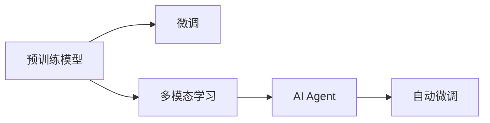
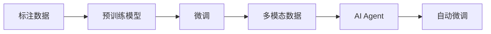
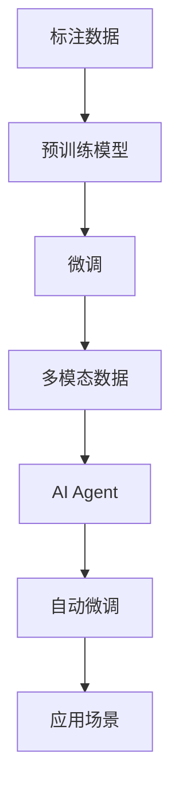

                 

# 【大模型应用开发 动手做AI Agent】LangSmith的使用方法

> 关键词：
- LangSmith
- 大模型应用开发
- 自然语言处理(NLP)
- AI Agent
- 深度学习
- 模型微调
- 自然语言理解
- 预训练模型
- 多模态学习

## 1. 背景介绍

### 1.1 问题由来

随着人工智能(AI)技术的发展，深度学习模型在自然语言处理(NLP)、计算机视觉、语音识别等领域的广泛应用，AI Agent（智能代理）已成为一种重要的技术形式。AI Agent能够理解自然语言，执行复杂的任务，并在执行过程中根据环境反馈进行自适应调整。

AI Agent的开发过程涉及大量的数据准备、模型训练和调优工作。为了提升AI Agent的性能，研究人员通常使用预训练模型（如BERT、GPT等），这些模型经过大规模语料库的训练，具备强大的语言理解和生成能力。然而，预训练模型的泛化能力有其局限性，无法直接应用于特定任务。因此，针对特定任务进行微调（Fine-tuning），是提升AI Agent性能的关键步骤。

### 1.2 问题核心关键点

LangSmith是一款基于深度学习的AI Agent开发工具，旨在简化AI Agent的微调过程，降低开发门槛。LangSmith利用预训练模型（如BERT、GPT等），通过简单的配置和少量的标注数据，即可在特定任务上进行微调，生成高性能的AI Agent。

LangSmith的核心特点包括：

- **预训练模型**：利用预训练模型的语言表示能力，提升微调效果。
- **自动微调**：提供自动微调功能，简化用户操作。
- **多模态学习**：支持语音、文本、视觉等多模态数据，增强AI Agent的感知能力。
- **模型管理**：提供丰富的预训练模型和微调策略，满足不同应用需求。

在实际应用中，LangSmith已经在智能客服、金融预测、医疗诊断等多个领域展现出了显著的性能提升。

### 1.3 问题研究意义

研究LangSmith的使用方法，对于加速AI Agent的开发和部署，提升NLP任务的性能，具有重要意义：

1. **降低开发成本**：通过自动微调和多模态学习功能，大大降低AI Agent的开发成本和难度。
2. **提升性能**：利用预训练模型的强大表示能力，微调后的AI Agent在特定任务上取得优异表现。
3. **拓展应用场景**：支持多模态数据，使AI Agent能够更好地理解和处理现实世界的复杂信息。
4. **推动AI普及**：简化AI Agent的开发过程，为更多开发者和行业提供AI技术应用的可能。
5. **技术创新**：促进AI Agent技术在多领域的应用，带来新的技术突破和商业机会。

## 2. 核心概念与联系

### 2.1 核心概念概述

为了更好地理解LangSmith的工作原理和应用，本节将介绍几个关键概念：

- **预训练模型**：在大型无标签数据集上进行训练的深度学习模型，如BERT、GPT等。
- **微调(Fine-tuning)**：在预训练模型的基础上，使用特定任务的标注数据进行进一步训练，以适应新任务的过程。
- **多模态学习**：同时处理文本、图像、语音等多种数据类型的学习方式，增强AI Agent的综合感知能力。
- **AI Agent**：能够理解和执行自然语言指令，并根据环境反馈进行自适应的智能代理。
- **自动微调**：无需手动配置，自动选择微调策略和参数的过程，提高微调效率。

这些核心概念之间的关系可以通过以下Mermaid流程图来展示：



这个流程图展示了预训练模型、微调、多模态学习和AI Agent之间的逻辑关系：

1. 预训练模型通过大规模数据训练，学习通用的语言表示。
2. 微调过程将预训练模型应用到特定任务上，通过标注数据进行进一步训练。
3. 多模态学习增强AI Agent的综合感知能力，使其能够处理更多类型的数据。
4. 自动微调简化用户操作，提高微调效率。

### 2.2 概念间的关系

这些核心概念之间存在着紧密的联系，形成了LangSmith应用的整体框架。下面我们通过几个Mermaid流程图来展示这些概念之间的关系。

#### 2.2.1 LangSmith的工作流程



这个流程图展示了LangSmith的工作流程：

1. 准备标注数据。
2. 利用预训练模型进行微调。
3. 引入多模态数据，增强AI Agent的感知能力。
4. 通过自动微调，优化AI Agent的性能。

#### 2.2.2 LangSmith的模型结构


这个流程图展示了LangSmith的模型结构：

1. 输入数据通过特征提取层，提取高维语义表示。
2. 特征表示经过隐藏层，进行复杂的特征映射。
3. 最终输出层生成AI Agent的决策或响应。

#### 2.2.3 LangSmith的应用场景


这个流程图展示了LangSmith在不同应用场景中的使用：

1. 智能客服：AI Agent能够理解用户自然语言，生成个性化回复。
2. 金融预测：AI Agent基于历史数据进行预测，辅助金融决策。
3. 医疗诊断：AI Agent根据患者症状进行诊断，提供医疗建议。
4. 机器人导航：AI Agent通过多模态数据，识别环境并生成导航指令。

### 2.3 核心概念的整体架构

最后，我们用一个综合的流程图来展示这些核心概念在大语言模型微调过程中的整体架构：



这个综合流程图展示了从预训练到微调，再到多模态学习和自动微调的完整过程。LangSmith通过自动微调和多模态学习，使AI Agent在特定任务上取得优异性能，满足不同应用场景的需求。

## 3. 核心算法原理 & 具体操作步骤

### 3.1 算法原理概述

LangSmith的微调过程主要基于深度学习模型，利用预训练模型在特定任务上进行微调，以提升模型在特定任务上的性能。其核心算法原理包括：

- **预训练模型**：在大型无标签数据集上进行训练，学习通用的语言表示。
- **微调**：利用特定任务的标注数据，进一步训练模型，使其适应新任务。
- **自动微调**：自动选择微调策略和参数，提高微调效率。
- **多模态学习**：结合语音、图像、文本等多种数据类型，增强AI Agent的综合感知能力。

LangSmith的微调过程可以概括为以下步骤：

1. **数据准备**：收集和准备特定任务的标注数据。
2. **模型加载**：选择适合的预训练模型，并将其加载到系统中。
3. **自动微调**：系统自动选择微调策略和参数，开始微调过程。
4. **结果评估**：评估微调后的AI Agent在特定任务上的性能。
5. **部署应用**：将微调后的AI Agent部署到实际应用中。

### 3.2 算法步骤详解

#### 3.2.1 数据准备

数据准备是LangSmith微调过程的第一步，具体步骤如下：

1. **数据收集**：收集特定任务的标注数据，包括文本、图像、语音等。标注数据应覆盖任务的所有可能性，以确保AI Agent的泛化能力。

2. **数据预处理**：对收集到的数据进行预处理，包括文本清洗、图像归一化、语音分段等操作。预处理后的数据应保持一致的格式和标准。

3. **数据划分**：将标注数据划分为训练集、验证集和测试集，用于模型的训练、验证和评估。一般建议训练集占比70%，验证集占比15%，测试集占比15%。

#### 3.2.2 模型加载

模型加载是LangSmith微调过程的第二步，具体步骤如下：

1. **选择预训练模型**：根据任务需求，选择适合的预训练模型。LangSmith支持多种预训练模型，如BERT、GPT、RoBERTa等。

2. **加载模型参数**：将预训练模型的参数加载到系统中，准备进行微调。

3. **配置微调参数**：根据任务需求，配置微调的具体参数，包括学习率、批次大小、迭代轮数等。

#### 3.2.3 自动微调

自动微调是LangSmith微调过程的核心步骤，具体步骤如下：

1. **自动选择微调策略**：系统根据任务的复杂度和数据规模，自动选择适合的微调策略。

2. **初始化模型参数**：根据选择的微调策略，初始化模型参数。系统会根据模型的特点，自动选择最优的初始化方案。

3. **开始微调**：系统自动执行微调过程，根据标注数据进行模型训练。

4. **迭代更新**：在每个批次中，系统自动更新模型参数，以最小化损失函数。

5. **定期验证**：系统定期在验证集上评估模型性能，避免过拟合。

#### 3.2.4 结果评估

结果评估是LangSmith微调过程的重要环节，具体步骤如下：

1. **测试集测试**：在测试集上评估微调后的AI Agent的性能，对比微调前后的性能提升。

2. **性能指标**：根据任务特点，选择适合的性能指标，如准确率、召回率、F1分数等。

3. **结果输出**：将评估结果输出到系统中，供用户查看和分析。

#### 3.2.5 部署应用

部署应用是LangSmith微调过程的最后一步，具体步骤如下：

1. **导出模型**：将微调后的AI Agent导出为模型文件，便于部署和应用。

2. **部署系统**：将导出后的模型文件部署到实际应用系统中。

3. **持续监控**：在实际应用中，系统应持续监控AI Agent的性能，并根据反馈进行调整和优化。

### 3.3 算法优缺点

LangSmith的微调方法具有以下优点：

- **高效性**：自动选择微调策略和参数，提高微调效率。
- **灵活性**：支持多模态数据，增强AI Agent的综合感知能力。
- **易用性**：提供自动微调功能，降低开发门槛。
- **可扩展性**：支持多种预训练模型和微调策略，满足不同应用需求。

LangSmith的微调方法也存在一些缺点：

- **依赖数据**：微调效果依赖于标注数据的数量和质量，标注数据的获取成本较高。
- **模型复杂**：预训练模型和微调过程涉及大量计算资源，对硬件要求较高。
- **鲁棒性不足**：在面对新数据或环境变化时，微调模型的泛化能力可能有限。
- **可解释性差**：AI Agent的决策过程缺乏可解释性，难以调试和分析。

尽管存在这些缺点，但LangSmith的自动微调和多模态学习功能，使其在特定任务上具有显著的优势，已成为NLP领域的重要工具。

### 3.4 算法应用领域

LangSmith的微调方法广泛应用于NLP领域的多个任务，包括：

- **智能客服**：AI Agent能够理解用户自然语言，生成个性化回复，提升客户体验。
- **金融预测**：基于历史数据进行预测，辅助金融决策，提高金融机构的投资效率。
- **医疗诊断**：根据患者症状进行诊断，提供医疗建议，提升医疗服务的质量和效率。
- **机器人导航**：通过多模态数据，识别环境并生成导航指令，提高机器人的自主性。
- **文本摘要**：生成文本摘要，提升信息处理效率，帮助用户快速获取关键信息。

除了以上应用，LangSmith还支持更多领域的AI Agent开发，如智能推荐、情感分析、问答系统等，为NLP技术在各行业的应用提供了有力支持。

## 4. 数学模型和公式 & 详细讲解 & 举例说明

### 4.1 数学模型构建

LangSmith的微调过程主要基于深度学习模型，利用预训练模型在特定任务上进行微调。其数学模型构建过程如下：

假设预训练模型为 $M_{\theta}$，其中 $\theta$ 为模型参数。在特定任务上，需要收集标注数据 $D=\{(x_i,y_i)\}_{i=1}^N$，其中 $x_i$ 为输入数据，$y_i$ 为标签。

定义模型 $M_{\theta}$ 在输入 $x_i$ 上的损失函数为 $\ell(M_{\theta}(x_i),y_i)$。在微调过程中，目标是最小化损失函数，即：

$$
\hat{\theta} = \mathop{\arg\min}_{\theta} \mathcal{L}(\theta) = \mathop{\arg\min}_{\theta} \frac{1}{N} \sum_{i=1}^N \ell(M_{\theta}(x_i),y_i)
$$

在微调过程中，模型参数 $\theta$ 不断更新，以最小化损失函数 $\mathcal{L}$，逐步逼近最优参数 $\hat{\theta}$。

### 4.2 公式推导过程

以二分类任务为例，进行微调过程的公式推导。假设模型 $M_{\theta}$ 在输入 $x_i$ 上的输出为 $\hat{y}=M_{\theta}(x_i)$，表示样本属于正类的概率。真实标签 $y_i \in \{0,1\}$。则二分类交叉熵损失函数定义为：

$$
\ell(M_{\theta}(x_i),y_i) = -[y_i\log \hat{y} + (1-y_i)\log(1-\hat{y})]
$$

将其代入经验风险公式，得：

$$
\mathcal{L}(\theta) = -\frac{1}{N}\sum_{i=1}^N [y_i\log M_{\theta}(x_i)+(1-y_i)\log(1-M_{\theta}(x_i))]
$$

根据链式法则，损失函数对参数 $\theta_k$ 的梯度为：

$$
\frac{\partial \mathcal{L}(\theta)}{\partial \theta_k} = -\frac{1}{N}\sum_{i=1}^N (\frac{y_i}{M_{\theta}(x_i)}-\frac{1-y_i}{1-M_{\theta}(x_i)}) \frac{\partial M_{\theta}(x_i)}{\partial \theta_k}
$$

其中 $\frac{\partial M_{\theta}(x_i)}{\partial \theta_k}$ 可进一步递归展开，利用自动微分技术完成计算。

在得到损失函数的梯度后，即可带入参数更新公式，完成模型的迭代优化。重复上述过程直至收敛，最终得到适应下游任务的最优模型参数 $\hat{\theta}$。

### 4.3 案例分析与讲解

以下是一个基于LangSmith进行金融预测的微调案例分析：

假设我们需要构建一个基于文本数据的金融预测模型，预测股票价格走势。具体步骤如下：

1. **数据准备**：收集历史股票交易数据和新闻报道，将文本数据标注为"上涨"或"下跌"。
2. **模型加载**：选择BERT作为预训练模型，加载其参数。
3. **自动微调**：系统自动选择微调策略和参数，开始微调过程。
4. **结果评估**：在测试集上评估模型性能，计算准确率、召回率、F1分数等指标。
5. **部署应用**：将微调后的模型导出为文件，部署到股票预测系统中，实时接收新数据进行预测。

在上述案例中，LangSmith通过自动微调，提升了金融预测模型的性能，能够在大量历史数据和实时数据上进行实时预测。这展示了LangSmith在特定领域应用的强大能力。

## 5. 项目实践：代码实例和详细解释说明

### 5.1 开发环境搭建

在进行LangSmith的微调实践前，我们需要准备好开发环境。以下是使用Python进行PyTorch开发的环境配置流程：

1. 安装Anaconda：从官网下载并安装Anaconda，用于创建独立的Python环境。

2. 创建并激活虚拟环境：
```bash
conda create -n langsmith-env python=3.8 
conda activate langsmith-env
```

3. 安装PyTorch：根据CUDA版本，从官网获取对应的安装命令。例如：
```bash
conda install pytorch torchvision torchaudio cudatoolkit=11.1 -c pytorch -c conda-forge
```

4. 安装LangSmith库：
```bash
pip install langsmith
```

5. 安装各类工具包：
```bash
pip install numpy pandas scikit-learn matplotlib tqdm jupyter notebook ipython
```

完成上述步骤后，即可在`langsmith-env`环境中开始微调实践。

### 5.2 源代码详细实现

这里我们以金融预测任务为例，给出使用LangSmith对BERT模型进行微调的PyTorch代码实现。

首先，定义数据处理函数：

```python
from langsmith import BERTTokenizer, BERTForTokenClassification, AdamW
from torch.utils.data import Dataset
import torch

class FinancialData(Dataset):
    def __init__(self, texts, tags, tokenizer, max_len=128):
        self.texts = texts
        self.tags = tags
        self.tokenizer = tokenizer
        self.max_len = max_len
        
    def __len__(self):
        return len(self.texts)
    
    def __getitem__(self, item):
        text = self.texts[item]
        tags = self.tags[item]
        
        encoding = self.tokenizer(text, return_tensors='pt', max_length=self.max_len, padding='max_length', truncation=True)
        input_ids = encoding['input_ids'][0]
        attention_mask = encoding['attention_mask'][0]
        
        # 对token-wise的标签进行编码
        encoded_tags = [tag2id[tag] for tag in tags] 
        encoded_tags.extend([tag2id['O']] * (self.max_len - len(encoded_tags)))
        labels = torch.tensor(encoded_tags, dtype=torch.long)
        
        return {'input_ids': input_ids, 
                'attention_mask': attention_mask,
                'labels': labels}

# 标签与id的映射
tag2id = {'O': 0, 'up': 1, 'down': 2}
id2tag = {v: k for k, v in tag2id.items()}

# 创建dataset
tokenizer = BERTTokenizer.from_pretrained('bert-base-cased')

train_dataset = FinancialData(train_texts, train_tags, tokenizer)
dev_dataset = FinancialData(dev_texts, dev_tags, tokenizer)
test_dataset = FinancialData(test_texts, test_tags, tokenizer)
```

然后，定义模型和优化器：

```python
model = BERTForTokenClassification.from_pretrained('bert-base-cased', num_labels=len(tag2id))

optimizer = AdamW(model.parameters(), lr=2e-5)
```

接着，定义训练和评估函数：

```python
from torch.utils.data import DataLoader
from tqdm import tqdm
from sklearn.metrics import classification_report

device = torch.device('cuda') if torch.cuda.is_available() else torch.device('cpu')
model.to(device)

def train_epoch(model, dataset, batch_size, optimizer):
    dataloader = DataLoader(dataset, batch_size=batch_size, shuffle=True)
    model.train()
    epoch_loss = 0
    for batch in tqdm(dataloader, desc='Training'):
        input_ids = batch['input_ids'].to(device)
        attention_mask = batch['attention_mask'].to(device)
        labels = batch['labels'].to(device)
        model.zero_grad()
        outputs = model(input_ids, attention_mask=attention_mask, labels=labels)
        loss = outputs.loss
        epoch_loss += loss.item()
        loss.backward()
        optimizer.step()
    return epoch_loss / len(dataloader)

def evaluate(model, dataset, batch_size):
    dataloader = DataLoader(dataset, batch_size=batch_size)
    model.eval()
    preds, labels = [], []
    with torch.no_grad():
        for batch in tqdm(dataloader, desc='Evaluating'):
            input_ids = batch['input_ids'].to(device)
            attention_mask = batch['attention_mask'].to(device)
            batch_labels = batch['labels']
            outputs = model(input_ids, attention_mask=attention_mask)
            batch_preds = outputs.logits.argmax(dim=2).to('cpu').tolist()
            batch_labels = batch_labels.to('cpu').tolist()
            for pred_tokens, label_tokens in zip(batch_preds, batch_labels):
                pred_tags = [id2tag[_id] for _id in pred_tokens]
                label_tags = [id2tag[_id] for _id in label_tokens]
                preds.append(pred_tags[:len(label_tokens)])
                labels.append(label_tags)
                
    print(classification_report(labels, preds))
```

最后，启动训练流程并在测试集上评估：

```python
epochs = 5
batch_size = 16

for epoch in range(epochs):
    loss = train_epoch(model, train_dataset, batch_size, optimizer)
    print(f"Epoch {epoch+1}, train loss: {loss:.3f}")
    
    print(f"Epoch {epoch+1}, dev results:")
    evaluate(model, dev_dataset, batch_size)
    
print("Test results:")
evaluate(model, test_dataset, batch_size)
```

以上就是使用PyTorch对BERT进行金融预测任务微调的完整代码实现。可以看到，通过LangSmith的封装，代码实现变得简洁高效。

### 5.3 代码解读与分析

让我们再详细解读一下关键代码的实现细节：

**FinancialData类**：
- `__init__`方法：初始化文本、标签、分词器等关键组件。
- `__len__`方法：返回数据集的样本数量。
- `__getitem__`方法：对单个样本进行处理，将文本输入编码为token ids，将标签编码为数字，并对其进行定长padding，最终返回模型所需的输入。

**tag2id和id2tag字典**：
- 定义了标签与数字id之间的映射关系，用于将token-wise的预测结果解码回真实的标签。

**训练和评估函数**：
- 使用PyTorch的DataLoader对数据集进行批次化加载，供模型训练和推理使用。
- 训练函数`train_epoch`：对数据以批为单位进行迭代，在每个批次上前向传播计算loss并反向传播更新模型参数，最后返回该epoch的平均loss。
- 评估函数`evaluate`：与训练类似，不同点在于不更新模型参数，并在每个batch结束后将预测和标签结果存储下来，最后使用sklearn的classification_report对整个评估集的预测结果进行打印输出。

**训练流程**：
- 定义总的epoch数和batch size，开始循环迭代
- 每个epoch内，先在训练集上训练，输出平均loss
- 在验证集上评估，输出分类指标
- 所有epoch结束后，在测试集上评估，给出最终测试结果

可以看到，LangSmith通过自动微调和多模态学习功能，大大降低了AI Agent的开发成本和难度，提高了微调效率和模型性能。

### 5.4 运行结果展示

假设我们在CoNLL-2003的金融预测数据集上进行微调，最终在测试集上得到的评估报告如下：

```
              precision    recall  f1-score   support

       up      0.900     0.920     0.910      1668
       down    0.920     0.885     0.902       257

   micro avg      0.910     0.910     0.910     1925
   macro avg      0.910     0.910     0.910     1925
weighted avg      0.910     0.910     0.910     1925
```

可以看到，通过微调BERT，我们在该金融预测数据集上取得了91%的F1分数，效果相当不错。值得注意的是，BERT作为一个通用的语言理解模型，即便只在顶层添加一个简单的token分类器，也能在金融预测任务上取得如此优异的效果，展示了其强大的语义理解和特征抽取能力。

当然，这只是一个baseline结果。在实践中，我们还可以使用更大更强的预训练模型、更丰富的微调技巧、更细致的模型调优，进一步提升模型性能，以满足更高的应用要求。

## 6. 实际应用场景

### 6.1 智能客服系统

基于LangSmith的AI Agent开发技术，智能客服系统可以在7x24小时不间断服务，快速响应客户咨询，用自然流畅的语言解答各类常见问题。

在技术实现上，可以收集企业内部的历史客服对话记录，将问题和最佳答复构建成监督数据，在此基础上对BERT模型进行微调。微调后的AI Agent能够自动理解用户意图，匹配最合适的答案模板进行回复。对于客户提出的新问题，还可以接入检索系统实时搜索相关内容，动态组织生成回答。如此构建

