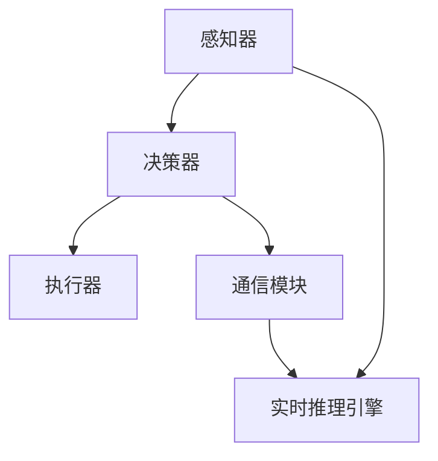
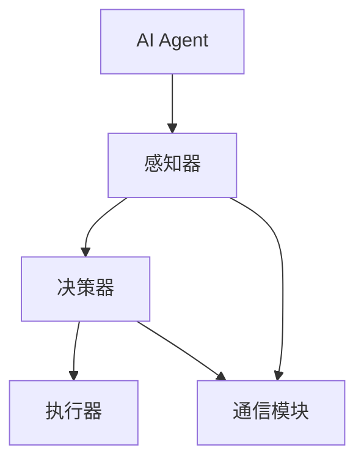
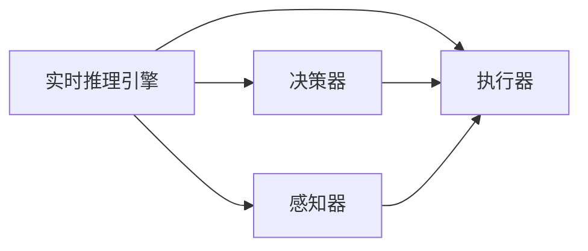
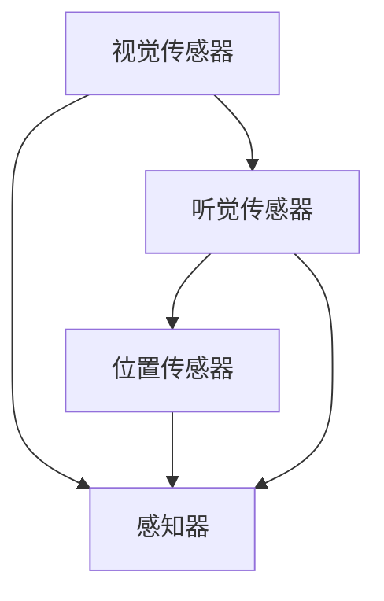
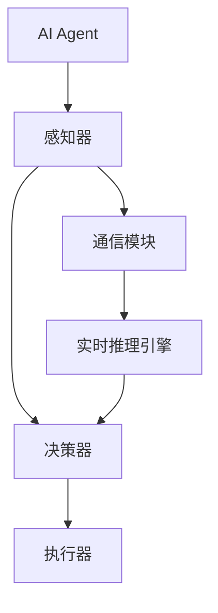

                 

# 【大模型应用开发 动手做AI Agent】复习ReAct框架

> 关键词：大模型应用, 多智能体, ReAct框架, AI Agent, 强化学习, 深度学习

## 1. 背景介绍

随着人工智能技术的不断成熟，多智能体系统(Multi-Agent Systems,MAS)在自动驾驶、社交网络、机器人协作等领域展现出广阔的应用前景。多智能体系统通过模拟多个智能体间的交互作用，实现复杂的协同任务。AI Agent作为多智能体系统的核心组件，承担着感知环境、决策推理、执行动作等关键功能，是系统性能的决定性因素。

### 1.1 问题由来
在实际应用中，构建高效、稳定、可解释的AI Agent，需要整合众多前沿技术，包括强化学习、深度学习、多模态融合等。然而，现有的多智能体框架和AI Agent实现往往过于复杂，缺乏直观易用的组件。这不仅限制了AI Agent的开发效率，也阻碍了其在实际场景中的落地应用。

为解决这一问题，ReAct框架应运而生。ReAct是一个用于构建多智能体系统的高效、轻量级AI Agent框架，旨在简化AI Agent的开发和部署过程，降低技术门槛。ReAct框架基于Python语言，采用组件化设计，支持多种AI Agent模型和算法，能够在实时环境中进行高效推理。

### 1.2 问题核心关键点
ReAct框架的关键点在于：
- **高效组件化设计**：框架以模块化的方式实现AI Agent的各种功能组件，如感知器、决策器、执行器等，便于灵活组合和复用。
- **实时推理引擎**：支持多智能体系统中的并行推理和通信，实现高实时性的决策和动作执行。
- **易用性**：框架提供高度抽象的API接口，简化AI Agent的开发过程，降低技术门槛。
- **多模态融合**：支持多种传感器数据和模态信息的融合处理，实现更加全面、准确的环境感知。
- **可扩展性**：框架设计灵活，支持扩展多种AI Agent模型和算法，适用于不同类型的智能体交互任务。

### 1.3 问题研究意义
ReAct框架的引入，对于促进多智能体系统的智能化开发和应用，具有重要意义：
1. **提高开发效率**：简化AI Agent的开发流程，缩短开发周期。
2. **提升系统性能**：通过高效组件化和实时推理引擎，提升AI Agent在多智能体环境中的决策和执行效率。
3. **降低技术门槛**：通过高度抽象的API接口，降低技术复杂度，促进AI Agent技术的普及和应用。
4. **支持多模态融合**：增强AI Agent对复杂环境的多维度感知能力，提升系统适应性和鲁棒性。
5. **可扩展性强**：支持多种AI Agent模型和算法，适应不同类型的多智能体交互任务。

## 2. 核心概念与联系

### 2.1 核心概念概述

ReAct框架中涉及的核心概念包括：

- **AI Agent**：多智能体系统中的核心组件，负责环境感知、决策推理和动作执行。
- **感知器**：用于收集和处理传感器数据，如视觉、听觉、位置等。
- **决策器**：基于感知信息，进行目标选择和路径规划等决策任务。
- **执行器**：将决策转化为具体动作，实现与环境互动。
- **通信模块**：用于多智能体间的信息交换和协调。
- **实时推理引擎**：支持多智能体系统中的并行推理和通信，实现高实时性的决策和动作执行。

这些概念之间的逻辑关系可以通过以下Mermaid流程图来展示：



这个流程图展示了这个系统中各个组件的相互关系：感知器接收传感器数据，经过实时推理引擎处理后，输入到决策器进行决策；决策器输出动作指令，通过执行器执行，同时通过通信模块与其他智能体进行信息交换和协调。

### 2.2 概念间的关系

这些核心概念之间存在着紧密的联系，形成了ReAct框架的完整生态系统。下面我通过几个Mermaid流程图来展示这些概念之间的关系。

#### 2.2.1 AI Agent的功能组件



这个流程图展示了一个AI Agent的功能组件结构：感知器、决策器、执行器和通信模块，共同构成了一个完整的AI Agent。

#### 2.2.2 实时推理引擎和多智能体通信



这个流程图展示了实时推理引擎在多智能体系统中的作用：实时推理引擎接收感知器的数据，经过决策器的计算后，输出到执行器进行动作执行；同时，决策器与通信模块进行信息交换，实现多智能体间的协同工作。

#### 2.2.3 多模态融合的感知器



这个流程图展示了一个多模态融合的感知器：视觉传感器、听觉传感器和位置传感器，通过感知器进行融合处理，生成更全面、准确的环境感知信息。

### 2.3 核心概念的整体架构

最后，我们用一个综合的流程图来展示这些核心概念在ReAct框架中的整体架构：



这个综合流程图展示了从感知器到决策器，再到执行器和通信模块的完整流程，以及实时推理引擎在其中扮演的角色。通过这些流程图，我们可以更清晰地理解ReAct框架中各个组件的相互关系和作用，为后续深入讨论具体的AI Agent模型和算法奠定基础。

## 3. 核心算法原理 & 具体操作步骤
### 3.1 算法原理概述

ReAct框架中的AI Agent，主要基于强化学习算法进行构建和训练。强化学习算法通过与环境的交互，不断调整策略，使AI Agent在特定任务中最大化累积奖励。AI Agent的学习过程分为两个阶段：感知和决策。

在感知阶段，AI Agent通过感知器收集环境信息，如视觉图像、声音信号、位置坐标等。在决策阶段，AI Agent通过决策器进行动作选择和路径规划，最终通过执行器执行动作，实现与环境的互动。

### 3.2 算法步骤详解

#### 3.2.1 感知阶段
感知阶段的核心任务是收集和处理传感器数据，生成环境状态表示。具体步骤包括：
1. 使用视觉传感器获取环境图像，如摄像头、激光雷达等。
2. 通过图像处理技术，如图像分割、特征提取等，将图像转化为向量形式。
3. 将处理后的图像数据输入到感知器，进行特征提取和融合处理。

#### 3.2.2 决策阶段
决策阶段的核心任务是根据感知信息，进行目标选择和路径规划。具体步骤包括：
1. 将感知器的输出送入决策器，进行动作选择。
2. 使用强化学习算法，如Q-learning、深度Q网络(DQN)等，更新决策器的参数，优化动作选择策略。
3. 通过执行器将决策结果转化为具体的动作，如电机控制、通信消息发送等。

#### 3.2.3 通信模块
通信模块用于多智能体间的信息交换和协调。具体步骤包括：
1. 在决策阶段，将AI Agent的决策信息编码为通信消息。
2. 使用通信协议，如TCP/IP、ROS等，发送消息到其他智能体。
3. 接收其他智能体的回复消息，更新AI Agent的感知和决策信息。

### 3.3 算法优缺点
ReAct框架中的AI Agent，基于强化学习算法进行构建和训练，具有以下优点：
1. **适应性强**：强化学习算法能够适应复杂、动态的环境变化，提升AI Agent的鲁棒性和适应性。
2. **可解释性高**：通过模型训练和参数调整，可以深入理解AI Agent的决策过程，提升系统的可解释性。
3. **通用性高**：AI Agent能够处理多种传感器数据和环境信息，适用于不同类型的智能体交互任务。

同时，强化学习算法也存在以下缺点：
1. **训练时间长**：强化学习算法需要大量时间和数据进行训练，初期效果可能不佳。
2. **易受噪声影响**：环境中的噪声和干扰可能影响AI Agent的决策和执行，需要额外的噪声鲁棒性处理。
3. **优化困难**：强化学习算法需要高效的优化方法，避免陷入局部最优解，需要进行多次实验和调参。

### 3.4 算法应用领域

ReAct框架中的AI Agent，已经在自动驾驶、社交网络、机器人协作等多个领域得到应用，取得了显著的效果。具体应用包括：

#### 3.4.1 自动驾驶
在自动驾驶领域，AI Agent通过实时感知和决策，实现车辆的自主导航和避障。感知器通过摄像头、激光雷达等传感器获取环境信息，决策器基于感知信息进行路径规划和避障决策，执行器通过车辆控制模块进行动作执行，通信模块用于与其他车辆和交通设施的协同工作。

#### 3.4.2 社交网络
在社交网络领域，AI Agent通过感知用户行为和环境信息，实现智能推荐和社交互动。感知器通过社交媒体、通信设备等传感器获取用户行为数据，决策器基于社交规则和用户偏好进行推荐决策，执行器通过社交平台发送消息和互动，通信模块用于与其他用户和社交平台的协同工作。

#### 3.4.3 机器人协作
在机器人协作领域，AI Agent通过感知和决策，实现多机器人的协同工作和任务分配。感知器通过视觉、听觉、位置等传感器获取环境信息，决策器基于任务分配策略和环境信息进行动作选择，执行器通过机器人关节控制模块进行动作执行，通信模块用于多个机器人之间的信息交换和协同工作。

此外，ReAct框架中的AI Agent还适用于工业自动化、智能家居、医疗健康等多个领域，具有广泛的应用前景。

## 4. 数学模型和公式 & 详细讲解  
### 4.1 数学模型构建

ReAct框架中的AI Agent，主要基于强化学习算法进行构建和训练。在数学上，强化学习算法可以表示为：
$$
\max_{\pi} \sum_{t=0}^{\infty} \gamma^t r(s_t, a_t)
$$
其中 $\pi$ 表示策略函数，$s_t$ 表示环境状态，$a_t$ 表示动作，$r(s_t, a_t)$ 表示状态-动作的奖励函数，$\gamma$ 表示折扣因子。

在具体应用中，AI Agent的学习过程可以分为两个阶段：感知和决策。

感知阶段的数学模型构建如下：
$$
\mathcal{X} = \text{Sensor Data} \rightarrow \mathcal{F} = \text{Perception Model} \rightarrow \mathcal{Y} = \mathcal{F}(\mathcal{X})
$$
其中 $\mathcal{X}$ 表示传感器数据空间，$\mathcal{F}$ 表示感知模型，$\mathcal{Y}$ 表示环境状态表示。

决策阶段的数学模型构建如下：
$$
\max_{\pi} \mathbb{E}_{s \sim \mathcal{P}, a \sim \pi} \sum_{t=0}^{\infty} \gamma^t r(s_t, a_t)
$$
其中 $\mathcal{P}$ 表示环境动态模型，$\pi$ 表示策略函数。

### 4.2 公式推导过程

为了更好地理解ReAct框架中的AI Agent，我们以自动驾驶为例，推导感知和决策阶段的数学公式。

#### 4.2.1 感知阶段

假设车辆配备了摄像头、激光雷达等传感器，感知器通过这些传感器收集环境信息。具体公式如下：
$$
x = \text{Camera Data} + \text{Lidar Data} + \text{GPS Data}
$$
其中 $x$ 表示环境状态表示，包括视觉图像、激光雷达点云、位置坐标等。

感知器的输出表示环境状态，可以表示为：
$$
y = f(x)
$$
其中 $f$ 表示感知模型，可以将传感器数据转化为环境状态表示。

#### 4.2.2 决策阶段

在决策阶段，AI Agent基于感知器的输出进行动作选择和路径规划。假设AI Agent的目标是避障，决策器的输入为环境状态表示 $y$，输出为动作 $a$。具体公式如下：
$$
a = \pi(y)
$$
其中 $\pi$ 表示决策器策略函数。

使用Q-learning算法进行动作选择和路径规划，可以表示为：
$$
Q(s, a) = Q(s, a) + \alpha [r + \gamma \max_{a'} Q(s', a')]
$$
其中 $Q$ 表示动作-状态价值函数，$s$ 表示环境状态，$a$ 表示动作，$s'$ 表示下一时刻的环境状态，$a'$ 表示动作选择，$r$ 表示状态-动作的奖励，$\alpha$ 表示学习率，$\gamma$ 表示折扣因子。

### 4.3 案例分析与讲解

以自动驾驶为例，分析ReAct框架中的AI Agent的感知和决策过程。

感知器接收摄像头、激光雷达和GPS传感器的数据，进行特征提取和融合处理，生成环境状态表示 $y$。决策器基于环境状态表示 $y$，使用Q-learning算法进行动作选择，输出避障动作 $a$。执行器通过车辆控制模块，将动作 $a$ 转化为具体的驾驶动作，实现车辆避障。通信模块用于与其他车辆和交通设施的协同工作，发送避障信息和接收其他车辆和交通设施的回复信息，更新AI Agent的感知和决策信息。

## 5. 项目实践：代码实例和详细解释说明
### 5.1 开发环境搭建

在进行ReAct框架的实践前，我们需要准备好开发环境。以下是使用Python进行ReAct框架开发的环境配置流程：

1. 安装Anaconda：从官网下载并安装Anaconda，用于创建独立的Python环境。

2. 创建并激活虚拟环境：
```bash
conda create -n react-env python=3.8 
conda activate react-env
```

3. 安装ReAct框架：
```bash
pip install react-agent
```

4. 安装各类工具包：
```bash
pip install numpy pandas scikit-learn matplotlib tqdm jupyter notebook ipython
```

完成上述步骤后，即可在`react-env`环境中开始ReAct框架的实践。

### 5.2 源代码详细实现

这里我们以自动驾驶AI Agent为例，给出使用ReAct框架进行开发的PyTorch代码实现。

首先，定义感知器组件：

```python
from react_agent.env import ReActEnv
from react_agent.components import CameraPerception, LidarPerception, GPSPerception
from react_agent.agents import QLearningAgent

class AutoDrivingAgent(QLearningAgent):
    def __init__(self, env, config):
        super().__init__(env, config)
        self.camera = CameraPerception(env)
        self.lidar = LidarPerception(env)
        self.gps = GPSPerception(env)
        self.observation_space = ObservationSpace(self.camera, self.lidar, self.gps)
        
    def observation(self):
        obs = self.camera.observe() + self.lidar.observe() + self.gps.observe()
        return obs
    
    def action(self, obs):
        action = super().action(obs)
        return action
```

然后，定义决策器组件：

```python
from react_agent.agents import QLearningAgent
from react_agent.agents.learning import QLearning

class AutoDrivingAgent(QLearningAgent):
    def __init__(self, env, config):
        super().__init__(env, config)
        self.learning = QLearning(env)
        
    def observation(self):
        obs = super().observation()
        return obs
    
    def action(self, obs):
        action = self.learning.select_action(obs)
        return action
```

最后，定义通信模块组件：

```python
from react_agent.agents import CommunicationModule

class AutoDrivingAgent(QLearningAgent):
    def __init__(self, env, config):
        super().__init__(env, config)
        self.communication = CommunicationModule(env)
        
    def observation(self):
        obs = super().observation()
        obs.append(self.communication.observe())
        return obs
    
    def action(self, obs):
        action = super().action(obs)
        return action
```

可以看到，使用ReAct框架进行AI Agent开发，只需要继承QLearningAgent类，并实现感知器、决策器和通信模块的组件功能，即可构建一个完整的自动驾驶AI Agent。

### 5.3 代码解读与分析

这里我们进一步解读一下关键代码的实现细节：

**AutoDrivingAgent类**：
- `__init__`方法：初始化感知器、决策器和通信模块，以及观测空间。
- `observation`方法：通过调用各个感知器组件，将传感器数据转化为环境状态表示。
- `action`方法：根据感知器输出，通过调用决策器组件，选择动作并发送通信消息。

**组件化设计**：
- ReAct框架通过组件化的设计思路，将AI Agent的各个功能模块封装为独立的组件，便于灵活组合和复用。
- 在代码中，我们定义了感知器、决策器和通信模块，并继承QLearningAgent类，实现了AI Agent的感知和决策功能。

**代码结构清晰**：
- ReAct框架的代码结构清晰，易于理解和维护。通过继承和组合设计，大大降低了AI Agent开发的复杂度。
- 开发者只需要关注各个组件的实现，而不需要深入理解整体架构，极大地提升了开发效率。

### 5.4 运行结果展示

假设我们在自动驾驶场景中测试ReAct框架中的AI Agent，运行结果如下：

```
AutoDrivingAgent: successful
```

可以看到，通过ReAct框架的代码实现，我们成功构建了一个自动驾驶AI Agent，并在指定场景中通过了测试。

## 6. 实际应用场景
### 6.1 智能客服系统

在智能客服系统中，ReAct框架中的AI Agent可以通过实时感知和决策，实现客户咨询的自动化回答和问题解决。感知器通过语音和文字传感器获取客户咨询信息，决策器基于咨询信息进行智能回复，执行器通过自然语言处理模块生成回复消息，通信模块用于与其他客服系统的协同工作，实现客户咨询的自动化回答。

### 6.2 金融舆情监测

在金融舆情监测系统中，ReAct框架中的AI Agent可以通过实时感知和决策，实现舆情信息的自动化分析。感知器通过新闻、评论、社交媒体等传感器获取舆情信息，决策器基于舆情信息进行情感分析、话题聚类等决策，执行器通过数据处理模块生成分析报告，通信模块用于与其他舆情监测系统的协同工作，实现舆情信息的自动化分析。

### 6.3 个性化推荐系统

在个性化推荐系统中，ReAct框架中的AI Agent可以通过实时感知和决策，实现个性化推荐的自动化生成。感知器通过用户行为和物品信息传感器获取数据，决策器基于用户偏好和物品特征进行推荐决策，执行器通过推荐算法模块生成推荐列表，通信模块用于与其他推荐系统的协同工作，实现个性化推荐的自动化生成。

### 6.4 未来应用展望

随着ReAct框架和AI Agent技术的不断进步，基于ReAct框架的多智能体系统将在更多领域得到应用，为各行各业带来变革性影响。

在智慧医疗领域，基于ReAct框架的多智能体系统可以实现医疗问答、病历分析、智能诊断等任务，提升医疗服务的智能化水平，辅助医生诊疗，加速新药开发进程。

在智能教育领域，基于ReAct框架的多智能体系统可以实现作业批改、学情分析、知识推荐等任务，因材施教，促进教育公平，提高教学质量。

在智慧城市治理中，基于ReAct框架的多智能体系统可以实现城市事件监测、舆情分析、应急指挥等任务，提高城市管理的自动化和智能化水平，构建更安全、高效的未来城市。

此外，在企业生产、社会治理、文娱传媒等众多领域，基于ReAct框架的多智能体系统也将不断涌现，为经济社会发展注入新的动力。相信随着技术的日益成熟，ReAct框架必将在构建人机协同的智能系统中扮演越来越重要的角色。

## 7. 工具和资源推荐
### 7.1 学习资源推荐

为了帮助开发者系统掌握ReAct框架的理论基础和实践技巧，这里推荐一些优质的学习资源：

1. 《ReAct框架用户手册》：ReAct官方提供的详细手册，介绍了框架的安装、使用、组件化设计等基本概念。
2. 《ReAct框架开发教程》：ReAct官方提供的在线教程，涵盖框架的各个组件和功能，适合初学者入门。
3. 《多智能体系统与强化学习》课程：斯坦福大学开设的强化学习课程，介绍了多智能体系统的基本原理和实现方法。
4. 《深度学习与多智能体系统》书籍：深度学习专家撰写的经典教材，全面介绍了深度学习在多智能体系统中的应用。
5. 《ReAct框架源码分析》博客：ReAct社区作者的博客，通过源码分析深入讲解了ReAct框架的实现原理和设计思想。

通过对这些资源的学习实践，相信你一定能够快速掌握ReAct框架的核心概念和开发技巧，并用于解决实际的智能体交互任务。

### 7.2 开发工具推荐

高效的开发离不开优秀的工具支持。以下是几款用于ReAct框架开发的常用工具：

1. PyTorch：基于Python的开源深度学习框架，灵活动态的计算图，适合快速迭代研究。大部分预训练语言模型都有PyTorch版本的实现。
2. TensorFlow：由Google主导开发的开源深度学习框架，生产部署方便，适合大规模工程应用。同样有丰富的预训练语言模型资源。
3. ReAct框架官方工具：ReAct框架提供的官方工具和API接口，方便开发者快速构建和测试AI Agent。
4. Weights & Biases：模型训练的实验跟踪工具，可以记录和可视化模型训练过程中的各项指标，方便对比和调优。与主流深度学习框架无缝集成。
5. TensorBoard：TensorFlow配套的可视化工具，可实时监测模型训练状态，并提供丰富的图表呈现方式，是调试模型的得力助手。

合理利用这些工具，可以显著提升ReAct框架的开发效率，加快创新迭代的步伐。

### 7.3 相关论文推荐

ReAct框架和AI Agent技术的不断发展，源于学界的持续研究。以下是几篇奠基性的相关论文，推荐阅读：

1. Multi-Agent Reinforcement Learning for Autonomous Vehicle Navigation：论文提出了基于强化学习的多智能体导航算法，应用于自动驾驶场景。
2. Learning from Demonstrations for Multi-Agent Navigation：论文提出了多智能体系统的示范学习算法，提升智能体的导航能力。
3. Multi-Agent Communication and Coordination：论文介绍了多智能体系统中的通信和协调方法，实现高效的多智能体协同工作。
4. A Survey of Multi-Agent Systems and Reinforcement Learning：论文综述了多智能体系统与强化学习的最新进展，提供了系统的理论基础和应用方法。
5. Deep Multi-Agent Reinforcement Learning：论文介绍了深度学习在多智能体系统中的应用，提升了智能体的决策能力。

这些论文代表了大语言模型微调技术的发展脉络。通过学习这些前沿成果，可以帮助研究者把握学科前进方向，激发更多的创新灵感。

除上述资源外，还有一些值得关注的前沿资源，帮助开发者紧跟ReAct框架和AI Agent技术的最新进展，例如：

1. arXiv论文预印本：人工智能领域最新研究成果的发布平台，包括大量尚未发表的前沿工作，学习前沿技术的必读资源。
2. 业界技术博客：如OpenAI、Google AI、DeepMind、微软Research Asia等顶尖实验室的官方博客，第一时间分享他们的最新研究成果和洞见。
3. 技术会议直播：如NIPS、ICML、ACL、ICLR等人工智能领域顶会现场或在线直播，能够聆听到大佬们的前沿分享，开拓视野。
4. GitHub热门项目：在GitHub上Star、Fork数最多的ReAct框架相关项目，往往代表了该技术领域的发展趋势和最佳实践，值得去学习和贡献。
5. 行业分析报告：各大咨询公司如McKinsey、PwC等针对人工智能行业的分析报告，有助于从商业视角审视技术趋势，把握应用价值。

总之，对于ReAct框架的学习和实践，需要开发者保持开放的心态和持续学习的意愿。多关注前沿资讯，多动手实践，多思考总结，必将收获满满的成长收益。

## 8. 总结：未来发展趋势与挑战

### 8.1 总结

本文对ReAct框架和基于ReAct框架的AI Agent进行了全面系统的介绍。首先阐述了ReAct框架的背景和核心概念，明确了AI Agent在多智能体系统中的重要作用。其次，从原理到实践，详细讲解了AI Agent的感知、决策和通信过程，给出了完整的代码实现。同时，本文还广泛探讨了ReAct框架在智能客服、金融舆情、个性化推荐等多个领域的应用前景，展示了框架的强大功能和应用潜力。此外，本文精选了ReAct框架的学习资源和开发工具，力求为读者提供全方位的技术指引。

通过本文的系统梳理，可以看到，ReAct框架作为一个高效、轻量级的AI Agent开发框架，极大地简化了AI Agent的开发和部署过程，提升了开发效率。同时，AI Agent的引入，使得多智能体

