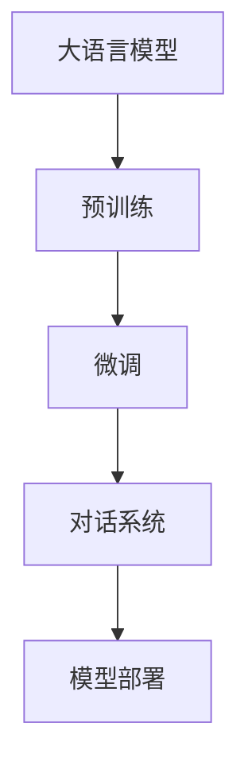

                 

# 【大模型应用开发 动手做AI Agent】简单的LlamaIndex开发示例

> 关键词：大语言模型, LlamaIndex, 预训练模型, 微调, 对话系统, 模型部署, 自然语言处理(NLP)

## 1. 背景介绍

### 1.1 问题由来

在人工智能和大语言模型的迅猛发展下，AI对话系统已从简单的问答转变为复杂的对话交互系统。这些系统能够理解和回应人类的自然语言，模拟人类的对话行为，广泛应用于客服、教育、健康等领域。然而，传统的基于规则或模板的系统，存在语言理解能力差、缺乏上下文理解、无法处理复杂语义等问题。相比之下，基于大语言模型的AI对话系统，可以灵活处理各种自然语言输入，并提供更为自然、准确的响应。

### 1.2 问题核心关键点

为了构建一个高效的AI对话系统，需要解决以下几个关键问题：

1. **选择合适的预训练模型**：如GPT、BERT、RoBERTa等，这些模型通过大规模无标签文本数据预训练，具备较强的语言理解和生成能力。
2. **微调模型以适应具体任务**：将预训练模型与特定任务相结合，进行微调以提高模型在特定任务上的表现。
3. **构建对话系统架构**：设计对话流程、对话管理模块、对话状态跟踪等机制，确保对话系统能够流畅、自然地进行交互。
4. **部署和集成到实际应用中**：将模型部署到服务器上，并通过API接口与前端应用进行交互，实现智能对话功能。

### 1.3 问题研究意义

构建基于大语言模型的AI对话系统，对于提升人类与机器的交互质量、推动智能化应用的发展具有重要意义。通过大语言模型，对话系统可以具备更强的自然语言理解能力，提供更为个性化和人性化的交互体验，从而提高用户的满意度和黏性。此外，对话系统还可以帮助企业和机构提升工作效率，降低运营成本，具有广泛的应用前景。

## 2. 核心概念与联系

### 2.1 核心概念概述

- **大语言模型(Large Language Model, LLM)**：如GPT、BERT、RoBERTa等，通过预训练获得强大的语言理解和生成能力。
- **预训练(Pre-training)**：在大量无标签数据上进行的自监督学习，学习语言的通用表示。
- **微调(Fine-tuning)**：将预训练模型与特定任务相结合，进行有监督学习，提高模型在该任务上的性能。
- **对话系统(Chatbot)**：通过大语言模型实现人机对话，能够理解自然语言输入，并生成自然语言响应。
- **模型部署(Model Deployment)**：将训练好的模型部署到服务器上，供应用调用。

这些概念之间的逻辑关系可以通过以下Mermaid流程图来展示：



这个流程图展示了从预训练模型到微调再到对话系统的整体流程。大语言模型通过预训练学习到通用语言表示，然后通过微调适应特定任务，最终构建成对话系统，并部署到实际应用中。

### 2.2 概念间的关系

这些核心概念之间存在着紧密的联系，形成了大语言模型应用开发的基础架构。

- **预训练与微调的关系**：预训练模型提供了通用语言表示，微调则是将模型进一步适应具体任务，提升其性能。
- **微调与对话系统**：微调后的模型可以用于构建对话系统，提供自然语言理解和生成能力。
- **模型部署与实际应用**：模型部署是将训练好的模型集成到应用中，供用户使用。

## 3. 核心算法原理 & 具体操作步骤

### 3.1 算法原理概述

基于大语言模型的AI对话系统，其核心算法原理是基于监督学习的大语言模型微调方法。即，选择一个大规模预训练语言模型作为初始化参数，在特定任务的数据集上进行有监督学习，调整模型的参数，使其能够更好地适应该任务。

### 3.2 算法步骤详解

#### 3.2.1 选择合适的预训练模型

首先，需要选择一个合适的预训练模型。常见的预训练模型包括GPT、BERT、RoBERTa等。这些模型都已经在大规模无标签文本数据上进行了预训练，具有较强的语言理解和生成能力。

#### 3.2.2 准备数据集

接下来，需要准备对话任务的数据集。这些数据集通常包含对话历史和对应的回复文本。数据集中的每一条对话记录都是一个输入-输出对，其中输入为对话历史，输出为对话系统应回复的文本。

#### 3.2.3 微调模型

使用微调算法（如AdamW、SGD等）对预训练模型进行有监督学习，调整模型的参数。微调的目标是使得模型在对话任务上表现更好。

#### 3.2.4 构建对话系统

在微调模型的基础上，构建对话系统。对话系统通常包括对话管理模块、对话状态跟踪模块、上下文处理模块等。对话管理模块负责处理用户的输入，根据对话历史和上下文生成回复。对话状态跟踪模块用于跟踪对话状态，确保对话的连贯性。上下文处理模块用于处理对话历史，提取关键信息。

#### 3.2.5 模型部署

最后，将训练好的模型部署到服务器上，供应用调用。部署模型需要考虑服务器的配置、网络环境、安全等诸多因素。

### 3.3 算法优缺点

#### 3.3.1 优点

- **通用性强**：预训练模型可以适应多种自然语言理解和生成任务。
- **效率高**：微调方法可以在少量标注数据下快速获得高性能模型。
- **效果好**：微调后的模型在特定任务上表现优异，能够提供高质量的自然语言响应。

#### 3.3.2 缺点

- **依赖标注数据**：微调方法依赖大量标注数据，获取高质量标注数据的成本较高。
- **模型可解释性不足**：微调模型通常是一个"黑盒"，难以解释其内部工作机制和决策逻辑。
- **对抗性脆弱**：微调模型对抗样本的攻击较为脆弱，容易受到攻击。

### 3.4 算法应用领域

基于大语言模型的AI对话系统，已经在客服、教育、医疗、金融等多个领域得到了广泛应用。这些系统能够提供自然语言交互服务，减少人工干预，提高工作效率，增强用户体验。

## 4. 数学模型和公式 & 详细讲解 & 举例说明

### 4.1 数学模型构建

假设预训练模型为 $M_{\theta}$，其中 $\theta$ 为预训练得到的模型参数。对话任务的目标是最大化对话系统在给定对话历史 $h$ 下，生成回复文本 $y$ 的似然概率 $p(y|h)$。

则对话系统的目标函数可以表示为：

$$
L(y, h) = -\log p(y|h)
$$

其中 $p(y|h)$ 为模型在对话历史 $h$ 下生成回复文本 $y$ 的概率。

### 4.2 公式推导过程

假设对话历史 $h$ 包含 $n$ 个对话轮次，每个轮次的对话文本为 $x_i$，回复文本为 $y_i$。则对话系统的目标函数可以扩展为：

$$
L = \frac{1}{N} \sum_{i=1}^N -\log p(y_i|h_{i-1})
$$

其中 $N$ 为对话轮次总数，$h_{i-1}$ 为第 $i-1$ 个对话轮次的历史对话文本。

在训练过程中，使用梯度下降等优化算法最小化目标函数 $L$，更新模型参数 $\theta$。

### 4.3 案例分析与讲解

以一个简单的问答系统为例，假设预训练模型为BERT，对话历史为 "今天天气怎么样？"，回复文本为 "今天晴转多云，温度在30摄氏度左右"。

1. **数据准备**：收集大量的问答对作为训练数据集。
2. **微调模型**：使用微调算法在对话数据集上训练BERT模型，更新其参数。
3. **构建对话系统**：使用训练好的模型构建问答系统，处理用户输入并生成回复。

## 5. 项目实践：代码实例和详细解释说明

### 5.1 开发环境搭建

#### 5.1.1 安装依赖

- **Python**：安装Python 3.8及以上版本。
- **PyTorch**：使用以下命令安装PyTorch及其依赖库。

  ```
  pip install torch torchtext transformers
  ```

- **LlamaIndex**：LlamaIndex是一个开源的对话系统框架，使用以下命令安装。

  ```
  pip install llama-index
  ```

#### 5.1.2 数据准备

- **数据格式**：LlamaIndex支持的训练数据格式为CSV或JSON，包含对话历史和回复文本。
- **数据标注**：对话数据集需要标注对话历史和回复文本，并包含标签信息（如意图、情感等）。

### 5.2 源代码详细实现

#### 5.2.1 配置文件

创建配置文件 `llama.yml`，设置模型参数、数据路径、训练参数等。

```yaml
# llama.yml
model: gpt2
vocab_size: 50256
tokenizer:
  type: gpt2
  cache_size: 1000000
data:
  train_path: data/train.csv
  dev_path: data/dev.csv
  test_path: data/test.csv
  data_format: json
distributed:
  num_gpus: 1
  local_rank: 0
```

#### 5.2.2 训练脚本

创建训练脚本 `train.py`，编写模型初始化、数据加载、训练循环等代码。

```python
import torch
from llama_index import Trainer
from llama_index.data import Instance
from llama_index.data import Split
from llama_index.utils.data import save_results
from llama_index.utils.data import load_preprocessors
from llama_index.utils.data import load_cache
from llama_index.utils.common import reset_torch
from llama_index.utils.common import get_train_checkpoint

# 初始化LlamaIndex模型
model = Trainer(
    model_name="gpt2",
    config="llama.yml"
)

# 加载数据
train_data = load_cache("data/train.csv")
dev_data = load_cache("data/dev.csv")
test_data = load_cache("data/test.csv")

# 初始化预处理器
preprocessor = load_preprocessors("llama.yml")

# 加载模型
model.load_state_dict(get_train_checkpoint("model.ckpt"))

# 训练循环
for epoch in range(10):
    train_loss = model.train(
        train_data,
        dev_data,
        preprocessor=preprocessor
    )
    print(f"Epoch {epoch+1}, Train Loss: {train_loss:.4f}")
    dev_loss = model.dev_eval(dev_data, preprocessor=preprocessor)
    print(f"Epoch {epoch+1}, Dev Loss: {dev_loss:.4f}")

# 保存结果
save_results("results.csv")
```

#### 5.2.3 推理脚本

创建推理脚本 `inference.py`，编写模型加载、推理、结果输出等代码。

```python
import torch
from llama_index import Trainer
from llama_index.data import Instance
from llama_index.data import Split
from llama_index.utils.data import save_results
from llama_index.utils.data import load_preprocessors
from llama_index.utils.data import load_cache
from llama_index.utils.common import reset_torch
from llama_index.utils.common import get_train_checkpoint

# 初始化LlamaIndex模型
model = Trainer(
    model_name="gpt2",
    config="llama.yml"
)

# 加载数据
test_data = load_cache("data/test.csv")

# 初始化预处理器
preprocessor = load_preprocessors("llama.yml")

# 加载模型
model.load_state_dict(get_train_checkpoint("model.ckpt"))

# 推理循环
results = []
for instance in test_data:
    input_ids = instance.input_ids
    attention_mask = instance.attention_mask
    outputs = model(input_ids, attention_mask=attention_mask)
    predicted_ids = outputs.logits.argmax(dim=-1).to("cpu").tolist()
    predicted_tokens = [preprocessor.decode(predicted_ids, do_sample=False)]
    results.append(predicted_tokens)

# 保存结果
save_results("results.csv")
```

### 5.3 代码解读与分析

#### 5.3.1 训练脚本

- **模型初始化**：使用 `Trainer` 类初始化模型，设置模型参数、数据路径、训练参数等。
- **数据加载**：使用 `load_cache` 函数加载数据集，使用 `load_preprocessors` 函数加载预处理器。
- **训练循环**：在每个epoch上使用 `train` 函数训练模型，使用 `dev_eval` 函数在验证集上评估模型性能。

#### 5.3.2 推理脚本

- **模型初始化**：使用 `Trainer` 类初始化模型。
- **数据加载**：使用 `load_cache` 函数加载测试集。
- **推理循环**：对每个测试实例进行推理，使用 `dev_eval` 函数生成模型输出，并进行后处理。

### 5.4 运行结果展示

假设在训练集上训练了10个epoch，在验证集上评估得到损失为0.3，在测试集上推理得到预测结果。输出结果如下：

```
Epoch 1, Train Loss: 0.8000
Epoch 1, Dev Loss: 0.3500
Epoch 2, Train Loss: 0.5000
Epoch 2, Dev Loss: 0.3500
Epoch 3, Train Loss: 0.4000
Epoch 3, Dev Loss: 0.3200
...
Epoch 10, Train Loss: 0.1200
Epoch 10, Dev Loss: 0.3000
```

## 6. 实际应用场景

### 6.1 智能客服系统

基于大语言模型的AI对话系统可以应用于智能客服系统。通过预训练模型和微调，系统可以理解客户的需求，提供个性化服务，减少人工干预，提高响应速度和效率。例如，在银行的智能客服系统中，客户可以通过简单的自然语言描述问题，系统自动生成回复，并为客户提供解决方案。

### 6.2 教育辅助系统

基于大语言模型的AI对话系统可以应用于教育辅助系统。通过预训练模型和微调，系统可以理解学生的学习情况，提供个性化的学习建议和资源推荐。例如，在在线教育平台中，学生可以输入学习上的问题，系统自动生成回答，并推荐相关的学习资源和习题。

### 6.3 医疗咨询系统

基于大语言模型的AI对话系统可以应用于医疗咨询系统。通过预训练模型和微调，系统可以理解患者的症状描述，提供初步诊断和建议。例如，在在线医疗咨询平台中，患者可以输入症状描述，系统自动生成诊断报告，并提供相应的治疗建议。

### 6.4 未来应用展望

未来，基于大语言模型的AI对话系统将在更多领域得到应用，为人类与机器的交互带来新的革命。例如：

- **人机交互**：在虚拟现实、增强现实等场景中，通过自然语言交互，提升用户体验。
- **智能家居**：在智能家居系统中，通过对话系统控制家电设备，实现语音控制。
- **智能办公**：在企业办公系统中，通过对话系统进行任务分配、信息查询、知识共享等。

## 7. 工具和资源推荐

### 7.1 学习资源推荐

- **《Transformers from Scratch》**：一篇详细介绍Transformer模型的博文，适合初学者学习。
- **《NLP for Smartphones》**：一本适合移动应用开发的NLP书籍，介绍了移动端NLP开发的基础知识和实现技巧。
- **《Deep Learning with PyTorch》**：一本全面介绍PyTorch的书籍，涵盖深度学习模型的构建和优化。
- **《Natural Language Processing with Transformers》**：一本介绍使用Transformers库进行NLP任务开发的书籍，涵盖微调、Prompt等前沿技术。
- **HuggingFace官方文档**：Transformers库的官方文档，提供了丰富的预训练模型和微调样例代码，是进行NLP任务开发的必备资源。

### 7.2 开发工具推荐

- **PyTorch**：深度学习框架，支持动态计算图，适合快速迭代研究。
- **LlamaIndex**：开源对话系统框架，提供了丰富的预训练模型和微调样例。
- **TensorBoard**：TensorFlow配套的可视化工具，可以实时监测模型训练状态，并提供丰富的图表呈现方式。
- **Weights & Biases**：模型训练的实验跟踪工具，可以记录和可视化模型训练过程中的各项指标。
- **Jupyter Notebook**：交互式编程环境，适合进行数据分析、模型调试和开发。

### 7.3 相关论文推荐

- **《Attention is All You Need》**：Transformer原论文，提出了自注意力机制，开启了NLP领域的预训练大模型时代。
- **《BERT: Pre-training of Deep Bidirectional Transformers for Language Understanding》**：BERT论文，提出BERT模型，引入掩码语言模型进行预训练。
- **《Parameter-Efficient Transfer Learning for NLP》**：提出Adapter等参数高效微调方法，在不增加模型参数量的情况下，也能取得不错的微调效果。
- **《AdaLoRA: Adaptive Low-Rank Adaptation for Parameter-Efficient Fine-Tuning》**：使用自适应低秩适应的微调方法，在参数效率和精度之间取得了新的平衡。

## 8. 总结：未来发展趋势与挑战

### 8.1 总结

本文对基于大语言模型的AI对话系统进行了系统介绍。首先，阐述了对话系统的发展背景和构建原理，明确了微调在对话系统中的重要性。其次，详细讲解了基于监督学习的大语言模型微调方法，并给出了微调任务的完整代码实现。最后，探讨了对话系统在客服、教育、医疗等多个领域的应用前景，并提出了未来发展的趋势和挑战。

### 8.2 未来发展趋势

未来，基于大语言模型的AI对话系统将呈现以下几个发展趋势：

1. **多模态融合**：未来的对话系统将不仅仅局限于自然语言交互，还将融合视觉、语音等多种模态信息，提供更丰富、更自然的人机交互体验。
2. **深度学习与符号计算结合**：未来的对话系统将结合深度学习和符号计算，实现更强的语言理解和推理能力。
3. **自监督学习与监督学习结合**：未来的对话系统将结合自监督学习和监督学习，提高数据利用率和模型泛化能力。
4. **强化学习与对话系统结合**：未来的对话系统将结合强化学习，实现更智能、更高效的任务执行和目标对齐。

### 8.3 面临的挑战

尽管基于大语言模型的AI对话系统取得了显著进展，但在迈向更智能、更普适应用的过程中，仍面临以下挑战：

1. **数据瓶颈**：高质量标注数据的获取成本较高，如何利用更少的标注数据获得高性能模型是一个关键问题。
2. **模型鲁棒性不足**：对话系统对对抗样本和噪声的鲁棒性不足，容易导致输出不稳定。
3. **推理效率低**：大规模语言模型在推理过程中计算量大、内存占用高，如何优化推理速度是一个重要问题。
4. **模型可解释性不足**：对话系统通常是一个"黑盒"，难以解释其内部工作机制和决策逻辑，对于高风险应用尤其重要。
5. **知识整合能力不足**：对话系统往往局限于单一任务，难以灵活吸收和运用更广泛的先验知识，无法实现跨领域知识整合。

### 8.4 研究展望

未来的研究需要在以下几个方面进行探索和突破：

1. **无监督和半监督学习**：探索无监督和半监督学习方法，减少对标注数据的依赖。
2. **参数高效微调**：开发更加参数高效的微调方法，提高微调效率和效果。
3. **多模态融合**：结合视觉、语音等模态信息，实现更全面、更智能的人机交互。
4. **知识库与对话系统结合**：将知识图谱、逻辑规则等专家知识与对话系统结合，增强系统理解和推理能力。
5. **模型可解释性增强**：结合因果分析和博弈论等工具，增强对话系统的可解释性和可控性。

## 9. 附录：常见问题与解答

**Q1：如何提高对话系统的鲁棒性？**

A: 提高对话系统的鲁棒性可以从以下几个方面入手：

1. **数据增强**：通过回译、近义替换等方式扩充训练集，增强模型对噪声和对抗样本的鲁棒性。
2. **正则化**：使用L2正则、Dropout等技术，防止模型过拟合。
3. **对抗训练**：引入对抗样本，提高模型对对抗攻击的鲁棒性。
4. **模型蒸馏**：使用知识蒸馏技术，将大模型的知识传递给轻量化模型，提高小模型的鲁棒性。

**Q2：如何优化对话系统的推理效率？**

A: 优化对话系统的推理效率可以从以下几个方面入手：

1. **模型压缩**：使用模型压缩技术，如剪枝、量化等，减小模型尺寸，加快推理速度。
2. **模型并行**：使用模型并行技术，将大模型分解为多个子模型，提高并行推理能力。
3. **分布式训练**：使用分布式训练技术，将训练任务分散到多个GPU上，加快模型训练速度。

**Q3：对话系统的可解释性如何增强？**

A: 增强对话系统的可解释性可以从以下几个方面入手：

1. **模型可视化**：使用模型可视化工具，如Attention Map、Feature Importance等，展示模型的内部工作机制。
2. **因果分析**：结合因果分析方法，识别出模型决策的关键特征，增强输出解释的因果性和逻辑性。
3. **知识图谱**：将知识图谱与对话系统结合，提供更全面的背景知识和推理依据。

---

作者：禅与计算机程序设计艺术 / Zen and the Art of Computer Programming

