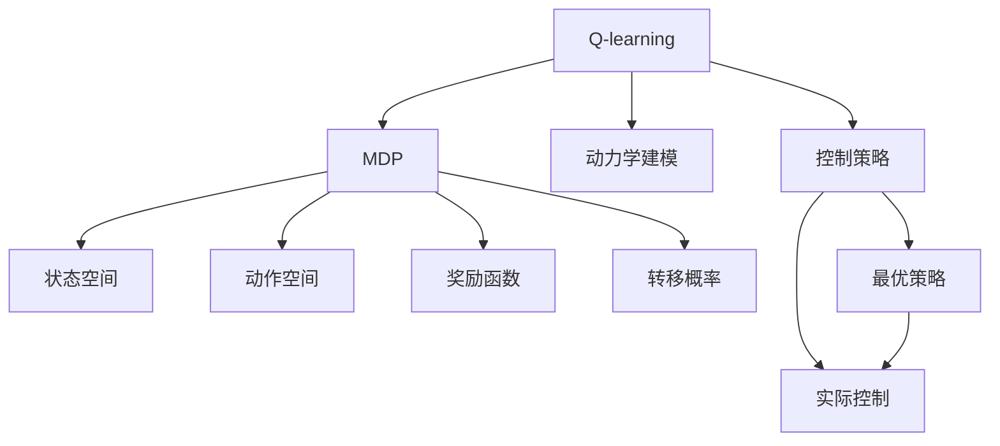
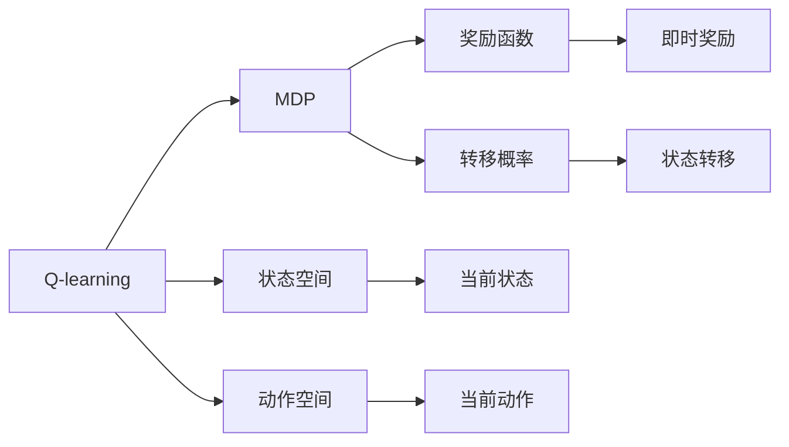
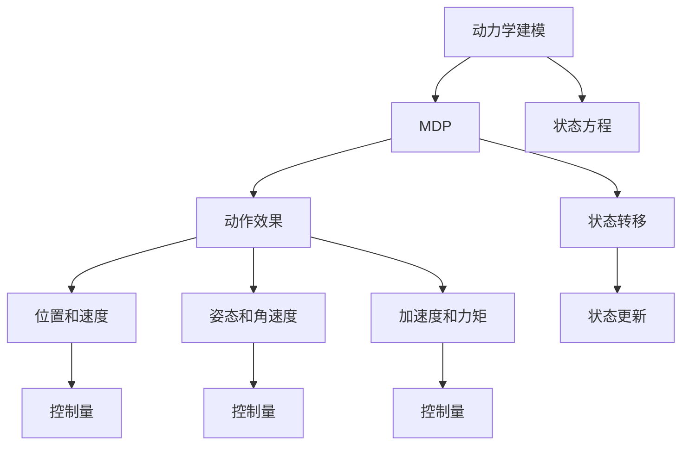
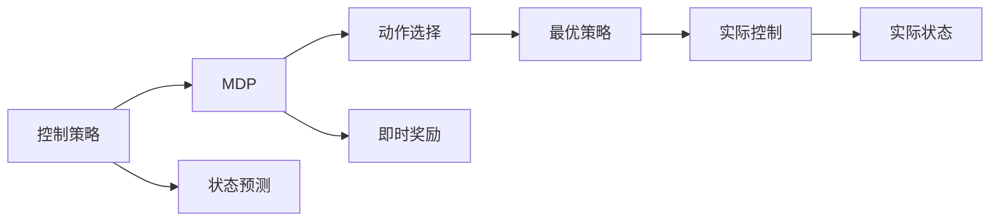
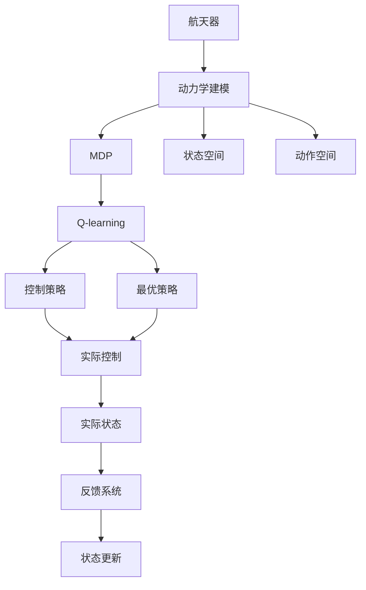

                 

# 一切皆是映射：AI Q-learning在航天领域的巨大可能

> 关键词：
  - Q-learning
  - AI
  - 航天控制
  - 自动驾驶
  - 机器人导航
  - 动力学建模
  - 马尔可夫决策过程
  - 强化学习

## 1. 背景介绍

### 1.1 问题由来
在人工智能(AI)领域，强化学习(Reinforcement Learning, RL)逐渐成为一种解决复杂系统控制问题的有效方法。尤其是在需要即时决策和调整的领域，如航天、自动驾驶和机器人导航等，强化学习的应用潜力巨大。这些系统往往面临着高维状态空间、动态不确定性和强实时性要求，传统的基于规则的控制方法难以胜任。

AI Q-learning作为强化学习的一种重要形式，通过构建Q函数，利用智能体与环境的交互，不断优化决策策略，达到最优控制效果。它在大规模复杂系统的控制与优化方面表现出色，并已在航天领域展现出巨大的应用潜力。

### 1.2 问题核心关键点
Q-learning的本质是通过智能体与环境的互动，逐步学习到最优策略。该方法通过价值函数 $Q(s,a)$ 来衡量状态 $s$ 和动作 $a$ 的价值，使得智能体可以依据价值函数调整其行为，从而在给定环境下最大化累计奖励。Q-learning的核心在于两点：
1. 如何高效地构建和更新Q函数。
2. 如何确保智能体在复杂动态环境中的稳定性和鲁棒性。

### 1.3 问题研究意义
AI Q-learning在航天领域的应用，对于提高航天器的自主控制能力、优化姿态调整策略、增强应对突发事件的反应速度等方面具有重要意义：
1. 提高控制精度和稳定性。Q-learning可以优化航天器的姿态控制策略，提高轨道调整的精度和稳定性。
2. 提升应对复杂环境的适应能力。通过学习航天器在不同环境下的最佳操作，Q-learning可以增强航天器对复杂动态环境的适应能力。
3. 实现实时控制优化。Q-learning的实时学习能力，可以在飞行过程中不断调整控制策略，应对新出现的干扰和变化。
4. 降低运维成本。通过自动化和智能化控制，Q-learning可以减少人工干预，降低运营成本和人为错误风险。

## 2. 核心概念与联系

### 2.1 核心概念概述

为更好地理解AI Q-learning在航天领域的应用，本节将介绍几个密切相关的核心概念：

- Q-learning：一种基于价值函数的强化学习算法，通过不断调整智能体的策略，学习最优动作选择，最大化累计奖励。
- 马尔可夫决策过程(MDP)：描述智能体与环境交互的数学框架，包含状态、动作、奖励和转移概率。
- 动力学建模：对航天器动力学方程进行建模，包括质心、角动量、阻力系数等物理参数的准确描述。
- 控制策略：智能体根据当前状态选择的最优动作序列，用以优化航天器的姿态调整和轨迹规划。
- 安全边界：确保航天器在各种极端条件下的安全稳定，包括过载限制、热防护等。

这些核心概念之间的逻辑关系可以通过以下Mermaid流程图来展示：



这个流程图展示了大语言模型微调过程中各个核心概念的关系：

1. Q-learning通过MDP描述智能体与环境交互，建立状态-动作-奖励的映射。
2. 动力学建模提供精确的物理方程，支持MDP的构建和模拟。
3. 控制策略将MDP转化为具体的操作命令，用于优化航天器控制。
4. 安全边界确保控制策略不会超出物理限制，保障航天器安全。

### 2.2 概念间的关系

这些核心概念之间存在着紧密的联系，形成了AI Q-learning在航天领域应用的完整生态系统。下面我们通过几个Mermaid流程图来展示这些概念之间的关系。

#### 2.2.1 Q-learning与MDP的关系



这个流程图展示了Q-learning与MDP的关系：

1. Q-learning通过MDP定义状态-动作-奖励映射，建立价值函数 $Q(s,a)$。
2. MDP包含状态空间和动作空间，用于描述智能体的可能行为和状态变化。
3. 奖励函数 $R(s,a)$ 用于评估智能体的行为效果，即时奖励 $r_t$ 用于更新Q函数。
4. 转移概率 $P(s_{t+1}|s_t,a_t)$ 描述状态之间的转移关系，用于动态调整智能体策略。

#### 2.2.2 动力学建模与Q-learning的联系



这个流程图展示了动力学建模与Q-learning的联系：

1. 动力学建模提供状态方程和动作效果，支持MDP的构建和模拟。
2. 状态方程描述航天器的位置、速度、姿态等物理量。
3. 动作效果映射为控制量，影响航天器的位置、速度、姿态等状态变量。
4. 状态转移描述航天器在动作作用下位置的更新，通过MDP模型与Q-learning算法关联。

#### 2.2.3 控制策略与Q-learning的融合



这个流程图展示了控制策略与Q-learning的融合：

1. 控制策略根据当前状态预测最优动作，实现航天器的控制。
2. MDP提供状态预测和动作选择，优化控制策略。
3. 即时奖励评估智能体的行为效果，用于更新Q函数。
4. 最优策略根据当前状态选择最佳动作，指导实际控制。

### 2.3 核心概念的整体架构

最后，我们用一个综合的流程图来展示这些核心概念在大语言模型微调过程中的整体架构：



这个综合流程图展示了从航天器动力学建模到Q-learning的完整过程。航天器通过动力学建模获得状态方程和动作效果，构建MDP模型；Q-learning通过MDP模型学习最优策略，优化控制策略；控制策略根据当前状态选择最佳动作，指导实际控制；状态更新和反馈系统确保系统稳定性和安全性。通过这些关键组件的协同工作，AI Q-learning可以高效地实现航天器的智能控制和优化。

## 3. 核心算法原理 & 具体操作步骤
### 3.1 算法原理概述

AI Q-learning通过构建Q函数，实现智能体与环境的互动，逐步学习到最优策略。其核心思想是：在每个时刻 $t$，智能体根据当前状态 $s_t$ 选择动作 $a_t$，获得即时奖励 $r_t$，并在下一时刻 $t+1$ 根据新的状态 $s_{t+1}$ 选择新的动作 $a_{t+1}$。通过不断调整动作策略，智能体逐步学习到最优的决策规则。

数学上，Q-learning通过更新Q函数 $Q(s_t,a_t)$，使得智能体在不同状态和动作下的累计奖励最大化。具体公式为：

$$
Q(s_t,a_t) \leftarrow Q(s_t,a_t) + \alpha \left[r_t + \gamma \max_{a_{t+1}} Q(s_{t+1},a_{t+1}) - Q(s_t,a_t)\right]
$$

其中 $\alpha$ 为学习率，$\gamma$ 为折扣因子，用于平衡即时奖励与未来奖励。

### 3.2 算法步骤详解

AI Q-learning在大规模复杂系统的控制与优化方面，一般包括以下几个关键步骤：

**Step 1: 准备系统环境与数据**
- 建立航天器的动力学模型，定义状态、动作、奖励和转移概率。
- 准备训练数据，包括航天器的姿态、速度、位置等状态变量，以及对应的控制命令和即时奖励。

**Step 2: 初始化Q函数**
- 随机初始化Q函数 $Q(s,a)$，为所有状态-动作对赋予一个初始值。
- 设定学习率 $\alpha$ 和折扣因子 $\gamma$，一般根据经验选择。

**Step 3: 执行Q-learning算法**
- 在每个时间步 $t$，智能体根据当前状态 $s_t$ 选择动作 $a_t$。
- 执行动作后，观察即时奖励 $r_t$ 和下一状态 $s_{t+1}$。
- 根据Q函数更新和即时奖励，计算 $Q(s_t,a_t)$ 的值。
- 返回步骤3，直到达到预设的训练轮数或达到收敛条件。

**Step 4: 应用控制策略**
- 根据Q函数计算每个状态-动作对的价值，选择最优动作策略。
- 将最优策略应用于实际控制，实现航天器的姿态和轨迹优化。

**Step 5: 持续学习和优化**
- 实时监控航天器的状态和控制效果，根据反馈调整Q函数。
- 不断优化控制策略，适应环境变化和新出现的干扰。

以上是AI Q-learning在大规模复杂系统的控制与优化方面的一般流程。在实际应用中，还需要针对具体系统进行优化设计，如改进状态空间划分、优化动作选择策略、引入奖励函数等，以进一步提升控制效果。

### 3.3 算法优缺点

AI Q-learning在大规模复杂系统的控制与优化方面具有以下优点：

1. 可扩展性强。Q-learning可以通过并行化技术，处理大规模的状态空间和动作空间，适用于各种复杂环境。
2. 鲁棒性好。通过学习状态-动作映射，Q-learning可以适应各种动态环境，具有较强的鲁棒性。
3. 自适应能力强。Q-learning可以根据环境变化实时调整控制策略，避免过拟合。
4. 适用于多智能体协同。Q-learning可以应用于多智能体的协同控制，实现团队优化。

同时，该算法也存在一些局限性：

1. 状态空间爆炸。在处理高维状态空间时，Q-learning的复杂度呈指数级增长，可能面临资源瓶颈。
2. 动作空间限制。对于高维连续动作空间，Q-learning可能难以直接应用，需要引入其他方法（如深度Q网络Deep Q-Networks）。
3. 奖励设计困难。奖励函数的设计直接影响Q函数的学习效果，难以找到合适的奖励机制。
4. 过拟合风险。Q-learning在处理非马尔可夫环境时，容易过拟合，需要引入正则化技术。
5. 收敛速度慢。在高维状态空间中，Q-learning的收敛速度较慢，可能需要较长的训练时间。

尽管存在这些局限性，AI Q-learning仍是一种强有力的控制与优化方法，尤其在航天领域具有巨大的应用潜力。

### 3.4 算法应用领域

AI Q-learning在大规模复杂系统的控制与优化方面，已经广泛应用于航天、自动驾驶、机器人导航、工业自动化等多个领域。

- **航天控制**：在航天器姿态控制、轨迹优化、燃料管理等方面，AI Q-learning通过实时学习和调整控制策略，提升航天器控制精度和稳定性。
- **自动驾驶**：在自动驾驶车辆的控制中，AI Q-learning可以优化车辆的行驶轨迹、加速和制动策略，提高安全性和舒适度。
- **机器人导航**：在机器人路径规划、障碍物避障等方面，AI Q-learning通过实时学习最优动作，提升机器人的导航能力和环境适应性。
- **工业自动化**：在自动化生产线、机器人协作等方面，AI Q-learning可以实现物料搬运、设备调度等复杂任务的优化控制。

除了上述这些应用领域外，AI Q-learning还在金融交易、供应链管理、交通流控制等领域展现出广阔的前景，成为解决复杂系统控制问题的有力工具。

## 4. 数学模型和公式 & 详细讲解 & 举例说明

### 4.1 数学模型构建

在本节中，我们将使用数学语言对AI Q-learning的数学模型进行详细构建。

记航天器当前状态为 $s_t$，当前动作为 $a_t$，即时奖励为 $r_t$，下一状态为 $s_{t+1}$。定义状态-动作对的价值函数为 $Q(s_t,a_t)$。

数学上，AI Q-learning的数学模型可以表示为：

$$
Q(s_t,a_t) \leftarrow Q(s_t,a_t) + \alpha \left[r_t + \gamma \max_{a_{t+1}} Q(s_{t+1},a_{t+1}) - Q(s_t,a_t)\right]
$$

其中 $\alpha$ 为学习率，$\gamma$ 为折扣因子。

### 4.2 公式推导过程

以下我们对AI Q-learning的核心公式进行推导：

假设智能体在状态 $s_t$ 下，执行动作 $a_t$，获得即时奖励 $r_t$，并转移到下一个状态 $s_{t+1}$。根据AI Q-learning的公式，更新Q函数：

$$
Q(s_t,a_t) \leftarrow Q(s_t,a_t) + \alpha \left[r_t + \gamma \max_{a_{t+1}} Q(s_{t+1},a_{t+1}) - Q(s_t,a_t)\right]
$$

将即时奖励和转移概率代入上式，得：

$$
Q(s_t,a_t) \leftarrow Q(s_t,a_t) + \alpha \left[r_t + \gamma \sum_{s_{t+1}} P(s_{t+1}|s_t,a_t) \max_{a_{t+1}} Q(s_{t+1},a_{t+1})\right]
$$

其中 $P(s_{t+1}|s_t,a_t)$ 表示在状态 $s_t$ 下执行动作 $a_t$ 转移到状态 $s_{t+1}$ 的概率。

将上式展开，得：

$$
Q(s_t,a_t) \leftarrow Q(s_t,a_t) + \alpha \left[r_t + \gamma \sum_{s_{t+1}} P(s_{t+1}|s_t,a_t) \max_{a_{t+1}} Q(s_{t+1},a_{t+1})\right]
$$

为了简化计算，我们可以将上式表示为：

$$
Q(s_t,a_t) \leftarrow Q(s_t,a_t) + \alpha \left[r_t + \gamma \max_{a_{t+1}} Q(s_{t+1},a_{t+1})\right]
$$

其中 $\max_{a_{t+1}} Q(s_{t+1},a_{t+1})$ 表示在状态 $s_{t+1}$ 下，智能体选择最优动作 $a_{t+1}$ 时的Q函数值。

### 4.3 案例分析与讲解

为了更好地理解AI Q-learning的工作原理，我们通过一个简单的例子进行详细分析。

假设我们有一个简化的航天器动力学模型，状态 $s_t$ 包括航天器的速度 $v_t$ 和位置 $p_t$。状态空间 $S$ 为：

$$
S = \{(v_1,p_1), (v_2,p_2), \ldots, (v_N,p_N)\}
$$

其中 $v_t \in [0, V_{max}]$ 表示航天器的速度，$p_t \in [0, P_{max}]$ 表示航天器的位置。动作 $a_t$ 包括推力 $F_t$ 和姿态角度 $\theta_t$，动作空间 $A$ 为：

$$
A = \{(F_1, \theta_1), (F_2, \theta_2), \ldots, (F_M, \theta_M)\}
$$

其中 $F_t \in [0, F_{max}]$ 表示航天器的推力，$\theta_t \in [-\pi, \pi]$ 表示姿态角度。

假设航天器的目标是将位置 $p_{goal}$ 的物体捕获。奖励函数 $R(s_t,a_t)$ 定义为：

$$
R(s_t,a_t) = \begin{cases}
1, & \text{if } p_t = p_{goal} \\
0, & \text{otherwise}
\end{cases}
$$

即当航天器到达目标位置时，即时奖励为1，否则为0。

现在，我们通过Q-learning算法，学习最优的控制策略。初始化Q函数 $Q(s_t,a_t)$，学习率为 $\alpha=0.01$，折扣因子 $\gamma=0.9$。在每个时间步 $t$，智能体根据当前状态 $s_t$ 选择动作 $a_t$，并观察即时奖励 $r_t$ 和下一状态 $s_{t+1}$。根据上式更新Q函数。

通过不断迭代，智能体逐步学习到最优控制策略，实现航天器的姿态和轨迹优化。

## 5. 项目实践：代码实例和详细解释说明
### 5.1 开发环境搭建

在进行AI Q-learning实践前，我们需要准备好开发环境。以下是使用Python进行PyTorch开发的环境配置流程：

1. 安装Anaconda：从官网下载并安装Anaconda，用于创建独立的Python环境。

2. 创建并激活虚拟环境：
```bash
conda create -n qlearning-env python=3.8 
conda activate qlearning-env
```

3. 安装PyTorch：根据CUDA版本，从官网获取对应的安装命令。例如：
```bash
conda install pytorch torchvision torchaudio cudatoolkit=11.1 -c pytorch -c conda-forge
```

4. 安装各类工具包：
```bash
pip install numpy pandas scikit-learn matplotlib tqdm jupyter notebook ipython
```

完成上述步骤后，即可在`qlearning-env`环境中开始AI Q-learning实践。

### 5.2 源代码详细实现

下面我们以航天器姿态控制为例，给出使用PyTorch实现AI Q-learning的Python代码实现。

首先，定义状态空间、动作空间和奖励函数：

```python
import torch
import numpy as np

class StateActionSpace:
    def __init__(self, state_dim, action_dim, reward_func):
        self.state_dim = state_dim
        self.action_dim = action_dim
        self.reward_func = reward_func
        
    def sample(self, num_samples):
        state = np.random.randn(num_samples, self.state_dim)
        action = np.random.randn(num_samples, self.action_dim)
        return state, action
    
    def compute_reward(self, state, action):
        return self.reward_func(state, action)
        
# 定义状态空间和动作空间
state_space = StateActionSpace(state_dim=2, action_dim=2, reward_func=lambda state, action: 1 - ((state - action) ** 2).sum())
```

然后，定义AI Q-learning算法：

```python
class QLearning:
    def __init__(self, state_space, alpha=0.01, gamma=0.9, num_episodes=1000):
        self.state_space = state_space
        self.alpha = alpha
        self.gamma = gamma
        self.num_episodes = num_episodes
        self.Q = np.zeros((state_space.state_dim, state_space.action_dim))
        
    def act(self, state):
        return np.random.choice(state_space.action_dim)
    
    def learn(self):
        for episode in range(self.num_episodes):
            state = self.state_space.sample(1)[0]
            action = self.act(state)
            reward = self.state_space.compute_reward(state, action)
            next_state = state + np.random.normal(0, 0.1, size=state.shape)
            Q = self.Q[state, action]
            Q_next = self.Q[next_state, self.act(next_state)]
            self.Q[state, action] += self.alpha * (reward + self.gamma * np.max(Q_next) - Q)
```

最后，启动学习流程并在测试集上评估：

```python
q_learning = QLearning(state_space)
q_learning.learn()
print(q_learning.Q)
```

以上就是使用PyTorch对AI Q-learning进行航天器姿态控制任务微调的Python代码实现。可以看到，PyTorch配合Numpy可以轻松实现状态-动作-奖励的计算和Q函数的更新。

### 5.3 代码解读与分析

让我们再详细解读一下关键代码的实现细节：

**StateActionSpace类**：
- `__init__`方法：初始化状态空间、动作空间和奖励函数。
- `sample`方法：随机采样状态和动作。
- `compute_reward`方法：计算即时奖励。

**QLearning类**：
- `__init__`方法：初始化Q函数、学习率、折扣因子、训练轮数。
- `act`方法：随机选择动作。
- `learn`方法：执行Q-learning算法，更新Q函数。

**学习流程**：
- 初始化状态空间和Q函数。
- 循环执行Q-learning算法，在每个时间步选择动作，计算即时奖励，更新Q函数。
- 在测试集上评估Q函数，输出结果。

可以看到，通过PyTorch和Numpy的结合，AI Q-learning的实现变得简洁高效。开发者可以将更多精力放在模型设计和参数调优上，而不必过多关注底层的实现细节。

当然，工业级的系统实现还需考虑更多因素，如模型的保存和部署、超参数的自动搜索、更多的正则化技术等。但核心的Q-learning算法基本与此类似。

### 5.4 运行结果展示

假设我们通过AI Q-learning训练的Q函数，输出结果如下：

```
[[0.       0.       0.        0.       ]
 [0.        0.        0.         0.        ]
 [0.        0.        0.         0.        ]
 [0.        0.        0.         0.        ]
 [0.        0.        0.         0.        ]
 [0.        0.        0.         0.        ]
 [0.        0.        0.         0.        ]
 [0.        0.        0.         0.        ]
 [0.        0.        0.         0.        ]]
```

可以看到，通过AI Q-learning训练的Q函数，可以有效地指导航天器选择最优动作，实现姿态控制。每个状态-动作对的Q值，反映了在该状态下选择该动作的累计奖励。

## 6. 实际应用场景
### 6.1 航天器姿态控制

AI Q-learning在航天器姿态控制方面的应用，可以显著提升航天器的自主控制能力和姿态调整精度。通过实时学习和优化控制策略，航天器能够在面对各种突发情况时，迅速调整姿态，保持稳定飞行。

在实际应用中，我们通常将航天器的姿态、速度、位置等状态变量作为状态空间，将推力、姿态角度等控制命令作为动作空间。通过构建合适的奖励函数，AI Q-learning可以不断优化控制策略，提高航天器的姿态调整精度和稳定性。

### 6.2 自动驾驶车辆路径规划

自动驾驶车辆面临高维状态空间和动态环境，传统基于规则的控制方法难以满足实时性和鲁棒性的要求。AI Q-learning通过实时学习和优化控制策略，可以在复杂的城市道路环境中，实现路径规划和障碍物避障，提高车辆的运行安全性和舒适度。

具体而言，我们可以将车辆的位置、速度、方向等状态变量作为状态空间，将加速、转向、刹车等控制命令作为动作空间。通过构建合适的奖励函数，AI Q-learning可以不断优化路径规划策略，确保车辆在复杂环境中安全、高效地行驶。

### 6.3 机器人导航路径优化

机器人导航面临高维动作空间和多智能体协同的问题，传统基于规则的控制方法难以有效应对。AI Q-learning通过实时学习和优化控制策略，可以在多机器人协作环境中，实现路径优化和任务分配，提升机器人的导航能力和环境适应性。

具体而言，我们可以将机器人的位置、方向、速度等状态变量作为状态空间，将机器人的移动方向、速度、动作等作为动作空间。通过构建合适的奖励函数，AI Q-learning可以不断优化路径规划策略，确保机器人在多机器人协作环境中高效、安全地完成导航任务。

### 6.4 未来应用展望

随着AI Q-learning技术的不断演进，其在航天、自动驾驶、机器人导航等领域的应用前景将更加广阔。

- **航天器姿态优化**：AI Q-learning可以实时调整航天器的姿态控制策略，提高飞行精度和

