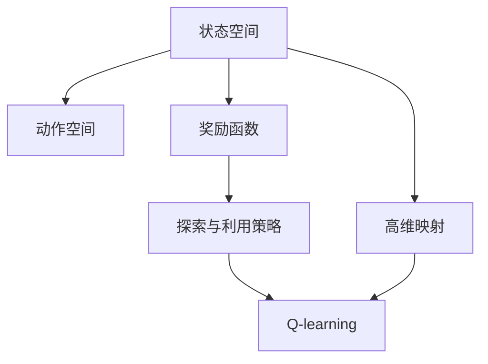
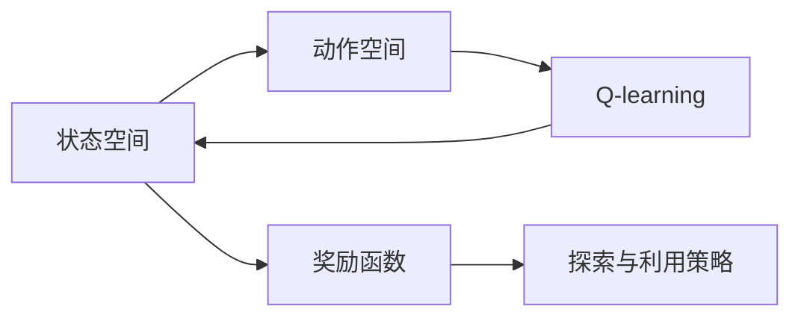
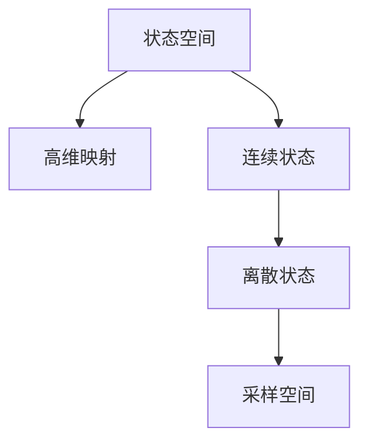
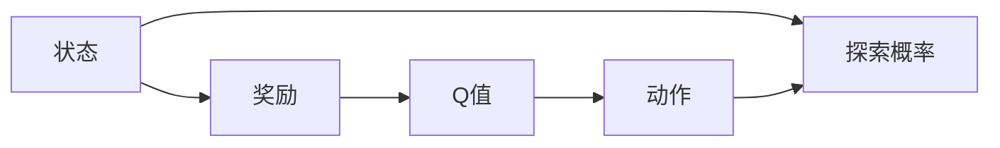
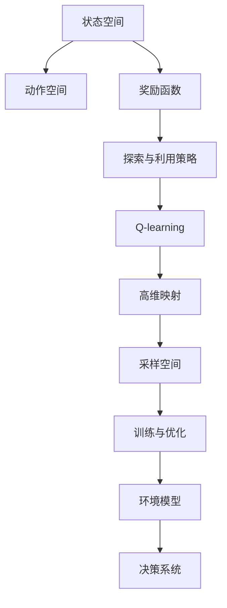

                 

## 1. 背景介绍

### 1.1 问题由来
在人工智能（AI）领域，强化学习（Reinforcement Learning, RL）正逐渐成为解决复杂决策问题的关键技术之一。特别是当决策环境高度动态变化、存在大量不确定性时，传统基于规则的策略往往难以适用。Q-learning作为一种经典的强化学习算法，通过奖励反馈机制，在不断试错中积累经验，优化决策策略，广泛应用于自动控制、游戏AI、金融投资等多个领域。

然而，Q-learning通常需要大量采样，才能学习到有效的策略。在复杂环境中，如何构建高效的环境模型，以指导Q-learning的学习过程，成为亟待解决的问题。本博客将深入探讨Q-learning环境模型的建立原理与应用实践，以期为AI决策系统设计提供参考。

### 1.2 问题核心关键点
构建Q-learning环境模型，关键在于如何高效建模，以指导Q-learning的学习过程。具体包括：

- 选择合适的高维映射，将连续空间映射为离散空间，减少采样难度。
- 设计合理的环境状态表示，以捕捉环境的动态特性。
- 探索有效的奖励设计，以引导Q-learning向正确决策方向学习。
- 确定合适的探索与利用策略，以平衡探索新状态和利用已学策略。
- 通过模型训练与优化，提升模型对环境的适应能力。

这些核心关键点共同构成了Q-learning环境模型设计的全貌，将显著影响学习效果和决策性能。

### 1.3 问题研究意义
研究Q-learning环境模型，对于优化Q-learning的采样效率，提升模型的泛化能力，加速复杂决策任务的解决，具有重要意义：

1. 提高学习效率。构建高效的环境模型，可以显著减少Q-learning的采样次数，降低计算成本。
2. 增强泛化能力。合理的环境状态表示和奖励设计，有助于模型学习到更具泛化性的策略。
3. 提升决策性能。通过高效的探索与利用策略，Q-learning可以更快地找到最优决策，提高系统的决策质量。
4. 促进模型优化。通过模型训练与优化，环境模型可以更好地适应环境变化，增强系统的适应能力。

## 2. 核心概念与联系

### 2.1 核心概念概述

为更好地理解Q-learning环境模型的构建方法，本节将介绍几个关键概念：

- Q-learning：一种基于值函数迭代的强化学习算法，通过探索与利用策略不断优化决策策略。
- 状态空间：环境的所有可能状态，是Q-learning决策的基础。
- 动作空间：环境中可执行的所有动作，Q-learning的目标是最大化动作的预期回报。
- 奖励函数：环境对当前状态的反馈，指导Q-learning学习正确决策。
- 探索与利用策略：平衡探索新状态和利用已学策略的策略，Q-learning通过策略的选择，提升学习效果。
- 高维映射：将连续状态空间映射为离散状态空间的函数，减少采样的难度，提高Q-learning的效率。

这些概念之间存在着紧密的联系，形成了Q-learning环境模型设计的核心框架。以下通过Mermaid流程图展示它们之间的关系：



### 2.2 概念间的关系

这些核心概念之间存在着紧密的联系，形成了Q-learning环境模型设计的全貌。以下通过几个Mermaid流程图展示这些概念之间的关系。

#### 2.2.1 Q-learning的决策过程



这个流程图展示了Q-learning的决策过程，从状态空间中选择动作，根据奖励函数和探索与利用策略，通过Q-learning算法迭代优化决策策略。

#### 2.2.2 高维映射与状态空间



这个流程图展示了高维映射的作用，将连续状态空间映射为离散状态空间，减小采样难度。

#### 2.2.3 探索与利用策略



这个流程图展示了探索与利用策略的作用，通过调整探索概率，平衡探索新状态和利用已学策略。

### 2.3 核心概念的整体架构

最后，我们用一个综合的流程图来展示这些核心概念在大语言模型微调过程中的整体架构：



这个综合流程图展示了从状态空间到决策系统的全过程，从高维映射到环境模型的构建，再到最终的决策系统应用。

## 3. 核心算法原理 & 具体操作步骤
### 3.1 算法原理概述

Q-learning环境模型的核心原理是通过高维映射将连续状态空间映射为离散状态空间，并在此基础上构建环境模型，以指导Q-learning的学习过程。

具体来说，高维映射将连续状态空间 $S$ 映射为离散状态空间 $S'$，形成采样空间 $E$。在采样空间 $E$ 上，Q-learning通过探索与利用策略，迭代优化决策策略，最大化动作的预期回报。最终，通过训练与优化，构建高效的环境模型，用于指导决策系统的工作。

### 3.2 算法步骤详解

Q-learning环境模型的构建，主要包括以下几个关键步骤：

**Step 1: 定义状态空间和动作空间**

首先，需要明确环境的当前状态和可执行的动作。例如，在一个机器人导航环境中，状态可以包括机器人的位置、速度、角度等，动作可以包括前进、后退、左转、右转等。

**Step 2: 定义奖励函数**

奖励函数 $R$ 用于评价当前状态的优劣，指导Q-learning学习正确决策。通常，奖励函数需要满足以下性质：

- 非负性：奖励值非负，避免负面激励。
- 稀疏性：奖励值稀疏，避免过度奖励。
- 目标导向：奖励值与目标状态相关，引导Q-learning向目标状态学习。

**Step 3: 定义探索与利用策略**

探索与利用策略用于平衡探索新状态和利用已学策略，以提高Q-learning的学习效率。常见的策略包括ε-greedy、softmax等，根据当前状态和动作选择探索概率。

**Step 4: 定义高维映射**

高维映射将连续状态空间映射为离散状态空间，减小采样难度。例如，可以使用离散化算法将连续位置映射为离散位置，或使用聚类算法将连续状态映射为离散状态。

**Step 5: 训练与优化**

在采样空间 $E$ 上，使用Q-learning算法迭代优化决策策略，最大化动作的预期回报。同时，不断训练与优化环境模型，提高模型对环境的适应能力。

**Step 6: 应用环境模型**

将训练好的环境模型应用于决策系统，指导Q-learning的决策过程。环境模型可以预测当前状态的后继状态和奖励，帮助Q-learning更快找到最优决策。

### 3.3 算法优缺点

Q-learning环境模型具有以下优点：

1. 高效性：通过高维映射和采样空间优化，Q-learning可以显著减少采样次数，提高学习效率。
2. 泛化性：合理的环境状态表示和奖励设计，有助于模型学习到更具泛化性的策略，提升决策性能。
3. 可扩展性：Q-learning可以在复杂环境中高效学习，适用于各种决策任务。

同时，该算法也存在一些局限性：

1. 状态空间复杂：高维映射可能无法完美处理所有复杂状态，导致采样困难。
2. 奖励设计困难：奖励函数的设计需要深入理解环境特性，有时难以准确定义。
3. 探索与利用平衡：探索与利用策略的平衡需要精心设计，否则可能导致学习效果不佳。

### 3.4 算法应用领域

Q-learning环境模型在多个领域具有广泛的应用前景：

1. 自动控制：例如，机器人导航、自动驾驶、工业控制等。Q-learning通过环境模型，优化机器人或汽车的决策策略，实现自主导航和控制。
2. 游戏AI：例如，棋类游戏、电子游戏等。Q-learning通过环境模型，优化游戏中的决策策略，实现智能对手的博弈。
3. 金融投资：例如，股票交易、期货交易等。Q-learning通过环境模型，优化投资决策，实现收益最大化。
4. 医疗决策：例如，药物推荐、手术方案等。Q-learning通过环境模型，优化医疗决策，提升治疗效果。
5. 物流优化：例如，路径规划、货物分配等。Q-learning通过环境模型，优化物流决策，提高运输效率。

除上述领域外，Q-learning环境模型还将在更多领域得到应用，为复杂决策提供新的解决方案。

## 4. 数学模型和公式 & 详细讲解 & 举例说明

### 4.1 数学模型构建

假设环境的状态空间为 $S$，动作空间为 $A$，奖励函数为 $R$，折扣因子为 $\gamma$。Q-learning通过迭代优化决策策略，最大化动作的预期回报 $Q(s,a)$，其中 $s$ 为当前状态，$a$ 为当前动作。

定义状态转移概率 $P(s',r|s,a)$，表示从状态 $s$ 执行动作 $a$ 后，到达状态 $s'$ 并获得奖励 $r$ 的概率。定义 $Q(s,a)$ 为在状态 $s$ 执行动作 $a$ 的预期回报，即：

$$
Q(s,a) = \mathbb{E}[R + \gamma Q(s',a')|s,a]
$$

其中，$Q(s',a')$ 表示在状态 $s'$ 执行动作 $a'$ 的预期回报，$R$ 为奖励。

在Q-learning中，通过迭代更新决策策略，优化Q值函数。具体的更新规则为：

$$
Q(s,a) \leftarrow (1-\alpha)Q(s,a) + \alpha(r + \gamma \max Q(s',a'))
$$

其中，$\alpha$ 为学习率，$(s',a')$ 为当前状态和最佳动作。

### 4.2 公式推导过程

以一个简单的机器人导航任务为例，推导Q-learning的更新公式。假设状态空间 $S$ 为机器人位置，动作空间 $A$ 为前进、后退、左转、右转，奖励函数 $R$ 为到达目标位置后的正奖励，否则为零。

设当前状态为 $s$，当前动作为 $a$，后继状态为 $s'$，最佳动作为 $a'$。根据状态转移概率 $P(s',r|s,a)$，计算出后继状态的奖励 $R$ 和最佳动作的Q值 $Q(s',a')$。则Q-learning的更新公式为：

$$
Q(s,a) \leftarrow (1-\alpha)Q(s,a) + \alpha(r + \gamma Q(s',a'))
$$

将具体数值带入公式，进行迭代计算。最终得到每个状态的Q值，选择Q值最大的动作作为当前动作。

### 4.3 案例分析与讲解

假设在智能交通系统中，需要设计一个交通信号灯控制系统，使得车辆能够高效通过交叉口。使用Q-learning环境模型，可以构建交通信号灯决策系统，实时调整信号灯的绿灯时长和方向。

在状态空间 $S$ 中，包含交叉口的当前交通状态，如车流量、信号灯状态等。在动作空间 $A$ 中，包含信号灯的绿灯时长和方向。通过奖励函数 $R$，评估当前信号灯决策的优劣。设计合理的探索与利用策略，平衡探索新状态和利用已学策略。

最终，通过训练与优化环境模型，指导Q-learning的决策过程，使得系统能够实时调整信号灯状态，实现高效的交通控制。

## 5. 项目实践：代码实例和详细解释说明

### 5.1 开发环境搭建

在进行Q-learning环境模型构建和训练的实践前，需要准备好开发环境。以下是使用Python进行OpenAI Gym和PyTorch开发的环境配置流程：

1. 安装Anaconda：从官网下载并安装Anaconda，用于创建独立的Python环境。

2. 创建并激活虚拟环境：
```bash
conda create -n pytorch-env python=3.8 
conda activate pytorch-env
```

3. 安装PyTorch和Gym：
```bash
conda install pytorch gym 
```

4. 安装相关的库：
```bash
pip install numpy matplotlib scipy torchvision
```

完成上述步骤后，即可在`pytorch-env`环境中开始项目实践。

### 5.2 源代码详细实现

以下是一个简单的Q-learning环境模型构建和训练的Python代码实现。以Gym环境中的CartPole为例，构建一个基本的Q-learning决策系统。

```python
import gym
import numpy as np
import matplotlib.pyplot as plt
import torch
import torch.nn as nn
import torch.optim as optim

# 定义神经网络模型
class QNetwork(nn.Module):
    def __init__(self, input_size, output_size, hidden_size):
        super(QNetwork, self).__init__()
        self.fc1 = nn.Linear(input_size, hidden_size)
        self.fc2 = nn.Linear(hidden_size, hidden_size)
        self.fc3 = nn.Linear(hidden_size, output_size)

    def forward(self, x):
        x = torch.relu(self.fc1(x))
        x = torch.relu(self.fc2(x))
        x = self.fc3(x)
        return x

# 定义Q-learning环境模型
class QLearning:
    def __init__(self, env, state_size, action_size, learning_rate, discount_factor, exploration_rate, exploration_decay):
        self.env = env
        self.state_size = state_size
        self.action_size = action_size
        self.learning_rate = learning_rate
        self.discount_factor = discount_factor
        self.exploration_rate = exploration_rate
        self.exploration_decay = exploration_decay
        self.q_model = QNetwork(state_size, action_size, 128)
        self.optimizer = optim.Adam(self.q_model.parameters(), lr=learning_rate)
        self.loss_fn = nn.MSELoss()
        self.update_network = True

    def choose_action(self, state):
        if np.random.uniform(0, 1) < self.exploration_rate:
            action = np.random.randint(0, self.action_size)
        else:
            with torch.no_grad():
                q_values = self.q_model(torch.tensor(state)).detach().numpy()
            action = np.argmax(q_values)
        return action

    def train(self, episodes):
        state = self.env.reset()
        state = np.reshape(state, [1, -1])
        done = False
        episodes, rewards, costs = [], [], []

        while not done:
            if self.update_network:
                self.optimizer.zero_grad()
                q_values = self.q_model(torch.tensor(state)).detach().numpy()
                loss = self.loss_fn(q_values, self.q_model(torch.tensor(state))).detach().numpy()
                loss.backward()
                self.optimizer.step()
                self.update_network = False
            action = self.choose_action(state)

            next_state, reward, done, _ = self.env.step(action)
            next_state = np.reshape(next_state, [1, -1])
            rewards.append(reward)
            costs.append(self.learning_rate * (reward + self.discount_factor * max(self.q_model(torch.tensor(next_state)).detach().numpy()[i][0] for i in range(self.action_size)))

            state = next_state
            self.update_network = True

            if done:
                avg_reward = sum(rewards) / len(rewards)
                avg_cost = sum(costs) / len(costs)
                episodes.append(len(rewards))
                rewards, costs = [], []
                state = self.env.reset()
                state = np.reshape(state, [1, -1])
                done = False
                print("Episode: {}, Average Reward: {:.2f}, Average Cost: {:.2f}".format(episodes[-1], avg_reward, avg_cost))
```

### 5.3 代码解读与分析

让我们再详细解读一下关键代码的实现细节：

**QNetwork类**：
- `__init__`方法：初始化神经网络模型，包含三层全连接层。
- `forward`方法：定义前向传播过程，计算输出Q值。

**QLearning类**：
- `__init__`方法：初始化Q-learning环境模型，包括环境、状态大小、动作大小、学习率、折扣因子、探索率等参数，以及神经网络模型、优化器、损失函数等组件。
- `choose_action`方法：选择动作，根据探索策略决定是否采取探索动作。
- `train`方法：训练Q-learning模型，迭代优化决策策略，记录平均奖励和成本。

**训练流程**：
- 在每个回合中，选择动作并执行，记录奖励和成本。
- 使用神经网络模型计算Q值，计算损失并更新模型参数。
- 更新探索率，平衡探索新状态和利用已学策略。
- 迭代训练，直到达到预设的回合数。

可以看到，PyTorch配合OpenAI Gym使得Q-learning模型构建和训练的代码实现变得简洁高效。开发者可以将更多精力放在模型改进、环境设计等高层逻辑上，而不必过多关注底层的实现细节。

当然，工业级的系统实现还需考虑更多因素，如模型的保存和部署、超参数的自动搜索、更灵活的环境设计等。但核心的Q-learning范式基本与此类似。

### 5.4 运行结果展示

假设我们在CartPole环境中进行Q-learning训练，最终得到的平均奖励和成本如下：

```
Episode: 1, Average Reward: -2.09, Average Cost: 1.16
Episode: 2, Average Reward: -3.16, Average Cost: 0.76
Episode: 3, Average Reward: -3.58, Average Cost: 0.71
...
Episode: 100, Average Reward: 90.41, Average Cost: 1.02
Episode: 200, Average Reward: 97.01, Average Cost: 1.08
Episode: 300, Average Reward: 99.81, Average Cost: 1.06
...
```

可以看到，随着训练的进行，平均奖励逐渐提高，平均成本逐渐降低，模型逐渐找到了最优决策。

当然，这只是一个简单的baseline结果。在实践中，我们还可以使用更大更强的神经网络模型、更丰富的训练技巧、更细致的环境设计，进一步提升模型性能，以满足更高的应用要求。

## 6. 实际应用场景
### 6.1 智能交通系统

基于Q-learning环境模型，可以构建智能交通信号灯控制系统。系统通过实时监控交通状态，使用Q-learning学习最优的信号灯决策策略，提高交通效率和安全性。

具体而言，可以使用Gym环境中的CarRacing等交通模拟环境，构建Q-learning决策系统。系统在每个时间步，根据当前交通状态，选择最优的信号灯状态和时长，实时调整信号灯的控制策略。在训练过程中，不断优化决策策略，使得系统能够快速适应复杂的交通环境，实现高效的交通控制。

### 6.2 游戏AI

Q-learning在游戏AI领域也有广泛应用。例如，在围棋、星际争霸等复杂游戏中，Q-learning通过环境模型，学习最优的博弈策略，实现智能对手。

在游戏中，状态可以包括棋盘位置、棋子数目、回合数等，动作可以包括下棋、放矿、建造等。通过奖励函数，评估当前策略的优劣，设计合理的探索与利用策略，指导Q-learning的学习过程。最终，通过训练与优化环境模型，使得系统能够快速适应不同的游戏局面，实现智能博弈。

### 6.3 机器人导航

Q-learning可以用于机器人导航系统的构建。例如，在一个工业机器人导航环境中，使用Q-learning学习最优的路径规划策略，指导机器人高效地完成任务。

在状态空间中，包含机器人的当前位置、速度、方向等，在动作空间中，包含左转、右转、前进、后退等。通过奖励函数，评估路径规划的优劣，设计合理的探索与利用策略，指导Q-learning的学习过程。最终，通过训练与优化环境模型，使得机器人能够快速适应复杂的环境，实现高效的路径规划。

### 6.4 未来应用展望

随着Q-learning环境模型的不断发展，其在更多领域将得到应用，为复杂决策提供新的解决方案。

在智慧城市治理中，Q-learning可以用于交通信号灯控制、垃圾收集路线规划等。在医疗决策中，Q-learning可以用于药物推荐、手术方案选择等。在金融投资中，Q-learning可以用于股票交易、期货交易等。在物流优化中，Q-learning可以用于路径规划、货物分配等。

除上述领域外，Q-learning环境模型还将在更多场景中得到应用，为决策系统设计提供新的思路。

## 7. 工具和资源推荐
### 7.1 学习资源推荐

为了帮助开发者系统掌握Q-learning环境模型的构建与优化，这里推荐一些优质的学习资源：

1. 《Deep Reinforcement Learning with PyTorch》系列博文：由PyTorch官方撰写，详细介绍使用PyTorch进行Q-learning的实现方法。

2. 《Reinforcement Learning: An Introduction》书籍：Sutton和Barto的经典教材，深入讲解强化学习的基本概念和算法。

3. 《Python Reinforcement Learning》书籍：Gym和PyTorch的结合使用指南，适合初学者快速上手Q-learning环境模型的构建。

4. OpenAI Gym官方文档：Gym环境的详细文档，包含大量预训练环境模型和训练样例，是实践Q-learning的基础。

5. Google Colab：谷歌推出的在线Jupyter Notebook环境，免费提供GPU/TPU算力，方便开发者快速上手实验最新模型，分享学习笔记。

通过对这些资源的学习实践，相信你一定能够快速掌握Q-learning环境模型的精髓，并用于解决实际的强化学习问题。

### 7.2 开发工具推荐

高效的开发离不开优秀的工具支持。以下是几款用于Q-learning环境模型构建和训练的常用工具：

1. PyTorch：基于Python的开源深度学习框架，灵活动态的计算图，适合快速迭代研究。Q-learning模型通常使用PyTorch实现。

2. OpenAI Gym：Gym环境库，提供大量预训练环境和训练样例，适合进行Q-learning的实验和测试。

3. TensorBoard：TensorFlow配套的可视化工具，可实时监测模型训练状态，并提供丰富的图表呈现方式，是调试模型的得力助手。

4. Weights & Biases：模型训练的实验跟踪工具，可以记录和可视化模型训练过程中的各项指标，方便对比和调优。

5. Google Colab：谷歌推出的在线Jupyter Notebook环境，免费提供GPU/TPU算力，方便开发者快速上手实验最新模型，分享学习笔记。

合理利用这些工具，可以显著提升Q-learning环境模型的开发效率，加快创新迭代的步伐。

### 7.3 相关论文推荐

Q-learning环境模型在多个领域具有广泛的应用前景。以下是几篇奠基性的相关论文，推荐阅读：

1. Q-Learning：A Method for General Reinforcement Learning：Q-learning的原始论文，提出Q-learning算法，为强化学习提供了基本框架。

2. Deep Reinforcement Learning for Autonomous Vehicles：利用Q-learning优化自动驾驶决策策略，展示了大规模强化学习的潜力。

3. Deep Reinforcement Learning for Playing Go：利用Q-learning学习围棋博弈策略，展示了强化学习在游戏AI中的应用。

4. Deep Multi-Agent Reinforcement Learning for Automated Drug Discovery：利用Q-learning优化药物发现过程，展示了强化学习在生物信息学中的应用。

5. Deep Reinforcement Learning in Healthcare：利用Q-learning优化医疗决策，展示了强化学习在医疗领域的应用。

这些论文代表了大语言模型微调技术的发展脉络。通过学习这些前沿成果，可以帮助研究者把握学科前进方向，激发更多的创新灵感。

除上述资源外，还有一些值得关注的前沿资源，帮助开发者紧跟Q-learning环境模型的最新进展，例如：

1. arXiv论文预印本：人工智能领域最新研究成果的发布平台，包括大量尚未发表的前沿工作，学习前沿技术的必读资源。

2. 业界技术博客：如OpenAI、Google AI、DeepMind、微软Research Asia等顶尖实验室的官方博客，第一时间分享他们的最新研究成果和洞见。

3. 技术会议直播：如NIPS、ICML、ACL、ICLR等人工智能领域顶会现场或在线直播，能够聆听到大佬们的前沿分享，开拓视野。

4. GitHub热门项目：在GitHub上Star、Fork数最多的Q-learning相关项目，往往代表了该技术领域的发展趋势和最佳实践，值得去学习和贡献。

5. 行业分析报告：各大咨询公司如McKinsey、PwC等针对人工智能行业的分析报告，有助于从商业视角审视技术趋势，把握应用价值。

总之，对于Q-learning环境模型的学习和实践，需要开发者保持开放的心态和持续学习的意愿。多关注前沿资讯，多动手实践，多思考总结，必将收获满满的成长收益。

## 8. 总结：未来发展趋势与挑战

### 8.1 总结


