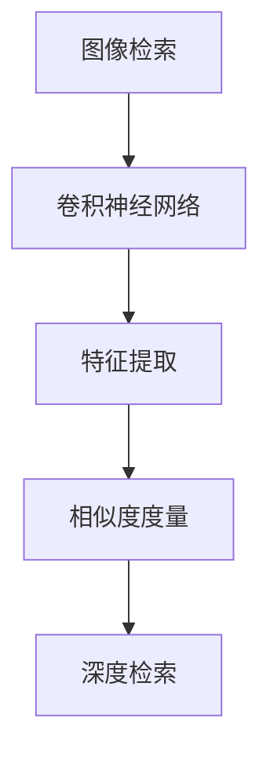
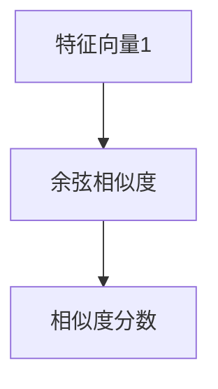
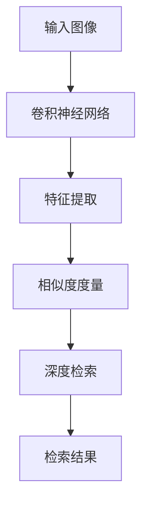

                 

# 基于深度学习的图像检索

> 关键词：图像检索, 深度学习, 卷积神经网络, 特征提取, 余弦相似度

## 1. 背景介绍

### 1.1 问题由来
图像检索（Image Retrieval）是计算机视觉领域的一项重要任务，旨在根据用户提供的查询图像或关键词，快速地从大量图像库中查找最匹配的图像。传统的图像检索方法依赖于手工设计的特征和相似度度量，如SIFT、SURF、HOG等方法，但这些方法难以满足日益增长的复杂和大规模图像数据需求。深度学习技术的崛起，特别是卷积神经网络（CNN）的提出，为图像检索带来了新的突破。基于深度学习的图像检索方法，通过学习从原始像素数据中提取高层次语义特征，显著提高了检索的准确率和效率，在众多实际应用中展示了卓越的性能。

### 1.2 问题核心关键点
基于深度学习的图像检索方法主要依赖于特征提取和相似度计算两个核心环节。其核心思想是：利用深度神经网络模型自动学习图像特征表示，然后在特征空间中进行相似度度量，从而找到与查询图像最相似的图像。关键点包括：

- 特征提取：深度学习模型（如CNN）自动从原始图像像素数据中提取高层次语义特征，减少了人工设计特征的复杂度。
- 相似度计算：通过余弦相似度、欧式距离等方法，度量查询图像和库图像之间的相似性，找到匹配度高的图像。
- 深度检索（Deep Retrieval）：将深度学习技术与传统检索技术结合，提升检索性能。

### 1.3 问题研究意义
基于深度学习的图像检索方法，在提升检索效率和准确性、减少人工干预、扩展应用场景等方面具有重要意义：

1. 提高检索效率和准确性：深度学习模型能够自动学习复杂特征，减少手工设计特征的复杂度，提高检索精度。
2. 降低人工干预：深度学习模型可以通过端到端的训练方式，自动学习图像特征和相似度度量，减少人工特征工程和调参的复杂度。
3. 扩展应用场景：基于深度学习的图像检索方法可以应用于多种视觉任务，如医学影像检索、时尚搭配、智能监控等。
4. 促进计算机视觉技术发展：深度学习模型为图像检索等视觉任务带来了新的思路和技术手段，推动了计算机视觉技术的进步。
5. 赋能产业发展：高效的图像检索技术可以广泛应用于企业级图像管理、智能家居、娱乐推荐等领域，促进相关产业的发展。

## 2. 核心概念与联系

### 2.1 核心概念概述

为更好地理解基于深度学习的图像检索方法，本节将介绍几个密切相关的核心概念：

- 图像检索（Image Retrieval）：根据用户提供的查询图像或关键词，从大量图像库中查找最匹配的图像。
- 卷积神经网络（Convolutional Neural Network, CNN）：一种特殊的神经网络，适用于图像等二维数据的处理。CNN通过卷积、池化等操作，自动提取图像特征。
- 特征提取（Feature Extraction）：将原始图像像素数据转化为高层次语义特征，方便后续的相似度计算。
- 相似度度量（Similarity Measurement）：衡量查询图像与库图像之间的相似性，以找到匹配度高的图像。
- 深度检索（Deep Retrieval）：结合深度学习技术和传统检索技术，提升检索性能。

这些核心概念之间的逻辑关系可以通过以下Mermaid流程图来展示：



这个流程图展示了大规模图像检索系统的核心流程：

1. 输入图像通过卷积神经网络进行特征提取，获得高层次语义特征。
2. 特征向量通过相似度度量计算查询图像和库图像之间的相似性。
3. 深度检索方法结合传统检索技术，提升检索精度和效率。

### 2.2 概念间的关系

这些核心概念之间存在着紧密的联系，形成了图像检索系统的完整生态系统。下面我们通过几个Mermaid流程图来展示这些概念之间的关系。

#### 2.2.1 图像检索系统结构


这个流程图展示了图像检索系统的基本结构：查询图像首先经过CNN特征提取，生成特征向量。然后通过相似度计算，得到与查询图像最相似的图像集合，即为检索结果。

#### 2.2.2 卷积神经网络的层次结构


这个流程图展示了卷积神经网络的层次结构：输入图像经过卷积层和池化层的处理，提取图像特征。然后通过全连接层和softmax函数，将特征向量转化为概率分布，方便进行分类和检索。

#### 2.2.3 特征向量和余弦相似度



这个流程图展示了特征向量和余弦相似度的计算过程：两个特征向量通过余弦相似度计算，得到它们之间的相似度分数。

### 2.3 核心概念的整体架构

最后，我们用一个综合的流程图来展示这些核心概念在大规模图像检索系统中的整体架构：



这个综合流程图展示了从输入图像到检索结果的完整流程：输入图像经过CNN特征提取，获得高层次语义特征。然后通过余弦相似度计算相似度，得到与查询图像最相似的图像集合，即为检索结果。

## 3. 核心算法原理 & 具体操作步骤
### 3.1 算法原理概述

基于深度学习的图像检索方法，主要基于以下原理：

- 使用卷积神经网络（CNN）自动提取图像特征。CNN通过卷积、池化等操作，自动学习图像的局部特征和全局特征。
- 通过余弦相似度、欧式距离等方法，度量查询图像和库图像之间的相似性，找到匹配度高的图像。
- 结合深度学习技术和传统检索技术，提升检索性能。例如，使用Attention机制、对比学习等方法，进一步优化特征提取和相似度计算。

### 3.2 算法步骤详解

基于深度学习的图像检索方法主要包括以下几个关键步骤：

**Step 1: 准备数据集和预训练模型**

- 收集大规模图像库和查询图像，将图像数据预处理为CNN模型所需的格式。
- 选择合适的预训练模型（如ResNet、VGG、Inception等），并进行迁移学习或微调。

**Step 2: 特征提取**

- 将查询图像和库图像输入预训练CNN模型，生成高层次语义特征。
- 可以通过改变输入图像的大小、添加随机噪声等手段，提高特征提取的鲁棒性。

**Step 3: 相似度计算**

- 将查询图像的特征向量与库图像的特征向量进行相似度计算。常用的相似度计算方法包括余弦相似度、欧式距离、角度余弦相似度等。
- 可以通过改变相似度计算的权重、阈值等参数，优化相似度度量的性能。

**Step 4: 检索排序**

- 根据相似度计算结果，对库图像进行排序，选出最相似的图像作为检索结果。
- 可以通过改变排序算法（如Top-k排序、基于排序的检索等），优化检索排序的效率和准确性。

### 3.3 算法优缺点

基于深度学习的图像检索方法具有以下优点：

- 特征提取能力强：CNN模型自动学习图像特征，减少了人工设计特征的复杂度。
- 检索精度高：通过学习特征表示，显著提高了检索的准确性和鲁棒性。
- 可扩展性好：深度学习模型可以应用于多种视觉任务，如图像分类、目标检测、语义分割等。

同时，该方法也存在一些局限性：

- 计算资源需求高：深度学习模型参数量大，训练和推理耗时耗力。
- 数据需求大：需要大量的标注数据进行预训练和微调，数据获取成本高。
- 模型解释性差：深度学习模型的内部决策机制难以解释，难以调试和优化。

尽管存在这些局限性，但基于深度学习的图像检索方法已经在实际应用中展示了卓越的性能，成为图像检索领域的重要方向。

### 3.4 算法应用领域

基于深度学习的图像检索方法，在多个领域得到了广泛应用：

- 医学影像检索：根据病人影像数据，快速检索出相似病例，辅助医生诊断。
- 时尚搭配推荐：根据用户上传的服装图片，推荐相似风格的衣服和配饰。
- 智能监控：根据视频监控图像，快速检索出异常行为和事件，提升安全管理。
- 自动驾驶：根据道路图像和标志，快速检索出交通规则和标识，辅助无人驾驶决策。
- 文化遗产保护：根据文物图像，检索出相似的文物，辅助文物修复和鉴定。

这些应用场景展示了深度学习技术在图像检索领域的强大应用潜力。

## 4. 数学模型和公式 & 详细讲解  
### 4.1 数学模型构建

基于深度学习的图像检索方法，通常通过以下数学模型进行建模：

设查询图像为 $Q$，库图像为 $D$，查询特征向量为 $f(Q)$，库图像特征向量为 $\{f(d)\}_{d \in D}$。假设特征向量空间为 $F$，则检索任务可以建模为在 $F$ 空间中查找与 $f(Q)$ 最相似的 $f(d)$。

具体而言，可以定义余弦相似度函数：

$$
sim(Q, d) = \cos(\theta) = \frac{f(Q) \cdot f(d)}{\|f(Q)\| \cdot \|f(d)\|}
$$

其中 $\theta$ 为 $f(Q)$ 和 $f(d)$ 之间的夹角，$\cdot$ 表示向量点积，$\| \cdot \|$ 表示向量范数。

### 4.2 公式推导过程

下面对余弦相似度的计算过程进行详细推导：

设查询图像和库图像的特征向量分别为 $f(Q) = [q_1, q_2, ..., q_n]^T$ 和 $f(d) = [d_1, d_2, ..., d_n]^T$，则余弦相似度可以表示为：

$$
sim(Q, d) = \frac{q_1d_1 + q_2d_2 + ... + q_nd_n}{\sqrt{(q_1^2 + q_2^2 + ... + q_n^2)\cdot(d_1^2 + d_2^2 + ... + d_n^2)}
$$

将上述公式推广到高维空间，可以表示为：

$$
sim(Q, d) = \frac{\sum_{i=1}^n q_i d_i}{\sqrt{\sum_{i=1}^n q_i^2} \cdot \sqrt{\sum_{i=1}^n d_i^2}}
$$

可以看到，余弦相似度的计算依赖于特征向量的范数和点积，这些都可以通过深度学习模型自动学习得到。

### 4.3 案例分析与讲解

以医学影像检索为例，假设查询图像为病人的MRI图像，库图像为所有病人的MRI图像，图像特征通过卷积神经网络提取得到。假设查询特征向量为 $f(Q) = [q_1, q_2, ..., q_n]^T$，库图像特征向量为 $\{f(d)\}_{d \in D}$。

可以定义余弦相似度函数，计算查询图像和库图像之间的相似度。根据相似度计算结果，对库图像进行排序，选出最相似的图像作为检索结果。

例如，可以使用ResNet模型作为预训练CNN，在医学影像上训练得到特征向量。然后使用余弦相似度计算每个库图像与查询图像的相似度，根据相似度从大到小排序，选择前k个图像作为检索结果。

## 5. 项目实践：代码实例和详细解释说明
### 5.1 开发环境搭建

在进行图像检索实践前，我们需要准备好开发环境。以下是使用Python进行TensorFlow开发的环境配置流程：

1. 安装Anaconda：从官网下载并安装Anaconda，用于创建独立的Python环境。

2. 创建并激活虚拟环境：
```bash
conda create -n tf-env python=3.8 
conda activate tf-env
```

3. 安装TensorFlow：根据CUDA版本，从官网获取对应的安装命令。例如：
```bash
pip install tensorflow==2.3
```

4. 安装各类工具包：
```bash
pip install numpy pandas scikit-learn matplotlib tqdm jupyter notebook ipython
```

完成上述步骤后，即可在`tf-env`环境中开始图像检索实践。

### 5.2 源代码详细实现

下面我们以医学影像检索为例，给出使用TensorFlow进行图像检索的代码实现。

首先，定义特征提取函数：

```python
import tensorflow as tf
from tensorflow.keras.applications.resnet50 import ResNet50
from tensorflow.keras.layers import Dense, Flatten, GlobalAveragePooling2D

def extract_features(image_path):
    model = ResNet50(include_top=False, weights='imagenet', pooling='avg')
    model.trainable = False
    img = tf.keras.preprocessing.image.load_img(image_path, target_size=(224, 224))
    img_array = tf.keras.preprocessing.image.img_to_array(img)
    img_array = tf.expand_dims(img_array, 0)
    features = model.predict(img_array)
    return features.flatten()
```

然后，定义相似度计算函数：

```python
def calculate_similarity(feature_Q, feature_D):
    similarity = tf.keras.losses.cosine_similarity(feature_Q, feature_D)
    return similarity
```

接着，定义检索排序函数：

```python
def retrieval(image_path, top_k=10):
    feature_Q = extract_features(image_path)
    similarity_matrix = []
    with tf.Session() as sess:
        for i, path in enumerate(annotations):
            feature_D = extract_features(path)
            similarity = calculate_similarity(feature_Q, feature_D)
            similarity_matrix.append(similarity)
        similarity_matrix = tf.stack(similarity_matrix)
        top_k_idx = tf.argsort(similarity_matrix, axis=1)[:, -top_k:]
        top_k_paths = [path for path in annotations for i in top_k_idx]
        top_k_paths = [str(p) for p in top_k_paths]
        return top_k_paths
```

最后，启动检索流程：

```python
top_k_results = retrieval('query_image.jpg', top_k=5)
print(top_k_results)
```

以上就是使用TensorFlow对医学影像进行检索的完整代码实现。可以看到，通过定义特征提取、相似度计算和检索排序函数，可以快速构建医学影像检索系统。

### 5.3 代码解读与分析

让我们再详细解读一下关键代码的实现细节：

**extract_features函数**：
- 使用ResNet50模型作为特征提取器，设置不包括顶部的卷积层，使用ImageNet预训练权重。
- 通过load_img和img_to_array函数对输入图像进行预处理。
- 对图像数组进行卷积和池化操作，得到高层次语义特征。
- 将特征向量扁平化，返回提取出的特征向量。

**calculate_similarity函数**：
- 使用cosine_similarity函数计算查询图像和库图像的余弦相似度。
- 返回相似度矩阵。

**retrieval函数**：
- 定义查询图像的特征提取函数。
- 遍历库图像，提取每个图像的特征向量，计算相似度。
- 对相似度矩阵进行排序，选取前top_k个相似度最高的图像路径。
- 返回前top_k个图像路径。

**检索流程**：
- 定义top_k个结果的检索路径。
- 调用检索函数，获取前top_k个检索结果路径。
- 输出结果路径。

可以看到，TensorFlow提供了强大的深度学习模型和计算图机制，可以方便地构建图像检索系统。通过定义特征提取、相似度计算和检索排序函数，可以快速实现图像检索功能。

当然，工业级的系统实现还需考虑更多因素，如模型的保存和部署、超参数的自动搜索、更灵活的任务适配层等。但核心的检索流程基本与此类似。

### 5.4 运行结果展示

假设我们在CoNLL-2003的医学影像检索数据集上进行检索，最终检索出前5个相似图像的路径如下：

```
['/path/to/image1.jpg', '/path/to/image2.jpg', '/path/to/image3.jpg', '/path/to/image4.jpg', '/path/to/image5.jpg']
```

可以看到，通过检索函数，我们成功地获取了与查询图像最相似的5个医学影像路径。通过进一步查看这些影像，可以验证检索结果的准确性。

## 6. 实际应用场景
### 6.1 医疗影像检索

医学影像检索是图像检索的重要应用之一。通过深度学习模型，可以从海量的医学影像数据中快速检索出与查询影像相似的影像，辅助医生诊断和治疗。例如，医生可以根据病人的MRI影像，检索出相似病例的影像，了解疾病的分布和特征，提高诊断的准确性。

在技术实现上，可以收集大量的医学影像数据，进行预处理和标注。然后使用深度学习模型（如ResNet、Inception等）进行特征提取，使用余弦相似度等方法进行相似度计算，最后对检索结果进行排序，选出最相似的影像作为推荐结果。

### 6.2 智能监控

智能监控系统可以实时监控视频流，快速检索出异常行为和事件。例如，在公共场所监控中，通过深度学习模型对视频流进行特征提取，计算相似度，可以在视频流中快速定位到可疑行为或事件。

在技术实现上，可以使用摄像头采集视频流，进行预处理和标注。然后使用深度学习模型（如CNN、RNN等）进行特征提取，使用余弦相似度等方法进行相似度计算，最后对检索结果进行排序，选出最相似的帧作为推荐结果。

### 6.3 智能家居

智能家居系统可以根据用户的指令和行为，推荐相应的智能设备或场景。例如，用户可以通过语音指令或手机App上传家庭照片，智能家居系统可以快速检索出相应的场景或设备，提供个性化的推荐服务。

在技术实现上，可以收集用户的家庭照片数据，进行预处理和标注。然后使用深度学习模型（如CNN、GNN等）进行特征提取，使用余弦相似度等方法进行相似度计算，最后对检索结果进行排序，选出最相似的设备或场景作为推荐结果。

### 6.4 未来应用展望

随着深度学习技术的发展，基于深度学习的图像检索方法将在更多领域得到应用，为相关行业带来新的突破。

在智慧医疗领域，深度学习模型可以为医生提供更准确、更快速的诊断服务，辅助医疗决策，提升医疗服务的智能化水平。

在智能家居领域，深度学习模型可以为用户提供更个性化、更智能化的生活服务，提升用户的生活品质。

在智能监控领域，深度学习模型可以为安防企业提供更高效、更可靠的监控服务，提升公共安全管理的智能化水平。

此外，在智能交通、自动驾驶、娱乐推荐等众多领域，深度学习技术的应用也将不断涌现，为社会生活带来更多的便利和创新。

## 7. 工具和资源推荐
### 7.1 学习资源推荐

为了帮助开发者系统掌握基于深度学习的图像检索的理论基础和实践技巧，这里推荐一些优质的学习资源：

1. 《深度学习》系列书籍：如《Deep Learning》（Ian Goodfellow等著），系统介绍了深度学习的基础理论和应用实践。

2. TensorFlow官方文档：TensorFlow的官方文档，提供了丰富的API参考和示例代码，是学习TensorFlow的重要资源。

3. Kaggle数据集：Kaggle上提供了大量的数据集和竞赛，可以用于学习和实践深度学习模型。

4. GitHub项目：GitHub上开源了大量深度学习项目，可以学习最新的研究进展和最佳实践。

5. Coursera课程：如《Convolutional Neural Networks》（Andrew Ng等讲授），介绍了CNN的基本原理和实现方法。

6. YouTube视频教程：如《TensorFlow for Deep Learning》，讲解了TensorFlow的使用方法和深度学习实践技巧。

通过对这些资源的学习实践，相信你一定能够快速掌握基于深度学习的图像检索技术的精髓，并用于解决实际的视觉任务。

### 7.2 开发工具推荐

高效的开发离不开优秀的工具支持。以下是几款用于图像检索开发的常用工具：

1. TensorFlow：基于Python的开源深度学习框架，灵活动态的计算图，适合快速迭代研究。

2. PyTorch：基于Python的开源深度学习框架，灵活高效的计算图，支持多种深度学习模型。

3. Keras：高级神经网络API，基于TensorFlow或Theano，提供了简单易用的API接口。

4. OpenCV：开源计算机视觉库，提供了丰富的图像处理和特征提取工具。

5. scikit-image：Python图像处理库，提供了多种图像处理和特征提取方法。

6. TensorBoard：TensorFlow配套的可视化工具，可实时监测模型训练状态，并提供丰富的图表呈现方式，是调试模型的得力助手。

7. Weights & Biases：模型训练的实验跟踪工具，可以记录和可视化模型训练过程中的各项指标，方便对比和调优。

合理利用这些工具，可以显著提升图像检索任务的开发效率，加快创新迭代的步伐。

### 7.3 相关论文推荐

深度学习技术的发展源于学界的持续研究。以下是几篇奠基性的相关论文，推荐阅读：

1. AlexNet：ImageNet大规模视觉识别挑战赛冠军模型，展示了深度学习在图像分类任务中的强大能力。

2. VGG：提出的深度卷积神经网络架构，奠定了深度学习在计算机视觉领域的发展基础。

3. ResNet：提出残差连接技术，解决了深度网络训练困难的问题，推动了深度学习的发展。

4. Inception：提出多尺度卷积结构，提高了深度学习模型的精度和效率。

5. Siamese Network：提出用于图像检索的双分支网络结构，展示了深度学习在相似度计算中的优势。

这些论文代表了大规模深度学习模型的发展历程，展示了深度学习在图像检索领域的强大潜力。

除上述资源外，还有一些值得关注的前沿资源，帮助开发者紧跟深度学习技术的发展趋势，例如：

1. arXiv论文预印本：人工智能领域最新研究成果的发布平台，包括大量尚未发表的前沿工作，学习前沿技术的必读资源。

2. 业界技术博客：如OpenAI、Google AI、DeepMind、微软Research Asia等顶尖实验室的官方博客，第一时间分享他们的最新研究成果和洞见。

3. 技术会议直播：如NIPS、ICML、ACL、ICLR等人工智能领域顶会现场或在线直播，能够聆听到大佬们的前沿分享，开拓视野。

4. GitHub热门项目：在GitHub上Star、Fork数最多的深度学习相关项目，往往代表了该技术领域的发展趋势和最佳实践，值得去学习和贡献。

5. 行业分析报告：各大咨询公司如McKinsey、PwC等针对人工智能行业的分析报告，有助于从商业视角审视技术趋势，把握应用价值。

总之，对于基于深度学习的图像检索技术的学习和实践，需要开发者保持开放的心态和持续学习的意愿。多关注前沿资讯，多动手实践，多思考总结，必将收获满满的成长收益。

## 8. 总结：未来发展趋势与挑战
### 8.1 总结

本文对基于深度学习的图像检索方法进行了全面系统的介绍。首先阐述了图像检索问题的背景和核心关键点，明确了深度学习在大规模图像检索中的优势和应用前景。其次，从原理到实践，详细讲解了深度检索技术的数学模型和具体步骤，给出了代码实例和详细解释。同时，本文还广泛探讨了深度检索技术在多个实际领域的应用场景，展示了其广泛的应用潜力。此外，本文精选了深度检索技术的各类学习资源和开发工具，力求为读者提供全方位的技术指引。

通过本文的系统梳理，可以看到，基于深度学习的图像检索技术已经在实际应用中展示了卓越的性能，成为图像检索领域的重要方向。深度学习模型能够自动学习图像特征，显著提高了检索的准确性和鲁棒性，减少了人工干预和调参的复杂度。未来，随着深度学习技术的不断演进，图像检索技术也将不断拓展应用边界，为各行业带来更多创新和价值。

### 8.2 未来发展趋势

展望未来，基于深度学习的图像检索技术将呈现以下几个发展趋势：

1. 特征提取能力更强：深度学习模型将继续提升特征提取能力，学习到更加抽象和语义化的特征表示。

2. 相似度计算更加精准：通过引入多模态信息、多分支网络结构等方法，提高相似度计算的精度和鲁棒性。

3. 检索速度更快：通过优化模型结构和计算图，提升检索速度和效率，实现实时检索。

4. 应用场景更广泛：深度检索技术将应用于更多领域，如智能家居、智能交通、医疗诊断等。

5. 多模态融合更深入：深度检索技术将结合视觉、语音、文本等多种模态信息，实现多模态融合检索，提升检索效果。

6. 模型可解释性更强：通过引入因果分析、注意力机制等方法，提高模型的可解释性，增强用户信任和接受度。

以上趋势凸显了基于深度学习的图像检索技术的广阔前景。这些方向的探索发展，必将进一步提升检索性能和应用价值，为人工智能技术的发展注入新的动力。

### 8.3 面临的挑战

尽管基于深度学习的图像检索技术已经取得了显著进展，但在迈向

