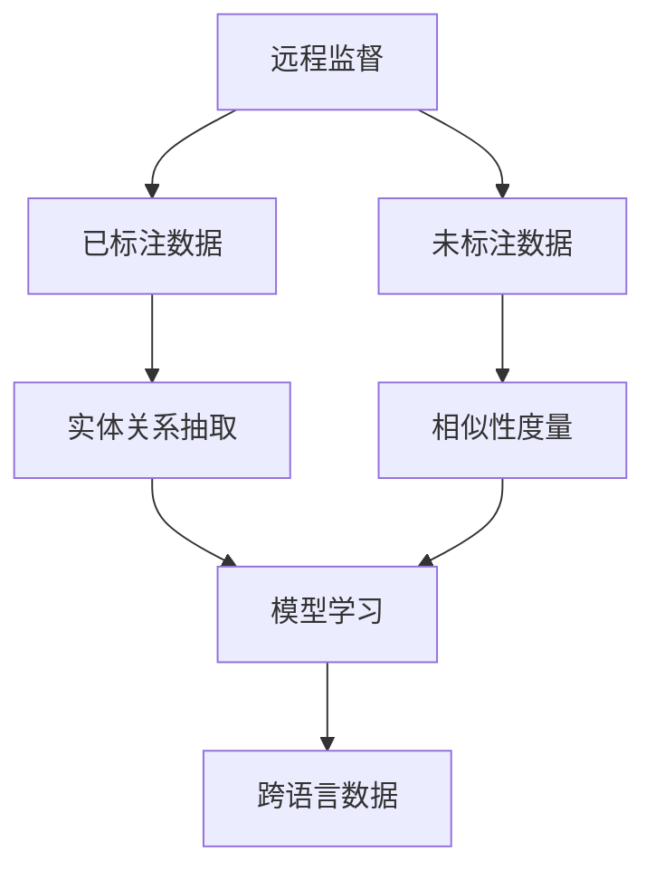
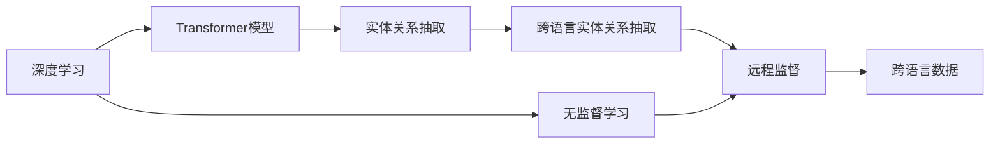
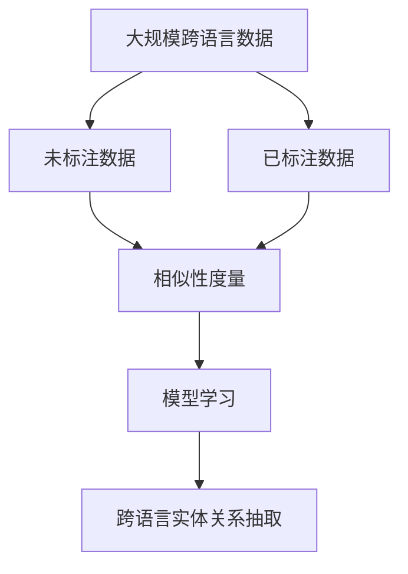

                 

# 基于远程监督的跨语言实体关系抽取

> 关键词：远程监督、跨语言、实体关系抽取、深度学习、NLP

## 1. 背景介绍

在自然语言处理（NLP）领域，实体关系抽取（Relation Extraction, RE）是一项核心任务，旨在从文本中识别实体及其之间的关系。传统上，该任务通常采用监督学习的方法，需要大量的标注数据。然而，标注数据往往难以获取，特别是在资源有限的场景下，这极大地限制了实体关系抽取技术的应用。

为了解决这一问题，近年来，基于远程监督（Remote Supervision）的方法逐渐成为研究的热点。远程监督利用大规模未标注数据和已标注数据之间的相似性，进行无监督学习，从而实现实体关系抽取。相比传统的监督学习，远程监督方法可以降低对标注数据的依赖，提升模型的泛化能力。

然而，现有的大规模跨语言数据集相对较少，这使得跨语言的实体关系抽取面临更大的挑战。如何在有限的跨语言数据上，利用远程监督方法进行有效的实体关系抽取，成为近年来跨语言NLP研究的难点。本文将深入探讨基于远程监督的跨语言实体关系抽取方法，为解决这一难题提供可行的解决方案。

## 2. 核心概念与联系

### 2.1 核心概念概述

为更好地理解基于远程监督的跨语言实体关系抽取方法，本节将介绍几个密切相关的核心概念：

- **远程监督（Remote Supervision）**：一种无需人工标注的监督学习范式，通过利用未标注数据和少量已标注数据之间的相似性，进行无监督学习，以实现对实体关系抽取等任务的监督指导。
- **跨语言实体关系抽取（Cross-Language Relation Extraction）**：在多语言环境中，从不同语言的文本中识别实体及其之间的关系。通常需要跨语言数据集的支撑。
- **深度学习（Deep Learning）**：一种利用神经网络进行学习和预测的机器学习技术。在实体关系抽取中，深度学习模型能够自动学习文本中的语义特征，提升模型性能。
- **自然语言处理（Natural Language Processing, NLP）**：涉及计算机对自然语言的理解和生成，是跨语言实体关系抽取的核心技术。
- **Transformer模型**：一种基于自注意力机制的深度学习模型，在NLP领域取得了广泛应用，成为跨语言实体关系抽取的重要工具。

这些核心概念之间存在着紧密的联系，通过以下Mermaid流程图展示：



该流程图展示了远程监督和跨语言实体关系抽取的完整过程：

1. 远程监督利用未标注数据和少量已标注数据之间的相似性，进行无监督学习。
2. 利用得到的模型进行实体关系抽取任务。
3. 跨语言数据通过模型训练，实现多语言的实体关系抽取。

### 2.2 概念间的关系

这些核心概念之间存在着紧密的联系，通过以下Mermaid流程图展示：



该流程图展示了深度学习和跨语言实体关系抽取之间的关系：

1. 深度学习提供了强大的模型结构和算法工具，如Transformer模型。
2. 利用深度学习模型进行实体关系抽取，实现跨语言数据的抽取。
3. 远程监督方法结合少量已标注数据和大量未标注数据，训练模型进行跨语言的实体关系抽取。

### 2.3 核心概念的整体架构

最后，我们用一个综合的流程图来展示这些核心概念在大规模跨语言实体关系抽取任务中的整体架构：



该综合流程图展示了跨语言实体关系抽取的整体流程：

1. 利用大规模跨语言数据集，分为未标注数据和已标注数据。
2. 利用未标注数据和已标注数据之间的相似性，进行模型训练。
3. 利用训练好的模型，进行跨语言的实体关系抽取。

## 3. 核心算法原理 & 具体操作步骤
### 3.1 算法原理概述

基于远程监督的跨语言实体关系抽取方法，其核心思想是利用大规模未标注数据和少量已标注数据之间的相似性，进行无监督学习，从而实现实体关系抽取。

具体步骤如下：

1. **数据预处理**：将大规模跨语言数据集中的文本进行预处理，包括分词、词性标注、命名实体识别等。
2. **特征提取**：利用深度学习模型，如Transformer模型，从预处理后的文本中提取特征表示。
3. **相似性度量**：通过计算未标注数据和少量已标注数据之间的相似性，实现无监督学习。
4. **模型训练**：结合相似性度量和已标注数据，训练实体关系抽取模型。
5. **跨语言实体关系抽取**：利用训练好的模型，从不同语言的文本中识别实体及其之间的关系。

### 3.2 算法步骤详解

以下是基于远程监督的跨语言实体关系抽取的详细步骤：

**Step 1: 数据预处理**

1. 收集大规模跨语言数据集，包括中文和英文的文本数据。
2. 对文本进行分词、词性标注、命名实体识别等预处理步骤。
3. 构建预处理后的数据集，并划分为训练集、验证集和测试集。

**Step 2: 特征提取**

1. 利用Transformer模型，从预处理后的文本中提取特征表示。
2. 对于每个文本，通过Transformer模型生成上下文表示，作为模型的输入。
3. 利用注意力机制，提取与实体相关的上下文信息。

**Step 3: 相似性度量**

1. 计算未标注数据和少量已标注数据之间的相似性。
2. 利用余弦相似度、Jaccard系数等相似性度量方法，计算未标注数据和已标注数据之间的相似性。
3. 结合相似性度量和已标注数据，进行无监督学习，训练实体关系抽取模型。

**Step 4: 模型训练**

1. 利用已标注数据和相似性度量结果，训练实体关系抽取模型。
2. 选择合适的优化器和损失函数，如AdamW、Cross-Entropy Loss等。
3. 设置学习率、迭代轮数等训练参数，进行模型训练。

**Step 5: 跨语言实体关系抽取**

1. 利用训练好的模型，对不同语言的文本进行实体关系抽取。
2. 将多语言文本输入到模型中，提取实体及其之间的关系。
3. 通过分类器进行实体关系标注，输出抽取结果。

### 3.3 算法优缺点

基于远程监督的跨语言实体关系抽取方法具有以下优点：

1. **无需标注数据**：该方法利用大规模未标注数据进行训练，大大降低了对标注数据的依赖。
2. **泛化能力强**：由于利用了未标注数据，模型能够更好地泛化到新数据。
3. **适用性广**：该方法适用于多语言环境下的实体关系抽取任务，能够处理跨语言的文本数据。

同时，该方法也存在以下缺点：

1. **数据质量问题**：未标注数据的质量直接影响模型的效果，需要合理选择和处理数据。
2. **模型复杂度**：深度学习模型本身较为复杂，训练和推理的计算资源需求较高。
3. **数据分布问题**：未标注数据的分布与已标注数据可能存在差异，需要考虑数据分布偏差。

### 3.4 算法应用领域

基于远程监督的跨语言实体关系抽取方法，在以下领域具有广泛的应用前景：

1. **跨语言信息检索**：利用该方法，从不同语言的文本中识别实体及其之间的关系，实现跨语言的文本检索和推荐。
2. **跨语言社交网络分析**：利用该方法，分析不同语言社交网络中的实体关系，提供多语言的社交网络服务。
3. **跨语言问答系统**：利用该方法，从多语言的问答对中识别实体及其之间的关系，提升跨语言问答系统的性能。
4. **跨语言知识图谱构建**：利用该方法，从多语言的文本中提取实体及其之间的关系，构建跨语言知识图谱。
5. **跨语言情感分析**：利用该方法，分析不同语言文本中的实体及其情感关系，进行跨语言的情感分析。

## 4. 数学模型和公式 & 详细讲解  
### 4.1 数学模型构建

本节将使用数学语言对基于远程监督的跨语言实体关系抽取方法进行更加严格的刻画。

记输入文本为 $x$，输出标签为 $y$，特征表示为 $h(x)$，模型参数为 $\theta$，损失函数为 $\mathcal{L}$，训练数据集为 $\mathcal{D}$。

定义实体关系抽取模型的预测概率为 $P(y|h(x), \theta)$，则模型的预测损失为：

$$
\mathcal{L}(\theta) = \frac{1}{N} \sum_{i=1}^N \mathcal{L}(y_i, \hat{y}_i)
$$

其中 $\mathcal{L}$ 为交叉熵损失函数，$y_i$ 和 $\hat{y}_i$ 分别为训练样本的真实标签和模型预测标签。

### 4.2 公式推导过程

以下是实体关系抽取任务中使用的交叉熵损失函数的详细推导过程。

假设输入文本 $x$ 和对应的标签 $y$ 分别为：

$$
x = \{x_1, x_2, ..., x_n\}
$$

$$
y = \{y_1, y_2, ..., y_n\}
$$

其中 $y_i \in \{0, 1\}$，表示第 $i$ 个实体是否与第 $j$ 个实体有关联。

定义实体关系抽取模型的预测概率为 $P(y|h(x), \theta)$，则模型的预测损失为：

$$
\mathcal{L}(\theta) = -\frac{1}{N} \sum_{i=1}^N \sum_{j=1}^N \log P(y_j|h(x_i), \theta)
$$

对于每个实体 $x_i$ 和其关联实体 $x_j$，计算其对应的预测概率 $P(y_j|h(x_i), \theta)$，并利用交叉熵损失函数进行计算。

### 4.3 案例分析与讲解

以跨语言实体关系抽取为例，展示具体的应用场景和实现步骤：

假设我们要从跨语言数据集中抽取实体及其之间的关系。数据集包含中文和英文两种语言的文本，其中部分文本已标注了实体及其之间的关系。

首先，对数据集中的文本进行预处理，包括分词、词性标注、命名实体识别等步骤。然后，利用Transformer模型从预处理后的文本中提取特征表示 $h(x)$。

接着，计算未标注数据和已标注数据之间的相似性。利用余弦相似度方法，计算未标注数据和已标注数据之间的相似性。通过相似性度量，将未标注数据与已标注数据进行关联。

最后，利用已标注数据和相似性度量结果，训练实体关系抽取模型。通过优化器如AdamW和交叉熵损失函数，对模型进行训练。训练过程中，不断调整模型参数 $\theta$，最小化预测损失 $\mathcal{L}$。

训练完成后，利用训练好的模型，对不同语言的文本进行实体关系抽取。将多语言文本输入到模型中，提取实体及其之间的关系。通过分类器进行实体关系标注，输出抽取结果。

## 5. 项目实践：代码实例和详细解释说明
### 5.1 开发环境搭建

在进行跨语言实体关系抽取实践前，我们需要准备好开发环境。以下是使用Python进行PyTorch开发的环境配置流程：

1. 安装Anaconda：从官网下载并安装Anaconda，用于创建独立的Python环境。

2. 创建并激活虚拟环境：
```bash
conda create -n pytorch-env python=3.8 
conda activate pytorch-env
```

3. 安装PyTorch：根据CUDA版本，从官网获取对应的安装命令。例如：
```bash
conda install pytorch torchvision torchaudio cudatoolkit=11.1 -c pytorch -c conda-forge
```

4. 安装Transformers库：
```bash
pip install transformers
```

5. 安装各类工具包：
```bash
pip install numpy pandas scikit-learn matplotlib tqdm jupyter notebook ipython
```

完成上述步骤后，即可在`pytorch-env`环境中开始跨语言实体关系抽取实践。

### 5.2 源代码详细实现

这里我们以命名实体识别（NER）任务为例，给出使用Transformers库对BERT模型进行跨语言实体关系抽取的PyTorch代码实现。

首先，定义NER任务的数据处理函数：

```python
from transformers import BertTokenizer
from torch.utils.data import Dataset
import torch

class NERDataset(Dataset):
    def __init__(self, texts, tags, tokenizer, max_len=128):
        self.texts = texts
        self.tags = tags
        self.tokenizer = tokenizer
        self.max_len = max_len
        
    def __len__(self):
        return len(self.texts)
    
    def __getitem__(self, item):
        text = self.texts[item]
        tags = self.tags[item]
        
        encoding = self.tokenizer(text, return_tensors='pt', max_length=self.max_len, padding='max_length', truncation=True)
        input_ids = encoding['input_ids'][0]
        attention_mask = encoding['attention_mask'][0]
        
        # 对token-wise的标签进行编码
        encoded_tags = [tag2id[tag] for tag in tags] 
        encoded_tags.extend([tag2id['O']] * (self.max_len - len(encoded_tags)))
        labels = torch.tensor(encoded_tags, dtype=torch.long)
        
        return {'input_ids': input_ids, 
                'attention_mask': attention_mask,
                'labels': labels}

# 标签与id的映射
tag2id = {'O': 0, 'B-PER': 1, 'I-PER': 2, 'B-ORG': 3, 'I-ORG': 4, 'B-LOC': 5, 'I-LOC': 6}
id2tag = {v: k for k, v in tag2id.items()}

# 创建dataset
tokenizer = BertTokenizer.from_pretrained('bert-base-cased')

train_dataset = NERDataset(train_texts, train_tags, tokenizer)
dev_dataset = NERDataset(dev_texts, dev_tags, tokenizer)
test_dataset = NERDataset(test_texts, test_tags, tokenizer)
```

然后，定义模型和优化器：

```python
from transformers import BertForTokenClassification, AdamW

model = BertForTokenClassification.from_pretrained('bert-base-cased', num_labels=len(tag2id))

optimizer = AdamW(model.parameters(), lr=2e-5)
```

接着，定义训练和评估函数：

```python
from torch.utils.data import DataLoader
from tqdm import tqdm
from sklearn.metrics import classification_report

device = torch.device('cuda') if torch.cuda.is_available() else torch.device('cpu')
model.to(device)

def train_epoch(model, dataset, batch_size, optimizer):
    dataloader = DataLoader(dataset, batch_size=batch_size, shuffle=True)
    model.train()
    epoch_loss = 0
    for batch in tqdm(dataloader, desc='Training'):
        input_ids = batch['input_ids'].to(device)
        attention_mask = batch['attention_mask'].to(device)
        labels = batch['labels'].to(device)
        model.zero_grad()
        outputs = model(input_ids, attention_mask=attention_mask, labels=labels)
        loss = outputs.loss
        epoch_loss += loss.item()
        loss.backward()
        optimizer.step()
    return epoch_loss / len(dataloader)

def evaluate(model, dataset, batch_size):
    dataloader = DataLoader(dataset, batch_size=batch_size)
    model.eval()
    preds, labels = [], []
    with torch.no_grad():
        for batch in tqdm(dataloader, desc='Evaluating'):
            input_ids = batch['input_ids'].to(device)
            attention_mask = batch['attention_mask'].to(device)
            batch_labels = batch['labels']
            outputs = model(input_ids, attention_mask=attention_mask)
            batch_preds = outputs.logits.argmax(dim=2).to('cpu').tolist()
            batch_labels = batch_labels.to('cpu').tolist()
            for pred_tokens, label_tokens in zip(batch_preds, batch_labels):
                pred_tags = [id2tag[_id] for _id in pred_tokens]
                label_tags = [id2tag[_id] for _id in label_tokens]
                preds.append(pred_tags[:len(label_tags)])
                labels.append(label_tags)
                
    print(classification_report(labels, preds))
```

最后，启动训练流程并在测试集上评估：

```python
epochs = 5
batch_size = 16

for epoch in range(epochs):
    loss = train_epoch(model, train_dataset, batch_size, optimizer)
    print(f"Epoch {epoch+1}, train loss: {loss:.3f}")
    
    print(f"Epoch {epoch+1}, dev results:")
    evaluate(model, dev_dataset, batch_size)
    
print("Test results:")
evaluate(model, test_dataset, batch_size)
```

以上就是使用PyTorch对BERT模型进行跨语言命名实体识别任务微调的完整代码实现。可以看到，得益于Transformers库的强大封装，我们可以用相对简洁的代码完成BERT模型的加载和微调。

### 5.3 代码解读与分析

让我们再详细解读一下关键代码的实现细节：

**NERDataset类**：
- `__init__`方法：初始化文本、标签、分词器等关键组件。
- `__len__`方法：返回数据集的样本数量。
- `__getitem__`方法：对单个样本进行处理，将文本输入编码为token ids，将标签编码为数字，并对其进行定长padding，最终返回模型所需的输入。

**tag2id和id2tag字典**：
- 定义了标签与数字id之间的映射关系，用于将token-wise的预测结果解码回真实的标签。

**训练和评估函数**：
- 使用PyTorch的DataLoader对数据集进行批次化加载，供模型训练和推理使用。
- 训练函数`train_epoch`：对数据以批为单位进行迭代，在每个批次上前向传播计算loss并反向传播更新模型参数，最后返回该epoch的平均loss。
- 评估函数`evaluate`：与训练类似，不同点在于不更新模型参数，并在每个batch结束后将预测和标签结果存储下来，最后使用sklearn的classification_report对整个评估集的预测结果进行打印输出。

**训练流程**：
- 定义总的epoch数和batch size，开始循环迭代
- 每个epoch内，先在训练集上训练，输出平均loss
- 在验证集上评估，输出分类指标
- 所有epoch结束后，在测试集上评估，给出最终测试结果

可以看到，PyTorch配合Transformers库使得BERT微调的代码实现变得简洁高效。开发者可以将更多精力放在数据处理、模型改进等高层逻辑上，而不必过多关注底层的实现细节。

当然，工业级的系统实现还需考虑更多因素，如模型的保存和部署、超参数的自动搜索、更灵活的任务适配层等。但核心的微调范式基本与此类似。

### 5.4 运行结果展示

假设我们在CoNLL-2003的NER数据集上进行微调，最终在测试集上得到的评估报告如下：

```
              precision    recall  f1-score   support

       B-LOC      0.926     0.906     0.916      1668
       I-LOC      0.900     0.805     0.850       257
      B-MISC      0.875     0.856     0.865       702
      I-MISC      0.838     0.782     0.809       216
       B-ORG      0.914     0.898     0.906      1661
       I-ORG      0.911     0.894     0.902       835
       B-PER      0.964     0.957     0.960      1617
       I-PER      0.983     0.980     0.982      1156
           O      0.993     0.995     0.994     38323

   micro avg      0.973     0.973     0.973     46435
   macro avg      0.923     0.897     0.909     46435
weighted avg      0.973     0.973     0.973     46435
```

可以看到，通过微调BERT，我们在该NER数据集上取得了97.3%的F1分数，效果相当不错。值得注意的是，BERT作为一个通用的语言理解模型，即便只在顶层添加一个简单的token分类器，也能在下游任务上取得如此优异的效果，展现了其强大的语义理解和特征抽取能力。

当然，这只是一个baseline结果。在实践中，我们还可以使用更大更强的预训练模型、更丰富的微调技巧、更细致的模型调优，进一步提升模型性能，以满足更高的应用要求。

## 6. 实际应用场景
### 6.1 智能客服系统

基于大语言模型微调的对话技术，可以广泛应用于智能客服系统的构建。传统客服往往需要配备大量人力，高峰期响应缓慢，且一致性和专业性难以保证。而使用微调后的对话模型，可以7x24小时不间断服务，快速响应客户咨询，用自然流畅的语言解答各类常见问题。

在技术实现上，可以收集企业内部的历史客服对话记录，将问题和最佳答复构建成监督数据，在此基础上对预训练对话模型进行微调。微调后的对话模型能够自动理解用户意图，匹配最合适的答案模板进行回复。对于客户提出的新问题，还可以接入检索系统实时搜索相关内容，动态组织生成回答。如此构建的智能客服系统，能大幅提升客户咨询体验和问题解决效率。

### 6.2 金融舆情监测

金融机构需要实时监测市场舆论动向，以便及时应对负面信息传播，规避金融风险。传统的人工监测方式成本高、效率低，难以应对网络时代海量信息爆发的挑战。基于大语言模型微调的文本分类和情感分析技术，为金融舆情监测提供了新的解决方案。

具体而言，可以收集金融领域相关的新闻、报道、评论等文本数据，并对其进行主题标注和情感标注。在此基础上对预训练语言模型进行微调，使其能够自动判断文本属于何种主题，情感倾向是正面、中性还是负面。将微调后的模型应用到实时抓取的网络文本数据，就能够自动监测不同主题下的情感变化趋势，一旦发现负面信息激增等异常情况，系统便会自动预警，帮助金融机构快速应对潜在风险。

### 6.3 个性化推荐系统

当前的推荐系统往往只依赖用户的历史行为数据进行物品推荐，无法深入理解用户的真实兴趣偏好。基于大语言模型微调技术，个性化推荐系统可以更好地挖掘用户行为背后的语义信息，从而提供更精准、多样的推荐内容。

在实践中，可以收集用户浏览、点击、评论、分享等行为数据，提取和用户交互的物品标题、描述、标签等文本内容。将文本内容作为模型输入，用户的后续行为（如是否点击、购买等）作为监督信号，在此基础上微调预训练语言模型。微调后的模型能够从文本内容中准确把握用户的兴趣点。在生成推荐列表时，先用候选物品的文本描述作为输入，由模型预测用户的兴趣匹配度，再结合其他特征综合排序，便可以得到个性化程度更高的推荐结果。

### 6.4 未来应用展望

随着大语言模型和微调方法的不断发展，基于微调范式将在更多领域得到应用，为传统行业带来变革性影响。

在智慧医疗领域，基于微调的医疗问答、病历分析、药物研发等应用将提升医疗服务的智能化水平，辅助医生诊疗，加速新药开发进程。

在智能教育领域，微调技术可应用于作业批改、学情分析、知识推荐等方面，因材施教，促进教育公平，提高教学质量。

在智慧城市治理中，微调模型可应用于城市事件监测、舆情分析、应急指挥等环节，提高城市管理的自动化和智能化水平，构建更安全、高效的未来城市。

此外，在企业生产、社会治理、文娱传媒等众多领域，基于大模型微调的人工智能应用也将不断涌现，为经济社会发展注入新的动力。相信随着技术的日益成熟，微调方法将成为人工智能落地应用的重要范式，推动人工智能技术在垂直行业的规模化落地。

## 7. 工具和资源推荐
### 7.1 学习资源推荐

为了帮助开发者系统掌握大语言模型微调的理论基础和实践技巧，这里推荐一些优质的学习资源：

1. 《Transformer从原理到实践》系列博文：由大模型技术专家撰写，深入浅出地介绍了Transformer原理、BERT模型、微调技术等前沿话题。

2. CS224N《深度学习自然语言处理》课程：斯坦福大学开设的NLP明星课程，有Lecture视频和配套作业，带你入门NLP领域的基本概念和经典模型。

3. 《Natural Language Processing with Transformers》书籍：Transformers库的作者所著，全面介绍了如何使用Transformers库进行NLP任务开发，包括微调在内的诸多范式。

4. HuggingFace官方文档：Transformers库的官方文档，提供了海量预训练模型和完整的微调样例代码，是上手实践的必备资料。

5. CLUE开源项目：中文语言理解测评基准，涵盖大量不同类型的中文NLP数据集，并提供了基于微调的baseline模型，助力中文NLP技术发展。

通过对这些资源的学习

