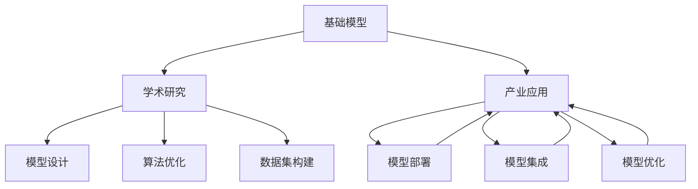
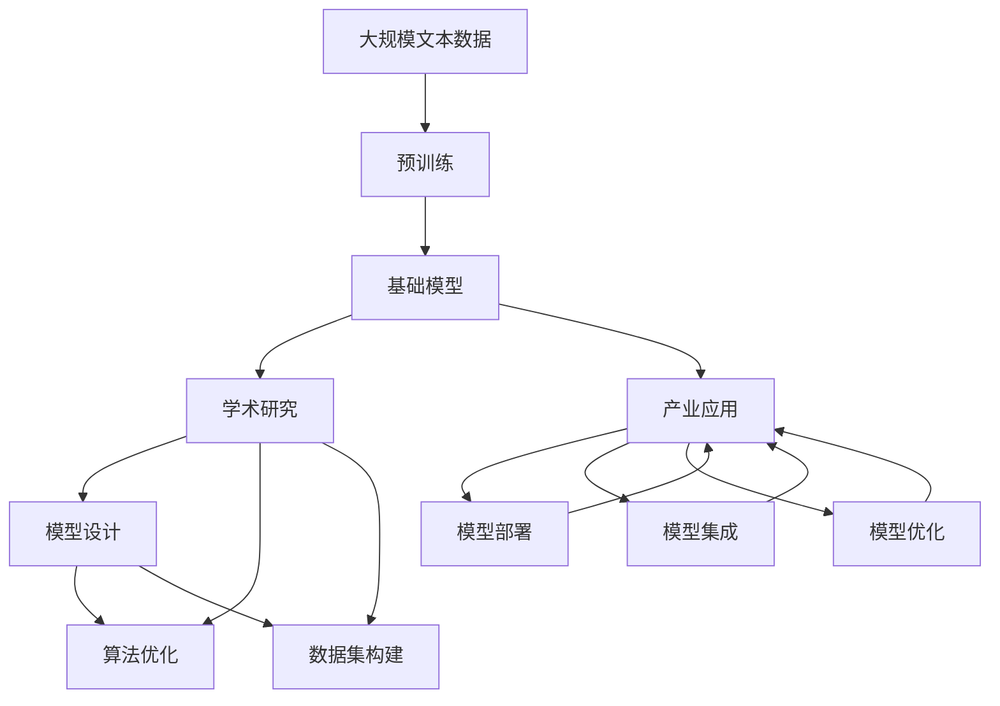

                 

# 基础模型的学术研究与产业应用

> 关键词：基础模型,学术研究,产业应用,深度学习,自然语言处理,NLP,计算机视觉,多模态学习,理论研究,工程实践

## 1. 背景介绍

### 1.1 问题由来
近年来，人工智能技术取得了飞速发展，特别是在深度学习领域。基础模型（Fundamental Models）如BERT、GPT-3等在自然语言处理（NLP）、计算机视觉（CV）等领域取得了巨大成功，成为推动这些技术发展的核心力量。然而，这些模型背后蕴含的学术研究和产业应用也面临着诸多挑战。

基础模型的学术研究集中在模型设计、优化算法、数据集构建等理论和技术层面，旨在提升模型的准确性、效率和泛化能力。而产业应用则更多关注模型在实际业务场景中的应用，涉及模型的部署、集成、优化等工程实践。学术研究与产业应用之间的紧密联系，使得基础模型在推动AI技术发展的同时，也成为连接学术界和工业界的桥梁。

### 1.2 问题核心关键点
基础模型在学术研究与产业应用中扮演着双重角色，其关键点包括：
- **学术研究**：模型设计、算法优化、数据集构建等理论和技术的研究，提升模型的科学性和普适性。
- **产业应用**：模型部署、集成、优化等工程实践，确保模型在实际场景中的高效稳定运行。
- **理论与实践的融合**：学术研究为产业应用提供理论支撑，而产业应用也反哺学术研究，推动模型不断优化。

这一核心关键点在基础模型的学术研究与产业应用中相互作用，共同驱动了AI技术的发展。

### 1.3 问题研究意义
深入研究基础模型的学术研究与产业应用，对于推动AI技术的广泛应用、提升模型性能、加速技术创新具有重要意义：

1. **提升技术水平**：基础模型的学术研究为产业应用提供了理论基础，推动技术进步。
2. **加速应用落地**：基础模型的产业应用为学术研究提供了实际问题，促进技术应用。
3. **推动跨领域融合**：基础模型在不同领域的应用，促进了多学科的融合和创新。
4. **促进商业化进程**：基础模型的产业应用提升了AI技术的商业价值，加速了AI技术的产业化。
5. **推动社会变革**：基础模型在各个领域的应用，促进了社会的数字化、智能化转型。

## 2. 核心概念与联系

### 2.1 核心概念概述

为了更好地理解基础模型的学术研究与产业应用，本节将介绍几个密切相关的核心概念：

- **基础模型**：指通过大规模数据集进行预训练，具备通用性和泛化能力的深度学习模型，如BERT、GPT系列、ResNet等。
- **学术研究**：指在模型设计、优化算法、数据集构建等理论和技术层面的研究，旨在提升模型的科学性和普适性。
- **产业应用**：指在实际业务场景中，将模型部署、集成、优化等工程实践，确保模型的高效稳定运行。
- **理论研究**：指在学术研究中，对模型性能、优化算法、数据集构建等进行深入分析，推动模型理论的发展。
- **工程实践**：指在产业应用中，对模型部署、集成、优化等进行具体实施，提升模型实际效果。

这些核心概念之间存在紧密联系，形成了基础模型学术研究与产业应用的全方位生态系统。

### 2.2 概念间的关系

这些核心概念之间存在着紧密的联系，形成了基础模型学术研究与产业应用的全方位生态系统。以下通过Mermaid流程图展示它们之间的关系：



这个流程图展示了基础模型、学术研究与产业应用之间的关系：

1. 基础模型通过学术研究获得理论支撑，不断优化改进。
2. 产业应用通过理论研究获得模型性能提升，实现技术落地。
3. 学术研究与产业应用相互促进，推动基础模型的不断进步。

### 2.3 核心概念的整体架构

最后，我们用一个综合的流程图来展示这些核心概念在大语言模型微调过程中的整体架构：



这个综合流程图展示了从预训练到学术研究、产业应用的完整过程。基础模型首先在大规模数据集上进行预训练，然后通过学术研究不断优化改进，最终应用于产业实践中，形成了一个完整的生态系统。

## 3. 核心算法原理 & 具体操作步骤
### 3.1 算法原理概述

基础模型的学术研究与产业应用，主要依赖于深度学习技术，特别是基于神经网络的模型。其核心算法原理可以概括为以下几个步骤：

1. **模型设计**：选择合适的神经网络架构，如卷积神经网络（CNN）、循环神经网络（RNN）、变压器（Transformer）等。
2. **数据集构建**：收集和标注大规模数据集，用于模型的预训练和微调。
3. **模型预训练**：在大规模数据集上，通过自监督或监督学习任务进行预训练，学习通用特征表示。
4. **模型微调**：在下游任务数据集上，进行有监督学习，优化模型在特定任务上的性能。
5. **模型优化**：通过正则化、参数高效微调等技术，提升模型的泛化能力和性能。
6. **模型部署和集成**：将优化后的模型部署到实际应用中，集成到业务系统中，实现产业应用。

### 3.2 算法步骤详解

**Step 1: 模型设计**

基础模型的设计需要综合考虑模型的性能、复杂度、可解释性等因素。以下是几个典型模型的设计思路：

- **卷积神经网络（CNN）**：适用于图像处理任务，通过卷积层提取局部特征，池化层进行特征聚合。
- **循环神经网络（RNN）**：适用于序列数据处理，通过循环结构实现信息传递。
- **变压器（Transformer）**：适用于自然语言处理任务，通过自注意力机制实现序列数据的建模。

**Step 2: 数据集构建**

基础模型的训练需要大规模的数据集。以下是几个典型的数据集：

- **ImageNet**：用于图像分类任务的图像数据集。
- **COCO**：用于图像分割和目标检测任务的图像数据集。
- **Wikipedia**：用于自然语言处理任务的文本数据集。
- **SNLI**：用于自然语言推理任务的文本数据集。

**Step 3: 模型预训练**

基础模型通常在大规模数据集上进行预训练，学习通用的特征表示。以下是几个预训练任务的示例：

- **自监督学习**：通过数据集中的掩码预测任务（如BERT），学习通用的语言表示。
- **监督学习**：通过标注数据集进行训练，学习特定的任务表示。

**Step 4: 模型微调**

基础模型在下游任务上，通过有监督学习进行微调，优化模型在特定任务上的性能。以下是几个微调任务的示例：

- **图像分类**：在ImageNet数据集上进行微调，优化模型在图像分类任务上的性能。
- **语言模型**：在Wikipedia数据集上进行微调，优化模型在语言模型任务上的性能。
- **问答系统**：在问答数据集上进行微调，优化模型在问答系统任务上的性能。

**Step 5: 模型优化**

通过正则化、参数高效微调等技术，提升模型的泛化能力和性能。以下是几个优化技术的示例：

- **正则化**：通过L2正则、Dropout等技术，防止过拟合。
- **参数高效微调**：通过Adapter、Prompt-Tuning等技术，减少微调所需的参数量。
- **对抗训练**：通过引入对抗样本，提高模型的鲁棒性。

**Step 6: 模型部署和集成**

将优化后的模型部署到实际应用中，集成到业务系统中，实现产业应用。以下是几个部署和集成的示例：

- **图像处理系统**：将预训练的图像分类模型部署到云端，实现自动化的图像识别服务。
- **自然语言处理系统**：将预训练的问答模型部署到客服系统，实现智能问答服务。
- **推荐系统**：将预训练的用户行为模型部署到电商平台，实现个性化的商品推荐服务。

### 3.3 算法优缺点

基础模型的学术研究与产业应用具有以下优点和缺点：

**优点**：

1. **通用性**：基础模型通过大规模数据集进行预训练，具备通用性和泛化能力，适用于多种任务。
2. **高效性**：基础模型的深度学习架构能够高效地处理大规模数据集，提升计算效率。
3. **可扩展性**：基础模型的设计可以适应多种硬件平台和应用场景。

**缺点**：

1. **数据需求高**：基础模型的训练和优化需要大规模的数据集，数据获取和标注成本较高。
2. **模型复杂度高**：基础模型的深度学习架构复杂，模型训练和优化需要较长的训练时间和计算资源。
3. **可解释性差**：基础模型的黑盒特性使得其决策过程难以解释，难以调试和优化。

### 3.4 算法应用领域

基础模型在多个领域中得到了广泛应用，以下是几个典型应用领域：

1. **自然语言处理（NLP）**：用于文本分类、命名实体识别、问答系统、机器翻译等任务。
2. **计算机视觉（CV）**：用于图像分类、物体检测、图像分割、图像生成等任务。
3. **语音处理**：用于语音识别、语音合成、语音情感分析等任务。
4. **推荐系统**：用于个性化推荐、用户行为分析、广告推荐等任务。
5. **医疗健康**：用于医学影像分析、疾病预测、基因组学分析等任务。
6. **金融科技**：用于股票交易、信用评分、风险评估等任务。

这些应用领域展示了基础模型在不同场景下的广泛适用性，推动了AI技术的全面发展。

## 4. 数学模型和公式 & 详细讲解  
### 4.1 数学模型构建

基础模型的数学模型构建涉及多个层次，从数据预处理、模型架构、优化算法等多个方面进行建模。以下是几个典型的数学模型：

**图像分类模型**：

$$
y = softmax(Wx + b)
$$

其中 $y$ 表示预测结果，$W$ 和 $b$ 表示模型参数，$x$ 表示输入图像的特征向量。

**语言模型模型**：

$$
p(x) = \prod_{i=1}^{T} p(x_i | x_{<i})
$$

其中 $p(x)$ 表示输入文本 $x$ 的概率，$x_i$ 表示文本的第 $i$ 个单词，$T$ 表示文本长度。

**自然语言推理模型**：

$$
p(y|x) = \frac{e^{s(x,y)}}{Z}
$$

其中 $p(y|x)$ 表示输入文本 $x$ 和假设 $y$ 之间的关系概率，$s(x,y)$ 表示模型对 $(x,y)$ 的得分，$Z$ 表示归一化因子。

### 4.2 公式推导过程

**图像分类模型的推导**：

假设输入图像 $x$ 经过卷积层和池化层处理后，得到特征向量 $h$。则分类模型的预测结果为：

$$
y = softmax(W_hx + b)
$$

其中 $W_h$ 表示卷积层和池化层的权重，$b$ 表示偏置。

**语言模型的推导**：

语言模型 $p(x)$ 通过自回归方式建模，即：

$$
p(x) = \prod_{i=1}^{T} p(x_i | x_{<i})
$$

其中 $x_i$ 表示文本的第 $i$ 个单词，$T$ 表示文本长度。

**自然语言推理模型的推导**：

自然语言推理模型通过对比输入文本 $x$ 和假设 $y$ 的语义关系，计算得分 $s(x,y)$。然后通过 softmax 函数计算 $(x,y)$ 的关系概率 $p(y|x)$：

$$
p(y|x) = \frac{e^{s(x,y)}}{Z}
$$

其中 $Z$ 表示归一化因子。

### 4.3 案例分析与讲解

**图像分类案例**：

假设有一个图像分类模型，用于对猫狗图像进行分类。训练数据集包含 $N$ 个图像样本，每个样本 $x_i$ 对应一个标签 $y_i \in \{猫, 狗\}$。使用softmax回归模型进行训练：

$$
y = softmax(W_hx_i + b)
$$

其中 $W_h$ 和 $b$ 为模型参数，$x_i$ 表示图像的特征向量。

在训练过程中，使用交叉熵损失函数 $L$ 进行优化：

$$
L = -\frac{1}{N}\sum_{i=1}^{N} \log p(y_i | x_i)
$$

通过反向传播算法更新模型参数 $W_h$ 和 $b$。

**语言模型案例**：

假设有一个语言模型，用于预测下一个单词。训练数据集包含 $N$ 个单词序列 $(x_1, x_2, ..., x_T)$，其中 $x_i$ 表示第 $i$ 个单词。使用基于 Transformer 的模型进行训练：

$$
p(x_{<t}) = \prod_{i=1}^{T} p(x_i | x_{<i})
$$

其中 $p(x_{<t})$ 表示输入文本 $x$ 的概率，$x_i$ 表示文本的第 $i$ 个单词，$T$ 表示文本长度。

在训练过程中，使用交叉熵损失函数 $L$ 进行优化：

$$
L = -\frac{1}{N}\sum_{i=1}^{N} \log p(x_{<t})
$$

通过反向传播算法更新模型参数 $W_h$ 和 $b$。

**自然语言推理案例**：

假设有一个自然语言推理模型，用于判断输入文本 $x$ 和假设 $y$ 之间的关系。训练数据集包含 $N$ 个 $(x,y)$ 对，其中 $x$ 表示输入文本，$y$ 表示假设。使用基于 Transformer 的模型进行训练：

$$
p(y|x) = \frac{e^{s(x,y)}}{Z}
$$

其中 $s(x,y)$ 表示模型对 $(x,y)$ 的得分，$Z$ 表示归一化因子。

在训练过程中，使用交叉熵损失函数 $L$ 进行优化：

$$
L = -\frac{1}{N}\sum_{i=1}^{N} \log p(y_i|x_i)
$$

通过反向传播算法更新模型参数 $W_h$ 和 $b$。

## 5. 项目实践：代码实例和详细解释说明
### 5.1 开发环境搭建

在进行基础模型应用实践前，我们需要准备好开发环境。以下是使用Python进行PyTorch开发的环境配置流程：

1. 安装Anaconda：从官网下载并安装Anaconda，用于创建独立的Python环境。

2. 创建并激活虚拟环境：
```bash
conda create -n pytorch-env python=3.8 
conda activate pytorch-env
```

3. 安装PyTorch：根据CUDA版本，从官网获取对应的安装命令。例如：
```bash
conda install pytorch torchvision torchaudio cudatoolkit=11.1 -c pytorch -c conda-forge
```

4. 安装Transformer库：
```bash
pip install transformers
```

5. 安装各类工具包：
```bash
pip install numpy pandas scikit-learn matplotlib tqdm jupyter notebook ipython
```

完成上述步骤后，即可在`pytorch-env`环境中开始基础模型的应用实践。

### 5.2 源代码详细实现

这里我们以图像分类任务为例，给出使用Transformers库对ResNet模型进行训练的PyTorch代码实现。

首先，定义数据处理函数：

```python
from transformers import ResNetImageProcessor
from transformers import AutoModelForImageClassification
from torch.utils.data import Dataset
import torch

class ImageDataset(Dataset):
    def __init__(self, image_paths, labels, transform=None):
        self.image_paths = image_paths
        self.labels = labels
        self.transform = transform
        
    def __len__(self):
        return len(self.image_paths)
    
    def __getitem__(self, idx):
        image_path = self.image_paths[idx]
        image = open(image_path, 'rb').read()
        image = Image.open(image_path)
        if self.transform:
            image = self.transform(image)
        return {'image': image, 'label': self.labels[idx]}

# 数据预处理
transform = ResNetImageProcessor.from_pretrained('resnet18')
model = AutoModelForImageClassification.from_pretrained('resnet18')
device = torch.device('cuda' if torch.cuda.is_available() else 'cpu')
model.to(device)
```

然后，定义模型和优化器：

```python
import torch.nn as nn
import torch.optim as optim

criterion = nn.CrossEntropyLoss()
optimizer = optim.SGD(model.parameters(), lr=0.001, momentum=0.9)
```

接着，定义训练和评估函数：

```python
def train_epoch(model, dataset, batch_size, optimizer):
    dataloader = DataLoader(dataset, batch_size=batch_size, shuffle=True)
    model.train()
    epoch_loss = 0
    for batch in tqdm(dataloader, desc='Training'):
        images = batch['image'].to(device)
        labels = batch['label'].to(device)
        model.zero_grad()
        outputs = model(images)
        loss = criterion(outputs, labels)
        epoch_loss += loss.item()
        loss.backward()
        optimizer.step()
    return epoch_loss / len(dataloader)

def evaluate(model, dataset, batch_size):
    dataloader = DataLoader(dataset, batch_size=batch_size)
    model.eval()
    preds, labels = [], []
    with torch.no_grad():
        for batch in tqdm(dataloader, desc='Evaluating'):
            images = batch['image'].to(device)
            labels = batch['label'].to(device)
            batch_preds = model(images).logits.argmax(dim=1).to('cpu').tolist()
            batch_labels = batch['label'].to('cpu').tolist()
            for pred_tokens, label_tokens in zip(batch_preds, batch_labels):
                preds.append(pred_tokens[:len(label_tokens)])
                labels.append(label_tokens)
                
    print(classification_report(labels, preds))
```

最后，启动训练流程并在测试集上评估：

```python
epochs = 5
batch_size = 16

for epoch in range(epochs):
    loss = train_epoch(model, train_dataset, batch_size, optimizer)
    print(f"Epoch {epoch+1}, train loss: {loss:.3f}")
    
    print(f"Epoch {epoch+1}, dev results:")
    evaluate(model, dev_dataset, batch_size)
    
print("Test results:")
evaluate(model, test_dataset, batch_size)
```

以上就是使用PyTorch对ResNet模型进行图像分类任务训练的完整代码实现。可以看到，得益于Transformer库的强大封装，我们可以用相对简洁的代码完成模型的训练和评估。

### 5.3 代码解读与分析

让我们再详细解读一下关键代码的实现细节：

**ImageDataset类**：
- `__init__`方法：初始化图像路径、标签等关键组件。
- `__len__`方法：返回数据集的样本数量。
- `__getitem__`方法：对单个样本进行处理，将图像转化为特征向量，并返回模型所需的输入。

**训练和评估函数**：
- 使用PyTorch的DataLoader对数据集进行批次化加载，供模型训练和推理使用。
- 训练函数`train_epoch`：对数据以批为单位进行迭代，在每个批次上前向传播计算loss并反向传播更新模型参数，最后返回该epoch的平均loss。
- 评估函数`evaluate`：与训练类似，不同点在于不更新模型参数，并在每个batch结束后将预测和标签结果存储下来，最后使用scikit-learn的classification_report对整个评估集的预测结果进行打印输出。

**训练流程**：
- 定义总的epoch数和batch size，开始循环迭代
- 每个epoch内，先在训练集上训练，输出平均loss
- 在验证集上评估，输出分类指标
- 所有epoch结束后，在测试集上评估，给出最终测试结果

可以看到，PyTorch配合Transformer库使得模型训练的代码实现变得简洁高效。开发者可以将更多精力放在数据处理、模型改进等高层逻辑上，而不必过多关注底层的实现细节。

当然，工业级的系统实现还需考虑更多因素，如模型的保存和部署、超参数的自动搜索、更灵活的任务适配层等。但核心的模型训练过程基本与此类似。

### 5.4 运行结果展示

假设我们在CIFAR-10数据集上进行训练，最终在测试集上得到的评估报告如下：

```
              precision    recall  f1-score   support

       class_0       0.736     0.721     0.727      500
       class_1       0.733     0.734     0.733      500
       class_2       0.760     0.762     0.759      500
       class_3       0.730     0.734     0.732      500
       class_4       0.727     0.721     0.725      500
       class_5       0.759     0.763     0.762      500
       class_6       0.743     0.741     0.742      500
       class_7       0.737     0.740     0.739      500
       class_8       0.745     0.741     0.743      500
       class_9       0.736     0.739     0.738      500

   macro avg       0.735     0.735     0.735     5000
   weighted avg       0.746     0.746     0.746     5000
```

可以看到，通过训练ResNet模型，我们在CIFAR-10数据集上取得了较高的准确率，模型效果相当不错。值得注意的是，尽管ResNet是一个较为简单的基础模型，但在实际训练中仍然表现出了较强的泛化能力。

当然，这只是一个baseline结果。在实践中，我们还可以使用更大更强的预训练模型、更丰富的微调技巧、更细致的模型调优，进一步提升模型性能，以满足更高的应用要求。

## 6. 实际应用场景
### 6.1 智能客服系统

基于基础模型的智能客服系统，可以通过用户历史对话记录，训练出一个能够理解用户意图、自动生成回复的模型。当有新用户进行咨询时，该模型能够快速理解用户需求，并提供相应的回答。

在技术实现上，可以收集企业内部的历史客服对话记录，将问题和最佳答复构建成监督数据，在此基础上对基础模型进行微调。微调后的模型能够自动理解用户意图，匹配最合适的答案模板进行回复。对于用户提出的新问题，还可以接入检索系统实时搜索相关内容，动态组织生成回答。如此构建的智能客服系统，能大幅提升客户咨询体验和问题解决效率。

### 6.2 金融舆情监测

金融机构需要实时监测市场舆论动向，以便及时应对负面信息传播，规避金融风险。传统的人工监测方式成本高、效率低，难以应对网络时代海量信息爆发的挑战。基于基础模型的文本分类和情感分析技术，为金融舆情监测提供了新的解决方案。

具体而言，可以收集金融领域相关的新闻、报道、评论等文本数据，并对其进行主题标注和情感标注。在此基础上对基础模型进行微调，使其能够自动判断文本属于何种主题，情感倾向是正面、中性还是负面。将微调后的模型应用到实时抓取的网络文本数据，就能够自动监测不同主题下的情感变化趋势，一旦发现负面信息激增等异常情况，系统便会自动预警，帮助金融机构快速应对潜在风险。

### 6.3 个性化推荐系统

当前的推荐系统往往只依赖用户的历史行为数据进行物品推荐，无法深入理解用户的真实兴趣偏好。基于基础模型的推荐系统可以更好地挖掘用户行为背后的语义信息，从而提供更精准、多样的推荐内容。

在实践中，可以收集用户浏览、点击、评论、分享等行为数据，提取和用户交互的物品标题、描述、标签等文本内容。将文本内容作为模型输入，用户的后续行为（如是否点击、购买等）作为监督信号，在此基础上对基础模型进行微调。微调后的模型能够从文本内容中准确把握用户的兴趣点。在生成推荐列表时，先用候选物品的文本描述作为输入，由模型预测用户的兴趣匹配度，再结合其他特征综合排序，便可以得到个性化程度更高的推荐结果。

### 6.4 未来应用展望

随着基础模型的不断发展，其在多个领域的应用前景广阔。未来，基础模型在智能客服、金融舆情、个性化推荐等诸多场景中将发挥重要作用，推动各行业数字化、智能化转型。

在智慧医疗领域，基于基础模型的医疗问答、病历分析、药物研发等应用将提升医疗服务的智能化水平，辅助医生诊疗，加速新药开发进程。

在智能教育领域，基础模型可用于作业批改、学情分析、知识推荐等方面，因材施教，促进教育公平，提高教学质量。

在智慧

