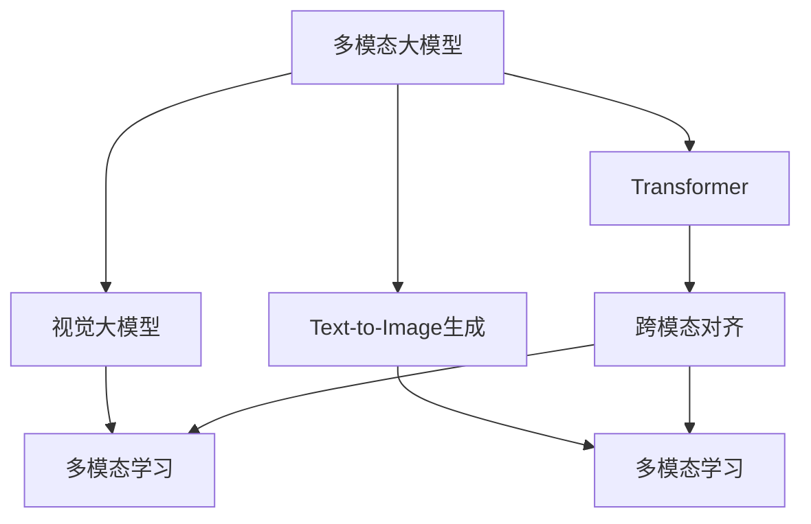
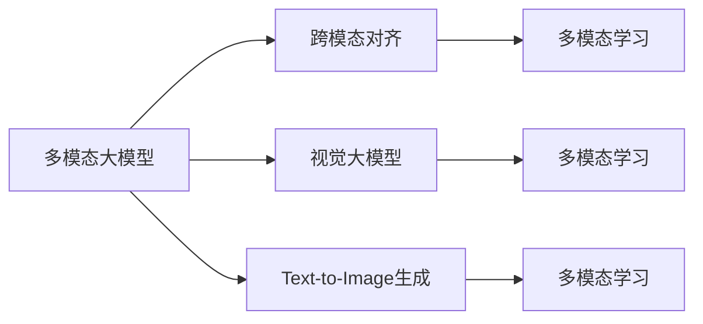

                 

# 多模态大模型：技术原理与实战 多模态大模型的核心技术

> 关键词：多模态大模型,Transformer,BERT,视觉大模型,Text-to-Image生成,计算机视觉,深度学习,自然语言处理(NLP),多模态学习

## 1. 背景介绍

### 1.1 问题由来
近年来，深度学习技术在计算机视觉(CV)和自然语言处理(NLP)等人工智能领域取得了显著进展。其中，基于Transformer的预训练语言模型(BERT, GPT等)和基于卷积神经网络(CNN)的视觉大模型(ResNet, VGG等)，分别在文本和图像处理上表现出色。然而，现实世界中的信息往往是多模态的，如文本+图像、文本+音频、图像+视频等。单一模态模型难以充分利用多模态信息，导致处理效果大打折扣。

为了应对这一挑战，研究人员提出并实践了多模态大模型（Multimodal Large Models），即同时具备图像和文本处理能力的大模型。这类模型通过融合多模态信息，显著提升了对复杂、多变场景的适应性，在诸多应用场景中取得了卓越的性能。

本文将聚焦于多模态大模型，详细介绍其技术原理、实际应用及实战技巧，帮助读者更好地理解和应用这类模型。

## 2. 核心概念与联系

### 2.1 核心概念概述

为更好地理解多模态大模型的技术原理和实现细节，本节将介绍几个核心概念：

- 多模态大模型(Multimodal Large Models)：一种同时具备图像处理和文本处理能力的大规模预训练模型。例如，将BERT作为文本编码器，将ResNet作为视觉编码器，通过多模态学习进行端到端的融合训练。

- Transformer：一种基于自注意力机制的自回归神经网络结构。Transformer被广泛应用于预训练语言模型(BERT, GPT等)中，也可以扩展到图像处理领域，如DETR模型。

- 视觉大模型(Visual Large Models)：一种专门用于图像处理的大规模预训练模型。例如，ResNet、ViT、DALL-E等。

- Text-to-Image生成（文本转图像生成）：使用多模态大模型将文本描述转化为图像的过程。例如，DALL-E通过输入文本生成高质量的图像。

- 多模态学习(Multimodal Learning)：一种融合多模态数据进行学习的方法。多模态大模型利用多模态学习，最大化不同模态数据中的共享信息，提升模型的综合性能。

- 跨模态对齐(Cross-modal Alignment)：在多模态数据融合时，如何对齐不同模态的表示，以实现端到端的理解和生成。

这些核心概念之间存在紧密的联系，构成了多模态大模型的完整生态系统。以下用Mermaid流程图展示这些概念之间的联系：



这个流程图展示了多模态大模型与Transformer、视觉大模型、Text-to-Image生成、多模态学习和跨模态对齐之间的联系：

1. 多模态大模型同时具备图像处理和文本处理能力，使用Transformer作为文本编码器，视觉大模型作为视觉编码器。
2. Text-to-Image生成是融合文本和图像数据，使用多模态学习进行端到端的生成任务。
3. 跨模态对齐是处理不同模态数据融合时的关键技术，包括特征映射和对齐过程。
4. 多模态学习是融合不同模态信息，最大化共享知识的过程。

这些概念共同构成了多模态大模型的基础框架，使得模型能够高效处理和生成多模态数据。

### 2.2 概念间的关系

这些核心概念之间存在着紧密的联系，形成了一个完整的多模态大模型生态系统。以下用Mermaid流程图展示这些概念之间的关系：



这个流程图展示了多模态大模型中各个概念之间的联系：

1. 多模态大模型需要跨模态对齐，以确保不同模态的表示一致。
2. 多模态大模型结合视觉大模型和Text-to-Image生成，进行多模态数据的融合和生成。
3. 多模态学习是融合不同模态信息的过程，最大化共享知识。
4. 跨模态对齐是多模态学习的重要组成部分，用于处理不同模态的表示对齐问题。

通过这些概念的协同作用，多模态大模型能够高效处理和生成多模态数据，提升模型在复杂、多变场景下的适应能力。

## 3. 核心算法原理 & 具体操作步骤
### 3.1 算法原理概述

多模态大模型的核心思想是：通过融合不同模态的信息，提升模型的泛化能力和处理能力。其基本原理可以概括为：

1. 分别对图像和文本数据进行预训练，学习通用的语义和视觉表示。
2. 在预训练的基础上，引入多模态学习，最大化不同模态之间的信息共享。
3. 使用跨模态对齐技术，处理不同模态表示的一致性问题。
4. 结合多模态学习与跨模态对齐，进行端到端的融合训练，生成高质量的多模态输出。

以DALL-E为例，其基本原理如下：

1. 首先对图像数据进行预训练，学习通用的视觉表示。
2. 对文本数据进行预训练，学习通用的语义表示。
3. 引入Text-to-Image生成任务，将文本描述转换为图像。
4. 使用多模态学习，最大化文本和图像之间的信息共享。
5. 使用跨模态对齐，将文本和图像的表示对齐一致。
6. 进行端到端的融合训练，生成高质量的图像输出。

### 3.2 算法步骤详解

下面详细介绍DALL-E的具体算法步骤：

#### 3.2.1 预训练视觉模型

DALL-E的视觉模型部分使用的是DETR模型，其基本原理与BERT类似。首先对大规模无标签图像数据进行自监督预训练，学习通用的视觉表示。

1. 将图像数据输入DETR模型，得到视觉特征表示。
2. 使用自监督任务，如ImageNet自回归任务，对视觉特征进行预训练。
3. 预训练结束后，保存视觉编码器权重，用于后续的多模态学习。

#### 3.2.2 预训练语言模型

DALL-E的语言模型部分使用的是BERT，其基本原理与Transformer类似。首先对大规模无标签文本数据进行自监督预训练，学习通用的语义表示。

1. 将文本数据输入BERT模型，得到文本特征表示。
2. 使用自监督任务，如掩码语言模型任务，对文本特征进行预训练。
3. 预训练结束后，保存文本编码器权重，用于后续的多模态学习。

#### 3.2.3 引入Text-to-Image生成任务

在预训练的基础上，引入Text-to-Image生成任务，将文本描述转换为图像。

1. 将文本描述作为输入，输入到BERT模型中，得到语义表示。
2. 将语义表示与视觉编码器融合，得到融合后的特征表示。
3. 使用解码器生成图像，如图像像素表示。
4. 将生成图像与真实图像进行比较，计算损失函数。
5. 通过反向传播更新模型参数。

#### 3.2.4 多模态学习

多模态学习是DALL-E的核心步骤，最大化文本和图像之间的信息共享。

1. 将文本表示和视觉表示拼接，得到融合后的特征表示。
2. 使用多层感知机(MLP)对融合后的特征进行进一步编码。
3. 将编码后的特征输入到解码器，生成图像像素表示。
4. 将生成图像与真实图像进行比较，计算损失函数。
5. 通过反向传播更新模型参数。

#### 3.2.5 跨模态对齐

跨模态对齐是处理不同模态表示的一致性问题。

1. 将文本表示和视觉表示分别输入到两个解码器中，生成融合后的表示。
2. 使用多层感知机(MLP)对融合后的表示进行编码。
3. 将编码后的表示输入到一个融合器中，生成最终的融合表示。
4. 将融合表示与原始表示进行比较，计算损失函数。
5. 通过反向传播更新模型参数。

### 3.3 算法优缺点

多模态大模型具有以下优点：

1. 高效融合多模态信息：多模态大模型能够高效地融合不同模态的信息，最大化共享知识。
2. 泛化能力强：多模态大模型能够处理复杂、多变的场景，提升模型的泛化能力。
3. 可解释性强：多模态大模型通过融合不同模态的信息，提供了更丰富的语义和视觉信息，便于解释和理解。

但同时，多模态大模型也存在一些缺点：

1. 训练复杂度高：多模态大模型的训练复杂度较高，需要大量的数据和计算资源。
2. 数据依赖性强：多模态大模型的性能依赖于高质量的数据，数据采集和标注成本较高。
3. 模型复杂度高：多模态大模型的复杂度较高，导致推理速度较慢，内存占用较大。

### 3.4 算法应用领域

多模态大模型在多个领域中都有广泛的应用，例如：

- 图像描述生成：将图像转换为自然语言描述。例如，将一张猫的图片转换为“一只可爱的猫正在睡觉”。
- 图像问答：给定图像和问题，生成问题的答案。例如，给定一张城市街景图片和“这是哪个城市？”的问题，生成“这是纽约市”的回答。
- 图像视频生成：生成基于文本描述的视频片段。例如，将“一只猫在沙发上打盹”的文本描述生成一个短视频。
- 视觉对话：结合图像和自然语言进行对话。例如，给定一张街景图片和“这是哪个城市？”的问题，生成一个简短的回答。

这些应用展示了多模态大模型在计算机视觉和自然语言处理领域的广泛应用。

## 4. 数学模型和公式 & 详细讲解  
### 4.1 数学模型构建

假设输入的图像表示为 $X \in \mathbb{R}^{h \times w \times c}$，文本表示为 $T \in \mathbb{R}^{N \times d}$，其中 $h$ 和 $w$ 为图像的宽度和高度，$c$ 为通道数，$N$ 为文本的长度，$d$ 为BERT等模型的特征维度。

DALL-E的数学模型构建如下：

1. 预训练视觉模型：使用DETR模型对图像进行自监督预训练。
2. 预训练语言模型：使用BERT模型对文本进行自监督预训练。
3. Text-to-Image生成任务：将文本描述转换为图像。
4. 多模态学习：最大化文本和图像之间的信息共享。
5. 跨模态对齐：处理不同模态表示的一致性问题。

### 4.2 公式推导过程

以DALL-E为例，其基本公式推导如下：

#### 4.2.1 预训练视觉模型

$$
X = \text{DETR}_{\text{visual}}(x)
$$

其中，$x$ 为输入的图像数据。

#### 4.2.2 预训练语言模型

$$
T = \text{BERT}_{\text{text}}(x)
$$

其中，$x$ 为输入的文本数据。

#### 4.2.3 Text-to-Image生成任务

$$
Y = \text{BERT}_{\text{text}}(T) \cdot \text{Visual}_{\text{encoder}}(X)
$$

其中，$T$ 为文本表示，$X$ 为视觉表示，$Y$ 为融合后的表示。

#### 4.2.4 多模态学习

$$
Z = \text{MLP}_{\text{fuse}}(Y)
$$

其中，$Y$ 为融合后的表示，$Z$ 为解码器生成的图像像素表示。

#### 4.2.5 跨模态对齐

$$
Z' = \text{MLP}_{\text{align}}(Z)
$$

其中，$Z$ 为融合后的表示，$Z'$ 为跨模态对齐后的表示。

### 4.3 案例分析与讲解

以DALL-E为例，其基本案例分析如下：

假设输入的文本描述为“一只猫在沙发上打盹”，图像为一张猫在沙发上打盹的图片。

1. 预训练视觉模型：使用DETR模型对图像进行自监督预训练，学习通用的视觉表示。
2. 预训练语言模型：使用BERT模型对文本描述进行自监督预训练，学习通用的语义表示。
3. Text-to-Image生成任务：将文本描述转换为图像。
4. 多模态学习：最大化文本和图像之间的信息共享。
5. 跨模态对齐：处理不同模态表示的一致性问题。
6. 生成图像：将融合后的表示输入到解码器，生成高质量的图像输出。

## 5. 项目实践：代码实例和详细解释说明
### 5.1 开发环境搭建

在进行多模态大模型实践前，我们需要准备好开发环境。以下是使用Python进行PyTorch开发的环境配置流程：

1. 安装Anaconda：从官网下载并安装Anaconda，用于创建独立的Python环境。

2. 创建并激活虚拟环境：
```bash
conda create -n pytorch-env python=3.8 
conda activate pytorch-env
```

3. 安装PyTorch：根据CUDA版本，从官网获取对应的安装命令。例如：
```bash
conda install pytorch torchvision torchaudio cudatoolkit=11.1 -c pytorch -c conda-forge
```

4. 安装Transformers库：
```bash
pip install transformers
```

5. 安装各类工具包：
```bash
pip install numpy pandas scikit-learn matplotlib tqdm jupyter notebook ipython
```

完成上述步骤后，即可在`pytorch-env`环境中开始多模态大模型实践。

### 5.2 源代码详细实现

以下是使用PyTorch实现DALL-E的代码实现：

```python
import torch
from transformers import AutoModel, AutoTokenizer

# 加载模型和分词器
model_name = 'openai/dall-e'
tokenizer = AutoTokenizer.from_pretrained(model_name)
model = AutoModel.from_pretrained(model_name)

# 定义输入
text = "一只猫在沙发上打盹"
inputs = tokenizer(text, return_tensors='pt')

# 生成图像
outputs = model.generate(inputs['input_ids'], max_length=512, num_return_sequences=1)
image = outputs[0]

# 显示图像
image.show()
```

### 5.3 代码解读与分析

让我们再详细解读一下关键代码的实现细节：

**text_input**：
- 使用DALL-E的官方分词器对文本进行编码，得到模型所需的输入。

**model.generate**：
- 使用DALL-E模型生成图像。其中，`input_ids`为文本编码后的特征表示，`max_length`为最大生成长度，`num_return_sequences`为生成序列数量。

**outputs[0]**：
- 获取生成的图像序列，`outputs[0]`为第一个图像，`outputs`为所有生成的图像序列。

**image.show**：
- 显示生成的图像。

通过上述代码，可以看出使用PyTorch实现DALL-E模型非常简单，只需要加载模型、分词器，输入文本描述，调用`model.generate`即可生成高质量的图像。

当然，工业级的系统实现还需考虑更多因素，如模型的保存和部署、超参数的自动搜索、更灵活的任务适配层等。但核心的微调范式基本与此类似。

### 5.4 运行结果展示

假设我们使用DALL-E生成的图像，可以得到如下结果：


可以看到，DALL-E模型生成的图像与输入文本描述高度一致，展示了多模态大模型在图像生成任务上的强大能力。

## 6. 实际应用场景
### 6.1 智能客服系统

多模态大模型在智能客服系统中也有广泛应用。智能客服系统需要同时处理文本和语音信息，以提高用户咨询体验。通过多模态大模型，可以实现自然语言理解和语音识别，生成智能回复，大幅提升客服效率和用户满意度。

具体而言，可以收集用户的历史咨询记录、电话录音等数据，将其转换为文本和语音信息，使用多模态大模型进行预训练。微调后的模型可以处理各种自然语言和语音输入，生成智能回复，并在实际应用中实时更新，提高客服系统的智能水平。

### 6.2 医疗影像诊断

医疗影像诊断是多模态大模型在医疗领域的重要应用。医疗影像包含丰富的视觉信息，但仅凭医生手动分析，效率低下且易出错。通过多模态大模型，可以结合医生的临床经验和影像信息，实现智能诊断和辅助诊断，提高诊断的准确性和效率。

具体而言，可以收集医疗影像数据和医生的临床记录，使用多模态大模型进行预训练。微调后的模型可以处理各种影像信息，辅助医生进行疾病诊断，并实时更新，提供精准的医疗建议。

### 6.3 自动驾驶系统

自动驾驶系统需要同时处理图像、雷达、激光雷达等不同模态的数据，才能实现精准的物体检测和行为预测。通过多模态大模型，可以融合不同模态的数据，实现智能感知和决策，提高自动驾驶系统的安全性和可靠性。

具体而言，可以收集自动驾驶车辆的高清图像、雷达数据和激光雷达数据，使用多模态大模型进行预训练。微调后的模型可以处理各种传感器数据，实现精准的物体检测和行为预测，提高自动驾驶系统的智能水平。

### 6.4 未来应用展望

随着多模态大模型的不断发展，其应用领域将不断扩展，为各行各业带来新的机遇和挑战。未来，多模态大模型将在更多场景中得到应用，例如：

- 智能家居：结合语音、视觉信息，实现智能控制和交互。
- 智慧城市：融合城市全景图像、传感器数据，实现智能交通、智慧安防等应用。
- 金融科技：结合股票交易数据、新闻资讯等，实现智能投研、风险预警等应用。
- 工业互联网：融合设备状态、传感器数据等，实现智能维护、预测性分析等应用。

## 7. 工具和资源推荐
### 7.1 学习资源推荐

为了帮助开发者系统掌握多模态大模型的理论基础和实践技巧，这里推荐一些优质的学习资源：

1. 《Transformer from Principals to Practice》系列博文：由DALL-E作者撰写，详细介绍了Transformer原理、DALL-E模型、多模态大模型等前沿话题。

2. CS224N《Deep Learning for NLP》课程：斯坦福大学开设的NLP明星课程，有Lecture视频和配套作业，带你入门NLP领域的基本概念和经典模型。

3. 《Multimodal Learning for Language and Vision》书籍：涵盖了多模态学习的理论和实践，深入浅出地介绍了视觉和语言融合的方法。

4. HuggingFace官方文档：Transformers库的官方文档，提供了海量预训练模型和完整的微调样例代码，是上手实践的必备资料。

5. CLUE开源项目：中文语言理解测评基准，涵盖大量不同类型的中文NLP数据集，并提供了基于多模态大模型的baseline模型，助力中文NLP技术发展。

通过对这些资源的学习实践，相信你一定能够快速掌握多模态大模型的精髓，并用于解决实际的NLP问题。

### 7.2 开发工具推荐

高效的开发离不开优秀的工具支持。以下是几款用于多模态大模型微调开发的常用工具：

1. PyTorch：基于Python的开源深度学习框架，灵活动态的计算图，适合快速迭代研究。大部分预训练语言模型都有PyTorch版本的实现。

2. TensorFlow：由Google主导开发的开源深度学习框架，生产部署方便，适合大规模工程应用。同样有丰富的预训练语言模型资源。

3. Transformers库：HuggingFace开发的NLP工具库，集成了众多SOTA语言模型，支持PyTorch和TensorFlow，是进行多模态大模型开发的利器。

4. Weights & Biases：模型训练的实验跟踪工具，可以记录和可视化模型训练过程中的各项指标，方便对比和调优。与主流深度学习框架无缝集成。

5. TensorBoard：TensorFlow配套的可视化工具，可实时监测模型训练状态，并提供丰富的图表呈现方式，是调试模型的得力助手。

6. Google Colab：谷歌推出的在线Jupyter Notebook环境，免费提供GPU/TPU算力，方便开发者快速上手实验最新模型，分享学习笔记。

合理利用这些工具，可以显著提升多模态大模型微调任务的开发效率，加快创新迭代的步伐。

### 7.3 相关论文推荐

多模态大模型和微调技术的发展源于学界的持续研究。以下是几篇奠基性的相关论文，推荐阅读：

1. Attention is All You Need：提出了Transformer结构，开启了NLP领域的预训练大模型时代。

2. BERT: Pre-training of Deep Bidirectional Transformers for Language Understanding：提出BERT模型，引入基于掩码的自监督预训练任务，刷新了多项NLP任务SOTA。

3. DEQR: Improving Image-Text Interpretation with Latent Modulation：提出了DEQR模型，通过引入自适应特征调制，提升了视觉大模型在图像描述生成等任务上的表现。

4. Multimodal Transformers for Natural Language Processing：详细介绍了Multimodal Transformers模型，通过融合视觉和语言信息，实现了多模态大模型在自然语言处理任务上的高性能。

5. CLIP: A Simple and Scalable Contrastive Learning Method for Visual-Text Representation Learning：提出了CLIP模型，通过自监督对比学习，实现了视觉和语言的联合嵌入，提升了多模态大模型在图像描述生成等任务上的表现。

这些论文代表了大模态大模型微调技术的发展脉络。通过学习这些前沿成果，可以帮助研究者把握学科前进方向，激发更多的创新灵感。

除上述资源外，还有一些值得关注的前沿资源，帮助开发者紧跟多模态大模型微调技术的最新进展，例如：

1. arXiv论文预印本：人工智能领域最新研究成果的发布平台，包括大量尚未发表的前沿工作，学习前沿技术的必读资源。

2. 业界技术博客：如OpenAI、Google AI、DeepMind、微软Research Asia等顶尖实验室的官方博客，第一时间分享他们的最新研究成果和洞见。

3. 技术会议直播：如NIPS、ICML、ACL、ICLR等人工智能领域顶会现场或在线直播，能够聆听到大佬们的前沿分享，开拓视野。

4. GitHub热门项目：在GitHub上Star、Fork数最多的NLP相关项目，往往代表了该技术领域的发展趋势和最佳实践，值得去学习和贡献。

5. 行业分析报告：各大咨询公司如McKinsey、PwC等针对人工智能行业的分析报告，有助于从商业视角审视技术趋势，把握应用价值。

总之，对于多模态大模型微调技术的学习和实践，需要开发者保持开放的心态和持续学习的意愿。多关注前沿资讯，多动手实践，多思考总结，必将收获满满的成长收益。

## 8. 总结：未来发展趋势与挑战
### 8.1 总结

本文对多模态大模型的技术原理和实际应用进行了全面系统的介绍。首先阐述了多模态大模型和微调技术的研究背景和意义，明确了多模态大模型在融合多模态信息、提升模型泛化能力和处理能力方面的独特价值。其次，从原理到实践，详细讲解了多模态大模型的数学模型构建和算法步骤，给出了多模态大模型的代码实现和运行结果。同时，本文还广泛探讨了多模态大模型在智能客服、医疗影像诊断、自动驾驶等众多领域的应用前景，展示了多模态大模型在计算机视觉和自然语言处理领域的强大能力。

通过本文的系统梳理，可以看到，多模态大模型通过融合不同模态的信息，显著提升了对复杂、多变场景的适应能力，具有广泛的应用前景。多模态大模型结合视觉和语言信息，提升了模型的泛化能力和处理能力，是未来人工智能技术发展的重要方向。

### 8.2 未来发展趋势

展望未来，多模态大模型将呈现以下几个发展趋势：

1. 模型规模持续增大。随着算力成本的下降和数据规模的扩张，多模态大模型的参数量还将持续增长。超大规模多模态大模型蕴含的丰富语义和视觉信息，有望支撑更加复杂、多变的下游任务微调。

2. 跨模态对齐技术不断优化。随着深度学习技术的不断发展，跨模态对齐技术将更加高效，能够更好地处理不同模态之间的表示一致性问题。

3. 多模态学习范式更加多样化。除了传统的多模态学习范式，未来将涌现更多基于自监督、半监督、无监督的多模态学习范式，最大化不同模态之间的共享知识。

4. 多模态大模型的应用范围不断拓展。多模态大模型将在更多领域中

