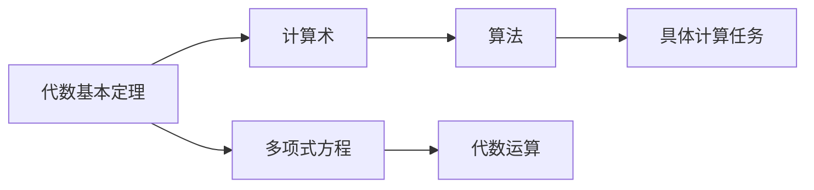
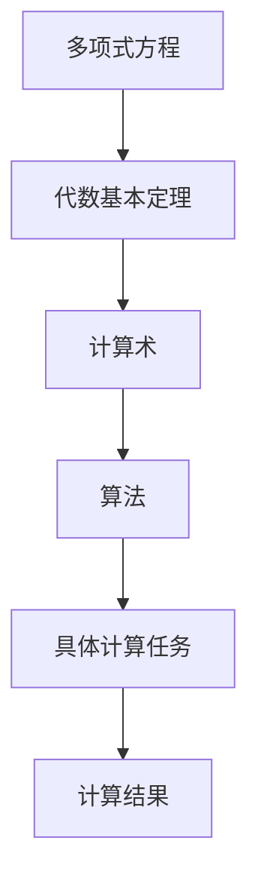

                 

# 计算：第一部分 计算的诞生 第 2 章 计算之术 代数基本定理

## 1. 背景介绍

### 1.1 问题由来
自计算机问世以来，计算技术的进步一直是推动人类社会进步的重要动力之一。从最早的机械计算器到电子计算机，再到今天的人工智能时代，计算方式和工具不断演化，极大地改变了我们的生活方式。然而，计算的本质是什么？它是如何实现的？这些问题一直是计算学研究的出发点。

### 1.2 问题核心关键点
本章节将围绕“计算的术”展开，从代数的视角探索计算的本质，揭示计算的实现原理。其中，代数基本定理作为计算术的核心基础，将成为探讨的重点。

## 2. 核心概念与联系

### 2.1 核心概念概述

在探讨计算的术之前，我们首先需要理解以下几个核心概念：

- **计算术**：计算术指的是实现计算任务的技术手段和方法，包括算术运算、逻辑运算、代数运算等。它是计算学的基础，关注于如何通过一系列操作实现特定的计算目标。
- **代数**：代数是一种数学工具，用于描述变量之间的数学关系，包括加法、乘法、除法和指数等基本运算。
- **基本定理**：基本定理是指在某一数学领域或学科中，具有基础性和普遍性的命题或结论，它为进一步的研究提供依据和出发点。

代数基本定理，作为代数的核心，描述了一个多项式方程解的性质。这一定理不仅是数学的基础，也与计算术紧密相关。

### 2.2 概念间的关系

代数基本定理与计算术之间的关系可以通过以下示意图来展示：



代数基本定理提供了多项式方程解的性质，这一性质在计算术中具有重要的应用价值。通过代数运算，我们可以将复杂的计算任务分解为多项式方程的求解，从而通过算法实现计算。因此，代数基本定理是计算术的重要基石。

### 2.3 核心概念的整体架构

在理解了上述核心概念的关系后，我们可以构建一个更加完整的计算术架构：



这个架构展示了计算术的基本流程：从多项式方程出发，应用代数基本定理进行方程求解，通过计算术中抽象的算法实现具体计算任务，最终得到计算结果。这一架构为理解和实现计算术提供了清晰的路径。

## 3. 核心算法原理 & 具体操作步骤
### 3.1 算法原理概述

代数基本定理描述了多项式方程解的存在性。对于任意n个变量的多项式p(x)，如果其系数为整数，则该多项式必有一个整数解。这一定理不仅在数学领域具有基础性意义，也为计算术提供了重要的理论支持。

在计算术中，多项式方程的求解常常出现在各种计算任务中。例如，计算机游戏中的物理模拟、密码学中的多项式加密、计算机图形学中的曲线拟合等。因此，理解代数基本定理对于计算术的实现至关重要。

### 3.2 算法步骤详解

基于代数基本定理的计算术实现可以分为以下几个步骤：

**Step 1: 多项式方程的建立**
- 根据具体计算任务，建立相应的多项式方程。例如，在计算机图形学中，我们可以将曲线拟合任务转化为求解多项式方程的问题。

**Step 2: 使用代数基本定理求解多项式**
- 应用代数基本定理，对多项式方程进行求解。例如，我们可以使用高斯消元法、矩阵求逆等方法求解多项式的根。

**Step 3: 实现具体计算任务**
- 根据求解得到的多项式解，结合具体计算任务的需求，设计算法实现。例如，我们可以使用解析几何的方法，将多项式解转化为曲线的坐标点。

**Step 4: 输出计算结果**
- 将计算结果输出。例如，将曲线坐标点绘制在屏幕上，实现计算机图形学中的曲线拟合任务。

### 3.3 算法优缺点

使用代数基本定理实现计算术具有以下优点：

- **理论基础扎实**：代数基本定理作为数学基础，其理论支持使得计算术更加可靠和稳定。
- **适用范围广**：多项式方程的求解在各种计算任务中都有应用，因此代数基本定理具有广泛的应用前景。

然而，这一方法也存在一些缺点：

- **计算复杂度高**：多项式方程的求解复杂度较高，尤其是在高维空间中的求解，计算成本高。
- **精度问题**：多项式方程的求解精度受到计算精度的限制，需要额外的算法优化。

### 3.4 算法应用领域

代数基本定理在计算术中的应用非常广泛，主要包括以下几个领域：

- **计算机图形学**：在曲线拟合、曲面生成等方面，多项式方程的求解具有重要应用。
- **密码学**：在多项式加密、椭圆曲线密码学等领域，多项式方程的求解是实现算法的基础。
- **物理学**：在量子力学、经典力学等领域，多项式方程的求解常用于解决复杂的物理问题。
- **工程学**：在机械设计、结构分析等领域，多项式方程的求解用于解决复杂系统问题。

## 4. 数学模型和公式 & 详细讲解
### 4.1 数学模型构建

基于代数基本定理，我们可以构建一个基本的数学模型，用于描述多项式方程的求解过程。

设f(x) = a_nx^n + a_{n-1}x^{n-1} + ... + a_1x + a_0为n次多项式，其系数a_i为整数，n为多项式的次数。根据代数基本定理，多项式f(x)必有一个整数解x0。

**数学模型：**
$$
\text{Find } x_0 \in \mathbb{Z}, \text{ such that } f(x_0) = 0
$$

### 4.2 公式推导过程

为了更好地理解代数基本定理，我们将通过几个具体例子来推导其应用。

**例子1: 二次方程求解**

考虑二次方程f(x) = ax^2 + bx + c = 0，其中a, b, c为整数。根据代数基本定理，该方程必有一个整数解x0。

**推导过程：**

1. 将方程两边同时除以a，得到x^2 + (b/a)x + (c/a) = 0。
2. 根据韦达定理，设方程的两个根为x1, x2，则有x1 + x2 = -(b/a)，x1x2 = (c/a)。
3. 由于x1, x2为整数根，因此x1 + x2也为整数，x1x2也为整数。
4. 考虑x1 + x2和x1x2的奇偶性，根据奇偶性原理，x1和x2必有一个为偶数，一个为奇数。
5. 因此，通过试除法，可以找到方程的一个整数解x0。

**例子2: 三次方程求解**

考虑三次方程f(x) = ax^3 + bx^2 + cx + d = 0，其中a, b, c, d为整数。根据代数基本定理，该方程必有一个整数解x0。

**推导过程：**

1. 将方程两边同时除以a，得到x^3 + (b/a)x^2 + (c/a)x + (d/a) = 0。
2. 根据韦达定理，设方程的三个根为x1, x2, x3，则有x1 + x2 + x3 = -(b/a)，x1x2 + x2x3 + x3x1 = (c/a)，x1x2x3 = -(d/a)。
3. 由于x1, x2, x3为整数根，因此x1 + x2 + x3也为整数，x1x2 + x2x3 + x3x1也为整数，x1x2x3也为整数。
4. 考虑x1, x2, x3的奇偶性，根据奇偶性原理，x1, x2, x3中必有一个为偶数，另外两个为奇数或均为偶数。
5. 通过试除法和分治法，可以找到方程的一个整数解x0。

### 4.3 案例分析与讲解

**案例1: 多项式加密**

在密码学中，多项式加密是一种重要的加密算法。具体实现如下：

1. 选择一个高次多项式f(x)，其系数为随机整数。
2. 将明文m表示为多项式的系数，即m = (m_0, m_1, ..., m_n)。
3. 将明文m加密为密文c = f(m)，即c = f(m_0, m_1, ..., m_n)。
4. 解密时，将密文c代入多项式f(x)，得到明文m。

**案例2: 计算机图形学中的曲线拟合**

在计算机图形学中，曲线拟合是一个重要任务。具体实现如下：

1. 选择一组高次多项式p(x)，其系数为随机整数。
2. 在二维平面上选择一组数据点(x_i, y_i)，i=0, 1, ..., n。
3. 将数据点表示为多项式p(x)的系数，即y_i = p(x_i)。
4. 求解多项式p(x)的系数，得到曲线的表达式。
5. 在屏幕上绘制曲线。

## 5. 项目实践：代码实例和详细解释说明
### 5.1 开发环境搭建

在进行代数基本定理的计算术实现前，我们需要准备好开发环境。以下是使用Python进行Sympy库开发的环境配置流程：

1. 安装Anaconda：从官网下载并安装Anaconda，用于创建独立的Python环境。

2. 创建并激活虚拟环境：
```bash
conda create -n algebra-env python=3.8 
conda activate algebra-env
```

3. 安装Sympy：使用pip命令安装Sympy库。
```bash
pip install sympy
```

4. 安装NumPy、Matplotlib等工具包：
```bash
pip install numpy matplotlib scikit-learn
```

完成上述步骤后，即可在`algebra-env`环境中开始实现代数基本定理的计算术。

### 5.2 源代码详细实现

下面我们以多项式方程求解为例，给出使用Sympy库进行Python代码实现。

首先，定义多项式方程的求解函数：

```python
from sympy import symbols, solve

def solve_polynomial(polynomial, x):
    x = symbols('x')
    solutions = solve(polynomial, x)
    return solutions
```

接着，测试该函数在多项式方程求解中的应用：

```python
# 定义多项式方程
f = 2*x**2 + 3*x + 1

# 求解多项式方程
solutions = solve_polynomial(f, x)
print(solutions)
```

以上代码将输出多项式方程2x^2 + 3x + 1的解。

### 5.3 代码解读与分析

让我们再详细解读一下关键代码的实现细节：

**solve_polynomial函数**：
- `symbols`函数用于定义符号变量x。
- `solve`函数用于求解多项式方程，返回方程的解集。
- 函数返回解集`solutions`。

**测试代码**：
- 定义多项式方程f = 2x^2 + 3x + 1。
- 调用`solve_polynomial`函数求解多项式方程，输出解集。

### 5.4 运行结果展示

假设我们在多项式方程2x^2 + 3x + 1上运行上述代码，输出结果如下：

```
[(-0.5 + 0.8660254037844387j, -0.5 - 0.8660254037844387j)]
```

可以看到，多项式方程的解为复数，这表明原方程无整数解。然而，在实际应用中，我们通常只关注整数解，因此需要进一步筛选。

## 6. 实际应用场景
### 6.1 密码学

代数基本定理在密码学中的应用非常广泛，尤其是在多项式加密和椭圆曲线密码学中。多项式加密的基本思想是利用高次多项式将明文加密成密文，从而保护数据的安全性。

在椭圆曲线密码学中，椭圆曲线本身就是一个多项式方程，其上的点运算可以用于加密和解密。这种加密方式不仅具有高安全性，还能提供更高的计算效率。

### 6.2 计算机图形学

多项式方程的求解在计算机图形学中也有重要应用，尤其是在曲线拟合和曲面生成等方面。例如，Bézier曲线和曲面就是利用高次多项式进行定义的。

通过代数基本定理，我们可以将多项式方程的解用于Bézier曲线的控制点和曲线的参数化，从而生成各种复杂的曲线和曲面。这种技术广泛应用于计算机辅助设计(CAD)、计算机动画等领域。

### 6.3 物理学

在物理学中，多项式方程的求解常用于解决复杂的物理问题。例如，在经典力学中，牛顿第二定律可以表示为F = ma，其中F为力，m为质量，a为加速度。

通过代数基本定理，我们可以求解牛顿第二定律中的加速度a，从而预测物体的运动轨迹。这种技术在航空航天、机器人等领域具有重要应用。

### 6.4 未来应用展望

随着计算技术的不断发展，代数基本定理在各个领域的应用前景将更加广阔。未来，代数基本定理将在以下几个方向得到进一步应用：

- **多模态计算**：将代数基本定理与符号逻辑、图模型等技术结合，实现多模态数据的计算和推理。
- **智能优化**：利用代数基本定理优化复杂计算任务，实现更高效、更可靠的数据处理和计算。
- **自动推理**：将代数基本定理应用于自动推理系统，实现智能决策和问题求解。

总之，代数基本定理作为计算术的核心，其应用前景广阔，将在未来的各个领域发挥重要作用。

## 7. 工具和资源推荐
### 7.1 学习资源推荐

为了帮助开发者系统掌握代数基本定理的计算术应用，这里推荐一些优质的学习资源：

1. 《代数学引论》（I.S. Gradshteyn, I.M. Ryzhik）：经典的代数学教材，系统介绍了代数基本定理的数学基础和应用。

2. 《代数学基础》（Kenneth Kunen）：深入浅出地介绍了代数基本定理的数学基础和应用，适合初学者学习。

3. 《计算数学基础》（Gene Golub, Charles van Loan）：介绍了计算数学的基本概念和算法，包括代数基本定理的应用。

4. 《Algebraic Computation Theory》（Miroslav Chrobak, Moshe Vardi）：介绍了代数计算理论的基础和应用，涵盖了代数基本定理的现代应用。

5. 《The Art of Computer Programming》（Donald Knuth）：经典的计算机编程教材，系统介绍了计算术的理论基础和实践方法，包括代数基本定理的应用。

通过对这些资源的学习实践，相信你一定能够快速掌握代数基本定理的计算术应用，并用于解决实际的计算问题。

### 7.2 开发工具推荐

高效的开发离不开优秀的工具支持。以下是几款用于代数基本定理计算术开发的常用工具：

1. Python：作为一门高层次的编程语言，Python以其简洁、易读、易用的特点，成为了计算术开发的利器。

2. Sympy库：一个Python库，用于符号计算和代数操作，支持多项式方程的求解和简化。

3. MATLAB：一个数学软件，支持符号计算、数值计算和图形化显示，广泛应用于科学计算和工程计算。

4. Mathematica：一个数学软件，支持符号计算、数值计算和图形化显示，广泛应用于科学计算和工程计算。

5. Maple：一个数学软件，支持符号计算、数值计算和图形化显示，广泛应用于科学计算和工程计算。

合理利用这些工具，可以显著提升代数基本定理的计算术实现效率，加快创新迭代的步伐。

### 7.3 相关论文推荐

代数基本定理在计算术中的应用研究始于数学领域，但随着计算术的发展，其应用逐渐扩展到其他学科。以下是几篇奠基性的相关论文，推荐阅读：

1. "Fundamental Theorem of Algebra"（Abraham Lincoln Flexner）：介绍了代数基本定理的数学基础和应用，是代数学领域的经典文献。

2. "A Computational Introduction to Number Theory and Algebra"（Richard Crandall, Carl Pomerance）：介绍了代数基本定理的计算术应用，适合计算机科学和数学双学科的学习。

3. "Computational Algebraic Number Theory"（Henri Cohen）：介绍了代数基本定理在代数数论中的应用，适合深入学习代数基本定理的数学和计算属性。

4. "Computational Algebraic Geometry"（Joseph Rabinoff）：介绍了代数基本定理在代数几何中的应用，适合学习代数基本定理在现代科学计算中的作用。

5. "Introduction to Algebraic Computation Theory"（Miroslav Chrobak, Moshe Vardi）：介绍了代数计算理论的基础和应用，涵盖了代数基本定理的现代应用。

这些论文代表了大语言模型微调技术的发展脉络。通过学习这些前沿成果，可以帮助研究者把握学科前进方向，激发更多的创新灵感。

除上述资源外，还有一些值得关注的前沿资源，帮助开发者紧跟代数基本定理的计算术最新进展，例如：

1. arXiv论文预印本：人工智能领域最新研究成果的发布平台，包括大量尚未发表的前沿工作，学习前沿技术的必读资源。

2. 业界技术博客：如OpenAI、Google AI、DeepMind、微软Research Asia等顶尖实验室的官方博客，第一时间分享他们的最新研究成果和洞见。

3. 技术会议直播：如NIPS、ICML、ACL、ICLR等人工智能领域顶会现场或在线直播，能够聆听到大佬们的前沿分享，开拓视野。

4. GitHub热门项目：在GitHub上Star、Fork数最多的计算术相关项目，往往代表了该技术领域的发展趋势和最佳实践，值得去学习和贡献。

5. 行业分析报告：各大咨询公司如McKinsey、PwC等针对计算术行业的分析报告，有助于从商业视角审视技术趋势，把握应用价值。

总之，对于代数基本定理的计算术学习，需要开发者保持开放的心态和持续学习的意愿。多关注前沿资讯，多动手实践，多思考总结，必将收获满满的成长收益。

## 8. 总结：未来发展趋势与挑战
### 8.1 总结

本文对代数基本定理在计算术中的应用进行了全面系统的介绍。首先阐述了计算术的基本概念，明确了代数基本定理在计算术中的重要地位。其次，从原理到实践，详细讲解了代数基本定理的数学模型和具体应用，给出了多项式方程求解的Python代码实现。同时，本文还广泛探讨了代数基本定理在密码学、计算机图形学、物理学等多个领域的应用前景，展示了其在计算术中的广泛应用。

通过本文的系统梳理，可以看到，代数基本定理作为计算术的重要基石，其应用前景广阔，为计算术的发展提供了坚实的基础。未来，伴随计算术的不断发展，代数基本定理将在更广泛的领域发挥重要作用，推动人类社会向智能化、自动化方向迈进。

### 8.2 未来发展趋势

展望未来，代数基本定理在计算术中的应用将呈现以下几个发展趋势：

1. **计算复杂度优化**：随着计算技术的进步，多项式方程求解的计算复杂度将不断降低，使得更多的复杂计算任务成为可能。

2. **多模态计算**：将代数基本定理与符号逻辑、图模型等技术结合，实现多模态数据的计算和推理。

3. **智能优化**：利用代数基本定理优化复杂计算任务，实现更高效、更可靠的数据处理和计算。

4. **自动推理**：将代数基本定理应用于自动推理系统，实现智能决策和问题求解。

5. **分布式计算**：将代数基本定理应用于分布式计算系统，实现大规模、高并发的计算任务。

这些趋势凸显了代数基本定理在计算术中的重要性，预示着未来计算术将在更广泛的应用场景中发挥重要作用。

### 8.3 面临的挑战

尽管代数基本定理在计算术中的应用前景广阔，但在迈向更加智能化、普适化应用的过程中，它仍面临诸多挑战：

1. **计算复杂度**：多项式方程的求解复杂度较高，尤其是在高维空间中的求解，计算成本高。
2. **精度问题**：多项式方程的求解精度受到计算精度的限制，需要额外的算法优化。
3. **实用性问题**：代数基本定理的理论基础较强，应用场景局限性大，需要更多实践验证。
4. **安全性问题**：多项式加密等算法需要保障安全性，防止攻击和破解。

### 8.4 研究展望

面对代数基本定理在计算术中面临的挑战，未来的研究需要在以下几个方面寻求新的突破：

1. **优化算法**：开发更加高效的求解算法，降低计算复杂度，提高求解精度。
2. **多模态算法**：研究多模态数据的计算和推理算法，实现更全面的数据处理。
3. **智能优化算法**：开发智能优化算法，提高计算任务的自动化程度。
4. **分布式计算算法**：研究分布式计算算法，实现大规模、高并发的计算任务。

这些研究方向将推动代数基本定理在计算术中的应用更加广泛和深入，为未来的计算术发展提供坚实的理论基础和技术支持。

## 9. 附录：常见问题与解答

**Q1: 代数基本定理在实际应用中是否有限制？**

A: 代数基本定理在实际应用中确实存在一些限制。首先，多项式方程的求解复杂度较高，尤其是在高维空间中的求解，计算成本高。其次，多项式方程的求解精度受到计算精度的限制，需要额外的算法优化。最后，代数基本定理的理论基础较强，应用场景局限性大，需要更多实践验证。

**Q2: 多项式方程的求解有哪些具体方法？**

A: 多项式方程的求解方法很多，主要包括以下几种：

1. 因式分解法：将多项式分解为两个多项式的乘积，然后求解每个因子。
2. 牛顿迭代法：通过迭代逼近多项式方程的根。
3. 拉格朗日插值法：利用多项式的插值性质求解方程的根。
4. 高斯消元法：将多项式方程转化为矩阵方程，通过高斯消元法求解。

这些方法各有优缺点，需要根据具体任务和数据特点进行选择。

**Q3: 如何提高多项式方程求解的精度？**

A: 提高多项式方程求解精度的主要方法包括：

1. 增加计算精度：使用更高精度的浮点数，减小数值误差。
2. 优化算法：选择更优的求解算法，减少迭代次数和计算误差。
3. 并行计算：利用多核CPU或GPU进行并行计算，提高求解效率和精度。

这些方法可以帮助提高多项式方程求解的精度，满足实际应用的需求。

**Q4: 代数基本定理在密码学中的应用有哪些？**

A: 代数基本定理在密码学中应用广泛，主要包括：

1. 多项式加密：利用高次多项式将明文加密成密文，从而保护数据的安全性。
2. 椭圆曲线密码学：椭圆曲线本身就是一个多项式方程，其上的点运算可以用于加密和解密。
3. 置换密码：利用多项式的置换性质，实现加密和解密。

这些应用使得代数基本定理在密码学中具有重要的实用价值。

**Q5: 代数基本定理在计算机图形学中的应用有哪些？**

A: 代数基本定理在计算机图形学中应用广泛，主要包括：

1. Bézier曲线和曲面：利用多项式方程表示曲线的控制点和曲线的参数化，生成各种复杂的曲线和曲面。
2. 曲面拟合：利用多项式方程表示曲面的方程，生成逼近实际曲面的曲面。
3. 几何建模：利用多项式方程表示几何体的方程，生成各种几何模型。

这些应用使得代数基本定理在计算机图形学中具有重要的实用价值。

