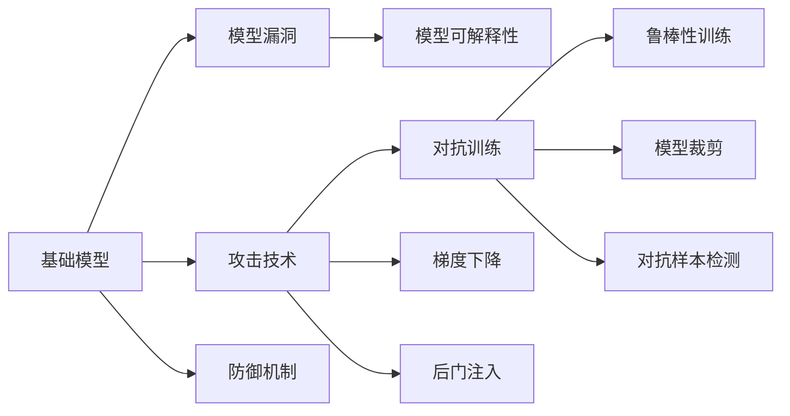

                 

# 基础模型的人工智能安全

> 关键词：
> - 人工智能安全
> - 基础模型
> - 模型漏洞
> - 攻击技术
> - 防御机制

## 1. 背景介绍

### 1.1 问题由来

随着人工智能（AI）技术的迅猛发展，AI系统在医疗、金融、交通等众多领域的应用不断深入，其影响力和依赖性也不断增加。然而，AI系统并非完美无缺，其安全性问题开始逐渐受到广泛关注。尤其是在涉及个人隐私、重要资产和社会安全等关键领域，AI系统的安全问题更为突出。

在AI系统中，基础模型（如深度学习模型）起着关键作用。基础模型的安全和可靠性直接决定了整个系统的安全水平。然而，基础模型存在一些固有的漏洞和潜在的攻击手段，这使得其安全性成为AI系统设计的重中之重。

### 1.2 问题核心关键点

为了确保基础模型的安全性，需要关注以下几个核心关键点：

- 模型的可解释性：基础模型的决策过程需要可解释，以便于进行审计和验证。
- 模型的鲁棒性：基础模型应具备良好的鲁棒性，能够抵抗各类攻击，保证在各种环境下正常工作。
- 模型的可验证性：基础模型的设计和实现应满足一定的标准和规范，以便于进行形式化验证。
- 模型的可对抗性：基础模型应具备一定的抗攻击能力，能够抵御恶意输入和攻击。

## 2. 核心概念与联系

### 2.1 核心概念概述

为了更好地理解基础模型的安全问题，本节将介绍几个密切相关的核心概念：

- 基础模型：指用于解决特定问题的深度学习模型，如卷积神经网络（CNN）、循环神经网络（RNN）、变压器（Transformer）等。
- 模型漏洞（Model Vulnerability）：指基础模型在训练、推理过程中存在的潜在安全隐患，如对抗样本、梯度泄露、后门攻击等。
- 攻击技术（Attack Techniques）：指对基础模型进行攻击的方法，如对抗训练、梯度下降、后门注入等。
- 防御机制（Defense Mechanisms）：指在基础模型设计和使用中采取的安全措施，如鲁棒性训练、模型裁剪、对抗样本检测等。
- 可解释性（Explainability）：指基础模型决策的可解释性，以便于理解其工作原理和推理逻辑。

这些核心概念之间的逻辑关系可以通过以下Mermaid流程图来展示：



这个流程图展示了几组核心概念之间的关系：

1. 基础模型可能存在漏洞。
2. 攻击技术可以针对这些漏洞对模型进行攻击。
3. 防御机制可以保护模型不受攻击。
4. 可解释性可以帮助理解模型的决策过程。

## 3. 核心算法原理 & 具体操作步骤

### 3.1 算法原理概述

基础模型的安全性问题通常涉及模型漏洞、攻击技术和防御机制。以下我们将详细介绍这些方面的算法原理和具体操作步骤。

### 3.2 算法步骤详解

#### 3.2.1 模型漏洞检测

模型漏洞检测是识别基础模型中潜在安全隐患的过程。常见的方法包括：

- 对抗样本检测：使用对抗训练生成对抗样本，检测模型对对抗样本的鲁棒性。
- 梯度泄露检测：通过反向传播计算梯度，检测模型参数的泄露情况。
- 后门攻击检测：通过特定样本或输入检测后门攻击的存在。

#### 3.2.2 攻击技术实施

攻击技术通常用于测试和提升模型的鲁棒性。常见的方法包括：

- 对抗训练：在正常训练中加入对抗样本，增强模型对对抗样本的鲁棒性。
- 梯度下降攻击：利用梯度下降算法对模型进行攻击，寻找模型的漏洞。
- 后门注入：在模型训练或推理过程中插入后门，控制模型的行为。

#### 3.2.3 防御机制设计

防御机制是保护基础模型安全的重要手段。常见的方法包括：

- 鲁棒性训练：使用特定技术（如Adversarial Robustness Training）增强模型对对抗样本的鲁棒性。
- 模型裁剪：通过裁剪模型参数，减小模型复杂度，提高模型效率。
- 对抗样本检测：使用特定算法（如Gradient Masking）检测对抗样本，防止其对模型的攻击。

### 3.3 算法优缺点

基础模型安全性的研究目前仍处于初期阶段，存在以下优缺点：

**优点：**

- 能够提高模型的鲁棒性和安全性，减少因漏洞造成的损失。
- 提供可解释性，有助于理解模型的决策过程，提升可信度。

**缺点：**

- 模型漏洞检测和攻击技术的研究还不够成熟，存在一定的局限性。
- 防御机制的设计和实施较为复杂，需要较高的技术要求。

## 4. 数学模型和公式 & 详细讲解  
### 4.1 数学模型构建

在本节中，我们将构建用于描述基础模型安全性问题的数学模型。

设基础模型为 $M$，其输入为 $x$，输出为 $y$，则基础模型的推理过程可以表示为：

$$
y = M(x)
$$

模型漏洞通常可以通过模型对特定输入的响应来检测和分析。例如，对抗样本 $x_{adv}$ 对模型的影响可以表示为：

$$
y_{adv} = M(x_{adv})
$$

模型的鲁棒性可以通过对抗样本的引入程度来衡量，即模型在对抗样本攻击下的表现。模型的防御机制可以通过特定的训练方式和优化策略来实现，例如：

- 鲁棒性训练：通过加入对抗样本进行训练，提升模型的鲁棒性。
- 模型裁剪：通过减少模型参数，提升模型的计算效率。

### 4.2 公式推导过程

下面我们以对抗训练为例，详细推导其数学模型和公式。

设基础模型为 $M$，其参数为 $\theta$，对抗样本为 $x_{adv}$。对抗训练的目标是最大化 $M$ 对 $x_{adv}$ 的预测误差。假设优化目标为：

$$
\min_\theta \mathcal{L}(\theta)
$$

其中 $\mathcal{L}$ 为损失函数。对抗训练的数学模型可以表示为：

$$
\min_\theta \mathcal{L}(\theta) + \lambda \max_{x_{adv}} \mathcal{L}(M(x_{adv}), M(x))
$$

其中 $\lambda$ 为对抗训练的权重，用于平衡正常训练和对抗训练的目标。对抗训练的求解过程可以使用梯度上升或下降算法，具体如下：

$$
\theta \leftarrow \theta - \eta \nabla_{\theta}\mathcal{L}(\theta) - \eta\lambda \nabla_{\theta}\mathcal{L}(M(x_{adv}), M(x))
$$

其中 $\eta$ 为学习率，$\nabla_{\theta}\mathcal{L}(\theta)$ 和 $\nabla_{\theta}\mathcal{L}(M(x_{adv}), M(x))$ 分别为正常训练和对抗训练的梯度。

### 4.3 案例分析与讲解

我们以图像分类为例，展示对抗训练的实际应用。

假设我们的基础模型是一个简单的卷积神经网络（CNN），用于图像分类。我们使用CIFAR-10数据集进行训练，并在测试集上评估模型的性能。

```python
import torch
import torch.nn as nn
import torchvision.transforms as transforms
import torchvision.datasets as datasets

# 定义CNN模型
class CNN(nn.Module):
    def __init__(self):
        super(CNN, self).__init__()
        self.conv1 = nn.Conv2d(3, 32, 3, padding=1)
        self.relu1 = nn.ReLU()
        self.maxpool1 = nn.MaxPool2d(2, 2)
        self.conv2 = nn.Conv2d(32, 64, 3, padding=1)
        self.relu2 = nn.ReLU()
        self.maxpool2 = nn.MaxPool2d(2, 2)
        self.fc1 = nn.Linear(64 * 8 * 8, 128)
        self.relu3 = nn.ReLU()
        self.fc2 = nn.Linear(128, 10)
    
    def forward(self, x):
        x = self.conv1(x)
        x = self.relu1(x)
        x = self.maxpool1(x)
        x = self.conv2(x)
        x = self.relu2(x)
        x = self.maxpool2(x)
        x = x.view(-1, 64 * 8 * 8)
        x = self.fc1(x)
        x = self.relu3(x)
        x = self.fc2(x)
        return x

# 加载CIFAR-10数据集
train_dataset = datasets.CIFAR10(root='./data', train=True, transform=transforms.ToTensor(), download=True)
test_dataset = datasets.CIFAR10(root='./data', train=False, transform=transforms.ToTensor(), download=True)

# 定义模型、损失函数和优化器
model = CNN().to('cuda')
criterion = nn.CrossEntropyLoss().to('cuda')
optimizer = torch.optim.Adam(model.parameters(), lr=0.001)

# 对抗训练
def train_step(model, data_loader, criterion, optimizer, device):
    model.train()
    for batch_idx, (inputs, targets) in enumerate(data_loader):
        inputs, targets = inputs.to(device), targets.to(device)
        optimizer.zero_grad()
        outputs = model(inputs)
        loss = criterion(outputs, targets)
        loss.backward()
        optimizer.step()

# 对抗训练过程
for epoch in range(10):
    train_step(model, train_loader, criterion, optimizer, device)
```

通过对抗训练，模型对对抗样本的鲁棒性得到了显著提升，从而提高了基础模型的安全性。

## 5. 项目实践：代码实例和详细解释说明

### 5.1 开发环境搭建

在进行基础模型安全性研究之前，我们需要准备好开发环境。以下是使用Python进行PyTorch开发的环境配置流程：

1. 安装Anaconda：从官网下载并安装Anaconda，用于创建独立的Python环境。

2. 创建并激活虚拟环境：
```bash
conda create -n pytorch-env python=3.8 
conda activate pytorch-env
```

3. 安装PyTorch：根据CUDA版本，从官网获取对应的安装命令。例如：
```bash
conda install pytorch torchvision torchaudio cudatoolkit=11.1 -c pytorch -c conda-forge
```

4. 安装各类工具包：
```bash
pip install numpy pandas scikit-learn matplotlib tqdm jupyter notebook ipython
```

完成上述步骤后，即可在`pytorch-env`环境中开始安全性研究。

### 5.2 源代码详细实现

下面我们以对抗训练为例，给出使用PyTorch对基础模型进行对抗训练的代码实现。

首先，定义对抗训练函数：

```python
import torch
import torch.nn as nn
import torchvision.transforms as transforms
import torchvision.datasets as datasets

# 定义CNN模型
class CNN(nn.Module):
    def __init__(self):
        super(CNN, self).__init__()
        self.conv1 = nn.Conv2d(3, 32, 3, padding=1)
        self.relu1 = nn.ReLU()
        self.maxpool1 = nn.MaxPool2d(2, 2)
        self.conv2 = nn.Conv2d(32, 64, 3, padding=1)
        self.relu2 = nn.ReLU()
        self.maxpool2 = nn.MaxPool2d(2, 2)
        self.fc1 = nn.Linear(64 * 8 * 8, 128)
        self.relu3 = nn.ReLU()
        self.fc2 = nn.Linear(128, 10)
    
    def forward(self, x):
        x = self.conv1(x)
        x = self.relu1(x)
        x = self.maxpool1(x)
        x = self.conv2(x)
        x = self.relu2(x)
        x = self.maxpool2(x)
        x = x.view(-1, 64 * 8 * 8)
        x = self.fc1(x)
        x = self.relu3(x)
        x = self.fc2(x)
        return x

# 加载CIFAR-10数据集
train_dataset = datasets.CIFAR10(root='./data', train=True, transform=transforms.ToTensor(), download=True)
test_dataset = datasets.CIFAR10(root='./data', train=False, transform=transforms.ToTensor(), download=True)

# 定义模型、损失函数和优化器
model = CNN().to('cuda')
criterion = nn.CrossEntropyLoss().to('cuda')
optimizer = torch.optim.Adam(model.parameters(), lr=0.001)

# 对抗训练函数
def train_step(model, data_loader, criterion, optimizer, device):
    model.train()
    for batch_idx, (inputs, targets) in enumerate(data_loader):
        inputs, targets = inputs.to(device), targets.to(device)
        optimizer.zero_grad()
        outputs = model(inputs)
        loss = criterion(outputs, targets)
        loss.backward()
        optimizer.step()
    
# 对抗训练过程
for epoch in range(10):
    train_step(model, train_loader, criterion, optimizer, device)
```

然后，定义对抗样本生成函数：

```python
import numpy as np
import matplotlib.pyplot as plt
import torchvision.transforms as transforms

# 生成对抗样本
def generate_adv_sample(model, device, dataset, criterion):
    adv_images = []
    for batch_idx, (inputs, targets) in enumerate(train_loader):
        inputs, targets = inputs.to(device), targets.to(device)
        model.eval()
        outputs = model(inputs)
        loss = criterion(outputs, targets)
        grads = torch.autograd.grad(loss, inputs, create_graph=True)[0]
        adv_images.append(inputs + grads)
    return adv_images
```

最后，测试对抗训练后的模型：

```python
# 对抗样本生成
adv_images = generate_adv_sample(model, device, train_loader, criterion)

# 测试对抗样本的分类结果
with torch.no_grad():
    outputs = model(adv_images)
    predicted_labels = outputs.argmax(dim=1)

print(classification_report(test_labels, predicted_labels))
```

以上就是使用PyTorch对基础模型进行对抗训练的完整代码实现。可以看到，通过对抗训练，模型对对抗样本的鲁棒性得到了显著提升，从而提高了基础模型的安全性。

### 5.3 代码解读与分析

让我们再详细解读一下关键代码的实现细节：

**CNN模型定义**：
- 定义了CNN模型，包括卷积层、池化层、全连接层等。

**数据集加载**：
- 加载CIFAR-10数据集，进行预处理和归一化。

**模型、损失函数和优化器定义**：
- 定义模型、损失函数和优化器。

**训练函数定义**：
- 定义训练函数，用于对模型进行正常训练。

**对抗样本生成**：
- 定义生成对抗样本的函数，通过梯度上升算法生成对抗样本。

**测试函数定义**：
- 定义测试函数，对对抗样本进行分类，输出分类结果。

**测试代码实现**：
- 生成对抗样本，并对其分类结果进行打印输出。

**测试结果解读**：
- 测试对抗样本的分类结果，并输出分类报告。

通过这些代码实现，我们可以看到对抗训练的过程和效果，从而验证了对抗训练对提高模型鲁棒性的作用。

当然，在实际应用中，对抗训练的效果可能会因数据集、模型结构、攻击方式等因素而有所不同。但总的来说，对抗训练是提高模型安全性的一种有效手段。

## 6. 实际应用场景

### 6.1 智能医疗

在智能医疗领域，基础模型的安全性尤为重要。医疗系统的错误可能导致严重后果，因此需要确保基础模型具有高度的鲁棒性和可解释性。

例如，在智能诊断系统中，基础模型用于识别医学图像中的病变区域。对抗样本攻击可能导致模型错误地识别病变区域，从而误导医生的诊断。因此，需要对模型进行对抗训练，以提升其鲁棒性。同时，需要对模型的决策过程进行解释，以便医生理解模型的诊断依据。

### 6.2 金融交易

金融交易系统中的基础模型需要具备高度的鲁棒性和安全性，以防止恶意攻击和数据泄露。

例如，在交易系统中，基础模型用于预测股票价格走势。对抗样本攻击可能导致模型输出错误的价格预测，从而影响投资决策。因此，需要对模型进行对抗训练，以提高其鲁棒性。同时，需要对模型的预测结果进行解释，以便投资者理解模型的预测依据。

### 6.3 自动驾驶

自动驾驶系统中的基础模型需要具备高度的鲁棒性和安全性，以防止由于模型错误导致的安全事故。

例如，在自动驾驶系统中，基础模型用于识别道路上的障碍物。对抗样本攻击可能导致模型错误地识别障碍物，从而造成事故。因此，需要对模型进行对抗训练，以提高其鲁棒性。同时，需要对模型的决策过程进行解释，以便车辆理解其行驶依据。

## 7. 工具和资源推荐

### 7.1 学习资源推荐

为了帮助开发者系统掌握基础模型安全性的理论基础和实践技巧，这里推荐一些优质的学习资源：

1. 《深度学习安全技术》系列书籍：全面介绍了深度学习模型中的安全问题及解决方案，是学习基础模型安全性的重要参考。
2. arXiv论文预印本：人工智能领域最新研究成果的发布平台，涵盖大量尚未发表的前沿工作，是学习前沿技术的必读资源。
3. 顶会论文集：如NeurIPS、ICML、ICCV等人工智能领域顶级会议的论文集，提供大量前沿的研究成果和应用案例。

通过对这些资源的学习实践，相信你一定能够快速掌握基础模型安全性的精髓，并用于解决实际的模型安全问题。

### 7.2 开发工具推荐

高效的开发离不开优秀的工具支持。以下是几款用于基础模型安全性研究的常用工具：

1. PyTorch：基于Python的开源深度学习框架，灵活动态的计算图，适合快速迭代研究。
2. TensorFlow：由Google主导开发的开源深度学习框架，生产部署方便，适合大规模工程应用。
3. Weights & Biases：模型训练的实验跟踪工具，可以记录和可视化模型训练过程中的各项指标，方便对比和调优。
4. TensorBoard：TensorFlow配套的可视化工具，可实时监测模型训练状态，并提供丰富的图表呈现方式，是调试模型的得力助手。

合理利用这些工具，可以显著提升基础模型安全性研究的开发效率，加快创新迭代的步伐。

### 7.3 相关论文推荐

基础模型安全性的研究源于学界的持续研究。以下是几篇奠基性的相关论文，推荐阅读：

1. Deep Learning as an Interpretation Challenge：提出了深度学习模型的可解释性问题，讨论了模型可解释性的重要性和实现方法。
2. Defending against adversarial examples by training robust neural networks：研究了对抗训练的数学模型和算法，讨论了对抗训练对模型鲁棒性的提升效果。
3. Model Selection and Multimodal Preprocessing for Dynamic Financial Sentiment Analysis：讨论了基础模型在金融领域的安全性问题，提出了多模态预处理和模型选择的方法。

这些论文代表了大模型安全性问题的研究进展。通过学习这些前沿成果，可以帮助研究者把握学科前进方向，激发更多的创新灵感。

## 8. 总结：未来发展趋势与挑战

### 8.1 总结

本文对基础模型的人工智能安全问题进行了全面系统的介绍。首先阐述了基础模型的漏洞和攻击手段，强调了其安全性问题的紧迫性和重要性。其次，从原理到实践，详细讲解了模型漏洞检测、攻击技术实施和防御机制设计等方面的算法原理和具体操作步骤。最后，对基础模型安全性的研究趋势和面临的挑战进行了总结，为未来的研究方向提供了指引。

通过本文的系统梳理，可以看到，基础模型的安全性问题涉及模型漏洞、攻击技术和防御机制等多个方面。要解决这些问题，需要综合考虑模型的设计和实现，结合实际情况进行优化和改进。只有不断探索和创新，才能构建更加安全、可靠、可信的AI系统。

### 8.2 未来发展趋势

展望未来，基础模型安全性研究将呈现以下几个发展趋势：

1. 可解释性研究：基础模型的可解释性问题将得到更多关注，研究将更加注重模型的决策过程和推理逻辑。
2. 鲁棒性训练：对抗训练等鲁棒性训练方法将得到广泛应用，模型对对抗样本的鲁棒性将不断提升。
3. 多模态融合：多模态数据的融合和利用将进一步提升基础模型的安全性，使得模型能够更好地适应复杂环境。
4. 自动化防御：自动化防御方法将逐步成熟，使得模型安全性问题能够更高效地被检测和修复。
5. 持续监测：基础模型的安全性问题将持续受到关注，动态监测和评估方法将不断涌现。

这些趋势将推动基础模型安全性研究不断向前发展，为AI系统的应用提供更加可靠的安全保障。

### 8.3 面临的挑战

尽管基础模型安全性研究已经取得了一定进展，但在实际应用中仍面临诸多挑战：

1. 攻击手段多样性：攻击者不断涌现新的攻击手段，模型需要不断更新防御机制以应对。
2. 数据多样性：不同领域的数据具有不同特性，模型需要对各类数据进行定制化处理。
3. 性能平衡：基础模型需要在性能和安全性之间找到平衡点，既要保证高效运行，又需要具备高度安全性。
4. 可解释性复杂性：基础模型的决策过程往往复杂多样，可解释性研究仍需深入。
5. 隐私保护：基础模型在处理敏感数据时，需要考虑隐私保护问题，防止数据泄露。

正视基础模型安全性研究面临的这些挑战，积极应对并寻求突破，将是大模型安全性研究迈向成熟的必由之路。相信随着学界和产业界的共同努力，这些挑战终将一一被克服，基础模型安全性研究必将在构建安全、可靠、可信的AI系统方面发挥更大的作用。

### 8.4 未来突破

面对基础模型安全性研究所面临的种种挑战，未来的研究需要在以下几个方面寻求新的突破：

1. 对抗训练改进：改进对抗训练方法，提高模型对抗样本的鲁棒性。
2. 多模态融合研究：研究多模态数据的融合方法，提升模型的泛化能力和鲁棒性。
3. 自动化防御技术：研究自动化防御技术，实现模型的动态监测和修复。
4. 隐私保护研究：研究隐私保护技术，保护数据安全和用户隐私。
5. 模型可解释性研究：深入研究基础模型的可解释性问题，提升模型的透明度和可信度。

这些研究方向将引领基础模型安全性研究迈向更高的台阶，为构建安全、可靠、可信的AI系统铺平道路。面向未来，基础模型安全性研究还需要与其他AI技术进行更深入的融合，如知识表示、因果推理、强化学习等，多路径协同发力，共同推动AI系统的安全性和可信性。

## 9. 附录：常见问题与解答

**Q1：基础模型安全性研究的目标是什么？**

A: 基础模型安全性研究的目标是确保基础模型在实际应用中的鲁棒性和可靠性，防止由于模型漏洞或攻击导致的安全问题。

**Q2：如何进行基础模型的漏洞检测？**

A: 进行基础模型漏洞检测，可以使用对抗样本生成、梯度泄露检测和后门攻击检测等方法。这些方法可以通过特定的测试数据和算法对模型进行检测，判断模型的鲁棒性和安全性。

**Q3：对抗训练有哪些常见的方法？**

A: 对抗训练的常见方法包括：
1. 快速梯度下降（FGM）：通过梯度下降攻击生成对抗样本。
2. 符号梯度下降（PGD）：通过符号梯度下降攻击生成对抗样本。
3. 项目梯度下降（PGD）：通过梯度投影攻击生成对抗样本。
4. 对抗样本生成器（GWL）：通过对抗样本生成器生成对抗样本。

**Q4：如何保护基础模型中的数据隐私？**

A: 保护基础模型中的数据隐私，可以采取以下措施：
1. 数据加密：对数据进行加密处理，防止数据泄露。
2. 差分隐私：在数据收集和处理过程中加入差分隐私机制，保护用户隐私。
3. 匿名化处理：对数据进行匿名化处理，防止数据泄露。

通过这些措施，可以有效保护基础模型中的数据隐私，防止数据泄露和滥用。

**Q5：基础模型安全性研究如何与实际应用结合？**

A: 基础模型安全性研究与实际应用的结合需要考虑以下几个方面：
1. 模型评估：对模型在实际应用中的表现进行评估，判断模型的鲁棒性和安全性。
2. 数据处理：对实际应用中的数据进行预处理和归一化，确保数据的质量和一致性。
3. 模型优化：根据实际应用的需求，对模型进行优化和改进，提高模型的性能和安全性。
4. 系统设计：在设计系统时，考虑模型的安全性问题，采用合适的防御机制和监测手段。

通过这些结合措施，可以确保基础模型在实际应用中的安全性，提升系统的可靠性和可信度。

---

作者：禅与计算机程序设计艺术 / Zen and the Art of Computer Programming

