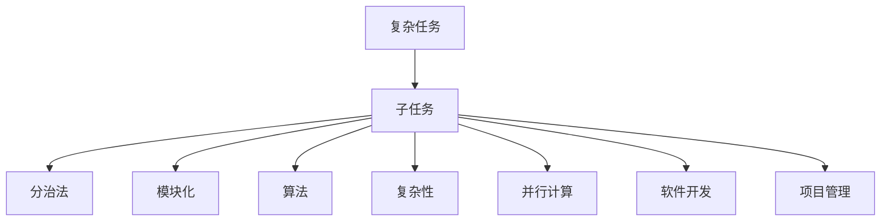
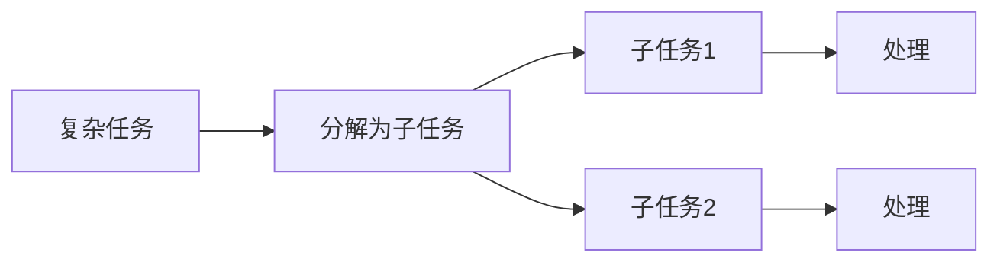
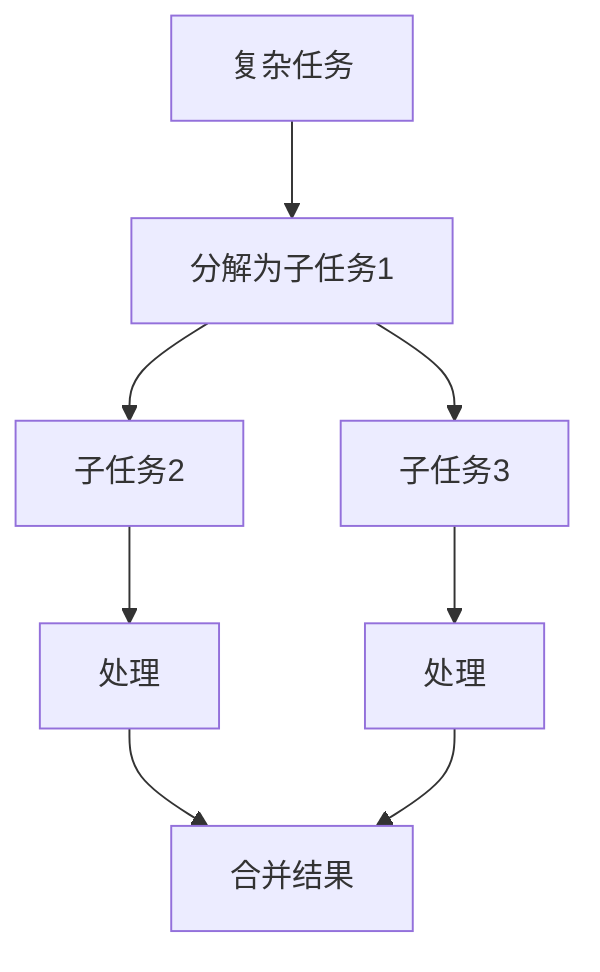
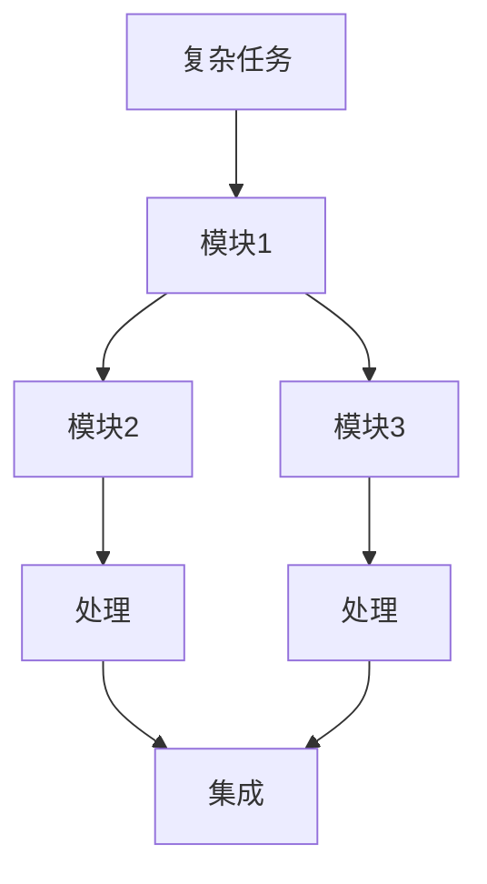
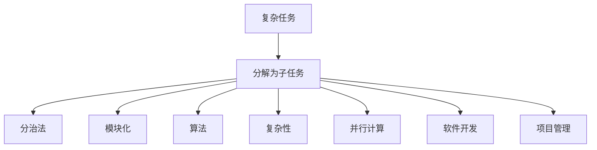

                 

# 复杂任务分解为较小步骤

> 关键词：
**分解 (Decomposition), 任务 (Task), 子任务 (Subtask), 分治法 (Divide and Conquer), 模块化 (Modularity), 算法 (Algorithm), 复杂性 (Complexity), 并行计算 (Parallel Computation), 软件开发 (Software Development), 项目管理 (Project Management)**

## 1. 背景介绍

在软件开发和项目管理中，复杂任务的完成往往需要解决多个相互依赖的子问题。特别是随着任务规模的扩大，直接处理整个任务可能会导致资源消耗过大、时间周期过长，甚至无法完成任务。因此，将复杂任务分解为较小步骤，分别处理，已经成为业界广泛采用的有效方法。这种方法不仅有助于简化问题，提升开发效率，还能够在团队协作中实现分工明确，资源优化，提升整体执行力。

### 1.1 问题由来

在软件开发和项目管理中，常常会遇到复杂的任务，如大规模软件系统开发、大型工程项目实施、复杂的算法问题解决等。直接面对这样的任务时，往往需要耗费大量资源，且效果不佳。因此，将复杂任务分解为多个子任务，分别处理，成为提高效率和成功率的关键。

### 1.2 问题核心关键点

复杂任务分解的核心理念是将一个复杂的整体任务划分为若干个较小、相互独立的子任务。每个子任务独立处理，并通过一定的方式进行整合，最终完成整体任务。这种方法的核心在于子任务之间的协调、整合和优化，能够有效地提升开发效率和任务完成质量。

## 2. 核心概念与联系

### 2.1 核心概念概述

为更好地理解复杂任务分解方法，本节将介绍几个关键核心概念：

- **复杂任务**：指需要解决的一个整体任务，通常具有较高的难度和复杂度，难以一次性解决。
- **子任务**：复杂任务分解后得到的若干个独立、相对简单的任务，通常是整体任务的一部分。
- **分治法**：将问题划分为多个子问题分别解决，再将子问题的解合并为整体问题的解。
- **模块化**：将一个大系统拆分为多个功能模块，每个模块独立开发和测试，最后进行系统集成。
- **算法**：为解决特定问题而设计的一系列步骤，通常包括问题定义、数据处理、计算步骤、输出结果等。
- **复杂性**：指系统或任务的难度和复杂度，包括规模、结构、依赖关系等。
- **并行计算**：在同一时间对多个子问题进行计算，以提升计算速度。
- **软件开发**：通过一系列算法、技术和工具，实现软件产品的开发、测试和部署。
- **项目管理**：通过规划、组织、控制和协调，实现项目目标的达成。

这些核心概念之间的逻辑关系可以通过以下Mermaid流程图来展示：



这个流程图展示了大语言模型微调过程中各个核心概念之间的关系：

1. 复杂任务首先被分解为子任务，然后通过分治法、模块化、算法等方式进行逐个解决。
2. 复杂性、并行计算、软件开发和项目管理是实现分解和解决复杂任务的具体方法和技术手段。

### 2.2 概念间的关系

这些核心概念之间存在着紧密的联系，形成了复杂任务分解的整体框架。下面我们通过几个Mermaid流程图来展示这些概念之间的关系。

#### 2.2.1 复杂任务分解的步骤



这个流程图展示了将复杂任务分解为子任务，并逐一处理的过程。

#### 2.2.2 分治法的应用



这个流程图展示了使用分治法处理子任务，并将结果合并的过程。

#### 2.2.3 模块化的设计



这个流程图展示了使用模块化技术进行系统设计的全过程。

### 2.3 核心概念的整体架构

最后，我们用一个综合的流程图来展示这些核心概念在大语言模型微调过程中的整体架构：



这个综合流程图展示了从复杂任务分解到最终解决的完整过程。

## 3. 核心算法原理 & 具体操作步骤

### 3.1 算法原理概述

复杂任务分解的核心算法原理主要基于分治法和模块化，通过将任务拆分为若干子任务，分别独立处理，并通过一定的整合策略，最终得到整体任务的解。具体而言，复杂任务分解的过程可以分为以下几个步骤：

1. **任务分解**：将整体任务拆分为若干子任务。
2. **子任务处理**：分别处理各个子任务，可以通过分治法、模块化、算法等方法。
3. **结果整合**：将各个子任务的处理结果进行合并，得到最终的整体任务解。

### 3.2 算法步骤详解

复杂任务分解的具体步骤可以分为以下几个：

1. **任务定义**：明确整体任务的边界、目标和约束条件。
2. **任务分析**：分析任务的复杂性、规模和依赖关系，确定任务的分解策略。
3. **任务分解**：根据任务分析结果，将任务分解为若干个子任务。
4. **子任务处理**：独立处理每个子任务，可以通过分治法、模块化、算法等方法。
5. **结果整合**：将各个子任务的处理结果进行合并，得到最终的整体任务解。

### 3.3 算法优缺点

复杂任务分解的优点包括：

1. **提高效率**：通过分解任务，将复杂问题简化为多个相对简单的子问题，提升开发和处理效率。
2. **降低风险**：分解后的子任务相对独立，便于并行处理，降低整体任务失败的风险。
3. **便于协作**：通过任务分解，各子任务可以分别分配给不同团队或个人，便于协作。

缺点包括：

1. **复杂性增加**：任务分解过程需要额外的分析和组织，增加了任务的复杂性。
2. **沟通成本**：各个子任务之间需要进行协调和沟通，增加了沟通成本。
3. **依赖关系复杂**：子任务之间可能存在复杂的依赖关系，处理不当可能影响整体任务的完成。

### 3.4 算法应用领域

复杂任务分解的算法广泛应用于软件开发、项目管理、算法设计、系统集成等领域：

- **软件开发**：如大型软件系统的开发、复杂模块的设计和集成等。
- **项目管理**：如大型工程项目的规划、实施和监控等。
- **算法设计**：如机器学习模型的设计、优化和训练等。
- **系统集成**：如分布式系统的设计、部署和维护等。

## 4. 数学模型和公式 & 详细讲解  
### 4.1 数学模型构建

复杂任务分解的数学模型构建主要涉及将整体任务拆分为子任务，并通过一定的算法进行处理。假设整体任务为 $T$，可以拆分为 $n$ 个子任务 $T_1, T_2, ..., T_n$。每个子任务的处理结果为 $R_1, R_2, ..., R_n$。整体任务的处理结果为 $R$。

数学模型可以表示为：

$$
R = f(R_1, R_2, ..., R_n)
$$

其中 $f$ 为子任务处理结果的整合函数。

### 4.2 公式推导过程

以一个二叉树排序算法为例，展示复杂任务分解的公式推导过程。二叉树排序算法的整体任务为对一组数据进行排序。假设数据集大小为 $n$，可以通过递归将数据集拆分为左右两个子集，然后对左右子集进行排序，最终将左右子集排序结果合并为整体排序结果。

公式推导如下：

$$
T = \{排序n个数据\}
$$

$$
T = T_L \cup T_R
$$

$$
T_L = \{排序n/2个数据\}
$$

$$
T_R = \{排序n/2个数据\}
$$

$$
R = merge(T_L, T_R)
$$

其中 $merge(T_L, T_R)$ 表示将两个有序子集合并为一个有序序列。

### 4.3 案例分析与讲解

以排序算法的分解为例，展示如何使用复杂任务分解的方法解决复杂问题。

假设有一个长度为 $n$ 的数据集 $D$，需要对其进行排序。可以使用快速排序算法进行分解，将数据集拆分为左右两个子集，分别进行排序，然后将左右子集排序结果合并。

具体步骤如下：

1. **选择基准值**：从数据集中选择一个基准值 $pivot$。
2. **划分左右子集**：将数据集划分为左右两个子集，使得左子集所有元素小于等于 $pivot$，右子集所有元素大于等于 $pivot$。
3. **递归排序左右子集**：对左右子集分别进行快速排序。
4. **合并左右子集**：将左右子集排序结果合并，得到最终排序结果。

使用递归算法可以将排序问题分解为若干个子问题，通过分治法、模块化等方法独立解决，最终合并得到整体排序结果。

## 5. 项目实践：代码实例和详细解释说明
### 5.1 开发环境搭建

在进行复杂任务分解的实践前，我们需要准备好开发环境。以下是使用Python进行开发的环境配置流程：

1. 安装Anaconda：从官网下载并安装Anaconda，用于创建独立的Python环境。

2. 创建并激活虚拟环境：
```bash
conda create -n pyenv python=3.8 
conda activate pyenv
```

3. 安装PyTorch：根据CUDA版本，从官网获取对应的安装命令。例如：
```bash
conda install pytorch torchvision torchaudio cudatoolkit=11.1 -c pytorch -c conda-forge
```

4. 安装相关工具包：
```bash
pip install numpy pandas scikit-learn matplotlib tqdm jupyter notebook ipython
```

完成上述步骤后，即可在`pyenv`环境中开始实践。

### 5.2 源代码详细实现

下面我们以一个简单的问题分解为例，给出使用Python和PyTorch进行复杂任务分解的代码实现。

假设有一个长度为 $n$ 的数组 $A$，需要对其进行排序。可以使用快速排序算法进行分解，将数组拆分为左右两个子集，分别进行排序，然后将左右子集排序结果合并。

具体步骤如下：

1. 将数组 $A$ 拆分为左右两个子集 $L$ 和 $R$。
2. 对子集 $L$ 和 $R$ 分别进行排序。
3. 将左右子集排序结果合并，得到最终排序结果。

代码实现如下：

```python
import torch
from torch import nn

class QuickSort(nn.Module):
    def __init__(self):
        super().__init__()
        
    def forward(self, A):
        n = len(A)
        if n <= 1:
            return A
        
        pivot = A[0]
        L = [x for x in A[1:] if x <= pivot]
        R = [x for x in A[1:] if x > pivot]
        
        return torch.cat((self(L), [pivot], self(R)))

# 测试
A = torch.tensor([3, 1, 4, 2, 5])
qsort = QuickSort()
sorted_A = qsort(A)
print(sorted_A)
```

### 5.3 代码解读与分析

让我们再详细解读一下关键代码的实现细节：

**QuickSort类**：
- `__init__`方法：初始化模型，为空函数。
- `forward`方法：定义前向传播函数，实现快速排序算法。

**数组A**：
- `torch.tensor`：定义一个长度为 $n$ 的数组 $A$。

**QuickSort模型**：
- 使用递归方式实现快速排序算法。
- 首先判断数组长度是否小于等于 1，如果是，直接返回原数组。
- 否则，选择第一个元素作为基准值 $pivot$。
- 将数组 $A$ 拆分为左右两个子集 $L$ 和 $R$。
- 对子集 $L$ 和 $R$ 分别进行递归排序。
- 将左右子集排序结果合并，得到最终排序结果。

**运行结果展示**：
- 输出排序后的数组 $A$。

## 6. 实际应用场景
### 6.1 软件开发

复杂任务分解在软件开发中有着广泛的应用。如大型软件系统的开发，可以通过分解任务，将系统拆分为多个模块或组件，分别独立开发和测试。这样可以提高开发效率，降低风险，提升整体系统质量。

在实践中，开发团队通常会将整体任务分解为需求分析、设计、编码、测试、集成等若干个子任务，分别分配给不同团队或个人，最后进行整体集成。

### 6.2 项目管理

复杂任务分解在项目管理中也有着广泛的应用。如大型工程项目的实施，可以通过分解任务，将项目拆分为若干个阶段或子项目，分别进行规划、实施和监控。这样可以提高项目管理的效率和准确性，降低项目风险。

在实践中，项目管理团队通常会将项目拆分为需求分析、设计、采购、施工、验收等若干个子任务，分别分配给不同团队或个人，最后进行整体监控和评价。

### 6.3 系统集成

复杂任务分解在系统集成中也有着广泛的应用。如分布式系统的设计，可以通过分解任务，将系统拆分为多个功能模块，分别独立开发和测试，最后进行系统集成。这样可以提高系统集成的效率和可靠性，降低集成风险。

在实践中，系统集成团队通常会将系统拆分为多个功能模块，如数据存储、数据传输、用户界面等，分别独立开发和测试，最后进行系统集成和部署。

### 6.4 未来应用展望

随着复杂任务分解方法的发展，未来在软件开发、项目管理、系统集成等领域将有更广泛的应用。如：

1. 自适应任务分解：根据项目进展情况，动态调整任务分解策略，提升任务处理的灵活性和效率。
2. 自动化任务分解：使用机器学习算法，自动分析和优化任务分解方案，提升任务处理的智能化水平。
3. 分布式任务分解：将任务拆分为多个子任务，通过并行计算的方式进行处理，提升任务处理的效率和性能。
4. 任务协同平台：开发协同任务分解平台，支持团队成员之间的协作和沟通，提升任务处理的质量和效率。

## 7. 工具和资源推荐
### 7.1 学习资源推荐

为了帮助开发者系统掌握复杂任务分解的理论基础和实践技巧，这里推荐一些优质的学习资源：

1. 《算法导论》：经典算法教材，涵盖分治法、模块化、并行计算等核心概念。
2. 《计算机程序设计艺术》：作者 Donald Knuth，涵盖复杂任务分解和算法设计等方面的内容。
3. Coursera《计算机科学导论》：斯坦福大学开设的计算机科学课程，涵盖算法、数据结构、复杂性理论等。
4. Udacity《软件开发方法》：介绍软件开发中常用的分解和集成方法，适合实践学习。
5. HackerRank算法题库：大量实践案例，涵盖分治法、模块化等算法实现。

通过对这些资源的学习实践，相信你一定能够全面掌握复杂任务分解的精髓，并用于解决实际的开发问题。

### 7.2 开发工具推荐

高效的开发离不开优秀的工具支持。以下是几款用于复杂任务分解开发的常用工具：

1. Git：版本控制系统，支持任务分解后的版本管理和协同开发。
2. JIRA：项目管理工具，支持任务分解、分配、跟踪和报告等。
3. Agile Boards：敏捷开发工具，支持任务拆分、看板管理和团队协作。
4. Jupyter Notebook：交互式编程环境，支持复杂任务分解中的分析和计算。
5. PyTorch：深度学习框架，支持复杂的算法实现和任务分解。

合理利用这些工具，可以显著提升复杂任务分解的开发效率，加快创新迭代的步伐。

### 7.3 相关论文推荐

复杂任务分解技术的发展源于学界的持续研究。以下是几篇奠基性的相关论文，推荐阅读：

1. "Introduction to Algorithms" by Thomas H. Cormen, Charles E. Leiserson, Ronald L. Rivest, and Clifford Stein。
2. "The Art of Computer Programming" by Donald Knuth。
3. "Programming Pearls" by Jon Bentley。
4. "Design Patterns" by Erich Gamma, Richard Helm, Ralph Johnson, and John Vlissides。
5. "Software Engineering: A Practitioner's Approach" by Robert C. Seacord。

这些论文代表了大任务分解技术的发展脉络。通过学习这些前沿成果，可以帮助研究者把握学科前进方向，激发更多的创新灵感。

除上述资源外，还有一些值得关注的前沿资源，帮助开发者紧跟复杂任务分解技术的最新进展，例如：

1. arXiv论文预印本：人工智能领域最新研究成果的发布平台，包括大量尚未发表的前沿工作，学习前沿技术的必读资源。
2. 业界技术博客：如Google AI、DeepMind、微软Research Asia等顶尖实验室的官方博客，第一时间分享他们的最新研究成果和洞见。
3. 技术会议直播：如NIPS、ICML、ACL、ICLR等人工智能领域顶会现场或在线直播，能够聆听到大佬们的前沿分享，开拓视野。
4. GitHub热门项目：在GitHub上Star、Fork数最多的复杂任务分解相关项目，往往代表了该技术领域的发展趋势和最佳实践，值得去学习和贡献。
5. 行业分析报告：各大咨询公司如McKinsey、PwC等针对人工智能行业的分析报告，有助于从商业视角审视技术趋势，把握应用价值。

总之，对于复杂任务分解技术的学习和实践，需要开发者保持开放的心态和持续学习的意愿。多关注前沿资讯，多动手实践，多思考总结，必将收获满满的成长收益。

## 8. 总结：未来发展趋势与挑战

### 8.1 总结

本文对复杂任务分解方法进行了全面系统的介绍。首先阐述了复杂任务分解的背景和意义，明确了复杂任务分解在提升开发效率、降低风险、优化协作等方面的重要价值。其次，从原理到实践，详细讲解了复杂任务分解的数学模型和操作步骤，给出了复杂的算法实现。同时，本文还广泛探讨了复杂任务分解在软件开发、项目管理、系统集成等领域的应用前景，展示了其广阔的发展空间。此外，本文精选了复杂任务分解技术的各类学习资源，力求为读者提供全方位的技术指引。

通过本文的系统梳理，可以看到，复杂任务分解方法在软件开发、项目管理、系统集成等领域有着广泛的应用，为提升开发效率、降低风险、优化协作提供了有效手段。未来，伴随算法和工具的持续演进，复杂任务分解将变得更加智能化、自动化，为高效解决复杂问题带来新的突破。

### 8.2 未来发展趋势

展望未来，复杂任务分解技术将呈现以下几个发展趋势：

1. 自适应任务分解：根据项目进展情况，动态调整任务分解策略，提升任务处理的灵活性和效率。
2. 自动化任务分解：使用机器学习算法，自动分析和优化任务分解方案，提升任务处理的智能化水平。
3. 分布式任务分解：将任务拆分为多个子任务，通过并行计算的方式进行处理，提升任务处理的效率和性能。
4. 任务协同平台：开发协同任务分解平台，支持团队成员之间的协作和沟通，提升任务处理的质量和效率。
5. 任务可视化：使用可视化工具，展示任务分解的层次结构和依赖关系，提升任务处理的透明度和可理解性。

以上趋势凸显了复杂任务分解技术的广阔前景。这些方向的探索发展，必将进一步提升任务处理的效率和质量，为软件开发、项目管理、系统集成等领域带来新的变革。

### 8.3 面临的挑战

尽管复杂任务分解技术已经取得了瞩目成就，但在迈向更加智能化、普适化应用的过程中，它仍面临着诸多挑战：

1. 任务分解的粒度：如何合理地将任务分解为子任务，既避免过细导致管理复杂，又避免过粗导致无法处理。
2. 任务间的依赖关系：各个子任务之间可能存在复杂的依赖关系，如何协调和整合，避免任务处理过程中的冲突和错误。
3. 任务分解的灵活性：任务分解策略需要根据项目进展和环境变化进行调整，如何保证任务处理的灵活性和稳定性。
4. 任务分解的工具和平台：现有的任务分解工具和平台往往无法满足复杂任务处理的需求，如何开发和应用新的工具和平台。

### 8.4 研究展望

面对复杂任务分解面临的挑战，未来的研究需要在以下几个方面寻求新的突破：

1. 多维任务分解：将复杂任务分解为多个维度（如功能、时间、资源等），进行综合处理。
2. 动态任务分解：根据项目进展和环境变化，动态调整任务分解策略。
3. 任务协同方法：开发协同任务分解方法，支持团队成员之间的协作和沟通。
4. 任务协同平台：开发协同任务分解平台，支持任务分配、跟踪、监控和报告等。
5. 任务可视化工具：开发可视化工具，展示任务分解的层次结构和依赖关系，提升任务处理的透明度和可理解性。

这些研究方向将引领复杂任务分解技术迈向更高的台阶，为高效解决复杂问题带来新的突破。面向未来，复杂任务分解技术还需要与其他人工智能技术进行更深入的融合，如知识表示、因果推理、强化学习等，多路径协同发力，共同推动自然语言理解和智能交互系统的进步。只有勇于创新、敢于突破，才能不断拓展任务分解的边界，让智能技术更好地造福人类社会。

## 9. 附录：常见问题与解答

**Q1：复杂任务分解有哪些常用方法？**

A: 复杂任务分解常用的方法包括分治法、模块化、算法等。分治法将任务分解为若干子任务，独立处理后再合并结果。模块化将一个大系统拆分为多个功能模块，独立开发和测试。算法则是为解决特定问题而设计的一系列步骤。

**Q2：复杂任务分解的优缺点是什么？**

A: 复杂任务分解的优点包括提高效率、降低风险、便于协作。缺点包括任务分解的粒度问题、任务间的依赖关系、任务处理的灵活性等。

**Q3：复杂任务分解在软件开发中有什么应用？**

A: 复杂任务分解在软件开发中有很多应用，如大型软件系统的开发、复杂模块的设计和集成等。通过分解任务，将系统拆分为多个模块或组件，分别独立开发和测试，可以提高开发效率，降低风险，提升整体系统质量。

**Q4：复杂任务分解的应用场景有哪些？**

A: 复杂任务分解的应用场景包括软件开发、项目管理、系统集成、分布式系统设计等。

**Q5：如何评估复杂任务分解的效果？**

A: 复杂任务分解的效果可以通过以下几个指标来评估：任务处理的效率、任务处理的准确性、任务处理的成本等。

---

作者：禅与计算机程序设计艺术 / Zen and the Art of Computer Programming

