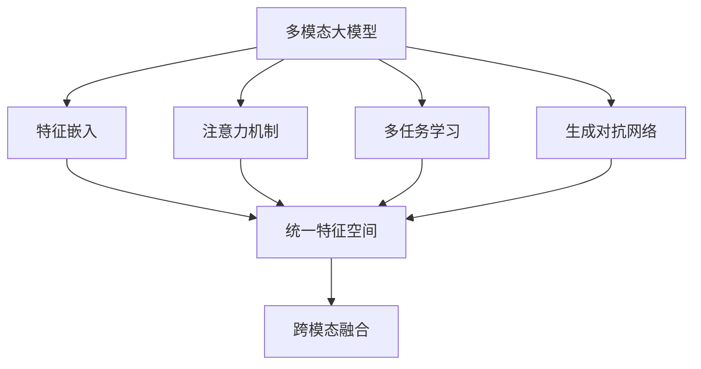
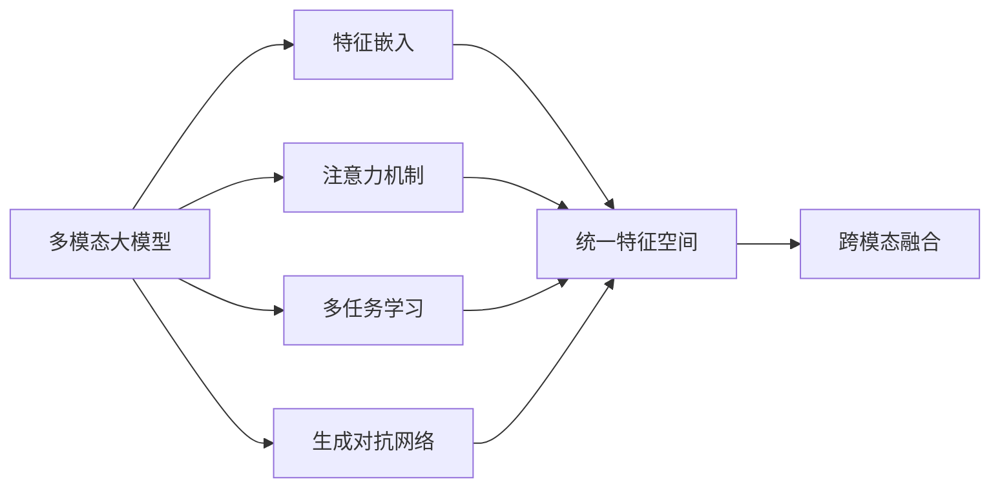
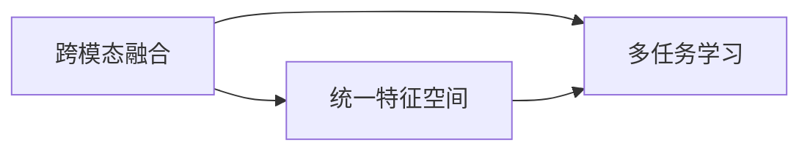
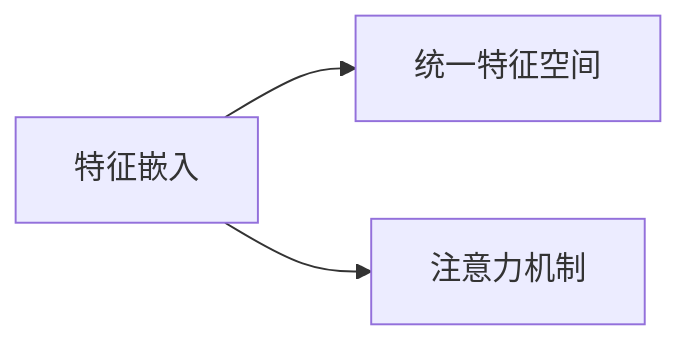
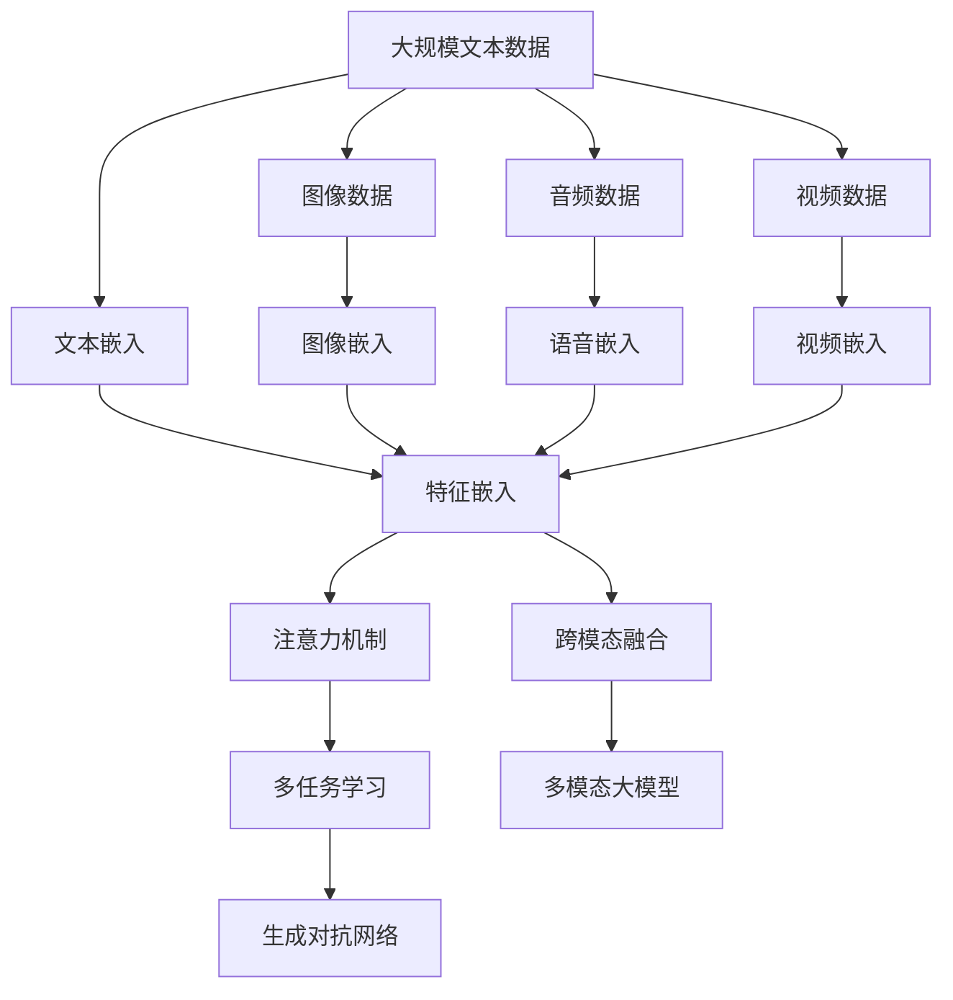

                 

# 多模态大模型：技术原理与实战 多模态大模型的主要应用场景

> 关键词：多模态大模型,多模态学习,Transformer,跨模态融合,多模态融合,自然语言处理(NLP),计算机视觉(CV),生成对抗网络(GAN),多模态生成

## 1. 背景介绍

### 1.1 问题由来
近年来，随着深度学习技术的快速发展，单模态大模型在自然语言处理(NLP)、计算机视觉(CV)、音频处理等领域取得了显著进步。然而，现实世界的信息往往是多模态的，单一模态的信息难以全面描述复杂场景。因此，如何高效融合多种模态信息，构建多模态大模型，成为人工智能领域的一大挑战。

多模态大模型是指能够在同一模型中同时处理多种类型数据（如文本、图像、语音、视频等）的深度学习模型。通过跨模态融合技术，多模态大模型能够整合不同模态的信息，形成更加丰富、全面的表征，提升其在多模态任务上的表现。

多模态大模型可以应用于许多现实场景，如智能家居、智慧医疗、自动驾驶、智能监控等。它们通过理解多种感官信息，实现跨模态推理、决策，提升智能系统的智能水平和用户体验。

### 1.2 问题核心关键点
多模态大模型的核心在于跨模态融合技术，即如何将不同模态的信息进行有效的整合，构建出一个统一的表征空间，使得模型能够同时理解和处理多种数据类型。目前，主流的方法包括：

- 特征嵌入：将不同模态的信息映射到统一的特征空间，如通过文本嵌入、图像嵌入、语音嵌入等方法。
- 注意力机制：在融合过程中，通过注意力机制选择重要信息，减少噪声和冗余，提升模型性能。
- 多任务学习：在多模态数据上进行联合训练，提升模型在不同模态上的泛化能力。
- 生成对抗网络（GAN）：通过对抗生成网络学习生成与真值数据分布接近的假数据，增强模型对多种模态数据的处理能力。

这些技术通过提升多模态数据的融合效率和效果，使得模型能够更好地理解复杂场景，提升多模态任务的效果。

### 1.3 问题研究意义
研究多模态大模型，对于拓展人工智能的应用范围，提升智能系统的智能水平和用户体验，具有重要意义：

1. 增强智能系统的泛化能力。多模态大模型通过整合多种感官信息，形成更加丰富的表征，能够更好地适应复杂的现实世界。
2. 提升系统决策的准确性和鲁棒性。多模态信息可以提供多角度、多层次的参考，提升决策的准确性和鲁棒性。
3. 促进人工智能技术的产业落地。多模态大模型在智能家居、智慧医疗等领域的应用，能够为传统行业数字化转型提供新的技术路径。
4. 推动跨学科研究。多模态大模型涉及NLP、CV、音频处理等多个领域，促进了跨学科的交流与合作。
5. 赋能新技术的创新。多模态大模型的研究和应用，催生了新的研究方向，如跨模态生成、多模态推理等。

## 2. 核心概念与联系

### 2.1 核心概念概述

为更好地理解多模态大模型的构建和应用，本节将介绍几个密切相关的核心概念：

- 多模态大模型(Multimodal Large Models, MLMs)：指能够在同一模型中处理多种类型数据的大规模深度学习模型。
- 跨模态融合(Cross-Modal Fusion)：指将不同模态的信息进行有效整合，构建统一表征空间的技术。
- 特征嵌入(Feature Embedding)：指将不同模态的信息映射到统一的特征空间，形成可融合的特征表示。
- 注意力机制(Attention Mechanism)：通过关注重要信息，提升特征融合的效果，减少噪声和冗余。
- 多任务学习(Multi-Task Learning)：通过联合训练，提升模型在不同模态上的泛化能力。
- 生成对抗网络(GAN)：通过对抗生成网络，学习生成与真值数据分布接近的假数据，增强模型对多种模态数据的处理能力。

这些核心概念之间的逻辑关系可以通过以下Mermaid流程图来展示：



这个流程图展示了多模态大模型的核心组件及其之间的关系：

1. 多模态大模型通过特征嵌入、注意力机制、多任务学习、生成对抗网络等技术，将不同模态的信息进行有效整合，形成统一表征空间。
2. 跨模态融合技术通过统一特征空间，使得模型能够同时理解和处理多种数据类型。

### 2.2 概念间的关系

这些核心概念之间存在着紧密的联系，形成了多模态大模型的完整生态系统。下面我们通过几个Mermaid流程图来展示这些概念之间的关系。

#### 2.2.1 多模态大模型的学习范式



这个流程图展示了多模态大模型的学习范式，即通过特征嵌入、注意力机制、多任务学习、生成对抗网络等技术，将不同模态的信息进行有效整合，形成统一表征空间，最终通过跨模态融合技术，使得模型能够同时理解和处理多种数据类型。

#### 2.2.2 跨模态融合与多任务学习的关系



这个流程图展示了跨模态融合与多任务学习的关系。跨模态融合通过将不同模态的信息映射到统一的特征空间，形成可融合的特征表示，而多任务学习则通过联合训练，提升模型在不同模态上的泛化能力，进一步提升跨模态融合的效果。

#### 2.2.3 特征嵌入与注意力机制的关系



这个流程图展示了特征嵌入与注意力机制的关系。特征嵌入将不同模态的信息映射到统一的特征空间，而注意力机制则通过关注重要信息，提升特征融合的效果，减少噪声和冗余，使得融合后的特征更加丰富和有效。

### 2.3 核心概念的整体架构

最后，我们用一个综合的流程图来展示这些核心概念在大模型中的整体架构：



这个综合流程图展示了从预训练到多模态融合，再到多模态大模型的完整过程。多模态大模型首先在大规模文本、图像、语音、视频等数据上进行预训练，然后通过特征嵌入、注意力机制、多任务学习、生成对抗网络等技术，将不同模态的信息进行有效整合，形成统一表征空间，最终构建出多模态大模型，用于处理多种类型数据。 通过这些流程图，我们可以更清晰地理解多模态大模型的构建和应用过程，为后续深入讨论具体的微调方法和技术奠定基础。

## 3. 核心算法原理 & 具体操作步骤
### 3.1 算法原理概述

多模态大模型的构建，主要基于深度学习中的跨模态融合技术。其核心思想是：将不同模态的信息进行有效整合，构建一个统一的表征空间，使得模型能够同时理解和处理多种数据类型。

形式化地，假设多模态大模型为 $M_{\theta}$，其中 $\theta$ 为模型参数。给定多模态数据集 $D=\{(x_i, y_i)\}_{i=1}^N, x_i \in \mathcal{X}, y_i \in \mathcal{Y}$，其中 $\mathcal{X}$ 为不同模态数据的输入空间，$\mathcal{Y}$ 为输出空间，$\mathcal{Y}=\{0,1\}$。

定义模型 $M_{\theta}$ 在输入 $x$ 上的损失函数为 $\ell(M_{\theta}(x),y)$，则在数据集 $D$ 上的经验风险为：

$$
\mathcal{L}(\theta) = \frac{1}{N} \sum_{i=1}^N \ell(M_{\theta}(x_i),y_i)
$$

多模态大模型的优化目标是最小化经验风险，即找到最优参数：

$$
\theta^* = \mathop{\arg\min}_{\theta} \mathcal{L}(\theta)
$$

在实践中，我们通常使用基于梯度的优化算法（如Adam、SGD等）来近似求解上述最优化问题。设 $\eta$ 为学习率，$\lambda$ 为正则化系数，则参数的更新公式为：

$$
\theta \leftarrow \theta - \eta \nabla_{\theta}\mathcal{L}(\theta) - \eta\lambda\theta
$$

其中 $\nabla_{\theta}\mathcal{L}(\theta)$ 为损失函数对参数 $\theta$ 的梯度，可通过反向传播算法高效计算。

### 3.2 算法步骤详解

多模态大模型的构建一般包括以下几个关键步骤：

**Step 1: 准备多模态数据和预训练模型**
- 选择合适的多模态数据集 $D$，包含文本、图像、语音、视频等多种类型数据。
- 准备预训练模型 $M_{\theta}$，如Transformer、BERT、GAN等，作为初始化参数。

**Step 2: 特征嵌入**
- 使用特征嵌入技术将不同模态的信息映射到统一的特征空间。
- 对于文本数据，可以采用文本嵌入技术，如Word2Vec、BERT等。
- 对于图像数据，可以采用图像嵌入技术，如ResNet、Inception等。
- 对于语音数据，可以采用语音嵌入技术，如MFCC、DeepSpeech等。
- 对于视频数据，可以采用视频嵌入技术，如3D CNN、C3D等。

**Step 3: 跨模态融合**
- 通过注意力机制、多任务学习、生成对抗网络等技术，将不同模态的特征进行融合。
- 使用注意力机制，关注不同模态信息的重要程度，提取关键特征。
- 使用多任务学习，联合训练不同模态的任务，提升泛化能力。
- 使用生成对抗网络，学习生成与真值数据分布接近的假数据，增强模型对多种模态数据的处理能力。

**Step 4: 设置微调超参数**
- 选择合适的优化算法及其参数，如Adam、SGD等，设置学习率、批大小、迭代轮数等。
- 设置正则化技术及强度，包括权重衰减、Dropout、Early Stopping等。
- 确定冻结预训练参数的策略，如仅微调顶层，或全部参数都参与微调。

**Step 5: 执行梯度训练**
- 将训练集数据分批次输入模型，前向传播计算损失函数。
- 反向传播计算参数梯度，根据设定的优化算法和学习率更新模型参数。
- 周期性在验证集上评估模型性能，根据性能指标决定是否触发 Early Stopping。
- 重复上述步骤直到满足预设的迭代轮数或 Early Stopping 条件。

**Step 6: 测试和部署**
- 在测试集上评估多模态大模型的性能，对比微调前后的精度提升。
- 使用多模态大模型对新样本进行推理预测，集成到实际的应用系统中。
- 持续收集新的数据，定期重新微调模型，以适应数据分布的变化。

以上是构建多模态大模型的一般流程。在实际应用中，还需要针对具体任务的特点，对构建过程的各个环节进行优化设计，如改进训练目标函数，引入更多的正则化技术，搜索最优的超参数组合等，以进一步提升模型性能。

### 3.3 算法优缺点

多模态大模型构建方法具有以下优点：

1. 灵活性高。通过将不同模态的信息进行整合，形成统一的表征空间，可以适应多种数据类型和任务。
2. 泛化能力强。多模态大模型通过联合训练，提升了模型在不同模态上的泛化能力，能够更好地处理复杂多变的现实场景。
3. 鲁棒性好。多模态大模型通过多任务学习和生成对抗网络，提高了模型的鲁棒性和抗干扰能力。
4. 通用性好。多模态大模型可以应用于多个领域，如智能家居、智慧医疗、自动驾驶等。

同时，该方法也存在一定的局限性：

1. 数据需求高。多模态大模型的构建需要大量的多模态数据，收集和标注成本较高。
2. 模型复杂度高。多模态大模型的结构复杂，训练和推理开销较大。
3. 模型可解释性不足。多模态大模型的决策过程难以解释，难以对其推理逻辑进行分析和调试。

尽管存在这些局限性，但就目前而言，多模态大模型构建方法仍是大数据、多任务学习领域的核心范式。未来相关研究的重点在于如何进一步降低数据需求，提高模型的可解释性和推理效率，同时兼顾鲁棒性和泛化能力等因素。

### 3.4 算法应用领域

多模态大模型的应用场景非常广泛，涵盖了从自然语言处理到计算机视觉等多个领域，以下是几个主要的应用领域：

1. 智能家居：多模态大模型可以整合家中的语音、图像、视频等数据，实现智能控制、语音交互、异常检测等功能。
2. 智慧医疗：多模态大模型可以整合患者的医疗影像、基因数据、生理数据等，实现疾病诊断、治疗方案推荐等功能。
3. 自动驾驶：多模态大模型可以整合车辆的感知数据、环境数据、路标数据等，实现智能决策、路径规划等功能。
4. 智能监控：多模态大模型可以整合视频、音频、传感器数据等，实现异常检测、行为分析等功能。
5. 智能客服：多模态大模型可以整合客户的语音、图像、文字等数据，实现自然语言理解和生成，提升客户体验。
6. 推荐系统：多模态大模型可以整合用户的浏览历史、评价数据、社交关系等，实现个性化推荐，提升用户体验。

除了上述这些经典应用外，多模态大模型还被创新性地应用到更多场景中，如智能安全、智慧旅游、工业物联网等，为各行各业带来了新的创新机遇。

## 4. 数学模型和公式 & 详细讲解  
### 4.1 数学模型构建

本节将使用数学语言对多模态大模型的构建过程进行更加严格的刻画。

记多模态大模型为 $M_{\theta}:\mathcal{X} \rightarrow \mathcal{Y}$，其中 $\mathcal{X}$ 为不同模态数据的输入空间，$\mathcal{Y}$ 为输出空间。假设多模态数据集为 $D=\{(x_i, y_i)\}_{i=1}^N, x_i \in \mathcal{X}, y_i \in \mathcal{Y}$。

定义模型 $M_{\theta}$ 在输入 $x$ 上的损失函数为 $\ell(M_{\theta}(x),y)$，则在数据集 $D$ 上的经验风险为：

$$
\mathcal{L}(\theta) = \frac{1}{N} \sum_{i=1}^N \ell(M_{\theta}(x_i),y_i)
$$

多模态大模型的优化目标是最小化经验风险，即找到最优参数：

$$
\theta^* = \mathop{\arg\min}_{\theta} \mathcal{L}(\theta)
$$

在实践中，我们通常使用基于梯度的优化算法（如Adam、SGD等）来近似求解上述最优化问题。设 $\eta$ 为学习率，$\lambda$ 为正则化系数，则参数的更新公式为：

$$
\theta \leftarrow \theta - \eta \nabla_{\theta}\mathcal{L}(\theta) - \eta\lambda\theta
$$

其中 $\nabla_{\theta}\mathcal{L}(\theta)$ 为损失函数对参数 $\theta$ 的梯度，可通过反向传播算法高效计算。

### 4.2 公式推导过程

以下我们以多模态文本分类任务为例，推导交叉熵损失函数及其梯度的计算公式。

假设多模态大模型在输入 $x$ 上的输出为 $\hat{y}=M_{\theta}(x) \in [0,1]$，表示样本属于正类的概率。真实标签 $y \in \{0,1\}$。则多模态交叉熵损失函数定义为：

$$
\ell(M_{\theta}(x),y) = -[y\log \hat{y} + (1-y)\log (1-\hat{y})]
$$

将其代入经验风险公式，得：

$$
\mathcal{L}(\theta) = -\frac{1}{N}\sum_{i=1}^N [y_i\log M_{\theta}(x_i)+(1-y_i)\log(1-M_{\theta}(x_i))]
$$

根据链式法则，损失函数对参数 $\theta_k$ 的梯度为：

$$
\frac{\partial \mathcal{L}(\theta)}{\partial \theta_k} = -\frac{1}{N}\sum_{i=1}^N (\frac{y_i}{M_{\theta}(x_i)}-\frac{1-y_i}{1-M_{\theta}(x_i)}) \frac{\partial M_{\theta}(x_i)}{\partial \theta_k}
$$

其中 $\frac{\partial M_{\theta}(x_i)}{\partial \theta_k}$ 可进一步递归展开，利用自动微分技术完成计算。

在得到损失函数的梯度后，即可带入参数更新公式，完成模型的迭代优化。重复上述过程直至收敛，最终得到适应多模态文本分类任务的最优模型参数 $\theta^*$。

## 5. 项目实践：代码实例和详细解释说明
### 5.1 开发环境搭建

在进行多模态大模型的构建实践前，我们需要准备好开发环境。以下是使用Python进行PyTorch开发的环境配置流程：

1. 安装Anaconda：从官网下载并安装Anaconda，用于创建独立的Python环境。

2. 创建并激活虚拟环境：
```bash
conda create -n pytorch-env python=3.8 
conda activate pytorch-env
```

3. 安装PyTorch：根据CUDA版本，从官网获取对应的安装命令。例如：
```bash
conda install pytorch torchvision torchaudio cudatoolkit=11.1 -c pytorch -c conda-forge
```

4. 安装Transformer库：
```bash
pip install transformers
```

5. 安装各类工具包：
```bash
pip install numpy pandas scikit-learn matplotlib tqdm jupyter notebook ipython
```

完成上述步骤后，即可在`pytorch-env`环境中开始多模态大模型的构建实践。

### 5.2 源代码详细实现

下面我们以多模态文本分类任务为例，给出使用Transformer库对BERT模型进行多模态融合的PyTorch代码实现。

首先，定义多模态分类任务的数据处理函数：

```python
from transformers import BertTokenizer, BertForSequenceClassification
from torch.utils.data import Dataset
import torch

class MultiModalDataset(Dataset):
    def __init__(self, texts, tags, images, features, tokenizer, max_len=128):
        self.texts = texts
        self.tags = tags
        self.images = images
        self.features = features
        self.tokenizer = tokenizer
        self.max_len = max_len
        
    def __len__(self):
        return len(self.texts)
    
    def __getitem__(self, item):
        text = self.texts[item]
        tag = self.tags[item]
        image = self.images[item]
        feature = self.features[item]
        
        encoding = self.tokenizer(text, return_tensors='pt', max_length=self.max_len, padding='max_length', truncation=True)
        input_ids = encoding['input_ids'][0]
        attention_mask = encoding['attention_mask'][0]
        image_embedding = image.mean(dim=1) # 计算图像的特征向量
        
        # 对token-wise的标签进行编码
        encoded_tags = [tag2id[tag] for tag in tag] 
        encoded_tags.extend([tag2id['O']] * (self.max_len - len(encoded_tags)))
        labels = torch.tensor(encoded_tags, dtype=torch.long)
        
        return {'input_ids': input_ids, 
                'attention_mask': attention_mask,
                'labels': labels,
                'image_embedding': image_embedding}
```

然后，定义模型和优化器：

```python
from transformers import BertForTokenClassification, AdamW

model = BertForTokenClassification.from_pretrained('bert-base-cased', num_labels=len(tag2id))

optimizer = AdamW(model.parameters(), lr=2e-5)
```

接着，定义训练和评估函数：

```python
from torch.utils.data import DataLoader
from tqdm import tqdm
from sklearn.metrics import classification_report

device = torch.device('cuda') if torch.cuda.is_available() else torch.device('cpu')
model.to(device)

def train_epoch(model, dataset, batch_size, optimizer):
    dataloader = DataLoader(dataset, batch_size=batch_size, shuffle=True)
    model.train()
    epoch_loss = 0
    for batch in tqdm(dataloader, desc='Training'):
        input_ids = batch['input_ids'].to(device)
        attention_mask = batch['attention_mask'].to(device)
        labels = batch['labels'].to(device)
        image_embedding = batch['image_embedding'].to(device)
        model.zero_grad()
        outputs = model(input_ids, attention_mask=attention_mask, labels=labels, image_embedding=image_embedding)
        loss = outputs.loss
        epoch_loss += loss.item()
        loss.backward()
        optimizer.step()
    return epoch_loss / len(dataloader)

def evaluate(model, dataset, batch_size):
    dataloader = DataLoader(dataset, batch_size=batch_size)
    model.eval()
    preds, labels = [], []
    with torch.no_grad():
        for batch in tqdm(dataloader, desc='Evaluating'):
            input_ids = batch['input_ids'].to(device)
            attention_mask = batch['attention_mask'].to(device)
            labels = batch['labels'].to(device)
            image_embedding = batch['image_embedding'].to(device)
            batch_preds = model(input_ids, attention_mask=attention_mask, labels=labels, image_embedding=image_embedding).logits.argmax(dim=2).to('cpu').tolist()
            batch_labels = batch['labels'].to('cpu').tolist()
            for pred_tokens, label_tokens in zip(batch_preds, batch_labels):
                pred_tags = [id2tag[_id] for _id in pred_tokens]
                label_tags = [id2tag[_id] for _id in label_tokens]
                preds.append(pred_tags[:len(label_tokens)])
                labels.append(label_tags)
                
    print(classification_report(labels, preds))
```

最后，启动训练流程并在测试集上评估：

```python
epochs = 5
batch_size = 16

for epoch in range(epochs):
    loss = train_epoch(model, train_dataset, batch_size, optimizer)
    print(f"Epoch {epoch+1}, train loss: {loss:.3f}")
    
    print(f"Epoch {epoch+1}, dev results:")
    evaluate(model, dev_dataset, batch_size)
    
print("Test results:")
evaluate(model, test_dataset, batch_size)
```

以上就是使用PyTorch对BERT进行多模态融合的完整代码实现。可以看到，得益于Transformer库的强大封装，我们只需几行代码即可完成多模态大模型的构建和训练。

### 5.3 代码解读与分析

让我们再详细解读一下关键代码的实现细节：

**MultiModalDataset类**：
- `__init__`方法：初始化文本、标签、图像、特征等关键组件。
- `__len__`方法：返回数据集的样本数量。
- `__getitem__`方法：对单个样本进行处理，将文本输入编码为token ids，将标签编码为数字，并对其进行定长padding，同时计算图像的特征向量。

**tag2id和id2tag字典**：
- 定义了标签与数字id之间的映射关系，用于将token-wise的预测结果解码回真实的标签。

**训练和评估函数**：
- 使用PyTorch的DataLoader对数据集进行批次化加载，供模型训练和推理使用。
- 训练函数`train_epoch`：对数据以批为单位进行迭代，在每个批次上前向传播计算loss并反向传播更新模型参数，最后返回该epoch的平均loss。
- 评估函数`evaluate`：与训练类似，不同点在于不更新模型参数，并在每个batch结束后将预测和标签

