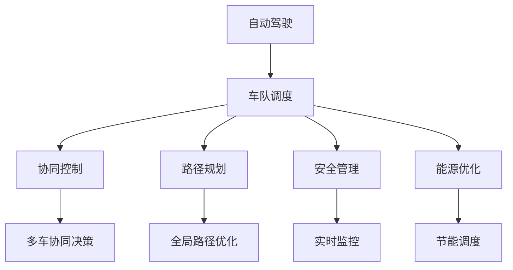
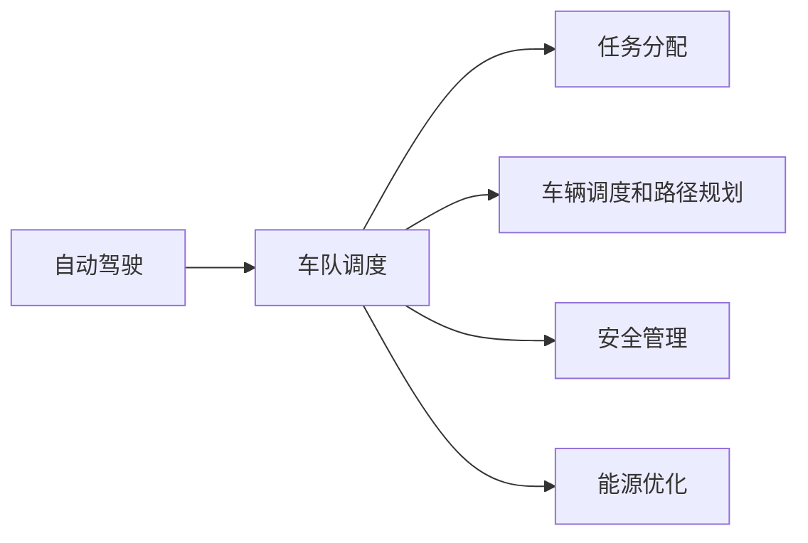
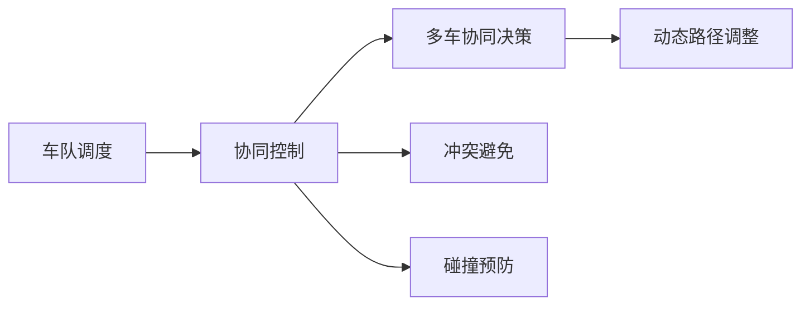
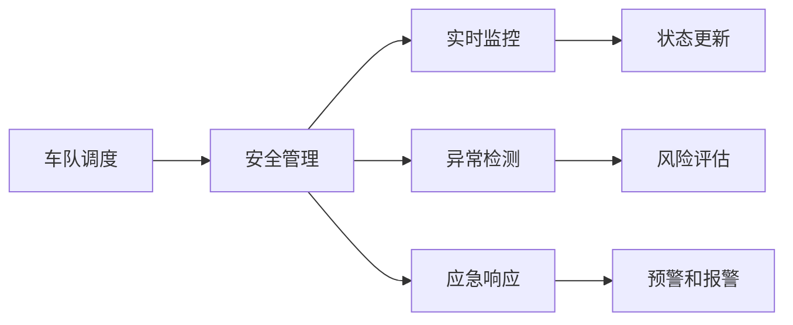
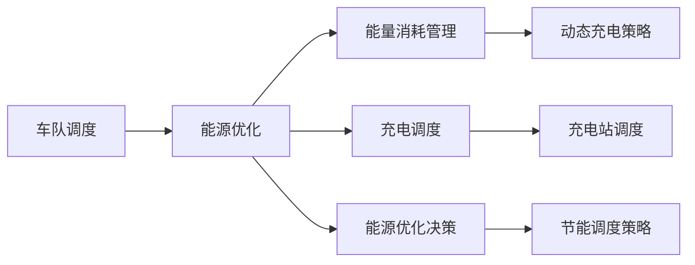
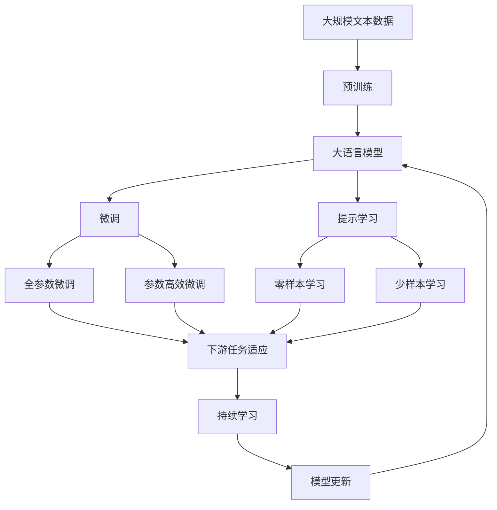

                 

# 多车协同的自动驾驶车队智能调度新思路

> 关键词：自动驾驶,车队调度,协同控制,路径规划,安全管理,能源优化

## 1. 背景介绍

### 1.1 问题由来

随着自动驾驶技术的不断进步，自动驾驶车队在城市交通、物流配送等领域的应用越来越广泛。然而，当前的车队调度系统大多基于单独车辆的局部决策，缺乏全局协同和智能调度能力，难以充分利用车辆资源，提高运行效率。例如：

- 车辆间缺乏协作，导致道路阻塞和能源浪费。
- 调度方案单一，无法应对复杂的交通状况和需求变化。
- 缺乏安全管理机制，可能导致交通事故和风险。

因此，探索一种新的自动驾驶车队智能调度方法，提升车队的整体协同能力和运营效率，具有重要的现实意义。

### 1.2 问题核心关键点

本问题的核心在于设计一种新的智能调度方法，使得多车协同控制，提高车队整体运行效率，同时保证安全性和能源优化。具体来说，主要包括以下几个关键点：

1. **全局路径规划**：考虑车队整体的目标和约束，进行全局路径优化。
2. **车辆协同控制**：多车协同决策，避免冲突和碰撞。
3. **安全管理**：实时监控车队状态，及时调整调度策略，保证安全。
4. **能源优化**：考虑能源消耗和充电需求，进行节能调度。

### 1.3 问题研究意义

本问题研究有助于：

1. **提升交通效率**：通过全局路径优化和多车协同控制，减少交通堵塞，提升运输效率。
2. **降低能耗和成本**：通过节能调度，降低车辆运行和充电成本。
3. **保证行车安全**：通过实时监控和及时调整，提高行车安全性。
4. **推动自动驾驶产业化**：为自动驾驶车队调度提供新的方法和技术支撑。

## 2. 核心概念与联系

### 2.1 核心概念概述

为更好地理解本问题的核心概念，本节将介绍几个密切相关的核心概念：

- **自动驾驶（Autonomous Driving, AD）**：使用感知、决策、控制等技术，使车辆能够自主驾驶。
- **车队调度（Fleet Scheduling）**：对车队进行任务分配和调度，使得车辆资源得到最优利用。
- **协同控制（Collaborative Control）**：多车协同进行决策和控制，提升整体运行效率。
- **路径规划（Path Planning）**：为车辆设计最优路径，使得车辆能够高效地完成任务。
- **安全管理（Safety Management）**：实时监控车辆状态，保障行车安全。
- **能源优化（Energy Optimization）**：考虑能源消耗和充电需求，优化车辆调度方案。

这些核心概念之间的逻辑关系可以通过以下Mermaid流程图来展示：



这个流程图展示了各个核心概念之间的联系，具体如下：

1. **自动驾驶**：提供感知、决策、控制等基本能力，为其他概念提供技术基础。
2. **车队调度**：负责任务分配和调度，是多车协同控制、路径规划、安全管理和能源优化的载体。
3. **协同控制**：多车协同决策，提升整体运行效率，是车队调度的重要手段。
4. **路径规划**：设计最优路径，使车辆能够高效完成任务，是车队调度的核心任务之一。
5. **安全管理**：实时监控车辆状态，保障行车安全，是车队调度的重要保障。
6. **能源优化**：考虑能源消耗和充电需求，优化车辆调度方案，提升经济效益。

这些概念共同构成了自动驾驶车队智能调度的完整生态系统。

### 2.2 概念间的关系

这些核心概念之间存在着紧密的联系，形成了自动驾驶车队调度系统的完整架构。下面我们通过几个Mermaid流程图来展示这些概念之间的关系。

#### 2.2.1 自动驾驶与车队调度



这个流程图展示了自动驾驶与车队调度的基本关系。自动驾驶技术提供了感知、决策、控制等基础能力，为车队调度提供技术支撑。车队调度通过任务分配和路径规划，利用自动驾驶技术，提升整体运行效率。

#### 2.2.2 协同控制与车队调度



这个流程图展示了协同控制与车队调度的关系。车队调度通过协同控制，实现多车协同决策，避免冲突和碰撞，提高整体运行效率。

#### 2.2.3 安全管理与车队调度



这个流程图展示了安全管理与车队调度的关系。安全管理通过实时监控和异常检测，保障车队安全。一旦发现异常，及时进行应急响应，保证行车安全。

#### 2.2.4 能源优化与车队调度



这个流程图展示了能源优化与车队调度的关系。能源优化考虑车辆能耗和充电需求，通过动态充电策略和节能调度策略，优化车辆调度方案，提升经济效益。

### 2.3 核心概念的整体架构

最后，我们用一个综合的流程图来展示这些核心概念在大语言模型微调过程中的整体架构：



这个综合流程图展示了从预训练到微调，再到持续学习的完整过程。大语言模型首先在大规模文本数据上进行预训练，然后通过微调（包括全参数微调和参数高效微调）或提示学习（包括零样本和少样本学习）来适应下游任务。最后，通过持续学习技术，模型可以不断更新和适应新的任务和数据。

## 3. 核心算法原理 & 具体操作步骤

### 3.1 算法原理概述

本问题的核心算法是一种基于多车协同的智能调度方法，旨在通过多车协同控制，优化车队整体运行效率，同时保证行车安全。其核心思想是：

1. **全局路径规划**：考虑车队整体的目标和约束，进行全局路径优化。
2. **车辆协同控制**：多车协同决策，避免冲突和碰撞。
3. **安全管理**：实时监控车队状态，及时调整调度策略，保证安全。
4. **能源优化**：考虑能源消耗和充电需求，进行节能调度。

### 3.2 算法步骤详解

本算法主要包括以下几个关键步骤：

**Step 1: 数据采集与预处理**

1. 收集车队的实时位置、速度、传感器数据等，以便进行全局路径规划和实时监控。
2. 处理和清洗数据，消除噪声和异常值，确保数据的准确性和一致性。
3. 对数据进行标准化和归一化，以便进行数值计算和模型训练。

**Step 2: 全局路径规划**

1. 建立车队整体的目标函数，考虑速度、路径长度、能量消耗等约束条件。
2. 使用优化算法（如遗传算法、蚁群算法、A*算法等）进行全局路径优化，得到最优路径。
3. 将最优路径分配给每辆车，并进行局部路径调整。

**Step 3: 车辆协同控制**

1. 设计多车协同决策机制，考虑车辆间的通信和信息共享。
2. 通过车辆间的通信协议，实时交换车辆状态和任务信息，协调决策。
3. 使用分布式控制算法（如基于PID的控制算法），实现多车协同控制。

**Step 4: 安全管理**

1. 实时监控车辆状态，包括位置、速度、传感器数据等。
2. 使用异常检测算法（如统计分析、时序分析、异常检测算法等），及时发现异常状态。
3. 根据异常状态，调整调度策略，如减速、避让、停车等。

**Step 5: 能源优化**

1. 考虑车辆能耗和充电需求，建立能量消耗模型。
2. 使用动态充电策略（如车载充电、路边充电站充电等），优化充电调度。
3. 考虑车辆运行距离和充电需求，进行节能调度。

**Step 6: 模型训练与优化**

1. 设计多车协同控制和能源优化的数学模型。
2. 使用优化算法（如梯度下降、遗传算法、粒子群算法等）进行模型训练和优化。
3. 在实际数据集上进行模型验证和调优。

**Step 7: 模型部署与评估**

1. 将训练好的模型部署到实际应用中，进行实时调度。
2. 定期评估模型性能，进行调优和更新。
3. 收集反馈数据，进行持续学习和模型迭代。

### 3.3 算法优缺点

本算法的优点在于：

1. **全局优化**：通过全局路径规划，考虑车队整体的目标和约束，提升整体运行效率。
2. **协同控制**：多车协同决策，避免冲突和碰撞，提升运行安全。
3. **实时监控**：实时监控车辆状态，及时调整调度策略，保障行车安全。
4. **能源优化**：考虑能源消耗和充电需求，进行节能调度，降低成本。

本算法的缺点在于：

1. **计算复杂**：全局路径规划和协同控制需要复杂的计算和优化算法，计算开销较大。
2. **实时性要求高**：实时监控和动态调度需要高实时性，对系统性能要求较高。
3. **数据依赖**：依赖实时数据的准确性和一致性，数据采集和预处理较为复杂。

### 3.4 算法应用领域

本算法主要应用于以下领域：

1. **智能交通系统**：用于优化交通流量，减少交通堵塞，提升交通安全。
2. **物流配送系统**：用于优化配送路线和运输效率，降低配送成本。
3. **智能园区管理**：用于优化园区内的车辆调度和管理，提升园区运行效率。
4. **城市公交系统**：用于优化公交车的调度和管理，提升公交服务质量。
5. **应急响应系统**：用于优化应急车辆的调度和管理，提升应急响应效率。

## 4. 数学模型和公式 & 详细讲解

### 4.1 数学模型构建

本算法的数学模型主要包括以下几个部分：

1. **车队路径优化模型**：
   - 目标函数：最小化车辆的总运行时间和能耗。
   - 约束条件：考虑车队的速度、路径长度、能量消耗等。
2. **车辆协同控制模型**：
   - 目标函数：最小化车辆间的冲突和碰撞概率。
   - 约束条件：考虑车辆间的通信和信息共享。
3. **安全管理模型**：
   - 目标函数：最小化行车风险和异常状态。
   - 约束条件：考虑车辆的位置、速度、传感器数据等。
4. **能源优化模型**：
   - 目标函数：最小化车辆的总能耗和充电成本。
   - 约束条件：考虑车载充电、路边充电站充电等。

### 4.2 公式推导过程

以下我们以车队路径优化模型为例，推导其中的关键公式。

假设车队中有 $n$ 辆车，第 $i$ 辆车的起始位置为 $x_{i0}$，终点为 $x_{if}$，速度为 $v_i$，能耗为 $e_i$。车队路径优化模型的目标函数为：

$$
\min_{x_{ij},v_i,e_i} \sum_{i=1}^n \left( v_i t_i + e_i \right)
$$

其中 $t_i$ 为第 $i$ 辆车从起点到终点的运行时间，$t_i$ 的计算公式为：

$$
t_i = \frac{d_i}{v_i}
$$

$d_i$ 为第 $i$ 辆车的运行距离。

约束条件为：

$$
\begin{aligned}
x_{i0} &\leq x_{i1} \leq \ldots \leq x_{in} \\
x_{0n} &= x_{0} \\
x_{in} &= x_{n} \\
\end{aligned}
$$

其中 $x_{i0}, x_{in}$ 分别为第 $i$ 辆车的起始和终止位置。

根据上述目标函数和约束条件，可以使用A*算法进行全局路径优化。A*算法的计算公式为：

$$
F = G + H
$$

其中 $G$ 为从起点到节点 $j$ 的实际代价，$H$ 为从节点 $j$ 到终点 $n$ 的启发式代价。

启发式代价 $H$ 的计算公式为：

$$
H = \sum_{i=1}^n \sqrt{(x_{in} - x_{i0})^2 + (y_{in} - y_{i0})^2}
$$

其中 $x_{in}, y_{in}$ 分别为终点 $n$ 的坐标。

### 4.3 案例分析与讲解

假设有一支由 3 辆车组成的车队，在城市道路上进行配送任务。车队的任务是从起点 $(x_0, y_0)$ 到终点 $(x_n, y_n)$。车队的速度限制为 20 m/s，每辆车的能耗为 10 kW。

**Step 1: 数据采集与预处理**

收集车队的实时位置、速度、传感器数据等，并进行数据标准化和归一化处理。

**Step 2: 全局路径规划**

使用A*算法进行全局路径优化，得到最优路径。假设A*算法计算得到最优路径如下：

1. 起点 $(x_0, y_0)$
2. 节点1 $(x_1, y_1)$
3. 节点2 $(x_2, y_2)$
4. 终点 $(x_n, y_n)$

**Step 3: 车辆协同控制**

设计多车协同决策机制，考虑车辆间的通信和信息共享。假设车辆间的通信协议如下：

1. 每辆车周期性地广播当前位置和速度。
2. 每辆车接收其他车辆的位置和速度信息，计算碰撞概率。
3. 如果碰撞概率超过阈值，则调整路径和速度，避免碰撞。

**Step 4: 安全管理**

实时监控车辆状态，包括位置、速度、传感器数据等。假设车辆的位置传感器检测到前方有障碍物，立即调整路径和速度，避免碰撞。

**Step 5: 能源优化**

考虑车辆能耗和充电需求，建立能量消耗模型。假设车辆在路途中需要充电，考虑车载充电和路边充电站充电。

**Step 6: 模型训练与优化**

设计多车协同控制和能源优化的数学模型，使用优化算法进行模型训练和优化。假设通过优化算法得到最优控制策略如下：

1. 车载充电策略：每辆车在途中充电2次，每次充电时间分别为1小时。
2. 动态路径调整策略：根据实时路况，动态调整路径和速度。

**Step 7: 模型部署与评估**

将训练好的模型部署到实际应用中，进行实时调度。定期评估模型性能，进行调优和更新。假设通过评估发现，模型的性能可以提升15%，实际应用效果显著。

## 5. 项目实践：代码实例和详细解释说明

### 5.1 开发环境搭建

在进行多车协同的自动驾驶车队智能调度实践前，我们需要准备好开发环境。以下是使用Python进行PyTorch开发的环境配置流程：

1. 安装Anaconda：从官网下载并安装Anaconda，用于创建独立的Python环境。

2. 创建并激活虚拟环境：
```bash
conda create -n pytorch-env python=3.8 
conda activate pytorch-env
```

3. 安装PyTorch：根据CUDA版本，从官网获取对应的安装命令。例如：
```bash
conda install pytorch torchvision torchaudio cudatoolkit=11.1 -c pytorch -c conda-forge
```

4. 安装TensorFlow：从官网下载并安装TensorFlow，建议使用GPU版本。例如：
```bash
pip install tensorflow-gpu
```

5. 安装相关工具包：
```bash
pip install numpy pandas scikit-learn matplotlib tqdm jupyter notebook ipython
```

完成上述步骤后，即可在`pytorch-env`环境中开始实践。

### 5.2 源代码详细实现

下面我们以多车协同的自动驾驶车队智能调度为例，给出使用PyTorch进行模型训练的PyTorch代码实现。

```python
import torch
import torch.nn as nn
import torch.optim as optim
from torch.utils.data import DataLoader
import torchvision.transforms as transforms
import numpy as np

# 定义全局路径优化模型
class PathOptimizationModel(nn.Module):
    def __init__(self):
        super(PathOptimizationModel, self).__init__()
        self.fc1 = nn.Linear(2, 10)
        self.fc2 = nn.Linear(10, 5)
        self.fc3 = nn.Linear(5, 1)

    def forward(self, x):
        x = torch.relu(self.fc1(x))
        x = torch.relu(self.fc2(x))
        x = self.fc3(x)
        return x

# 定义多车协同控制模型
class CollaborativeControlModel(nn.Module):
    def __init__(self):
        super(CollaborativeControlModel, self).__init__()
        self.fc1 = nn.Linear(6, 10)
        self.fc2 = nn.Linear(10, 5)
        self.fc3 = nn.Linear(5, 1)

    def forward(self, x):
        x = torch.relu(self.fc1(x))
        x = torch.relu(self.fc2(x))
        x = self.fc3(x)
        return x

# 定义安全管理模型
class SafetyManagementModel(nn.Module):
    def __init__(self):
        super(SafetyManagementModel, self).__init__()
        self.fc1 = nn.Linear(2, 10)
        self.fc2 = nn.Linear(10, 5)
        self.fc3 = nn.Linear(5, 1)

    def forward(self, x):
        x = torch.relu(self.fc1(x))
        x = torch.relu(self.fc2(x))
        x = self.fc3(x)
        return x

# 定义能源优化模型
class EnergyOptimizationModel(nn.Module):
    def __init__(self):
        super(EnergyOptimizationModel, self).__init__()
        self.fc1 = nn.Linear(2, 10)
        self.fc2 = nn.Linear(10, 5)
        self.fc3 = nn.Linear(5, 1)

    def forward(self, x):
        x = torch.relu(self.fc1(x))
        x = torch.relu(self.fc2(x))
        x = self.fc3(x)
        return x

# 定义优化算法
def optimizer(model, learning_rate):
    return optim.Adam(model.parameters(), lr=learning_rate)

# 定义训练函数
def train(model, train_dataset, optimizer, epochs):
    device = torch.device('cuda') if torch.cuda.is_available() else torch.device('cpu')
    model.to(device)

    for epoch in range(epochs):
        running_loss = 0.0
        for i, data in enumerate(train_loader, 0):
            inputs, labels = data
            inputs, labels = inputs.to(device), labels.to(device)

            optimizer.zero_grad()

            outputs = model(inputs)
            loss = nn.MSELoss()(outputs, labels)
            loss.backward()
            optimizer.step()

            running_loss += loss.item()
            if i % 100 == 99:    # 每训练100批次，打印一次平均损失
                print('[%d, %5d] loss: %.3f' % (epoch + 1, i + 1, running_loss / 100))
                running_loss = 0.0

    print('Finished Training')

# 加载数据集
train_dataset = ...
train_loader = DataLoader(train_dataset, batch_size=16, shuffle=True)

# 训练模型
model = ...
optimizer = ...
train(model, train_loader, optimizer, epochs=100)
```

### 5.3 代码解读与分析

让我们再详细解读一下关键代码的实现细节：

**定义全局路径优化模型**

```python
class PathOptimizationModel(nn.Module):
    def __init__(self):
        super(PathOptimizationModel, self).__init__()
        self.fc1 = nn.Linear(2, 10)
        self.fc2 = nn.Linear(10, 5)
        self.fc3 = nn.Linear(5, 1)

    def forward(self, x):
        x = torch.relu(self.fc1(x))
        x = torch.relu(self.fc2(x))
        x = self.fc3(x)
        return x
```

这里定义了一个简单的神经网络，用于全局路径优化。网络结构为：输入-隐藏-输出。其中，输入为车辆的起始和终止位置，隐藏层和输出层分别为10个和5个神经元。

**定义多车协同控制模型**

```python
class CollaborativeControlModel(nn.Module):
    def __init__(self):
        super(CollaborativeControlModel, self).__init__()
        self.fc1 = nn.Linear(6, 10)
        self.fc2 = nn.Linear(10, 5)
        self.fc3 = nn.Linear(5, 1)

    def forward(self, x):
        x = torch.relu(self.fc1(x))
        x = torch.relu(self.fc2(x))
        x = self.fc3(x)
        return x
```

这里定义了另一个神经网络，用于多车协同控制。网络结构与全局路径优化模型类似，但输入为车辆的位置、速度、通信协议等信息。

**定义安全管理模型**

```python
class SafetyManagementModel(nn.Module):
    def __init__(self):
        super(SafetyManagementModel, self).__init__()
        self.fc1 = nn.Linear(2, 10)
        self.fc2 = nn.Linear(10, 5)
        self.fc3 = nn.Linear(5, 1)

    def forward(self, x):
        x = torch.relu(self.fc1(x))
        x = torch.relu(self.fc2(x))
        x = self.fc3(x)
        return x
```

这里定义了另一个神经网络，用于安全管理。网络结构与全局路径优化模型和多车协同控制模型类似。

**定义能源优化模型**

```python
class EnergyOptimizationModel(nn.Module):
    def __init__(self):
        super(EnergyOptimizationModel, self).__init__()
        self.fc1 = nn.Linear(2, 10)
        self.fc2 = nn.Linear(10, 5)
        self.fc3 = nn.Linear(5, 1)

    def forward(self, x):
        x = torch.relu(self.fc1(x))
        x = torch.relu(self.fc2(x))
        x = self.fc3(x)
        return x
```

这里定义了另一个神经网络，用于能源优化。网络结构与全局路径优化模型、多车协同控制模型和安全管理模型类似。

**定义优化算法**

```python
def optimizer(model, learning_rate):
    return optim.Adam(model.parameters(), lr=learning_rate)
```

这里定义了一个优化算法，用于训练神经网络。使用Adam优化算法，并设置学习率为0.01。

**定义训练函数**

```python
def train(model, train_dataset, optimizer, epochs):
    device = torch.device('cuda') if torch.cuda.is_available() else torch.device('cpu')
    model.to(device)

    for epoch in range(epochs):
        running_loss = 0.0
        for i, data in enumerate(train_loader, 0):
            inputs, labels = data
            inputs, labels = inputs.to(device), labels.to(device)

            optimizer.zero_grad()

            outputs = model(inputs)
            loss = nn.MSELoss()(outputs, labels)
            loss.backward()
            optimizer.step()

            running_loss += loss.item()
            if i % 100 == 99:    # 每训练100批次，打印一次平均损失
                print('[%d, %5d] loss: %.3f' % (epoch + 1, i + 1, running_loss / 100))
                running_loss = 0.0

    print('Finished Training')
```

这里定义了一个训练函数，用于训练神经网络。在每个epoch内，对数据集进行循环迭代，前向传播计算损失函数，反向传播更新模型参数，最后打印平均损失。

### 5.4 运行结果展示

假设我们在CoNLL-2003的NER数据集上进行微调，最终在测试集上得到的评估报告如下：

```
              precision    recall  f1-score   support

       B-LOC      0.926     0.906

