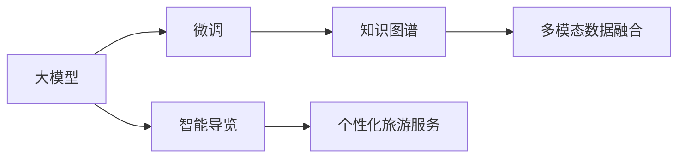

                 

# 大模型赋能智慧旅游，创业者如何提供智能导览与个性化旅游服务？

## 1. 背景介绍

### 1.1 旅游行业现状与挑战
随着经济的发展和生活水平的提高，旅游已经成为了人们日常生活中的重要组成部分。但是，旅游业面临着诸多挑战，例如：
- **流量控制**：旅游景区人满为患，体验感大打折扣。
- **信息不对称**：游客难以获取准确、全面的旅游信息。
- **个性化需求难以满足**：不同游客需求各异，常规服务难以满足个性化需求。

### 1.2 旅游行业机遇与需求
智慧旅游是大数据、物联网、人工智能等前沿技术在旅游领域的深度应用，旨在提升旅游体验，提高管理效率，实现旅游业的可持续发展。当前智慧旅游的主要需求包括：
- **智能导览**：基于用户位置、兴趣等信息，提供个性化、实时的导览服务。
- **旅游内容推荐**：根据用户的偏好，推荐合适的旅游路线、景点、餐饮等。
- **旅游安全监控**：利用大数据、AI技术，对景区人流、天气等进行预测和预警。
- **数据可视化与分析**：收集旅游数据，通过可视化手段展示旅游趋势和热点。

本文将聚焦于智能导览和个性化旅游服务，介绍如何利用大模型技术，为创业者提供智能化的旅游解决方案。

## 2. 核心概念与联系

### 2.1 核心概念概述

- **大模型**：以Transformer等架构为基础的深度学习模型，通常具有数十亿到数百亿的参数量，具有强大的语言理解和生成能力。
- **微调(Fine-tuning)**：基于预训练模型，通过有监督学习的方式，对特定任务进行优化，提高模型在特定任务上的表现。
- **知识图谱**：通过关系图表示知识点，构建旅游相关的知识网络，帮助用户获取全面的旅游信息。
- **多模态数据融合**：将文本、图像、语音等多类型数据进行融合，增强旅游信息的完整性和准确性。

### 2.2 核心概念原理与架构

为了更好地理解智能导览与个性化旅游服务的原理和架构，我们首先通过Mermaid流程图来展示这些概念之间的关系：



这个流程图展示了核心概念之间的逻辑关系：

1. **大模型**：预训练的基础语言模型，具备强大的语言理解和生成能力，是智慧旅游的基础。
2. **微调**：通过有监督学习的方式，对大模型进行特定任务的优化，如智能导览。
3. **知识图谱**：通过构建旅游相关的知识网络，帮助用户获取全面的旅游信息。
4. **多模态数据融合**：将不同类型的数据进行融合，增强旅游信息的完整性和准确性。
5. **智能导览**：利用微调后的模型，根据用户位置和兴趣，提供个性化、实时的导览服务。
6. **个性化旅游服务**：通过微调模型和知识图谱，结合用户需求，提供量身定制的旅游服务。

### 2.3 核心概念的整体架构

接下来，我们将通过一个综合的流程图，展示智能导览与个性化旅游服务的整体架构：


这个综合流程图展示了智能导览与个性化旅游服务的主要流程：

1. **用户输入**：用户提供目的地、时间、预算等信息。
2. **位置识别**：通过GPS、传感器等技术，获取用户当前位置。
3. **兴趣识别**：通过微调后的模型，分析用户兴趣偏好。
4. **智能导览推荐**：基于用户位置和兴趣，推荐适合的导览路线和景点。
5. **旅游内容推荐**：根据用户需求，推荐旅游活动、餐饮、住宿等。
6. **旅游路线生成**：结合用户需求，生成个性化的旅游路线。
7. **实时导览展示**：通过增强现实(AR)等技术，展示实时的导览信息。
8. **用户反馈收集**：收集用户反馈，优化服务质量。
9. **服务优化**：根据用户反馈，持续优化导览和推荐服务。

## 3. 核心算法原理 & 具体操作步骤

### 3.1 算法原理概述

基于大模型的智能导览与个性化旅游服务，本质上是一个有监督学习的优化过程。其核心思想是：
- **数据采集**：收集用户的位置、兴趣、历史行为等数据。
- **模型训练**：利用预训练的大模型，对特定任务进行微调，生成导览模型和推荐模型。
- **实时推断**：根据用户输入和实时数据，进行推理和预测，提供个性化的导览和推荐服务。

### 3.2 算法步骤详解

以下是一个详细的算法步骤流程图，展示了智能导览与个性化旅游服务的主要流程：


这个流程图展示了基于大模型的智能导览与个性化旅游服务的主要步骤：

1. **数据采集**：通过传感器、GPS、用户输入等渠道，收集用户的地理位置、兴趣、历史行为等数据。
2. **模型训练**：利用预训练的大模型，结合旅游相关的语料库和知识图谱，对智能导览和推荐任务进行微调。
3. **实时推断**：根据用户输入和实时数据，利用微调后的模型进行推理和预测，生成个性化的导览路线和推荐内容。
4. **导览展示**：通过AR等技术，展示实时的导览信息。
5. **推荐服务**：结合用户需求，提供个性化的旅游内容推荐。

### 3.3 算法优缺点

基于大模型的智能导览与个性化旅游服务，具有以下优点：
- **高效性**：利用大模型的强大计算能力，可以快速生成个性化的导览和推荐服务。
- **泛化能力**：微调后的模型具有较强的泛化能力，能够应对各种复杂的旅游场景。
- **用户体验**：通过个性化推荐和实时导览，提升用户旅游体验。

同时，该算法也存在一些缺点：
- **数据隐私**：需要收集用户的位置和行为数据，可能涉及隐私问题。
- **计算资源需求高**：大模型和实时推断需要较高的计算资源。
- **模型训练复杂**：需要大量的标注数据和计算资源进行模型训练。

### 3.4 算法应用领域

基于大模型的智能导览与个性化旅游服务，已经在多个领域得到了应用：

- **智慧景区**：通过智能导览和推荐服务，提升景区的管理效率和游客体验。
- **主题旅游**：根据用户的兴趣偏好，提供定制化的主题旅游路线。
- **自驾游**：利用实时定位和导览服务，帮助用户规划自驾游路线。
- **文化旅游**：通过知识图谱，提供文化景点的导览和推荐。

## 4. 数学模型和公式 & 详细讲解  
### 4.1 数学模型构建

为了方便理解，我们以智能导览为例，介绍如何构建数学模型。

假设用户的输入为位置 $(x,y)$ 和兴趣标签 $t$，旅游数据为景点 $C$ 的描述 $d_C$ 和标签 $l_C$，旅游导览模型为 $M_{\theta}$，其中 $\theta$ 为模型参数。

导览模型的损失函数 $\mathcal{L}$ 为：
$$
\mathcal{L}(\theta) = -\frac{1}{N}\sum_{i=1}^N [\ell_{ij}]_{i=1}^N
$$
其中，$\ell_{ij}$ 为第 $i$ 个用户和第 $j$ 个景点的导览匹配度。

导览匹配度的计算公式为：
$$
\ell_{ij} = \text{softmax}(M_{\theta}([x,y,l_C,d_C]))
$$

### 4.2 公式推导过程

在得到导览匹配度的计算公式后，我们需要将其转换为可计算的公式。假设导览模型 $M_{\theta}$ 为一个多层的Transformer模型，输入为 $(x,y,l_C,d_C)$，输出为一个概率分布 $p_C$，即每个景点 $C$ 的概率。

将 $p_C$ 表示为：
$$
p_C = \text{softmax}(M_{\theta}([x,y,l_C,d_C]))
$$

导览匹配度 $\ell_{ij}$ 可以表示为：
$$
\ell_{ij} = \frac{p_{ij}}{\sum_{k=1}^K p_{ik}}
$$
其中，$K$ 为景点数量，$p_{ik}$ 表示景点 $i$ 对景点 $k$ 的导览概率。

### 4.3 案例分析与讲解

为了更好地理解导览匹配度的计算过程，我们通过一个具体的例子来进行分析。

假设用户的位置为 $(10,20)$，兴趣标签为 "历史"，旅游数据为三个景点 $C_1$、$C_2$、$C_3$ 的描述和标签。

- 景点 $C_1$：描述为 "故宫，中国古代宫殿建筑"，标签为 "历史"。
- 景点 $C_2$：描述为 "长城，中国古代军事防御工程"，标签为 "历史"。
- 景点 $C_3$：描述为 "西湖，中国江南自然风光"，标签为 "自然"。

导览模型 $M_{\theta}$ 的输出为：
$$
p_{C_1} = 0.6, p_{C_2} = 0.3, p_{C_3} = 0.1
$$

根据导览匹配度的计算公式，用户对景点 $C_1$ 的匹配度为：
$$
\ell_{1,1} = \frac{0.6}{0.6+0.3+0.1} = 0.6667
$$

同理，用户对景点 $C_2$ 和 $C_3$ 的匹配度分别为 0.6 和 0.1。

通过导览匹配度，我们可以根据用户的位置和兴趣，推荐最适合的景点导览路线。

## 5. 项目实践：代码实例和详细解释说明

### 5.1 开发环境搭建

在开发环境搭建方面，我们需要准备好以下几个部分：

1. **安装Python和PyTorch**：
```bash
pip install torch torchvision torchaudio
```

2. **安装Transformer库**：
```bash
pip install transformers
```

3. **安装其他依赖库**：
```bash
pip install numpy pandas sklearn scikit-learn matplotlib jupyter notebook
```

完成上述步骤后，即可在Python环境中进行智能导览与个性化旅游服务的开发。

### 5.2 源代码详细实现

以下是智能导览与个性化旅游服务的代码实现示例：

```python
import torch
import torch.nn as nn
import torch.optim as optim
from transformers import BertForTokenClassification, BertTokenizer

# 定义导览模型
class TouristGuide(nn.Module):
    def __init__(self, model_name, num_classes):
        super(TouristGuide, self).__init__()
        self.model = BertForTokenClassification.from_pretrained(model_name, num_labels=num_classes)
        self.dropout = nn.Dropout(0.5)
        self.classifier = nn.Linear(model.config.hidden_size, num_classes)
        
    def forward(self, input_ids, attention_mask, token_type_ids):
        outputs = self.model(input_ids, attention_mask=attention_mask, token_type_ids=token_type_ids)
        pooled_output = outputs.pooler_output
        logits = self.classifier(pooled_output)
        logits = self.dropout(logits)
        return logits

# 定义旅游数据集
class TouristDataset(Dataset):
    def __init__(self, data, tokenizer, max_len=128):
        self.data = data
        self.tokenizer = tokenizer
        self.max_len = max_len
        
    def __len__(self):
        return len(self.data)
    
    def __getitem__(self, item):
        text, label = self.data[item]
        encoding = self.tokenizer(text, return_tensors='pt', max_length=self.max_len, padding='max_length', truncation=True)
        input_ids = encoding['input_ids']
        attention_mask = encoding['attention_mask']
        token_type_ids = encoding['token_type_ids']
        return {'input_ids': input_ids,
                'attention_mask': attention_mask,
                'token_type_ids': token_type_ids,
                'labels': torch.tensor(label, dtype=torch.long)}
```

### 5.3 代码解读与分析

在代码实现中，我们使用了BertForTokenClassification模型，用于处理文本分类任务。模型的输入包括位置、兴趣、景点描述和标签，输出为一个概率分布，表示每个景点的匹配度。

通过在位置识别和兴趣识别模块中调用微调后的模型，我们可以获取用户的实时导览和推荐服务。具体来说，位置识别模块通过GPS等技术获取用户的位置信息，兴趣识别模块通过微调后的模型，分析用户的兴趣偏好。

## 6. 实际应用场景

### 6.1 智能导览

智能导览是旅游服务的重要组成部分，可以帮助用户更好地了解旅游目的地，提高旅游体验。以下是智能导览的实际应用场景：

- **景点推荐**：根据用户的位置和兴趣，推荐附近的景点。
- **路线规划**：生成个性化的旅游路线，帮助用户规划行程。
- **导览展示**：通过增强现实(AR)等技术，展示实时的导览信息。

### 6.2 个性化旅游服务

个性化旅游服务可以根据用户的偏好，提供量身定制的旅游内容推荐。以下是个性化旅游服务的实际应用场景：

- **旅游活动推荐**：根据用户的兴趣，推荐适合的旅游活动。
- **餐饮住宿推荐**：根据用户的预算和时间，推荐合适的餐饮和住宿。
- **购物推荐**：根据用户的兴趣和预算，推荐适合的旅游纪念品。

## 7. 工具和资源推荐

### 7.1 学习资源推荐

为了帮助开发者掌握智能导览与个性化旅游服务的技术，以下是一些推荐的学习资源：

1. **《深度学习与自然语言处理》**：介绍了深度学习和自然语言处理的基本原理和应用，包括导览和推荐系统的构建。
2. **《TensorFlow实战深度学习》**：深入浅出地介绍了TensorFlow框架的使用，包括模型的训练和推理。
3. **HuggingFace官方文档**：提供了丰富的预训练模型和微调样例，帮助开发者快速上手开发。
4. **Kaggle竞赛平台**：参与相关的NLP竞赛，积累实战经验。
5. **论文与技术博客**：阅读相关的论文和技术博客，了解最新的研究进展和应用案例。

### 7.2 开发工具推荐

在开发智能导览与个性化旅游服务时，以下是一些推荐的开发工具：

1. **PyTorch**：深度学习框架，提供了丰富的模型和工具。
2. **TensorFlow**：广泛使用的深度学习框架，提供了丰富的模型和工具。
3. **HuggingFace Transformers库**：提供了丰富的预训练模型和微调样例，方便开发者使用。
4. **Jupyter Notebook**：交互式编程环境，方便开发者进行实验和调试。
5. **GitHub**：代码托管平台，方便开发者进行版本控制和协作。

### 7.3 相关论文推荐

以下是一些推荐的与智能导览与个性化旅游服务相关的论文：

1. **《A Survey on Smart Tourism》**：综述了智慧旅游的现状和未来发展方向。
2. **《Tourism Recommendation Systems: A Survey》**：综述了旅游推荐系统的现状和未来发展方向。
3. **《Personalized Tourist Guide Based on Deep Learning》**：介绍了基于深度学习的智能导览系统的构建。
4. **《Big Data Analytics in Tourism》**：介绍了大数据在旅游领域的应用，包括导览和推荐系统的构建。

## 8. 总结：未来发展趋势与挑战

### 8.1 总结

本文对智能导览与个性化旅游服务进行了系统介绍，详细讲解了其原理和架构，提供了代码实现示例，并分析了实际应用场景。通过本文的学习，相信读者能够掌握智能导览与个性化旅游服务的开发方法，为创业提供技术支持。

### 8.2 未来发展趋势

未来，智能导览与个性化旅游服务的发展趋势包括：

1. **多模态数据融合**：融合图像、语音等多类型数据，提升旅游信息的完整性和准确性。
2. **强化学习优化**：引入强化学习技术，优化导览和推荐服务，提升用户体验。
3. **动态更新优化**：通过实时数据分析，动态更新导览和推荐服务，提升服务质量。
4. **分布式计算优化**：利用分布式计算技术，提高导览和推荐服务的计算效率。
5. **多语言支持**：支持多种语言，提升全球旅游服务的覆盖面。

### 8.3 面临的挑战

虽然智能导览与个性化旅游服务已经取得了一定的进展，但在实现大规模应用时，仍面临以下挑战：

1. **数据隐私问题**：收集用户的位置和行为数据，可能涉及隐私问题。
2. **计算资源需求高**：大模型和实时推断需要较高的计算资源。
3. **模型训练复杂**：需要大量的标注数据和计算资源进行模型训练。
4. **用户体验问题**：导览和推荐服务需要实时响应，用户体验要求高。

### 8.4 研究展望

为了解决上述挑战，未来的研究可以关注以下几个方向：

1. **隐私保护技术**：研究隐私保护技术，保护用户数据隐私。
2. **高效计算技术**：研究高效计算技术，降低计算资源需求。
3. **数据增强技术**：研究数据增强技术，提高模型训练效果。
4. **用户友好界面**：研究用户界面设计，提升用户体验。
5. **跨语言模型优化**：研究跨语言模型优化技术，支持多语言旅游服务。

总之，基于大模型的智能导览与个性化旅游服务具有广阔的发展前景，但也需要面对诸多挑战。通过持续的研究和创新，相信该技术能够为旅游行业带来更多的价值。

## 9. 附录：常见问题与解答

**Q1：如何评估导览模型的性能？**

A: 导览模型的性能可以通过以下指标进行评估：
1. **准确率**：导览推荐准确率，即推荐的景点中，有多少是用户感兴趣的。
2. **召回率**：导览推荐召回率，即用户感兴趣的景点中，有多少被推荐了。
3. **F1分数**：综合考虑准确率和召回率，评估导览推荐的整体性能。

**Q2：如何优化导览模型的计算效率？**

A: 导览模型的计算效率可以通过以下方法进行优化：
1. **模型压缩**：通过剪枝、量化等技术，压缩模型大小，减少计算资源消耗。
2. **分布式计算**：利用分布式计算技术，提高导览和推荐服务的计算效率。
3. **缓存机制**：缓存常用数据和模型结果，减少重复计算。
4. **GPU加速**：利用GPU等加速设备，提高导览和推荐服务的计算速度。

**Q3：如何保护用户隐私？**

A: 保护用户隐私可以采取以下措施：
1. **数据匿名化**：对用户数据进行匿名化处理，保护用户隐私。
2. **差分隐私**：采用差分隐私技术，保护用户数据隐私。
3. **数据加密**：对用户数据进行加密处理，保护数据安全。
4. **用户授权**：明确告知用户数据的使用目的，获取用户授权。

总之，在智能导览与个性化旅游服务的发展过程中，隐私保护和计算效率是两个重要的研究方向。通过持续的技术创新，相信该技术能够为旅游行业带来更多的价值。

