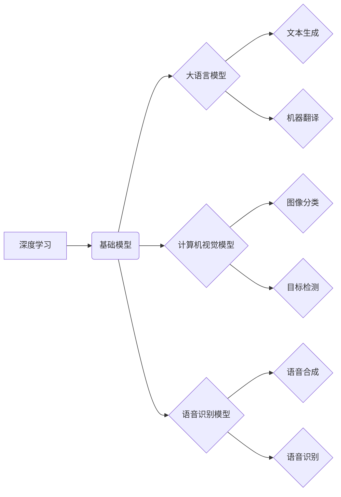

## 基础模型的早期阶段与潜力

> 关键词：基础模型、大语言模型、深度学习、迁移学习、泛化能力、应用场景、伦理挑战

### 1. 背景介绍

近年来，深度学习技术取得了飞速发展，尤其是 Transformer 架构的出现，为自然语言处理领域带来了革命性的变革。基础模型作为深度学习领域的新兴研究方向，正逐渐成为人工智能发展的新引擎。

基础模型是指在海量数据上预训练的大规模深度学习模型，具有强大的泛化能力和可迁移性。它们可以被微调到各种下游任务，例如文本生成、机器翻译、问答系统、代码生成等，显著提升了模型性能和效率。

### 2. 核心概念与联系

**2.1 核心概念**

* **基础模型 (Foundation Model):**  预先训练的大规模深度学习模型，能够在多种下游任务中表现出色，并通过微调实现特定任务的优化。
* **大语言模型 (Large Language Model, LLM):**  一种专门处理文本数据的基础模型，能够理解和生成人类语言，例如 GPT-3、BERT、LaMDA 等。
* **深度学习 (Deep Learning):**  一种机器学习方法，利用多层神经网络模拟人类大脑的学习过程。
* **迁移学习 (Transfer Learning):**  将预训练模型在源任务上的知识迁移到目标任务，提高目标任务的学习效率。

**2.2 架构关系**



### 3. 核心算法原理 & 具体操作步骤

**3.1 算法原理概述**

基础模型的训练主要基于深度学习的原理，特别是 Transformer 架构。Transformer 模型利用自注意力机制，能够捕捉文本序列中长距离依赖关系，从而实现更准确的文本理解和生成。

**3.2 算法步骤详解**

1. **数据预处理:**  收集海量文本数据，进行清洗、分词、标记等预处理操作。
2. **模型构建:**  搭建 Transformer 模型架构，包括编码器、解码器和自注意力机制等模块。
3. **预训练:**  利用预处理后的数据对模型进行预训练，训练目标通常是预测下一个词或掩盖部分词语。
4. **微调:**  将预训练好的模型微调到特定下游任务，例如文本分类、问答系统等。

**3.3 算法优缺点**

* **优点:**
    * 强大的泛化能力：预训练模型在海量数据上学习了丰富的语言知识，能够应用于多种下游任务。
    * 可迁移性：预训练模型可以迁移到不同领域和任务，降低了模型训练成本和时间。
    * 提升模型性能：微调预训练模型通常能够显著提升模型性能。
* **缺点:**
    * 训练成本高：基础模型训练需要大量的计算资源和时间。
    * 数据依赖性强：模型性能受训练数据质量和数量的影响。
    * 潜在的偏差和风险：预训练模型可能包含训练数据中的偏差和风险，需要进行仔细的评估和缓解。

**3.4 算法应用领域**

基础模型在多个领域都有广泛的应用，例如：

* **自然语言处理:** 文本生成、机器翻译、问答系统、文本摘要、情感分析等。
* **计算机视觉:** 图像分类、目标检测、图像生成、视频理解等。
* **语音识别:** 语音转文本、语音合成、语音情感分析等。
* **代码生成:** 代码自动完成、代码翻译、代码修复等。

### 4. 数学模型和公式 & 详细讲解 & 举例说明

**4.1 数学模型构建**

基础模型通常基于 Transformer 架构，其核心是自注意力机制。自注意力机制可以计算每个词语与其他词语之间的相关性，从而捕捉文本序列中的长距离依赖关系。

**4.2 公式推导过程**

假设我们有一个文本序列 $x = (x_1, x_2,..., x_n)$，其中 $x_i$ 表示第 $i$ 个词语。自注意力机制的计算过程如下：

1. **计算词嵌入:** 将每个词语 $x_i$ 映射到一个低维向量 $e_i$。
2. **计算注意力权重:**  对于每个词语 $x_i$，计算它与其他词语 $x_j$ 之间的注意力权重 $a_{ij}$。

$$a_{ij} = \frac{\exp(score(e_i, e_j))}{\sum_{k=1}^{n} \exp(score(e_i, e_k))}$$

其中 $score(e_i, e_j)$ 是词语 $x_i$ 和 $x_j$ 之间的相似度得分，可以使用点积或其他相似度函数计算。

3. **计算加权平均:**  对每个词语 $x_i$，计算其与其他词语的加权平均，得到上下文向量 $c_i$。

$$c_i = \sum_{j=1}^{n} a_{ij} e_j$$

**4.3 案例分析与讲解**

例如，在机器翻译任务中，基础模型可以利用自注意力机制捕捉源语言和目标语言之间的对应关系，从而实现更准确的翻译。

### 5. 项目实践：代码实例和详细解释说明

**5.1 开发环境搭建**

* Python 3.7+
* PyTorch 或 TensorFlow
* CUDA 和 cuDNN (可选，用于 GPU 加速)

**5.2 源代码详细实现**

```python
import torch
import torch.nn as nn

class Transformer(nn.Module):
    def __init__(self, vocab_size, embedding_dim, num_heads, num_layers):
        super(Transformer, self).__init__()
        self.embedding = nn.Embedding(vocab_size, embedding_dim)
        self.transformer_layers = nn.ModuleList([
            nn.TransformerEncoderLayer(embedding_dim, num_heads)
            for _ in range(num_layers)
        ])
        self.linear = nn.Linear(embedding_dim, vocab_size)

    def forward(self, x):
        x = self.embedding(x)
        for layer in self.transformer_layers:
            x = layer(x)
        x = self.linear(x)
        return x
```

**5.3 代码解读与分析**

* `__init__` 方法初始化模型参数，包括词嵌入层、Transformer 层和输出层。
* `forward` 方法定义模型的正向传播过程，将输入序列映射到输出序列。
* `nn.Embedding` 层将词语索引映射到词嵌入向量。
* `nn.TransformerEncoderLayer` 层是 Transformer 的基本单元，包含多头自注意力机制和前馈神经网络。
* `nn.Linear` 层将上下文向量映射到输出词语的概率分布。

**5.4 运行结果展示**

训练好的基础模型可以用于各种下游任务，例如文本生成、机器翻译等。

### 6. 实际应用场景

基础模型在多个领域都有广泛的应用，例如：

* **聊天机器人:** 基于基础模型的聊天机器人能够进行更自然、更流畅的对话。
* **搜索引擎:** 基础模型可以用于理解用户搜索意图，并提供更精准的搜索结果。
* **内容创作:** 基于基础模型的工具可以帮助用户生成高质量的文本内容，例如文章、故事、诗歌等。
* **教育:** 基于基础模型的教育工具可以提供个性化的学习体验，并帮助学生提高学习效率。

**6.4 未来应用展望**

随着基础模型技术的不断发展，其应用场景将更加广泛，例如：

* **科学研究:** 基于基础模型的工具可以帮助科学家分析大规模数据，并发现新的科学规律。
* **医疗保健:** 基于基础模型的工具可以辅助医生诊断疾病、预测患者风险、开发新药等。
* **法律:** 基于基础模型的工具可以帮助律师分析法律文件、预测案件结果等。

### 7. 工具和资源推荐

**7.1 学习资源推荐**

* **论文:**
    * Attention Is All You Need (Vaswani et al., 2017)
    * BERT: Pre-training of Deep Bidirectional Transformers for Language Understanding (Devlin et al., 2018)
    * GPT-3: Language Models are Few-Shot Learners (Brown et al., 2020)
* **书籍:**
    * Deep Learning (Goodfellow et al., 2016)
    * Natural Language Processing with Transformers (Hugging Face, 2020)

**7.2 开发工具推荐**

* **PyTorch:**  https://pytorch.org/
* **TensorFlow:** https://www.tensorflow.org/
* **Hugging Face Transformers:** https://huggingface.co/transformers/

**7.3 相关论文推荐**

* **OpenAI GPT-3:** https://arxiv.org/abs/2005.14165
* **Google BERT:** https://arxiv.org/abs/1810.04805
* **Meta AI OPT:** https://arxiv.org/abs/2205.09628

### 8. 总结：未来发展趋势与挑战

**8.1 研究成果总结**

基础模型在自然语言处理、计算机视觉等领域取得了显著的成果，展现出强大的泛化能力和可迁移性。

**8.2 未来发展趋势**

* **模型规模的进一步扩大:**  更大的模型规模能够带来更强的性能，但同时也带来更高的训练成本和资源需求。
* **模型架构的创新:**  新的模型架构能够提高模型效率和性能，例如高效 Transformer 架构、混合模型等。
* **多模态基础模型:**  融合文本、图像、音频等多模态数据，构建更强大的基础模型。
* **可解释性研究:**  提高基础模型的可解释性，帮助人们更好地理解模型的决策过程。

**8.3 面临的挑战**

* **训练成本:**  基础模型的训练成本非常高，需要大量的计算资源和时间。
* **数据依赖性:**  基础模型的性能受训练数据质量和数量的影响，需要高质量、大规模的数据支持。
* **伦理挑战:**  基础模型可能存在偏差和风险，需要进行仔细的评估和缓解。

**8.4 研究展望**

未来，基础模型研究将继续朝着更强大、更安全、更可解释的方向发展，为人工智能的广泛应用提供坚实的基础。

### 9. 附录：常见问题与解答

* **什么是基础模型的预训练？**

预训练是指在海量数据上训练模型，使其学习到通用的语言知识和表示能力。

* **基础模型如何应用于特定任务？**

可以通过微调预训练模型的方式，将模型适配到特定任务。

* **基础模型有哪些伦理挑战？**

基础模型可能存在偏差和风险，例如性别、种族、文化等方面的偏见，需要进行仔细的评估和缓解。


作者：禅与计算机程序设计艺术 / Zen and the Art of Computer Programming 
