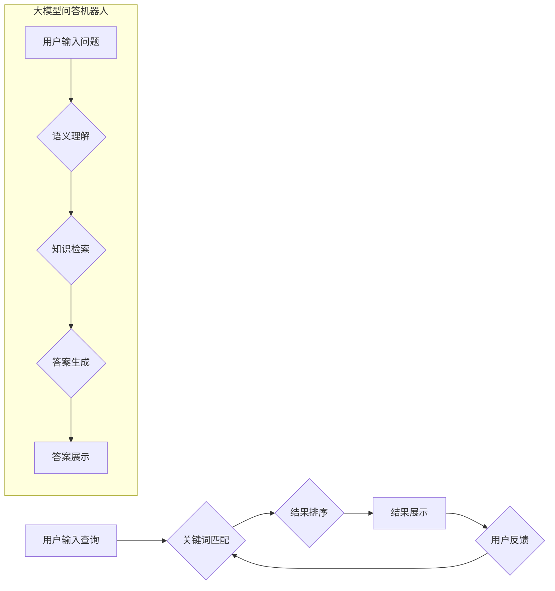

## 大模型问答机器人与传统搜索推荐的交互方式

> 关键词：大模型、问答机器人、搜索推荐、交互方式、自然语言处理、信息检索

## 1. 背景介绍

随着人工智能技术的飞速发展，大模型问答机器人（Large Language Model Chatbot, LLMC）逐渐成为人们关注的焦点。这些机器人能够理解和生成人类语言，并通过深度学习模型对海量文本数据进行训练，从而具备回答问题、进行对话、创作内容等多种能力。与此同时，传统搜索推荐系统仍然是获取信息的主要途径，其核心是通过关键词匹配、语义分析等技术，从海量数据中找到与用户查询最相关的结果。

然而，传统搜索推荐系统存在一些局限性，例如：

* **依赖关键词匹配:**  传统的搜索引擎主要依赖关键词匹配，难以理解用户复杂的需求和意图。
* **结果展示单一:**  搜索结果通常以链接形式展示，缺乏交互性和个性化。
* **信息碎片化:**  用户需要从多个结果中筛选信息，效率低下。

大模型问答机器人则能够克服这些局限性，提供更智能、更便捷的搜索体验。

## 2. 核心概念与联系

### 2.1  大模型问答机器人

大模型问答机器人是基于深度学习技术的智能对话系统，其核心是训练一个庞大的语言模型，能够理解和生成人类语言。这些模型通常拥有数十亿甚至数千亿的参数，通过学习海量文本数据，掌握了丰富的语言知识和语义理解能力。

### 2.2  传统搜索推荐系统

传统搜索推荐系统主要通过以下步骤工作：

1. **用户查询:** 用户输入关键词或短语进行查询。
2. **关键词匹配:** 系统将用户查询与数据库中的关键词进行匹配，找到相关结果。
3. **排序排名:** 根据匹配度、用户历史行为等因素，对结果进行排序排名。
4. **结果展示:** 将排序后的结果以链接、摘要等形式展示给用户。

### 2.3  交互方式

大模型问答机器人与传统搜索推荐系统可以采用多种交互方式，例如：

* **文本问答:** 用户通过文本输入问题，机器人通过文本输出答案。
* **对话式搜索:** 用户与机器人进行对话式交互，逐步 refine 查询意图，获得更精准的结果。
* **多模态交互:** 用户可以通过文本、语音、图像等多种方式与机器人交互。

**Mermaid 流程图**



## 3. 核心算法原理 & 具体操作步骤

### 3.1  算法原理概述

大模型问答机器人主要基于以下核心算法：

* **自然语言处理 (NLP):** 用于理解和处理人类语言，包括词法分析、语法分析、语义分析等。
* **深度学习:** 用于训练语言模型，例如Transformer模型，能够捕捉语言的复杂语义关系。
* **知识图谱:** 用于存储和组织知识，帮助机器人理解用户问题和提供更准确的答案。

### 3.2  算法步骤详解

1. **预处理:** 对用户输入进行预处理，例如去除停用词、分词、词性标注等。
2. **语义理解:** 利用NLP技术分析用户问题，识别关键信息和意图。
3. **知识检索:** 根据语义理解结果，从知识图谱中检索相关知识。
4. **答案生成:** 利用深度学习模型生成符合用户需求的答案。
5. **答案评估:** 对生成的答案进行评估，例如准确性、流畅度、相关性等。
6. **答案展示:** 将经过评估的答案以文本、语音、图像等形式展示给用户。

### 3.3  算法优缺点

**优点:**

* 能够理解用户复杂的需求和意图。
* 提供更智能、更个性化的搜索体验。
* 能够生成更丰富、更全面的答案。

**缺点:**

* 训练成本高，需要海量数据和计算资源。
* 存在知识盲点，无法回答所有问题。
* 容易受到恶意输入的影响。

### 3.4  算法应用领域

* **智能客服:** 自动回答用户常见问题，提高客服效率。
* **搜索引擎:** 提供更智能、更精准的搜索结果。
* **教育领域:** 提供个性化的学习辅导和知识问答。
* **医疗领域:** 辅助医生诊断疾病、提供医疗信息。

## 4. 数学模型和公式 & 详细讲解 & 举例说明

### 4.1  数学模型构建

大模型问答机器人通常使用Transformer模型，其核心是注意力机制。注意力机制能够学习文本中不同词语之间的关系，从而更好地理解语义。

**注意力机制公式:**

$$
Attention(Q, K, V) = \frac{exp(Q \cdot K^T / \sqrt{d_k})}{exp(Q \cdot K^T / \sqrt{d_k})} \cdot V
$$

其中：

* $Q$: 查询向量
* $K$: 键向量
* $V$: 值向量
* $d_k$: 键向量的维度

### 4.2  公式推导过程

注意力机制的公式通过计算查询向量与键向量的点积，并使用softmax函数进行归一化，得到每个键向量的权重。然后，将这些权重与值向量相乘，得到最终的注意力输出。

### 4.3  案例分析与讲解

例如，在理解句子“小明喜欢吃苹果”时，注意力机制会将“小明”与“喜欢吃”关联起来，并将“苹果”作为目标词，从而理解出小明喜欢吃苹果。

## 5. 项目实践：代码实例和详细解释说明

### 5.1  开发环境搭建

* Python 3.7+
* TensorFlow/PyTorch
* CUDA/cuDNN

### 5.2  源代码详细实现

```python
# 使用HuggingFace Transformers库加载预训练模型
from transformers import AutoModelForQuestionAnswering, AutoTokenizer

model_name = "bert-base-uncased"
tokenizer = AutoTokenizer.from_pretrained(model_name)
model = AutoModelForQuestionAnswering.from_pretrained(model_name)

# 用户输入问题和文本
question = "小明喜欢吃什么水果？"
text = "小明喜欢吃苹果。"

# 对文本进行token化
inputs = tokenizer(text, question, return_tensors="pt")

# 使用模型进行推理
outputs = model(**inputs)

# 获取答案
answer_start = outputs.start_logits.argmax().item()
answer_end = outputs.end_logits.argmax().item()
answer = tokenizer.decode(inputs["input_ids"][0][answer_start:answer_end+1])

# 打印答案
print(f"答案: {answer}")
```

### 5.3  代码解读与分析

* 使用HuggingFace Transformers库加载预训练模型，例如BERT模型。
* 对用户输入的问题和文本进行token化，转换为模型可理解的格式。
* 使用模型进行推理，获取答案的起始和结束位置。
* 将答案位置转换为文本，并打印输出。

### 5.4  运行结果展示

```
答案: 苹果
```

## 6. 实际应用场景

### 6.1  智能客服

大模型问答机器人可以用于构建智能客服系统，自动回答用户常见问题，例如订单查询、退换货流程、产品信息等。

### 6.2  搜索引擎

大模型问答机器人可以用于改进搜索引擎，提供更智能、更精准的搜索结果。例如，用户可以进行自然语言查询，机器人可以理解用户意图，并返回相关结果。

### 6.3  教育领域

大模型问答机器人可以用于提供个性化的学习辅导和知识问答。例如，学生可以向机器人提问学习内容，机器人可以根据学生的知识水平提供相应的答案和解释。

### 6.4  未来应用展望

大模型问答机器人将在未来广泛应用于各个领域，例如医疗、金融、法律等，为人们提供更智能、更便捷的服务。

## 7. 工具和资源推荐

### 7.1  学习资源推荐

* **HuggingFace Transformers:** https://huggingface.co/docs/transformers/index
* **OpenAI API:** https://beta.openai.com/docs/api-reference/introduction
* **Stanford NLP Group:** https://nlp.stanford.edu/

### 7.2  开发工具推荐

* **Jupyter Notebook:** https://jupyter.org/
* **Google Colab:** https://colab.research.google.com/
* **VS Code:** https://code.visualstudio.com/

### 7.3  相关论文推荐

* **BERT: Pre-training of Deep Bidirectional Transformers for Language Understanding:** https://arxiv.org/abs/1810.04805
* **GPT-3: Language Models are Few-Shot Learners:** https://arxiv.org/abs/2005.14165
* **T5: Text-to-Text Transfer Transformer:** https://arxiv.org/abs/1910.10683

## 8. 总结：未来发展趋势与挑战

### 8.1  研究成果总结

大模型问答机器人技术取得了显著进展，能够理解和生成更复杂的语言，并应用于多个领域。

### 8.2  未来发展趋势

* **模型规模更大:** 训练更大规模的模型，提升模型能力。
* **多模态交互:** 支持文本、语音、图像等多种模态交互。
* **个性化定制:** 根据用户需求进行模型定制，提供更个性化的服务。
* **安全可靠:** 提升模型安全性，防止恶意攻击和信息泄露。

### 8.3  面临的挑战

* **训练成本高:** 训练大模型需要大量的计算资源和数据。
* **数据质量问题:** 模型性能受限于训练数据的质量。
* **伦理道德问题:** 模型可能存在偏见和歧视，需要进行伦理道德评估。

### 8.4  研究展望

未来，大模型问答机器人技术将继续发展，为人们提供更智能、更便捷的服务。需要加强模型安全性、可靠性和伦理道德方面的研究，确保其健康发展。

## 9. 附录：常见问题与解答

* **Q: 大模型问答机器人与传统搜索引擎有什么区别？**

A: 大模型问答机器人能够理解用户复杂的需求和意图，提供更智能、更个性化的搜索体验。而传统搜索引擎主要依赖关键词匹配，难以理解用户复杂的需求。

* **Q: 如何训练大模型问答机器人？**

A: 需要使用海量文本数据进行训练，并使用深度学习算法，例如Transformer模型。

* **Q: 大模型问答机器人的应用场景有哪些？**

A: 大模型问答机器人可以应用于智能客服、搜索引擎、教育领域、医疗领域等多个领域。


作者：禅与计算机程序设计艺术 / Zen and the Art of Computer Programming 
