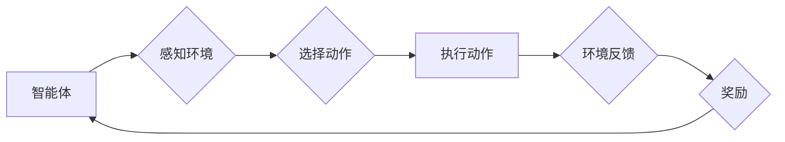

## 强化学习(Reinforcement Learning) - 原理与代码实例讲解

> 关键词：强化学习、RL、智能体、环境、奖励、策略、价值函数、Q学习、深度强化学习、代码实例

## 1. 背景介绍

在人工智能领域，强化学习 (Reinforcement Learning, RL) 作为一种学习方式，近年来备受关注。它与监督学习和无监督学习不同，强化学习的核心在于让智能体通过与环境的交互，学习最优的行为策略，以最大化累积的奖励。

想象一下，一个机器人需要学习如何玩一个游戏。通过观察游戏规则和环境反馈，它会尝试不同的行动，并根据行动的结果获得奖励或惩罚。通过不断尝试和学习，机器人最终会找到最优的策略，从而赢得游戏。这就是强化学习的基本原理。

强化学习在许多领域都有广泛的应用，例如：

* **游戏 AI:** 训练游戏中的 AI 玩家，使其能够战胜人类对手。
* **机器人控制:** 训练机器人完成复杂的任务，例如导航、抓取和组装。
* **推荐系统:** 建立个性化的推荐系统，推荐用户感兴趣的内容。
* **医疗保健:** 辅助医生诊断疾病、制定治疗方案。
* **金融市场:** 进行股票交易、风险管理等。

## 2. 核心概念与联系

强化学习的核心概念包括：

* **智能体 (Agent):** 学习和决策的实体，例如机器人、游戏玩家或算法模型。
* **环境 (Environment):** 智能体所处的外部世界，它提供给智能体感知信息和反馈。
* **状态 (State):** 环境的当前状态，描述环境中所有相关信息。
* **动作 (Action):** 智能体可以执行的操作，例如移动、点击或发出指令。
* **奖励 (Reward):** 环境对智能体动作的反馈，可以是正向奖励或负向惩罚。
* **策略 (Policy):** 智能体根据当前状态选择动作的规则。
* **价值函数 (Value Function):** 评估智能体在特定状态下采取特定策略的长期回报。

**Mermaid 流程图:**



## 3. 核心算法原理 & 具体操作步骤

### 3.1  算法原理概述

Q学习是强化学习中一种经典的算法，它通过学习一个 Q 表来评估每个状态-动作对的价值。Q 表是一个表格，其中每个单元格存储了智能体在特定状态下执行特定动作的期望回报。

Q学习的目的是最大化累积的奖励，它通过迭代更新 Q 表来实现。每次智能体采取行动后，都会根据环境反馈和奖励更新 Q 表中的相应单元格。

### 3.2  算法步骤详解

1. **初始化 Q 表:** 将 Q 表中的所有单元格初始化为 0 或随机值。
2. **选择动作:** 根据当前状态和策略选择一个动作。策略可以是贪婪策略 (选择 Q 值最大的动作) 或探索策略 (随机选择动作)。
3. **执行动作:** 在环境中执行选择的动作。
4. **获得奖励和下一个状态:** 从环境获得奖励和下一个状态的信息。
5. **更新 Q 值:** 使用 Bellman 方程更新 Q 表中的相应单元格:

$$
Q(s, a) = Q(s, a) + \alpha [r + \gamma \max_{a'} Q(s', a') - Q(s, a)]
$$

其中:

* $Q(s, a)$ 是当前状态 $s$ 下执行动作 $a$ 的 Q 值。
* $\alpha$ 是学习率，控制着 Q 值更新的幅度。
* $r$ 是从环境获得的奖励。
* $\gamma$ 是折扣因子，控制着未来奖励的权重。
* $s'$ 是下一个状态。
* $a'$ 是下一个状态下执行的动作。

6. **重复步骤 2-5:** 直到达到终止条件，例如达到最大迭代次数或智能体达到目标状态。

### 3.3  算法优缺点

**优点:**

* 算法简单易懂，易于实现。
* 可以应用于离散状态和动作空间的问题。
* 能够学习复杂的策略。

**缺点:**

* 对于连续状态和动作空间的问题，Q 表的维度会非常高，难以存储和更新。
* 学习效率可能较低，尤其是在状态空间很大时。

### 3.4  算法应用领域

Q学习广泛应用于以下领域:

* **游戏 AI:** 训练游戏中的 AI 玩家，例如 AlphaGo。
* **机器人控制:** 训练机器人完成复杂的任务，例如导航和抓取。
* **推荐系统:** 建立个性化的推荐系统，推荐用户感兴趣的内容。

## 4. 数学模型和公式 & 详细讲解 & 举例说明

### 4.1  数学模型构建

强化学习的数学模型主要包括状态空间、动作空间、奖励函数和价值函数。

* **状态空间 (S):** 所有可能的智能体状态的集合。
* **动作空间 (A):** 智能体可以执行的所有动作的集合。
* **奖励函数 (R):** 描述环境对智能体动作的反馈，通常是一个从状态-动作对到实数的函数。
* **价值函数 (V):** 评估智能体在特定状态下采取特定策略的长期回报。

### 4.2  公式推导过程

Q学习的核心公式是 Bellman 方程:

$$
Q(s, a) = Q(s, a) + \alpha [r + \gamma \max_{a'} Q(s', a') - Q(s, a)]
$$

其中:

* $Q(s, a)$ 是当前状态 $s$ 下执行动作 $a$ 的 Q 值。
* $\alpha$ 是学习率，控制着 Q 值更新的幅度。
* $r$ 是从环境获得的奖励。
* $\gamma$ 是折扣因子，控制着未来奖励的权重。
* $s'$ 是下一个状态。
* $a'$ 是下一个状态下执行的动作。

Bellman 方程表示 Q 值的更新应该基于当前状态、动作、奖励和下一个状态的 Q 值。

### 4.3  案例分析与讲解

假设一个智能体在玩一个简单的游戏，游戏中有两个状态 (s1, s2) 和两个动作 (a1, a2)。

* 从状态 s1 执行动作 a1 得到奖励 r1 = 1 和下一个状态 s2。
* 从状态 s1 执行动作 a2 得到奖励 r2 = -1 和下一个状态 s1。
* 从状态 s2 执行动作 a1 得到奖励 r3 = 0 和下一个状态 s1。
* 从状态 s2 执行动作 a2 得到奖励 r4 = 1 和下一个状态 s2。

使用 Q 学习算法，我们可以更新 Q 值，最终找到最优策略。

## 5. 项目实践：代码实例和详细解释说明

### 5.1  开发环境搭建

* Python 3.x
* TensorFlow 或 PyTorch

### 5.2  源代码详细实现

```python
import numpy as np

# 定义状态空间和动作空间
states = ['s1','s2']
actions = ['a1', 'a2']

# 定义 Q 表
q_table = np.zeros((len(states), len(actions)))

# 定义学习参数
alpha = 0.1
gamma = 0.9

# 定义环境函数
def get_reward(state, action):
    # 根据环境规则返回奖励
    if state =='s1' and action == 'a1':
        return 1
    elif state =='s1' and action == 'a2':
        return -1
    elif state =='s2' and action == 'a1':
        return 0
    elif state =='s2' and action == 'a2':
        return 1

# 定义 Q 学习算法
def q_learning(episodes):
    for episode in range(episodes):
        current_state ='s1'
        while current_state!='s2':
            # 选择动作
            action = np.argmax(q_table[states.index(current_state)])

            # 执行动作
            reward = get_reward(current_state, action)

            # 更新 Q 值
            next_state = get_next_state(current_state, action)
            q_table[states.index(current_state), actions.index(action)] = q_table[states.index(current_state), actions.index(action)] + alpha * (reward + gamma * np.max(q_table[states.index(next_state)]) - q_table[states.index(current_state), actions.index(action)])

            # 更新当前状态
            current_state = next_state

# 定义获取下一个状态函数
def get_next_state(state, action):
    # 根据环境规则返回下一个状态
    if state =='s1' and action == 'a1':
        return's2'
    elif state =='s1' and action == 'a2':
        return's1'
    elif state =='s2' and action == 'a1':
        return's1'
    elif state =='s2' and action == 'a2':
        return's2'

# 运行 Q 学习算法
q_learning(episodes=1000)

# 打印 Q 表
print(q_table)
```

### 5.3  代码解读与分析

* **环境函数:** 定义了环境规则，根据状态和动作返回奖励。
* **Q 学习算法:** 迭代更新 Q 表，最终找到最优策略。
* **获取下一个状态函数:** 根据当前状态和动作返回下一个状态。

### 5.4  运行结果展示

运行代码后，会输出 Q 表，其中每个单元格代表了在特定状态下执行特定动作的期望回报。

## 6. 实际应用场景

### 6.1  游戏 AI

强化学习在游戏 AI 中应用广泛，例如 AlphaGo、AlphaStar 等。这些 AI 玩家通过与人类玩家或其他 AI 玩家进行比赛，学习最优的游戏策略。

### 6.2  机器人控制

强化学习可以用于训练机器人完成复杂的任务，例如导航、抓取和组装。机器人通过与环境交互，学习最优的运动策略。

### 6.3  推荐系统

强化学习可以用于构建个性化的推荐系统，推荐用户感兴趣的内容。系统通过学习用户的行为模式，推荐最有可能被用户喜欢的物品。

### 6.4  未来应用展望

强化学习在未来将有更广泛的应用，例如：

* **自动驾驶:** 训练自动驾驶汽车，使其能够安全地行驶在复杂道路环境中。
* **医疗诊断:** 辅助医生诊断疾病，提高诊断准确率。
* **金融交易:** 进行股票交易、风险管理等。

## 7. 工具和资源推荐

### 7.1  学习资源推荐

* **书籍:**
    * Reinforcement Learning: An Introduction by Richard S. Sutton and Andrew G. Barto
    * Deep Reinforcement Learning Hands-On by Maxim Lapan
* **在线课程:**
    * Coursera: Reinforcement Learning Specialization
    * Udacity: Deep Reinforcement Learning Nanodegree

### 7.2  开发工具推荐

* **TensorFlow:** 深度学习框架，支持强化学习算法的实现。
* **PyTorch:** 深度学习框架，支持强化学习算法的实现。
* **OpenAI Gym:** 强化学习环境库，提供各种标准的强化学习任务。

### 7.3  相关论文推荐

* **Deep Q-Network (DQN):** https://arxiv.org/abs/1312.5602
* **Proximal Policy Optimization (PPO):** https://arxiv.org/abs/1707.06347
* **Trust Region Policy Optimization