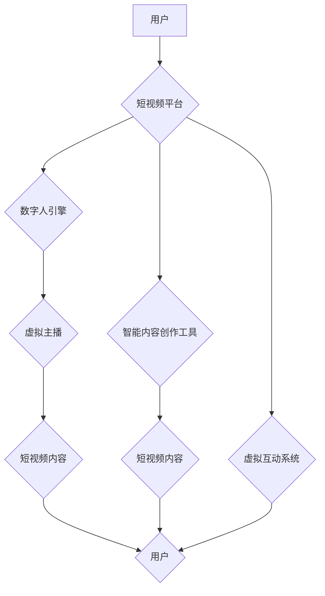

## 数字人技术在短视频中的应用

> 关键词：数字人、短视频、人工智能、计算机视觉、自然语言处理、虚拟主播、内容创作

## 1. 背景介绍

短视频作为一种新兴的媒体形式，其内容丰富、传播速度快、互动性强等特点，迅速成为互联网时代最受欢迎的娱乐方式之一。与此同时，数字人技术也取得了长足发展，能够生成逼真的虚拟形象，并赋予其智能行为和交互能力。数字人技术与短视频的结合，为内容创作、用户体验和商业模式带来了新的可能性。

### 1.1 短视频行业的现状与发展趋势

短视频行业呈现出爆发式增长，用户规模持续扩大，内容形式日益多元化。从最初的搞笑段子、生活记录到如今的知识科普、游戏直播、虚拟演唱会等，短视频平台已成为内容创作者和用户互动交流的重要平台。

未来，短视频行业将更加注重个性化、智能化和沉浸式体验。用户将更加期待个性化的内容推荐、智能化的内容创作工具以及更加逼真的虚拟互动体验。

### 1.2 数字人技术的现状与发展趋势

数字人技术涵盖了计算机视觉、自然语言处理、语音合成、动画渲染等多个领域。近年来，随着深度学习算法的不断发展，数字人技术的生成效果和交互能力得到了显著提升。

未来，数字人技术将更加智能化、个性化和融合化。数字人将能够更加自然地理解和回应用户的指令，并根据用户的喜好定制个性化的内容。同时，数字人技术也将与其他技术融合，例如增强现实（AR）、虚拟现实（VR）等，为用户提供更加沉浸式的体验。

## 2. 核心概念与联系

数字人技术在短视频中的应用主要围绕以下核心概念展开：

* **虚拟主播：** 利用数字人技术创建虚拟形象，并赋予其主播的能力，进行直播、视频录制等内容创作。
* **智能内容创作：** 利用人工智能算法，帮助用户生成短视频内容，例如自动剪辑、添加字幕、生成背景音乐等。
* **虚拟互动：** 利用数字人技术，实现用户与虚拟形象的互动，例如聊天、问答、游戏等。

**数字人技术与短视频应用架构**



## 3. 核心算法原理 & 具体操作步骤

### 3.1 算法原理概述

数字人技术在短视频中的应用主要依赖于以下核心算法：

* **计算机视觉：** 用于识别和理解视频内容，例如人脸检测、动作识别、场景理解等。
* **自然语言处理：** 用于理解和生成自然语言文本，例如文本分析、语音识别、文本生成等。
* **语音合成：** 用于将文本转换为语音，使数字人能够进行语音对话。
* **动画渲染：** 用于生成逼真的数字人形象和动作。

### 3.2 算法步骤详解

**虚拟主播的创建流程：**

1. **建模：** 使用3D建模软件创建数字人的虚拟形象，包括面部、身体、服装等。
2. **动画制作：** 设计数字人的动作和表情，并将其转换为动画数据。
3. **语音合成：** 选择合适的语音合成引擎，并训练数字人的语音模型。
4. **集成：** 将数字人的模型、动画数据和语音合成引擎集成到短视频平台。

**智能内容创作的流程：**

1. **视频采集：** 用户拍摄或上传短视频素材。
2. **内容分析：** 利用计算机视觉和自然语言处理算法分析视频内容，识别人物、场景、事件等。
3. **内容生成：** 根据分析结果，自动生成字幕、背景音乐、特效等内容。
4. **视频编辑：** 将生成的內容与原始视频素材进行编辑，生成最终的短视频作品。

### 3.3 算法优缺点

**优点：**

* **提高效率：** 自动化内容创作流程，节省时间和人力成本。
* **个性化体验：** 根据用户喜好定制个性化的内容。
* **丰富内容形式：** 创造出更加生动、有趣、互动性的短视频内容。

**缺点：**

* **技术难度高：** 需要整合多个领域的算法和技术。
* **数据依赖性强：** 需要大量的训练数据才能保证算法的准确性和可靠性。
* **伦理问题：** 数字人技术的应用可能引发一些伦理问题，例如虚假信息传播、隐私泄露等。

### 3.4 算法应用领域

数字人技术在短视频领域的应用前景广阔，可以应用于以下领域：

* **虚拟主播：** 为直播平台提供虚拟主播，提升用户互动体验。
* **内容创作工具：** 为内容创作者提供智能内容创作工具，提高创作效率。
* **营销推广：** 利用数字人进行产品推广和品牌营销。
* **教育培训：** 利用数字人进行在线教育和培训。
* **娱乐休闲：** 为用户提供更加生动、有趣的虚拟互动体验。

## 4. 数学模型和公式 & 详细讲解 & 举例说明

### 4.1 数学模型构建

数字人技术的核心算法通常基于数学模型，例如：

* **人脸识别：** 使用深度学习模型，例如卷积神经网络（CNN），对人脸图像进行特征提取和分类。
* **动作识别：** 使用循环神经网络（RNN）或其他时间序列模型，对动作序列进行分析和识别。
* **语音合成：** 使用声学模型和语言模型，将文本转换为语音信号。

### 4.2 公式推导过程

例如，人脸识别算法中常用的损失函数是交叉熵损失函数：

$$
L = - \sum_{i=1}^{N} y_i \log(p_i)
$$

其中：

* $L$ 是损失函数的值。
* $N$ 是样本数量。
* $y_i$ 是真实标签，为1表示属于某一类，为0表示不属于该类。
* $p_i$ 是模型预测的概率，表示样本属于某一类的概率。

### 4.3 案例分析与讲解

例如，在虚拟主播的语音合成中，可以使用声学模型和语言模型进行训练。声学模型用于预测语音信号，语言模型用于生成自然流畅的文本。

训练过程中，可以使用大量语音数据和文本数据，通过反向传播算法优化模型参数，使模型能够生成逼真的语音信号。

## 5. 项目实践：代码实例和详细解释说明

### 5.1 开发环境搭建

* 操作系统：Windows/macOS/Linux
* Python版本：3.7+
* 必要的库：TensorFlow/PyTorch、OpenCV、SpeechRecognition等

### 5.2 源代码详细实现

以下是一个简单的虚拟主播代码示例，使用TensorFlow进行人脸检测和语音合成：

```python
import tensorflow as tf
import speech_recognition as sr

# 人脸检测模型
face_detector = tf.keras.models.load_model('face_detector.h5')

# 语音合成引擎
synthesizer = sr.Recognizer()

# 视频流
video_stream = cv2.VideoCapture(0)

while True:
    # 读取视频帧
    ret, frame = video_stream.read()

    # 人脸检测
    detections = face_detector.predict(frame)

    # 语音识别
    with sr.Microphone() as source:
        audio = synthesizer.listen(source)
        text = synthesizer.recognize_google(audio)

    #... 其他处理逻辑...

    # 显示视频帧
    cv2.imshow('Virtual Anchor', frame)

    # 退出条件
    if cv2.waitKey(1) & 0xFF == ord('q'):
        break

video_stream.release()
cv2.destroyAllWindows()
```

### 5.3 代码解读与分析

* 该代码首先加载人脸检测模型和语音合成引擎。
* 然后，使用摄像头读取视频帧，并使用人脸检测模型进行人脸检测。
* 检测到人脸后，使用语音识别引擎识别用户的语音输入。
* 最后，将识别到的语音文本与视频帧进行结合，生成虚拟主播的视频内容。

### 5.4 运行结果展示

运行该代码后，可以实现简单的虚拟主播功能。摄像头会捕捉用户的视频画面，并识别用户的语音输入。识别到的语音文本将被虚拟主播朗读出来，并与视频画面进行同步。

## 6. 实际应用场景

### 6.1 虚拟主播

虚拟主播可以用于直播平台、游戏平台、教育平台等，为用户提供更加生动、互动性的体验。例如，一些游戏平台会使用虚拟主播进行游戏直播，与玩家互动，讲解游戏攻略等。

### 6.2 智能内容创作

智能内容创作工具可以帮助用户快速生成短视频内容，例如自动剪辑、添加字幕、生成背景音乐等。例如，一些短视频平台会提供智能剪辑工具，帮助用户将长视频剪辑成短视频，并自动添加字幕和背景音乐。

### 6.3 虚拟互动

虚拟互动系统可以实现用户与虚拟形象的互动，例如聊天、问答、游戏等。例如，一些教育平台会使用虚拟老师进行在线教学，与学生互动，解答学生疑问等。

### 6.4 未来应用展望

数字人技术在短视频领域的应用前景广阔，未来将更加智能化、个性化和融合化。例如：

* **更加逼真的数字人形象：** 利用更先进的3D建模技术和动画渲染技术，创造出更加逼真的数字人形象。
* **更加智能的交互能力：** 利用更先进的人工智能算法，使数字人能够更加自然地理解和回应用户的指令。
* **更加个性化的内容创作：** 根据用户的喜好和需求，定制更加个性化的短视频内容。
* **更加沉浸式的体验：** 利用AR/VR技术，为用户提供更加沉浸式的虚拟互动体验。

## 7. 工具和资源推荐

### 7.1 学习资源推荐

* **书籍：**
    * 《深度学习》
    * 《计算机视觉：算法与应用》
    * 《自然语言处理》
* **在线课程：**
    * Coursera
    * edX
    * Udacity

### 7.2 开发工具推荐

* **3D建模软件：** Blender, Maya, 3ds Max
* **动画渲染软件：** Unity, Unreal Engine
* **语音合成引擎：** Google Cloud Text-to-Speech, Amazon Polly, Microsoft Azure Text to Speech

### 7.3 相关论文推荐

* **人脸识别：**
    * 《FaceNet: A Unified Embedding for Face Recognition and Clustering》
    * 《DeepFace: Closing the Gap to Human-Level Performance in Face Verification》
* **动作识别：**
    * 《C3D: Deep Convolutional Networks for Sports Video Analysis》
    * 《Two-Stream Convolutional Networks for Action Recognition in Videos》
* **语音合成：**
    * 《Tacotron 2: End-to-End Text-to-Speech Synthesis》
    * 《WaveNet: A Generative Model for Raw Audio》

## 8. 总结：未来发展趋势与挑战

### 8.1 研究成果总结

数字人技术在短视频领域的应用取得了显著进展，例如虚拟主播、智能内容创作、虚拟互动等功能已经能够实现。

### 8.2 未来发展趋势

未来，数字人技术在短视频领域的应用将更加智能化、个性化和融合化。

* **更加逼真的数字人形象：** 利用更先进的3D建模技术和动画渲染技术，创造出更加逼真的数字人形象。
* **更加智能的交互能力：** 利用更先进的人工智能算法，使数字人能够更加自然地理解和回应用户的指令。
* **更加个性化的内容创作：** 根据用户的喜好和需求，定制更加个性化的短视频内容。
* **更加