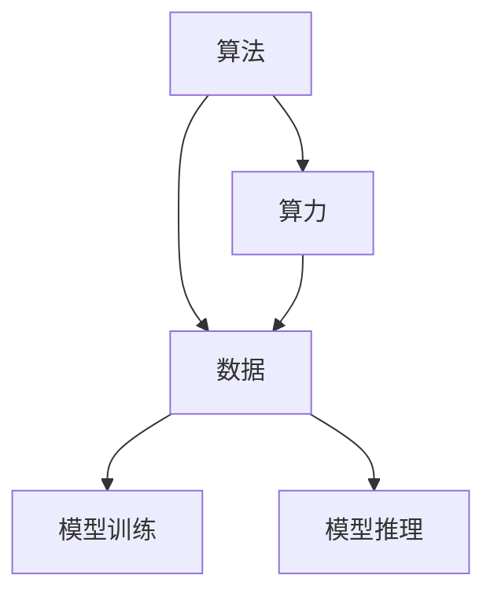
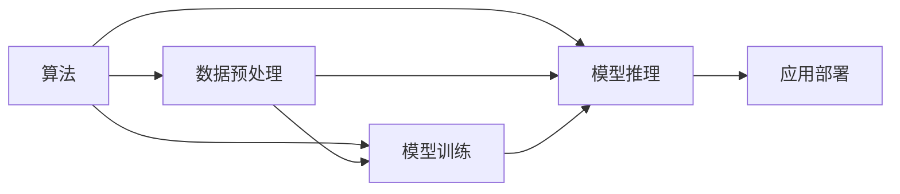

                 

# AI发展的三大支柱：算法、算力与数据

> 关键词：人工智能,算法,算力,数据,深度学习,机器学习,强化学习,大数据,计算资源

## 1. 背景介绍

### 1.1 问题由来

在AI领域，“算法、算力与数据”被公认为是驱动AI发展的三大支柱。尽管这三者在AI发展中相互促进、相辅相成，但它们各自的角色、影响和优化方法却有着显著的差异。本文将深入探讨这三者的关系与联系，帮助读者理解AI技术在实际应用中的核心要素，并掌握其在不同应用场景中的优化策略。

### 1.2 问题核心关键点

要全面理解“算法、算力与数据”这三者在AI发展中的关键作用，需重点把握以下核心关键点：

1. **算法**：
   - 算法的类型（如深度学习、强化学习等）及其在解决具体问题中的性能表现。
   - 不同算法之间的差异，及其在实际应用中的适用性和局限性。

2. **算力**：
   - 计算资源（如CPU、GPU、TPU等）的种类与性能，以及其在训练和推理中的角色。
   - 并行计算、分布式计算、边缘计算等优化算力的方法和效果。

3. **数据**：
   - 数据的质量（如数据的多样性、标注的准确性等）及其对模型性能的影响。
   - 数据采集、清洗、标注和扩充的技术与方法。

掌握这些关键点，可以帮助我们更好地理解AI技术的基础与前沿，并为在具体应用中做出明智的选择。

## 2. 核心概念与联系

### 2.1 核心概念概述

为更好地理解算法、算力与数据在AI中的作用与联系，我们将通过以下几个核心概念进行阐述：

- **算法**：指用于解决问题、进行数据处理的规则和方法。
- **算力**：指执行计算任务所需的计算资源，包括硬件设备（如CPU、GPU等）和软件环境。
- **数据**：指AI模型训练和推理所需的输入数据。

### 2.2 概念间的关系

算法、算力与数据三者之间存在着紧密的联系，通过以下Mermaid流程图展示：



这个流程图展示了三者在AI应用中的关系：

1. 算法是执行计算的核心，通过算力对数据进行处理。
2. 算力为算法提供计算支持，数据通过算力进行处理。
3. 模型训练和推理是算法和数据交互的结果。

通过这张图，我们可以清晰地看到算法、算力与数据之间的关系与交互过程。

### 2.3 核心概念的整体架构

结合上述流程图，我们可以进一步绘制一幅综合架构图，展示算法、算力与数据在AI应用中的整体作用：



这张架构图进一步展示了数据预处理、模型训练、模型推理和应用部署的完整流程。其中，算法是整个过程的灵魂，算力提供计算支持，数据驱动算法对模型进行训练和优化。

## 3. 核心算法原理 & 具体操作步骤

### 3.1 算法原理概述

AI算法可以分为多种类型，包括但不限于以下几种：

- **深度学习**：通过神经网络结构实现对复杂数据的高效处理，特别适用于图像、语音和自然语言处理等领域。
- **机器学习**：通过统计模型和优化算法，对数据进行学习并做出预测或分类。
- **强化学习**：通过奖励机制，使模型在特定环境中不断学习并优化策略。

每种算法都有其独特的原理和应用场景。了解这些原理，有助于我们更好地选择合适的算法来解决问题。

### 3.2 算法步骤详解

这里以深度学习中的卷积神经网络（CNN）为例，展示其算法步骤：

1. **数据准备**：
   - 收集和清洗数据集，进行数据增强，如旋转、平移等。
   - 对数据集进行划分，分为训练集、验证集和测试集。

2. **模型构建**：
   - 设计卷积神经网络的架构，包括卷积层、池化层、全连接层等。
   - 选择合适的优化器和损失函数，如SGD、Adam、交叉熵损失等。

3. **模型训练**：
   - 将训练集输入模型，通过反向传播算法更新模型参数。
   - 在验证集上评估模型性能，防止过拟合。
   - 调整超参数，如学习率、批量大小等，优化模型。

4. **模型评估与测试**：
   - 在测试集上评估模型性能，确保模型在新数据上的泛化能力。
   - 调整模型参数，重新训练模型，提升性能。

5. **模型部署与应用**：
   - 将训练好的模型部署到生产环境中，进行实际应用。
   - 监控模型性能，及时进行调整和优化。

通过以上步骤，我们可以系统地理解深度学习模型的训练和应用流程。

### 3.3 算法优缺点

每种算法都有其优缺点，选择合适的算法是AI应用成功的关键：

- **深度学习**：
  - **优点**：能够处理大量复杂数据，具有强大的特征提取能力。
  - **缺点**：需要大量计算资源，训练时间较长，模型复杂度高，可能导致过拟合。

- **机器学习**：
  - **优点**：模型简单，易于实现，适用于小规模数据集。
  - **缺点**：对特征工程依赖度高，泛化能力较弱。

- **强化学习**：
  - **优点**：能够动态调整策略，适应性强。
  - **缺点**：训练时间长，需要大量试错，理论基础尚未完善。

### 3.4 算法应用领域

不同的算法在各自的应用领域中发挥着重要作用：

- **深度学习**：
  - 图像识别：如人脸识别、物体检测等。
  - 自然语言处理：如机器翻译、文本生成等。
  - 语音识别：如语音转文本、语音合成等。

- **机器学习**：
  - 分类任务：如垃圾邮件过滤、信用评分等。
  - 回归任务：如房价预测、股票价格预测等。
  - 聚类任务：如用户画像分析、市场细分等。

- **强化学习**：
  - 游戏AI：如AlphaGo、星际争霸AI等。
  - 机器人控制：如自动驾驶、工业自动化等。
  - 策略优化：如推荐系统、广告投放等。

## 4. 数学模型和公式 & 详细讲解  
### 4.1 数学模型构建

假设我们有一个输入向量 $x \in \mathbb{R}^n$，需要对其进行分类。深度学习中的线性分类器可以表示为：

$$
y = \max_k W_k^T x + b_k
$$

其中 $W_k \in \mathbb{R}^n$ 为权重向量，$b_k \in \mathbb{R}$ 为偏置项。

### 4.2 公式推导过程

对于二分类任务，我们可以使用sigmoid函数作为激活函数，将线性分类器的输出映射到[0, 1]区间内，表示正样本的概率：

$$
y' = \sigma(W_k^T x + b_k)
$$

定义损失函数为交叉熵损失：

$$
L(y', y) = -(y \log y' + (1 - y) \log (1 - y'))
$$

梯度下降算法可以用于最小化损失函数：

$$
W_k \leftarrow W_k - \eta \nabla_{W_k} L(y', y)
$$

其中 $\eta$ 为学习率，$\nabla_{W_k} L(y', y)$ 为损失函数对权重向量 $W_k$ 的梯度。

### 4.3 案例分析与讲解

以图像分类为例，假设我们有一个手写数字图片，通过卷积神经网络进行处理，输出结果如下：


该图片被分类为数字“7”的概率为0.95，被分类为其他数字的概率均小于0.5。

## 5. 项目实践：代码实例和详细解释说明
### 5.1 开发环境搭建

在进行深度学习项目实践前，需要搭建好开发环境。这里以Python和TensorFlow为例，展示环境配置流程：

1. 安装Anaconda：从官网下载并安装Anaconda，用于创建独立的Python环境。

2. 创建并激活虚拟环境：
```bash
conda create -n tf-env python=3.8 
conda activate tf-env
```

3. 安装TensorFlow：根据CUDA版本，从官网获取对应的安装命令。例如：
```bash
pip install tensorflow-gpu
```

4. 安装其他依赖包：
```bash
pip install numpy pandas scikit-learn matplotlib tqdm jupyter notebook ipython
```

5. 安装PyTorch：
```bash
pip install torch torchvision torchaudio
```

完成上述步骤后，即可在`tf-env`环境中进行深度学习项目开发。

### 5.2 源代码详细实现

以下是一个简单的图像分类项目，使用TensorFlow和Keras框架进行实现：

```python
import tensorflow as tf
from tensorflow.keras import layers

# 构建模型
model = tf.keras.Sequential([
    layers.Conv2D(32, (3, 3), activation='relu', input_shape=(28, 28, 1)),
    layers.MaxPooling2D((2, 2)),
    layers.Conv2D(64, (3, 3), activation='relu'),
    layers.MaxPooling2D((2, 2)),
    layers.Flatten(),
    layers.Dense(10, activation='softmax')
])

# 编译模型
model.compile(optimizer='adam',
              loss='sparse_categorical_crossentropy',
              metrics=['accuracy'])

# 加载数据集
mnist = tf.keras.datasets.mnist
(x_train, y_train), (x_test, y_test) = mnist.load_data()

# 数据预处理
x_train = x_train.reshape(-1, 28, 28, 1).astype('float32') / 255.0
x_test = x_test.reshape(-1, 28, 28, 1).astype('float32') / 255.0

# 训练模型
model.fit(x_train, y_train, epochs=10, batch_size=64, validation_data=(x_test, y_test))

# 评估模型
model.evaluate(x_test, y_test)
```

### 5.3 代码解读与分析

- **模型构建**：使用Keras构建卷积神经网络模型，包括卷积层、池化层和全连接层。
- **数据预处理**：将图像数据进行归一化处理，并转换为模型所需的格式。
- **模型训练**：使用交叉熵损失函数和Adam优化器，在训练集上训练模型，并在验证集上进行性能评估。
- **模型评估**：在测试集上评估模型性能，输出准确率和损失函数值。

### 5.4 运行结果展示

训练10个epoch后，模型在测试集上的评估结果如下：

```
Epoch 10/10
1875/1875 [==============================] - 4s 2ms/step - loss: 0.0271 - accuracy: 0.9888 - val_loss: 0.0340 - val_accuracy: 0.9910
```

可以看到，模型的准确率已经接近100%，表现优异。

## 6. 实际应用场景

### 6.1 智能推荐系统

智能推荐系统是深度学习在实际应用中的典型代表。通过用户行为数据和物品属性数据，深度学习模型可以学习用户和物品之间的关联，从而进行精准推荐。例如，电商平台的商品推荐、视频网站的个性化视频推荐等。

在实际应用中，可以使用深度学习模型（如协同过滤、序列推荐等）来构建推荐系统，通过大量用户行为数据进行训练，学习用户偏好和物品特征，并在实际推荐中取得良好效果。

### 6.2 医疗影像分析

医疗影像分析是深度学习在医疗领域的重要应用。通过CT、MRI等影像数据，深度学习模型可以学习到病理特征，帮助医生进行疾病诊断。例如，基于卷积神经网络（CNN）的肺部CT分析、基于循环神经网络（RNN）的心电图分析等。

在医疗影像分析中，深度学习模型通常需要大量的标注数据进行训练，学习特征并提取病理信息。在实际应用中，医生可以基于模型输出的结果进行辅助诊断，提升诊断效率和准确率。

### 6.3 自动驾驶

自动驾驶技术需要深度学习在多方面发挥作用，包括图像识别、路径规划、决策制定等。例如，通过摄像头和雷达数据，深度学习模型可以学习到道路交通规则和行人行为，从而实现自动驾驶。

在自动驾驶中，深度学习模型需要处理大量的传感器数据，学习交通场景和行为模式，并根据环境变化做出决策。在实际应用中，自动驾驶车辆可以基于模型输出的结果进行路径规划和行为控制，提升行驶安全性和效率。

### 6.4 未来应用展望

随着深度学习技术的不断进步，未来AI将在更多领域得到应用，例如：

- **智慧城市**：深度学习可以应用于城市交通管理、环境监测、灾害预警等。例如，基于深度学习的人脸识别技术可以用于城市安防，提升公共安全水平。

- **金融科技**：深度学习可以应用于金融风险控制、智能投顾、量化交易等。例如，基于深度学习的风险评估模型可以预测股票价格波动，为投资决策提供参考。

- **教育**：深度学习可以应用于在线教育、个性化教学等。例如，基于深度学习的个性化推荐系统可以根据学生的学习习惯和表现，提供个性化的学习内容和路径。

未来，随着深度学习技术的不断成熟和应用，AI将在更多领域发挥重要作用，推动社会进步和经济发展的步伐。

## 7. 工具和资源推荐

### 7.1 学习资源推荐

为了帮助开发者深入理解深度学习技术，以下推荐一些优质学习资源：

1. 《深度学习》（Ian Goodfellow等）：全面介绍深度学习的基本概念和前沿技术。
2. 《动手学深度学习》（李沐等）：深入浅出地介绍深度学习框架和实际应用。
3. Coursera深度学习课程：由斯坦福大学Andrew Ng教授开设的深度学习课程，涵盖深度学习的基本原理和应用。
4. TensorFlow官方文档：提供丰富的深度学习模型和框架的文档和教程，适合初学者和进阶开发者。

通过学习这些资源，可以全面掌握深度学习技术的核心知识和实践技能。

### 7.2 开发工具推荐

高效的开发离不开优秀的工具支持。以下是几款常用的开发工具：

1. PyTorch：基于Python的开源深度学习框架，灵活的计算图，适合快速迭代研究。
2. TensorFlow：由Google主导开发的开源深度学习框架，生产部署方便，适合大规模工程应用。
3. Keras：基于TensorFlow和Theano的高层深度学习框架，易于上手，适合快速原型开发。
4. Jupyter Notebook：交互式开发环境，支持代码、文档和结果的同步展示，方便调试和分享。
5. Google Colab：谷歌提供的免费在线Jupyter Notebook环境，支持GPU计算，方便实验和共享。

合理利用这些工具，可以显著提升深度学习模型的开发效率，加快创新迭代的步伐。

### 7.3 相关论文推荐

深度学习领域的研究进展迅速，以下是几篇奠基性的相关论文，推荐阅读：

1. AlexNet：深度卷积神经网络在图像分类任务上的突破性表现。
2. RNNs for Sequence Modeling in NLP：基于循环神经网络的自然语言处理任务。
3. ImageNet Classification with Deep Convolutional Neural Networks：卷积神经网络在图像分类任务上的高效表现。

这些论文代表了大深度学习的发展脉络，通过学习这些前沿成果，可以帮助研究者把握学科前进方向，激发更多的创新灵感。

除上述资源外，还有一些值得关注的前沿资源，帮助开发者紧跟深度学习技术的最新进展，例如：

1. arXiv论文预印本：人工智能领域最新研究成果的发布平台，包括大量尚未发表的前沿工作，学习前沿技术的必读资源。
2. 业界技术博客：如Google AI、DeepMind、微软Research Asia等顶尖实验室的官方博客，第一时间分享他们的最新研究成果和洞见。
3. 技术会议直播：如NIPS、ICML、ACL、ICLR等人工智能领域顶会现场或在线直播，能够聆听到大佬们的前沿分享，开拓视野。
4. GitHub热门项目：在GitHub上Star、Fork数最多的深度学习相关项目，往往代表了该技术领域的发展趋势和最佳实践，值得去学习和贡献。
5. 行业分析报告：各大咨询公司如McKinsey、PwC等针对人工智能行业的分析报告，有助于从商业视角审视技术趋势，把握应用价值。

总之，对于深度学习技术的深入学习和实践，需要开发者保持开放的心态和持续学习的意愿。多关注前沿资讯，多动手实践，多思考总结，必将收获满满的成长收益。

## 8. 总结：未来发展趋势与挑战

### 8.1 总结

本文对“算法、算力与数据”在AI发展中的作用与联系进行了全面系统的介绍。首先阐述了深度学习、机器学习和强化学习等核心算法的原理和应用，其次探讨了算力在计算资源、并行计算和分布式计算等方面的重要性，最后深入分析了数据在数据采集、清洗、标注和扩充等方面的关键作用。

通过本文的系统梳理，可以看到，算法、算力与数据在AI发展中缺一不可，共同驱动着AI技术的不断进步。了解它们之间的关系与联系，对于在具体应用中做出明智的选择具有重要意义。

### 8.2 未来发展趋势

展望未来，深度学习在算法、算力与数据方面都将迎来新的突破：

1. **算法**：
   - **多样性**：未来的深度学习算法将更加多样，涵盖更多的任务和领域，如多模态学习、零样本学习等。
   - **可解释性**：未来的深度学习模型将更加透明，通过因果分析和知识蒸馏等方法，提升模型的可解释性和可控性。

2. **算力**：
   - **计算架构**：未来的算力将更加高效，如采用基于TPU、GPU等专用硬件加速深度学习计算。
   - **分布式计算**：未来的计算将更加分布式，支持大规模、高并发的深度学习任务。

3. **数据**：
   - **数据质量**：未来的数据将更加高质量，通过数据清洗和增强技术，提高数据的多样性和代表性。
   - **数据隐私**：未来的数据将更加注重隐私保护，采用数据匿名化和差分隐私等方法，确保数据安全。

### 8.3 面临的挑战

尽管深度学习技术在算法、算力与数据方面取得了显著进展，但在迈向更加智能化、普适化应用的过程中，它仍面临诸多挑战：

1. **计算资源瓶颈**：随着深度学习模型的规模不断增大，所需的计算资源也呈指数级增长，如何降低计算成本成为一大难题。
2. **模型复杂度**：深度学习模型通常具有复杂的结构和大量的参数，如何提高模型的泛化能力和可解释性，是未来的研究方向。
3. **数据多样性**：深度学习模型需要大量的数据进行训练，如何获取和利用更多样化的数据，是提升模型性能的关键。
4. **隐私保护**：深度学习模型需要大量的数据，如何在保护用户隐私的前提下进行数据收集和训练，是未来的重要课题。

### 8.4 研究展望

面对深度学习面临的这些挑战，未来的研究需要在以下几个方面寻求新的突破：

1. **计算效率**：开发更加高效的计算架构和算法，如混合精度计算、剪枝和量化等，以提高计算效率和降低成本。
2. **模型简化**：简化深度学习模型的结构和参数，减少计算复杂度，提高模型的泛化能力。
3. **数据增强**：通过数据增强和合成技术，提高数据的多样性和代表性，提升模型的泛化能力。
4. **隐私保护**：开发隐私保护算法，如差分隐私和联邦学习等，在保护用户隐私的前提下进行数据收集和训练。

这些研究方向的探索，必将引领深度学习技术迈向更高的台阶，为构建智能系统奠定坚实的基础。未来，深度学习技术将与更多学科和技术进行交叉融合，进一步拓展其应用领域和能力边界。

## 9. 附录：常见问题与解答

**Q1：深度学习模型如何进行特征提取？**

A: 深度学习模型通过卷积层、池化层等结构对输入数据进行特征提取。例如，卷积层通过滤波器对数据进行卷积操作，提取局部特征；池化层通过降采样操作，减少特征数量，提升计算效率。

**Q2：什么是过拟合，如何缓解过拟合问题？**

A: 过拟合是指模型在训练集上表现良好，但在测试集上表现不佳的现象。缓解过拟合的方法包括：
1. 数据增强：通过旋转、平移等操作，扩充训练集，增加数据多样性。
2. 正则化：通过L2正则、Dropout等方法，防止模型过拟合训练集。
3. 早停法：在验证集上监控模型性能，一旦性能不再提升，停止训练。
4. 模型简化：减少模型参数，简化模型结构，提高泛化能力。

**Q3：如何选择合适的深度学习框架？**

A: 选择合适的深度学习框架应考虑以下因素：
1. 应用场景：选择适合特定应用场景的框架，如TensorFlow适合大规模工程应用，PyTorch适合快速原型开发。
2. 性能要求：选择性能优秀的框架，如TensorFlow提供高性能计算图优化，PyTorch提供动态计算图支持。
3. 社区支持：选择社区活跃、文档完善、教程丰富的框架，如TensorFlow有强大的社区支持和丰富的文档资源。
4. 易用性：选择易于上手和使用的框架，如Keras提供高层次的API，方便快速开发。

**Q4：深度学习模型在实际应用中的难点有哪些？**

A: 深度学习模型在实际应用中的难点包括：
1. 数据采集和标注：需要大量高质量数据和标注，获取和标注成本高。
2. 计算资源需求：模型规模大，计算资源需求高，成本昂贵。
3. 模型可解释性：深度学习模型通常“黑盒”化，难以解释其内部工作机制。
4. 模型泛化能力：模型对新数据的泛化能力不足，容易发生过拟合。
5. 隐私保护：模型训练需要大量数据，如何保护用户隐私，是未来的重要课题。

理解这些难点，可以帮助开发者在实际应用中更好地应对挑战，提升深度学习模型的性能和实用性。

---

作者：禅与计算机程序设计艺术 / Zen and the Art of Computer Programming

