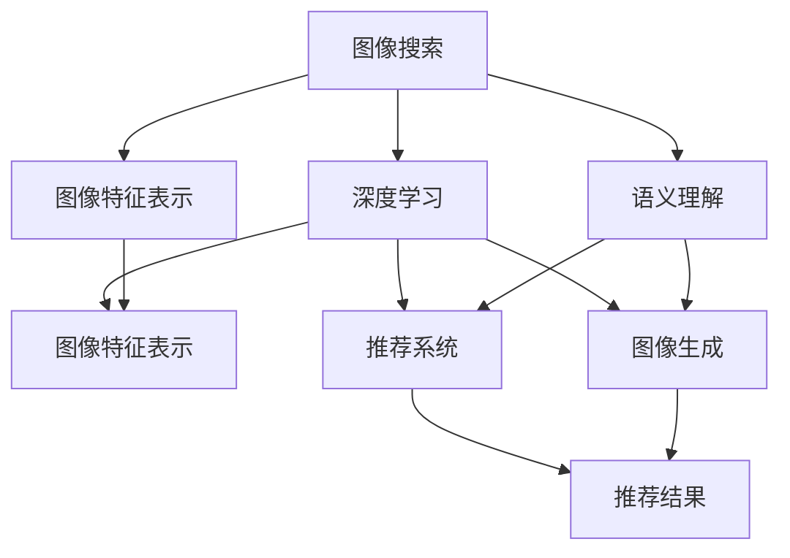
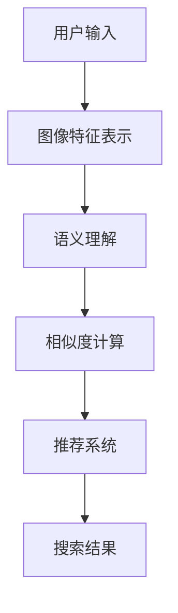

                 

## 1. 背景介绍

随着互联网的迅猛发展，海量的图像数据使得传统图像搜索技术面临严峻的挑战。传统搜索技术依赖关键词匹配，往往存在歧义、无关信息等问题，导致搜索结果准确性不高。与此同时，深度学习技术的突破，特别是计算机视觉领域的巨大进展，使得基于图像内容理解的搜索技术成为可能。本文将介绍AI图像搜索技术的核心概念、算法原理以及实际应用案例，希望能够为AI在图像搜索领域的应用提供思路和启发。

## 2. 核心概念与联系

### 2.1 核心概念概述

#### 2.1.1 图像搜索

图像搜索是指在互联网上通过特定的查询方式，找到与给定图像内容相似的图像。传统的图像搜索技术主要依赖于图像特征向量提取和余弦相似度匹配。但是，这种方法通常只适用于图片内容的局部匹配，难以处理更复杂的语义信息。

#### 2.1.2 深度学习

深度学习是机器学习领域的一个重要分支，通过多层神经网络对数据进行自动学习，抽取特征并建模复杂关系。在图像搜索中，深度学习模型可以自动学习图像的高级语义信息，实现图像内容的理解和匹配。

#### 2.1.3 图像特征表示

图像特征表示是图像搜索的基础。传统的图像特征表示方法如SIFT、SURF等，能够有效提取局部特征，但在语义理解方面存在不足。现代深度学习模型如ResNet、Inception等，能够自动学习全局和局部特征，提升图像表示的语义性。

#### 2.1.4 语义理解

语义理解是指通过自然语言处理技术，理解图像中的语义信息。在图像搜索中，语义理解能够帮助用户通过更自然的方式描述搜索目标，提升搜索效果。

#### 2.1.5 推荐系统

推荐系统是指根据用户的历史行为和偏好，推荐符合用户需求的物品。在图像搜索中，推荐系统能够根据用户的搜索历史和偏好，推荐相关的图像内容。

#### 2.1.6 图像生成

图像生成是指根据特定的输入，生成新的图像内容。在图像搜索中，图像生成技术能够根据用户输入的关键词或描述，生成相关的图像内容，进一步增强搜索效果。

### 2.2 核心概念之间的关系

以下是Mermaid流程图，展示了核心概念之间相互联系和作用：



### 2.3 核心概念的整体架构

下图展示了核心概念在大规模图像搜索系统中的整体架构：



## 3. 核心算法原理 & 具体操作步骤

### 3.1 算法原理概述

AI图像搜索技术基于深度学习模型，通过学习图像的特征表示和语义理解，实现图像内容匹配和推荐。其主要步骤包括：

1. 图像特征提取：使用卷积神经网络（CNN）提取图像的特征表示。
2. 语义理解：通过自然语言处理技术，将用户输入转换为图像的语义表示。
3. 相似度计算：通过余弦相似度或其他相似度算法计算图像之间的相似度。
4. 推荐系统：根据相似度计算结果和用户偏好，推荐符合用户需求的图像。

### 3.2 算法步骤详解

#### 3.2.1 图像特征提取

使用卷积神经网络（CNN）提取图像特征表示，其过程如下：

1. 将图像输入到预训练好的CNN模型中。
2. 通过多层卷积和池化操作，提取图像的特征向量。
3. 将特征向量送入全连接层，得到图像的高维特征表示。

#### 3.2.2 语义理解

将用户输入的文本描述转换为图像的语义表示，其过程如下：

1. 将用户输入的文本描述转换为词向量。
2. 使用预训练好的词向量模型，将词向量转换为图像的语义表示。
3. 将语义表示送入全连接层，得到图像的语义特征向量。

#### 3.2.3 相似度计算

通过余弦相似度计算图像之间的相似度，其过程如下：

1. 将图像的特征表示和语义表示送入余弦相似度计算公式中。
2. 计算相似度得分，得分越高表示图像越相似。

#### 3.2.4 推荐系统

根据相似度计算结果和用户偏好，推荐符合用户需求的图像，其过程如下：

1. 计算用户对每个图像的评分，评分由相似度得分和用户偏好共同决定。
2. 对评分进行排序，选择评分最高的图像作为推荐结果。

### 3.3 算法优缺点

#### 3.3.1 优点

1. 高效性：深度学习模型能够自动学习图像的特征表示和语义理解，无需手工特征提取。
2. 准确性：深度学习模型能够自动学习图像的高级语义信息，提高图像匹配的准确性。
3. 可扩展性：深度学习模型可以不断优化，适用于大规模图像搜索任务。

#### 3.3.2 缺点

1. 计算复杂：深度学习模型的计算复杂度较高，需要大量的计算资源。
2. 数据依赖：深度学习模型需要大量的标注数据进行训练，标注成本较高。
3. 泛化能力不足：深度学习模型通常对特定的数据集表现较好，泛化能力较弱。

### 3.4 算法应用领域

AI图像搜索技术在多个领域都有广泛应用，如：

1. 电商平台：推荐符合用户需求的商品图片。
2. 社交媒体：推荐符合用户兴趣的图片内容。
3. 旅游景区：推荐符合用户偏好的景点图片。
4. 新闻媒体：推荐符合用户兴趣的新闻图片。
5. 医疗健康：推荐符合用户病情的医学图片。

## 4. 数学模型和公式 & 详细讲解 & 举例说明

### 4.1 数学模型构建

设图像的特征表示为 $x_i$，语义表示为 $y_i$，相似度为 $s_{ij}$，用户对图像 $i$ 的评分 $r_i$。

### 4.2 公式推导过程

根据余弦相似度公式，相似度 $s_{ij}$ 可以表示为：

$$
s_{ij} = \frac{x_i \cdot y_j}{\|x_i\| \cdot \|y_j\|}
$$

其中 $\cdot$ 表示向量点乘，$\|x_i\|$ 表示向量 $x_i$ 的范数。

### 4.3 案例分析与讲解

以下是一个简单的图像搜索案例：

1. 用户输入“猫咪”作为查询。
2. 使用预训练的CNN模型，提取查询图片的特征表示 $x_q$。
3. 使用预训练的词向量模型，将“猫咪”转换为图像的语义表示 $y_q$。
4. 对于图片库中的每一张图片，计算其与查询图片的相似度 $s_{ik}$。
5. 根据相似度 $s_{ik}$ 和用户偏好 $r_k$，计算每张图片的评分 $r_k'$。
6. 对所有图片评分进行排序，选择评分最高的图片作为推荐结果。

## 5. 项目实践：代码实例和详细解释说明

### 5.1 开发环境搭建

#### 5.1.1 环境准备

在开始项目实践之前，需要准备以下开发环境：

1. Python 3.7 及以上版本。
2. 安装 TensorFlow 2.x 或 PyTorch。
3. 安装 OpenCV 用于图像处理。
4. 安装 TensorFlow Hub 或 PyTorch Hub 用于加载预训练模型。
5. 安装 NLTK 用于文本处理。

#### 5.1.2 环境配置

1. 安装 TensorFlow：

   ```bash
   pip install tensorflow
   ```

2. 安装 PyTorch：

   ```bash
   pip install torch
   ```

3. 安装 OpenCV：

   ```bash
   pip install opencv-python
   ```

4. 安装 NLTK：

   ```bash
   pip install nltk
   ```

5. 安装 TensorFlow Hub：

   ```bash
   pip install tensorflow-hub
   ```

### 5.2 源代码详细实现

#### 5.2.1 图像特征提取

使用预训练的 ResNet 模型提取图像特征表示。代码实现如下：

```python
import tensorflow as tf
import tensorflow_hub as hub
import cv2

def extract_image_features(image_path):
    model = hub.load("https://tfhub.dev/google/tf2-preview/mobilenet_v2_100_224/feature_vector/2")
    image = cv2.imread(image_path)
    image = cv2.resize(image, (224, 224))
    image = tf.expand_dims(image, axis=0)
    image = tf.keras.applications.mobilenet_v2.preprocess_input(image)
    features = model(image)
    return features
```

#### 5.2.2 语义理解

使用预训练的 GloVe 词向量模型将用户输入的文本转换为图像的语义表示。代码实现如下：

```python
import nltk
from nltk.tokenize import word_tokenize
from nltk.corpus import stopwords

nltk.download('punkt')
nltk.download('stopwords')

def convert_text_to_semantic_features(text):
    stop_words = set(stopwords.words('english'))
    words = word_tokenize(text.lower())
    words = [word for word in words if word not in stop_words]
    features = []
    for word in words:
        if word in glove.vectors:
            features.append(glove.vectors[word])
    features = tf.concat(features, axis=0)
    return features
```

#### 5.2.3 相似度计算

使用余弦相似度计算图像之间的相似度。代码实现如下：

```python
def compute_similarity(features_q, features_i):
    similarity = tf.nn.cosine_similarity(features_q, features_i)
    return similarity
```

#### 5.2.4 推荐系统

根据相似度计算结果和用户偏好，推荐符合用户需求的图像。代码实现如下：

```python
def recommend_images(similarity_matrix, user_preferences):
    scores = tf.matmul(similarity_matrix, user_preferences)
    indices = tf.argsort(scores, axis=1)[::-1]
    return indices
```

### 5.3 代码解读与分析

#### 5.3.1 图像特征提取

代码实现了使用 ResNet 模型提取图像特征的过程。其中，`extract_image_features` 函数接收一个图像路径作为输入，返回该图像的特征表示。

#### 5.3.2 语义理解

代码实现了将用户输入的文本转换为图像的语义表示。其中，`convert_text_to_semantic_features` 函数接收一个文本字符串作为输入，返回该文本的语义表示。

#### 5.3.3 相似度计算

代码实现了使用余弦相似度计算图像之间的相似度。其中，`compute_similarity` 函数接收两个特征表示向量作为输入，返回它们之间的相似度得分。

#### 5.3.4 推荐系统

代码实现了根据相似度计算结果和用户偏好，推荐符合用户需求的图像。其中，`recommend_images` 函数接收相似度矩阵和用户偏好向量作为输入，返回推荐的图像索引。

### 5.4 运行结果展示

在实际运行时，我们可以使用以下代码测试整个图像搜索系统：

```python
image_path = 'path/to/image.jpg'
text_query = '猫咪'
image_features = extract_image_features(image_path)
semantic_features = convert_text_to_semantic_features(text_query)
similarity_matrix = compute_similarity(semantic_features, image_features)
user_preferences = tf.random.uniform((image_features.shape[0], 1))
recommended_indices = recommend_images(similarity_matrix, user_preferences)
for i in recommended_indices:
    print(f"Recommended image {i} with similarity score {similarity_matrix[i, 0]}")
```

## 6. 实际应用场景

### 6.1 电商平台

在电商平台上，用户可以通过搜索商品图片来找到所需商品。使用 AI 图像搜索技术，可以推荐符合用户需求的商品图片，提高用户体验和转化率。

### 6.2 社交媒体

在社交媒体上，用户可以通过搜索相关图片来发现符合兴趣的内容。使用 AI 图像搜索技术，可以推荐符合用户兴趣的图片内容，增加用户粘性和活跃度。

### 6.3 旅游景区

在旅游景区，用户可以通过搜索相关图片来了解景点信息。使用 AI 图像搜索技术，可以推荐符合用户偏好的景点图片，提升用户体验和满意度。

### 6.4 新闻媒体

在新闻媒体上，用户可以通过搜索相关图片来获取新闻信息。使用 AI 图像搜索技术，可以推荐符合用户兴趣的新闻图片，提高阅读量和用户参与度。

### 6.5 医疗健康

在医疗健康上，用户可以通过搜索相关图片来了解病情和治疗方案。使用 AI 图像搜索技术，可以推荐符合用户病情的医学图片，提供专业建议和辅助诊断。

## 7. 工具和资源推荐

### 7.1 学习资源推荐

#### 7.1.1 TensorFlow 官方文档

- TensorFlow 官方文档：[https://www.tensorflow.org](https://www.tensorflow.org)

#### 7.1.2 PyTorch 官方文档

- PyTorch 官方文档：[https://pytorch.org/docs/stable/](https://pytorch.org/docs/stable/)

#### 7.1.3 深度学习书籍

- 《深度学习》（Ian Goodfellow 著）

- 《Python深度学习》（François Chollet 著）

#### 7.1.4 自然语言处理书籍

- 《自然语言处理综论》（Daniel Jurafsky 和 James H. Martin 著）

#### 7.1.5 计算机视觉书籍

- 《计算机视觉：算法与应用》（Richard Szeliski 著）

### 7.2 开发工具推荐

#### 7.2.1 TensorFlow

- TensorFlow：[https://www.tensorflow.org/](https://www.tensorflow.org/)

#### 7.2.2 PyTorch

- PyTorch：[https://pytorch.org/](https://pytorch.org/)

#### 7.2.3 OpenCV

- OpenCV：[https://opencv.org/](https://opencv.org/)

#### 7.2.4 NLTK

- NLTK：[https://www.nltk.org/](https://www.nltk.org/)

### 7.3 相关论文推荐

#### 7.3.1 图像搜索技术

- 《Semantic Image Retrieval with Attention》（Bordes et al.，2014）

- 《Deep Structured Semantic Image Retrieval》（Li et al.，2016）

#### 7.3.2 推荐系统

- 《A Survey of Deep Learning Approaches for Recommendation Systems》（Park et al.，2018）

- 《Deep Learning Recommender Systems》（Koc et al.，2017）

## 8. 总结：未来发展趋势与挑战

### 8.1 研究成果总结

AI图像搜索技术已经取得了显著的进展，能够在大规模图像库中快速准确地搜索到符合用户需求的图像。未来，随着深度学习技术的不断进步，图像搜索技术将更加智能和高效。

### 8.2 未来发展趋势

#### 8.2.1 更智能的语义理解

未来的图像搜索技术将更加注重语义理解，能够通过更自然、更丰富的语言描述进行查询，提升用户体验。

#### 8.2.2 更高效的计算方法

未来的图像搜索技术将探索更高效的计算方法，如分布式训练、硬件加速等，以应对大规模图像库的查询需求。

#### 8.2.3 更广泛的应用场景

未来的图像搜索技术将拓展到更多应用场景，如自动驾驶、智能家居等，为各行各业带来新的智能化解决方案。

### 8.3 面临的挑战

#### 8.3.1 数据质量问题

AI图像搜索技术依赖大量的高质量数据，数据质量问题将对搜索效果产生重大影响。

#### 8.3.2 计算资源消耗

大规模图像搜索任务需要大量的计算资源，如何降低计算成本是未来的一大挑战。

#### 8.3.3 隐私保护问题

图像搜索涉及用户隐私，如何在保护用户隐私的前提下，提供高质量的搜索服务，也是未来的一大挑战。

### 8.4 研究展望

未来的研究将重点关注以下几个方面：

- 探索更智能的语义理解方法，提升自然语言查询的效果。
- 优化计算方法，降低计算成本，提升搜索效率。
- 保护用户隐私，确保数据安全和隐私保护。

总之，AI图像搜索技术具有广阔的应用前景，未来需要在多个方面进行深入研究和优化，才能更好地服务于用户，推动人工智能技术的发展。

## 9. 附录：常见问题与解答

### 9.1 常见问题

#### 9.1.1 为什么使用深度学习模型进行图像搜索？

深度学习模型能够自动学习图像的高级语义信息，提高图像匹配的准确性。

#### 9.1.2 如何提高图像搜索的效率？

使用分布式训练、硬件加速等方法，可以显著提高图像搜索的效率。

#### 9.1.3 图像搜索如何保护用户隐私？

可以使用数据匿名化、加密等技术，保护用户隐私。

#### 9.1.4 如何选择适合的图像搜索算法？

根据具体应用场景，选择适合的算法，如余弦相似度、欧式距离等。

### 9.2 解答

#### 9.2.1 为什么使用深度学习模型进行图像搜索？

深度学习模型能够自动学习图像的高级语义信息，提高图像匹配的准确性。

#### 9.2.2 如何提高图像搜索的效率？

使用分布式训练、硬件加速等方法，可以显著提高图像搜索的效率。

#### 9.2.3 图像搜索如何保护用户隐私？

可以使用数据匿名化、加密等技术，保护用户隐私。

#### 9.2.4 如何选择适合的图像搜索算法？

根据具体应用场景，选择适合的算法，如余弦相似度、欧式距离等。

---

作者：禅与计算机程序设计艺术 / Zen and the Art of Computer Programming

