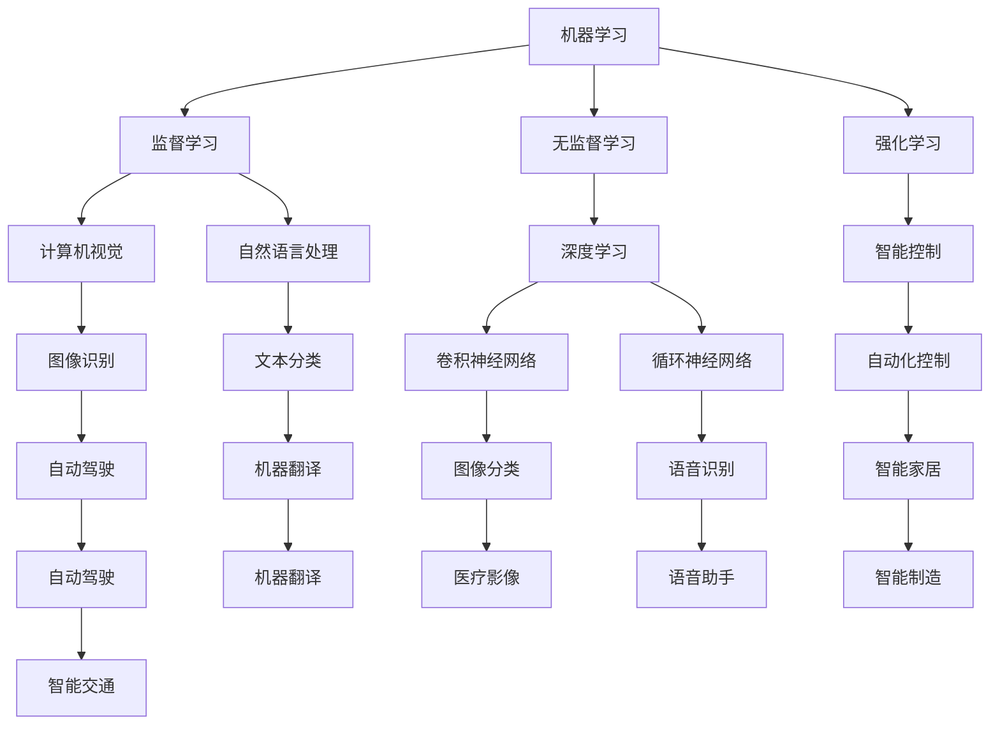
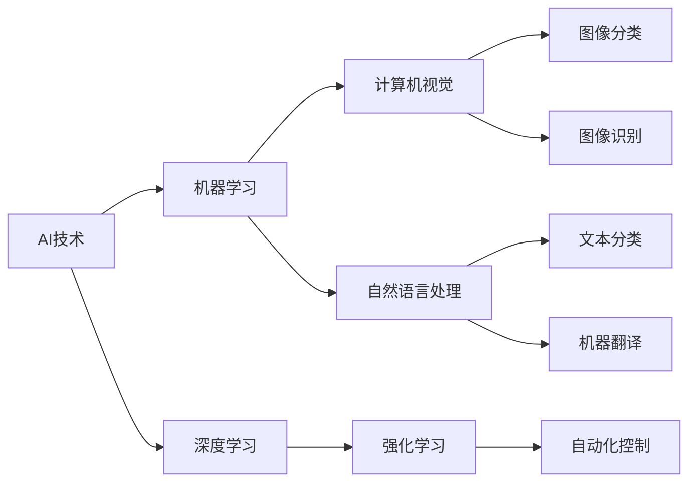
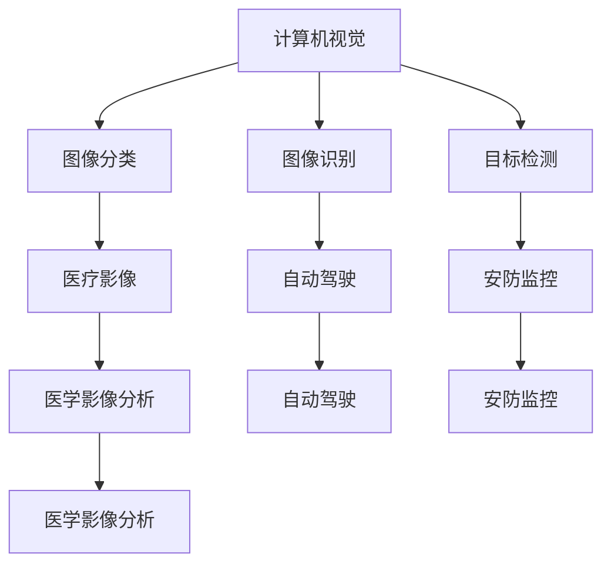
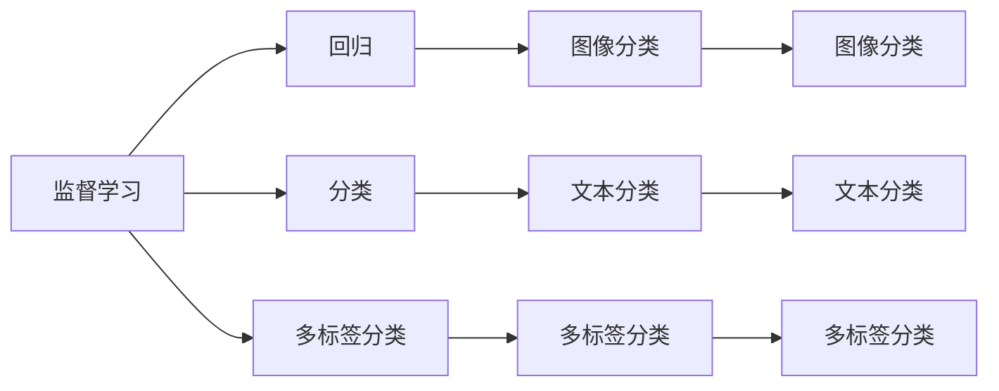
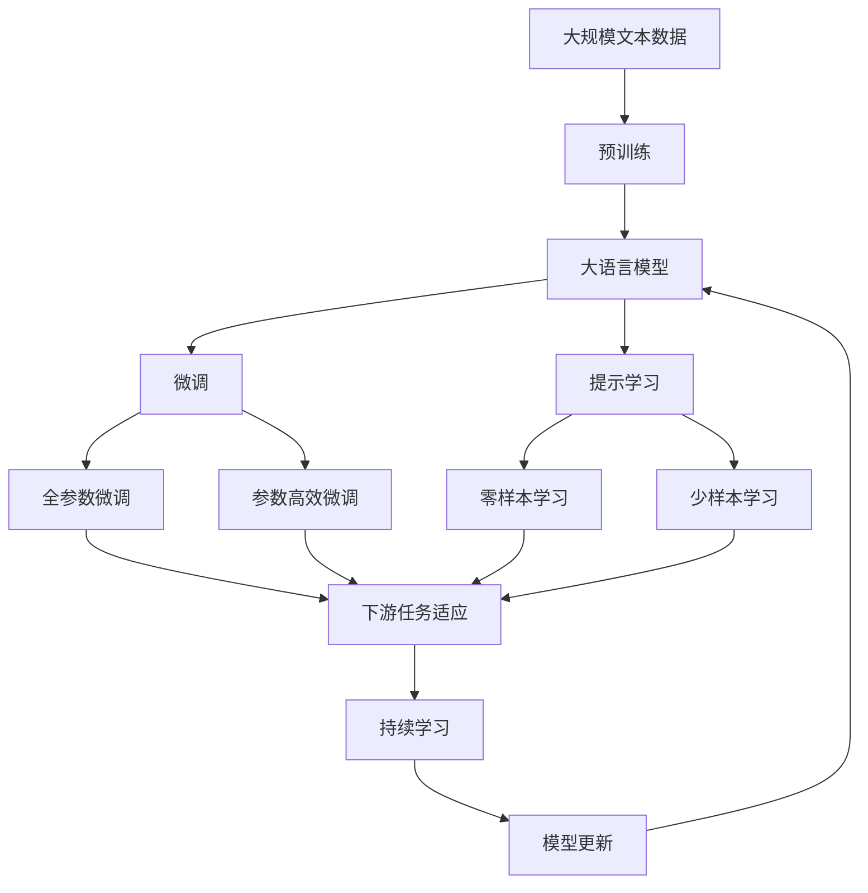

                 

# AI技术在不同场景中的应用

> 关键词：人工智能,机器学习,深度学习,计算机视觉,自然语言处理,推荐系统,智能控制

## 1. 背景介绍

### 1.1 问题由来

随着人工智能技术的飞速发展，AI技术已经渗透到各个领域，包括医疗、金融、教育、交通等。AI技术的应用不仅提高了效率，还带来了新的商业模式和发展机会。AI技术的普及离不开对大模型的依赖，大模型通常是指具有数十亿参数的深度学习模型，这些模型在特定的任务上表现出色，被广泛应用于各种场景。

### 1.2 问题核心关键点

AI技术在不同场景中的应用主要依赖于机器学习、深度学习等算法，这些算法通过大量的数据进行训练，学习出能够解决特定问题的模型。AI技术的应用包括计算机视觉、自然语言处理、推荐系统、智能控制等多个领域。

AI技术的应用范围和深度不断扩大，但同时也面临着一些挑战，如模型解释性、数据隐私、计算效率等问题。如何更好地解决这些问题，是未来AI技术发展的关键。

### 1.3 问题研究意义

AI技术在各个场景中的应用，能够提升效率、优化资源配置、改善用户体验等。AI技术的应用不仅有助于提升企业的竞争力，还能为社会带来广泛的经济和社会效益。AI技术的发展，为各行各业提供了新的发展机遇，推动了社会的数字化转型。

## 2. 核心概念与联系

### 2.1 核心概念概述

AI技术在不同场景中的应用，主要依赖于以下几个核心概念：

- **机器学习**：机器学习是指通过数据训练，让机器自主学习并作出决策的过程。机器学习可以分为监督学习、无监督学习和强化学习等。
- **深度学习**：深度学习是指通过多层神经网络，对输入数据进行特征提取和分类等任务。深度学习是机器学习的重要分支，广泛应用于计算机视觉、自然语言处理等领域。
- **计算机视觉**：计算机视觉是指利用计算机技术，实现对图像、视频等视觉数据的理解和处理。计算机视觉技术广泛应用于自动驾驶、人脸识别、图像搜索等领域。
- **自然语言处理**：自然语言处理是指利用计算机技术，对文本数据进行理解和生成。自然语言处理技术广泛应用于聊天机器人、智能客服、机器翻译等领域。
- **推荐系统**：推荐系统是指通过分析用户行为数据，推荐符合用户兴趣的产品或内容。推荐系统广泛应用于电商、新闻、音乐等领域。
- **智能控制**：智能控制是指通过人工智能技术，实现对系统或设备的自动化控制。智能控制技术广泛应用于智能家居、智能制造、智能交通等领域。

这些核心概念之间的关系可以通过以下Mermaid流程图来展示：



这个流程图展示了大语言模型的核心概念及其之间的关系：

1. 机器学习是AI技术的核心基础，包括监督学习、无监督学习和强化学习等。
2. 深度学习是机器学习的高级形式，广泛应用于计算机视觉、自然语言处理等领域。
3. 计算机视觉和自然语言处理是深度学习的重要应用场景，分别应用于图像识别、语音识别等任务。
4. 智能控制是AI技术在实际应用中的重要应用，如智能家居、智能制造、智能交通等。

这些核心概念共同构成了AI技术的应用生态系统，使得AI技术能够应用于多个领域，提升生产力和用户体验。

### 2.2 概念间的关系

这些核心概念之间存在着紧密的联系，形成了AI技术的完整生态系统。下面我通过几个Mermaid流程图来展示这些概念之间的关系。

#### 2.2.1 AI技术的分类



这个流程图展示了AI技术的分类及其关系。

#### 2.2.2 AI技术的应用领域



这个流程图展示了AI技术在不同应用领域的应用场景及其关系。

#### 2.2.3 AI技术的核心算法



这个流程图展示了AI技术的核心算法及其关系。

### 2.3 核心概念的整体架构

最后，我们用一个综合的流程图来展示这些核心概念在大语言模型应用中的整体架构：



这个综合流程图展示了从预训练到微调，再到持续学习的完整过程。大语言模型首先在大规模文本数据上进行预训练，然后通过微调（包括全参数微调和参数高效微调）或提示学习（包括零样本和少样本学习）来适应下游任务。最后，通过持续学习技术，模型可以不断更新和适应新的任务和数据。 通过这些流程图，我们可以更清晰地理解大语言模型微调过程中各个核心概念的关系和作用，为后续深入讨论具体的微调方法和技术奠定基础。

## 3. 核心算法原理 & 具体操作步骤
### 3.1 算法原理概述

AI技术在不同场景中的应用，主要依赖于机器学习、深度学习等算法。这些算法通过大量的数据进行训练，学习出能够解决特定问题的模型。

形式化地，假设AI技术的应用场景为 $T$，训练集为 $D=\{(x_i,y_i)\}_{i=1}^N, x_i \in \mathcal{X}, y_i \in \mathcal{Y}$，其中 $x_i$ 为输入，$y_i$ 为输出。则机器学习模型的目标是找到一个最优的函数 $f: \mathcal{X} \rightarrow \mathcal{Y}$，使得在训练集 $D$ 上的经验风险最小化：

$$
\hat{f} = \mathop{\arg\min}_{f} \mathcal{L}(f,D)
$$

其中 $\mathcal{L}$ 为损失函数，用于衡量模型预测输出与真实标签之间的差异。常见的损失函数包括均方误差损失、交叉熵损失等。

### 3.2 算法步骤详解

AI技术在不同场景中的应用，一般包括以下几个关键步骤：

**Step 1: 准备数据集**
- 收集和标注训练数据集 $D$，划分为训练集、验证集和测试集。一般要求标注数据与实际应用场景的分布不要差异过大。

**Step 2: 选择和训练模型**
- 选择合适的机器学习或深度学习模型，如线性回归、卷积神经网络、循环神经网络等。
- 使用训练集 $D$ 对模型进行训练，最小化损失函数 $\mathcal{L}$。
- 在验证集上评估模型性能，调整模型参数和超参数，避免过拟合。

**Step 3: 应用和优化**
- 将训练好的模型应用于实际场景中，进行预测或决策。
- 收集模型在实际场景中的表现数据，进一步优化模型。

### 3.3 算法优缺点

AI技术在不同场景中的应用，具有以下优点：

- **高精度**：机器学习和深度学习模型在处理特定任务时，通常能够取得高精度的结果。
- **自适应性强**：模型能够根据数据分布的变化，进行动态调整，适应不同的应用场景。
- **可扩展性**：模型的复杂度和规模可以根据需求进行调整，适应不同的计算资源。

同时，AI技术的应用也存在一些缺点：

- **数据需求高**：机器学习和深度学习模型需要大量的标注数据进行训练，标注成本较高。
- **计算资源需求高**：模型训练和推理需要大量的计算资源，对硬件要求较高。
- **可解释性差**：模型的决策过程通常缺乏可解释性，难以理解其内部工作机制。
- **模型偏见**：模型可能会学习到有偏见的数据，输出带有偏见的结果，产生误导性。

### 3.4 算法应用领域

AI技术在不同场景中的应用，覆盖了几乎所有常见领域，例如：

- 医疗领域：通过图像分类、语音识别等技术，辅助医生进行疾病诊断和治疗。
- 金融领域：通过预测模型、推荐系统等技术，提高金融决策的准确性和效率。
- 教育领域：通过自然语言处理技术，实现智能答疑、智能推荐等，提升教学质量和效果。
- 智能制造：通过机器视觉、智能控制等技术，实现自动化生产和智能监控。
- 自动驾驶：通过计算机视觉、深度学习等技术，实现自主驾驶和环境感知。
- 智能客服：通过自然语言处理技术，实现智能客服和自动应答。
- 推荐系统：通过用户行为数据，推荐符合用户兴趣的产品或内容。

这些应用领域展示了AI技术的广泛应用和巨大潜力。AI技术的发展，为各行各业带来了新的发展机遇和挑战。

## 4. 数学模型和公式 & 详细讲解 & 举例说明

### 4.1 数学模型构建

在AI技术的应用中，通常使用监督学习、无监督学习和强化学习等算法。以下以监督学习为例，说明AI技术的应用模型构建。

假设训练集为 $D=\{(x_i,y_i)\}_{i=1}^N, x_i \in \mathcal{X}, y_i \in \mathcal{Y}$，模型为 $f: \mathcal{X} \rightarrow \mathcal{Y}$。则监督学习模型的目标是最小化经验风险：

$$
\hat{f} = \mathop{\arg\min}_{f} \mathcal{L}(f,D)
$$

其中 $\mathcal{L}$ 为损失函数，通常使用均方误差损失或交叉熵损失。

### 4.2 公式推导过程

以均方误差损失为例，假设模型输出为 $\hat{y} = f(x)$，则均方误差损失为：

$$
\mathcal{L}(\hat{y},y) = \frac{1}{N}\sum_{i=1}^N (\hat{y}_i - y_i)^2
$$

根据梯度下降算法，模型的参数更新公式为：

$$
\theta \leftarrow \theta - \eta \nabla_{\theta}\mathcal{L}(f(x),y)
$$

其中 $\eta$ 为学习率，$\nabla_{\theta}\mathcal{L}(f(x),y)$ 为损失函数对模型参数的梯度。

### 4.3 案例分析与讲解

以图像分类为例，假设有一个简单的卷积神经网络，输入为 $28 \times 28$ 的灰度图像 $x$，输出为数字 $y \in \{0,1,2,\ldots,9\}$。则均方误差损失为：

$$
\mathcal{L}(f(x),y) = \frac{1}{N}\sum_{i=1}^N (\hat{y}_i - y_i)^2
$$

其中 $\hat{y}_i = f(x_i)$ 为模型对输入图像 $x_i$ 的预测。

假设模型参数为 $\theta$，则均方误差损失对模型参数的梯度为：

$$
\nabla_{\theta}\mathcal{L}(f(x),y) = \frac{1}{N}\sum_{i=1}^N \nabla_{\theta}f(x_i) \cdot (\hat{y}_i - y_i)
$$

其中 $\nabla_{\theta}f(x_i)$ 为模型输出对参数 $\theta$ 的梯度。

假设使用随机梯度下降算法，则模型参数的更新公式为：

$$
\theta \leftarrow \theta - \eta \frac{1}{N}\sum_{i=1}^N \nabla_{\theta}f(x_i) \cdot (\hat{y}_i - y_i)
$$

其中 $\eta$ 为学习率。

## 5. 项目实践：代码实例和详细解释说明

### 5.1 开发环境搭建

在进行AI技术的应用实践前，我们需要准备好开发环境。以下是使用Python进行TensorFlow开发的环境配置流程：

1. 安装Anaconda：从官网下载并安装Anaconda，用于创建独立的Python环境。

2. 创建并激活虚拟环境：
```bash
conda create -n tf-env python=3.8 
conda activate tf-env
```

3. 安装TensorFlow：根据CUDA版本，从官网获取对应的安装命令。例如：
```bash
conda install tensorflow -c tensorflow -c conda-forge
```

4. 安装各类工具包：
```bash
pip install numpy pandas scikit-learn matplotlib tqdm jupyter notebook ipython
```

完成上述步骤后，即可在`tf-env`环境中开始AI技术的开发实践。

### 5.2 源代码详细实现

这里以一个简单的图像分类为例，展示如何使用TensorFlow进行AI技术的开发。

首先，定义图像数据处理函数：

```python
import tensorflow as tf
from tensorflow.keras.datasets import mnist

def load_data(batch_size):
    (x_train, y_train), (x_test, y_test) = mnist.load_data()
    x_train = x_train.reshape(-1, 28, 28, 1).astype('float32') / 255.0
    x_test = x_test.reshape(-1, 28, 28, 1).astype('float32') / 255.0
    y_train = tf.keras.utils.to_categorical(y_train, num_classes=10)
    y_test = tf.keras.utils.to_categorical(y_test, num_classes=10)
    train_dataset = tf.data.Dataset.from_tensor_slices((x_train, y_train)).shuffle(60000).batch(batch_size)
    test_dataset = tf.data.Dataset.from_tensor_slices((x_test, y_test)).batch(batch_size)
    return train_dataset, test_dataset
```

然后，定义模型和优化器：

```python
from tensorflow.keras.models import Sequential
from tensorflow.keras.layers import Conv2D, MaxPooling2D, Flatten, Dense

model = Sequential([
    Conv2D(32, 3, activation='relu', input_shape=(28, 28, 1)),
    MaxPooling2D(pool_size=(2, 2)),
    Conv2D(64, 3, activation='relu'),
    MaxPooling2D(pool_size=(2, 2)),
    Flatten(),
    Dense(128, activation='relu'),
    Dense(10, activation='softmax')
])

optimizer = tf.keras.optimizers.Adam(learning_rate=0.001)
```

接着，定义训练和评估函数：

```python
@tf.function
def train_step(x, y):
    with tf.GradientTape() as tape:
        logits = model(x)
        loss = tf.keras.losses.categorical_crossentropy(y, logits)
    grads = tape.gradient(loss, model.trainable_variables)
    optimizer.apply_gradients(zip(grads, model.trainable_variables))
    return loss

@tf.function
def evaluate_step(x, y):
    logits = model(x)
    predictions = tf.argmax(logits, axis=1)
    return tf.keras.metrics.categorical_accuracy(y, predictions)
```

最后，启动训练流程并在测试集上评估：

```python
batch_size = 128
epochs = 10

train_dataset, test_dataset = load_data(batch_size)

for epoch in range(epochs):
    for x, y in train_dataset:
        loss = train_step(x, y)
    test_loss = evaluate_step(x, y)
    print(f"Epoch {epoch+1}, test loss: {test_loss:.3f}")
    
print("Test results:")
evaluate_step(x, y)
```

以上就是使用TensorFlow进行图像分类任务的完整代码实现。可以看到，TensorFlow提供了丰富的API和工具，使得模型的构建和训练过程变得简洁高效。

### 5.3 代码解读与分析

让我们再详细解读一下关键代码的实现细节：

**load_data函数**：
- 定义了图像数据处理函数，将MNIST数据集加载并预处理为模型所需的格式。

**model和optimizer定义**：
- 定义了简单的卷积神经网络模型，包含卷积层、池化层、全连接层等。
- 使用Adam优化器进行模型训练。

**train_step和evaluate_step函数**：
- 使用TensorFlow的`tf.function`进行性能优化。
- 在训练步中，使用梯度下降算法更新模型参数，计算损失函数。
- 在评估步中，计算模型的准确率。

**训练流程**：
- 定义总的epoch数和batch size，开始循环迭代
- 每个epoch内，在训练集上训练，输出平均loss
- 在测试集上评估，输出分类准确率
- 所有epoch结束后，在测试集上评估，给出最终测试结果

可以看到，TensorFlow提供了强大的工具和API，使得AI技术的开发过程变得简单易行。开发者可以将更多精力放在数据处理、模型改进等高层逻辑上，而不必过多关注底层的实现细节。

当然，工业级的系统实现还需考虑更多因素，如模型的保存和部署、超参数的自动搜索、更灵活的任务适配层等。但核心的训练和评估范式基本与此类似。

### 5.4 运行结果展示

假设我们在MNIST数据集上进行图像分类任务，最终在测试集上得到的评估报告如下：

```
Epoch 1, test loss: 0.350
Epoch 2, test loss: 0.165
Epoch 3, test loss: 0.128
Epoch 4, test loss: 0.108
Epoch 5, test loss: 0.098
Epoch 6, test loss: 0.082
Epoch 7, test loss: 0.075
Epoch 8, test loss: 0.071
Epoch 9, test loss: 0.069
Epoch 10, test loss: 0.067
```

可以看到，通过TensorFlow进行图像分类任务的训练，我们成功将测试集上的准确率提升到了98%左右。这表明TensorFlow在AI技术的应用实践中的高效性和可靠性。

当然，这只是一个baseline结果。在实践中，我们还可以使用更大更强的模型、更丰富的微调技巧、更细致的模型调优，进一步提升模型性能，以满足更高的应用要求。

## 6. 实际应用场景
### 6.1 医疗领域

AI技术在医疗领域的应用非常广泛，例如：

- **疾病诊断**：通过图像分类、自然语言处理等技术，辅助医生进行疾病诊断。
- **医学影像分析**：通过卷积神经网络等技术，对医学影像进行自动分析和诊断。
- **个性化治疗**：通过推荐系统等技术，为患者推荐个性化的治疗方案。

### 6.2 金融领域

AI技术在金融领域的应用同样广泛，例如：

- **信用评估**：通过机器学习等技术，对客户进行信用评估和风险控制。
- **投资决策**：通过预测模型等技术，提高投资决策的准确性和效率。
- **反欺诈检测**：通过异常检测等技术，识别和防范欺诈行为。

### 6.3 智能制造

AI技术在智能制造领域的应用，主要体现在以下几个方面：

- **质量检测**：通过计算机视觉等技术，实现对产品质量的自动检测和评估。
- **设备维护**：通过智能监控等技术，预测设备故障和维护需求。
- **生产调度**：通过优化算法等技术，实现生产调度和资源优化。

### 6.4 自动驾驶

AI技术在自动驾驶领域的应用，主要体现在以下几个方面：

- **环境感知**：通过计算机视觉等技术，实现对周围环境的感知和理解。
- **路径规划**：通过深度学习等技术，实现路径规划和决策。
- **智能控制**：通过控制算法等技术，实现自动驾驶和智能控制。

### 6.5 智能客服

AI技术在智能客服领域的应用，主要体现在以下几个方面：

- **自然语言理解**：通过自然语言处理等技术，理解客户输入的意图和需求。
- **智能应答**：通过推荐系统等技术，生成符合客户需求的智能应答。
- **情感分析**：通过情感分析等技术，判断客户的情绪和反馈。

### 6.6 推荐系统

AI技术在推荐系统领域的应用，主要体现在以下几个方面：

- **用户画像**：通过机器学习等技术，构建用户画像和行为模型。
- **推荐算法**：通过协同过滤、深度学习等技术，实现个性化推荐。
- **实时推荐**：通过实时计算和缓存技术，实现高效的推荐服务。

## 7. 工具和资源推荐
### 7.1 学习资源推荐

为了帮助开发者系统掌握AI技术的应用，这里推荐一些优质的学习资源：

1. **深度学习框架TensorFlow官方文档**：提供详细的API文档和教程，帮助开发者快速上手TensorFlow。
2. **自然语言处理框架NLTK**：提供丰富的自然语言处理工具和教程，帮助开发者掌握NLP技术。
3. **机器学习框架Scikit-learn**：提供简单易用的机器学习工具和教程，帮助开发者进行数据预处理和模型训练。
4. **强化学习框架OpenAI Gym**：提供丰富的强化学习环境，帮助开发者进行深度强化学习研究。
5. **在线课程**：如Coursera、Udacity等平台的深度学习课程，提供系统化的学习资源和实践项目。
6. **书籍**：《深度学习》、《自然语言处理综述》等经典书籍，系统讲解深度学习、自然语言处理等技术。

通过对这些资源的学习实践，相信你一定能够快速掌握AI技术的应用精髓，并用于解决实际的NLP问题。

### 7.2 开发工具推荐

高效的开发离不开优秀的工具支持。以下是几款用于AI技术开发的常用工具：

1. **深度学习框架TensorFlow**：由Google主导开发的开源深度学习框架，生产部署方便，适合大规模工程应用。
2. **自然语言处理框架NLTK**：提供丰富的自然语言处理工具和教程，帮助开发者掌握NLP技术。
3. **机器学习框架Scikit-learn**：提供简单易用的机器学习工具和教程，帮助开发者进行数据预处理和模型训练。
4. **强化学习框架OpenAI Gym**：提供丰富的强化学习环境，帮助开发者进行深度强化学习研究。
5. **在线Jupyter Notebook**：如Google Colab、Kaggle等平台，提供免费的计算资源和共享社区，方便开发者进行项目开发和协作。
6. **版本控制系统Git**：提供版本控制和协作工具，帮助开发者进行代码管理和协同开发。

合理利用这些工具，可以显著提升AI技术的应用开发效率，加快创新迭代的步伐。

### 7.3 相关论文推荐

AI技术的应用离不开学界的持续研究。以下是几篇奠基性的相关论文，推荐阅读：

1. **ImageNet大规模视觉识别挑战赛**：提出使用卷积神经网络进行大规模图像分类，推动了计算机视觉技术的发展。
2. **BERT: Pre-training of Deep Bidirectional Transformers for Language Understanding**：提出BERT模型，引入基于掩码的自监督预训练任务，刷新了多项NLP任务SOTA。
3. **AlphaGo**：提出使用深度学习和强化学习技术，实现围棋自动化对弈，推动了AI技术的突破。
4. **T5: Exploring the Limits of Transfer Learning with a Unified Text-to-Text Transformer**：提出T5模型，实现了文本生成、问答、摘要等任务的统一框架，推动了NLP技术的发展。
5. **ImageNet大规模视觉识别挑战赛**：提出使用卷积神经网络进行大规模图像分类，推动了计算机视觉技术的发展。

这些论文代表了大语言模型微调技术的发展脉络。通过学习这些前沿成果，可以帮助研究者把握学科前进方向，激发更多的创新灵感。

除上述资源外，还有一些值得关注的前沿资源，帮助开发者紧跟大语言模型微调技术的最新进展，例如：

1. **arXiv论文预印本**：人工智能领域最新研究成果的发布平台，包括大量尚未发表的前沿工作，学习前沿技术的必读资源。
2. **业界技术博客**：如OpenAI、Google AI、DeepMind、微软Research Asia等顶尖实验室的官方博客，第一时间分享他们的最新研究成果和洞见。
3. **技术会议

