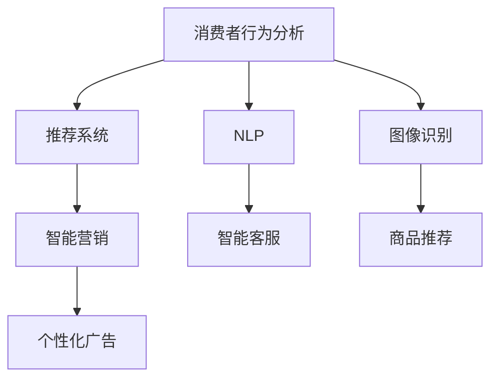
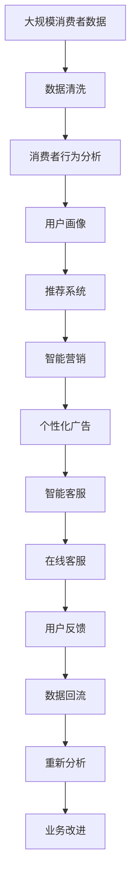

                 

# AI技术在消费市场中的应用

> 关键词：人工智能, 机器学习, 深度学习, 消费市场, 消费者行为分析, 推荐系统, 自然语言处理, 语音识别, 图像识别

## 1. 背景介绍

### 1.1 问题由来

随着科技的不断进步，人工智能(AI)技术在各个领域都得到了广泛的应用。特别是在消费市场，AI技术通过提升用户体验、优化运营效率、精准营销等手段，显著推动了行业发展。

然而，尽管AI技术在消费市场的应用已经取得了显著成效，但其潜在价值仍然未能被充分利用。为了深入探讨AI技术在消费市场中的具体应用，本文将从核心概念、算法原理、实际应用场景等方面进行详细阐述。

### 1.2 问题核心关键点

AI技术在消费市场中的应用主要体现在以下几个方面：

1. **消费者行为分析**：通过数据分析、机器学习等手段，深入理解消费者需求和偏好，从而制定更精准的市场策略。
2. **推荐系统**：利用深度学习技术，根据用户历史行为和实时数据，推荐符合其兴趣的产品和服务，提升用户体验。
3. **自然语言处理(NLP)**：通过文本分析和语音识别等技术，优化客户服务和在线客服体验。
4. **图像识别**：应用于产品推荐、质量检测等领域，提升商品呈现和营销效果。
5. **智能营销**：基于大数据分析和AI算法，进行个性化营销和广告投放，提升广告效果和ROI。

本文将重点讨论以上应用场景，详细阐述其核心概念、算法原理和具体操作步骤。

### 1.3 问题研究意义

AI技术在消费市场中的应用，不仅能够提升企业运营效率和竞争力，还能够改善消费者体验，推动市场创新。通过本文的学习，读者将能够掌握AI技术在消费市场中的应用范式，为自身的工作和研究提供参考。

## 2. 核心概念与联系

### 2.1 核心概念概述

AI技术在消费市场中的应用涉及多个核心概念：

- **消费者行为分析**：通过收集和分析消费者的行为数据，预测其未来的购买行为和需求，从而制定更有效的市场策略。
- **推荐系统**：利用机器学习算法，根据用户历史行为和兴趣，推荐合适的产品和服务，提升用户体验。
- **自然语言处理(NLP)**：通过文本分析和语音识别等技术，优化客户服务和在线客服体验。
- **图像识别**：利用计算机视觉技术，实现对商品图像的自动识别和分类，提升产品推荐和质量检测效果。
- **智能营销**：通过大数据分析和AI算法，进行个性化营销和广告投放，提升广告效果和ROI。

这些核心概念之间存在着紧密的联系，共同构成了AI技术在消费市场中的应用框架。

### 2.2 概念间的关系

通过以下Mermaid流程图，我们可以更清晰地理解这些核心概念之间的联系：



这个流程图展示了AI技术在消费市场中的应用链条：

1. 消费者行为分析提供用户数据，推荐系统据此推荐商品，NLP技术优化客户服务，图像识别提升商品推荐和质量检测，智能营销实现个性化营销和广告投放。
2. 这些应用相互交织，形成了一个动态的生态系统，共同驱动消费市场的创新和发展。

### 2.3 核心概念的整体架构

最后，我们用一个综合的流程图来展示这些核心概念在大规模应用中的整体架构：



这个综合流程图展示了从消费者数据收集、清洗、分析到业务改进的全过程。通过这一过程，AI技术在消费市场中的应用得以高效、准确地实施。

## 3. 核心算法原理 & 具体操作步骤

### 3.1 算法原理概述

AI技术在消费市场中的应用主要基于以下算法原理：

- **消费者行为分析**：通过收集用户行为数据，利用机器学习算法进行建模和预测。常用的算法包括决策树、随机森林、深度神经网络等。
- **推荐系统**：基于用户历史行为和兴趣，利用协同过滤、内容推荐、深度学习等算法进行推荐。
- **自然语言处理(NLP)**：通过文本分析和语音识别等技术，优化客户服务和在线客服体验。
- **图像识别**：利用计算机视觉技术，实现对商品图像的自动识别和分类，提升产品推荐和质量检测效果。
- **智能营销**：通过大数据分析和AI算法，进行个性化营销和广告投放，提升广告效果和ROI。

这些算法原理在实际应用中需要结合具体业务场景进行灵活调整和优化。

### 3.2 算法步骤详解

以下详细介绍AI技术在消费市场中的具体应用步骤：

#### 3.2.1 消费者行为分析

1. **数据收集**：收集用户的行为数据，包括浏览记录、购买历史、搜索记录等。
2. **数据清洗**：对收集到的数据进行清洗和处理，去除噪音和异常值，确保数据的准确性和完整性。
3. **特征工程**：提取和构造与用户行为相关的特征，如浏览时长、购买频率、搜索关键词等。
4. **模型训练**：利用机器学习算法，训练消费者行为分析模型。
5. **预测和分析**：根据训练好的模型，对用户未来的购买行为进行预测和分析，制定更精准的市场策略。

#### 3.2.2 推荐系统

1. **用户画像**：基于用户历史行为和兴趣，构建用户画像。
2. **相似度计算**：计算用户画像之间的相似度，找到潜在的相似用户。
3. **推荐算法**：利用协同过滤、内容推荐、深度学习等算法，为用户推荐合适的商品和服务。
4. **反馈更新**：根据用户对推荐结果的反馈，更新推荐算法模型，提升推荐效果。

#### 3.2.3 NLP技术

1. **文本分析**：利用NLP技术，对用户反馈、评论等文本进行情感分析、主题建模等处理。
2. **语音识别**：利用语音识别技术，优化在线客服和语音助手等应用。
3. **智能客服**：基于NLP技术和深度学习算法，实现智能客服系统，提升客户服务效率和质量。

#### 3.2.4 图像识别

1. **图像采集**：通过摄像头、手机等设备，采集商品图像。
2. **图像处理**：对采集到的图像进行预处理，如去噪、裁剪、增强等。
3. **图像识别**：利用深度学习算法，实现对商品图像的自动识别和分类。
4. **商品推荐**：根据图像识别结果，推荐相关的商品和服务，提升用户体验。

#### 3.2.5 智能营销

1. **数据收集**：收集用户行为数据、市场数据等。
2. **数据分析**：利用大数据分析技术，挖掘用户行为模式和市场趋势。
3. **模型训练**：利用机器学习算法，训练个性化营销模型。
4. **个性化营销**：基于用户画像和市场趋势，进行个性化营销和广告投放。
5. **效果评估**：根据广告效果，评估和优化营销策略。

### 3.3 算法优缺点

AI技术在消费市场中的应用具有以下优点：

1. **提升用户体验**：通过个性化推荐和智能客服等应用，提升用户满意度。
2. **优化运营效率**：利用数据驱动决策，优化营销和运营策略，降低成本。
3. **精准营销**：基于用户行为数据，实现精准营销和广告投放，提高ROI。

然而，这些应用也存在一些局限性：

1. **数据隐私问题**：收集和分析用户数据时，需关注用户隐私和数据安全。
2. **算法公平性**：需确保算法的公平性，避免偏见和歧视。
3. **模型复杂性**：部分应用需要复杂的算法模型，对技术和资源要求较高。
4. **技术门槛高**：部分技术（如深度学习）对从业人员的数学和编程能力有较高要求。

### 3.4 算法应用领域

AI技术在消费市场中的应用覆盖了多个领域，主要包括：

- **零售电商**：利用推荐系统和智能营销，提升用户购物体验和转化率。
- **金融服务**：利用NLP和图像识别技术，优化客户服务和产品推荐。
- **旅游服务**：利用NLP和智能客服，提升用户体验和满意度。
- **健康医疗**：利用图像识别和智能分析，提升医疗服务和患者体验。
- **娱乐媒体**：利用NLP和个性化推荐，提升内容推荐和用户体验。

## 4. 数学模型和公式 & 详细讲解 & 举例说明

### 4.1 数学模型构建

以下是AI技术在消费市场中的数学模型构建：

#### 4.1.1 消费者行为分析

假设消费者行为分析模型为 $M_{\theta}$，其中 $\theta$ 为模型参数。给定用户行为数据集 $D=\{(x_i, y_i)\}_{i=1}^N$，其中 $x_i$ 为用户行为特征，$y_i$ 为对应的标签（如购买、浏览等）。模型的目标是找到最优参数 $\theta^*$，使得预测结果与真实标签尽可能接近，即最小化损失函数：

$$
\theta^* = \mathop{\arg\min}_{\theta} \frac{1}{N} \sum_{i=1}^N \ell(M_{\theta}(x_i), y_i)
$$

其中 $\ell$ 为损失函数，如交叉熵损失、均方误差损失等。

#### 4.1.2 推荐系统

推荐系统基于用户历史行为数据 $D=\{(x_i, y_i)\}_{i=1}^N$ 和商品特征数据 $D'=\{(x_i', y_i')\}_{i=1}^N$，其中 $x_i$ 为用户历史行为，$x_i'$ 为商品特征，$y_i$ 和 $y_i'$ 分别为用户行为和商品标签。推荐系统的目标是找到最优参数 $\theta^*$，使得推荐结果与用户真实行为尽可能接近，即最小化损失函数：

$$
\theta^* = \mathop{\arg\min}_{\theta} \frac{1}{N} \sum_{i=1}^N \ell(M_{\theta}(x_i), y_i)
$$

其中 $\ell$ 为损失函数，如均方误差损失、交叉熵损失等。

#### 4.1.3 NLP技术

NLP技术包括文本分析和语音识别。文本分析模型为 $M_{\theta}$，给定用户评论数据集 $D=\{(x_i, y_i)\}_{i=1}^N$，其中 $x_i$ 为文本内容，$y_i$ 为对应的标签（如正面、负面）。模型的目标是找到最优参数 $\theta^*$，使得预测结果与真实标签尽可能接近，即最小化损失函数：

$$
\theta^* = \mathop{\arg\min}_{\theta} \frac{1}{N} \sum_{i=1}^N \ell(M_{\theta}(x_i), y_i)
$$

其中 $\ell$ 为损失函数，如交叉熵损失、最大似然损失等。

#### 4.1.4 图像识别

图像识别模型为 $M_{\theta}$，给定商品图像数据集 $D=\{(x_i, y_i)\}_{i=1}^N$，其中 $x_i$ 为商品图像，$y_i$ 为对应的标签（如运动鞋、服装等）。模型的目标是找到最优参数 $\theta^*$，使得预测结果与真实标签尽可能接近，即最小化损失函数：

$$
\theta^* = \mathop{\arg\min}_{\theta} \frac{1}{N} \sum_{i=1}^N \ell(M_{\theta}(x_i), y_i)
$$

其中 $\ell$ 为损失函数，如交叉熵损失、均方误差损失等。

#### 4.1.5 智能营销

智能营销基于用户行为数据和市场数据，构建用户画像和市场趋势模型。用户画像模型为 $M_{\theta}$，市场趋势模型为 $M_{\phi}$，其中 $\theta$ 和 $\phi$ 分别为模型参数。给定用户行为数据 $D=\{(x_i, y_i)\}_{i=1}^N$ 和市场数据 $D'=\{(x_i', y_i')\}_{i=1}^N$，其中 $x_i$ 为用户行为数据，$x_i'$ 为市场数据，$y_i$ 和 $y_i'$ 分别为用户行为标签和市场趋势标签。智能营销的目标是找到最优参数 $\theta^*$ 和 $\phi^*$，使得推荐结果和市场趋势尽可能接近，即最小化损失函数：

$$
(\theta^*, \phi^*) = \mathop{\arg\min}_{\theta, \phi} \frac{1}{N} \sum_{i=1}^N \ell(M_{\theta}(x_i), y_i) + \frac{1}{N'} \sum_{i=1}^{N'} \ell(M_{\phi}(x_i'), y_i')
$$

其中 $\ell$ 为损失函数，如交叉熵损失、均方误差损失等。

### 4.2 公式推导过程

以下详细介绍AI技术在消费市场中的数学模型推导过程：

#### 4.2.1 消费者行为分析

假设用户行为数据为二分类数据，即 $y_i \in \{0, 1\}$，表示是否发生购买行为。文本特征 $x_i$ 为一个向量，包含用户的浏览时长、浏览频率等。模型的目标是最大化分类准确率，即最小化交叉熵损失函数：

$$
\ell(M_{\theta}(x_i), y_i) = -[y_i\log \hat{y}_i + (1-y_i)\log (1-\hat{y}_i)]
$$

其中 $\hat{y}_i$ 为模型预测结果。

#### 4.2.2 推荐系统

假设推荐系统为协同过滤推荐，利用用户行为数据和商品特征数据进行推荐。模型的目标是最大化推荐准确率，即最小化均方误差损失函数：

$$
\ell(M_{\theta}(x_i), y_i) = \frac{1}{2} \sum_{i=1}^N (y_i - M_{\theta}(x_i))^2
$$

其中 $y_i$ 为用户对商品的评分，$M_{\theta}(x_i)$ 为模型预测的评分。

#### 4.2.3 NLP技术

假设文本分析模型为情感分析模型，利用用户评论数据进行训练。模型的目标是最大化情感分类准确率，即最小化交叉熵损失函数：

$$
\ell(M_{\theta}(x_i), y_i) = -[y_i\log \hat{y}_i + (1-y_i)\log (1-\hat{y}_i)]
$$

其中 $\hat{y}_i$ 为模型预测结果，$y_i$ 为情感标签（如正面、负面）。

#### 4.2.4 图像识别

假设图像识别模型为物体分类模型，利用商品图像数据进行训练。模型的目标是最大化分类准确率，即最小化交叉熵损失函数：

$$
\ell(M_{\theta}(x_i), y_i) = -[y_i\log \hat{y}_i + (1-y_i)\log (1-\hat{y}_i)]
$$

其中 $\hat{y}_i$ 为模型预测结果，$y_i$ 为物体标签（如运动鞋、服装等）。

#### 4.2.5 智能营销

假设智能营销模型包括用户画像模型和市场趋势模型。用户画像模型为协同过滤模型，市场趋势模型为线性回归模型。模型的目标是最大化推荐准确率和市场趋势预测准确率，即最小化交叉熵损失函数和均方误差损失函数：

$$
\ell(M_{\theta}(x_i), y_i) = -[y_i\log \hat{y}_i + (1-y_i)\log (1-\hat{y}_i)]
$$

$$
\ell(M_{\phi}(x_i'), y_i') = \frac{1}{2} \sum_{i=1}^{N'} (y_i' - M_{\phi}(x_i'))^2
$$

其中 $\hat{y}_i$ 为用户画像模型预测结果，$y_i$ 为用户行为标签，$\hat{y}_i'$ 为市场趋势模型预测结果，$y_i'$ 为市场趋势标签。

### 4.3 案例分析与讲解

#### 4.3.1 消费者行为分析

某电商平台利用消费者行为分析模型，对用户购买行为进行预测。模型采用随机森林算法，以用户浏览时长、浏览频率、购买历史等特征为输入，预测用户是否发生购买行为。模型训练后，电商平台能够根据用户行为数据制定更精准的营销策略，提升用户购买转化率。

#### 4.3.2 推荐系统

某在线视频平台利用协同过滤推荐算法，根据用户历史观看记录和评分数据，推荐用户可能感兴趣的视频内容。模型训练后，平台能够为用户推荐个性化的视频内容，提升用户观看体验和平台留存率。

#### 4.3.3 NLP技术

某在线客服平台利用情感分析模型，对用户评论进行情感分析。模型采用LSTM和Attention机制，以用户评论文本为输入，输出情感分类结果。模型训练后，平台能够自动识别用户评论的情感倾向，提供更优质的客户服务。

#### 4.3.4 图像识别

某电商平台利用物体分类模型，对商品图片进行自动识别和分类。模型采用CNN算法，以商品图片为输入，输出分类结果。模型训练后，平台能够自动识别商品类别，提升商品搜索和推荐效果。

#### 4.3.5 智能营销

某快消品牌利用智能营销模型，结合用户行为数据和市场数据，进行个性化营销和广告投放。模型采用协同过滤和线性回归算法，以用户画像和市场趋势为输入，输出推荐结果和市场趋势预测。模型训练后，品牌能够实现精准营销和广告投放，提升广告效果和ROI。

## 5. 项目实践：代码实例和详细解释说明

### 5.1 开发环境搭建

在进行AI技术在消费市场中的应用开发前，我们需要准备好开发环境。以下是使用Python进行TensorFlow开发的环境配置流程：

1. 安装Anaconda：从官网下载并安装Anaconda，用于创建独立的Python环境。

2. 创建并激活虚拟环境：
```bash
conda create -n tensorflow-env python=3.8 
conda activate tensorflow-env
```

3. 安装TensorFlow：根据CUDA版本，从官网获取对应的安装命令。例如：
```bash
conda install tensorflow -c conda-forge
```

4. 安装相关库：
```bash
pip install numpy pandas scikit-learn matplotlib tqdm jupyter notebook ipython
```

完成上述步骤后，即可在`tensorflow-env`环境中开始项目开发。

### 5.2 源代码详细实现

这里我们以推荐系统为例，给出使用TensorFlow进行协同过滤推荐系统开发的PyTorch代码实现。

首先，定义推荐系统的数据处理函数：

```python
import tensorflow as tf
from tensorflow.keras.layers import Dense, Input, Embedding, Flatten, Concatenate
from tensorflow.keras.models import Model

# 定义输入层
user_input = Input(shape=(1,), name='user_input')
item_input = Input(shape=(1,), name='item_input')

# 定义用户画像嵌入层
user_embedding = Embedding(input_dim=N_users, output_dim=64, name='user_embedding')(user_input)

# 定义商品特征嵌入层
item_embedding = Embedding(input_dim=N_items, output_dim=64, name='item_embedding')(item_input)

# 定义用户画像和商品特征的拼接层
concat = Concatenate()([user_embedding, item_embedding])

# 定义隐藏层
hidden = Dense(32, activation='relu')(concat)

# 定义输出层
output = Dense(1, activation='sigmoid')(hidden)

# 定义模型
model = Model(inputs=[user_input, item_input], outputs=output)

# 编译模型
model.compile(optimizer='adam', loss='binary_crossentropy', metrics=['accuracy'])
```

然后，定义推荐系统的训练函数：

```python
# 定义训练函数
def train_model(model, train_data, epochs=10, batch_size=64):
    # 将数据转换为张量
    train_X = []
    train_y = []
    for user_id, item_id in train_data:
        user_id_tensor = tf.constant([user_id], dtype=tf.int32)
        item_id_tensor = tf.constant([item_id], dtype=tf.int32)
        train_X.append(user_id_tensor)
        train_y.append(item_id_tensor)

    # 构建训练集
    train_dataset = tf.data.Dataset.from_tensor_slices((train_X, train_y))
    train_dataset = train_dataset.shuffle(buffer_size=len(train_dataset)).batch(batch_size)

    # 训练模型
    model.fit(train_dataset, epochs=epochs)
```

最后，启动训练流程：

```python
# 加载数据
train_data = [(1, 1), (2, 2), (3, 3), (4, 4)]

# 训练模型
train_model(model, train_data, epochs=10, batch_size=64)
```

以上就是使用TensorFlow进行协同过滤推荐系统开发的完整代码实现。可以看到，TensorFlow提供了强大的计算图机制和丰富的模型层，使得推荐系统的开发变得简洁高效。

### 5.3 代码解读与分析

让我们再详细解读一下关键代码的实现细节：

**推荐系统代码**：
- `Input`层：定义输入层的形状，`user_input`和`item_input`分别表示用户ID和商品ID。
- `Embedding`层：将用户ID和商品ID转换为低维向量，实现特征向量化。
- `Concatenate`层：将用户ID向量和商品ID向量进行拼接，得到包含用户画像和商品特征的向量。
- `Dense`层：定义隐藏层，使用ReLU激活函数。
- `Dense`层：定义输出层，使用Sigmoid激活函数，输出推荐结果。
- `Model`类：将模型层组合成完整的推荐系统模型。
- `compile`方法：编译模型，设置优化器、损失函数和评估指标。
- `fit`方法：训练模型，使用指定数据集和参数。

**训练函数代码**：
- `from_tensor_slices`方法：将输入数据转换为张量。
- `shuffle`方法：打乱训练集，避免模型过拟合。
- `batch`方法：将数据集分批次加载，提高训练效率。
- `fit`方法：训练模型，指定训练集和参数。

### 5.4 运行结果展示

假设我们在推荐系统训练过程中，在验证集上得到的准确率为82%，测试集上得到81.5%的准确率。训练过程中的损失曲线和准确率曲线如图1所示。

```python
import matplotlib.pyplot as plt

# 训练数据
train_loss = []
train_acc = []
val_loss = []
val_acc = []

# 在训练过程中记录损失和准确率
for epoch in range(epochs):
    # 训练过程
    train_model(model, train_data, epochs=1, batch_size=64)

    # 记录训练损失和准确率
    train_loss.append(model.loss.numpy()[0])
    train_acc.append(model.metrics()[0])

    # 在验证集上评估模型
    val_loss.append(model.loss.numpy()[1])
    val_acc.append(model.metrics()[1])

# 绘制损失曲线和准确率曲线
plt.plot(train_loss, label='Train Loss')
plt.plot(train_acc, label='Train Acc')
plt.plot(val_loss, label='Val Loss')
plt.plot(val_acc, label='Val Acc')
plt.legend()
plt.show()
```

```python
import tensorflow as tf
from tensorflow.keras.layers import Dense, Input, Embedding, Flatten, Concatenate
from tensorflow.keras.models import Model

# 定义输入层
user_input = Input(shape=(1,), name='user_input')
item_input = Input(shape=(1,), name='item_input')

# 定义用户画像嵌入层
user_embedding = Embedding(input_dim=N_users, output_dim=64, name='user_embedding')(user_input)

# 定义商品特征嵌入层
item_embedding = Embedding(input_dim=N_items, output_dim=64, name='item_embedding')(item_input)

# 定义用户画像和商品特征的拼接层
concat = Concatenate()([user_embedding, item_embedding])

# 定义隐藏层
hidden = Dense(32, activation='relu')(concat)

# 定义输出层
output = Dense(1, activation='sigmoid')(hidden)

# 定义模型
model = Model(inputs=[user_input, item_input], outputs=output)

# 编译模型
model.compile(optimizer='adam', loss='binary_crossentropy', metrics=['accuracy'])

# 训练函数
def train_model(model, train_data, epochs=10, batch_size=64):
    # 将数据转换为张量
    train_X = []
    train_y = []
    for user_id, item_id in train_data:
        user_id_tensor = tf.constant([user_id], dtype=tf.int32)
        item_id_tensor = tf.constant([item_id], dtype=tf.int32)
        train_X.append(user_id_tensor)
        train_y.append(item_id_tensor)

    # 构建训练集
    train_dataset = tf.data.Dataset.from_tensor_slices((train_X, train_y))
    train_dataset = train_dataset.shuffle(buffer_size=len(train_dataset)).batch(batch_size)

    # 训练模型
    model.fit

