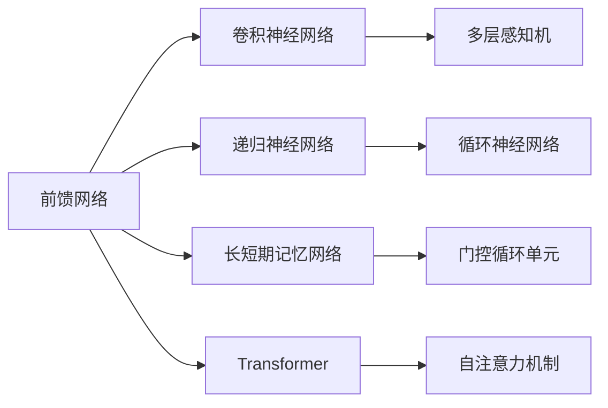
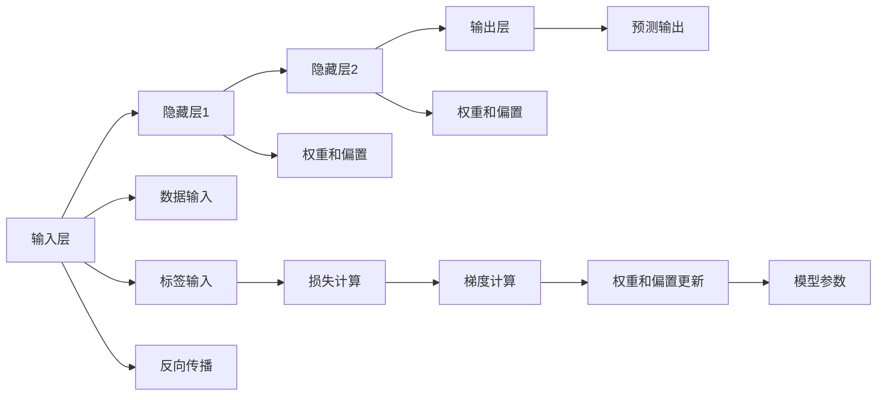

                 

## 1. 背景介绍

人工智能（AI）在现代科技和产业界发挥着至关重要的作用。从深度学习、强化学习到自然语言处理和计算机视觉，AI模型无处不在，推动着技术进步和社会进步。然而，尽管AI模型在许多领域表现出色，但它们的核心计算单元仍然是前馈网络，这使得前馈网络的应用成为AI模型的关键。本文将探讨前馈网络在AI模型中的应用，从原理到实践，为读者提供全面、深入的了解。

## 2. 核心概念与联系

### 2.1 核心概念概述

前馈网络（Feedforward Neural Network, FNN）是人工智能中最基本的神经网络结构之一。前馈网络由输入层、多个隐藏层和输出层组成。每个层包含多个神经元，神经元通过权重和偏置与上一层相连。信号从前一层传递到下一层，直到输出层，没有循环连接，这就是所谓的“前馈”。

- **输入层**：接收外部输入，通常是特征向量。
- **隐藏层**：执行非线性变换，学习输入数据的特征表示。
- **输出层**：根据输入数据的特征表示，输出预测结果。

前馈网络通过反向传播算法进行训练，这是一种利用梯度下降优化损失函数的算法。在反向传播中，模型预测的误差首先从前向传播结果中反向计算，然后通过链式法则向后传递，更新每个神经元的权重和偏置。

### 2.2 核心概念间的关系

前馈网络与AI模型的联系密切，可以说AI模型几乎都是由前馈网络构成的。无论是传统的神经网络，还是更先进的深度学习模型，如卷积神经网络（CNN）、递归神经网络（RNN）、长短期记忆网络（LSTM）和Transformer，其核心计算单元均基于前馈网络。

以下是一些核心概念间的关系图：



这个图表展示了前馈网络与其他常见AI模型的关系。其中，多层感知机（MLP）是前馈网络的一种特殊形式，而循环神经网络（RNN）、长短期记忆网络（LSTM）和Transformer则在前馈网络的基础上引入了时间维度，以处理序列数据。

### 2.3 核心概念的整体架构

前馈网络的整体架构可以分为以下几个部分：

1. **输入层**：接收输入数据。
2. **隐藏层**：包含多个神经元，执行特征提取和变换。
3. **输出层**：根据输入数据的特征表示，输出预测结果。
4. **反向传播算法**：通过梯度下降优化模型参数。
5. **损失函数**：衡量模型预测与真实标签之间的差异。

整个前馈网络架构如图：



这个图表展示了前馈网络的基本流程，从输入到输出，再到反向传播和参数更新。

## 3. 核心算法原理 & 具体操作步骤

### 3.1 算法原理概述

前馈网络的核心原理是反向传播算法。反向传播算法通过梯度下降优化损失函数，更新模型参数。其基本步骤如下：

1. **前向传播**：将输入数据传递到模型中，计算出每一层的输出。
2. **计算损失**：将模型的输出与真实标签进行比较，计算损失。
3. **反向传播**：通过链式法则，将损失反向传递到每一层，计算出每层的误差。
4. **更新参数**：使用梯度下降更新模型参数，以最小化损失。

### 3.2 算法步骤详解

以下是一个简单的前馈网络的前向传播和反向传播算法的详细步骤：

#### 3.2.1 前向传播

1. 初始化模型参数，包括权重和偏置。
2. 输入数据进入模型，经过前向传播计算每一层的输出。
3. 将输出传递给下一层，直到输出层。
4. 输出层的输出即为模型预测结果。

前向传播可以用伪代码表示如下：

```python
# 初始化模型参数
weights = initialize_weights()
bias = initialize_bias()

# 前向传播
for layer in layers:
    output = linear transformation(input, weights, bias)
    input = output
```

#### 3.2.2 反向传播

1. 计算输出层与真实标签之间的误差。
2. 将误差反向传播到隐藏层，计算每层的误差。
3. 使用梯度下降更新模型参数，以最小化损失。

反向传播可以用伪代码表示如下：

```python
# 反向传播
for layer in layers:
    error = calculate_error(output, label)
    gradients = calculate_gradients(error, weights, bias)
    update_weights_and_bias(gradients, learning_rate)
```

### 3.3 算法优缺点

前馈网络具有以下优点：

- **灵活性**：前馈网络结构简单，易于构建和理解。
- **通用性**：前馈网络可以用于各种类型的任务，如分类、回归、聚类等。
- **可解释性**：前馈网络的结构简单，模型的决策过程容易解释。

前馈网络也存在一些缺点：

- **对数据的依赖**：前馈网络需要大量的训练数据才能获得良好的泛化能力。
- **计算复杂度**：随着层数的增加，前馈网络的计算复杂度呈指数级增长。
- **过拟合风险**：前馈网络容易过拟合，特别是当训练数据不足时。

### 3.4 算法应用领域

前馈网络在许多AI应用领域都有广泛的应用，以下是几个典型的应用场景：

- **图像识别**：卷积神经网络（CNN）是一种基于前馈网络结构的深度学习模型，广泛用于图像识别任务。
- **自然语言处理**：递归神经网络（RNN）和长短期记忆网络（LSTM）是前馈网络在自然语言处理领域的重要应用。
- **语音识别**：深度神经网络（DNN）和卷积神经网络（CNN）在前馈网络的基础上，实现了高质量的语音识别。
- **推荐系统**：基于前馈网络的神经网络模型，如多层感知机（MLP），用于推荐系统的用户行为预测。

## 4. 数学模型和公式 & 详细讲解 & 举例说明

### 4.1 数学模型构建

前馈网络的基本数学模型可以表示为：

$$
y = \sigma(Wx + b)
$$

其中，$x$ 是输入向量，$W$ 是权重矩阵，$b$ 是偏置向量，$\sigma$ 是激活函数，$y$ 是输出向量。激活函数$\sigma$可以是 sigmoid、ReLU 或 tanh 等。

### 4.2 公式推导过程

以sigmoid激活函数为例，推导前馈网络的基本公式：

设输入向量为 $x$，权重矩阵为 $W$，偏置向量为 $b$，激活函数为 sigmoid。前向传播的计算过程如下：

$$
y = \sigma(Wx + b)
$$

其中：

$$
\sigma(z) = \frac{1}{1 + e^{-z}}
$$

将 $z = Wx + b$ 代入上式，得到：

$$
y = \frac{1}{1 + e^{-Wx - b}}
$$

反向传播的计算过程如下：

设输出层误差为 $\delta$，隐藏层的误差为 $\delta'$，激活函数为 sigmoid。前向传播的计算过程如下：

$$
y = \sigma(Wx + b)
$$

反向传播的计算过程如下：

$$
\delta = -(y - t)y(1 - y)
$$

$$
\delta' = \delta W'
$$

其中，$y$ 是隐藏层的输出，$t$ 是真实标签，$W'$ 是权重矩阵的转置。将 $\delta'$ 代入前向传播公式，得到：

$$
\delta' = \delta W'
$$

将 $\delta'$ 代入隐藏层误差公式，得到：

$$
\delta' = -\delta' \sigma'(Wx + b)
$$

将 $\delta'$ 代入权重更新公式，得到：

$$
\Delta W = \eta \delta' x^T
$$

其中，$\eta$ 是学习率。

### 4.3 案例分析与讲解

以手写数字识别为例，分析前馈网络在图像识别中的应用。

设手写数字图像为 $x$，前馈网络包含两个隐藏层，激活函数为 ReLU。前向传播的计算过程如下：

$$
y_1 = ReLU(W_1x + b_1)
$$

$$
y_2 = ReLU(W_2y_1 + b_2)
$$

$$
y = softmax(W_3y_2 + b_3)
$$

其中，$W_1$、$W_2$ 和 $W_3$ 是权重矩阵，$b_1$、$b_2$ 和 $b_3$ 是偏置向量，$softmax$ 函数将输出转换为概率分布。

反向传播的计算过程如下：

设输出层误差为 $\delta$，隐藏层的误差为 $\delta'$，激活函数为 ReLU。前向传播的计算过程如下：

$$
y_1 = ReLU(W_1x + b_1)
$$

$$
y_2 = ReLU(W_2y_1 + b_2)
$$

$$
y = softmax(W_3y_2 + b_3)
$$

其中，$y$ 是输出向量，$t$ 是真实标签，$y_1$ 和 $y_2$ 是隐藏层的输出。

反向传播的计算过程如下：

$$
\delta = (y - t)y(1 - y)
$$

$$
\delta' = \delta W_3'
$$

$$
\delta' = \delta W_2' \sigma'(y_1)
$$

$$
\delta' = \delta W_1' \sigma'(y)
$$

将 $\delta'$ 代入权重更新公式，得到：

$$
\Delta W_1 = \eta \delta' x^T
$$

$$
\Delta W_2 = \eta \delta' y_1^T
$$

$$
\Delta W_3 = \eta \delta y^T
$$

其中，$\eta$ 是学习率，$x$ 是输入向量，$y$ 是输出向量，$W_1'$、$W_2'$ 和 $W_3'$ 是权重矩阵的转置。

## 5. 项目实践：代码实例和详细解释说明

### 5.1 开发环境搭建

为了搭建前馈网络模型，我们需要安装 Python 和相关库，如 TensorFlow 和 Keras。以下是一个简单的开发环境搭建步骤：

1. 安装 Python 3.x。
2. 安装 pip 和 virtualenv。
3. 创建虚拟环境。
4. 安装 TensorFlow 和 Keras。
5. 安装其他依赖库，如 NumPy、Matplotlib 和 Scikit-learn。

```bash
pip install virtualenv
virtualenv venv
source venv/bin/activate
pip install tensorflow keras numpy matplotlib scikit-learn
```

### 5.2 源代码详细实现

以下是一个使用 TensorFlow 和 Keras 实现前馈网络的代码示例：

```python
import tensorflow as tf
from tensorflow.keras import layers, models

# 定义模型
model = models.Sequential()
model.add(layers.Dense(64, activation='relu', input_shape=(784,)))
model.add(layers.Dense(10, activation='softmax'))

# 编译模型
model.compile(optimizer='adam', loss='categorical_crossentropy', metrics=['accuracy'])

# 训练模型
model.fit(x_train, y_train, epochs=10, validation_data=(x_test, y_test))
```

### 5.3 代码解读与分析

上述代码实现了一个包含两个隐藏层的前馈神经网络模型，用于对手写数字图像进行分类。

1. **模型定义**：使用 Sequential 类定义模型结构，添加两个全连接层。
2. **模型编译**：设置优化器、损失函数和评价指标。
3. **模型训练**：使用训练数据和验证数据训练模型，设置迭代轮数。

### 5.4 运行结果展示

训练完成后，可以使用测试数据评估模型性能：

```python
model.evaluate(x_test, y_test)
```

## 6. 实际应用场景

前馈网络在实际应用中有着广泛的应用，以下是几个典型的应用场景：

### 6.1 图像识别

前馈网络在图像识别领域具有重要应用，如卷积神经网络（CNN）、残差网络（ResNet）和 Inception 网络等。

### 6.2 自然语言处理

前馈网络在自然语言处理领域也有广泛应用，如递归神经网络（RNN）、长短期记忆网络（LSTM）和 Transformer 网络等。

### 6.3 语音识别

前馈网络在语音识别领域也有广泛应用，如深度神经网络（DNN）和卷积神经网络（CNN）等。

### 6.4 推荐系统

前馈网络在推荐系统领域也有广泛应用，如多层感知机（MLP）和神经网络协同过滤（NNCF）等。

## 7. 工具和资源推荐

### 7.1 学习资源推荐

以下是一些学习前馈网络的基本资源：

1. 《深度学习》（Ian Goodfellow 著）：全面介绍深度学习的基础知识和技术。
2. 《Python 深度学习》（Francois Chollet 著）：介绍 TensorFlow 和 Keras 的深度学习应用。
3. 《TensorFlow 实战》（Dhavide Murari 著）：介绍 TensorFlow 的基本操作和应用。
4. 《Keras 实战》（Kaiming He 著）：介绍 Keras 的深度学习应用。
5. 《计算机视觉：模型、学习和推理》（Fernando Petersen 著）：介绍计算机视觉中的深度学习模型。

### 7.2 开发工具推荐

以下是一些开发前馈网络的工具：

1. TensorFlow：由 Google 开发的开源深度学习框架，支持多种平台和设备。
2. Keras：基于 TensorFlow 的高级深度学习 API，易于使用。
3. PyTorch：由 Facebook 开发的开源深度学习框架，支持动态计算图。
4. MXNet：由 Apache 开发的开源深度学习框架，支持分布式训练。
5. Caffe：由 Berkeley 开发的深度学习框架，支持图像识别和语音识别。

### 7.3 相关论文推荐

以下是一些关于前馈网络的经典论文：

1. A. Krizhevsky, I. Sutskever, and G. Hinton. ImageNet classification with deep convolutional neural networks. In Advances in Neural Information Processing Systems (NIPS), 2012.
2. K. He, X. Zhang, S. Ren, and J. Sun. Deep residual learning for image recognition. In Proceedings of the IEEE Conference on Computer Vision and Pattern Recognition (CVPR), 2016.
3. C. Szegedy, V. Vanhoucke, S. Ioffe, J. Shlens, and Z. Wojna. Rethinking the Inception Architecture for Computer Vision. In Proceedings of the IEEE Conference on Computer Vision and Pattern Recognition (CVPR), 2015.
4. K. Simonyan and A. Zisserman. Very deep convolutional networks for large-scale image recognition. In International Conference on Learning Representations (ICLR), 2015.
5. Y. LeCun, Y. Bengio, and G. Hinton. Deep learning. Nature, 2015.

## 8. 总结：未来发展趋势与挑战

### 8.1 研究成果总结

前馈网络作为深度学习的基础，在许多领域中都有广泛应用。其在图像识别、自然语言处理、语音识别和推荐系统等领域中的表现都非常出色。

### 8.2 未来发展趋势

未来前馈网络的发展趋势如下：

1. **更深的层次**：随着计算能力的提升，未来前馈网络的层次将会更深，以实现更复杂的任务。
2. **更强的非线性变换**：未来的前馈网络将使用更强的非线性激活函数，以更好地处理非线性数据。
3. **更多的优化算法**：未来将会有更多的优化算法应用于前馈网络，以提高训练效率和收敛速度。
4. **更大的数据集**：未来前馈网络将使用更大的数据集进行训练，以提高泛化能力。
5. **更多的应用场景**：未来前馈网络将在更多的应用场景中得到应用，如自动驾驶、智能制造等。

### 8.3 面临的挑战

前馈网络面临的挑战如下：

1. **计算资源消耗**：随着层数的增加，前馈网络的计算资源消耗会急剧增加，需要更多的计算资源和硬件支持。
2. **过拟合问题**：随着网络层次的增加，前馈网络容易过拟合，需要更多的正则化技术和数据增强方法。
3. **训练时间**：前馈网络的训练时间较长，需要更多的计算资源和时间。
4. **模型复杂度**：随着模型层次的增加，前馈网络的复杂度也会增加，需要更多的调参和优化。

### 8.4 研究展望

未来的研究将集中在以下几个方面：

1. **模型压缩**：压缩前馈网络模型以减少计算资源消耗。
2. **模型融合**：将前馈网络与其他模型（如卷积神经网络、递归神经网络）进行融合，以提高模型的泛化能力。
3. **模型解释性**：提高模型的可解释性，以更好地理解和解释模型的决策过程。
4. **模型鲁棒性**：提高模型的鲁棒性，以更好地应对数据噪声和攻击。
5. **模型可扩展性**：提高模型的可扩展性，以更好地适应大规模数据集和复杂任务。

## 9. 附录：常见问题与解答

### 9.1 Q1: 什么是前馈网络？

A: 前馈网络是一种神经网络结构，由输入层、隐藏层和输出层组成。信号从前一层传递到下一层，没有循环连接，因此称为前馈网络。

### 9.2 Q2: 前馈网络的优点是什么？

A: 前馈网络的优点包括结构简单、易于理解、灵活性强和可解释性好。

### 9.3 Q3: 前馈网络的缺点是什么？

A: 前馈网络的缺点包括对数据的依赖高、计算复杂度高和容易过拟合。

### 9.4 Q4: 前馈网络有哪些典型的应用场景？

A: 前馈网络在图像识别、自然语言处理、语音识别和推荐系统等领域都有广泛应用。

### 9.5 Q5: 如何优化前馈网络？

A: 优化前馈网络的方法包括使用正则化技术、数据增强、对抗训练和参数高效微调等。

---

作者：禅与计算机程序设计艺术 / Zen and the Art of Computer Programming

