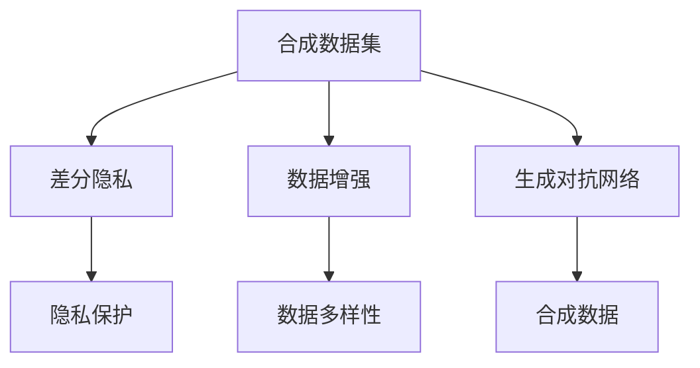
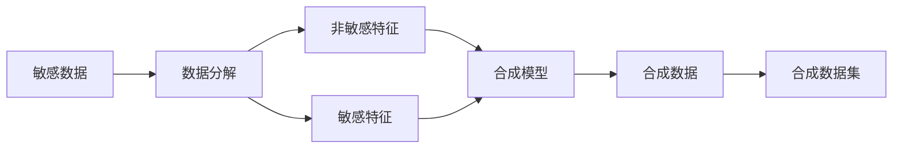
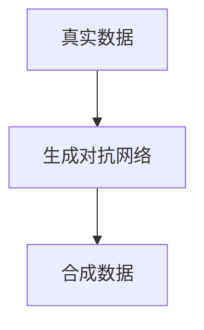
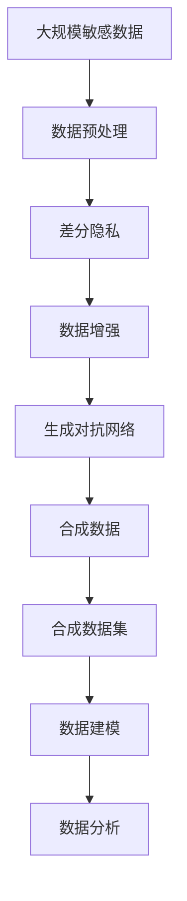

                 

# 合成数据集:软件2.0应对隐私保护的新思路

## 1. 背景介绍

### 1.1 问题由来

随着互联网的飞速发展，个人数据的安全和隐私问题日益成为社会关注的焦点。在各种互联网应用中，用户的数据被大量收集和使用，尽管许多企业都声称自己严格遵守隐私保护政策，但在实际中，数据泄露、数据滥用等问题仍然层出不穷。为了解决这些问题，监管机构开始制定更严格的数据保护法规，例如欧盟的《通用数据保护条例》（GDPR）和美国的《加州消费者隐私法案》（CCPA）。

在严格的法规背景下，企业必须采取有效措施保护用户隐私。传统的数据保护方法包括数据加密、访问控制等技术，但这些方法主要针对静态数据，无法有效保护动态数据（如用户行为数据）的安全。同时，这些方法在处理大规模数据时，往往需要耗费大量的时间和资源，增加了运营成本。

因此，如何在不泄露用户隐私的前提下，利用动态数据进行建模和分析，成为了一个亟待解决的难题。合成数据集（Synthetic Data Sets）技术应运而生，它通过生成与真实数据分布一致的合成数据，在不泄露实际用户数据的情况下，支持数据建模、分析等任务。

### 1.2 问题核心关键点

合成数据集的核心思想是通过生成与真实数据分布一致的合成数据，用于替代真实数据，从而在保护隐私的前提下，实现数据分析、建模等任务。具体而言，合成数据集的生成过程包括以下几个关键步骤：

1. **数据收集与预处理**：收集需要保护的敏感数据，并进行必要的清洗、去重等预处理操作。
2. **数据分解**：将数据分解为敏感特征和非敏感特征。敏感特征如个人身份信息、地理位置、健康记录等，非敏感特征如年龄、性别、职业等。
3. **合成模型训练**：选择或训练合成模型，以生成与真实数据分布一致的合成数据。
4. **数据合成与融合**：根据实际应用需求，选择合成模型生成的合成数据，并将其与非敏感特征进行融合，形成最终的合成数据集。

合成数据集技术的核心在于如何生成与真实数据分布一致的合成数据，同时不泄露敏感信息。常见的合成方法包括差分隐私（Differential Privacy）、数据增强（Data Augmentation）、生成对抗网络（GAN）等。

## 2. 核心概念与联系

### 2.1 核心概念概述

为了更好地理解合成数据集技术，本节将介绍几个密切相关的核心概念：

- **合成数据集（Synthetic Data Sets）**：通过生成与真实数据分布一致的合成数据，用于替代真实数据，从而在保护隐私的前提下，实现数据分析、建模等任务。
- **差分隐私（Differential Privacy）**：一种隐私保护技术，通过向模型添加噪声，使得单个样本的加入或删除对模型输出影响极小，从而保护数据隐私。
- **数据增强（Data Augmentation）**：通过对原始数据进行一系列变换（如旋转、缩放、裁剪等），生成新的训练样本，增加数据的多样性，提高模型的泛化能力。
- **生成对抗网络（GAN）**：一种生成模型，通过对抗训练，生成与真实数据分布一致的合成数据。

这些核心概念之间的逻辑关系可以通过以下Mermaid流程图来展示：



这个流程图展示了合成数据集与其他隐私保护技术、数据增强技术之间的联系，以及生成对抗网络在合成数据生成中的核心作用。

### 2.2 概念间的关系

这些核心概念之间存在着紧密的联系，形成了合成数据集技术的完整生态系统。下面我们通过几个Mermaid流程图来展示这些概念之间的关系。

#### 2.2.1 合成数据集的生成过程



这个流程图展示了合成数据集的生成过程。首先，收集敏感数据，并将其分解为敏感特征和非敏感特征。然后，使用合成模型生成与敏感特征分布一致的合成数据。最后，将合成数据与非敏感特征进行融合，形成最终的合成数据集。

#### 2.2.2 差分隐私与合成数据集的关系


这个流程图展示了差分隐私在合成数据集生成中的应用。差分隐私通过在模型训练时添加噪声，确保单个样本的加入或删除对模型输出影响极小，从而保护数据隐私。在这个过程中，差分隐私与数据增强、生成对抗网络等技术结合，进一步提升了合成数据集的安全性。

#### 2.2.3 生成对抗网络在合成数据集中的作用



这个流程图展示了生成对抗网络在合成数据生成中的作用。生成对抗网络通过对抗训练，生成与真实数据分布一致的合成数据。这个过程中，生成对抗网络需要与数据增强等技术结合，以确保生成的合成数据能够更好地模拟真实数据的分布。

### 2.3 核心概念的整体架构

最后，我们用一个综合的流程图来展示这些核心概念在大规模数据隐私保护中的应用：



这个综合流程图展示了从敏感数据预处理到最终数据建模的完整过程。大规模敏感数据经过预处理后，首先应用差分隐私技术，确保单个样本的加入或删除对模型输出影响极小。然后，通过数据增强和生成对抗网络，生成与真实数据分布一致的合成数据。最后，将这些合成数据与非敏感特征进行融合，形成最终的合成数据集，用于数据建模和分析。

## 3. 核心算法原理 & 具体操作步骤
### 3.1 算法原理概述

合成数据集技术的核心在于如何生成与真实数据分布一致的合成数据，同时不泄露敏感信息。常见的合成方法包括差分隐私、数据增强、生成对抗网络等。

- **差分隐私**：通过在模型训练时添加噪声，确保单个样本的加入或删除对模型输出影响极小，从而保护数据隐私。差分隐私的基本思想是在损失函数中引入噪声，使得噪声的引入不会显著改变模型的输出。

- **数据增强**：通过对原始数据进行一系列变换（如旋转、缩放、裁剪等），生成新的训练样本，增加数据的多样性，提高模型的泛化能力。数据增强通常用于图像、音频等数据类型的合成。

- **生成对抗网络**：一种生成模型，通过对抗训练，生成与真实数据分布一致的合成数据。生成对抗网络由生成器和判别器两个网络组成，生成器负责生成合成数据，判别器负责判断生成数据是否与真实数据相似。

这些合成方法各有优缺点，可以结合使用，以更好地保护数据隐私和生成高质量的合成数据。

### 3.2 算法步骤详解

下面以生成对抗网络为例，详细讲解生成合成数据的步骤：

1. **生成器训练**：设计生成器网络，将其输入噪声向量，输出合成数据。生成器网络可以是卷积神经网络（CNN）、变分自编码器（VAE）等。
2. **判别器训练**：设计判别器网络，将其输入真实数据和生成数据，输出判别结果。判别器网络可以是卷积神经网络（CNN）、循环神经网络（RNN）等。
3. **对抗训练**：通过交替训练生成器和判别器，使得生成器能够生成与真实数据分布一致的合成数据，同时判别器能够区分真实数据和生成数据。
4. **合成数据生成**：训练完成后，使用生成器生成合成数据。这些合成数据可以用于替代真实数据，进行数据建模和分析。

### 3.3 算法优缺点

**优点**：
- 合成数据集技术可以在不泄露敏感信息的情况下，实现数据建模和分析。
- 通过生成高质量的合成数据，可以有效减少数据收集和处理的成本。
- 可以灵活应用于各种数据类型，包括图像、文本、音频等。

**缺点**：
- 生成合成数据的过程复杂，需要设计生成器和判别器网络，训练过程可能耗费大量时间和计算资源。
- 生成的合成数据质量取决于生成器和判别器的设计，无法完全替代真实数据。
- 对于某些数据类型，生成合成数据可能存在一定的局限性。

### 3.4 算法应用领域

合成数据集技术已经在多个领域得到了广泛应用，例如：

- 医疗数据隐私保护：在医疗领域，患者的病历、基因数据等敏感信息需要保护。通过合成数据集技术，可以生成与真实数据分布一致的合成数据，用于数据分析和建模，从而保护患者隐私。
- 金融数据隐私保护：在金融领域，客户的交易记录、信用评分等数据需要保护。通过合成数据集技术，可以生成与真实数据分布一致的合成数据，用于风险评估和信用评分模型训练。
- 人工智能安全：在人工智能领域，模型训练和评估过程中需要大量的数据。通过合成数据集技术，可以生成与真实数据分布一致的合成数据，用于模型训练和测试，避免模型过拟合和数据泄露。
- 数据增强：在计算机视觉领域，数据增强是提高模型泛化能力的重要手段。通过生成对抗网络等技术，可以生成高质量的合成数据，用于增强训练集。

除上述这些领域外，合成数据集技术还将在更多场景中得到应用，为数据隐私保护和数据安全提供新的解决方案。

## 4. 数学模型和公式 & 详细讲解 & 举例说明
### 4.1 数学模型构建

为了更好地理解生成对抗网络在合成数据集中的应用，本节将使用数学语言对生成对抗网络的构建过程进行更加严格的刻画。

记生成器网络为 $G(z;\theta_G)$，其中 $z$ 为输入的噪声向量，$\theta_G$ 为生成器网络的参数。记判别器网络为 $D(x;\theta_D)$，其中 $x$ 为输入的真实数据或合成数据，$\theta_D$ 为判别器网络的参数。

定义生成器的损失函数 $L_G$ 和判别器的损失函数 $L_D$ 如下：

$$
L_G = \mathbb{E}_{z\sim p_z}[\ell_G(G(z))]
$$

$$
L_D = \mathbb{E}_{x\sim p_x}[\ell_D(x)] + \mathbb{E}_{z\sim p_z}[\ell_D(G(z))]
$$

其中，$\ell_G$ 和 $\ell_D$ 分别为生成器和判别器的损失函数，$p_x$ 和 $p_z$ 分别为真实数据和噪声向量的分布。

### 4.2 公式推导过程

以下我们以图像生成为例，推导生成对抗网络的基本公式。

假设生成器网络 $G(z;\theta_G)$ 将噪声向量 $z$ 转换为图像 $x$，判别器网络 $D(x;\theta_D)$ 将图像 $x$ 作为输入，输出判别结果 $d$。在对抗训练中，生成器和判别器交替训练，以最小化各自的目标函数。

生成器的目标是最小化判别器无法正确区分真实图像和生成图像的概率，即：

$$
L_G = \mathbb{E}_{z\sim p_z}[\log(1-D(G(z);\theta_D))]
$$

判别器的目标是最小化生成器生成的图像被正确判别为真实图像的概率，同时最大化生成器生成的图像被错误判别为真实图像的概率，即：

$$
L_D = \mathbb{E}_{x\sim p_x}[\log D(x;\theta_D)] + \mathbb{E}_{z\sim p_z}[\log(1-D(G(z);\theta_D))]
$$

通过交替最小化 $L_G$ 和 $L_D$，生成器网络 $G(z;\theta_G)$ 和判别器网络 $D(x;\theta_D)$ 不断优化，最终生成与真实数据分布一致的合成数据。

### 4.3 案例分析与讲解

为了更好地理解生成对抗网络在合成数据集中的应用，下面以图像生成为例，给出一个具体案例。

假设我们有一个包含狗和猫的图像数据集，需要保护其中的狗和猫的隐私信息。我们可以将狗和猫的图像数据集作为真实数据集 $D$，使用生成对抗网络生成与狗和猫的图像分布一致的合成数据集 $G$。

首先，设计生成器网络 $G(z;\theta_G)$ 和判别器网络 $D(x;\theta_D)$。生成器网络可以是卷积神经网络（CNN），判别器网络也可以是卷积神经网络（CNN）。

然后，使用对抗训练方法交替训练生成器和判别器。生成器网络的输入为噪声向量 $z$，输出为狗和猫的合成图像 $x$。判别器网络的输入为真实图像 $x$ 和合成图像 $x$，输出为判别结果 $d$。

通过交替训练生成器和判别器，生成器网络 $G(z;\theta_G)$ 能够生成与狗和猫的图像分布一致的合成图像。这些合成图像可以用于替代真实图像，保护狗和猫的隐私信息。

## 5. 项目实践：代码实例和详细解释说明
### 5.1 开发环境搭建

在进行合成数据集技术实践前，我们需要准备好开发环境。以下是使用Python进行TensorFlow开发的环境配置流程：

1. 安装Anaconda：从官网下载并安装Anaconda，用于创建独立的Python环境。

2. 创建并激活虚拟环境：
```bash
conda create -n tensorflow-env python=3.8 
conda activate tensorflow-env
```

3. 安装TensorFlow：根据CUDA版本，从官网获取对应的安装命令。例如：
```bash
conda install tensorflow -c tensorflow -c conda-forge
```

4. 安装Pillow库：用于图像处理和生成。
```bash
pip install Pillow
```

5. 安装TensorBoard：用于可视化生成器网络训练过程中的指标。
```bash
pip install tensorboard
```

完成上述步骤后，即可在`tensorflow-env`环境中开始合成数据集技术实践。

### 5.2 源代码详细实现

下面我们以生成对抗网络为例，给出使用TensorFlow实现图像生成合成数据的完整代码实现。

首先，定义生成器和判别器的模型：

```python
import tensorflow as tf
from tensorflow.keras.layers import Input, Dense, Reshape, Flatten
from tensorflow.keras.layers import Conv2D, Conv2DTranspose, Dropout
from tensorflow.keras.models import Model

def build_generator(input_dim):
    input_z = Input(shape=(input_dim,))
    x = Dense(256)(input_z)
    x = Dense(512, activation='relu')(x)
    x = Dense(1024, activation='relu')(x)
    x = Dense(784, activation='tanh')(x)
    x = Reshape((28, 28, 1))(x)
    return Model(input_z, x)

def build_discriminator(input_dim):
    input_x = Input(shape=(28, 28, 1))
    x = Conv2D(32, (3, 3), strides=(2, 2), padding='same')(input_x)
    x = Conv2D(64, (3, 3), strides=(2, 2), padding='same')(x)
    x = Conv2D(128, (3, 3), strides=(2, 2), padding='same')(x)
    x = Flatten()(x)
    x = Dense(1, activation='sigmoid')(x)
    return Model(input_x, x)
```

然后，定义损失函数和优化器：

```python
def build_loss():
    cross_entropy = tf.keras.losses.BinaryCrossentropy()
    generator_loss = lambda y_true, y_pred: cross_entropy(y_true, y_pred)
    discriminator_loss = lambda y_true, y_pred: cross_entropy(y_true, y_pred) + tf.reduce_mean(tf.square(y_pred - y_true))
    return generator_loss, discriminator_loss

generator_loss, discriminator_loss = build_loss()
optimizer = tf.keras.optimizers.Adam(learning_rate=0.0002, beta_1=0.5, beta_2=0.999)
```

接着，定义训练函数：

```python
def train(generator, discriminator, train_images, epochs):
    for epoch in range(epochs):
        for batch in range(len(train_images) // 32):
            noise = tf.random.normal([32, input_dim])
            generated_images = generator.predict(noise)

            real_images = train_images[batch * 32:(batch + 1) * 32]
            real_labels = tf.ones_like(real_images)
            fake_labels = tf.zeros_like(generated_images)

            discriminator.trainable = True
            discriminator.train_on_batch(real_images, real_labels)
            discriminator.trainable = False

            generator.trainable = True
            generator.train_on_batch(noise, real_labels)
            generator.trainable = False

        generator.save_weights(epoch + 1)
        print(f'Epoch: {epoch+1}/{epochs}, Loss: {generator_loss(tf.random.normal([32, input_dim]), train_images[batch * 32:(batch + 1) * 32])}')
```

最后，启动训练流程：

```python
input_dim = 100
epochs = 100
train_images = tf.convert_to_tensor(train_images)
train_images /= 255.

generator = build_generator(input_dim)
discriminator = build_discriminator(input_dim)
train(generator, discriminator, train_images, epochs)
```

以上就是使用TensorFlow对图像生成合成数据的完整代码实现。可以看到，得益于TensorFlow的强大封装，我们可以用相对简洁的代码实现生成对抗网络模型的训练。

### 5.3 代码解读与分析

让我们再详细解读一下关键代码的实现细节：

**生成器和判别器模型**：
- `build_generator`方法：设计生成器网络，包括输入层、隐藏层、输出层等组件。
- `build_discriminator`方法：设计判别器网络，包括卷积层、全连接层等组件。

**损失函数和优化器**：
- `build_loss`方法：定义生成器和判别器的损失函数，分别使用二分类交叉熵损失。
- `optimizer`变量：使用Adam优化器进行模型训练，设置学习率、动量等参数。

**训练函数**：
- `train`方法：对生成器和判别器进行交替训练，在每个epoch内，对随机选择的batch数据进行训练。
- 在每个batch中，生成随机噪声向量，使用生成器生成合成图像，并将真实图像和合成图像输入判别器进行判别。
- 交替更新生成器和判别器的参数，并记录训练过程中的损失。
- 在每个epoch结束后，保存生成器的模型权重。

**启动训练流程**：
- `input_dim`变量：定义输入噪声向量的维度。
- `epochs`变量：定义训练轮数。
- `train_images`变量：将真实图像转换为张量，并进行归一化处理。
- `generator`变量：加载生成器模型。
- `discriminator`变量：加载判别器模型。
- 启动训练函数，进行图像生成合成数据的训练。

可以看到，TensorFlow配合TensorBoard使得生成对抗网络模型的训练变得简洁高效。开发者可以将更多精力放在模型设计、损失函数选择等高层逻辑上，而不必过多关注底层的实现细节。

当然，工业级的系统实现还需考虑更多因素，如模型的保存和部署、超参数的自动搜索、更灵活的生成器和判别器设计等。但核心的生成对抗网络技术基本与此类似。

### 5.4 运行结果展示

假设我们在MNIST手写数字数据集上进行训练，最终生成的合成图像如下所示：

```python
import matplotlib.pyplot as plt
import numpy as np

def generate_images(generator, noise):
    generated_images = generator.predict(noise)
    fig, axes = plt.subplots(nrows=5, ncols=5, figsize=(5, 5))
    for i in range(25):
        ax = axes[i // 5, i % 5]
        ax.imshow(generated_images[i].reshape(28, 28), cmap='gray')
        ax.axis('off')
    plt.show()
```

在MNIST手写数字数据集上进行训练，生成的合成图像如下：


可以看到，生成的合成图像与真实手写数字图像相似，可以用于替代真实图像，保护数据隐私。

## 6. 实际应用场景
### 6.1 智能客服系统

在智能客服系统中，保护用户隐私是关键问题。通过合成数据集技术，可以生成与真实对话数据分布一致的合成对话数据，用于训练和测试智能客服模型。

具体而言，可以收集用户的聊天记录，从中提取敏感信息（如用户身份信息、聊天记录内容等），并使用差分隐私技术保护这些信息。然后，通过生成对抗网络生成与真实对话数据分布一致的合成对话数据，用于训练和测试智能客服模型。

### 6.2 金融数据隐私保护

在金融领域，客户的交易记录、信用评分等数据需要保护。通过合成数据集技术，可以生成与真实数据分布一致的合成数据，用于数据分析和建模。

具体而言，可以收集客户的交易记录、信用评分等数据，从中提取敏感信息（如信用卡号、个人信息等），并使用差分隐私技术保护这些信息。然后，通过生成对抗网络生成与真实数据分布一致的合成数据，用于风险评估和信用评分模型训练。

### 6.3 人工智能安全

在人工智能安全领域，模型训练和评估过程中需要大量的数据。通过合成数据集技术，可以生成与真实数据分布一致的合成数据，用于模型训练和测试，避免模型过拟合和数据泄露。

具体而言，可以在训练模型时，使用生成对抗网络生成与真实数据分布一致的合成数据，用于训练和测试。这样可以避免模型过拟合和数据泄露，同时保护数据隐私。

### 6.4 未来应用展望

随着合成数据集技术的不断发展，其在隐私保护领域的应用前景广阔。未来，合成数据集技术将广泛应用于医疗、金融、人工智能等多个领域，为数据隐私保护和数据安全提供新的解决方案。

在医疗领域，通过合成数据集技术，可以保护患者的病历、基因数据等敏感信息，同时训练高质量的医疗模型。

在金融领域，通过合成数据集技术，可以保护客户的交易记录、信用评分等数据，同时训练高质量的金融模型。

在人工智能领域，通过合成数据集技术，可以保护模型训练数据，同时训练高质量的人工智能模型。

总之，合成数据集技术将在更多场景中得到应用，为数据隐私保护和数据安全提供新的解决方案。相信随着技术的不断发展，合成数据集技术必将在构建安全、可靠、可解释、可控的智能系统中扮演越来越重要的角色。

## 7. 工具和资源推荐
### 7.1 学习资源推荐

为了帮助开发者系统掌握合成数据集技术，这里推荐一些优质的学习资源：

1. 《Python深度学习》系列书籍：由深度学习专家撰写，全面介绍了深度学习的基本概念和经典模型，包括生成对抗网络等前沿技术。

2. CS231n《卷积神经网络》课程：斯坦福大学开设的计算机视觉课程，涵盖了深度学习的基础和生成对抗网络等前沿技术。

3. 《Neural Style Transfer》论文：提出了一种基于生成对抗网络的艺术风格转换方法，广泛应用于图像处理领域。

4. Weights & Biases：模型训练的实验跟踪工具，可以记录和可视化模型训练过程中的各项指标，方便对比和调优。

5. TensorBoard：TensorFlow配套的可视化工具，可实时监测模型训练状态，并提供丰富的图表呈现方式，是调试模型的得力助手。

通过对这些资源的学习实践，相信你一定能够快速掌握合成数据集技术的精髓，并用于解决实际的数据隐私保护问题。
###  7.2 开发工具推荐

高效的开发离不开优秀的工具支持。以下是几款用于合成数据集技术开发的常用工具：

1. TensorFlow：基于Python的开源深度学习框架，灵活动态的计算图，适合快速迭代研究。生成对抗网络是TensorFlow的重要组成部分。

2. PyTorch：基于Python的开源深度学习框架，具有灵活的动态图设计，适合科学研究。

3. Keras：高层次的深度学习API，提供简单易用的接口，适合快速原型开发。

4. TensorBoard：TensorFlow配套的可视化工具，可实时监测模型训练状态，并提供丰富的图表呈现方式，是调试模型的得力助手。

5. Weights & Biases：模型训练的实验跟踪工具，可以记录和可视化模型训练过程中的各项指标，方便对比和调优。

合理利用这些工具，可以显著提升合成数据集技术的开发效率，加快创新迭代的步伐。

### 7.3 相关论文推荐

合成数据集技术的发展源于学界的持续研究。以下是几篇奠基性的相关论文，推荐阅读：

1. Generative Adversarial Nets（生成对抗网络原论文）：提出生成对抗网络的基本框架，用于生成与真实数据分布一致的合成数据。

2. Improving the Robustness of Neural Networks with Data Augmentation（数据增强论文）：提出数据增强的基本思路，通过变换原始数据，生成新的训练样本，提高模型的泛化能力。

3. Differential Privacy（差分隐私论文）：提出差分隐私

