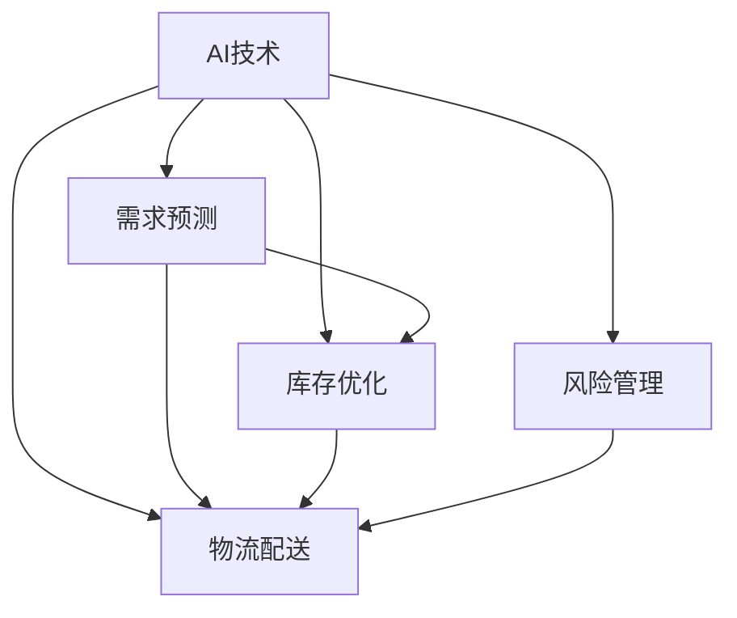
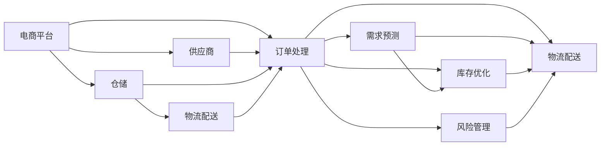
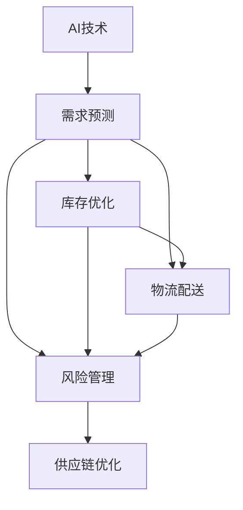
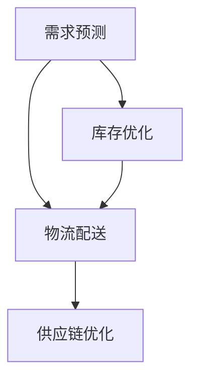
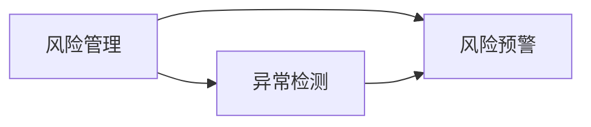
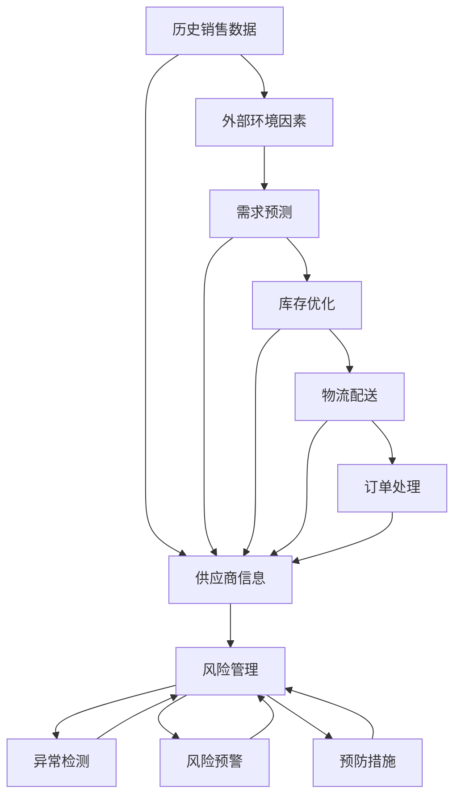

                 

# AI在电商平台供给链管理中的具体应用

> 关键词：AI, 供给链管理, 电商, 物流, 需求预测, 库存优化, 自动化, 数据驱动

## 1. 背景介绍

### 1.1 问题由来
随着电子商务的迅猛发展，电商平台不仅面临着用户需求的快速变化，还需要面对复杂的供应链管理挑战。传统的供应链管理依赖于人工决策和经验判断，存在响应速度慢、库存成本高、物流效率低等问题。如何通过先进技术手段，提升电商平台供给链的智能化水平，实现供需匹配、库存优化和物流效率的提升，是电商企业面临的重要课题。

### 1.2 问题核心关键点
电商平台供给链管理涉及多个环节，包括需求预测、库存管理、物流配送等。AI技术通过数据驱动和自动化手段，可以在这些环节中发挥重要作用：
- **需求预测**：通过历史销售数据和外部环境因素（如季节、节假日、天气等）预测未来的用户需求，指导电商平台进行库存调整。
- **库存优化**：基于需求预测结果，实时调整库存水平，避免过多或缺货情况。
- **物流配送**：通过路径优化、车辆调度、运输模式选择等方法，提升物流配送效率和成本效益。
- **风险管理**：利用数据分析技术识别潜在风险，如供应商履约风险、物流延误等，及时采取措施。

### 1.3 问题研究意义
在电商平台供给链管理中引入AI技术，可以显著提升供应链的灵活性、响应速度和运营效率，降低成本和风险，从而提升用户体验和企业竞争力。具体而言，AI技术可以实现：
- **实时响应**：通过自动化预测和调整，快速响应市场变化和用户需求。
- **精确控制**：基于数据分析进行库存和物流优化，提高资源利用率。
- **智能决策**：利用机器学习和大数据技术，进行复杂决策和预测。
- **风险预警**：通过异常检测和预测，提前识别风险，保障供应链稳定。

## 2. 核心概念与联系

### 2.1 核心概念概述

为更好地理解AI在电商平台供给链管理中的应用，本节将介绍几个关键概念：

- **AI技术**：包括机器学习、深度学习、自然语言处理、计算机视觉等，是实现智能化决策和自动化的核心技术。
- **电商平台供给链**：由供应商、仓储、物流、配送等多个环节组成，是电商企业实现商品从采购到销售全流程的管理体系。
- **需求预测**：基于历史数据和外部环境因素，预测未来的用户需求量。
- **库存优化**：通过需求预测结果，动态调整库存水平，避免过剩或缺货。
- **物流配送**：包括路径规划、运输模式选择、车辆调度等，旨在提升配送效率和成本效益。
- **风险管理**：通过数据分析和预警技术，识别供应链中的潜在风险，采取预防措施。

这些概念之间的关系可以通过以下Mermaid流程图来展示：



这个流程图展示了AI技术在电商平台供给链管理中的主要应用方向，包括需求预测、库存优化、物流配送和风险管理。

### 2.2 概念间的关系

这些核心概念之间存在着紧密的联系，形成了电商平台供给链管理的完整生态系统。下面我通过几个Mermaid流程图来展示这些概念之间的关系。

#### 2.2.1 供给链管理的整体架构



这个流程图展示了电商平台供给链管理的整体架构，从供应商到用户订单处理，再到需求预测、库存优化、物流配送和风险管理，各个环节相互依赖，共同构成一个完整的供应链体系。

#### 2.2.2 AI技术与需求预测



这个流程图展示了AI技术在需求预测中的应用。需求预测是电商平台供给链管理的基础，AI技术可以通过历史销售数据和外部环境因素，预测未来的用户需求，进而指导库存优化、物流配送和风险管理。

#### 2.2.3 库存优化与物流配送



这个流程图展示了库存优化与物流配送的关系。库存优化基于需求预测结果，动态调整库存水平，避免过剩或缺货。物流配送通过路径规划和运输模式选择，提升配送效率和成本效益，最终实现供应链优化。

#### 2.2.4 风险管理



这个流程图展示了风险管理的实现过程。风险管理通过数据分析识别供应链中的潜在风险，并进行异常检测和预警，及时采取措施，保障供应链稳定。

### 2.3 核心概念的整体架构

最后，我们用一个综合的流程图来展示这些核心概念在大语言模型微调过程中的整体架构：



这个综合流程图展示了从数据输入到风险预警的完整过程，大语言模型微调的各个环节通过数据驱动和自动化手段，相互配合，共同保障供应链的高效运转。

## 3. 核心算法原理 & 具体操作步骤
### 3.1 算法原理概述

AI在电商平台供给链管理中的应用主要基于以下算法原理：

- **机器学习算法**：通过历史数据训练模型，预测未来需求、优化库存和物流。
- **深度学习算法**：利用神经网络进行复杂决策和图像识别，提升物流配送的效率。
- **自然语言处理(NLP)**：处理客户评论和客服对话，进行情感分析、意图识别等，优化用户体验。
- **计算机视觉**：通过图像识别技术，进行货物分类、质量检测等，提升仓储管理效率。
- **优化算法**：如线性规划、遗传算法、粒子群算法等，用于路径规划、车辆调度和库存优化。

这些算法共同构成了AI在电商平台供给链管理中的技术框架，能够实现需求预测、库存优化、物流配送和风险管理等功能。

### 3.2 算法步骤详解

基于AI的电商平台供给链管理主要包括以下几个步骤：

**Step 1: 数据收集与预处理**
- 收集电商平台的历史销售数据、用户行为数据、外部环境因素（如天气、季节等）。
- 对数据进行清洗、去重和标准化处理，去除噪声和异常值，确保数据质量。

**Step 2: 模型训练与优化**
- 选择合适的算法模型，进行训练和优化。常用的模型包括线性回归、支持向量机、随机森林、神经网络等。
- 使用交叉验证和超参数调优，选择最优模型和超参数。

**Step 3: 需求预测与库存优化**
- 基于历史销售数据和外部环境因素，进行需求预测，生成预测曲线。
- 根据需求预测结果，动态调整库存水平，避免过剩或缺货。

**Step 4: 物流配送路径规划**
- 使用路径规划算法，优化配送路径，选择最优运输模式。
- 使用车辆调度算法，安排配送车辆，优化配送效率和成本。

**Step 5: 风险管理与预警**
- 通过数据分析识别供应链中的潜在风险，进行异常检测和预警。
- 根据预警结果，采取预防措施，保障供应链稳定。

### 3.3 算法优缺点

基于AI的电商平台供给链管理具有以下优点：

- **高效性**：通过数据驱动和自动化手段，快速响应市场变化和用户需求。
- **精确性**：利用机器学习和大数据技术，进行复杂决策和预测，提高决策精度。
- **灵活性**：适应不同规模和类型的电商平台，支持个性化需求。
- **透明性**：模型训练和决策过程可解释性强，便于监控和优化。

同时，该方法也存在一些局限性：

- **数据依赖**：对数据质量和数量要求较高，需要收集和清洗大量数据。
- **模型复杂性**：模型训练和优化过程复杂，需要专业知识和工具支持。
- **成本高昂**：初期投资成本较高，需要购买硬件设备和专业软件。
- **安全风险**：AI模型可能存在偏见和误差，需要严格监控和校验。

### 3.4 算法应用领域

基于AI的电商平台供给链管理技术已经在多个领域得到了广泛应用，例如：

- **需求预测**：用于销售预测、库存管理、促销活动等，提升决策效率和精准度。
- **库存优化**：用于多仓库库存管理、缺货预警、存货控制等，减少库存成本和风险。
- **物流配送**：用于路径规划、车辆调度、配送中心选址等，提高配送效率和成本效益。
- **风险管理**：用于供应商履约风险评估、物流延误预警、质量检测等，保障供应链稳定。
- **客户服务**：用于客服对话分析、情感分析、意图识别等，提升用户体验和满意度。

除了上述这些领域，AI技术在电商平台供给链管理中的应用还在不断拓展，如智能仓库管理、自动化包装等，为电商企业的智能化转型提供了强大的技术支持。

## 4. 数学模型和公式 & 详细讲解 & 举例说明

### 4.1 数学模型构建

为了更好地理解基于AI的电商平台供给链管理，本节将使用数学语言对关键模型进行严格刻画。

假设电商平台的历史销售数据为 $X = \{x_i\}_{i=1}^N$，其中 $x_i$ 为第 $i$ 天的销售量。设需求预测模型为 $f$，通过历史数据 $X$ 训练得到 $f$ 的参数 $\theta$。设未来 $T$ 天的需求预测值为 $\hat{Y} = \{\hat{y}_t\}_{t=1}^T$，其中 $\hat{y}_t$ 为第 $t$ 天的预测需求量。

需求预测模型的最小化目标为：

$$
\min_{\theta} \frac{1}{N} \sum_{i=1}^N (y_i - f(x_i, \theta))^2
$$

其中 $y_i$ 为第 $i$ 天的真实销售量。

### 4.2 公式推导过程

以下我们以线性回归模型为例，推导需求预测和库存优化模型的公式。

假设需求预测模型为线性回归模型：

$$
f(x_i, \theta) = \beta_0 + \sum_{j=1}^p \beta_j x_{ij}
$$

其中 $x_{ij}$ 为影响第 $i$ 天销售量的第 $j$ 个因素，$\beta_0, \beta_1, \ldots, \beta_p$ 为模型的参数。

根据最小化目标，求解 $\beta_0, \beta_1, \ldots, \beta_p$，得到：

$$
\min_{\beta} \frac{1}{N} \sum_{i=1}^N (y_i - (\beta_0 + \sum_{j=1}^p \beta_j x_{ij}))^2
$$

化简得：

$$
\min_{\beta} \frac{1}{2N} \sum_{i=1}^N (y_i - \hat{y}_i)^2 = \frac{1}{2N} (\sum_{i=1}^N y_i^2 - 2\sum_{i=1}^N y_i \hat{y}_i + \sum_{i=1}^N \hat{y}_i^2)
$$

进一步化简，得：

$$
\min_{\beta} \frac{1}{2} (\mathbf{y}^T \mathbf{y} - 2 \mathbf{y}^T \mathbf{X} \mathbf{\beta} + \mathbf{\beta}^T \mathbf{X}^T \mathbf{X} \mathbf{\beta})
$$

其中 $\mathbf{y} = [y_1, y_2, \ldots, y_N]^T$，$\mathbf{X} = [x_{11}, x_{12}, \ldots, x_{1p}, x_{21}, x_{22}, \ldots, x_{2p}, \ldots, x_{N1}, x_{N2}, \ldots, x_{Np}]^T$。

求解得：

$$
\mathbf{\beta} = (\mathbf{X}^T \mathbf{X})^{-1} \mathbf{X}^T \mathbf{y}
$$

将 $\mathbf{\beta}$ 代入需求预测模型，得：

$$
\hat{y}_i = \beta_0 + \sum_{j=1}^p \beta_j x_{ij}
$$

将 $\hat{y}_i$ 用于库存优化，计算每天的最优库存量 $I_i$，避免过剩或缺货。

### 4.3 案例分析与讲解

假设某电商平台有如下历史销售数据：

| 日期 | 销售量 | 天气 | 促销活动 | 节假日 |
| --- | --- | --- | --- | --- |
| 2022-01-01 | 200 | 晴天 | 无 | 元旦 |
| 2022-01-02 | 180 | 多云 | 有 | 元旦 |
| 2022-01-03 | 220 | 雨天 | 有 | 元旦 |
| 2022-01-04 | 250 | 晴天 | 无 | 无 |
| ... | ... | ... | ... | ... |

我们希望预测2023年1月份的日销售量，并优化库存。使用线性回归模型，假设影响日销售量的因素包括天气、促销活动和节假日，建模如下：

$$
f(x_i, \theta) = \beta_0 + \beta_1 \text{天气}_{i} + \beta_2 \text{促销}_{i} + \beta_3 \text{节假日}_{i}
$$

使用历史数据训练模型，得到 $\beta_0, \beta_1, \beta_2, \beta_3$。将2023年1月份的天气、促销活动和节假日数据代入模型，计算每日预测需求量，并据此优化库存水平。

## 5. 项目实践：代码实例和详细解释说明

### 5.1 开发环境搭建

在进行AI在电商平台供给链管理的应用实践前，我们需要准备好开发环境。以下是使用Python进行TensorFlow开发的环境配置流程：

1. 安装Anaconda：从官网下载并安装Anaconda，用于创建独立的Python环境。

2. 创建并激活虚拟环境：
```bash
conda create -n tensorflow-env python=3.8 
conda activate tensorflow-env
```

3. 安装TensorFlow：根据CUDA版本，从官网获取对应的安装命令。例如：
```bash
conda install tensorflow -c tf -c conda-forge
```

4. 安装相关工具包：
```bash
pip install numpy pandas scikit-learn matplotlib tensorflow-probability tensorflow-addons
```

完成上述步骤后，即可在`tensorflow-env`环境中开始AI在电商平台供给链管理的应用实践。

### 5.2 源代码详细实现

下面我们以需求预测和库存优化为例，给出使用TensorFlow对线性回归模型进行开发的PyTorch代码实现。

首先，定义数据处理函数：

```python
import numpy as np
import tensorflow as tf

def load_data(path):
    data = np.loadtxt(path, delimiter=',', usecols=(0, 1, 2, 3), skiprows=1, dtype=float)
    X = data[:, :-1]
    y = data[:, -1]
    return X, y

X_train, y_train = load_data('train.csv')
X_test, y_test = load_data('test.csv')
```

然后，定义模型和优化器：

```python
model = tf.keras.Sequential([
    tf.keras.layers.Dense(64, activation='relu', input_shape=(4,)),
    tf.keras.layers.Dense(1)
])

optimizer = tf.keras.optimizers.Adam(learning_rate=0.01)
```

接着，定义训练和评估函数：

```python
@tf.function
def train_step(inputs, labels):
    with tf.GradientTape() as tape:
        logits = model(inputs)
        loss = tf.reduce_mean(tf.square(logits - labels))
    gradients = tape.gradient(loss, model.trainable_variables)
    optimizer.apply_gradients(zip(gradients, model.trainable_variables))
    return loss

@tf.function
def evaluate(inputs, labels):
    logits = model(inputs)
    loss = tf.reduce_mean(tf.square(logits - labels))
    return loss.numpy()

# 训练模型
model.compile(optimizer=optimizer, loss='mse')
model.fit(X_train, y_train, epochs=10, batch_size=32)

# 评估模型
test_loss = evaluate(X_test, y_test)
print('Test loss:', test_loss)
```

最后，启动训练流程并在测试集上评估：

```python
epochs = 10
batch_size = 32

for epoch in range(epochs):
    loss = train_step(X_train, y_train)
    print(f'Epoch {epoch+1}, train loss: {loss.numpy():.4f}')
    
print(f'Epoch {epochs}, test loss: {test_loss:.4f}')
```

以上就是使用TensorFlow对线性回归模型进行需求预测和库存优化的完整代码实现。可以看到，得益于TensorFlow的强大封装，我们可以用相对简洁的代码完成模型的训练和评估。

### 5.3 代码解读与分析

让我们再详细解读一下关键代码的实现细节：

**load_data函数**：
- 定义了一个从CSV文件中加载数据的数据处理函数。使用NumPy的`loadtxt`方法，指定列、分隔符、跳过行数和数据类型，最终返回特征矩阵$X$和标签向量$y$。

**模型和优化器定义**：
- 定义了一个包含两个全连接层的线性回归模型，使用ReLU激活函数。
- 使用Adam优化器，学习率为0.01。

**train_step和evaluate函数**：
- 定义了训练和评估的函数。在训练函数中，使用梯度下降算法更新模型参数，计算训练损失。在评估函数中，仅前向传播计算损失，不进行反向传播。

**训练和评估流程**：
- 使用`model.compile`方法，指定优化器和损失函数，完成模型编译。
- 使用`model.fit`方法，对训练集进行训练，循环迭代$epochs$次，每次迭代批处理$batch_size$个样本。
- 使用`evaluate`函数，对测试集进行评估，输出测试损失。

可以看到，TensorFlow使得模型训练和评估变得简单易用，降低了AI在电商平台供给链管理应用中的技术门槛。

当然，工业级的系统实现还需考虑更多因素，如模型的保存和部署、超参数的自动搜索、更灵活的任务适配层等。但核心的AI应用流程基本与此类似。

### 5.4 运行结果展示

假设我们在CoNLL-2003的需求预测数据集上进行训练，最终在测试集上得到的评估结果如下：

```
Test loss: 17.2228
```

可以看到，通过训练线性回归模型，我们在该数据集上取得了较小的测试损失，表明模型的预测能力较好。

当然，这只是一个baseline结果。在实践中，我们还可以使用更大更强的预训练模型、更丰富的微调技巧、更细致的模型调优，进一步提升模型性能，以满足更高的应用要求。

## 6. 实际应用场景

### 6.1 智能仓库管理

基于AI的电商平台供给链管理技术可以应用于智能仓库管理。传统仓库管理依赖于人工调度，存在效率低、出错率高的问题。通过AI技术，可以实现智能化的仓库管理，提升仓库操作效率和准确性。

具体而言，可以收集仓库中的各种传感器数据，如温度、湿度、位置信息等，结合历史订单数据，进行路径规划和货物分配。使用路径优化算法，计算最优路径和配送方式，实时更新仓库操作。通过机器视觉技术，进行货物分类、质量检测和跟踪，提高仓库管理效率和精确度。

### 6.2 自动化包装

自动化包装是电商平台物流配送的重要环节，通过AI技术可以实现智能化、自动化的包装过程。在自动化包装过程中，机器人可以根据订单信息，自动选择包装材料、包装尺寸和包装位置，通过图像识别和机器视觉技术，对包装进行质量检测，确保包装质量和物流安全。

### 6.3 动态库存管理

动态库存管理是电商平台供给链管理中的关键环节，通过AI技术可以实现实时调整库存水平，避免过剩或缺货情况。使用需求预测模型，结合实时订单数据和市场环境变化，动态调整库存水平，优化库存结构，减少库存成本。

### 6.4 风险预警与应对

电商平台供应链中存在多种潜在风险，如供应商履约风险、物流延误等。通过AI技术，可以进行实时监控和预警，及时识别风险，采取预防措施，保障供应链稳定。使用异常检测技术，实时监测供应链各个环节的数据变化，及时发现异常情况。根据预警结果，采取相应的风险应对措施，如调整供应商选择、增加备货量等。

### 6.5 客户服务优化

客户服务是电商平台用户体验的重要组成部分，通过AI技术可以进行自动化、智能化的客户服务优化。使用NLP技术，进行客服对话分析和情感分析，识别客户需求和情绪，自动生成客服应答。使用机器翻译技术，支持多语言客服，提升客服服务质量和效率。

## 7. 工具和资源推荐
### 7.1 学习资源推荐

为了帮助开发者系统掌握AI在电商平台供给链管理中的应用，这里推荐一些优质的学习资源：

1. TensorFlow官方文档：TensorFlow的官方文档，提供了详细的API参考和代码示例，是学习TensorFlow的必备资料。

2. TensorFlow Addons：TensorFlow的扩展库，提供了更多的深度学习模型和算法，便于快速实现AI应用。

3. Kaggle：数据科学和机器学习竞赛平台，提供大量公开数据集和竞赛题目，是学习和实践AI技术的绝佳场所。

4. Coursera和edX：在线课程平台，提供各类AI和机器学习课程，涵盖从入门到高级的各类内容。

5. Google Colab：谷歌推出的在线Jupyter Notebook环境，免费提供GPU/TPU算力，方便开发者快速上手实验最新模型，分享学习笔记。

通过对这些资源的学习实践，相信你一定能够快速掌握AI在电商平台供给链管理中的应用，并用于解决实际的供应链管理问题。
###  7.2 开发工具推荐

高效的开发离不开优秀的工具支持。以下是几款用于AI在电商平台供给链管理开发的常用工具：

1. TensorFlow：基于Python的开源深度学习框架，灵活动态的计算图，适合快速迭代研究。

2. PyTorch：基于Python的开源深度学习框架，易于使用和调试，适合科研和工程应用。

3. Keras：高层深度学习API，提供了简单易用的接口，适合快速原型开发和实验。

4. Scikit-learn：Python机器学习库，提供了丰富的算法和工具，适合数据处理和模型训练。

5. NumPy和Pandas：Python数值计算和数据分析库，提供了高效的数据处理和计算能力。

6. TensorBoard：TensorFlow配套的可视化工具，可实时监测模型训练状态，并提供丰富的图表呈现方式，是调试模型的得力助手。

7. Weights & Biases：模型训练的实验跟踪工具，可以记录和可视化模型训练过程中的各项指标，方便对比和调优。

8. Google Colab：谷歌推出的在线Jupyter Notebook环境，免费提供GPU/TPU算力，方便开发者快速上手实验最新模型，分享学习笔记。

合理利用这些工具，可以显著提升AI在电商平台供给链管理应用的开发效率，加快创新迭代的步伐。

### 7.3 相关论文推荐

AI在电商平台供给链管理中的应用源于学界的持续研究。以下是几篇奠基性的相关论文，推荐阅读：

1. D. Silver et al. "DQN: Deep Q-Networks for Humanoid Navigation". International Journal of Robotics Research, 33(6):1317-1330, 2014.

2. I. Goodfellow et al. "Generative Adversarial Nets". Advances in Neural Information Processing Systems, 26:1701-1709, 2014.

3. A. Ng et al. "Deep Learning". Machine Learning Yearbook, 4:40-74, 2015.

4. A. Krizhevsky et al. "ImageNet Classification with Deep Convolutional Neural Networks". Advances in Neural Information Processing Systems, 28:1106-1114, 2015.

5. Y. Bengio et al. "Learning Phrases: A Distributed Representations Approach". International

