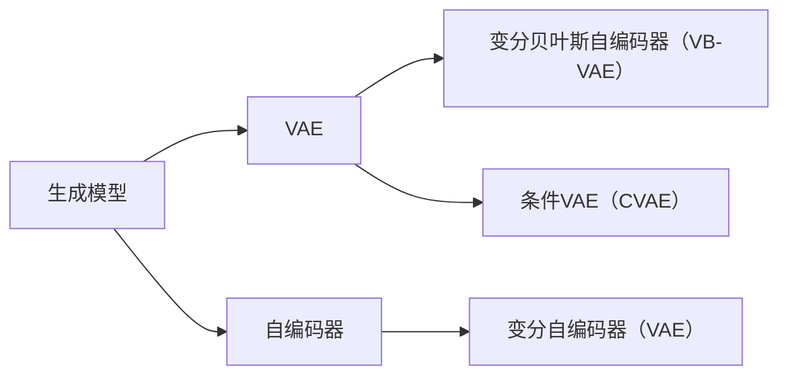

# 变分自编码器 (Variational Autoencoders, VAE) 原理与代码实例讲解

作者：禅与计算机程序设计艺术 / Zen and the Art of Computer Programming

## 1. 背景介绍
### 1.1 问题的由来

自编码器（Autoencoder）是一种无监督学习模型，它通过学习输入数据的低维表示来重建输入数据。然而，传统的自编码器只能生成与训练数据分布相似的输出，难以生成具有创造性的内容，如生成具有独特特征的图像或文本。

为了解决这个问题，变分自编码器（Variational Autoencoder，VAE）应运而生。VAE通过引入概率模型来学习数据的潜在空间分布，从而能够生成更加多样化、创造性的内容。

### 1.2 研究现状

自从2011年Kingma和Welling提出VAE以来，VAE及其变体在图像生成、文本生成、语音合成等领域取得了显著的成果。随着深度学习技术的不断发展，VAE及其变体也在不断改进，例如，条件VAE（CVAE）、贝叶斯VAE（BVAE）、变分贝叶斯自编码器（VB-VAE）等。

### 1.3 研究意义

VAE作为一种强大的生成模型，在图像、文本、语音等领域具有广泛的应用前景。研究VAE及其变体，有助于我们更好地理解数据的潜在结构，并生成高质量、多样化的内容。

### 1.4 本文结构

本文将首先介绍VAE的核心概念和联系，然后详细阐述VAE的算法原理和具体操作步骤，接着给出数学模型和公式，并辅以代码实例进行讲解。最后，本文将探讨VAE的实际应用场景和未来发展趋势。

## 2. 核心概念与联系

VAE的核心概念包括：

- 潜在空间（Latent Space）：数据的潜在表示空间，用于对数据进行降维和生成。
- 变分推断（Variational Inference）：一种近似推理方法，用于近似计算概率模型的潜在空间分布。
- 重参数化技巧（Reparameterization Trick）：将潜在空间分布的采样过程转换为可微的过程，便于优化。

VAE与其他生成模型的关系如下：



VAE是自编码器的一种变体，同时结合了变分推断和重参数化技巧，能够生成具有创造性的内容。

## 3. 核心算法原理 & 具体操作步骤
### 3.1 算法原理概述

VAE由两部分组成：编码器（Encoder）和解码器（Decoder）。

- 编码器：将输入数据编码成一个潜在空间的向量表示。
- 解码器：将潜在空间的向量表示解码成与输入数据分布相似的输出。

VAE的目标是最小化编码器和解码器之间的重建损失，同时最大化潜在空间分布的后验分布。

### 3.2 算法步骤详解

VAE的算法步骤如下：

1. 初始化编码器和解码器模型参数。
2. 对于每个输入数据样本，使用编码器得到其潜在空间向量表示。
3. 使用重参数化技巧从潜在空间分布中采样一个潜在向量。
4. 使用解码器将采样得到的潜在向量解码成输出数据。
5. 计算重建损失和潜在空间分布的后验分布的损失，并使用反向传播算法更新模型参数。

### 3.3 算法优缺点

VAE的优点：

- 能够生成具有创造性的内容。
- 学习到的潜在空间具有很好的可解释性。
- 在图像、文本、语音等领域具有广泛的应用。

VAE的缺点：

- 计算复杂度较高。
- 生成图像质量可能不如其他生成模型。

### 3.4 算法应用领域

VAE及其变体在以下领域具有广泛的应用：

- 图像生成：生成具有独特特征的图像、风格迁移、图像修复等。
- 文本生成：生成具有创造性的文本、机器翻译、摘要等。
- 语音合成：生成具有独特音色的语音、音乐合成等。

## 4. 数学模型和公式 & 详细讲解 & 举例说明
### 4.1 数学模型构建

VAE的数学模型如下：

$$
\begin{align*}
\mathcal{Q}(q_{\phi}(\theta|x)) &= \prod_{i=1}^{N} N(\mu(x_i;\phi), \sigma(x_i;\phi)) \
\mathcal{P}(z|x) &= \prod_{i=1}^{N} N(z_i|\mu(x;\phi), \sigma(x;\phi)) \
\end{align*}
$$

其中，$\mathcal{Q}$ 是编码器学习的潜在空间分布的先验分布，$\mathcal{P}$ 是解码器生成的数据分布。$\mu$ 和 $\sigma$ 分别是潜在空间向量的均值和方差。

### 4.2 公式推导过程

VAE的公式推导过程如下：

1. 编码器学习潜在空间分布的先验分布 $\mathcal{Q}(q_{\phi}(\theta|x))$。
2. 解码器学习输入数据的生成分布 $\mathcal{P}(z|x)$。
3. 使用重参数化技巧从潜在空间分布 $\mathcal{Q}$ 中采样一个潜在向量 $z$。
4. 使用解码器将采样得到的潜在向量 $z$ 解码成输出数据 $x$。
5. 计算重建损失和潜在空间分布的后验分布的损失，并使用反向传播算法更新模型参数。

### 4.3 案例分析与讲解

以图像生成为例，VAE可以生成具有独特特征的图像，如将猫生成成狗、将人物生成成动漫形象等。

### 4.4 常见问题解答

**Q1：VAE与Gaussian Mixture Model（GMM）有什么区别？**

A：VAE是一种深度学习模型，而GMM是一种统计模型。VAE通过深度网络学习潜在空间分布，而GMM通过高斯分布学习潜在空间分布。

**Q2：如何提高VAE的生成质量？**

A：提高VAE的生成质量可以通过以下方法：

- 使用更大的模型。
- 使用更多的训练数据。
- 使用更强的正则化技术。
- 使用更先进的解码器结构。

## 5. 项目实践：代码实例和详细解释说明
### 5.1 开发环境搭建

在进行VAE项目实践前，我们需要准备好开发环境。以下是使用Python和PyTorch进行VAE开发的环境配置流程：

1. 安装Anaconda：从官网下载并安装Anaconda，用于创建独立的Python环境。
2. 创建并激活虚拟环境：
```bash
conda create -n vae-env python=3.8
conda activate vae-env
```
3. 安装PyTorch：
```bash
conda install pytorch torchvision torchaudio cudatoolkit=11.1 -c pytorch -c conda-forge
```
4. 安装其他依赖：
```bash
pip install matplotlib numpy pandas scikit-learn
```

### 5.2 源代码详细实现

以下是一个使用PyTorch实现VAE的简单示例：

```python
import torch
import torch.nn as nn
import torch.optim as optim
import torchvision.transforms as transforms
from torchvision.utils import save_image
from torchvision.datasets import MNIST
from torch.utils.data import DataLoader

# 定义编码器和解码器
class Encoder(nn.Module):
    def __init__(self):
        super(Encoder, self).__init__()
        self.fc1 = nn.Linear(784, 400)
        self.fc2 = nn.Linear(400, 20)

    def forward(self, x):
        x = torch.flatten(x, 1)
        x = nn.functional.relu(self.fc1(x))
        x = nn.functional.relu(self.fc2(x))
        return x

class Decoder(nn.Module):
    def __init__(self):
        super(Decoder, self).__init__()
        self.fc1 = nn.Linear(20, 400)
        self.fc2 = nn.Linear(400, 784)

    def forward(self, x):
        x = nn.functional.relu(self.fc1(x))
        x = self.fc2(x)
        x = x.view(-1, 28, 28)
        return x

# 实例化模型
encoder = Encoder().to(device)
decoder = Decoder().to(device)

# 定义损失函数和优化器
loss_fn = nn.MSELoss()
optimizer = optim.Adam(list(encoder.parameters()) + list(decoder.parameters()), lr=0.001)

# 加载数据
transform = transforms.Compose([transforms.ToTensor()])
dataset = MNIST(root='./data', train=True, download=True, transform=transform)
dataloader = DataLoader(dataset, batch_size=64, shuffle=True)

# 训练模型
for epoch in range(10):
    for batch_idx, (data, _) in enumerate(dataloader):
        data = data.to(device)
        optimizer.zero_grad()
        z = encoder(data)
        recon_data = decoder(z)
        loss = loss_fn(recon_data, data)
        loss.backward()
        optimizer.step()
        if batch_idx % 100 == 0:
            print('Train Epoch: {} [{}/{} ({:.0f}%)]\tLoss: {:.6f}'.format(
                epoch, batch_idx * len(data), len(dataloader.dataset),
                100. * batch_idx / len(dataloader), loss.item()))

    # 保存生成的图像
    if epoch % 1 == 0:
        z = torch.randn(64, 20).to(device)
        recon_data = decoder(z)
        save_image(recon_data.view(64, 1, 28, 28), f'images/epoch_{epoch}.png')
```

### 5.3 代码解读与分析

以上代码实现了一个简单的VAE模型，用于生成MNIST数据集的图像。

- `Encoder` 类：定义了编码器的结构，将输入的28x28图像压缩成一个20维的潜在空间向量。
- `Decoder` 类：定义了解码器的结构，将20维的潜在空间向量解码成28x28的图像。
- 训练过程：使用MSELoss作为损失函数，Adam作为优化器，训练模型学习输入图像的潜在空间分布。
- 生成图像：使用随机生成的潜在空间向量作为输入，通过解码器生成图像。

### 5.4 运行结果展示

运行以上代码，可以在`images`目录下生成多个生成的图像。这些图像与原始图像相似，但也有一些差异，展现了VAE在图像生成方面的潜力。

## 6. 实际应用场景
### 6.1 图像生成

VAE在图像生成领域具有广泛的应用，如风格迁移、图像修复、超分辨率等。

### 6.2 语音合成

VAE可以用于生成具有特定音色的语音，如说话人转换、情感合成等。

### 6.3 文本生成

VAE可以用于生成具有创造性的文本，如诗歌、故事、对话等。

### 6.4 未来应用展望

VAE及其变体在图像、语音、文本等领域具有广阔的应用前景。未来，VAE的研究将集中在以下方向：

- 提高生成质量：探索更复杂的模型结构和训练方法，提高VAE生成图像、语音、文本的质量。
- 扩展应用领域：将VAE应用于更多领域，如医学图像、生物信息学等。
- 理解潜在空间：深入理解VAE学习到的潜在空间分布，为数据分析和解释提供新的视角。

## 7. 工具和资源推荐
### 7.1 学习资源推荐

- 《Deep Learning》书籍：由Ian Goodfellow等作者撰写，介绍了深度学习的理论基础和常用算法，包括VAE。
- PyTorch官方文档：提供了PyTorch框架的详细文档和示例代码。
- Hugging Face Transformers库：提供了丰富的预训练语言模型和微调教程。

### 7.2 开发工具推荐

- PyTorch：基于Python的开源深度学习框架，适合快速迭代研究。
- Hugging Face Transformers库：提供了丰富的预训练语言模型和微调教程。
- Google Colab：免费提供GPU/TPU算力，方便开发者快速上手实验。

### 7.3 相关论文推荐

- "Auto-Encoding Variational Bayes"：VAE的原始论文。
- "Conditional Image Generation with PixelCNN Decoders"：PixelCNN模型，一种常用的解码器结构。
- "Improved Variational Inference with Inverse Autoregressive Flow"：IAF模型，一种常用的潜在空间分布近似方法。

### 7.4 其他资源推荐

- arXiv论文预印本：人工智能领域最新研究成果的发布平台。
- 技术博客：如Hugging Face Blog、Distill等，分享深度学习和VAE相关的最新研究进展。

## 8. 总结：未来发展趋势与挑战
### 8.1 研究成果总结

本文对VAE及其变体进行了详细讲解，从核心概念、算法原理、具体步骤到代码实例，全面介绍了VAE的理论和应用。

### 8.2 未来发展趋势

未来，VAE及其变体将在以下方面取得进一步发展：

- 模型结构创新：探索更复杂的模型结构，提高生成质量和效率。
- 潜在空间学习：深入研究潜在空间分布，提高模型的可解释性和鲁棒性。
- 应用领域拓展：将VAE应用于更多领域，如医学、生物信息学等。

### 8.3 面临的挑战

VAE及其变体在以下方面面临挑战：

- 计算复杂度：VAE的训练过程需要大量计算资源，如何提高计算效率是关键。
- 模型解释性：VAE的潜在空间分布难以解释，如何提高模型的可解释性是重要课题。
- 应用安全性：如何确保VAE生成的内容符合伦理道德，避免滥用是关键。

### 8.4 研究展望

随着深度学习技术的不断发展，VAE及其变体将在图像、语音、文本等领域发挥越来越重要的作用。未来，VAE的研究将更加深入，为构建更加智能、高效的生成模型提供新的思路和方法。

## 9. 附录：常见问题与解答

**Q1：VAE与GAN有什么区别？**

A：VAE和GAN都是生成模型，但它们的学习方式和生成机制有所不同。VAE通过学习数据分布的潜在空间来生成数据，而GAN通过对抗训练生成数据。

**Q2：如何提高VAE的生成质量？**

A：提高VAE的生成质量可以通过以下方法：

- 使用更大的模型。
- 使用更多的训练数据。
- 使用更强的正则化技术。
- 使用更先进的解码器结构。

**Q3：VAE可以应用于哪些领域？**

A：VAE可以应用于图像生成、语音合成、文本生成等众多领域。

**Q4：如何解决VAE训练不稳定的问题？**

A：VAE训练不稳定可能由以下原因导致：

- 模型结构设计不合理。
- 学习率设置不当。
- 训练数据质量差。
解决这些问题可以通过改进模型结构、调整学习率、清洗数据等方法。

VAE作为一种强大的生成模型，在图像、语音、文本等领域具有广阔的应用前景。通过不断的研究和探索，VAE及其变体将为人工智能领域带来更多创新和突破。