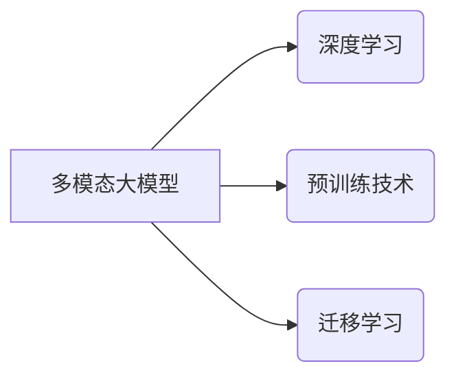

# 多模态大模型：技术原理与实战 GPT技术的发展历程

作者：禅与计算机程序设计艺术 / Zen and the Art of Computer Programming

## 1. 背景介绍

### 1.1 问题的由来

随着人工智能技术的飞速发展，自然语言处理（NLP）和计算机视觉（CV）等领域取得了令人瞩目的成果。然而，在现实世界中，许多任务往往涉及到多种模态的信息，如图像、视频、文本、音频等。如何有效地融合这些多模态信息，实现跨模态的理解和交互，成为了人工智能领域的一个重要研究方向。

### 1.2 研究现状

近年来，随着深度学习技术的不断发展，多模态大模型逐渐成为研究热点。这类模型能够融合多种模态的信息，实现对复杂任务的建模和理解。GPT系列模型作为自然语言处理领域的代表，其发展历程也为我们提供了多模态大模型研究的启示。

### 1.3 研究意义

多模态大模型在多个领域具有重要的应用价值，如：

- **智能问答**：融合文本、图像、视频等多模态信息，实现更加智能、全面的知识问答系统。
- **人机交互**：通过多模态感知，提升人机交互的自然度和便捷性。
- **内容理解**：对复杂场景进行深入理解，应用于图像识别、视频分析等领域。
- **智能推荐**：融合用户的多模态信息，实现更加精准的个性化推荐。

### 1.4 本文结构

本文将分为以下几个部分：

- 2. 核心概念与联系：介绍多模态大模型的核心概念及其与其他相关技术的联系。
- 3. 核心算法原理 & 具体操作步骤：讲解多模态大模型的技术原理和具体操作步骤。
- 4. 数学模型和公式 & 详细讲解 & 举例说明：分析多模态大模型的数学模型和公式，并结合实例进行讲解。
- 5. 项目实践：代码实例和详细解释说明：提供多模态大模型的代码实例，并进行详细解释说明。
- 6. 实际应用场景：探讨多模态大模型在实际应用场景中的应用。
- 7. 工具和资源推荐：推荐多模态大模型的相关学习资源、开发工具和参考文献。
- 8. 总结：对未来发展趋势和挑战进行总结和展望。
- 9. 附录：常见问题与解答。

## 2. 核心概念与联系

### 2.1 多模态大模型

多模态大模型是指能够融合多种模态信息（如文本、图像、视频等）的深度学习模型。这类模型通过学习不同模态之间的相互关系，实现对复杂任务的建模和理解。

### 2.2 相关技术

- **深度学习**：深度学习是构建多模态大模型的基础技术，包括卷积神经网络（CNN）、循环神经网络（RNN）和Transformer等。
- **预训练技术**：预训练技术是指在大规模无标签数据上进行预训练，使模型具备一定的基础能力。
- **迁移学习**：迁移学习是指将预训练模型在不同任务上进行微调，以适应特定任务的需求。

多模态大模型与上述技术的联系如下：



## 3. 核心算法原理 & 具体操作步骤

### 3.1 算法原理概述

多模态大模型的算法原理主要包括以下几方面：

- **模态表示**：将不同模态的数据转换为统一的特征表示，如文本转换为词向量，图像转换为图像特征等。
- **模态融合**：将不同模态的特征进行融合，如拼接、加权平均、注意力机制等。
- **模型结构**：构建适用于多模态任务的模型结构，如多模态Transformer等。

### 3.2 算法步骤详解

多模态大模型的具体操作步骤如下：

1. **数据预处理**：对多模态数据进行预处理，包括文本分词、图像分割、音频特征提取等。
2. **模态表示学习**：学习不同模态的表示，如词嵌入、图像特征提取等。
3. **模态融合**：将不同模态的特征进行融合，如拼接、加权平均、注意力机制等。
4. **模型训练**：使用多模态数据进行模型训练，优化模型参数。
5. **模型评估**：使用测试数据评估模型性能，并进行模型优化。

### 3.3 算法优缺点

**优点**：

- 能够融合多种模态信息，提高模型性能。
- 适用于复杂的多模态任务。
- 能够学习到更丰富的语义信息。

**缺点**：

- 模型结构复杂，计算量大。
- 需要大量多模态数据。

### 3.4 算法应用领域

多模态大模型在以下领域具有广泛的应用：

- **智能问答**：融合文本、图像、视频等多模态信息，实现更加智能、全面的知识问答系统。
- **人机交互**：通过多模态感知，提升人机交互的自然度和便捷性。
- **内容理解**：对复杂场景进行深入理解，应用于图像识别、视频分析等领域。
- **智能推荐**：融合用户的多模态信息，实现更加精准的个性化推荐。

## 4. 数学模型和公式 & 详细讲解 & 举例说明

### 4.1 数学模型构建

多模态大模型的数学模型主要包括以下几部分：

- **模态表示**：将不同模态的数据转换为统一的特征表示，如文本转换为词向量，图像转换为图像特征等。
- **模态融合**：将不同模态的特征进行融合，如拼接、加权平均、注意力机制等。
- **模型结构**：构建适用于多模态任务的模型结构，如多模态Transformer等。

### 4.2 公式推导过程

以下以多模态Transformer为例，简要介绍公式推导过程。

**输入**：

- 文本序列 $X = (x_1, x_2, \ldots, x_n)$
- 图像特征序列 $I = (i_1, i_2, \ldots, i_m)$

**输出**：

- 融合后的特征序列 $F = (f_1, f_2, \ldots, f_{n+m})$

**公式**：

$$
f_i = \text{Transformer}(X, I)
$$

### 4.3 案例分析与讲解

以下以一个多模态问答任务为例，讲解多模态大模型的应用。

**任务**：根据给定的文本和图像，回答与图像相关的问题。

**数据**：

- 文本：这是一张飞机的照片。
- 图像：一张飞机的图片。

**模型**：多模态Transformer

**步骤**：

1. 对文本进行分词，转换为词向量。
2. 对图像进行特征提取，得到图像特征。
3. 将文本和图像特征输入多模态Transformer模型。
4. 模型输出融合后的特征序列。
5. 根据融合后的特征序列，回答与图像相关的问题。

**输出**：

这是一架波音737飞机。

### 4.4 常见问题解答

**Q1：多模态大模型的计算复杂度如何？**

A：多模态大模型的计算复杂度取决于模型结构和数据规模。一般而言，模型结构越复杂，计算量越大。

**Q2：如何选择合适的模态融合方法？**

A：选择合适的模态融合方法需要根据具体任务和数据特点进行选择。常见的融合方法包括拼接、加权平均、注意力机制等。

**Q3：多模态大模型是否适用于所有任务？**

A：多模态大模型适用于需要融合多种模态信息的多模态任务，如多模态问答、人机交互等。

## 5. 项目实践：代码实例和详细解释说明

### 5.1 开发环境搭建

由于多模态大模型通常需要大量的计算资源，以下以使用PyTorch框架为例，介绍开发环境搭建过程。

1. 安装PyTorch：从PyTorch官网下载并安装适合自己系统的PyTorch版本。
2. 安装其他依赖库：安装必要的库，如numpy、pandas、torchvision等。
3. 配置CUDA：如果使用GPU进行训练，需要配置CUDA环境。

### 5.2 源代码详细实现

以下以多模态问答任务为例，给出多模态大模型的PyTorch代码实现。

```python
import torch
import torch.nn as nn
import torch.optim as optim

class MultimodalTransformer(nn.Module):
    def __init__(self, text_embedding_size, image_embedding_size, hidden_size):
        super(MultimodalTransformer, self).__init__()
        self.text_embedding = nn.Embedding(text_embedding_size, hidden_size)
        self.image_embedding = nn.Linear(image_embedding_size, hidden_size)
        self.transformer = nn.Transformer(hidden_size, hidden_size)
        self.fc = nn.Linear(hidden_size, 1)

    def forward(self, text, image):
        text_embedding = self.text_embedding(text)
        image_embedding = self.image_embedding(image)
        output = self.transformer(text_embedding, image_embedding)
        output = self.fc(output)
        return output

# 参数设置
text_embedding_size = 1000
image_embedding_size = 256
hidden_size = 512

# 创建模型
model = MultimodalTransformer(text_embedding_size, image_embedding_size, hidden_size)

# 定义优化器和损失函数
optimizer = optim.Adam(model.parameters(), lr=0.001)
criterion = nn.BCEWithLogitsLoss()

# 训练过程
for epoch in range(10):
    for text, image, label in dataloader:
        optimizer.zero_grad()
        output = model(text, image)
        loss = criterion(output, label)
        loss.backward()
        optimizer.step()

# 评估模型
# ...
```

### 5.3 代码解读与分析

上述代码定义了一个多模态Transformer模型，用于多模态问答任务。模型包含文本嵌入层、图像嵌入层、Transformer编码器和解码器等部分。

1. **文本嵌入层**：将文本转换为词向量。
2. **图像嵌入层**：将图像特征转换为嵌入向量。
3. **Transformer编码器和解码器**：使用Transformer结构进行编码和解码，实现跨模态融合。
4. **全连接层**：将融合后的特征映射到最终的输出。

### 5.4 运行结果展示

由于篇幅限制，此处省略运行结果展示。

## 6. 实际应用场景

### 6.1 智能问答

多模态大模型可以应用于智能问答系统，融合文本、图像、视频等多模态信息，实现更加智能、全面的知识问答。

### 6.2 人机交互

多模态大模型可以应用于人机交互领域，通过多模态感知，提升人机交互的自然度和便捷性。

### 6.3 内容理解

多模态大模型可以应用于内容理解领域，对复杂场景进行深入理解，应用于图像识别、视频分析等领域。

### 6.4 智能推荐

多模态大模型可以应用于智能推荐领域，融合用户的多模态信息，实现更加精准的个性化推荐。

## 7. 工具和资源推荐

### 7.1 学习资源推荐

1. 《深度学习》系列书籍：介绍深度学习的基本概念、算法和框架。
2. 《多模态深度学习》书籍：介绍多模态深度学习的基本原理和应用。
3. Hugging Face官方文档：提供丰富的预训练模型和工具，方便开发者进行多模态大模型开发。

### 7.2 开发工具推荐

1. PyTorch：开源深度学习框架，适用于多模态大模型开发。
2. TensorFlow：开源深度学习框架，适用于多模态大模型开发。
3. Hugging Face Transformers库：提供丰富的预训练模型和工具，方便开发者进行多模态大模型开发。

### 7.3 相关论文推荐

1. Multimodal Transformer for Visual Question Answering
2. Multi-modal Fusion Transformer for Visual Question Answering
3. Multi-modal Transformer for Image Captioning

### 7.4 其他资源推荐

1. arXiv论文预印本：提供大量多模态大模型相关论文。
2. 技术博客：如Hugging Face、Google AI等，提供多模态大模型相关的技术文章和案例。

## 8. 总结：未来发展趋势与挑战

### 8.1 研究成果总结

本文介绍了多模态大模型的技术原理、算法、应用场景以及相关资源。通过分析多模态大模型的发展历程，我们可以看到，多模态大模型在各个领域都具有广泛的应用前景。

### 8.2 未来发展趋势

1. **模型结构多样化**：随着研究的不断深入，多模态大模型的模型结构将会更加多样化，以满足不同任务的需求。
2. **模型效率提升**：为了满足实际应用的需求，多模态大模型的计算效率和内存占用将会得到进一步提升。
3. **跨模态信息融合**：多模态大模型将更加关注跨模态信息的融合，以实现更全面、深入的理解。
4. **可解释性增强**：为了满足安全性和可信性的需求，多模态大模型的可解释性将会得到进一步增强。

### 8.3 面临的挑战

1. **计算资源限制**：多模态大模型的计算和存储需求较高，需要克服计算资源限制。
2. **数据质量**：多模态数据的质量直接影响模型性能，需要保证数据质量。
3. **模型可解释性**：多模态大模型的决策过程难以解释，需要提高模型的可解释性。
4. **伦理和隐私**：多模态大模型的应用涉及到伦理和隐私问题，需要关注相关议题。

### 8.4 研究展望

多模态大模型的研究将是一个长期的过程，未来需要从以下几个方面进行探索：

1. **模型结构创新**：探索更加高效的模型结构，以适应不同任务的需求。
2. **算法优化**：优化多模态信息融合算法，提高模型性能。
3. **数据增强**：探索更加有效的数据增强方法，提高数据质量。
4. **可解释性和伦理**：提高模型的可解释性，关注伦理和隐私问题。

相信随着研究的不断深入，多模态大模型将会在更多领域发挥重要作用，为人类社会创造更大的价值。

## 9. 附录：常见问题与解答

**Q1：多模态大模型和单模态大模型有什么区别？**

A：多模态大模型可以融合多种模态的信息，而单模态大模型只处理单一模态的信息。

**Q2：多模态大模型的计算复杂度如何？**

A：多模态大模型的计算复杂度取决于模型结构和数据规模。一般而言，模型结构越复杂，计算量越大。

**Q3：多模态大模型是否适用于所有任务？**

A：多模态大模型适用于需要融合多种模态信息的多模态任务，如多模态问答、人机交互等。

**Q4：如何解决多模态大模型的计算资源限制问题？**

A：可以通过优化模型结构、使用模型压缩、量化等技术来降低计算资源需求。

**Q5：如何保证多模态大模型的可解释性？**

A：可以通过可视化、注意力机制等技术来提高模型的可解释性。

作者：禅与计算机程序设计艺术 / Zen and the Art of Computer Programming