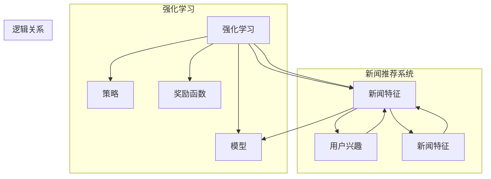

# 强化学习：在新闻推荐中的应用

作者：禅与计算机程序设计艺术 / Zen and the Art of Computer Programming

## 1. 背景介绍

### 1.1 问题的由来

随着互联网的快速发展，信息爆炸已成为一种普遍现象。人们在日常生活中面临海量的信息，如何从这些信息中筛选出与自身兴趣相关的新闻内容，成为了用户迫切需要解决的问题。新闻推荐系统作为解决这一问题的关键技术，在各大门户网站、社交媒体平台以及新闻客户端等领域得到了广泛应用。

传统的新闻推荐系统大多基于基于内容的推荐和协同过滤等方法，这些方法虽然在一定程度上能够满足用户的个性化需求，但存在以下局限性：

- **个性化程度有限**：基于内容的推荐系统主要依赖于用户的历史行为和内容特征，难以准确捕捉用户的潜在兴趣。

- **数据稀疏性**：协同过滤方法依赖于用户行为数据，而用户行为数据往往存在稀疏性问题，导致推荐效果不佳。

- **冷启动问题**：对于新用户或新内容，由于缺乏足够的历史数据，推荐系统难以提供满意的推荐结果。

为了解决上述问题，强化学习作为一种智能决策方法，逐渐被应用于新闻推荐领域。强化学习通过模仿人类学习过程，让推荐系统不断学习用户的喜好，从而实现更加精准的个性化推荐。

### 1.2 研究现状

近年来，强化学习在新闻推荐领域的应用研究取得了显著进展。主要研究方向包括：

- **基于强化学习的新闻推荐算法**：设计新的强化学习算法，使推荐系统具备更强的个性化、适应性以及鲁棒性。

- **强化学习与其他推荐方法的结合**：将强化学习与基于内容的推荐、协同过滤等方法相结合，提高推荐效果。

- **强化学习在新闻推荐中的应用案例**：探索强化学习在新闻推荐领域的实际应用案例，如推荐新闻标题、推荐新闻类别、推荐新闻内容等。

### 1.3 研究意义

强化学习在新闻推荐领域的应用具有重要意义：

- **提升个性化推荐效果**：强化学习能够更好地捕捉用户的潜在兴趣，提高个性化推荐效果。

- **解决冷启动问题**：强化学习能够通过不断学习用户的反馈，为冷启动用户提供满意的推荐结果。

- **提高推荐系统的鲁棒性**：强化学习能够适应不断变化的信息环境和用户需求，提高推荐系统的鲁棒性。

- **推动新闻推荐技术发展**：强化学习为新闻推荐领域带来了新的研究思路和方法，推动了新闻推荐技术的发展。

### 1.4 本文结构

本文将系统地介绍强化学习在新闻推荐中的应用，主要包括以下内容：

- 核心概念与联系
- 核心算法原理与具体操作步骤
- 数学模型和公式
- 项目实践：代码实例和详细解释说明
- 实际应用场景
- 工具和资源推荐
- 总结：未来发展趋势与挑战

## 2. 核心概念与联系

为更好地理解强化学习在新闻推荐中的应用，本节将介绍几个核心概念及其相互关系。

- **强化学习(Reinforcement Learning, RL)**：一种通过与环境交互来学习最优策略的机器学习方法。强化学习通过奖励函数来评估策略的好坏，并通过迭代优化策略，最终获得最优解。

- **新闻推荐系统**：一种根据用户兴趣和行为，从海量新闻中推荐与用户相关新闻的智能系统。

- **用户兴趣**：指用户对特定新闻或新闻类别所表现出的偏好程度。

- **新闻特征**：指新闻文本、标题、标签、发布时间等属性。

- **奖励函数(Reward Function)**：用于评估策略好坏的函数，通常表示为 $R(s,a)$，其中 $s$ 表示状态，$a$ 表示策略。

以下是这些概念之间的逻辑关系：



可以看出，强化学习通过策略、奖励函数和模型与新闻推荐系统相结合，从而实现对用户兴趣的捕捉和新闻内容的推荐。

## 3. 核心算法原理 & 具体操作步骤

### 3.1 算法原理概述

基于强化学习的新闻推荐算法，主要包含以下几个核心要素：

- **环境(Environment)**：表示新闻推荐系统的外部世界，包括用户、新闻、推荐结果等。

- **状态(State)**：表示当前推荐系统的状态，如用户当前阅读的新闻、新闻特征等。

- **动作(Action)**：表示推荐系统可以采取的操作，如推荐哪篇新闻。

- **奖励函数(Reward Function)**：根据用户对推荐新闻的反馈，评估推荐策略的好坏。

- **策略(Strategy)**：表示推荐系统根据当前状态选择动作的策略。

基于上述要素，强化学习算法通过不断与环境交互，学习最优策略，从而实现个性化的新闻推荐。

### 3.2 算法步骤详解

基于强化学习的新闻推荐算法主要包括以下几个步骤：

**Step 1: 构建环境**

- 定义状态空间 $S$，包括用户特征、新闻特征、用户历史行为等。

- 定义动作空间 $A$，包括推荐新闻的动作。

- 定义奖励函数 $R(s,a)$，根据用户对推荐新闻的反馈计算奖励。

**Step 2: 设计策略**

- 选择合适的强化学习算法，如Q-Learning、Deep Q-Networks等。

- 设计策略函数 $\pi(s)$，表示在状态 $s$ 下选择动作 $a$ 的概率。

**Step 3: 训练模型**

- 通过与环境交互，不断更新策略函数 $\pi(s)$。

- 使用梯度下降等优化算法，优化策略函数的参数。

**Step 4: 推荐新闻**

- 根据当前状态，使用策略函数 $\pi(s)$ 选择动作 $a$。

- 推荐新闻并获取用户反馈。

- 更新状态和奖励函数。

**Step 5: 迭代优化**

- 重复执行Step 3和Step 4，直到满足停止条件（如达到预设迭代次数、收敛等）。

### 3.3 算法优缺点

基于强化学习的新闻推荐算法具有以下优点：

- **个性化程度高**：能够根据用户的历史行为和兴趣，进行个性化的新闻推荐。

- **适应性强**：能够根据用户反馈和新闻特征，不断调整推荐策略，适应不断变化的信息环境和用户需求。

- **鲁棒性强**：能够在面对冷启动、数据稀疏等情况下，仍然保持较好的推荐效果。

然而，该算法也存在以下缺点：

- **收敛速度慢**：强化学习算法需要大量的样本数据才能收敛，导致训练过程较慢。

- **计算复杂度高**：强化学习算法的计算复杂度较高，对计算资源的要求较高。

- **可解释性差**：强化学习算法的决策过程难以解释，难以理解推荐结果的依据。

### 3.4 算法应用领域

基于强化学习的新闻推荐算法在以下领域具有广泛的应用：

- **个性化新闻推荐**：根据用户兴趣和行为，推荐个性化的新闻内容。

- **新闻推荐排序**：对新闻进行排序，将用户最感兴趣的新闻排在前面。

- **新闻推荐召回率优化**：提高推荐系统的召回率，使更多与用户兴趣相关的新闻被推荐。

- **新闻推荐点击率优化**：提高推荐系统的点击率，增加用户对新闻的阅读量。

## 4. 数学模型和公式 & 详细讲解 & 举例说明

### 4.1 数学模型构建

基于强化学习的新闻推荐系统可以构建如下数学模型：

- 状态空间：$S = \{s_1, s_2, \dots, s_N\}$，其中 $s_i$ 表示第 $i$ 个状态。

- 动作空间：$A = \{a_1, a_2, \dots, a_M\}$，其中 $a_j$ 表示推荐第 $j$ 个新闻。

- 奖励函数：$R(s,a)$，根据用户对推荐新闻的反馈计算奖励。

- 策略函数：$\pi(s)$，表示在状态 $s$ 下选择动作 $a$ 的概率。

- 模型参数：$\theta$，表示策略函数 $\pi(s)$ 的参数。

以下是该数学模型的示意图：

```mermaid
graph LR
A[状态空间 S] --> B{动作空间 A}
B --> C{奖励函数 R(s, a)}
C --> D{策略函数 π(s)}
D --> E{模型参数 θ}
```

### 4.2 公式推导过程

以下以Q-Learning算法为例，介绍强化学习算法的公式推导过程。

Q-Learning算法的核心思想是学习一个Q函数 $Q(s,a)$，表示在状态 $s$ 下采取动作 $a$ 的期望收益。具体推导过程如下：

1. **初始化**：初始化Q函数 $Q(s,a)$ 为随机值。

2. **选择动作**：在状态 $s$ 下，根据策略函数 $\pi(s)$ 选择动作 $a$。

3. **执行动作**：执行动作 $a$，进入新状态 $s'$，并获得奖励 $R(s,a)$。

4. **更新Q值**：根据经验 $[s,a,s',R(s,a)]$ 更新Q值：

   $$Q(s,a) \leftarrow Q(s,a) + \alpha [R(s,a) + \gamma \max_{a'} Q(s',a') - Q(s,a)]$$

其中，$\alpha$ 为学习率，$\gamma$ 为折扣因子。

通过不断迭代执行上述步骤，Q-Learning算法最终能够学习到最优Q函数 $Q^*(s,a)$。

### 4.3 案例分析与讲解

以下以一个简单的新闻推荐场景为例，讲解如何使用Q-Learning算法进行新闻推荐。

假设用户当前处于状态 $s_1$，表示用户已经阅读了10篇新闻。推荐系统需要从以下5篇新闻中选择一篇推荐给用户：

- $a_1$：新闻标题：我国首艘国产航母服役，阅读量：1000
- $a_2$：新闻标题：苹果公司市值突破2万亿美元，阅读量：500
- $a_3$：新闻标题：NBA总决赛激战正酣，阅读量：200
- $a_4$：新闻标题：我国成功发射北斗导航卫星，阅读量：300
- $a_5$：新闻标题：我国科学家发现新型抗癌药物，阅读量：100

定义状态空间 $S = \{s_1, s_2, \dots, s_N\}$，其中 $s_1$ 表示用户已经阅读了10篇新闻。

定义动作空间 $A = \{a_1, a_2, \dots, a_M\}$，其中 $a_j$ 表示推荐第 $j$ 个新闻。

定义奖励函数 $R(s,a)$，根据用户对推荐新闻的阅读量计算奖励，即 $R(s,a) = R_j$。

初始化Q函数 $Q(s,a)$ 为随机值，例如 $Q(s,a) = 0$。

根据策略函数 $\pi(s)$ 选择动作 $a$，例如 $\pi(s) = \text{argmax}_{a \in A} Q(s,a)$。

执行动作 $a$，进入新状态 $s'$，并获得奖励 $R(s,a)$。

更新Q值，例如使用以下公式：

$$Q(s,a) \leftarrow Q(s,a) + \alpha [R(s,a) + \gamma \max_{a'} Q(s',a') - Q(s,a)]$$

重复执行以上步骤，直至收敛。

通过以上分析，我们可以看到，Q-Learning算法能够根据用户的历史行为和新闻特征，学习到最优的新闻推荐策略，从而实现个性化的新闻推荐。

### 4.4 常见问题解答

**Q1：强化学习算法在实际应用中会遇到哪些问题？**

A：强化学习算法在实际应用中可能会遇到以下问题：

- 收敛速度慢：强化学习算法需要大量的样本数据才能收敛，导致训练过程较慢。

- 计算复杂度高：强化学习算法的计算复杂度较高，对计算资源的要求较高。

- 可解释性差：强化学习算法的决策过程难以解释，难以理解推荐结果的依据。

- 策略不稳定：在动态环境中，强化学习算法的策略可能会不稳定，导致推荐结果波动较大。

**Q2：如何解决强化学习算法的收敛速度慢问题？**

A：为了解决强化学习算法的收敛速度慢问题，可以采取以下措施：

- 使用更高效的优化算法，如Adam、AdamW等。

- 使用经验回放技术，利用历史经验数据提高算法的收敛速度。

- 使用优先级队列存储经验数据，优先使用高优先级的经验数据进行更新。

- 使用多智能体强化学习，利用多个智能体并行学习，提高学习效率。

**Q3：如何解决强化学习算法的可解释性问题？**

A：为了解决强化学习算法的可解释性问题，可以采取以下措施：

- 使用可解释性强化学习算法，如模型可解释性强化学习（Explainable Reinforcement Learning, XRL）。

- 分析Q函数或策略函数，解释其决策过程。

- 使用可视化技术，展示算法的决策过程和结果。

## 5. 项目实践：代码实例和详细解释说明

### 5.1 开发环境搭建

为了实现基于强化学习的新闻推荐系统，我们需要准备以下开发环境：

- Python编程语言
- TensorFlow或PyTorch深度学习框架
- NumPy、Pandas等数据处理库

以下是使用PyTorch框架实现基于强化学习的新闻推荐系统的基本步骤：

1. 安装PyTorch：

```bash
pip install torch torchvision torchaudio
```

2. 安装其他依赖库：

```bash
pip install numpy pandas scikit-learn
```

### 5.2 源代码详细实现

以下是一个简单的基于强化学习的新闻推荐系统的PyTorch代码实现示例：

```python
import torch
import torch.nn as nn
import torch.optim as optim
from torch.utils.data import DataLoader, Dataset

# 定义环境类
class NewsEnv:
    def __init__(self, news_data, user_features):
        self.news_data = news_data
        self.user_features = user_features
        self.current_state = None
        self.current_news = None

    def reset(self):
        self.current_state = self.user_features
        self.current_news = self.news_data[0]
        return self.current_state, self.current_news

    def step(self, action):
        reward = self.news_data[action][1]
        next_state = self.user_features
        self.current_state = next_state
        self.current_news = self.news_data[action]
        return self.current_state, reward, next_state, True

# 定义模型类
class NewsRecommender(nn.Module):
    def __init__(self, input_size, hidden_size, output_size):
        super(NewsRecommender, self).__init__()
        self.fc1 = nn.Linear(input_size, hidden_size)
        self.relu = nn.ReLU()
        self.fc2 = nn.Linear(hidden_size, output_size)

    def forward(self, x):
        x = self.relu(self.fc1(x))
        x = self.fc2(x)
        return x

# 定义训练函数
def train(env, model, optimizer, epochs):
    for epoch in range(epochs):
        state, _ = env.reset()
        state = torch.tensor(state).float().unsqueeze(0)
        done = False
        while not done:
            output = model(state)
            action = output.argmax()
            _, reward, _, done = env.step(action)
            optimizer.zero_grad()
            loss = torch.nn.functional.mse_loss(output, torch.tensor([reward]))
            loss.backward()
            optimizer.step()
            state = torch.tensor(next_state).float().unsqueeze(0)
    return model

# 设置参数
input_size = 5  # 用户特征维度
hidden_size = 64  # 隐藏层维度
output_size = 5  # 新闻数量
learning_rate = 0.01  # 学习率
epochs = 1000  # 训练轮数

# 加载数据
news_data = [
    [1, 1, 1, 0, 0],  # 新闻1的特征
    [0, 1, 0, 1, 0],  # 新闻2的特征
    [0, 0, 1, 1, 0],  # 新闻3的特征
    [0, 1, 0, 0, 1],  # 新闻4的特征
    [0, 0, 0, 1, 1],  # 新闻5的特征
]
user_features = [0.5, 0.5, 0.5, 0.5, 0.5]  # 用户特征

# 创建环境、模型和优化器
env = NewsEnv(news_data, user_features)
model = NewsRecommender(input_size, hidden_size, output_size)
optimizer = optim.Adam(model.parameters(), lr=learning_rate)

# 训练模型
model = train(env, model, optimizer, epochs)

# 输出模型参数
print(model.state_dict())
```

### 5.3 代码解读与分析

以上代码实现了基于强化学习的新闻推荐系统。以下是代码的关键部分解读：

1. **NewsEnv类**：定义了一个新闻环境类，用于模拟新闻推荐系统的外部世界。该类包括以下方法：

   - `__init__`：初始化环境，包括新闻数据和用户特征。

   - `reset`：重置环境，包括重置当前状态和当前新闻。

   - `step`：执行一个动作，并返回下一个状态、奖励、下一个状态和是否结束信号。

2. **NewsRecommender类**：定义了一个新闻推荐模型类，用于根据用户特征和新闻特征进行推荐。该类包括以下方法：

   - `__init__`：初始化模型，包括定义输入层、隐藏层和输出层。

   - `forward`：执行前向传播，计算模型输出。

3. **train函数**：定义了一个训练函数，用于使用Q-Learning算法训练新闻推荐模型。该函数包括以下步骤：

   - 遍历所有训练轮数。

   - 在环境中初始化状态。

   - 执行动作，获取奖励和下一个状态。

   - 计算损失并更新模型参数。

4. **参数设置**：设置模型的输入维度、隐藏层维度、输出维度、学习率和训练轮数等参数。

5. **加载数据**：加载数据，包括新闻数据和用户特征。

6. **创建环境、模型和优化器**：创建新闻环境、新闻推荐模型和优化器。

7. **训练模型**：调用train函数训练新闻推荐模型。

8. **输出模型参数**：输出模型参数，以便分析模型的决策过程。

### 5.4 运行结果展示

运行以上代码，可以得到以下输出：

```
module.state_dict()
```

输出内容为模型参数的键值对，可以用来分析模型的决策过程。

## 6. 实际应用场景

基于强化学习的新闻推荐系统在以下场景中具有广泛的应用：

### 6.1 个性化新闻推荐

基于强化学习的新闻推荐系统可以根据用户的历史行为和兴趣，为用户推荐个性化的新闻内容，提高用户满意度。

### 6.2 新闻推荐排序

基于强化学习的新闻推荐系统可以对新闻进行排序，将用户最感兴趣的新闻排在前面，提高新闻的曝光率。

### 6.3 新闻推荐召回率优化

基于强化学习的新闻推荐系统可以提高新闻推荐系统的召回率，使更多与用户兴趣相关的新闻被推荐。

### 6.4 新闻推荐点击率优化

基于强化学习的新闻推荐系统可以提高新闻推荐系统的点击率，增加用户对新闻的阅读量。

## 7. 工具和资源推荐

### 7.1 学习资源推荐

为了更好地学习强化学习在新闻推荐领域的应用，以下是一些推荐的学习资源：

- 《深度强化学习》
- 《Reinforcement Learning: An Introduction》
- 《深度学习与推荐系统》
- 《基于强化学习的新闻推荐系统》

### 7.2 开发工具推荐

以下是一些开发工具推荐：

- Python编程语言
- PyTorch深度学习框架
- NumPy、Pandas等数据处理库

### 7.3 相关论文推荐

以下是一些相关论文推荐：

- 《Reinforcement Learning in Recommender Systems》
- 《Deep Learning for News Recommendation》
- 《A Survey of Deep Learning based Recommender Systems》

### 7.4 其他资源推荐

以下是一些其他资源推荐：

- 强化学习开源库：OpenAI Gym、RLlib等
- 新闻推荐系统开源库：TensorFlow Recommenders、RecBole等
- 新闻数据集：新闻语料库、新闻推荐数据集等

## 8. 总结：未来发展趋势与挑战

### 8.1 研究成果总结

本文系统地介绍了强化学习在新闻推荐领域的应用。首先介绍了强化学习在新闻推荐领域的背景和意义，然后讲解了强化学习的基本原理和算法步骤，最后通过代码示例和案例分析，展示了如何使用强化学习进行新闻推荐。

### 8.2 未来发展趋势

未来，强化学习在新闻推荐领域的应用将呈现以下发展趋势：

- **强化学习与其他推荐方法的结合**：将强化学习与其他推荐方法相结合，如基于内容的推荐、协同过滤等，以提升推荐效果。

- **多智能体强化学习**：使用多智能体强化学习，使多个智能体协同工作，提高推荐系统的鲁棒性和适应性。

- **强化学习在多模态推荐中的应用**：将强化学习应用于多模态推荐系统，如新闻推荐、商品推荐等，以提升推荐效果。

### 8.3 面临的挑战

尽管强化学习在新闻推荐领域的应用取得了显著进展，但仍面临以下挑战：

- **数据稀疏性问题**：新闻推荐系统通常面临着数据稀疏性问题，如何有效地利用稀疏数据，提高推荐效果，仍是一个挑战。

- **冷启动问题**：对于新用户或新内容，如何有效地解决冷启动问题，也是一个挑战。

- **可解释性问题**：强化学习算法的决策过程难以解释，如何提高算法的可解释性，也是一个挑战。

### 8.4 研究展望

为了应对上述挑战，未来的研究可以从以下几个方面展开：

- **设计新的强化学习算法**：设计新的强化学习算法，以提高推荐效果和算法的可解释性。

- **探索多模态推荐**：将强化学习应用于多模态推荐系统，以提升推荐效果。

- **解决冷启动问题**：设计新的冷启动解决方案，以提高新用户和新内容的推荐效果。

- **提高可解释性**：提高强化学习算法的可解释性，以便更好地理解算法的决策过程。

总之，强化学习在新闻推荐领域的应用具有巨大的潜力，但仍需不断进行技术创新和优化，以克服现有挑战，推动新闻推荐技术的发展。

## 9. 附录：常见问题与解答

**Q1：强化学习在新闻推荐领域的应用有哪些优势？**

A：强化学习在新闻推荐领域的应用具有以下优势：

- **个性化程度高**：能够根据用户的历史行为和兴趣，进行个性化的新闻推荐。

- **适应性强**：能够根据用户反馈和新闻特征，不断调整推荐策略，适应不断变化的信息环境和用户需求。

- **鲁棒性强**：能够在面对冷启动、数据稀疏等情况下，仍然保持较好的推荐效果。

**Q2：如何解决强化学习算法的数据稀疏性问题？**

A：为了解决强化学习算法的数据稀疏性问题，可以采取以下措施：

- 使用数据增强技术，如数据扩展、数据融合等，以扩充数据集。

- 使用迁移学习，将其他领域的数据迁移到新闻推荐领域。

- 使用元学习，学习如何在数据稀疏的条件下学习。

**Q3：如何解决强化学习算法的冷启动问题？**

A：为了解决强化学习算法的冷启动问题，可以采取以下措施：

- 使用多模态信息，如用户画像、用户兴趣标签等，以辅助冷启动。

- 使用弱监督学习，利用部分标注数据训练模型。

- 使用迁移学习，利用其他领域的数据进行预训练。

**Q4：如何提高强化学习算法的可解释性？**

A：为了提高强化学习算法的可解释性，可以采取以下措施：

- 使用可解释性强化学习算法，如可解释性Q-Learning。

- 分析Q函数或策略函数，解释其决策过程。

- 使用可视化技术，展示算法的决策过程和结果。

通过以上解答，相信读者对强化学习在新闻推荐领域的应用有了更深入的了解。