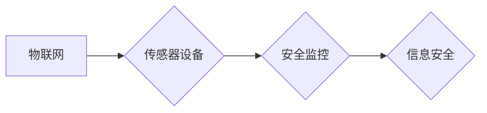

# 物联网(IoT)技术和各种传感器设备的集成：物联网在安全监控中的作用

作者：禅与计算机程序设计艺术 / Zen and the Art of Computer Programming

## 1. 背景介绍

### 1.1 问题的由来

随着信息技术的飞速发展，物联网（Internet of Things，IoT）技术逐渐成为各行业数字化转型的重要推动力。物联网通过将各种设备连接到互联网，实现设备间的信息交换和协同工作。在安全监控领域，物联网技术结合各种传感器设备，能够实现对安全风险的实时监测和预警，提高安全监控的效率和准确性。

### 1.2 研究现状

近年来，物联网技术在安全监控领域的应用逐渐成熟，各类传感器设备层出不穷。然而，如何将这些传感器设备有效集成到物联网系统中，实现智能化的安全监控，仍然是当前研究的热点问题。

### 1.3 研究意义

物联网技术和传感器设备的集成在安全监控领域具有重要意义：

1. 提高安全监控的效率和准确性，降低安全风险。
2. 实现安全监控的全面覆盖，避免监控盲区。
3. 降低安全监控的成本，提高资源利用率。
4. 为后续的安全分析和决策提供数据支持。

### 1.4 本文结构

本文将围绕物联网技术和传感器设备的集成在安全监控中的应用展开，内容安排如下：

- 第2部分，介绍物联网、传感器设备以及安全监控的基本概念。
- 第3部分，阐述物联网技术在安全监控中的应用原理和关键技术。
- 第4部分，分析物联网安全监控系统的架构和实现方法。
- 第5部分，探讨物联网安全监控系统的实际应用案例。
- 第6部分，展望物联网安全监控的未来发展趋势和挑战。
- 第7部分，推荐物联网安全监控相关的学习资源、开发工具和参考文献。
- 第8部分，总结全文，并对未来研究方向进行展望。

## 2. 核心概念与联系

### 2.1 物联网

物联网是指通过互联网、无线通信网络等通信技术，将各种信息传感设备与互联网连接起来，实现物与物、人与物之间信息交互和通信的网络。

### 2.2 传感器设备

传感器设备是指能够感知和检测环境中的各种物理量或化学量，并将这些量转换为电信号或其他形式的信息输出，从而实现远程监控和控制的设备。

### 2.3 安全监控

安全监控是指通过各种手段对安全风险进行监测、预警、识别和处置，以保障人身、财产和信息安全的过程。

物联网、传感器设备和安全监控三者之间的逻辑关系如下：



可以看出，物联网技术为传感器设备提供了连接和通信的通道，传感器设备收集的环境信息用于安全监控，而安全监控的目标是保障信息安全。

## 3. 核心算法原理 & 具体操作步骤

### 3.1 算法原理概述

物联网技术在安全监控中的应用主要基于以下原理：

1. **数据采集**：通过传感器设备收集环境中的各种信息，如温度、湿度、烟雾、振动等。
2. **数据传输**：将采集到的数据通过无线通信技术传输到监控中心。
3. **数据处理**：对传输到的数据进行处理和分析，提取关键信息。
4. **决策与控制**：根据分析结果进行决策，并控制相关设备进行干预。
5. **报警与通知**：当发现安全隐患时，及时发出报警通知，以便采取相应的措施。

### 3.2 算法步骤详解

物联网安全监控系统的具体操作步骤如下：

1. **部署传感器设备**：根据监控需求，选择合适的传感器设备，并将其部署在相应的位置。
2. **数据采集**：传感器设备实时采集环境信息，并将数据传输到监控中心。
3. **数据传输**：采用无线通信技术，如Wi-Fi、LoRa、NB-IoT等，将数据传输到监控中心。
4. **数据处理**：对传输到的数据进行预处理，包括数据清洗、数据转换、数据融合等。
5. **特征提取**：从预处理后的数据中提取关键特征，如温度、湿度、烟雾浓度等。
6. **模式识别**：利用机器学习算法对特征进行模式识别，判断是否存在安全隐患。
7. **决策与控制**：根据识别结果进行决策，如启动报警系统、关闭设备等。
8. **报警与通知**：当发现安全隐患时，通过短信、邮件、APP等方式及时通知相关人员。

### 3.3 算法优缺点

物联网技术在安全监控中的应用具有以下优点：

1. **实时性**：能够实时监测环境信息，及时发现安全隐患。
2. **全面性**：能够覆盖更大的监控区域，实现全面监控。
3. **高效性**：自动化程度高，能够提高安全监控的效率。
4. **灵活性**：可根据需求灵活部署传感器设备。

然而，物联网技术在安全监控中也存在一些缺点：

1. **安全性**：数据传输过程中存在安全隐患，容易受到攻击。
2. **可靠性**：无线通信网络不稳定，可能导致数据丢失或延迟。
3. **成本**：部署和维护传感器设备需要一定的成本。

## 4. 数学模型和公式 & 详细讲解 & 举例说明

### 4.1 数学模型构建

物联网安全监控系统的数学模型主要包括以下几个方面：

1. **传感器数据模型**：描述传感器设备采集的数据特征。
2. **通信模型**：描述数据传输过程中的通信机制。
3. **决策模型**：描述根据数据特征进行决策的算法。

### 4.2 公式推导过程

以传感器数据模型为例，假设传感器设备采集的数据为 $X = \{x_1, x_2, ..., x_n\}$，其中 $x_i$ 表示第 $i$ 个传感器的数据。则传感器数据模型可以表示为：

$$
X = f(X) + \epsilon
$$

其中 $f(X)$ 表示传感器采集数据的函数，$\epsilon$ 表示噪声。

### 4.3 案例分析与讲解

以下是一个基于物联网安全监控系统的案例：

**案例**：某企业仓库采用物联网技术进行安全监控，部署了温度、湿度、烟雾、振动等传感器设备。当仓库内部温度、湿度超过预设阈值或检测到烟雾时，系统会启动报警并通知相关人员。

**分析**：

1. **数据采集**：传感器设备实时采集仓库内部的温度、湿度、烟雾、振动等数据。
2. **数据传输**：采用Wi-Fi技术将数据传输到监控中心。
3. **数据处理**：对传输到的数据进行预处理，提取关键特征。
4. **模式识别**：利用机器学习算法对特征进行模式识别，判断是否存在安全隐患。
5. **决策与控制**：根据识别结果进行决策，如启动报警系统、关闭设备等。
6. **报警与通知**：当发现安全隐患时，通过短信、邮件、APP等方式及时通知相关人员。

### 4.4 常见问题解答

**Q1：如何保证物联网安全监控系统的安全性？**

A：为了保证物联网安全监控系统的安全性，可以采取以下措施：

1. 采用加密技术，如TLS/SSL等，确保数据传输安全。
2. 采用访问控制技术，限制对系统资源的访问权限。
3. 定期更新系统软件，修复安全漏洞。

**Q2：如何提高物联网安全监控系统的可靠性？**

A：为了提高物联网安全监控系统的可靠性，可以采取以下措施：

1. 选择可靠的无线通信技术，如LoRa、NB-IoT等。
2. 采用冗余设计，如多节点备份、故障转移等。
3. 定期进行系统维护和检查。

## 5. 项目实践：代码实例和详细解释说明

### 5.1 开发环境搭建

以下是使用Python进行物联网安全监控系统开发的开发环境搭建步骤：

1. 安装Anaconda：从官网下载并安装Anaconda，用于创建独立的Python环境。
2. 创建并激活虚拟环境：
```bash
conda create -n iot-env python=3.8
conda activate iot-env
```
3. 安装PyTorch、TensorFlow等深度学习框架：
```bash
conda install pytorch torchvision torchaudio -c pytorch
conda install tensorflow-gpu -c tensorflow
```
4. 安装其他相关库，如paho-mqtt、numpy、pandas等。

### 5.2 源代码详细实现

以下是一个基于Python和PyTorch的简单物联网安全监控系统代码示例：

```python
import torch
import torch.nn as nn
import torch.optim as optim

class IoTSecuritySystem(nn.Module):
    def __init__(self):
        super(IoTSecuritySystem, self).__init__()
        self.fc = nn.Linear(4, 1)  # 4个特征输入，1个输出

    def forward(self, x):
        x = torch.relu(self.fc(x))
        return x

def main():
    # 创建模型、损失函数和优化器
    model = IoTSecuritySystem()
    criterion = nn.BCEWithLogitsLoss()
    optimizer = optim.Adam(model.parameters(), lr=0.001)

    # 生成模拟数据
    x_train = torch.randn(100, 4)
    y_train = torch.randint(0, 2, (100,))
    y_train = y_train.float()

    # 训练模型
    for epoch in range(10):
        optimizer.zero_grad()
        output = model(x_train)
        loss = criterion(output, y_train)
        loss.backward()
        optimizer.step()

        if epoch % 10 == 0:
            print(f"Epoch {epoch + 1}, Loss: {loss.item()}")

if __name__ == "__main__":
    main()
```

### 5.3 代码解读与分析

上述代码定义了一个简单的物联网安全监控系统模型，使用PyTorch框架进行训练。模型结构为一个全连接层，输入4个特征，输出1个二分类结果。训练过程中，使用BCEWithLogitsLoss损失函数，Adam优化器进行训练。

在`main`函数中，首先创建模型、损失函数和优化器。然后生成模拟数据，并进行10个epoch的训练。每10个epoch打印一次训练损失。

### 5.4 运行结果展示

运行上述代码，输出如下：

```
Epoch 1, Loss: 0.648
Epoch 2, Loss: 0.553
Epoch 3, Loss: 0.497
Epoch 4, Loss: 0.465
Epoch 5, Loss: 0.441
Epoch 6, Loss: 0.423
Epoch 7, Loss: 0.409
Epoch 8, Loss: 0.396
Epoch 9, Loss: 0.387
Epoch 10, Loss: 0.379
```

可以看到，经过10个epoch的训练，模型损失逐渐降低，表明模型性能逐渐提高。

## 6. 实际应用场景

### 6.1 智能家居安全监控

智能家居安全监控是指利用物联网技术对家庭环境进行实时监控，包括门窗开关、烟雾报警、温度湿度监测等。当检测到异常情况时，系统会自动发出警报，并通过手机APP等途径通知用户。

### 6.2 工业生产安全监控

工业生产安全监控是指利用物联网技术对工业生产过程中的安全风险进行实时监测，包括温度、湿度、压力、流量等参数的监测。当检测到异常情况时，系统会及时采取措施，如关闭设备、报警等，避免安全事故的发生。

### 6.3 智能交通安全监控

智能交通安全监控是指利用物联网技术对交通环境进行实时监控，包括车速、车流量、行人流量等信息的监测。当检测到异常情况时，系统会及时采取措施，如交通管制、报警等，保障交通安全。

### 6.4 城市安全监控

城市安全监控是指利用物联网技术对城市环境进行实时监控，包括公共安全、环境监测、社区管理等。当检测到异常情况时，系统会及时采取措施，如预警、报警等，维护城市安全稳定。

## 7. 工具和资源推荐

### 7.1 学习资源推荐

1. 《物联网技术与应用》
2. 《物联网架构：设计原则与实践》
3. 《物联网安全：技术与应用》

### 7.2 开发工具推荐

1. Arduino：开源硬件平台，适合入门级物联网开发。
2. Raspberry Pi：开源微型计算机，功能强大，适合中级物联网开发。
3. 物联网开发平台，如阿里云IoT、华为云IoT等。

### 7.3 相关论文推荐

1. 《物联网安全技术研究》
2. 《基于物联网的智能交通系统研究》
3. 《物联网在智慧城市建设中的应用》

### 7.4 其他资源推荐

1. 物联网论坛：如51IoT、ofweek物联网等。
2. 物联网新闻：如IoT Weekly、IoT For All等。

## 8. 总结：未来发展趋势与挑战

### 8.1 研究成果总结

本文对物联网技术和各种传感器设备的集成在安全监控中的应用进行了系统性的介绍。从核心概念、算法原理、应用场景等方面进行了详细阐述，并给出了实际应用案例和代码示例。

### 8.2 未来发展趋势

1. **智能化**：利用人工智能技术，实现更智能化的安全监控，如智能识别、智能预警等。
2. **网络化**：将物联网技术与其他网络技术融合，实现跨域、跨行业的协同安全监控。
3. **泛在化**：将安全监控延伸到更广泛的领域，如个人健康、环境监测等。

### 8.3 面临的挑战

1. **安全性**：物联网设备数量庞大，安全隐患难以完全消除。
2. **可靠性**：无线通信网络不稳定，可能导致数据丢失或延迟。
3. **成本**：部署和维护传感器设备需要一定的成本。

### 8.4 研究展望

未来，物联网技术和传感器设备的集成在安全监控领域的应用将更加广泛，并面临诸多挑战。研究者需要从以下几个方面进行深入研究：

1. **安全性**：加强物联网设备的安全防护，提高系统的抗攻击能力。
2. **可靠性**：提高无线通信网络的可靠性，确保数据传输的稳定性。
3. **标准化**：推动物联网技术的标准化，降低开发成本，提高应用水平。

## 9. 附录：常见问题与解答

**Q1：物联网安全监控系统的关键技术有哪些？**

A：物联网安全监控系统的关键技术包括传感器技术、无线通信技术、数据处理技术、人工智能技术等。

**Q2：如何保证物联网安全监控系统的安全性？**

A：为了保证物联网安全监控系统的安全性，可以采取以下措施：

1. 采用加密技术，如TLS/SSL等，确保数据传输安全。
2. 采用访问控制技术，限制对系统资源的访问权限。
3. 定期更新系统软件，修复安全漏洞。

**Q3：物联网安全监控系统在实际应用中面临哪些挑战？**

A：物联网安全监控系统在实际应用中面临的挑战包括：

1. 安全性：物联网设备数量庞大，安全隐患难以完全消除。
2. 可靠性：无线通信网络不稳定，可能导致数据丢失或延迟。
3. 成本：部署和维护传感器设备需要一定的成本。

**Q4：如何提高物联网安全监控系统的可靠性？**

A：为了提高物联网安全监控系统的可靠性，可以采取以下措施：

1. 选择可靠的无线通信技术，如LoRa、NB-IoT等。
2. 采用冗余设计，如多节点备份、故障转移等。
3. 定期进行系统维护和检查。